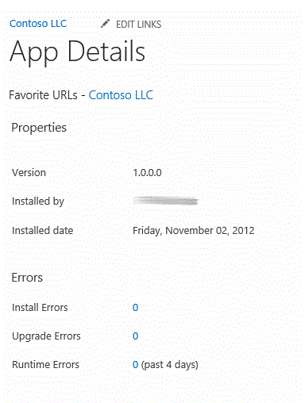

# Sharepoint，將疑難排解的檢測加入至應用程式
了解如何新增至您SharePoint Add-ins監控自訂及增強的執行階段錯誤。
 * **適用於:*** 
  
    
    


|||
|:-----|:-----|
|**本文內容**          [應用程式監視 UI](#AppMonitoringUI)           [使用自訂錯誤 api (英文)](#LogCustomAppError)           [IIS ASP.NET 追蹤](#IISTracing)           [第三方剖析套件](#ProfilingPackages)           [其他資源](#bk_addresources) <br/> |
  
    
    

  
    
    

  
    
    
 [SharePoint 2013: Add runtime instrumentation and error logging to apps](http://code.msdn.microsoft.com/SharePoint-2013-Add-9fdb5182)
  
    
    
 <br/> |
   

良好客戶體驗， SharePoint Add-ins中的執行階段錯誤都必須識別、 分析，並修正輕鬆地從客戶的環境。檢測，可讓。您可以使用內建的監控 Api 及使用者介面 (UI)，以涵蓋基本概念。特別適用於提供者主控應用程式，該應用程式中的強式檢測必須超越記錄例外狀況的郵件。本文說明應用程式監視的內建支援，也會說明三個協助收集及分析您的應用程式的執行階段資訊的開放原始碼套件。
  
    
    


## 應用程式監視 UI
<a name="AppMonitoringUI"> </a>

SharePoint 2013提供方法，讓網站擁有者，以查看您的應用程式，他們可以轉接至您的執行階段錯誤。使用者採取下列步驟。
  
    
    

1. 在 **[網站內容**] 頁面上，反白顯示該應用程式。
    
  
2. 選擇應用程式名稱旁會出現註標連結 (...)。
    
  
3. 圖說文字中，選擇 [ **詳細資料**。這會開啟 [ **詳細資料**] 頁面上的 app 圖 1 顯示錯誤資訊會報告所在的頁面部分。會報告安裝錯誤、 升級錯誤及執行階段錯誤的總數。每個這些號碼是開啟錯誤詳細資料的圖說文字的連結。使用者可以傳送此資訊時，可能是以螢幕擷取畫面。
    
   **圖 1。應用程式詳細資料頁面**

  

     
  

    安裝與升級錯誤都可以在其各自註標幾乎立即之後發生。執行階段錯誤可能需要 5 到 10 分鐘。會出現在 [ **詳細資料**] 頁面每個類別的錯誤數目可能需要更長的時間來更新。
    
  
SharePoint 2013基礎結構報告許多種錯誤。您也可以設計您的應用程式至報表至相同的使用者介面的自訂錯誤。如需詳細資訊，請參閱 ＜ 下一節。
  
    
    

## 使用自訂錯誤 api (英文)
<a name="LogCustomAppError"> </a>

SharePoint 2013的用戶端物件模型的自訂錯誤報告應用程式的 **詳細資料**] 頁面上的兩個靜態方法，包括 [Utility](https://msdn.microsoft.com/library/Microsoft.SharePoint.Client.Utilities.Utility.aspx) 類別：
  
    
    

-  [LogCustomAppError](https://msdn.microsoft.com/library/Microsoft.SharePoint.Client.Utilities.Utility.LogCustomAppError.aspx) 從 SharePoint 主控元件報告錯誤。此方法會永遠從JavaScript中呼叫 (或所參照的) SharePoint 主控的頁面。
    
  
-  [LogCustomRemoteAppError](https://msdn.microsoft.com/library/Microsoft.SharePoint.Client.Utilities.Utility.LogCustomRemoteAppError.aspx) 報告遠端元件的雲端主控應用程式的錯誤。
    
  
以下是呼叫 [LogCustomAppError](https://msdn.microsoft.com/library/Microsoft.SharePoint.Client.Utilities.Utility.LogCustomAppError.aspx) 方法的簡單範例：
  
    
    


```cs

var context = SP.ClientContext.get_current();
SP.Utilities.Utility.logCustomAppError(context, "My custom error message.");
context.executeQueryAsync(function(){},function(){});
```

一般而言，您呼叫下列方法之一 **catch**區塊中。以下是範例程式碼後置中使用的遠端 web 應用程式中的按鈕 [LogCustomRemoteAppError](https://msdn.microsoft.com/library/Microsoft.SharePoint.Client.Utilities.Utility.LogCustomRemoteAppError.aspx) 。請注意 **clientContext**是 [ClientContext](https://msdn.microsoft.com/library/Microsoft.SharePoint.Client.ClientContext.aspx) 物件，而且 _product_GUID_為應用程式的產品識別碼。
  
    
    


```cs

void OKButton_Click(Object sender, EventArgs e)
{
    try 
    {
        // Your logic is here.
    }
    catch (Exception e)
    {
        // Log a message in SharePoint.
        Utility.LogCustomRemoteAppError(clientContext, product_GUID, "My custom error message.");
        clientContext.ExecuteQuery();
    }
}

```


## IIS ASP.NET 追蹤
<a name="IISTracing"> </a>

請考慮讓使用者能夠在開啟 IIS ASP.NET 整合式管線追蹤。當開啟追蹤時，所有的 HTTP 要求的追蹤及 [Trace.Write](https://msdn.microsoft.com/library/System.Diagnostics.Trace.Write.aspx) 郵件會寫入記錄檔可透過 trace.axd。追蹤收集每個要求的資訊，因為它可能大幅影響對效能造成應用程式，讓它不應該在預設。
  
    
    
追蹤運作最適合使用 ASP.NET 表單應用程式中，因為它會自動登入頁面生命週期各部分的時機。您也可以新增您自己的自訂 [Trace.Write](https://msdn.microsoft.com/library/System.Diagnostics.Trace.Write.aspx) 郵件至您的程式碼。
  
    
    
加入至您的應用程式的 [追蹤] 選項的其中一個方法是將診斷頁面新增至其上函數，若要開啟的追蹤功能的應用程式。以下是執行此動作的主要步驟。
  
    
    

1. 將 **trace**元素新增至 [ **system.web** ] 區段中的遠端 web 應用程式之 web.config 檔案。以下是範例。
    
  ```XML
  
<trace enabled="false" pageOutput="false" requestLimit="100" localOnly="false"
    traceMode="SortByTime" mostRecent="true" writeToDiagnosticsTrace="true" />
  ```

2. 將 diagnostics.aspx 頁面新增至 web 應用程式專案。其 **Click**事件處理常式變更 **true** **enabled**元素之屬性的 **trace** ] 按鈕新增至頁面。以下是範例。
    
  ```cs
  
Configuration configuration = WebConfigurationManager.OpenWebConfiguration("~");
TraceSection section = (TraceSection)configuration.GetSection("system.web/trace");
section.Enabled = true;
configuration.Save();
  ```

3. 新增第二個按鈕關閉追蹤] (或進行上一個] 按鈕切換追蹤，開啟及關閉的邏輯)。
    
  
4. 新增 trace.axd 檔案，這是追蹤記錄檔的 [診斷] 頁面上的連結。以下是範例。
    
  ```HTML
  
<h2>App Diagnostics</h2>
<p><a href="~/trace.axd">ASP.NET Trace</a></p>
  ```

5. 當使用者遇到錯誤時，授與使用者的 [診斷] 頁面的 URL。已開啟的追蹤功能，並重新執行應用程式的使用者。然後您可以有使用者移至 [診斷] 頁面上，再從那裏，使用者可以在其中複製的追蹤資訊並傳送給您追蹤記錄檔。請確定已關閉的追蹤使用者。
    
  
具有使用者瀏覽至 [trace.axd 記錄或者，您可以將 **pageOutput**屬性設定為 **true**按鈕的邏輯。這會使附加到觸發錯誤每個頁面底部的追蹤資訊。
  
    
    
若要追蹤的應用程式的效能影響降到最低，確定追蹤已啟用僅針對的時間短金額。一般而言，它應該啟用僅長不夠重現錯誤的使用者。若要避免擁有使用者回到診斷] 頁面上及停用追蹤，您可能會想要追蹤設定逾時值，請考慮。例如，自動將它關閉 30 分鐘後，或在下一個應用程式重新啟動。 **Application_Start**處理常式可以再關閉追蹤如果一段時間 」 已經由於已開啟。
  
    
    

## 第三方剖析套件
<a name="ProfilingPackages"> </a>

若要使用 IIS 追蹤或者，您可以新增至您的應用程式的任何數個協力廠商錯誤記錄及分析套件的效能。以下是三個這些一些資訊。
  
    
    

- ELMAH (錯誤記錄模組及處理常式) 會隨插即用錯誤記錄器 ASP.NET 表單與 MVC 應用程式。如需詳細資訊，請參閱 [使用 HTTP 模組，並建立隨插即用的 ASP.NET 元件的處理常式](http://msdn.microsoft.com/en-us/library/aa479332.aspx)和 [ELMAH](https://code.google.com/p/elmah/)。ELMAH 是您可以新增至您的 Visual Studio 專案 NUGET 套件可用。如需詳細資訊，請參閱 ＜  [NuGet 套件的週 #7-ELMAH](http://www.hanselman.com/blog/NuGetPackageOfTheWeek7ELMAHErrorLoggingModulesAndHandlersWithSQLServerCompact.aspx)。
    
  
- MiniProfiler 是每種類型的 ASP.NET 應用程式的輕量型分析工具。它也支援分析資料庫，並與實際執行的應用程式搭配使用而設計。如需詳細資訊，請參閱 ＜  [MiniProfiler](http://miniprofiler.com/)。MiniProfiler 是 NUGET 套件可用。如需詳細資訊，請參閱 ＜  [NuGet 套件的週 #9-ASP.NET MiniProfiler](http://www.hanselman.com/blog/NuGetPackageOfTheWeek9ASPNETMiniProfilerFromStackExchangeRocksYourWorld.aspx)
    
  
- 窺是偵錯工具，可讓您在偵錯從用戶端的網頁伺服器。如需詳細資訊，請參閱 ＜ [窺](http://getglimpse.com/About)。
    
  

## 其他資源
<a name="bk_addresources"> </a>


-  [設計 SharePoint 增益集](f7ece24a-1684-4a3c-b9ef-814cbf206ca1.md)
    
  