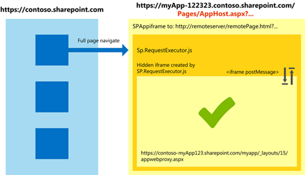

# 有經驗的 SharePoint 開發人員進階的 app 設計考量
本文提供SharePoint 2010開發人員，以開始開發SharePoint 2013中的應用程式的指導。您可以使用這份指導，以找出並衡量開發符合使用者需求的應用程式的考量。
 * **適用於:*** 
  
    
    


|||
|:-----|:-----|
|**本文內容**          [誰應閱讀此文章並所預期的結果](#WhoShouldRead)           [在 SharePoint 2013 中的應用程式類型](#AppTypes)           [三個設定的信任層級式升級](#ThreeApproaches)           [部署在SharePoint Add-in模式](#DeploymentPatterns)           [如需存取資料模式](#DataAccess)           [一般考量](#CommonConsiderations)           [Code samples](#Samples)           [結論](#Conclusion)           [其他資源](#bk_addresources)||
   

## 誰應閱讀此文章並所預期的結果
<a name="WhoShouldRead"> </a>

本文適用於SharePoint 2010開發人員，或想了解應用程式開發SharePoint 2013 ，以及如何啟動開發應用程式。它會假設的 SharePoint 功能的知識，以及一些體驗開發SharePoint 2010延伸模組。
  
    
    
本文不是開發應用程式中SharePoint 2013深入探索。它是用來協助您了解新功能盡可能SharePoint Add-ins，您可以組合應用程式，以及開發它們的一些考量的方式。
  
    
    
閱讀本文章之後， SharePoint 2010方案開發人員應能您必須決定哪些SharePoint 2013選項最有意義的應用程式必須記住的資訊。
  
    
    

## 在 SharePoint 2013 中的應用程式類型
<a name="AppTypes"> </a>

SharePoint 2013提供數種選項，供您開發應用程式，包括標準 web 技術，例如JavaScript與 OAuth。SharePoint 也會提供許多代管選項與功能與部署 SharePoint 資源進行互動。
  
    
    
其中一個SharePoint 2010副檔名及SharePoint Add-ins最顯著差異是SharePoint Add-ins未使用的伺服器物件模型，也不要使用的 SharePoint 伺服器執行的自訂程式碼。自訂程式碼的所有元件都位於延伸的用戶端物件模型中或在雲端託管的應用程式伺服器。
  
    
    
各種SharePoint 2013開發模型會提供選項來建立可以在雲端而不是 SharePoint 伺服器陣列中執行的應用程式。這些具彈性的開發，以及標準 web 技術的整合機型像其他種類，您可能已經執行 web 開發的更多運作的 SharePoint 開發。
  
    
    
SharePoint Add-in可以有 SharePoint 元件、 遠端元件，或兩者。類型的元件，以及其中託管 (不一定執行) 的位置決定他們是否需要任何設定，且他們是否需要信任系統 (實作的信任層級)。
  
    
    

### 不需要信任系統的應用程式

不需要信任系統的應用程式的兩種類型為應用程式使用僅限SharePoint 2013元件，並使用沒有SharePoint 2013元件或功能的應用程式。
  
    
    

- **僅限 SharePoint 的應用程式** 包含 SharePoint 元件只有在應用程式的 web，因此不需要的信任設定組態。請務必了解 [主機 web 和應用程式 web](b791cdf5-8aa2-47fa-bc4c-aee437354759.md)之間的差異。應用程式 web 是隔離的SharePoint 2013子網站 ；應用程式父網站稱為主機網頁。即使您不需要設定信任的設定，您仍然需要設定的權限。(如需詳細資訊，請參閱本文後述的 [應用程式權限](#AppPermissions))。安裝及執行僅限 SharePoint 的應用程式的功能取決於使用者的登入認證。
    
  
- **SharePoint 呈現應用程式** 是 SharePoint 可供使用者運用為方便使用的商務 web 應用程式。使用者可以從內 SharePoint 的應用程式並排顯示啟動這些應用程式，但應用程式不使用 SharePoint 功能。他們可能包含應用程式組件及自訂動作]，但沒有 SharePoint 元件或應用程式 web 他們不存取及主機網頁。信任及權限不適用因為這些應用程式不會與 SharePoint 互動。
    
  

### 需要信任系統的應用程式

使用混合 SharePoint 與遠端元件的應用程式需要信任系統是備妥。
  
    
    

- **僅限遠端應用程式** 具有不是從 SharePoint 的元件不真正的 SharePoint 應用程式。他們是此處所提及因為他們可以存取 SharePoint 資料透過代表性狀態傳輸 (REST) API 與因此需要信任系統的使用。不過，僅限遠端應用程式不討論進一步本文中。
    
  
- Sharepoint **混合式應用程式** 包含 SharePoint 元件與遠端的元件]，並依下列準則已分類：
    
  - 遠端元件被裝載在哪裡。
    
  
  - 元件已安裝，在SharePoint Online或在內部部署 SharePoint 伺服器陣列。SharePoint 元件會一律架設在相同網站集合做為應用程式已安裝，因此您可以設想為此準則"其中所主控的 SharePoint 元件 」。
    
  
  - 用於遠端元件至 SharePoint 授權信任系統。
    
  
對於混合式應用程式，有三種可能的方式，您可以設定方法和位置所部署的元件：
  
    
    

- **所有內部部署：** SharePoint 內部部署執行個體只能在安裝應用程式。SharePoint 與遠端元件的所有內部部署。信任系統可以呼叫高信任層級，這表示信任 broker 也是內部部署。換句話說，SharePoint 伺服器陣列可能會中斷連線從網際網路而不會影響方式應用程式的功能。
    
  
- **全部雲端：** 只能在SharePoint Online安裝應用程式 (及應用程式 web)。遠端元件同時在雲端中。信任系統是 OAuth，且信任 broker Microsoft Azure Active Directory 存取控制。不是內部部署。
    
    此類別中的有些應用程式是適合在Office 365自動佈建。只有在應用程式的資料庫是Microsoft Azure SQL Database與 web 應用程式或服務可以裝載於Azure 網站應用程式可自動佈建。
    
  
- **跨主控：** 應用程式是在雲端中部分及部分的內部。下列元素中至少一個是內部部署，以及至少一個是在雲端中：
    
  - SharePoint 元件
    
  
  - 遠端元件
    
  
  - 如果有任何信任 broker，
    
  

## 三個設定的信任層級式升級
<a name="ThreeApproaches"> </a>

 *信任層級*  是指管理應用程式可以或無法執行的動作的權限。並非所有的應用程式需要完全信任的環境操作，因為 Microsoft 會提供您建立不同的SharePoint 2013您開發應用程式的信任層級的功能。
  
    
    

### 使用 OAuth

應用程式可用來做為 SharePoint 和應用程式之間的一般驗證 broker 驗證提供者。這些應用程式使用Microsoft Azure Active Directory 存取控制服務，並要求使用者在具有存取權 (通常是透過Office 365訂閱) Office 365網站經過。
  
    
    
當使用者啟動這些應用程式的其中一個時，SharePoint 的存取控制要求內容權杖，並將它傳送至應用程式。應用程式再使用此內容權杖從存取控制要求存取權杖。應用程式接收存取權杖之後，該應用程式會使用以 [與 SharePoint 通訊](http://blogs.technet.com/b/mspfe/archive/2013/01/31/configuring-sharepoint-on-premise-deployments-for-apps.aspx)此 token。
  
    
    
SharePoint 所使用 ( *授與類型*  ) 的 OAuth 驗證程式碼流程委派代表使用者身分限制權限的應用程式。 *Granting 權限*  表示授與使用者或群組存取 web 應用程式，不論本機權限的物件內的所有安全的物件的權限。依定義授與類型，可以將使用者指派存取層級，例如 [讀取、 寫入、 管理及完全控制](http://msdn.microsoft.com/library/aacf3398-f0b5-48cb-9071-440b4c3a9dd1%28Office.15%29.aspx)。搭配使用此方法，如 SharePoint 和用戶端應用程式 ( SharePoint Add-in) 必須信任，並與驗證提供者通訊。SharePoint 依賴Microsoft Azure Active Directory]，接著必須是 SharePoint 及用戶端應用程式 [的必要的程式碼和權杖，以便可以搭配使用，授與](http://blogs.msdn.com/b/besidethepoint/archive/2012/12/10/sharepoint-low-trust-apps-for-on-premises-deployments.aspx)注意。
  
    
    

### 使用伺服器對伺服器通訊協定 (高信任度應用程式)

高信任SharePoint Add-ins之內建設為使用內部部署和不在雲端託管環境中。 *高信任層級*  不是 *完全信任*  相同 — 高信任應用程式仍必須要求應用程式權限。應用程式會被視為高信任度，因為它是受信任使用需要任何使用者身分識別。應用程式會負責建立存取權杖的使用者部分。
  
    
    
在SharePoint 2013、 伺服器對伺服器 security token service (STS) 延伸 OAuth，並提供 [伺服器對伺服器驗證](http://technet.microsoft.com/en-us/library/jj219758.aspx)存取權杖。此佈建啟用用於取得存取其他應用程式服務，例如Exchange 2013、 Lync 2013，以及其他SharePoint Add-ins權限的臨時權杖。然後建立這些應用程式之間的信任關係，並 [透過憑證](33294041-48ae-4ee3-846c-acb57b5409cb.md)服務。高信任度應用程式是唯一的因為其具備信任 broker 和應用程式內部，並使用憑證，而不是權杖，來建立信任關係。SharePoint 伺服器陣列可能會中斷連線從網際網路而不會影響方式應用程式的功能。
  
    
    

### 使用 SharePoint 跨網域文件庫

有一個用戶端的替代方式 (SP. JavaScript檔案所提供的跨網域文件庫RequestExecutor.js) 的開發人員可以參照從遠端應用程式。在 SharePoint 網站上主控，並可互動通過 proxy 遠端應用程式] 頁面中的多個網域。使用的跨網域文件庫是不錯的選擇，在下列情況：
  
    
    

- You prefer to run app code on the client instead of on the server. (See  [保護資料存取及用戶端物件模型的 SharePoint 增益集](2148980b-c2b6-4294-b8f7-cfc07f925091.md) and [存取 SharePoint 2013 資料增益集使用跨網域文件庫](bc37ff5c-1285-40af-98ae-01286696242d.md) for more information.)
    
  
- 因為防火牆或其他問題與不可靠連線有 SharePoint 與遠端的基礎結構之間的連線問題。
    
  
SharePoint 跨網域文件庫使用隱藏的內嵌框架 (IFrame) 和裝載於 SharePoint，以啟用透過JavaScript的用戶端通訊用戶端 proxy] 頁面。在遠端的頁面及 [載入 [proxy] 頁面上順利](3d24f916-60b2-4ea9-b182-82e33cad06e8.md)收到驗證 cookie。
  
    
    

**圖 1。跨網域文件庫的功能**

  
    
    

  
    
    

  
    
    

  
    
    

  
    
    

### 信任層級的設定方式的摘要

建議來設定信任層級為基礎的應用程式元件位置表 1 所示的方法。
  
    
    

**表 1。信任的 SharePoint 混合式應用程式的系統**


|**SharePoint 元件位置**|**遠端元件位置**|**信任系統**|
|:-----|:-----|:-----|
|內部部署 <br/> |內部部署 <br/> |SharePoint 伺服器對伺服器 STS (OAuth) 和憑證          -          OAuth + Microsoft Azure AD 存取控制 <br/> |
|內部部署 <br/> |在雲端 <br/> |SharePoint 伺服器對伺服器 STS (OAuth) 和憑證          -          OAuth + Microsoft Azure AD 存取控制 <br/> |
|在雲端 (SharePoint Online) <br/> |在雲端 <br/> |OAuth + Microsoft Azure AD 存取控制 <br/> |
|在雲端 (SharePoint Online) <br/> |內部和外部防火牆 <br/> |OAuth + Microsoft Azure AD 存取控制          -          跨網域文件庫 <br/> |
|在雲端 (SharePoint Online) <br/> |內部部署與內部防火牆 <br/> |跨網域文件庫 <br/> |
   

## 部署在SharePoint Add-in模式
<a name="DeploymentPatterns"> </a>

SharePoint Add-ins通常會歸類部署應用程式所需的設定管為基礎。SharePoint 2013開發模型允許下列部署模式：
  
    
    

- SharePoint-hosted
    
  
- 提供者代管
    
  
For more information, see  [選擇如何開發和裝載您 SharePoint 的增益集的模式](05ce5435-0a03-4ddc-976b-c33b08d03457.md) on MSDN.
  
    
    

### SharePoint 主控應用程式部署模式

在 SharePoint 中裝載的應用程式均相同 *SharePoint 唯讀*  本文稍早所討論的應用程式。 [SharePoint 主控應用程式](1b992485-6efe-4ea4-a18c-221689b0b66f.md)包括僅限宣告式元件，例如 HTML 和JavaScript檔案，以及安裝這些客戶自己SharePoint Online租用或客戶的內部部署 SharePoint 伺服器陣列中。
  
    
    
主控 sharepoint 的應用程式可讓重複使用的一般 SharePoint 成品，例如清單與網頁組件。當您依照此部署模式時，您限制使用僅用戶端指令碼，且您無法使用任何伺服器端程式碼。
  
    
    
呼叫 *應用程式 web*  ； 隔離的SharePoint 2013子網站上已安裝 SharePoint 主控SharePoint Add-ins應用程式父網站稱為 *主機網頁*  。
  
    
    

### 提供者主控應用程式部署模式

提供者主控應用程式需要部署 (應用程式的提供者) 的應用程式的人員的設定。此組態包含信任系統先前所述。這些應用程式也包含 SharePoint 呈現應用程式與本文中，大部分的混合式應用程式 (包括所有內部部署應用程式、 大部分的所有雲端應用程式] 和 [全部跨主控應用程式，也討論稍早) 除了先前所述的僅限遠端應用程式。您可以使用這兩個內部部署環境中的 [提供者主控應用程式](3038dd73-41ee-436f-8c78-ef8e6869bf7b.md)部署及雲端環境。
  
    
    
SharePoint 的提供者主控應用程式可以包含元件已部署及主控外部代管環境，通常是由開發人員，但是在某些案例中的 web 應用程式的使用者。此類型的提供者主控SharePoint Add-in與其互動SharePoint 2013站台，但也會使用 「 [資源和服務，位於遠端站台](05ce5435-0a03-4ddc-976b-c33b08d03457.md)。
  
    
    
當您使用包含遠端元件和服務提供者主控應用程式時，您必須提供封裝、 安裝及設定系統遠端元件。
  
    
    
提供者主控SharePoint Add-ins類別中，有重要差異架構SharePoint Add-ins具有遠端安裝的應用程式安裝所在的 SharePoint 伺服器陣列和SharePoint Add-ins內部防火牆外的元件有遠端防火牆內安裝的元件。使用不同的信任系統涵蓋本文稍早的。
  
    
    
此外，防火牆內部的遠端元件可以使用 [SharePoint 用戶端物件模型 (CSOM)] 或 [SharePoint REST 端點與您的 SharePoint 環境和內容互動。遠端元件的防火牆應用程式以外，您可以使用 SharePoint REST 端點，因為他們可以從任何開發語言支援。
  
    
    

### 語言與 API 考量

SharePoint 2013開發模型支援兩種部署模式和兩個用戶端 api (英文) 透過兩種語言，這表示有八個排列個數的語言、 API 和部署選項。這些組合的一些必須使用跨網域支援在必要時，其他人良好的選擇如果跨網域支援，則不需要，而且不能使用兩個。表 2 顯示這些組合。
  
    
    

**表 2。可能的SharePoint Add-ins部署與 api (英文) 的組合**


|**語言**|**API**|**提供者代管**|**SharePoint-hosted**|
|:-----|:-----|:-----|:-----|
|Java 指令碼 <br/> |CSOM <br/> |當需要跨網域支援使用 <br/> |實用的一種選擇 <br/> |
|Java 指令碼 <br/> |REST <br/> |當需要跨網域支援使用 <br/> |實用的一種選擇 <br/> |
|C# <br/> |CSOM <br/> |實用的一種選擇 <br/> |可能無法 <br/> |
|C# <br/> |REST <br/> |良好的選擇 <br/> |可能無法 <br/> |
   

### 如需存取資料模式
<a name="DataAccess"> </a>

當您開發SharePoint Add-ins您可以用於儲存及擷取資料的三個選項。
  
    
    

- 應用程式在 web 上的 SharePoint 資料。
    
  
- 主機網路上的 SharePoint 資料。
    
  
- 外部資料
    
  
最重要的高層級的設計考量為是否您需要使用的資料儲存在 SharePoint (位於主機 web 或應用程式 web) 或外部。表 4 顯示外部儲存的資料與資料儲存在 SharePoint 中的主要差異與相關資源，您需要使用，以取得 access。
  
    
    

**表 3。儲存外部和 SharePoint 中的資料的存取權的比較**


|**資料來源**|**資料存取**|**應用程式元件位置**|**應用程式元件**|**主控選項**|**主要資源**|**範例**|**安全考量**|**使用案例**|
|:-----|:-----|:-----|:-----|:-----|:-----|:-----|:-----|:-----|
|External <br/> |CRUD <br/> |Web 應用程式 <br/> 主機網頁 <br/> |應用程式組件 <br/> 沈浸式應用程式 <br/> |SharePoint-hosted <br/> 提供者代管 <br/> |Web proxy <br/> BCS (BCS 模型已繫結至應用程式本身並不是可重複使用) <br/> Remote event receivers <br/> WCF 服務 <br/> REST <br/> | [SharePoint 2013： 存取外部清單與其餘](http://code.msdn.microsoft.com/officeapps/SharePoint-2013-Accessing-a90295d2) <br/>  [SharePoint 2013： 建立外部內容類型支援通知](http://code.msdn.microsoft.com/officeapps/SharePoint-2013-Create-an-f23e0c1b) <br/>  [SharePoint 2013： 使用關聯性建立多個外部清單](http://code.msdn.microsoft.com/officeapps/SharePoint-2013-Create-2d2ec458) <br/>  [SharePoint 2013： 建立應用程式範圍外部內容類型為基礎的外部清單](http://code.msdn.microsoft.com/officeapps/SharePoint-2013-Create-ffc9af9f) <br/>  [新增在-範圍的外部內容類型 in SharePoint 2013](http://msdn.microsoft.com/library/a34cbbba-dc38-4d3d-b796-d54b5848bdfb%28Office.15%29.aspx) <br/> |資料可能會儲存在防火牆中。 <br/> 外部資料來源可能需要額外的驗證。 <br/> 外部資料驗證需求可能會決定您的選項。 <br/> |股票 <br/> RSS 讀取者 <br/> LOB 應用程式整合 <br/> SharePoint 伺服器陣列之間的資料 <br/> 儀表板報表與商務智慧解決方案的資料 <br/> |
|SharePoint <br/> |CRUD <br/> |Web 應用程式 <br/> 主機網頁 <br/> |應用程式組件 <br/> 沈浸式應用程式 <br/> |SharePoint-hosted <br/> 提供者代管 <br/> |OAuth + Microsoft Azure AD 存取控制          -          跨網域文件庫 <br/> CSOM 或 JSOM <br/> REST <br/> | [SharePoint 2013： 使用 CSOM 的應用程式中執行基本的資料存取作業](http://code.msdn.microsoft.com/office/SharePoint-2013-Perform-eba8df54) <br/>  [SharePoint 2013： 使用 REST 應用程式中執行基本的資料存取作業](http://code.msdn.microsoft.com/office/SharePoint-2013-Perform-335d925b) <br/>  [存取 SharePoint 2013 資料增益集使用跨網域文件庫](bc37ff5c-1285-40af-98ae-01286696242d.md) <br/> |應用程式及資料共用相同的安全性模型。 <br/> |將 SharePoint 清單資料整合至商務程序： <br/> 會議排程 <br/> 合約追蹤 <br/> HR 面試程序 <br/> 自訂清單檢視應用程式 <br/> 根據現有的文件庫的商務應用程式： <br/> 訓練管理 <br/> 專案管理 <br/> 網站庫存儀表板 <br/> 網站導覽 <br/> 與 SharePoint 搜尋結果互動 <br/> 與 SharePoint 使用者設定檔資訊 (人員目錄) 互動 <br/> |
   
您可以使用儲存在 web 應用程式與主機網站上的 SharePoint 資料。如果您的應用程式具有權限以使用資料租用戶層級，您可以存取儲存跨網站集合的主機網站資料。表 4] 顯示 app 網頁伺服器與主機網頁上使用資料的主要差異與相關應用程式的設計和生命週期管理。
  
    
    

**表 4。資料儲存在 web 應用程式與主機網頁上的存取權的比較**


|**資料來源**|**應用程式元件**|**主控選項**|**已知限制**|**設計考量**|**實作**|
|:-----|:-----|:-----|:-----|:-----|:-----|
|Web 應用程式 <br/> |應用程式組件 <br/> 沈浸式應用程式 <br/> |SharePoint-hosted <br/> 提供者代管 <br/> |應用程式及資料所繫結在一起應用程式在 web 上。移除應用程式時，也會移除該應用程式相關聯的資料。 <br/> |應用程式是獨佔使用者的資料。 <br/> 應用程式及資料共用相同的生命週期。 <br/> 在瀏覽器層級的通訊發生，因為您一律使用用戶端 (JSOM 或跨網域文件庫) 執行的程式碼。 <br/> |宣告或命令建立的資料。 <br/> |
|主機網頁 <br/> |應用程式組件 <br/> 沈浸式應用程式 <br/> Remote event receivers <br/> |SharePoint-hosted <br/> 提供者代管 <br/> |您必須使用應用程式解除安裝事件移除任何資料，如有必要。 <br/> |佈建清單和其他 SharePoint 物件搭配使用的應用程式安裝事件程式碼。 <br/> 您必須建立資料主機網路上的適當的主機 web 權限。 <br/> |使用主機網頁 URL 來取得用戶端內容。 <br/> |
|跨網站集合的主機網頁 <br/> |應用程式組件 <br/> 沈浸式應用程式 <br/> Remote event receivers <br/> |SharePoint-hosted <br/> 提供者代管 <br/> |允許的跨網域文件庫撥打跨網站集合，才從應用程式目錄的租用戶範圍應用程式以安裝應用程式。 <br/> |做法 1： 部署具有租用戶層級的權限的SharePoint Add-in應用程式。 <br/> 選項 2： 部署提供者主控應用程式，取得正確的用戶端內容從主機網頁 URL 並已租用戶層級權限。 <br/> 租用戶系統管理員必須先安裝應用程式。 <br/> |使用主機網頁 URL 來取得用戶端內容。 <br/> |
   

### 設計考量
<a name="DataAccess"> </a>

 [您必須選擇裝載模型](http://www.slideshare.net/spcadriatics/the-sharepoint-2013-app-model-15414485)以差異表 5 所示為基礎的應用程式。
  
    
    

**表 5。比較的代管SharePoint Add-ins選項**


||**SharePoint-hosted**|**雲端 (提供者主控)**|
|:-----|:-----|:-----|
|應用程式範圍 <br/> |SharePoint 網站 <br/> |站台或租用 <br/> |
|架構 <br/> |網站上的群組。 <br/> |Multitenant 應用程式 <br/> |
|開發人員技能集 <br/> |SharePoint + HTML 或JavaScript <br/> |完整的堆疊 <br/> |
|使用者介面技術 <br/> |SharePoint + HTML 或JavaScript <br/> |任何 web 堆疊 <br/> |
|伺服器程式碼 <br/> |無 <br/> |任何 (無 SharePoint 上) <br/> |
|儲存裝置 <br/> |清單和文件庫 <br/> |任何 <br/> |
|重要的限制 <br/> |沒有伺服器程式碼 <br/> |主控所需的專業知識 <br/> |
   
會影響代管選擇的因素：
  
    
    

- **雲端託管的應用程式：** 這個方法會提供的彈性，可選擇主控與技術的選項。使用雲端託管的應用程式可能需要的應用程式權限及多重租賃主控的管理。
    
  
- **SharePoint 主控應用程式：** 這個方法較小的應用程式與儲存資源的建議。所有應用程式中的元件，完全主控於 SharePoint 內部部署或線上，因為不有任何伺服器端程式碼。 [要取得的多重租賃及隔離現成的優點](http://www.slideshare.net/spcadriatics/the-sharepoint-2013-app-model-15414485)。
    
  

## 一般考量
<a name="CommonConsiderations"> </a>

本節討論其他考量及可套用至您進行規劃應用程式開發 SharePoint 的應用程式的相關資訊。
  
    
    

### 應用程式身分識別

已驗證的識別身分中SharePoint 2013決定使用哪個 [授權原則](124879c7-a746-4c10-96a7-da76ad5327f0.md)。已驗證的身分識別可以是僅限使用者身分識別、 使用者加上應用程式身分識別或僅限應用程式身分識別。
  
    
    

- **僅使用者原則：** 套用SharePoint 2010授權原則。
    
  
- **使用者 + 應用程式原則：** 使用者身分識別和應用程式身分識別，授權檢查必須考量事項。
    
  
- **僅限應用程式的原則：** 內容資料庫授權檢查事項應用程式身分識別。 *內容資料庫*  是資訊的為儲存機制的應用程式所需。
    
  

### 應用程式權限
<a name="AppPermissions"> </a>

SharePoint Add-in使用權限要求指定正常運作所需的權限。權限要求指定應用程式所需的權限和需要權限的範圍。 [要求這些權限的應用程式定義的一部分](http://technet.microsoft.com/en-us/library/fp161230.aspx)。
  
    
    

### 應用程式權限
<a name="AppPermissions"> </a>

您可以使用SharePoint 2013的應用程式權限來指定可讓使用者針對 app SharePoint 2013執行動作的權限層級支援 [四個層級的內容資料庫中的權限](5f7a8440-3c09-4cf8-83ec-c236bfa2d6c4.md)：
  
    
    

- 唯讀
    
  
- 寫入
    
  
- 管理
    
  
- 完全控制
    
  

### 應用程式範圍
<a name="AppPermissions"> </a>

SharePoint Add-in使用應用程式權限要求範圍 ； 若要指定層級的應用程式用來執行，並指派給該應用程式的權限層級的權限要求。 *應用程式的權限要求範圍*  表示SharePoint 2013階層中的權限要求將會套用所在的位置。(請參閱 [規劃 SharePoint 2013 中的應用程式的權限管理](http://technet.microsoft.com/en-us/library/jj219576.aspx)及 [管理 Web 應用程式的權限](http://technet.microsoft.com/en-us/library/cc262737%28v=office.12%29.aspx)如需詳細資訊)。SharePoint 2013支援下列權限要求範圍：
  
    
    

- **SPSite：** 將範圍定義為 SharePoint 網站集合。
    
  
- **SPWeb：** 將範圍定義為 SharePoint 網站。
    
  
- **SPList：** 將範圍定義為 SharePoint 清單。
    
  
- **租用：** 將範圍定義為 SharePoint 租用。
    
  
此外，有的動作，例如執行搜尋查詢範圍存取分類資料並編輯使用者設定檔。
  
    
    

### 其他解決方案類型
<a name="AppPermissions"> </a>

彈性的SharePoint 2013提供應用程式開發和部署，您可以藉由使用 SharePoint 的雲端應用程式併入許多其他類型的解決方案。使用 SharePoint 元素的組合的 Mashup 也可能會出現。表 6 顯示對應至部署您SharePoint Add-in模式這些技術的部分。此表不是設為詳盡清單中，但是，可能性世界的簡介。
  
    
    

**表 6。SharePoint Add-ins部署選項以及其他解決方案類型的相容性**


||**SharePoint-hosted**|**提供者代管**||
|:-----|:-----|:-----|:-----|
|SharePoint 相關應用程式 <br/> |是 <br/> |是 <br/> ||
|網頁組件 <br/> |否 <br/> |是 <br/> ||
|ASP.NET web 應用程式 <br/> |否 <br/> |是 <br/> ||
|HTML 或 JavaScript 應用程式 <br/> |是 <br/> |否 <br/> ||
|燈 web 應用程式 <br/> |否 <br/> |是 <br/> ||
|Windows PowerShell 指令碼 <br/> |否 <br/> |是 <br/> ||
|事件接收器 <br/> |否 <br/> |是 <br/> ||
|Office 相關應用程式 <br/> |否 <br/> |是 <br/> ||
   

## Code samples
<a name="Samples"> </a>

本章節提供每個SharePoint Add-ins部署模型的程式碼範例。您可以重複使用這些範例中開發您的應用程式。
  
    
    

### SharePoint-hosted app

 [SharePoint 主控應用程式](1b992485-6efe-4ea4-a18c-221689b0b66f.md)是最簡單的SharePoint 2013 ，您可以建立和部署應用程式的類型。其內容部署至單一 SharePoint 網站，而且它包含只有 SharePoint 元件，所以不需要信任或權限設定。
  
    
    
在下列程式碼範例中，應用程式會擷取目前的 **SPWeb** 物件與目前的使用者清單的計數。它也會填入 Default.aspx 檔案，它會擷取的資訊中的元素。
  
    
    


```

var ctx;
var web;
var user;

function sharePointReady() {
    ctx = new SP.ClientContext.get_current();

    $("#getListCount").click(function (event) {
        getWebProperties();
        event.preventDefault();
    });
    welcome();
}


function welcome() {
    web = ctx.get_web();
    user = web.get_currentUser();
    ctx.load(user);

    ctx.executeQueryAsync(onUserReqSuccess, onUserReqFail);
}

function onUserReqSuccess() {
    var welcomeText = document.getElementById("starter");
    var userWelcome = document.createElement("p");
    userWelcome.style.fontSize = "14pt";
    userWelcome.innerText = "Welcome " + user.get_loginName() + ".";
    welcomeText.appendChild(userWelcome);
}

function onUserReqFail(sender, args) {
    alert('Failed to find current user. ' + args.get_message());
}


function getWebProperties() {
    web = ctx.get_web();
    lists = this.web.get_lists();
    ctx.load(this.lists);
    ctx.executeQueryAsync(Function.createDelegate(this, this.onSuccess), Function.createDelegate(this, this.onFail));
}

function onSuccess(sender, args) {
    alert('Number of lists in web:' + this.lists.get_count());
}

function onFail(sender, args) {
    alert('failed to get list. Error:' + args.get_message());

```


### 提供者主控應用程式

 [提供者主控](3038dd73-41ee-436f-8c78-ef8e6869bf7b.md)SharePoint Add-in包含這兩個SharePoint Add-in部署直接至SharePoint 2013站台和個別部署的 web 應用程式。應用程式含有 SharePoint 元件及其他類型的元件，因為它需要額外的信任設定，例如Microsoft Azure Active Directory 存取控制低信任度應用程式與高信任度應用程式的憑證。
  
    
    
下列程式碼範例會使用擷取內容物件中的 **要求** ，並取得存取 token Microsoft Azure Active Directory 存取控制從 TokenHelper.cs 檔案中的方法。 **RetrieveWithCSOM** 方法來擷取您網站的相關資訊，並顯示在頁面上，使用 SharePoint CSOM。
  
    
    


```cs

public partial class Default : System.Web.UI.Page
    {
        SharePointContextToken contextToken;
        string accessToken;
        Uri sharepointUrl;
        string siteName;
        string currentUser;
        List<string> listOfUsers = new List<string>();
        List<string> listOfLists = new List<string>();

        // The Page_load method fetches the context token and the access token. 
        // The access token is used by all of the data retrieval methods.
        protected void Page_Load(object sender, EventArgs e)
        {

     
            TokenHelper.TrustAllCertificates();
            string contextTokenString = TokenHelper.GetContextTokenFromRequest(Request);

            if (contextTokenString != null)
            {
                contextToken =
                    TokenHelper.ReadAndValidateContextToken(contextTokenString, Request.Url.Authority);

                sharepointUrl = new Uri(Request.QueryString["SPHostUrl"]);
                accessToken =
                    TokenHelper.GetAccessToken(contextToken, sharepointUrl.Authority).AccessToken;
                CSOM.CommandArgument = accessToken;

            }
            else if (!IsPostBack)
            {
                Response.Write("Could not find a context token.");
                return;
            }
        }

        // This method retrieves information about the host web by using the CSOM.
        private void RetrieveWithCSOM(string accessToken)
        {

            if (IsPostBack)
            {
                sharepointUrl = new Uri(Request.QueryString["SPHostUrl"]);
            }
            

            ClientContext clientContext =
                    TokenHelper.GetClientContextWithAccessToken(
                        sharepointUrl.ToString(), accessToken);


            // Load the properties for the web object.
            Web web = clientContext.Web;
            clientContext.Load(web);
            clientContext.ExecuteQuery();

            // Get the site name.
            siteName = web.Title;

            // Get the current user.
            clientContext.Load(web.CurrentUser);
            clientContext.ExecuteQuery();
            currentUser = clientContext.Web.CurrentUser.LoginName;

            // Load the lists from the Web object.
            ListCollection lists = web.Lists;
            clientContext.Load<ListCollection>(lists);
            clientContext.ExecuteQuery();

            // Load the current users from the Web object.
            UserCollection users = web.SiteUsers;
            clientContext.Load<UserCollection>(users);
            clientContext.ExecuteQuery();

            foreach (User siteUser in users)
            {
                listOfUsers.Add(siteUser.LoginName);
            }


            foreach (List list in lists)
            {
                listOfLists.Add(list.Title);
            }
        }


        protected void CSOM_Click(object sender, EventArgs e)
        {
            string commandAccessToken = ((LinkButton)sender).CommandArgument;
            RetrieveWithCSOM(commandAccessToken);
            WebTitleLabel.Text = siteName;
            CurrentUserLabel.Text = currentUser;
            UserList.DataSource = listOfUsers;
            UserList.DataBind();
            ListList.DataSource = listOfLists;
            ListList.DataBind();
    
        }

    }
```


## 結論
<a name="Conclusion"> </a>

SharePoint 2013提供強式開發平台建置解決方案與應用程式。透過在SharePoint 2013開發方法和應用程式架構，您可以建立表面 SharePoint 元件與遠端元件的應用程式。支援標準為基礎技術，例如 HTML5、 JavaScript，與 OAuth，由SharePoint 2013提供整合的開發經驗。
  
    
    
身為開發人員，您可以讓智慧型架構和編碼選項的地址不同的需求和需求，針對SharePoint 2013平台提供的應用程式主機模型、 應用程式模式及應用程式的設計方法的許多選項。
  
    
    

## 其他資源
<a name="bk_addresources"> </a>


-  [SharePoint Add-ins](cd1eda9e-8e54-4223-93a9-a6ea0d18df70.md)
    
  
-  [選擇如何開發和裝載您 SharePoint 的增益集的模式](05ce5435-0a03-4ddc-976b-c33b08d03457.md)
    
  
-  [建置 Office 與 SharePoint 2013 的應用程式](http://video.ch9.ms/sessions/build/2012/3-020.pptx)
    
  
-  [建立高信任 SharePoint 增益集](33294041-48ae-4ee3-846c-acb57b5409cb.md)
    
  
-  [增益集 (英文) SharePoint 2013 權限](5f7a8440-3c09-4cf8-83ec-c236bfa2d6c4.md)
    
  

  
    
    