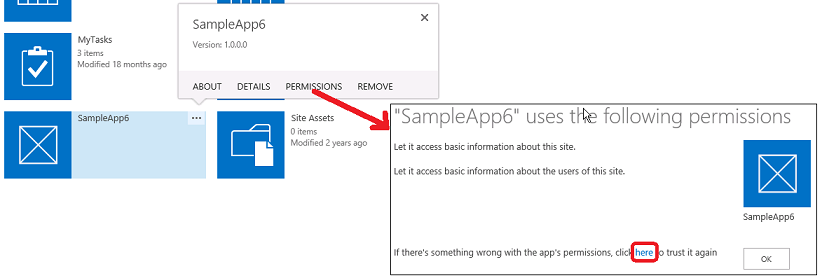

# 增益集 (英文) SharePoint 2013 權限
了解增益集 (英文) 中的權限SharePoint，包括類型的增益集的權限、 權限要求範圍，以及管理的權限。本文也將告訴您在增益集的權限的權限、 使用者權利及Office Store應用程式權限的差異。
您應該熟悉主題 [授權與驗證的 SharePoint 增益集](authorization-and-authentication-of-sharepoint-add-ins.md)前先閱讀本文。
  
    
    


**觀賞影片關於增益集的權限。**

  
    
    

  
    
    

  
    
    

  
    
    

  
    
    

## 取得SharePoint增益集的權限概觀
<a name="Perm_intro"> </a>

SharePoint Add-in要求從已安裝之使用者在安裝期間所需的權限。增益集的開發人員必須要求、 增益集資訊清單檔案，透過特定的增益集需要能夠執行的權限。(裝置與 web 應用程式存取SharePoint，但不會安裝SharePoint網站必須授與權在執行階段之使用者執行增益集。如需詳細資訊，請參閱 [取得增益集從SharePoint即時要求存取] 權限概觀](authorization-code-oauth-flow-for-sharepoint-add-ins.md#Overview))。使用者可以授與他們所擁有的權限。使用者必須授與所有的權限，增益集要求或不授與任何權限。選擇性授與不可能。(的增益集] 要求即時的權限，只擁有管理的增益集搜尋項目來存取SharePoint資源的權限的使用者可以執行增益集，即使增益集詢問僅針對較少的權限，例如讀取)。
  
    
    
增益集已授與的權限也會儲存在SharePoint伺服器陣列或SharePoint Online租用的內容資料庫。他們是不會儲存與 secure token service，例如Microsoft Azure Access Control Service (ACS)。當使用者第一次授與增益集的權限時、 SharePoint會從 ACS 取得增益集的相關資訊。SharePoint然後會將增益集的相關的基本資訊儲存在增益集管理服務與內容資料庫與增益集的權限。如需 ACS 的詳細資訊，請參閱 [建立 SharePoint 增益集使用低信任層級授權](creating-sharepoint-add-ins-that-use-low-trust-authorization.md)。
  
    
    
如果要增益集已授與權限已刪除的物件，也會刪除對應授與。回收的增益集已授與權限的物件時， SharePoint不會修改對應授與。這會使物件從資源回收筒還原，授與是否仍不變。
  
    
    
當移除增益集時，會撤銷授與該增益集在移除該範圍內的權限。這是要確定增益集無法使用其認證繼續之後使用者會增益集移除SharePoint遠端存取受保護的SharePoint資源。
  
    
    

## 了解增益集的權限和權限範圍的類型
<a name="Perm_types"> </a>

SharePoint Add-in使用權限要求指定正常運作所需的權限。權限要求指定增益集所需的權限和需要權限的範圍。這些權限所要求的增益集資訊清單的一部分。
  
    
    

> [!注意事項]
> 清單內容和文件庫內容僅適用於本節所述的範圍。如需其他功能的範圍資訊，請參閱本文中的 [ [了解增益集的權限和權限範圍的類型](#Perm_types)] 區段。
  
    
    

權限要求範圍指出SharePoint階層中的權限要求的套用位置的位置。
  
    
    

> [!注意事項]
> SharePoint Add-in自己的身分識別，而且時的安全性主體，呼叫增益集主體。例如使用者及群組] 增益集主要有特定權限。因此它只需要要求中的主機網站或增益集網路外的其他位置的SharePoint資源的權限完全控制 」 權限的增益集 web 具有增益集主體。如需增益集網頁的詳細資訊，請參閱 [重要方面之 SharePoint 增益集架構設計和開發入門](important-aspects-of-the-sharepoint-add-in-architecture-and-development-landscap.md)和 [主機 web、 增益集 web 及 SharePoint 2013 中的 SharePoint 元件](host-webs-add-in-webs-and-sharepoint-components-in-sharepoint-2013.md)。
  
    
    

SharePoint支援租用、 內容資料庫內的四個不同的權限範圍表 1 所示。權限範圍與 Uri，包括名為"http:"首碼，但它們不是 Url 而且其中包含任何版面配置區。此表及本文中的權限範圍都是常值字串。
  
    
    

**表 1。SharePoint 增益集的權限要求範圍 Uri 和描述**

|||
|:-----|:-----|
|**範圍 URI** <br/> |**描述** <br/> |
|Tenancy <br/> http://sharepoint/content/tenant <br/> |增益集已安裝租用。包含此範圍的所有子項目。 <br/> |
|網站集合 <br/> http://sharepoint/content/sitecollection <br/> |增益集安裝所在之網站集合。包含此範圍的所有子項目。 <br/> |
|網站上的群組。 <br/> http://sharepoint/content/sitecollection/web <br/> |增益集安裝所在之網站。包含此範圍的所有子項目。 <br/> |
|清單 <br/> http://sharepoint/content/sitecollection/web/list <br/> |增益集安裝所在的網站中的單一清單。安裝的增益集的使用者會出現提示時若要授與權限，] 對話方塊可讓使用者選取一個清單的增益集已授與權限。 如果增益集需要多個清單的權限，則必須要求 web 範圍的權限。此外，自開發人員，您有沒有方法可讓來控制使用者選擇哪個清單或告訴使用者哪一種選擇，您必須使用 web 範圍是否要在增益集 *必須*  具有權限的清單。(但沒有可縮小使用者的選擇清單的特定備方法。請參閱 [具有相關聯的內容的權限要求範圍](#AssociatedProperties)下方)。 <br/> |
   
如果增益集已授與其中一個範圍的權限、 權限會套用至範圍的所有子項目。例如，如果增益集已授與權限的網站、 增益集是也權限授與網站中所含每個清單與每個清單中的所有清單項目。
  
    
    
由於權限要求進行沒有拓撲資訊之網站集合中之增益集已安裝，而不是為 URL 的類型的特定執行個體以表示範圍。這些範圍類型被以 Uri。組織SharePoint內容資料庫中儲存的資源的權限之下的下列 URI:  `http://sharepoint/content`。
  
    
    

## 了解增益集的權限的權限和使用者權限的差異
<a name="Perm_diff"> </a>

權限指出增益集可執行動作要求範圍內的活動。SharePoint支援四種權限層級中的內容資料庫。針對每個範圍增益集可以擁有下列權限：
  
    
    

- 讀取
    
  
- 寫入
    
  
- 管理
    
  
- FullControl
    
  

> [!注意事項]
> 如需哪些讀取的詳細資訊，寫入、 管理和 「 完全控制 」 權限會包含，請參閱 [規劃增益集的權限管理](http://technet.microsoft.com/en-us/library/jj219576%28office.15%29.aspx)。
  
    
    


> [!注意事項]
> 這些權限對應SharePoint預設使用者權限層級： 讀者、 參與者、 設計者、 與完全控制。如需使用者權限等級的詳細資訊，請參閱 [使用者權限與權限層級](http://technet.microsoft.com/en-us/library/cc288074.aspx)。> 增益集的權限名稱不符合SharePoint使用者角色權限名稱中，若要避免使用者角色權限和增益集版權之間造成混淆。因為自訂相關聯SharePoint使用者角色的權限不會影響增益集的權限要求層級的增益集權限名稱不符合對應SharePoint使用者角色、 完全控制、 無法透過權限管理使用者介面自訂除外。
  
    
    

此外：
  
    
    

- 僅限搜尋的增益集可以有正確的查詢。
    
  
- 針對某些Microsoft Project Server 2013範圍，也有 SubmitStatus 右或 Elevate 右邊。大部分的Project Server 2013範圍、 僅限讀取與寫入可用。如需詳細資訊，請參閱本文中的 [ [了解增益集的權限和權限範圍的類型](#Perm_types)] 區段。
    
  
- 分類，僅限讀取與寫入可用。
    
  

> [!注意事項]
> Office Store應用程式有一些限制來何種類型的權限增益集可以要求。如需詳細資訊，請參閱本文中的 [ [了解增益集的權限和權限範圍的類型](#Perm_types)] 區段。
  
    
    

不同SharePoint使用者角色於這些權限層級不是可自訂。這是確保當增益集已授與權限要求、 增益集保證的功能，可預測集並不需要在其中要授與較少比其所預期的權限的帳戶。
  
    
    
使用者不能授與增益集的權限的使用者本人自己不具備。如果使用者嘗試安裝要求比使用者擁有的權限，通知他們沒有足夠的權限授與增益集其要求的使用者會顯示錯誤訊息。
  
    
    
略過的權限未知的SharePoint 。這表示如果增益集要求的權限該SharePoint無法辨識、 增益集可以仍安裝，但不是提示使用者授與權限，並且權限不授與增益集。
  
    
    

## 瞭解可用的範圍和權限，以及有關Office Store應用程式權限限制
<a name="Perm_rightlist"> </a>

不同的範圍有不同的可用的增益集以要求的權限集。本節說明可用於每個範圍的權限組。此外，它醒目提示的SharePoint Add-ins透過Office Store售出的限制。
  
    
    

### Office Store應用程式的權限

僅限讀取、 寫入、 和管理的權限允許Office Store應用程式。如果您嘗試送出至Office Store需要 「 完全控制 」 權限的應用程式，您的應用程式會封鎖送出。由於區塊是Office Store提交管線中，仍然可以透過增益集目錄部署要求超過管理權限的應用程式。
  
    
    

### 清單內容和文件庫內容的權限要求範圍
<a name="PermissionsForLists"> </a>

表 2 顯示為清單及文件庫內容的權限要求範圍。它也會列出您可以針對每個範圍 URI 指定的權限。
  
    
    

> [!注意事項]
> Uri 用於表格 2 的常值。
  
    
    


**表 2。SharePoint 增益集的權限範圍 Uri 和可用的權限**

|||
|:-----|:-----|
|**範圍 URI** <br/> |**可用的權限** <br/> |
|http://sharepoint/content/sitecollection <br/> |讀取、 寫入、 管理、 「 完全控制 」 <br/> |
|http://sharepoint/content/sitecollection/web <br/> |讀取、 寫入、 管理、 「 完全控制 」 <br/> |
|http://sharepoint/content/sitecollection/web/list <br/> |讀取、 寫入、 管理、 「 完全控制 」 <br/> |
|http://sharepoint/content/tenant <br/> |讀取、 寫入、 管理、 「 完全控制 」 <br/> |
   
下列程式碼示範如何 AppManifest.xml 檔案中使用的權限範圍和權限。在第一個範例中，增益集會詢問的寫入權限清單範圍。
  
    
    


```XML

<?xml version="1.0" encoding="utf-8" ?>
<App xmlns="http://schemas.microsoft.com/sharepoint/2012/app/manifest"
     ProductID="{4a07f3bd-803d-45f2-a710-b9e944c3396e}"
     Version="1.0.0.0"
     SharePointMinVersion="15.0.0.0"
     Name="MySampleAddIn"
>
  <Properties>
    <Title>My Sample Add-in</Title>
    <StartPage>~remoteAppUrl/Home.aspx?{StandardTokens}</StartPage>
  </Properties>

  <AppPrincipal>
    <RemoteWebApplication ClientId="1ee82b34-7c1b-471b-b27e-ff272accd564" />
  </AppPrincipal>

  <AppPermissionRequests>
    <AppPermissionRequest Scope="http://sharepoint/content/sitecollection/web/list" Right="Write"/>
  </AppPermissionRequests>
</App>
```

下列程式碼會顯示詢問 Read access web 範圍和寫入權限清單中範圍增益集。
  
    
    


```XML

<?xml version="1.0" encoding="utf-8" ?>
<App xmlns="http://schemas.microsoft.com/sharepoint/2012/app/manifest"
     ProductID="{4a07f3bd-803d-45f2-a710-b9e944c3396e}"
     Version="1.0.0.0"
     SharePointMinVersion="15.0.0.0"
     Name="MySampleAddIn"
>
  <Properties>
    <Title>My Sample Add-in</Title>
    <StartPage>~remoteAppUrl/Home.aspx?{StandardTokens}</StartPage>
  </Properties>

  <AppPrincipal>
    <RemoteWebApplication ClientId="6daebfdd-6516-4506-a7a9-168862921986" />
  </AppPrincipal>

  <AppPermissionRequests>
    <AppPermissionRequest Scope="http://sharepoint/content/sitecollection/web" Right="Read"/>
    <AppPermissionRequest Scope="http://sharepoint/content/sitecollection/web/list" Right="Write"/>
  </AppPermissionRequests>
</App>
```


### 其他SharePoint功能的權限要求範圍
<a name="PermissionsForLists"> </a>

下表列出其他SharePoint功能的權限要求範圍。
  
    
    

> [!注意事項]
> Uri 中所使用的表格是常值。
  
    
    

表 3 顯示Business Connectivity Services (BCS)的權限要求範圍。它也會列出您可以針對該範圍 URI 指定的權限。
  
    
    

**表 3。BCS 增益集的權限要求範圍 Uri 和可用的權限**

|||
|:-----|:-----|
|**範圍 URI** <br/> |**可用的權限** <br/> |
|http://sharepoint/bcs/connection <br/> |讀取 <br/> |
   

> [!注意事項]
> 如需 BCS 增益集的權限要求範圍的詳細資訊，請參閱 [Business Connectivity Services in SharePoint 2013](http://msdn.microsoft.com/library/64b7d032-4b83-4e9e-bc08-f0a161af5457%28Office.15%29.aspx)。
  
    
    


  
    
    
表 4 顯示搜尋產品的權限要求範圍。它也會列出您可以針對該範圍 URI 指定的權限。
  
    
    

**表 4。搜尋增益集的權限要求範圍 Uri 和可用的權限**

|||
|:-----|:-----|
|**範圍 URI** <br/> |**可用的權限** <br/> |
|http://sharepoint/search <br/> |QueryAsUserIgnoreAppPrincipal <br/> |
   

> [!注意事項]
> 如需搜尋增益集的權限要求範圍的詳細資訊，請參閱 [在 SharePoint 2013 中搜尋](http://msdn.microsoft.com/library/59220f81-0e5e-4945-8056-cf0a116446cb%28Office.15%29.aspx)。
  
    
    


  
    
    
表 5 顯示Project Server 2013的權限要求範圍。它也會列出您可以針對每個範圍 URI 指定的權限。
  
    
    

> [!注意事項]
> 使用Project Server 2013功能與服務增益集應該具有所需的 Project Server 功能與服務的環境中測試。預設SharePoint Server未安裝知道Project Server 2013權限範圍的相關之Project Server 2013權限提供者組件。如需詳細資訊，請參閱Project Server 2013開發人員文件。
  
    
    


**表 5。Project Server 增益集的權限要求範圍 Uri 和可用的權限**

|||
|:-----|:-----|
|**範圍** <br/> |**可用的權限** <br/> |
|http://sharepoint/projectserver <br/> |管理 <br/> |
|http://sharepoint/projectserver/projects <br/> |讀取、寫入 <br/> |
|http://sharepoint/projectserver/projects/project <br/> |讀取、寫入 <br/> |
|http://sharepoint/projectserver/enterpriseresources <br/> |讀取、寫入 <br/> |
|http://sharepoint/projectserver/statusing <br/> |SubmitStatus <br/> |
|http://sharepoint/projectserver/reporting <br/> |讀取 <br/> |
|http://sharepoint/projectserver/workflow <br/> |提高權限 <br/> |
   

  
    
    
表 6 的示範社交功能的權限要求範圍。它也會列出您可以針對每個範圍 URI 指定的權限。
  
    
    

**表 6。社交功能的增益集的權限要求範圍 Uri 與可用的權限**

|||
|:-----|:-----|
|**範圍 URI** <br/> |**可用的權限** <br/> |
|http://sharepoint/social/tenant <br/> |讀取、 寫入、 管理、 「 完全控制 」 <br/> |
|http://sharepoint/social/core <br/> |讀取、 寫入、 管理、 「 完全控制 」 <br/> |
|http://sharepoint/social/microfeed <br/> |讀取、 寫入、 管理、 「 完全控制 」 <br/> |
   

> [!注意事項]
> 如需社交功能增益集的權限要求範圍的詳細資訊，請參閱 [增益集的權限要求存取社交功能](http://msdn.microsoft.com/library/8852ce36-8309-45a7-a141-2e10ac17a123%28Office.15%29.aspx#bkmk_AppPerms)。
  
    
    


  
    
    
表 7 顯示分類的權限要求範圍。它也會列出您可以針對該範圍 URI 指定的權限。
  
    
    

**表 7。分類增益集的權限要求範圍 Uri 和可用的權限**

|||
|:-----|:-----|
|**範圍 URI** <br/> |**可用的權限** <br/> |
|http://sharepoint/taxonomy <br/> |讀取、寫入 <br/> |
   

> [!注意事項]
> 如需分類增益集的權限要求範圍的詳細資訊，請參閱 [新增 SharePoint 2013 功能](http://msdn.microsoft.com/library/11ecb65e-6dc5-4cf1-80ca-3c16418697b6%28Office.15%29.aspx)。
  
    
    


### 具有相關聯的內容的權限要求範圍
<a name="AssociatedProperties"> </a>

清單權限要求範圍有其他的選用屬性。下面標記範例所示清單範圍可採取的屬性名稱 **BaseTemplateId** ，與清單基礎範本，以對應的整數值。為基礎範本的識別碼，而安裝的增益集的使用者會具有可針對 web 中的所有清單的 *其中一個清單*  的權限授與它的選擇。指定基底的範本識別碼會限制使用者選擇的相符項目 **BaseTemplateId** 屬性所指定的清單。
  
    
    
 **BaseTemplateId** 屬性是子元素，不 **AppPermissionRequest** 元素的屬性。下列程式碼示範如何使用 **BaseTemplateId** 屬性。
  
    
    


```XML

<AppPermissionRequest Scope="http://sharepoint/content/sitecollection/web/list" Right="Write">
  <Property Name="BaseTemplateId" Value="101"/>
</AppPermissionRequest>
```


**表 7。具有相關聯的內容的權限要求範圍**

||||
|:-----|:-----|:-----|
|**範圍 URI** <br/> |**屬性** <br/> |**類型** <br/> |
|http://sharepoint/content/sitecollection/web/list <br/> |**BaseTemplateId** <br/> |整數 <br/> > [!注意事項]> 如需 **BaseTemplateId**和對應的整數值清單基礎範本的詳細資訊，請參閱 [清單項目 (清單)](http://msdn.microsoft.com/library/b2b26fee-eb45-48ac-99f1-65f725da293f%28Office.15%29.aspx) **Type**屬性。          |
   

## 管理及疑難排解增益集的權限
<a name="Perm_manage"> </a>

當已經安裝這些， SharePoint Add-ins安裝至SharePoint會授與權限。增益集的安裝在其他平台上但存取SharePoint、 會授與權限在執行階段，有時會執行增益集之使用者所增益集的第一個類型可能會失去其權限。增益集可以 regranted 其權限的下列步驟：
  
    
    

1. 其中的增益集且似乎已遺失的權限之網站的 [ **網站內容**] 頁面上按一下 [增益集並排顯示的 [ **...** ] 按鈕。如此會開啟註標與的 **權限**連結或另一個 ...] 按鈕。
    
  
2. 按一下 [ **權限**] 連結若存在並略過下一個步驟中，或按一下 [ **...** ] 按鈕。
    
  
3. 按一下 [ **權限**] 連結。
    
  
4. 在 [開啟] 頁面上按一下 [ **以下**的最後一個句子中的連結。這會 regrant 增益集其權限，並返回 [ **網站內容**] 頁面上的瀏覽器重新導向。
    
  

  
    
    

  
    
    
在 [增益集開發或時疑難排解增益集、 有可能是當您要變更或 regrant 已安裝的增益集的權限的情況。您可以使用下列步驟來這麼做：
  
    
    

  
    
    

1. 瀏覽至 `http://<SharePointWebSite>/_layouts/15/AppInv.aspx`、  _<SharePointWebSite>_所在的增益集安裝所在之網站的 URL。請小心不要將在 URL 上新增任何查詢參數。如果 URL 與顯示內容完全相同，您需要的表單才會顯示在此頁面上。
    
  
2. 輸入增益集的識別碼，也稱為 [ **增益集識別碼**] 方塊中的 [用戶端識別碼，然後按一下 [ **查閱**。在表單上的 [其他] 方塊是然後填入增益集的相關資訊。
    
  
3. 填滿的 **權限要求 XML**方塊權限要求完全如您應輸入這些增益集資訊清單中。如需範例，請參閱 [清單內容和文件庫內容的權限要求範圍](#PermissionsForLists)上方。如需完整的語法資訊請參閱 [AppPermissionRequest 元素](http://msdn.microsoft.com/library/4ad90fb0-33b2-aee5-69c2-5b97ca5334f8%28Office.15%29.aspx)。
    
  
4. 按一下 **[建立]**。
    
  
增益集的權限為特定範圍已撤銷時從該範圍中移除。
  
    
    

## 了解為何無法隱藏增益集的使用者
<a name="CannotBeHidden"> </a>

瀏覽至SharePoint網站的權限的任何使用者可啟動網站上安裝任何SharePoint Add-in 。是否使用者可以執行任何檔案與增益集將取決於使用者的其他權限和 [授權原則輸入](add-in-authorization-policy-types-in-sharepoint-2013.md)何種正在使用的增益集。如果使用者嘗試不與使用者沒有權限執行、 增益集和SharePoint的呼叫會使用使用者 + 增益集原則則通話將會失敗。
  
    
    

## 其他資源
<a name="Filename_AdditionalResources"> </a>


-  [授權與驗證的 SharePoint 增益集](authorization-and-authentication-of-sharepoint-add-ins.md)
    
  
-  [SharePoint Add-ins](sharepoint-add-ins.md)
    
  
-  [設定內部部署開發環境的 SharePoint 增益集](set-up-an-on-premises-development-environment-for-sharepoint-add-ins.md)
    
  
-  [開始建立提供者主控 SharePoint 增益集](get-started-creating-provider-hosted-sharepoint-add-ins.md)
    
  
-  [開始建立 SharePoint 主控 SharePoint 增益集](get-started-creating-sharepoint-hosted-sharepoint-add-ins.md)
    
  
