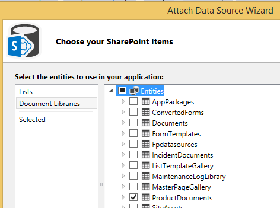
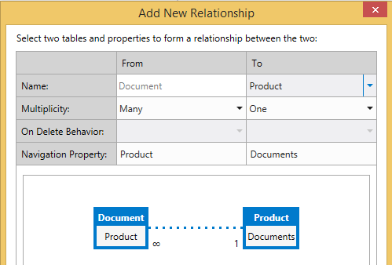
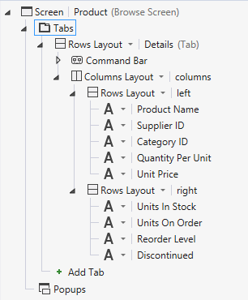

# 文件庫建立關聯的實體
在 SharePoint 中使用的文件庫功能，您可以建立或上傳文件與清單或實體中的個別項目相關聯。例如，您可能會使用文件庫來儲存銷售文獻並針對每個產品的產品手冊清單中。中的雲端商務增益集，您可以與產生關聯的文件庫實體建立關聯。
## 建立文件庫的關聯

實體與建立關聯的文件庫的程序包含三個步驟：
  
    
    

1. 新增至您的專案的 SharePoint 文件庫作為資料來源。
    
    > **重要**
      > 您必須先建立 SharePoint 網站上的文件庫。它必須包含自訂欄對應至您的實體的唯一欄位。
2. 建立文件庫與實體之間的關係。
    
  
3. 將文件庫新增至螢幕。根據您是否正在建立新的畫面或將它新增至現有的螢幕不同程序。
    
  

### 若要新增的文件庫

1. 在 **方案總管**] 中開啟 [ **資料來源**] 節點的快顯功能表並選擇 [ **新增資料來源**。
    
  
2. 在 **附加資料來源精靈]**中，選擇 [ **SharePoint** ] 圖示，然後選擇 [ **下一步**] 按鈕。
    
  
3. 在 [ **輸入連接資訊**] 頁面上的 [ **指定 SharePoint 網站位址**] 文字方塊中輸入您的 SharePoint 開發人員網站的 URL，然後選擇 [ **下一步**] 按鈕。
    
  
4. 在 [ **選擇您的 SharePoint 項目**] 頁面的左窗格中，選擇 [ **文件庫**清單項目，並在右窗格中，選取 [文件庫圖 1 所示的核取方塊。
    
   **圖 1。選取文件庫**

  

     
  

    圖 2 顯示 SharePoint 網站上的文件庫。
    

   **圖 2。請注意自訂的 [ProductName] 欄**

  

     
  

    
    > **重要**
      > 文件庫必須存在並必須包含自訂的資料行對應至您的實體的唯一欄位。
5. 在 **指定資料來源的名稱**中，輸入名稱，然後選擇 [ **完成**] 按鈕。
    
  

### 若要建立關聯

1. 在 **方案總管**] 中開啟文件庫實體，然後的 **觀點**列上，選擇 [ **伺服器**] 索引標籤。
    
  
2. 在工具列上，選擇 [ **關聯**]。
    
  
3. 在 **新增新的關聯**] 對話方塊的 [ **到**] 下拉式清單中，選擇您想要建立關聯，如圖 3 所示的實體。
    
   **圖 3。建立關聯。**

  

     
  

  

  
4. **外部**索引鍵] 下拉式清單中，選擇 [文件庫中的 [自訂] 欄。
    
  
5. 在 **主要**金鑰] 下拉式清單中，從對應至 [自訂] 欄中的文件庫，您實體選擇欄位，然後選擇 **[確定]**按鈕。例如 ProductName 自訂欄、 選擇 [ProductName] 欄位中，如圖 4 所示。
    
   **圖 4。相關的外部和主要金鑰**

  

     
  

    
    > **注意事項**
      > 欄位必須是相同的資料類型的 **外部**索引鍵欄位。

### 若要將文件庫新增至一組新畫面

1. 在 **方案總管**] 中開啟文件庫、 相關聯的實體，然後的 **觀點**列上，選擇 [ **HTMLClient** ] 索引標籤。
    
  
2. 在工具列上，選擇 [ **螢幕**]。
    
  
3. **新增新的畫面**] 對話方塊中，在 **畫面上設定名稱**] 文字方塊中，輸入螢幕集的名稱。
    
  
4. 在 **畫面上的資料**] 清單中，選擇您的實體。
    
  
5. **額外的資料以包含**清單中，選取文件庫的核取方塊，然後選擇 [ **確定**] 按鈕。
    
    圖 5 顯示設定的產品實體畫面。
    

   **圖 5。產品] 畫面上設定**

  

     
  

    會建立為實體 **檢視**畫面包含具有 **新增文件**] 按鈕的 **文件**] 索引標籤。[] 按鈕會新增或上傳文件顯示快顯功能表。
    
  

### 若要將文件庫新增至現有的畫面

1. 在 **方案總管**] 中開啟您想要在文件庫建立關聯並選擇 [ **開啟**] 畫面上的快顯功能表。
    
  
2. 螢幕設計工具中選擇 [ **] 索引標籤**] 節點圖 6 所示，然後選擇 [ **新增] 索引標籤**] 節點。
    
   **圖 6。[標籤] 節點**

  

     
  

  

  
3. 在 [ **屬性**] 視窗中，選擇 [ **顯示名稱**屬性並輸入有意義的 [新增] 索引標籤名稱。例如，文件。
    
  
4. 在螢幕設計左邊的窗格，選擇 [ **新增** _DocumentLibraryName_連結 _DocumentLibraryName_所在的文件庫名稱的圖 7 所示。
    
   **圖 7。新增 ProductDocuments 連結**

  

     
  

  

  
5. 在中央窗格中，選擇 [新增] 索引標籤] 節點、 展開 [ **新增**] 清單中，然後選擇 _DocumentLibraryName_。
    
  
6. 依序展開 [新增] 索引標籤的 [ **命令列**節點圖 8 所示，並選擇 [ **新增]**。
    
   **圖 8。命令列節點**

  

     
  

  

  
7. 在 [ **新增] 按鈕**] 對話方塊中，接受預設選項，選擇 **[確定]**按鈕。
    
    圖 9 的預設方法， **createOrUploadDocument**顯示 [ **新增] 按鈕**] 對話方塊。
    

   **圖 9。[新增] 按鈕] 對話方塊**

  

     
  

  

  
8. 在 [ **屬性**] 視窗中，選擇 [ **顯示名稱**屬性並輸入該按鈕的有意義的名稱。例如，新增文件。
    
    螢幕現在包含使用命令列上按鈕的 **文件**] 索引標籤。[] 按鈕會新增或上傳文件顯示快顯功能表。
    
  

## 其他資源

-  [開發雲端商務增益集](develop-cloud-business-add-ins.md)
    
  
-  [事件管理員： 的雲端商務增益集教學課程](incident-manager-a-cloud-business-add-in-tutorial.md)
    
  

