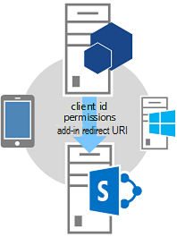
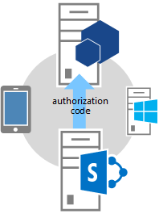
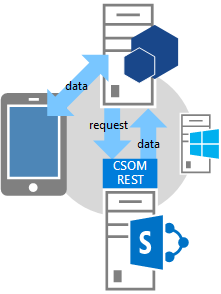

# 驗證程式碼 OAuth 流程 for SharePoint 增益集
了解 OAuth 流程增益集的要求存取上飛，以及如何使用 OAuthAuthorize.aspx 頁面和SharePoint重新導向 URI 的SharePoint資源的權限。
## 取得增益集從SharePoint即時要求存取] 權限概觀
<a name="Overview"> </a>


> **注意事項**
> 本文假設您已熟悉使用 [建立 SharePoint 增益集使用低信任層級授權](creating-sharepoint-add-ins-that-use-low-trust-authorization.md)與概念與 OAuth 背後的原則。如需 OAuth 的詳細資訊，請參閱 [OAuth.net](http://oauth.net/)和 [Web 的驗證通訊協定 (oauth)](http://datatracker.ietf.org/doc/active/#oauth)。
  
    
    

在某些情況下，增益集可以要求存取即時; SharePoint資源的權限即 **增益集可以要求存取動態於執行階段時的SharePoint資源的權限** ，而不是在增益集安裝階段。要從、 啟動或甚至是安裝在SharePoint沒有這種類型的增益集。例如，它可能是原生裝置增益集] 中從任何網站或從想要存取SharePoint飛入的資源的 Office 應用程式啟動Office 增益集啟動增益集。
  
    
    

> **注意事項**
> 僅有管理的增益集想要存取之資源的權限的使用者可以執行這種類型的增益集。例如，如果增益集要求的僅的讀取權限的網站具有讀取，但沒有管理使用者權限至網站無法執行增益集。
  
    
    

若要能夠到SharePoint，這種透過賣方儀表板或 appregnew.aspx] 頁面上的 [ **增益集必須先登錄** 類型。如需登錄的增益集透過賣方儀表板或 appregnew.aspx 的詳細資訊，請參閱 [註冊 sharepoint2013 增益集](register-sharepoint-add-ins-2013.md)。
  
    
    
您已註冊增益集之後， *安全性主體*  ，且擁有 identity 只是使用者及群組執行動作。此 identity 稱為增益集主體。使用者和群組，例如增益集主體具有特定權限。如需增益集的主體的詳細資訊，請參閱 [註冊 sharepoint2013 增益集](register-sharepoint-add-ins-2013.md)。
  
    
    
當您註冊增益集時，您將取得用戶端識別碼、 用戶端密碼、 增益集的網域，並將 URI 重新導向的增益集主體。使用授權伺服器、 Microsoft Azure Access Control Service (ACS)登錄此資訊。
  
    
    

## 了解 OAuth 流程增益集的要求即時的權限
<a name="Flow"> </a>

本節摘要說明SharePoint增益集的 OAuth 驗證和授權流程要求即時的權限。流程稱為 **驗證程式碼流程** 。依指定順序說明如何不從啟動內SharePoint增益集可以存取SharePoint中的資源。
  
    
    

> **注意事項**
> 流程 **包括一系列的增益集、 SharePoint、 授權伺服器 (這是 ACS) 之間的互動與使用者** 在執行階段。因此，流程需要SharePoint Online或連線至網際網路，可以彼此 ACS 讓SharePoint伺服器陣列。無法連線至網際網路的SharePoint伺服器陣列必須使用 [高信任授權系統](creating-sharepoint-add-ins-that-use-high-trust-authorization.md)。
  
    
    

必須要有的 web 應用程式或從SharePoint分開主控的服務。即使增益集的裝置增益集，已有 web 應用程式或服務即使 web 元件用於其他人則是 nothing 註冊與 ACS (請參閱上述) 的 URL。簡化了程序，本文會假定增益集是名為 Contoso.com 的 web 應用程式。應用程式會使用SharePoint用戶端物件模型 (CSOM) 或SharePoint REST Api 來呼叫SharePoint。當應用程式會先嘗試存取SharePoint時、 SharePoint會從它可以傳送至 Contoso.com 應用程式的 ACS 要求授權程式碼。應用程式接著會使用授權程式碼以從 ACS 要求存取權杖。一旦有存取 token，Contoso.com 應用程式包含它SharePoint其要求。
  
    
    

### 請參閱流程詳細的範例
<a name="Fly"> </a>

假設 Contoso 提供線上相片列印服務。使用者想要列印一些相片。使用者想要將同意提供給 Contoso 相片列印服務來存取並從使用者維持在SharePoint Online網站 `fabrikam.sharepoint.com`的相片庫的一組列印相片。
  
    
    

  
    
    

  
    
    
註冊的相片列印應用程式，讓它具有將 URI 重新導向用戶端識別碼、 用戶端密碼。重新導向 Contoso 在其登錄的增益集時所提供的 URI 是 `https://contoso.com/RedirectAccept.aspx`。用戶端識別碼和用戶端秘密資訊會儲存包含相片列印應用程式的 web.config 檔案中。以下是如何輸入的 web.config 檔案中的用戶端識別碼和用戶端密碼的範例。
  
    
    


```XML

<configuration>
  <appSettings>
    <add key="ClientId" value="c78d058c-7f82-44ca-a077-fba855e14d38 "/>
    <add key="ClientSecret" value="SbALAKghPXTjbBiLQZP+GnbmN+vrgeCMMvptbgk7T6w= "/>

  </appSettings>

</configuration>
```

以下是驗證程式碼流程中的步驟。
  
    
    

    
> **秘訣**
> 這些步驟，請參閱 TokenHelper.cs (或.vb) 檔案中的方法。未編譯此 managed 程式碼，因此有它沒有參照主題。不過，檔案本身完全標記為備註的與每個類別成員參數的描述及傳回值。請考慮擁有一份開啟，請參閱 ＜ 您閱讀這些步驟。
  
    
    


||||
|:-----|:-----|:-----|
|**1** <br/> ||**用戶端會開啟應用程式並再將它導向SharePoint網站的資料。** <br/> 使用者瀏覽至 [Contoso 相片列印] 網站 UI 表示使用者可以列印保留在任何SharePoint Online網站中的相片。本範例 URL 事是 `https://contoso.com/print/home.aspx`。 <br/> 相片列印增益集在要求使用者輸入 photo 集合的 URL。使用者輸入指向SharePoint Online網站的 URL：  `https://fabrikam.sharepoint.com/`。 <br/> |
|**2** <br/> ||**增益集將重新導向至SharePoint網站授權 URL。** <br/> 當使用者按一下按鈕，以取得相片時，Contoso 相片列印增益集瀏覽器重新導向至 `https://fabrikam.sharepoint.com/`。此重新導向是 HTTP 302 重新導向回應。 <br/> 如果您使用 Microsoft.NET、 **Response.Redirect**是您可以從您的程式碼進行重新導向的幾種方法之一。使用中專案的 TokenHelper.cs (或.vb) 檔案，您的程式碼可以呼叫 (具有三個引數中使用多載) 多載的 **GetAuthorizationUrl**方法。這個方法讓您建構 OAuthAuthorize.aspx 重新導向 URL。或者，您的程式碼可以手動建構 URL。 <br/> 例如，如果您選擇呼叫 **GetAuthorizationUrl**方法來建構 OAuthAuthorize.aspx 重新導向 URL 為您在您的專案中使用 TokenHelper.cs (或.vb) 程式碼是，如下所示： <br/>  `Response.Redirect(TokenHelper.GetAuthorizationUrl(`           `sharePointSiteUrl.ToString(),`           `"Web.Read List.Write",`           `"https://contoso.com/RedirectAccept.aspx"));` <br/> 如果您在查看三個參數方法的多載 **GetAuthorizationUrl** TokenHelper.cs (或.vb) 中，您會看到的第二個參數是權限範圍參數，這是空白分隔的清單格式為速記增益集的要求的權限。如需權限範圍的詳細資訊，請參閱 [了解權限範圍別名和 OAuthAuthorize.aspx] 頁面的使用](#Scope)。第三個參數必須是相同的重新導向登錄的增益集時所使用的 URI。如需登錄的詳細資訊，請參閱 [註冊 sharepoint2013 增益集](register-sharepoint-add-ins-2013.md)。您也將會看到傳回的字串會包含查詢字串參數的 URL。 <br/> 如果您偏好，您可以手動建構 OAuthAuthorize.aspx 重新導向 URL。例如，Contoso 相片列印增益集將重新導向至使用者的 URL 在此例中為： <br/>  `https://fabrikam.sharepoint.com/_layouts/15/OAuthAuthorize.aspx?client_id=client_GUID&amp;scope=app_permissions_list&amp;response_type=code&amp;redirect_uri=redirect_uri` <br/> 範例會顯示為 Contoso 相片列印增益集傳送 OAuth 用戶端識別碼和重新導向 URI Fabrikam 網站為查詢字串參數。以下是範例查詢字串值的 GET 要求的範例。已新增分行符號的明確性。實際的目標 URL 為單行。 <br/>  `GET /authcode HTTP/1.1`           `Host: fabrikam.sharepoint.com`                     `/oauthauthorize.aspx`           `?client_id= c78d058c-7f82-44ca-a077-fba855e14d38`           `&amp;scope=list.read`           `&amp;response_type=code`           `&amp;redirect_uri= https%3A%2F%2Fcontoso%2Ecom%2Fredirectaccept.aspx`           <br/> 如果您想個別同意快顯] 對話方塊，您可以新增查詢參數 **IsDlg=1**至 URL 建構如下所示： <br/>  `/oauthauthorize.aspx?IsDlg=1&amp;client_id= c78d058c-7f82-44ca-a077-fba855e14d38&amp;scope=list.read&amp;response_type=code&amp;redirect_uri= https%3A%2F%2Fcontoso%2Ecom%2Fredirectaccept.aspx` <br/> |
|**3** <br/> ||**使用者可將增益集的權限授與因此SharePoint會顯示 [同意] 頁面。** <br/> 如果使用者不已登入 Fabrikam SharePoint Online網站，會提示使用者登入。當使用者登入時， SharePoint轉譯 HTML 同意] 頁面。 <br/> 同意頁面提示使用者授與 (或拒絕) Contoso 相片列印增益集的增益集要求的權限。在此例中，使用者就會授與增益集讀取存取權 Fabrikam 上的使用者的圖片庫。 <br/> |
|**4** <br/> ||**SharePoint從 ACS 要求短期的授權碼。** <br/> Fabrikam SharePoint Online網站要求 ACS 建立唯一的此組合使用者和增益集的短期 (大約 5 分鐘) 授權程式碼。 <br/> ACS 傳送至 Fabrikam 網站的授權碼。 <br/> |
|**5** <br/> ||**SharePoint Online網站重新導向至應用程式的已登錄的重新導向將授權程式碼傳遞至增益集的 URI。** <br/> Fabrikam SharePoint Online網站會在瀏覽器重新導向回至 Contoso 透過 HTTP 302 回應。此重新導向 URL 建構使用重新導向的相片列印增益集已 registrated 時所指定的 URI。它也包括授權程式碼以查詢字串。重新導向 URL 被結構如下： <br/>  `https://contoso.com/RedirectAccept.aspx?code=<authcode>` <br/> |
|**6** <br/> ||**增益集使用授權程式碼向 ACS 驗證要求且無效的授權的程式碼，然後將存取並重新整理權杖傳送至增益集要求存取權杖。** <br/> Contoso 的查詢參數，從擷取的授權程式碼和則還是會包括，以及用戶端識別碼及存取權杖至 ACS 要求中的用戶端密碼。 <br/> 如果您使用 managed 程式碼和SharePoint CSOM、 TokenHelper.cs (或.vb) 檔案，讓 ACS 要求的方法是 **GetClientContextWithAuthorizationCode**。在此例中程式碼看起來類似下面的 (  `authCode`是對其指派授權程式碼的變數)： <br/>  `TokenHelper.GetClientContextWithAuthorizationCode(`           `"https://fabrikam.sharepoint.com/",`           `"00000003-0000-0ff1-ce00-000000000000",`           `authCode,`           `"1ee82b34-7c1b-471b-b27e-ff272accd564",`           `new Uri(Request.Url.GetLeftPart(UriPartial.Path)));`           <br/> 如果您查看 TokenHelper.cs (或.vb) 檔案，則 `targetPrincipalName` **GetClientContextWithAuthorizationCode**方法的第二個參數。這個值一律為常數中存取SharePoint增益集的" `00000003-0000-0ff1-ce00-000000000000`"。您也會看到，如果您追蹤通話階層 **GetClientContextWithAuthorizationCode**，從它會取得用戶端識別碼和密碼將 web.config 檔案中。 <br/> ACS 收到 Contoso 的要求及驗證用戶端識別碼、 用戶端密碼、 重新導向 URI 及授權的程式碼。如果所有有效，ACS 無效的授權程式碼 (它可以搭配使用只有一次)，並建立重新整理權杖及存取權杖，則會傳回為 Contoso。 <br/> Contoso 應用程式可以快取供在稍後的要求重複使用此存取權杖。根據預設，存取權杖是很好的大約 12 小時。每個存取權杖是專屬於授權的原始要求中指定的使用者帳戶授與該要求中指定的服務存取。增益集應該存取權杖安全地儲存。 <br/> Contoso 應用程式也可以快取的重新整理 token。根據預設，重新整理權杖是很好的 6 個月。每當存取權杖到期時重新整理權杖可折的新存取權杖從 ACS。如需憑證的詳細資訊，請參閱 [處理安全性權杖的提供者主控低信任層級 SharePoint 增益集](handle-security-tokens-in-provider-hosted-low-trust-sharepoint-add-ins.md)。 <br/> |
|**7** <br/> ||**增益集現在可以使用存取權杖要求資料從SharePoint網站它可以顯示給使用者。** <br/> Contoso 包含要進行 REST API 呼叫或 CSOM 要求SharePoint、 傳遞給 OAuth 存取 token HTTP **Authorization**標頭中的存取 token。 <br/> SharePoint傳回的資訊要求該 Contoso。如需此要求提出時，請參閱 [處理安全性權杖的提供者主控低信任層級 SharePoint 增益集](handle-security-tokens-in-provider-hosted-low-trust-sharepoint-add-ins.md)。 <br/> |
   

## 了解權限範圍別名和 OAuthAuthorize.aspx] 頁面的使用
<a name="Scope"> </a>

本節假設您熟悉文章 [增益集 (英文) SharePoint 2013 權限](add-in-permissions-in-sharepoint-2013.md)。表 1 顯示相同的增益集的權限要求範圍中的文章，除了其顯示的 Uri 有一部額外一欄 ( **範圍別名** ) 和 「 完全控制 」 權限中沒有 **可用的權限** ] 欄中，因為要求即時存取SharePoint資源的權限增益集無法要求右完全控制。
  
    
    
在 [ **範圍別名** ] 欄中所列的值是速記版的與其對應 **範圍 URI** ] 欄中的項目。別名僅使用增益集要求即時存取SharePoint資源的權限。(從SharePoint所啟動的增益集的增益集資訊清單可用範圍 URI 值。這些增益集要求權限增益集在安裝期間。)
  
    
    
範圍別名只能用於使用 OAuthAuthorize.aspx 重新導向頁面的內容。步驟 2 之 OAuth 流程 ＞ 所述的上一個] 區段中，使用 managed 程式碼增益集時所示，別名時使用您呼叫 TokenHelper.cs (或.vb) 的 **GetAuthorizationUrl**方法將專案中。以下是另一個範例：
  
    
    


```cs

Response.Redirect(TokenHelper.GetAuthorizationUrl(
    sharePointSiteUrl.ToString(), 
    "Web.Read List.Write ", 
    "https://contoso.com/RedirectAccept.aspx "));
```

 _scope_參數值 `Web.Read List.Write`，是範例會要求使用範圍別名的權限的方式。 _scope_參數是空白分隔的權限範圍和右邊的要求。
  
    
    
如果您不使用 managed 程式碼、 範圍別名使用重新導向 URL 中的 [領域] 欄位。例如：
  
    
    
 `https://fabrikam.sharepoint.com/_layout/15/OAuthAuthorize.aspx?client_id=c78d058c-7f82-44ca-a077-fba855e14d38&amp;scope=list.write&amp;response_type=code&amp;redirect_uri=https%3A%2F%2Fcontoso%2Ecom%2Fredirectaccept.aspx`
  
    
    

> **注意事項**
> 範圍的說明，請參閱 [增益集 (英文) SharePoint 2013 權限](add-in-permissions-in-sharepoint-2013.md)。
  
    
    


**表 1。SharePoint增益集的權限要求範圍 Uri 和其對應的別名**

||||
|:-----|:-----|:-----|
|**範圍 URI** <br/> |**範圍別名** <br/> |**可用的權限** <br/> |
|http://sharepoint/content/sitecollection <br/> |網站 <br/> |讀取、 寫入、 管理 <br/> |
|http://sharepoint/content/sitecollection/web <br/> |Web <br/> |讀取、 寫入、 管理 <br/> |
|http://sharepoint/content/sitecollection/web/list <br/> |List <br/> |讀取、 寫入、 管理 <br/> |
|http://sharepoint/content/tenant <br/> |AllSites <br/> |讀取、 寫入、 管理 <br/> |
|http://sharepoint/bcs/connection <br/> |無 (目前不支援) <br/> |讀取 <br/> |
|http://sharepoint/search <br/> |搜尋 <br/> |QueryAsUserIgnoreAppPrincipal <br/> |
|http://sharepoint/projectserver <br/> |ProjectAdmin <br/> |管理 <br/> |
|http://sharepoint/projectserver/projects <br/> |專案 <br/> |讀取、寫入 <br/> |
|http://sharepoint/projectserver/projects/project <br/> |專案 <br/> |讀取、寫入 <br/> |
|http://sharepoint/projectserver/enterpriseresources <br/> |ProjectResources <br/> |讀取、寫入 <br/> |
|http://sharepoint/projectserver/statusing <br/> |ProjectStatusing <br/> |SubmitStatus <br/> |
|http://sharepoint/projectserver/reporting <br/> |ProjectReporting <br/> |讀取 <br/> |
|http://sharepoint/projectserver/workflow <br/> |ProjectWorkflow <br/> |提高權限 <br/> |
|http://sharepoint/social/tenant <br/> |AllProfiles <br/> |讀取、 寫入、 管理 <br/> |
|http://sharepoint/social/core <br/> |社交 <br/> |讀取、 寫入、 管理 <br/> |
|http://sharepoint/social/microfeed <br/> |Microfeed <br/> |讀取、 寫入、 管理 <br/> |
|http://sharepoint/taxonomy <br/> |TermStore <br/> |讀取、寫入 <br/> |
   

## 了解如何使用重新導向 URI，並請參閱範例重新導向頁面
<a name="RedirectURI"> </a>


  
    
    
 **重新導向 URI** ，會使用增益集所要求的權限即時 **是 URI 該SharePoint賦予同意之後重新導向至在瀏覽器** (以授權碼包含做為查詢參數)。上述的流程說明的步驟 2 示範其中 URI 是在呼叫 **GetAuthorizationUrl**方法的硬式編碼。或者，ASP.NET 增益集可以也會儲存的重新導向 URI 在 web.config 檔案中如本範例所示：
  
    
    


```XML

<configuration>
  <appSettings>
    <add key="RedirectUri" value="https://contoso.com/RedirectAccept.aspx" />
  </appSettings>
<configuration>
```

您可以呼叫 `WebConfigurationManager.AppSettings.Get("RedirectUri")`擷取值。
  
    
    
 **在重新導向的端點 URI 取得查詢參數的授權碼以及使用它來取得存取 token** ，然後可以用來存取SharePoint。一般而言，端點是相同的頁面或控制器方法或原本嘗試存取SharePointweb 方法。不過，它可以是頁面或方法只會收到授權權杖並再重新導向至另一個頁面或方法。特殊頁面或方法無法傳遞授權權杖快取其。(它具有存留期約 5 分鐘)。或者，它無法取得它快取其存取權杖使用授權權杖。
  
    
    
以下是頁面的在 ASP.NET 應用程式中的這類背後的程式碼範例。請注意下列有關這段程式碼：
  
    
    

- 它會使用Office Developer Tools for Visual Studio所產生的 TokenHelper.cs 檔案。
    
  
- 程式碼會假設為保留授權程式碼的 「 程式碼 」 查詢參數。因為只能由SharePoint呼叫] 頁面上，且只有當它傳遞授權程式碼時，這是安全的。
    
  
- 它會使用 CSOM 用戶端快顯物件來存取SharePoint，但可能也有只是快取的伺服器上的物件並重新導向至另一個頁面。
    
  
- **GetClientContextWithAuthorizationCode**方法使用的授權程式碼來取得存取程式碼。然後會建立SharePoint用戶端快顯物件並修改該物件的事件處理常式 **ExecutingWebRequest** ，讓處理常式會納入SharePoint的所有要求的存取權杖。存取權杖、 作用中快取內的物件。
    
  
- **GetClientContextWithAuthorizationCode**方法會重新導向 URL 傳送回 ACS  `rUrl`參數，但 ACS 會使用它的識別表單以免被竊取授權程式碼。ACS 卻未使用重新導向一次，所以這段程式碼不會循環持續地將重新導向至本身擷取。
    
  
- 程式碼會處理過期的存取權杖的任何佈建。用戶端快顯物件建立之後，它會使用相同的存取權杖。它不完全使用的重新整理 token。這是增益集只能用於工作階段的上次存取權杖的壽命小於適當的策略。
    
  
針對較複雜的範例使用的重新整理權杖以取得新的存取 token，請參閱下一節。
  
    
    


```cs

public partial class RedirectAccept : System.Web.UI.Page
{
    protected void Page_Load(object sender, EventArgs e)
    {
        string authCode = Request.QueryString["code"];
        Uri rUri = new Uri("https://contoso.com/RedirectAccept.aspx");

        using (ClientContext context = TokenHelper.GetClientContextWithAuthorizationCode(
            "https://fabrikam.sharepoint.com/", 
            "00000003-0000-0ff1-ce00-000000000000",
            authCode,
            "1ee82b34-7c1b-471b-b27e-ff272accd564".
            rUri))
       {
           context.Load(context.Web);
           context.ExecuteQuery();

           Response.Write("<p>" + context.Web.Title + "</p>");
       }
    }
}

```


## 取得存取SharePoint頁面背後的程式碼範例
<a name="Default"> </a>

下列程式碼後置 Default.aspx 頁面。此頁面假設的案例的預設頁面是 [開始] 頁面上的增益集和也是下列有關這段程式碼增益集附註的已登錄重新導向 URL：
  
    
    

- 查詢字串中驗證程式碼先檢查 **Page_Load**方法。會有一個如果瀏覽器的重新SharePoint導向頁面。如果有的話，程式碼使用它來取得新的重新整理 token，以其不同工作階段延續長期快取中快取。
    
  
- 重新整理權杖快取中再檢查方法。
    
  - 如果沒有一，它會取得一個告知SharePoint需要 (在網站範圍的寫入權限) 的權限和授權碼詢問SharePoint 。授與權限，提示使用者如果被授與、 SharePoint從 ACS 取得授權的程式碼，並回復為上重新導向的查詢參數傳送給這個相同的頁面。
    
  
  - 如果沒有快取的重新整理權杖，方法會使用它來取得存取 token，直接從 ACS。相同的本文結尾處的上一節的範例，建立SharePoint用戶端快顯物件可存取權杖。使用快取的重新整理權杖直接從 ACS 取得存取 token，可以避免SharePoint工作階段啟動額外的網路呼叫讓增益集的重新整理權杖快取週期內重新執行的使用者體驗更快的啟動。
    
  
- 相同的上一節結尾範例中，這段程式碼會處理過期的存取權杖的任何佈建。用戶端快顯物件建立之後，它會使用相同的存取權杖。存取 token，除了重新整理權杖快取是一種方式，以防止過期的存取權杖。使它會呼叫 **GetAccessToken**方法才有不會過期的存取權杖快取中，則會修改下列程式碼。不過，接受已在 cookie 中的用戶端上快取的重新整理 token 時例如存取權杖只應在伺服器端快取中的安全性考量。重新整理權杖加密並只能由 ACS 未加密。但是存取權杖純粹 (使用 Base 64 編碼) 編碼及可以輕鬆地解碼由攔截攻擊。
    
  
- 在這段程式碼會參照 **TokenCache**類別定義下方。
    
  

```cs

using System;
using System.Collections.Generic;
using System.Linq;
using System.Web;
using System.Web.UI;
using System.Web.UI.WebControls;
using Microsoft.SharePoint.Samples;
using Microsoft.SharePoint.Client;

namespace DynamicAppPermissionRequest
{
    public partial class Default : System.Web.UI.Page
    {
        protected void Page_Load(object sender, EventArgs e)
        {
            Uri sharePointSiteUrl = new Uri("https://fabrikam.sharpoint.com/print/");

            if (Request.QueryString["code"] != null)
            {
                TokenCache.UpdateCacheWithCode(Request, Response, sharePointSiteUrl);
            }

            if (!TokenCache.IsTokenInCache(Request.Cookies))
            {
                Response.Redirect(TokenHelper.GetAuthorizationUrl(sharePointSiteUrl.ToString(), 
                                                                  "Web.Write"));
            }
            else
            {
                string refreshToken = TokenCache.GetCachedRefreshToken(Request.Cookies);
                string accessToken = 
                TokenHelper.GetAccessToken(
                           refreshToken, 
                           "00000003-0000-0ff1-ce00-000000000000", 
                           sharePointSiteUrl.Authority, 
                           TokenHelper.GetRealmFromTargetUrl(sharePointSiteUrl)).AccessToken;

                using (ClientContext context = 
                       TokenHelper.GetClientContextWithAccessToken(sharePointSiteUrl.ToString(), 
                                                                   accessToken))
                {
                    context.Load(context.Web);
                    context.ExecuteQuery();

                    Response.Write("<p>" + context.Web.Title + "</p>");
                }
            }
        }
    }
}
```

以下是先前的範例程式碼呼叫的權杖快取模組的程式碼範例。它會使用 cookie 以快取。還有其他快取的選項。如需詳細資訊，請參閱 [處理安全性權杖的提供者主控低信任層級 SharePoint 增益集](handle-security-tokens-in-provider-hosted-low-trust-sharepoint-add-ins.md)。
  
    
    


```cs

using System;
using System.Collections.Generic;
using System.Linq;
using System.Web;
using Microsoft.SharePoint.Samples;

namespace DynamicAppPermissionRequest
{
    public static class TokenCache
    {
        private const string REFRESH_TOKEN_COOKIE_NAME = "RefreshToken";

        public static void UpdateCacheWithCode(HttpRequest request, 
                                               HttpResponse response, 
                                               Uri targetUri)
        {
            string refreshToken = 
                TokenHelper.GetAccessToken(
                    request.QueryString["code"], 
                    "00000003-0000-0ff1-ce00-000000000000", 
                    targetUri.Authority, 
                    TokenHelper.GetRealmFromTargetUrl(targetUri), 
                    new Uri(request.Url.GetLeftPart(UriPartial.Path)))
                   .RefreshToken;
            SetRefreshTokenCookie(response.Cookies, refreshToken);
            SetRefreshTokenCookie(request.Cookies, refreshToken);
        }

        internal static string GetCachedRefreshToken(HttpCookieCollection requestCookies)
        {
            return GetRefreshTokenFromCookie(requestCookies);
        }

        internal static bool IsTokenInCache(HttpCookieCollection requestCookies)
        {
            return requestCookies[REFRESH_TOKEN_COOKIE_NAME] != null;
        }

        private static string GetRefreshTokenFromCookie(HttpCookieCollection cookies)
        {
            if (cookies[REFRESH_TOKEN_COOKIE_NAME] != null)
            {
                return cookies[REFRESH_TOKEN_COOKIE_NAME].Value;
            }
            else
            {
                return null;
            }
        }

        private static void SetRefreshTokenCookie(HttpCookieCollection cookies, 
                                                  string refreshToken)
        {
            if (cookies[REFRESH_TOKEN_COOKIE_NAME] != null)
            {
                cookies[REFRESH_TOKEN_COOKIE_NAME].Value = refreshToken;
            }
            else
            {
                HttpCookie cookie = new HttpCookie(REFRESH_TOKEN_COOKIE_NAME, 
                                                   refreshToken);
                cookie.Expires = DateTime.Now.AddDays(30);
                cookies.Add(cookie);
            }
        }
    }
}

```


## 其他資源
<a name="AR"> </a>


-  [授權與驗證的 SharePoint 增益集](authorization-and-authentication-of-sharepoint-add-ins.md)
    
  
-  [建立 SharePoint 增益集使用低信任層級授權](creating-sharepoint-add-ins-that-use-low-trust-authorization.md)
    
  
-  [SharePoint Add-ins](sharepoint-add-ins.md)
    
  
-  [設定內部部署開發環境的 SharePoint 增益集](set-up-an-on-premises-development-environment-for-sharepoint-add-ins.md)
    
  
-  [開始建立提供者主控 SharePoint 增益集](get-started-creating-provider-hosted-sharepoint-add-ins.md)
    
  
