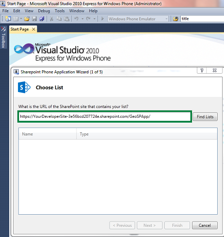

# 步驟 3： 建立行動應用程式和登錄的推入通知
了解如何使用 Windows Phone SharePoint 清單應用程式範本來建立SharePoint Add-in隨附的行動裝置應用程式。
 * **適用於:*** 
  
    
    

 **本文內容**
  
    
    
 [建立隨附的行動裝置應用程式的先決條件](#Step3_CReateCompanionMobileApp_Prerequisites)
  
    
    
 [建置 SharePoint 的應用程式隨附的行動裝置應用程式](#Step3_CReateCompanionMobileApp_CReateCompanionMobileApp)
  
    
    
 [將 SharePoint 隨附的 Windows Phone 應用程式新增推入通知](#Step3_CReateCompanionMobileApp_AddPushNotificationToCompanionApp)
  
    
    
 [其他資源](#bk_addresources)
This is the third article in a three-part series that shows how to create a companion mobile app for SharePoint. For more information, see  [如何： 建立 sharepoint 的同一系列文件行動應用程式的應用程式](d124d2ea-f772-495c-941c-6507d6da2c17.md).
  
    
    

In this step, you create a companion Windows Phone app by using the Windows Phone SharePoint List Application template (for the SharePoint Add-in created in  [步驟 1： 在 SharePoint 2013 中建立一個清單為基礎提供者裝載應用程式](e79ee2e7-0a80-4858-a311-c4f1f8d72a56.md)) and register your mobile app to receive push notifications.You create a Windows Phone app from the Windows Phone SharePoint List Application template, specifying the **appWebUrl** for your SharePoint Add-in. In this procedure, you have a single list in your SharePoint Add-in (created in [步驟 1： 在 SharePoint 2013 中建立一個清單為基礎提供者裝載應用程式](e79ee2e7-0a80-4858-a311-c4f1f8d72a56.md)). If you have multiple lists in your app, see  [操作方法： 使用多個 SharePoint 2013 中的 Windows Phone 應用程式清單](http://msdn.microsoft.com/library/5251d35a-d659-49b3-8e0d-dfd4a7faee6b%28Office.15%29.aspx) for more information.建立行動裝置應用程式之後，您可以開發 **Notifications**類別訂閱推入通知，實作通知事件處理常式和儲存在電話上的通知與相關的資訊。您也將 XAML 頁面新增至您的應用程式，以允許使用者在註冊或取消登錄的推入通知的控制項。 **appWebUrl**是SharePoint Add-in的 URL。此 URL 的格式是 **https://<name of your developer site>.GUID.sharepoint.com/<SharePoint app name>**。在此程序，我們使用提供者主控SharePoint Add-in ，並部署Office 365上。
## 建立隨附的行動裝置應用程式的先決條件
<a name="Step3_CReateCompanionMobileApp_Prerequisites"> </a>

若要完成這些步驟，您需要下列項目：
  
    
    

- Visual Studio Express 2010 與 [Microsoft SharePoint SDK for Windows Phone 7.1](http://www.microsoft.com/en-us/download/details.aspx?id=30476)SharePoint Windows Phone 範本]。
    
  
- An SharePoint Add-in deployed on Office 365. For more information, see  [步驟 1： 在 SharePoint 2013 中建立一個清單為基礎提供者裝載應用程式](e79ee2e7-0a80-4858-a311-c4f1f8d72a56.md).
    
  

### 若要知道建立隨附的行動裝置應用程式的核心概念
<a name="Step3_CReateCompanionMobileApp_CoewConcepts"> </a>

之前完成這些步驟，您應該在表格 1 中會有概念的基本知識。
  
    
    

**表 1。行動裝置應用程式的核心概念**


|**文章標題**|**描述**|
|:-----|:-----|
| [Visual Studio 中的 Windows Phone SharePoint 2013 應用程式範本的概觀 (英文)](http://msdn.microsoft.com/library/6ae27957-fa41-4e6f-92e3-db11dae1f6c2%28Office.15%29.aspx) <br/> |了解安裝的 Windows Phone SharePoint 軟體開發套件 (英文) 行動裝置應用程式開發的 Visual Studio 範本。 <br/> |
| [操作方法： 設定及在 SharePoint 2013 應用程式中使用 Windows Phone 推入通知](http://msdn.microsoft.com/library/68fa2138-86d9-4e35-9c7c-5cd292087b80%28Office.15%29.aspx#BKMK_NotificationPhoneApp) <br/> |了解如何開發 Windows Phone 應用程式接收推入通知。 <br/> |
   

## 建置 SharePoint 的應用程式隨附的行動裝置應用程式
<a name="Step3_CReateCompanionMobileApp_CReateCompanionMobileApp"> </a>

In this section, you create a mobile companion Windows Phone app by using the Windows Phone SharePoint List Application template. The mobile companion app is used by technicians to view and edit the tasks that are assigned to them and to get push notifications when new tasks are assigned to them. This app uses the list created in  [步驟 1： 在 SharePoint 2013 中建立一個清單為基礎提供者裝載應用程式](e79ee2e7-0a80-4858-a311-c4f1f8d72a56.md) as the target list. This procedure is similar to creating a Windows Phone SharePoint list app. For more information, see [操作方法： 建立 Windows Phone SharePoint 2013 清單應用程式](http://msdn.microsoft.com/library/3e40c475-f4c1-4a4f-a3e5-1a55f814d272%28Office.15%29.aspx). The difference is the URL you provide in the **SharePoint Phone Application wizard** in Visual Studio. You need an **appWebUrl** to create your companion mobile app.
  
    
    

### 若要建立行動裝置應用程式


1. 使用 [ **以系統管理員身分執行**] 選項，以啟動Visual Studio 。
    
  
2. 選擇 [ **檔案**]， **新** **專案**。
    
    **新增專案**] 對話方塊隨即出現。
    
  
3. 在 [ **新增專案**] 對話方塊中，依序展開 [ **Visual C#** ] 節點，然後按 **視窗電話 Silverlight**節點。(請確定目標.NET Framework 版本設為 **4**)。
    
    > **注意事項**
      > 安裝 SharePoint SDK 的 Windows Phone 範本只能在 C# 專案中運作。不提供Visual Basic專案的範本。
4. 在 [ **範本**] 窗格中，選擇 [ **Windows Phone SharePoint 清單應用程式**範本，並授與專案名稱，例如SupportCenterCompanionPhoneApp。
    
  
5. 選擇 **[確定]**按鈕。 **SharePoint 電話應用程式精靈]**隨即出現。您可以使用此精靈，選擇 [SharePoint 清單中您的 SharePoint 應用程式，並設定該清單，以決定您的 Windows Phone 應用程式中的顯示方式的屬性。
    
  
6. Specify the **appweburl** URL of your SharePoint app created in [步驟 1： 在 SharePoint 2013 中建立一個清單為基礎提供者裝載應用程式](e79ee2e7-0a80-4858-a311-c4f1f8d72a56.md), as shown in Figure 1. The wizard prompts you to enter your SharePoint credentials for the target SharePoint site on your network (that is, an on-premises installation of SharePoint Server).
    
   **圖 1。SharePoint 電話應用程式精靈-步驟 1**

  

     
  

  

  
7. 選擇 [ **尋找清單**。如果您執行Visual Studio帳戶有權存取指定的目標開發人員網站和 SharePoint 應用程式， **SharePoint 電話應用程式精靈]**會顯示該SharePoint Add-in中可用的清單。
    
  
8. Choose **Cases** from the list of available lists in the SharePoint Add-in created in [步驟 1： 在 SharePoint 2013 中建立一個清單為基礎提供者裝載應用程式](e79ee2e7-0a80-4858-a311-c4f1f8d72a56.md).
    
  
9. 選擇 [ **下一步**]。精靈會顯示可用的檢視所選取的清單相關聯。這裡，您可以選擇在清單上所有可用的檢視。
    
  
10. 選取您想要包含在您的 Windows Phone 應用程式中的每一種檢視] 旁的核取方塊。
    
  
11. 選擇 [ **下一步**]。精靈會顯示可使用的作業，選取清單中您的 Windows Phone 應用程式。
    
  
12. 選擇 [ **顯示**並 **編輯**作業，在此步驟。供只能夠檢視及編輯指派給他們的情況下使用行動裝置隨附的 Windows Phone 應用程式。
    
  
13. 選擇 [ **下一步**]。精靈可讓您有機會順序您在上一個步驟中選取的欄位。
    
  
14. 排序的欄位，根據您的需求來選取個別欄位，並移較高或較低的順序來選擇向上或向下箭號。
    
  
15. 選擇 [ **完成**]。Visual Studio建立專案的必要檔案，並開啟 List.xaml 檔案進行編輯。
    
    > **注意事項**
      > Windows Phone 清單型應用程式可以驗證SharePoint Online對第一次，但是可能會失敗第二次進行驗證，並在執行階段顯示伺服器錯誤。若要克服這項錯誤，啟用 cookie 快取 ( `at.CookieCachingEnabled = true;`) 之前 **Authenticator**物件傳遞至 **clientContext.Credentials**，，如下列程式碼，會出現在產生的Visual StudioListDataProvider.cs 檔案中所示。

  ```cs
  
public override ClientContext Context
    {
        get
        {
            if (m_Context != null)
                return m_Context;

            m_Context = new ClientContext(SiteUrl);

            Authenticator at = new Authenticator();
            // To avoid re-authentication error
            at.CookieCachingEnabled = true;
            // In case of Microsoft Online federated authentication, set ADFS authentication scheme preference for passive authentication
            // Example, to set client preference for SAML 2.0 username-password authentication scheme: 
            // at.FederationPassiveAuthUri = "urn:oasis:names:tc:SAML:2.0:ac:classes:Password"; 
            m_Context.Credentials = at;

            return m_Context;
        }
    }
  ```

The basic working version of your companion app is ready at this point. Visual Studio creates all the code that is needed to run the app. You can always enhance the app so that it can perform more complicated tasks. For more information, see  [建置存取 SharePoint 2013 的 Windows Phone 應用程式](http://msdn.microsoft.com/library/36681335-f772-4499-8445-f94481bc18e7%28Office.15%29.aspx).
  
    
    

## 將 SharePoint 隨附的 Windows Phone 應用程式新增推入通知
<a name="Step3_CReateCompanionMobileApp_AddPushNotificationToCompanionApp"> </a>

在此區段中，您可以建立啟用推入通知隨附的行動裝置應用程式上的必要.cs 檔案。您開發 **Notifications**類別訂閱推入通知，實作通知事件處理常式和儲存在電話上的通知與相關的資訊。您也將 XAML 頁面新增至您的應用程式，以允許使用者在註冊或取消登錄的推入通知的控制項。
  
    
    
若要遵循本節中的程序，先執行的步驟中 [建置 SharePoint 的應用程式隨附的行動裝置應用程式](#Step3_CReateCompanionMobileApp_CReateCompanionMobileApp)] 從 Windows Phone SharePoint 清單應用程式範本，使用上一節中建立為目標 SharePoint 清單專案的情況下清單建立Visual Studio專案。本節中的程序假設專案的名稱是SupportCenterCompanionPhoneApp。
  
    
    

### 若要建立管理訂閱的類別及接收通知


1. 在 [ **方案總管**中，選擇 [代表 (名為SupportCenterCompanionPhoneApp) 之專案的節點。
    
  
2. 在 [ **專案**] 功能表上選擇 [ **新增類別**]。[ **新增項目**] 對話方塊會出現在已選取 [C# **類別**範本。
    
  
3. 指定Notifications.cs為檔案的名稱，然後選擇 [ **新增]**。類別檔案新增解決方案和開啟進行編輯。
    
  
4. 取代下列程式碼之檔案的內容。
    
  ```
  
using System;
using System.Net;
using System.Windows;
using System.Windows.Controls;
using System.Windows.Documents;
using System.Windows.Ink;
using System.Windows.Input;
using System.Windows.Media;
using System.Windows.Media.Animation;
using System.Windows.Shapes;
using Microsoft.Phone.Notification;
using Microsoft.SharePoint.Client;
using System.Collections.Generic;
using Microsoft.Phone.Shell;
using System.IO;
using System.Diagnostics;
using System.IO.IsolatedStorage;

namespace SupportCenterCompanionPhoneApp
{
    public class Notification
    {
        #region Static properties and Fields

        private static HttpNotificationChannel HttpChannel
        {
            get;
            set;
        }

        private static ClientContext Context
        {
            get
            {
                return App.DataProvider.Context;
            }
        }

        private static string DeviceAppIdKey = "DeviceAppIDKey";

        private static string ChannelName = "SupportCenterNotificationChannel";

        #endregion

        public static void SubscribeDeviceForNotification()
        {
            //Get Existing Channel
            HttpChannel = HttpNotificationChannel.Find(ChannelName);

            // If Channel is Found and is connected
            if (HttpChannel != null &amp;&amp; HttpChannel.ConnectionStatus == ChannelConnectionStatus.Connected)
            {

                HttpChannel.ChannelUriUpdated += new EventHandler<NotificationChannelUriEventArgs>(OnChannelUriUpdated);
                HttpChannel.ErrorOccurred += new EventHandler<NotificationChannelErrorEventArgs>(OnHttpChannelExceptionOccurred);

                //Subscribe to SharePoint for receving Push Notification
                SubscribeToSharePointNotificationService();
            }
            else
            {
                //create a new channel
                HttpChannel = new HttpNotificationChannel(ChannelName);

                //Register for callback when Channel is opened
                HttpChannel.ChannelUriUpdated += new EventHandler<NotificationChannelUriEventArgs>(OnChannelUriUpdated);
                HttpChannel.ErrorOccurred += new EventHandler<NotificationChannelErrorEventArgs>(OnHttpChannelExceptionOccurred);

                try
                {
                    //Open HttpChannel for Notification Service
                    HttpChannel.Open();
                }
                catch (Exception) { }
            }
        }

        /// <summary>
        /// Subscribes device for Receiving Push Notifications from SharePoint.
        /// </summary>
        private static void SubscribeToSharePointNotificationService()
        {
            Context.Load(Context.Web, w => w.Title, w => w.Description);

            //Ensure device ID is created and saved to IS
            Notification.SaveDeviceAppIdToIS();
            //Get device-app unique ID
            Guid deviceAppInstanceId = GetSettingValue<Guid>(DeviceAppIdKey);

            PushNotificationSubscriber Regsubscriber = Context.Web.RegisterPushNotificationSubscriber(deviceAppInstanceId, HttpChannel.ChannelUri.AbsoluteUri);

            Context.ExecuteQueryAsync(
                    (object sender, ClientRequestSucceededEventArgs args) =>
                    {
                        ShowMessage("Subscriber successfully Registered for Notifications");
                    },
                    (object sender, ClientRequestFailedEventArgs args) =>
                    {
                        ShowMessage("Subscriber failed to register");
                    });
        }

        /// <summary>
        /// On Channel Uri updation, subscribes to SharePoint for receiving Push Notifications
        /// </summary>
        /// <param name="sender"></param>
        /// <param name="e"></param>
        private static void OnChannelUriUpdated(object sender, NotificationChannelUriEventArgs e)
        {
            try
            {
                if (!HttpChannel.IsShellToastBound)
                    HttpChannel.BindToShellToast();

                SubscribeToSharePointNotificationService();
            }
            catch (Exception)
            {
                //Catch exception here
            }
        }

        private static void OnHttpChannelExceptionOccurred(object sender, NotificationChannelErrorEventArgs e)
        {
            Debugger.Break();
        }


        #region Utility methods

        /// <summary>
        /// Save Device ID to Phone Isolated Storage
        /// </summary>
        private static void SaveDeviceAppIdToIS()
        {
            if (!IsolatedStorageSettings.ApplicationSettings.Contains(DeviceAppIdKey))
            {
                Guid DeviceAppId = Guid.NewGuid();
                SetSettingValue<Guid>(DeviceAppIdKey, DeviceAppId);
            }
        }

        /// <summary>
        /// Show Error message on UI thread.
        /// </summary>
        /// <param name="message"></param>
        private static void ShowMessage(string message)
        {
            Deployment.Current.Dispatcher.BeginInvoke(() =>
            {
                //MessageBox.Show(message);
            });
        }

        private static void SetSettingValue<T>(string key, T value)
        {
            if (IsolatedStorageSettings.ApplicationSettings.Contains(key))
                IsolatedStorageSettings.ApplicationSettings[key] = value;
            else
                IsolatedStorageSettings.ApplicationSettings.Add(key, value);

            IsolatedStorageSettings.ApplicationSettings.Save();
        }

        private static T GetSettingValue<T>(string key)
        {
            if (IsolatedStorageSettings.ApplicationSettings.Contains(key))
                return (T)IsolatedStorageSettings.ApplicationSettings[key];
            else
                return default(T);
        }

        #endregion
    }
}
  ```

5. 儲存該文件。
    
  
在這段程式碼， **OpenNotificationChannel**會建立從 MPNS 接收通知的通知通道。事件處理常式會附加至處理通知事件的通道物件，然後開啟通道。在這個範例中， **HttpNotificationReceived** (適用於接收原始通知) 已實作事件。只有當電話應用程式正在執行時，才可接收原始的通知。事件處理常式的 **ShellToastNotificationReceived** (適用於接收吐司通知) 也會示範其使用以下實作。只有當訂閱電話應用程式未執行，所以沒有不需要在接收磚通知的應用程式中實作的事件處理常式可接收並排顯示通知。
  
    
    
 **SubscribeToService**方法以非同步方式執行 **SPWeb**物件的 **RegisterPushNotificationSubscriber**方法 (值，以找出的電話應用程式和 URI 值傳遞相關聯的通知通道) 登錄與 SharePoint server，以接收推入通知。如果成功註冊，命令介面設定為接收 (及顯示) Windows Phone： 與並排顯示特定通知通道時未執行 phone 應用程式本身登錄與 SharePoint 伺服器上的通知。
  
    
    
這段程式碼將 **UnSubscribe**方法呼叫 **SPWeb**物件的 **UnregisterPushNotificationSubscriber**方法。Windows Phone 應用程式的開發準則建議可允許使用者選擇是否要訂閱或沒有推入通知。後續的程序，您要新增使用者註冊或取消登錄通知的一種連線機制。應用程式，使其成為必要，詢問使用者可登錄每次啟動應用程式的工作階段之間保有該註冊狀態。可讓電話應用程式可以判斷是否使用者具有 (在舊版的工作階段) 註冊以接收推入通知，並通知通道後續開啟 **GetRegistrationStatus**方法是供使用。 **SaveDeviceAppIdToStorage**儲存指定的 Windows Phone 隔離儲存區的應用程式執行個體 (以 GUID 表示) 的識別碼。
  
    
    
加上 **ClearSubscriptionStore**方法，則這裡是為其中一種方式清除訂閱存放區上SharePoint Server訂閱者的示範。推播通知訂閱者都會儲存在名為"推播通知訂閱存放區 」 的 SharePoint 清單。呼叫此方法的 **Notifications**類別的按鈕新增至 [通知設定] 頁面上，並新增至後續的程序的應用程式。
  
    
    
存取 SharePoint server，以設定或準備通知 (例如 **RegisterPushNotificationSubscriber**方法) 的作業可採取的時間才能完成，視網路的條件和伺服器的可用性而定。這些作業因此以非同步方式執行 (特別是，使用 **ClientContext**物件的 **ExecuteQueryAsync**方法) 來允許應用程式繼續執行其他程序，並保留 UI 對使用者的回應。
  
    
    
若要轉換對應 Bing 地圖服務的 [客戶地址] 欄位，新增下列程式碼中 DisplayForm.xaml.cs 資料夾中的檔案檢視的自動產生之程式碼的結尾。
  
    
    


```

private void txtCustomerAddress_Click_1(object sender, RoutedEventArgs e)
        {
            BingMapsTask task = new BingMapsTask();
            task.SearchTerm = viewModel["CustomerAddress"].ToString();
            task.Show();
        }
```

當您新增項目至案例清單SharePoint Add-in清單、 程式碼中與清單相關聯的接收者會嘗試傳送通知訂閱的電話使用 MPNS 可行。但是，依據網路狀況和其他因素，指定可能不會收到通知透過電話。您可以查看通知清單，在伺服器上，特別是狀態碼以及標題的欄，以判斷狀態和個別的通知與相關的結果中的值。
  
    
    

## 其他資源
<a name="bk_addresources"> </a>


-  [開發 SharePoint 的增益集](71ddde4b-fac4-4d8c-aa2e-524f9c2c4c99.md)
    
  
-  [如何： 建立 sharepoint 的同一系列文件行動應用程式的應用程式](d124d2ea-f772-495c-941c-6507d6da2c17.md)
    
  
-  [操作方法： 建立 Windows Phone SharePoint 2013 清單應用程式](http://msdn.microsoft.com/library/3e40c475-f4c1-4a4f-a3e5-1a55f814d272%28Office.15%29.aspx)
    
  
-  [操作方法： 設定及在 SharePoint 2013 應用程式中使用 Windows Phone 推入通知](http://msdn.microsoft.com/library/68fa2138-86d9-4e35-9c7c-5cd292087b80%28Office.15%29.aspx)
    
  
-  [整合在 SharePoint 2013 中的位置和對應功能](http://msdn.microsoft.com/library/10d4a904-ed27-4513-8c20-d2098aebf22c%28Office.15%29.aspx)
    
  
