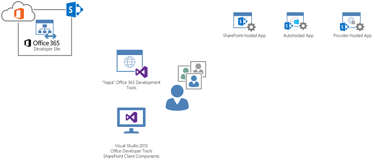
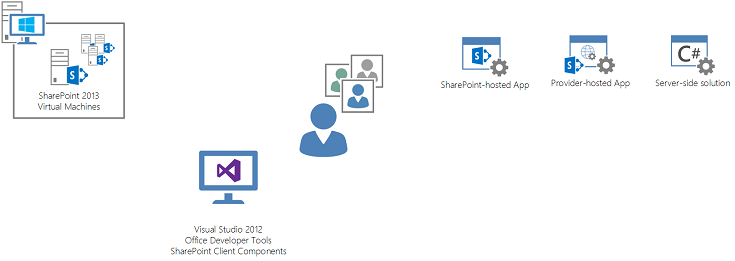
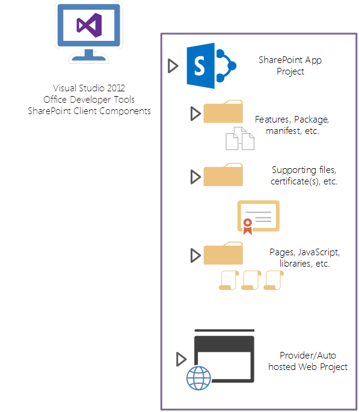
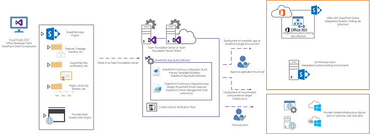
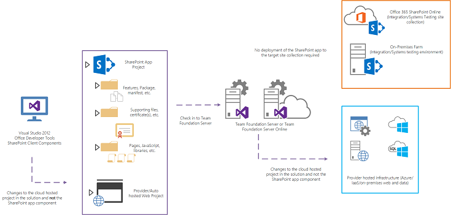
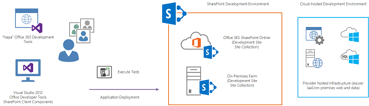
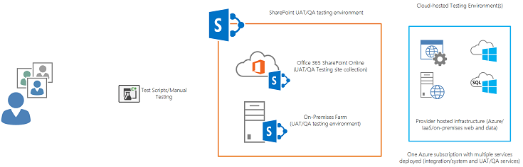
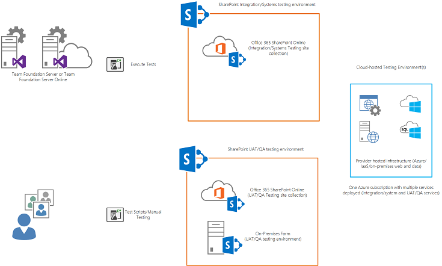
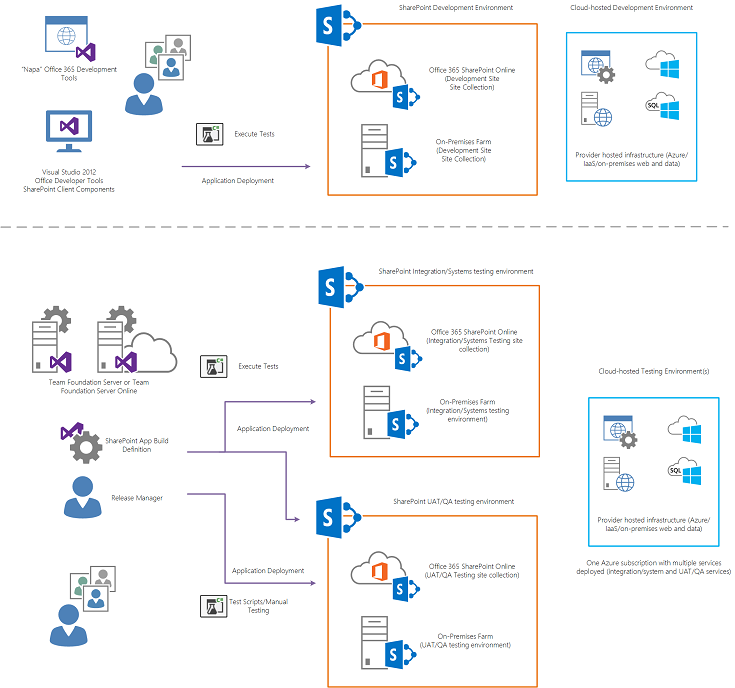

# SharePoint 伺服器 2013年應用程式生命週期管理
常見的應用程式生命週期管理 (ALM) 概念和實務套用到使用SharePoint Server 2013技術的應用程式開發。
 * **適用於:*** 
  
    
    

 * **提供者:*** Eric Charran，Microsoft 公司
 * **參與者：*** Vesa Juvonen，Microsoft 公司 |Steve Peschka，Microsoft 公司
  
    
    

|||
|:-----|:-----|
|**本文內容**          [應用程式生命週期管理 (ALM) 概觀](#Overview)           [開發環境考量因素](#DevEnvironment)           [ALM 設計考量](#ALMDesign)           [應用程式修補程式及升級](#AppPatching)           [其他資源](#bk_addresources)||
   

> **重要**
> 本主題指的是 autohosted SharePoint Add-ins。Autohosted 應用程式的預覽程式已結束。請忽略 autohosted SharePoint Add-ins的所有參考。
  
    
    

## 應用程式生命週期管理 (ALM) 概觀

Microsoft SharePoint Server 2013讓開發人員建立和部署根據SharePoint技術，這兩個上場所，並在裝載的應用程式或公用定域機組平台的幾個選項。SharePoint Server 2013提供在應用程式可以採取的新選項以及與應用程式使用標準技術的圖形中增加了不少彈性。雖然這些應用程式功能和新的應用程式模型，在SharePoint中所提供的部署選項提供有效的方法，讓開發人員建立新的和動人、 互通式的應用程式，但開發人員必須能夠書品質、 測試和 ALM 考量到開發程序。本文適用於使用SharePoint Server 2013技術的應用程式開發一般 ALM 概念和實務。
  
    
    

### 新功能

SharePoint Server 2013建立實作應用程式的新典範。SharePoint技術的應用程式開發這個 shift 鍵，因為開發人員和架構設計人員應該非常了解新的應用程式開發模式、 實務和SharePoint Server 2013的部署模型。請務必請注意雖然應用程式模型開發解決方案與SharePoint變更許多方案開發環境，包括的技術，選擇所使用的模式實作技術與現有的 web 應用程式開發技術。
  
    
    
下列資源大綱可以使用SharePoint Server 2013技術建構，並包含這兩個上場所的考量因素與定域機組的應用程式的應用程式類型。若要了解SharePoint Add-ins的裝載選項，請參閱 [選擇如何開發和裝載您 SharePoint 的增益集的模式](05ce5435-0a03-4ddc-976b-c33b08d03457.md)。
  
    
    
此外，Microsoft 建議客戶評估時更廣的一組解決方案實作的選擇為開發具有SharePoint Server 2013應用程式所使用的技術。在建立應用程式時，客戶可以專注於運用標準為基礎的技術，例如 HTML5 和JavaScript簡報及使用者的經驗圖層上，而 OData 和 OAuth 可以運用的服務為基礎的存取，以備份結束包括 SharePoint 的服務。客戶應仔細考慮是否需要完全信任程式碼 (也就是已編譯組件部署到SharePoint)。雖然繼續使用該開發參照範例，而仍然有效，而且需要在某些情況下，沒有強制的 ALM 處理程序相當大的負擔。
  
    
    
如需更多有關SharePoint Server 2013新的具有彈性的開發技術的應用程式的詳細資訊，請參閱 [SharePoint 2013 開發概觀](http://msdn.microsoft.com/library/f86e2695-4d7a-4fc5-bc23-689de96c4b06%28Office.15%29.aspx)。
  
    
    

### 優點和變更

因為SharePoint-支援應用程式開發技術現在提供更有彈性的分類的語言和程式設計架構，開發人員需要調整以便容納其是否存在，在SharePoint內的主流開發技術的現有 ALM 作法。概念，例如測試時，建置建立、 部署及品質控制、 可以擴充到包括SharePoint與SharePoint應用程式的部署。這可能表示，雖然習慣撰寫和部署擴充的SharePoint，常見的 ALM 作法新SharePoint Server 2013應用程式所提供的彈性的開發模型的核心功能的伺服器端伺服陣列解決方案的許多開發人員必須套用至實作程序。
  
    
    
當客戶繼續定域機組裝載實作SharePoint Server 2013的轉換，開發人員必須了解如何擴充到包括開發、 測試和部署坐組織實體界限外的目標環境的 ALM 概念。這包括評估進行應用程式開發、 測試和部署的技術策略。
  
    
    
開發人員和架構設計人員可能會變得完整部分中由合成跨越或結合不同型別的裝載選項的多個應用程式元件所組成的解決方案。在適應過程中，ALM 程序應該套用單方面到這些應用程式。例如，開發人員可能需要部署跨越前提上服務的部署 (也就是 IIS、 ASP.NET、 MVC、 WebAPI 和WCF)、 Microsoft Azure、 SharePoint Server 2013和SQL Azure，同時也能夠測試應用程式元件，以決定品質或迴歸測試是否引入自從上一次建置應用程式。這些需求可能表示重大變化，開發人員和小組將是已知的程序上場所或伺服器端解決方案的每日建置和部署程序。
  
    
    

### 開發小組考量

對有一個以上的應用程式開發人員或架構設計人員的組織來說， SharePoint Server 2013的小組開發應該小心計劃來提供高品質應用程式，以及支援足夠開發人員的生產力。因為執行應用程式開發的方法有彈性的增加，小組必須清楚且確信不僅 ALM 實務和模式，但也在每位開發人員將會如何撰寫程式碼，並確保高品質程式碼會變成應用程式的一部份上建置程序。
  
    
    
這些考量的開頭選取適當的開發環境。傳統上，開發逐漸被貶為進行個別的開發，在虛擬機器連接到提供建置、 部署和測試的功能，像是Visual Studio TFS 2012 通用程式碼儲存機制中。TFS 仍然是強式很有幫助元件和核心開發過程的 ALM 的策略，但小組應該考慮如何運用 TFS 跨不同類型的開發環境選項。
  
    
    
目標環境，方案類型 (也就是哪一個元件將會先和它將會裝載在定域機組基礎結構或服務) 而定，開發人員現在可以從選取新的開發環境選項的組合。這些選項會包含新的選項，例如SharePoint開發人員的網站範本、 Office 365開發人員承租人，以及傳統的選項，例如虛擬機器為基礎的開發， Windows 8或Windows Server 2012中使用 Hyper-V。
  
    
    
下節會說明應用程式開發人員和開發小組的開發環境考量。
  
    
    

## 開發環境考量因素

開發環境中的選取項目應根據多項因素上。這些考量多半會受到影響正在開發應用程式的目標平台以及應用程式的類型。傳統上，在建立SharePoint Server 2010的應用程式時，開發人員會佈建虛擬機器，然後進行隔離的開發。這已經因為完全信任解決方案的部署可能需要重新啟動的核心SharePoint相依性，例如 IIS，可以防止多位開發人員使用單一的SharePoint環境。由於變更開發技術，且增加開發人員建立的應用程式的選項，開發人員和小組必須瞭解這些可用的開發環境的選擇。[圖 1 顯示的開發環境與工具混合，並包含可以部署到目標環境的解決方案的型別。
  
    
    

**[圖 1。開發環境的元件及工具**

  
    
    
 [
  
    
    
](http://go.microsoft.com/fwlink/?LinkId=391723) [按一下以查看放大。](http://go.microsoft.com/fwlink/?LinkId=391723)
  
    
    

### 開發環境的原理

在應用程式的可設計和實作使用SharePoint Server 2013中所做的投資，因為開發人員應該判斷是否需要進行使用伺服器端程式碼的開發。當開發人員建立使用定域機組裝載模型的應用程式，請減少進行虛擬化環境中，特別為SharePoint，會依賴的開發需求。開發人員應該設法建置方案會使用現有定域機組為基礎的遠端開發模型 (公用和私用) 的基礎結構。如果開發環境可以快速且輕鬆地佈建而不需建立及協調虛擬化，開發人員可以投入更多的時間，在將焦點放在開發產能和品質，而不是基礎結構管理。
  
    
    
要求SharePoint Server 2013與新的SharePoint開發網站範本的虛擬執行個體決策取決於應用程式需要完全信任程式碼部署到 SharePoint 並在該處執行。如果沒有完全信任程式碼是必要的我們建議使用開發人員可以在Office 365開發 tenants 或組織的實作上場所SharePoint內找到的站台範本。開發人員網站範本專為開發人員部署應用程式直接到SharePoint的Visual Studio。Office 365開發人員網站預先設定的應用程式隔離和 OAuth，讓開發人員可以立刻開始撰寫和測試應用程式。
  
    
    
下列章節會描述詳細資料，當開發人員可以使用不同的環境選項來建置應用程式。
  
    
    

### O365 開發站台 (公用定域機組)

圖 2] 顯示如何開發人員可以使用Office 365作為開發環境，並在Office 365中包含的工具產生SharePoint的應用程式可以裝載類型。
  
    
    

**[圖 2。Office 365 應用程式開發**

  
    
    
 [
  
    
    
](http://go.microsoft.com/fwlink/?LinkId=391724) [按一下以查看放大。](http://go.microsoft.com/fwlink/?LinkId=391724)
  
    
    
如果使用 MSDN 訂閱的開發人員可以取得包含SharePoint開發人員網站的開發房客。SharePoint開發人員網站是事先設定來開發應用程式。使用者可以使用不只Visual Studio 2012在開發應用程式，但是與Office 365的開發者網站， Napa可用於站台內建構應用程式。如需有關如何開始使用Office 365 開發人員網站的詳細資訊，請參閱 [在 Office 365 上設定 SharePoint 增益集的開發環境](b22ce52a-ae9e-4831-9b68-c9210af6dc54.md)。
  
    
    
開發人員就可以開始建立將裝載的應用程式，在Office 365上, 場所或提供者裝載模型中其他基礎結構。這種環境的好處是該基礎結構，虛擬化與 SharePoint 開發環境的其他裝載考量抽象化的Office 365，允許開發人員立即建立應用程式。主要的考量，這種類型的開發環境，是無法容納需要完全信任程式碼部署到SharePoint的應用程式。Microsoft建議使用SharePoint用戶端物件模型 (CSOM) 和用戶端技術，例如JavaScript盡。是必要的完全信任程式碼 (而不需要在SharePoint上執行程式碼的配置)，事件，我們建議您部署在 autohosted 或提供者裝載模型中的伺服器端程式碼。請注意這些提供者裝載基礎結構部署的完全信任程式碼解決方案也使用 CSOM，但可以使用語言，例如 C#。也很重要，請注意提供者裝載模型中部署這些應用程式可以使用其他技術堆疊，而且仍然使用 CSOM 與SharePoint Server 2013互動。
  
    
    
建立不同的功能或包含較大的方案的應用程式的開發小組會需要集中式的部署目標，以便在整合測試的元件。因為每位開發人員會建立自己的Office 365開發人員站台功能或應用程式，使每位開發人員的應用程式元件可以那里部署應該提供集中式的網站集合在目標承租人或場所的環境中。此方法將允許進行整合測試在解決方案元件間的集中式的地方。 [測試區段，此文件的](#Testing)檢閱詳細程的序。
  
    
    

#### NapaOffice 365開發工具

Napa開發工具可以用於開發人員更容易建立Office 365開發人員站台內的應用程式。Napa工具的目的是為開發人員或進階使用者來說是精通快速開發和部署應用程式原型，概念證實或快速的商務解決方案案例的用戶端技術。這些工具提供一種開發應用程式的功能，在SharePoint上。不過，在應用程式的生命週期，可能有應用程式應該匯Visual Studio的點。這些條件加上外框，如下所示"
  
    
    

- 當一個以上的開發人員具有投稿或開發方案的一部分
    
  
- 當應用程式到達使用者收件者需要的生命週期管理實務應用程式的相依性的等級
    
  
- 當應用程式的功能需求變更經過一段時間需要補充解決方案元件 (例如已編譯的服務或資料來源)
    
  
- 當應用程式需要與其他應用程式或解決方案元件的整合
    
  
- 當開發人員必須使用品質控制措施，例如自動化的組建和測試
    
  
一旦這些或其他類似的情況發生，必須匯出方案到原始檔控制環境例如 TFS 開發人員，並將其套應用程式的未來開發中的 ALM 設計考量和程序。
  
    
    

### 開發網站 (遠端開發)

組織或開發人員選擇不使用SharePoint應用程式開發的主要方法作為Office 365的開發者網站，請先開發人員網站可以用來開發SharePoint應用程式。在這個模型中， Office 365的開發者網站的功能取代先開發人員在SharePoint陣列中主控的網站。客戶可以將SharePoint伺服陣列部署至屋開發人員站台執行個體來建立開發私用的定域機組。客戶可以提供自己的控管自動化以為您提供開發人員網站範本建立或使用SharePoint在產品功能來佈建開發人員站台執行個體。[圖 3] 說明此安裝程式。
  
    
    

**[圖 3。場所與開發人員的網站範本的應用程式開發**

  
    
    
 [
  
    
    
](http://go.microsoft.com/fwlink/?LinkId=391725) [按一下以查看放大。](http://go.microsoft.com/fwlink/?LinkId=391725)
  
    
    
[圖 3 說明開發工具和應用程式時使用 SharePoint 伺服陣列上前提為主機可以啟用與開發人員站台的型別。請注意在此環境中無法使用NapaOffice 365開發工具，以及它們僅出現在Office 365開發網站的功能。
  
    
    
SharePoint伺服陣列主控開發人員網站執行個體必須監視，而且符合服務與復原點和時間層次方針，讓開發人員依賴它們來建立應用程式可以發揮生產力，並不會發生中斷。客戶可以套用這個環境私用的定域機組的概念，例如 elasticity 和刻度間距和管理結構。作業和管理都要套用至的開發者網站放置也SharePoint伺服器陣列。這可幫助控制不受監控的偶然間散佈的過時或未使用的多個開發人員網站，並提供方法來瞭解環境需要時小數位數。
  
    
    
客戶可以決定要使用為Microsoft Azure服務 (IaaS) 功能的基礎結構管理SharePoint屬於伺服陣列，包含和裝載開發人員網站，或是他們自己的前提上虛擬或實體環境。請注意使用這個模型不需要SharePoint安裝的每位開發人員。Visual Studio和開發人員工作站上的 Office 和 SharePoint 2013 開發工具，將只需要遠端應用程式開發。
  
    
    
開發人員必須建立提供者裝載基礎結構，以部署提供者裝載的應用程式。雖然提供者主控元件的SharePoint應用程式可以實作技術整個陣列中，開發人員就必須提供裝載應用程式的執行外部SharePoint的這些元件的基礎結構。例如，如果小組正在開發的使用者經驗和其他元件位於ASP.NET應用程式的SharePoint應用程式，開發小組應該使用本機版本的 IIS，SQL Server， ASP.NET的傳統 ALM 小組開發模式中，以此類推交戰。
  
    
    

### 獨立的伺服陣列環境 (虛擬化的伺服陣列開發)

對於需要完全信任部署這些解決方案在SharePoint陣列上執行SharePoint Server 2013的完整 (通常虛擬化) 實作的程式碼會需要。如需如何建立SharePoint的前提上開發環境的指導，請參閱 [設定內部部署開發環境的 SharePoint 增益集](b0878c12-27c9-4eea-ae3b-7e79e5a8838d.md)。
  
    
    
[圖 4] 顯示可以使用上場所虛擬化的環境中建立的應用程式的類型。
  
    
    

**[圖 4。先開發與虛擬環境**

  
    
    
 [
  
    
    
](http://go.microsoft.com/fwlink/?LinkId=391726) [按一下以查看放大。](http://go.microsoft.com/fwlink/?LinkId=391726)
  
    
    
開發人員可以進行遠端SharePoint和SharePoint農田內定域機組裝載的應用程式的開發和完全信任伺服器陣列解決方案的開發。這些通常都被裝載在執行開發人員的工作站上或集中式的虛擬化私人定域機組中可輕鬆地開發人員可存取的虛擬化伺服器中。SharePoint伺服陣列環境是通常有別於其他開發人員的伺服陣列，並提供某種程度的開發可能需要重新開機的重要的服務 (也就是 IIS) 的完全信任程式碼時所需的隔離。
  
    
    
遠端開發可以出現在獨立的伺服器陣列，以及完整開發內每個開發伺服器陣列是隔離的以及專門用來為單一的開發人員信任程式碼。
  
    
    
組織或開發人員必須管理與更新SharePoint屬於伺服陣列中的虛擬電腦執行。開發人員提供給單一應用程式，必須維護跨內部虛擬電腦執行開發伺服陣列的同位檢查。這種作法可確保每個元件的應用程式開發的程式碼有一致性。其他的一般注意事項是標準的組態，包括網域的存取和認證、 測試身分或帳戶和其他環境的組態項目 (例如憑證) 的服務應用程式憑證的陣列。
  
    
    
類似於開發站台的集中式伺服器陣列，這些執行程式開發人員SharePoint伺服陣列的虛擬機器可以裝載於 IaaS 的平台，例如Microsoft Azure，且在場所私用的定域機組內容。
  
    
    
請注意雖然虛擬機器提供大量的隔離與其他開發人員虛擬機器的獨立性，小組應該盡量讓虛擬機器組態之間的一致性。這包括通用網域、 帳號和安全性、 SharePoint組態及連線至原始檔控制儲存機制，例如Visual Studio Team Foundation Server (TFS)。
  
    
    

## ALM 設計考量

當建構SharePoint應用程式時，有幾項考量，必須加以處理，才能提供控管與常見的開發作法的一致性及品質。當將 ALM 原則套用至SharePoint應用程式開發，開發人員必須著重於技術的考慮事項，以及處理程序導向的考量。
  
    
    
支援的 ALM 平台，例如Visual Studio Team Foundation Server 2012，通常是需求，進行應用程式開發，尤其是與小組的開發人員在同一組的專案時。SharePoint應用程式，就像其他技術的解決方案，需要的程式碼儲存機制管理與版本控制、 建置服務，測試服務，然後放開管理實務。套用至SharePoint應用程式的不同的應用程式模型下, 一節會說明 ALM 的考量。
  
    
    

### 概觀

每種類型的SharePoint應用程式中，ALM 考量必須套用而變化的概念。不過，必須調整實務和周圍建置、 測試和變更管理程序。
  
    
    
有些SharePoint應用程式會使用用戶端技術。大部分的開發人員有SharePoint Server 2010應用程式開發經驗，就必須調整，以開發，並將 ALM 原則套用至非編譯的程式碼。這項調整包含套用至未編譯的程式碼的方案的概念，例如 「 組建 」。ALM 平台例如， Visual Studio 2012有內建的功能，以驗證來建立第一個編譯程式碼，和第二，藉由執行建置驗證測試 (Bvt) 針對組建。
  
    
    
對於SharePoint應用程式，有關建置和測試的程序應該是保持一致與傳統的應用程式開發程序。這包括組建排程建立 ALM 平台，將編譯方案，並將它部署到目標環境。
  
    
    

### 建置處理序

SharePoint應用程式建置處理序管理 ALM 平台。Visual StudioTeam Foundation Server 2012年提供兩個建置和測試服務，可以在方案中觸發Visual Studio 2012 (連續整合) 從簽入，或在指定的排定的時間間隔。
  
    
    

#### SharePoint 建置元件

在規劃SharePoint應用程式開發的建置處理序時，開發人員必須考量元件間互動，如 [圖 5 所示。
  
    
    

**[圖 5。SharePoint 裝載的應用程式建置元件**

  
    
    

  
    
    

  
    
    
圖 5] 中的圖例是SharePoint應用程式的邏輯表示法。此圖例會顯示SharePoint 裝載的增益集 ，並會反白顯示為Visual Studio 2012的SharePoint 裝載的增益集專案的一部分的主要的應用程式物件。SharePoint應用程式專案中包含的功能、 套件] 以及會使用SharePoint登錄的資訊清單。專案也會包含網頁、 指令碼程式庫和使用者經驗的構成SharePoint應用程式的其他項目。此外， SharePoint專案都有支援的檔案，其中包括必要的憑證，以便部署至目標SharePoint環境。
  
    
    

**[圖 6。提供者裝載和 autohosted 應用程式建置元件**

  
    
    

  
    
    

  
    
    
圖 6] 顯示的SharePoint定域機組裝載應用程式 (autohosted 或提供者裝載)。專案結構中的主要差異是Visual Studio 2012方案包含除了包含定域機組主控的應用程式元件的一或多個專案的SharePoint應用程式專案。這些可能包含 web 應用程式、 SQL 資料庫專案或將部署到Azure的服務應用程式，或先提供者裝載基礎結構 (如ASP.NET) 和其他解決方案元件。如需封裝與部署高信任的應用程式的指導，請參閱 [封裝並發佈高信任 SharePoint 增益集](3c28aed8-c037-407c-9154-39a74073e170.md)。
  
    
    

**[圖 7。使用 Visual Studio Team Foundation Server ALM**

  
    
    

  
    
    

  
    
    
[圖 7] 顯示 TFS 為 ALM 平台。小組會使用 TFS 來儲存程式碼和進行小組開發使用 TFS 部署先，或使用 Microsoft 定域機組為基礎的 TFS 服務。您可以設定 TFS 進行建置，與透過SharePoint應用程式的部署活動組建定義。TFS 也可用來進行建置驗證測試 (Bvt)，可能會透過執行組建定義的一部份的硬式編碼 UI 測試自動化。
  
    
    

**[圖 8。TFS 建置目標**

  
    
    

  
    
    

  
    
    
圖 8] 顯示由 TFS 組建定義執行的指令碼將在其中部署SharePoint應用程式元件的目標環境。SharePoint 裝載之應用程式中，這包括部署是SharePoint Online ，或先SharePoint應用程式類別目錄。
  
    
    
定域機組裝載SharePoint應用程式需要SharePoint以外的其他基礎結構的解決方案元件部署到目標環境。對於 autohosted 應用程式，這會是Microsoft Azure。對於提供者裝載的應用程式，此基礎結構可以是Microsoft Azure，或其他上場所或 IaaS 裝載環境。
  
    
    

#### 建立組建SharePoint應用程式

TFS 會提供可編譯方案簽入原始檔控制和自動化方式，將輸出放在部署到目標環境的集中式的置放位置的組建服務。主要方法設定進行自動化的 TFS 組建和部署，而SharePoint應用程式測試是在Visual Studio中建立組建定義。組建定義包含的程式碼的專案進行編譯，以及任何編譯後的活動的相關資訊如測試和實際部署到目標環境。如需有關 Team Foundation Build 服務的詳細資訊，請參閱 [設定 Team Foundation Build 服務](http://msdn.microsoft.com/en-us/library/vstudio/ee259687.aspx)。
  
    
    
若要達成連續整合，當開發人員簽入程式碼可以觸發組建定義。此外，可以排定的組建定義的間隔執行。
  
    
    
SharePoint應用程式開發人員應該使用 [TFS 2012 辦公室/SharePoint 2013 連續整合](http://officesharepointci.codeplex.com/)組建定義專案達成已排程的組建或連續整合。這個專案提供組建定義、 Windows PowerShell指令碼和處理程序說明如何設定線上Visual Studio或建置及部署連續整合模型中的SharePoint應用程式的 TFS 上場所版本。開發人員應該要下載此專案中的元件，並據以設定其執行個體的 TFS。如需如何設定 TFS 與SharePoint應用程式所提供的組建定義，並設定組建定義使用Windows PowerShell指令碼來部署到目標環境的SharePoint應用程式的指示，請參閱 [Office/SharePoint 2013 連續整合，TFS 2012 文件](http://officesharepointci.codeplex.com/documentation)。
  
    
    

#### 設定建置和部署程序

圖 9] 顯示SharePoint應用程式的標準程序建置並部署建立組建定義時設定，而且部署至 TFS 小組的執行個體。
  
    
    

**[圖 9。建置和部署處理程序 TFS**

  
    
    
 [
  
    
    
](http://go.microsoft.com/fwlink/?LinkId=391727) [按一下以查看放大。](http://go.microsoft.com/fwlink/?LinkId=391727)
  
    
    
開發人員檢查SharePoint應用程式Visual Studio 2012方案中。根據您想要設定 (也就是持續整合或已排程的組建)，TFS 組建服務會執行SharePoint應用程式組建定義所定義的步驟。這項定義，由開發人員設定包含連續整合組建流程範本以及建置後執行的應用程式部署的Windows PowerShell指令碼的指示進行。請注意SharePoint Online管理殼層延伸，則必須將部署SharePoint Online應用程式。如需有關SharePoint Online管理殼層延伸的詳細資訊，請參閱 「 下載中心 」 上的 [線上管理介面 SharePoint 網頁](http://www.microsoft.com/en-us/download/details.aspx?id=35588) 。
  
    
    
一旦觸發建置了，TFS 就會編譯SharePoint應用程式相關聯的專案，並執行方案部署至目標SharePoint環境的Windows PowerShell指令碼。
  
    
    

#### 信任 SharePoint 應用程式

目標環境的應用程式元件的部署之後, 是請注意之前的任何人存取應用程式，可能會在建置、 承租人 (或網站集合) 的一部份的自動化測試包括系統管理員必須信任在SharePoint中的 [應用程式資訊] 頁面上的應用程式。此需求適用於 autohosted 和SharePoint- 裝載應用程式。此手動處理程序通常會執行的下列部署到目標環境必須暫止，直到應用程式是受信任的測試以表示在建置程序中的變更。
  
    
    
請注意對於定域機組裝載 (自動和提供者) 應用程式，開發人員可以部署非SharePoint元件定域機組裝載基礎結構分開從應用程式套件部署到SharePoint。
  
    
    

**[圖 10。將非 SharePoint 元件部署**

  
    
    
 [
  
    
    
](http://go.microsoft.com/fwlink/?LinkId=391728) [按一下以查看放大。](http://go.microsoft.com/fwlink/?LinkId=391728)
  
    
    
當開發人員變更代表SharePoint應用程式的方案，請顯示圖 10] 中，情況下，可以變更至方案中不會套用到SharePoint應用程式專案本身的專案進行的位置。這種情況下， SharePoint應用程式專案並沒有重新部署為不具有已變更。定域機組裝載專案相關聯的變更必須重新部署。
  
    
    
將SharePoint以外的基礎結構部署應用程式的變更可以從取得部署到目標網站集合或房客的應用程式元件因此分別完成。對於開發人員，這表示可以建立自動化的建置程序，以部署經常 (引動) 為基礎，並分別從SharePoint應用程式專案的定域機組裝載元件。因此，核准在SharePoint中的 [應用程式資訊] 頁面上的應用程式的權限手動步驟並非必要，允許更多連續的部署和測試的組建定義的程序。方案的SharePoint應用程式元件將只會有要部署的情況中的項目已在這個專案的變更，且需要重新部署。
  
    
    

### 測試

如所述的 [建置處理序] 區段](#ALMBuildProcess)，應用程式測試是判斷編譯和部署應用程式是否成功的方法。藉由使用做為驗證建置和部署應用程式的測試，小組隨附了解的品質，以及了解何時最近的變更，應用程式的程式碼已洩露SharePoint應用程式的方式。
  
    
    
圖 11] 顯示測試都適用於SharePoint應用程式模型的方法型的別。
  
    
    

**[圖 11。測試方法**

  
    
    
 [
  
    
    
](http://go.microsoft.com/fwlink/?LinkId=391729) [按一下以查看放大。](http://go.microsoft.com/fwlink/?LinkId=391729)
  
    
    
[圖 11 會建議使用不同類型的測試來測試SharePoint應用程式的型別。UI 測試程式碼應該對付SharePoint-裝載之應用程式商務邏輯和使用者經驗的所在位置相同的層級中。雖然商務邏輯可以抽取至JavaScript程式庫，測試該邏輯的主要方法會透過使用者經驗。
  
    
    
定域機組裝載的應用程式 (也就是，autohosted 和提供者裝載) 可以使用同時也使用單元測試來驗證解決方案的服務元件的 UI 測試完整程式碼。這會提供開發人員信心，從功能觀點來看應用程式的裝載基礎結構實作的品質。
  
    
    
下列章節檢視 UI 測試程式碼和其他測試類型與SharePoint應用程式相關的考量。
  
    
    

#### 用戶端程式碼和 UI 測試程式碼

組建驗證測試 (BVT) 以及完整的系統測試，它被建議的 UI 測試程式碼。這些測試會依賴測試商務邏輯和中介層應用程式，但使用者經驗不只錄製動作。對於使用用戶端程式碼的SharePoint應用程式，大部分的商務邏輯的進入點和執行可能存在於使用者體驗層。基於這個理由，UI 測試程式碼可以不只會測試使用者經驗，但在應用程式的商務邏輯。如需有關 UI 測試程式碼的詳細資訊，請參閱 [驗證使用 UI 自動化的程式碼](http://msdn.microsoft.com/en-us/library/dd286726.aspx)。
  
    
    
UI 測試程式碼可以用於SharePoint 裝載的增益集s 可能混 UX 及商務邏輯。可以從在 TFS 組建定義執行這些測試，就像其他人，使它們可以在部署之後，確認應用程式的功能 (和應用程式信任的SharePoint)。
  
    
    

#### 非固定 UI 測試

為應用程式的 UX 層以外的應用程式邏輯存在的情況下，例如在定域機組裝載的應用程式的 UI 測試程式碼和非編碼 UI 測試組合應該運用。例如傳統的單元測試的測試可以用來驗證服務邏輯實作於提供者裝載基礎結構的組建品質。這與提供者主控元件中的方案函式的整體信賴提供開發人員，並涵蓋從測試的點的檢視。
  
    
    

#### 網頁的效能及負載測試

網頁效能和負載測試會提供有信心預期或預期的使用者負載下的功能應用程式的開發人員。這項測試，包括了決定應用程式的功能，可同時處理會相當縮放經過一段時間的可預測的使用者基底。兩者編碼 UI 和單元測試可以是來源網頁效能和負載測試。使用像 TFS ALM 平台，這些測試可以用來載入測試應用程式。
  
    
    
請注意基礎結構的測試這些測試的主要目標時使用它們來測試SharePoint應用程式。基礎結構、 是否SharePoint-裝載或提供者主控，應該要有類似的負載與效能的基準線建立。應用程式的 web 效能和負載測試將會反白標示基礎結構的挑戰，但應該被視為主要是一種方法來測試應用程式的效能。
  
    
    
如需有關 web 效能測試和負載測試的詳細資訊，請參閱 [執行之前發行的應用程式的效能測試](http://msdn.microsoft.com/en-us/library/vstudio/dn250793.aspx)。
  
    
    

#### 品質和測試環境

許多組織都有可能是實體或虛擬及彼此分離的數個測試環境。這些環境可以根據小組的 ALM 程序、 法規或兩者的組合而有所不同。如果要判斷應該使用小組的測試環境的類型與數量，下列的指導以SharePoint應用程式特有的功能作法為基礎，但也用於在大型軟體開發中的 ALM 作法。
  
    
    

#### 測試的開發人員

測試的開發人員可能會發生在程式開發人員要在其中建立的方案及其元件的環境中。多個開發人員，使用不同的層面或元件的較大的應用程式中，每個必須單元測試、 UI 測試程式碼，以及部署至開發網站的應用程式程式碼。
  
    
    

**[圖 12。開發人員測試程序**

  
    
    
 [
  
    
    
](http://go.microsoft.com/fwlink/?LinkId=391731) [按一下以查看放大。](http://go.microsoft.com/fwlink/?LinkId=391731)
  
    
    
開發人員會執行測試，從Visual Studio針對解決方案元件部署在自己的Office 365或先開發人員站台。定域機組裝載的應用程式的測試會執行從Visual Studio針對位於提供者裝載基礎結構解決方案元件。這些元件都位於開發人員的Microsoft Azure訂閱。
  
    
    
請注意，這個方法會假設開發人員可能必須個別Office 365的開發者網站，並透過 MSDN 訂閱提供的Microsoft Azure訂閱。即使開發人員在建立場所上部署的應用程式，這些開發人員服務可以用於開發和測試。
  
    
    
如果開發人員不需要這些服務，或需要開發完全上場所，就會執行為其對上場所伺服陣列的開發人員網站集合與程式開發人員特定提供者裝載基礎結構元件的測試。提供者裝載基礎結構可存放在開發人員專用虛擬機器。完全信任方案開發，開發人員會需要它們自己的虛擬伺服器陣列和提供者裝載基礎結構。
  
    
    

#### 整合和系統測試

若要測試應用程式，所有開發元件應組合並在集中式的環境中部署。此整合環境提供開發人員可以在其中部署並觀察它們建立與其他開發人員所撰寫的其他解決方案元件互動的解決方案元件的位置。
  
    
    

**圖 13。整合測試環境**

  
    
    
 [
  
    
    
](http://go.microsoft.com/fwlink/?LinkId=391732) [按一下以查看放大。](http://go.microsoft.com/fwlink/?LinkId=391732)
  
    
    
此類型的測試，ALM 平台會建置，並將SharePoint應用程式和任何必要的元件部署到目標環境。對於SharePoint-裝載之應用程式，這將會是Office 365站台或特別建立的整合和測試的系統上場所/IaaS SharePoint Server 2013站台集合。SharePoint 定域機組裝載的應用程式，TFS 會也集中式的Microsoft Azure訂閱服務特別針對整合/系統測試的設定，部署元件。TFS 然後會裝載基礎結構上執行硬式編碼的 UI 或單元測試對SharePoint應用程式，如本解決方案需要的任何元件。
  
    
    

#### 使用者接受度測試與品管測試

使用者接受度測試 (使用者接受度測試)，組織通常具有不同的環境，除了整合和測試的系統執行此函式時。分隔這些測試的環境可防止自動連續的發行和干擾使用者可能會執行的測試指定的組建，經過一段長時間的應用程式的使用者接受度測試活動測試的頻率。
  
    
    

**圖 14。使用者接受度測試的測試**

  
    
    
 [
  
    
    
](http://go.microsoft.com/fwlink/?LinkId=391733) [按一下以查看放大。](http://go.microsoft.com/fwlink/?LinkId=391733)
  
    
    
圖 14 所示，使用者會指派給進行接受度測試，或組織的測試資源進行穩定的環境，將焦點放在眾建置的應用程式中的測試指令碼。雖然程式碼部署和測試持續整合環境中，使用者會進行手動測試，以驗證應用程式符合所需的使用] 或 [測試案例。應用程式及任何提供者裝載基礎結構將會部署，通常是透過發行管理人員到此測試環境。也可自動的部署。這種部署使用映射的舉行的整合和測試環境的系統部署的 TFS 專用的使用者接受度測試組建定義。
  
    
    
定域機組裝載基礎結構部署至共用的整合和系統測試環境的Microsoft Azure訂閱時可能命名及設定為並排顯示部署為不同的服務或資料庫服務。此方法會提供一組服務和資料庫測試整合和系統測試，以及使用者接受度測試的Microsoft Azure訂閱和 QA 測試，如 [圖 15 所示。
  
    
    

**[圖 15。整合和測試使用者接受度測試**

  
    
    
 [
  
    
    
](http://go.microsoft.com/fwlink/?LinkId=391734) [按一下以查看放大。](http://go.microsoft.com/fwlink/?LinkId=391734)
  
    
    

#### 程式碼升級作法

開發和測試環境，以及實際執行環境之間的程式碼升級程序，應該要使用一個定義完善的發行管理程序。在圖 16，開發人員進行單元測試的開發環境的解決方案元件的部署。
  
    
    

**[圖 16。發行管理程序**

  
    
    
 [
  
    
    
](http://go.microsoft.com/fwlink/?LinkId=391735) [按一下以查看放大。](http://go.microsoft.com/fwlink/?LinkId=391735)
  
    
    
下列簽入到 TFS，自動化的建置程序會編譯，並在方案部署到目標整合和測試的環境會為在 TFS 組建定義的一部份執行建置驗證測試的系統。這種方法包括將解決方案的提供者主控元件部署到目標環境 (Microsoft Azure或先環境)。請注意Microsoft Azure基礎結構Microsoft Azure訂閱可以用的整合和系統測試，以及使用者接受度測試和品質保證管理人員假設它們會部署到不同的命名空間和不同的 SQL 資料庫的相同。
  
    
    
發行管理人員或個別的 TFS 組建定義，以手動方式叫用在大部分的情況下，可以部署至 UA 或 TQA 環境中。這種方法可以幫助控制使用者會對測試的組建版本。發行經理可以挑選從 TFS 共用組建和執行部署程序本身。升級到實際執行環境，從版本管理會牽涉到要部署到生產環境的應用程式，並監視其安裝和組建驗證測試透過。
  
    
    

## 應用程式修補程式及升級

Microsoft 具有特定指導如何應用程式開發人員可以升級的應用程式。SharePoint Server 2013平台支援新的應用程式版本，以使用者的通知。
  
    
    
如需建立周圍 SharePoint 應用程式升級策略和修補程式的考量，請參閱 [更新 SharePoint 增益集](3edcb33c-fa9e-4e9e-82d6-5519fd981324.md)。
  
    
    
對於應用程式的變更，請遵循建議的模式是與現有程式碼的開發和持續的工程模式一致的。這包括專業的分支和合併的 bug 修正程式和功能開發，以及目標應用程式資料目錄的累加部署。上述的指引可以用來完成變更SharePoint的應用程式和部署這些目標應用程式資料目錄或存放區。
  
    
    
 [SharePoint 增益集更新程序](3dba209d-cb98-4e5d-b4b2-fad31e667ca1.md) 中的資訊提供技術更新 SharePoint 應用程式的其他策略指南。這包括加速藉由縮短的週期的應用程式的更新會反映在陣列中的測試環境中測試部署。此外，本文有指導如何配合各種應用程式部署模型內的狀態。
  
    
    

## 其他資源

-  [選擇如何開發和裝載您 SharePoint 的增益集的模式](05ce5435-0a03-4ddc-976b-c33b08d03457.md)
    
  
-  [設定 Team Foundation Build 服務](http://msdn.microsoft.com/en-us/library/vstudio/ee259687.aspx)
    
  
-  [若要授權提供者主控增益集內部部署 SharePoint 網站上使用 Office 365 SharePoint 網站](2f65ba3f-b246-4064-b4fb-ad18399d387a.md)
    
  
-  [SharePoint 2013 開發概觀](http://msdn.microsoft.com/library/f86e2695-4d7a-4fc5-bc23-689de96c4b06%28Office.15%29.aspx)
    
  
-  [什麼是開啟的資料 Protocol?](http://www.odata.org/)
    
  
-  [OAuth 2.0 的授權架構](http://oauth.net/)
    
  

  
    
    
