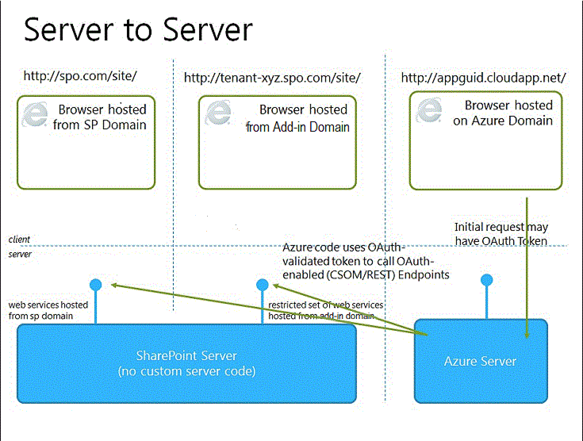

# 選擇如何開發和裝載您 SharePoint 的增益集的模式
了解您能託管的SharePoint Add-ins元件的不同方式。
SharePoint 2013增益集模型介紹各種主控與開發的模式。這些模式的一些可用於彼此的組合。例如，您的增益集可以混合 SharePoint 主控與遠端主控元件。若要判斷您要使用哪些的模式最實用的方式是開始使用您自己的需求、 技術及目標並符合這些選項與SharePoint Add-ins所啟用的可能性。
  
    
    

## 要選擇開發模式時需考量的項目

SharePoint Add-ins加寬可能的程式設計語言與您使用的 SharePoint 資源與服務時，您可以使用的技術堆疊的範圍。選項精確範圍取決於增益集的類型和您選擇主控圖樣。它也是可能混合模式。
  
    
    

### SharePoint 主控的增益集

開始使用的最簡單的選項： SharePoint 主控增益集或增益集在內部主控的所有元件或Office 365 SharePoint 伺服器陣列。在呼叫主機 webSharePoint 2013網站上安裝 SharePoint 主控的增益集。他們有其架設在呼叫增益集 web主機 web 隔離子網站上的資源。請務必了解 [主機 web 及增益集 web 之間的差異](host-webs-add-in-webs-and-sharepoint-components-in-sharepoint-2013.md)。圖 1 說明 SharePoint 主控增益集的基本架構。
  
    
    

**圖 1。SharePoint 主控增益集架構**

  
    
    

  
    
    

  
    
    
您可以結合 SharePoint 主控增益集與增益集已從遠端代管元件，但任何增益集或部分增益集的增益集網頁上，執行下列一組三個主要元件的需求： 可用增益集主控、 如何取得 [增益集的 [授權及哪些語言。
  
    
    

|**元件**|**SharePoint 主控增益集 (英文) 需求。**|
|:-----|:-----|
|主控的增益集元件   |隔離增益集 (英文) 網域中的 SharePoint 伺服器陣列   |
|會取得授權的增益集方式   |登入的使用者的權限   |
|可以使用哪些語言增益集   |JavaScript(使用SharePoint 2013 JSOM 文件庫) + HTML   |
   
此模式是最簡單的部署，您可以使用 [使用 Napa Office 365 開發工具建立基本 SharePoint 主控增益集 (英文)](create-a-basic-sharepoint-hosted-add-in-by-using-napa-office-365-development-too.md)。想要考慮下列事項，才能決定建立一個 SharePoint 主控增益集。
  
    
    

|**取得這些優點**|**但是請考慮此**|
|:-----|:-----|
|重複使用一般的 SharePoint 項目、 清單和網頁組件。   |您可以使用JavaScript增益集 — 不能在任何伺服器端程式碼。   |
|較容易建立及部署，讓他們是很好的小型小組產能的增益集和商務程序自動化，與較低複雜性商務規則。   |增益集有僅登入的使用者的授權權限。   |
   
 [開始建立 SharePoint 主控 SharePoint 增益集](get-started-creating-sharepoint-hosted-sharepoint-add-ins.md)
  
    
    

### 提供者主控增益集

提供者主控SharePoint Add-ins包含已部署及主控的 SharePoint 伺服器陣列外的元件。它們安裝到主機網站，但其遠端元件架設在另一個伺服器 *不應該在 SharePoint 伺服器陣列中的伺服器*  。圖 2 說明的提供者主控增益集的基本架構。
  
    
    

**圖 2。提供者主控增益集架構**

  
    
    

  
    
    

  
    
    
下表顯示如何裝載位置、 增益集授權與語言的需求很少修正的提供者主控增益集比它們是針對 SharePoint 主控的增益集。
  
    
    

|**元件**|**提供者主控增益集 (英文) 需求。**|
|:-----|:-----|
|主控的增益集元件   |任何網頁伺服器或裝載服務   |
|會取得授權的增益集方式   |OAuth 或JavaScript跨網域文件庫   |
|可以使用哪些語言增益集   |任何網頁伺服器或裝載服務所支援的語言   |
   
提供者主控增益集 (英文) 與其互動的 SharePoint 網站，但也會使用 「 資源與位於遠端網站的服務。想要考慮下列事項，才能建立的裝載提供者增益集所決定。
  
    
    

|**取得這些優點**|**但是請考慮此**|
|:-----|:-----|
|主控Microsoft Azure或任何遠端 web 平台，其中包括非 Microsoft 平台上的增益集。   |您負責建立遠端元件安裝、 升級及解除安裝邏輯。   |
|使用其中一個 SharePoint 用戶端物件模型、 JavaScript跨網域文件庫或 [SharePoint 2013/OData rest web 服務](http://msdn.microsoft.com/magazine/dn198245.aspx)與 SharePoint 互動。   |每種互動 SharePoint 具有 [資料存取方法的相對應的選項](secure-data-access-and-client-object-models-for-sharepoint-add-ins.md)。   |
|獲得授權使用其中一個 [三個授權系統](three-authorization-systems-for-sharepoint-add-ins.md)的 SharePoint 資料。   |您需要授權增益集的存取權 SharePoint 決定之間 OAuth 與跨網域文件庫。   |
   

## 比對與開發目標在主控模式

除了考慮技術的優點和限制每個選項，您也需要決定在主控模式時考慮開發目標。您可以使用下表可協助排序出最佳的主控圖樣適合您的需求。
  
    
    

|**您的需求**|**建議的裝載圖樣**|**範例**|
|:-----|:-----|:-----|
|使用與以獨佔模式佈建新 SharePoint 實體   |SharePoint-hosted   |增益集，包括人員選擇器控制項和之 SharePoint 清單中儲存 SharePoint 使用者的資訊   |
|使用現有的 SharePoint 實體和互動 (非 SharePoint) 外部 web 服務   |提供者代管   |從現有的 SharePoint 清單中的主機網站取得客戶地址及使用 web 應用程式中的對應服務來顯示其位置增益集   |
|佈建新 SharePoint 實體和外部 web 服務互動   |SharePoint 主控和提供者主控結合   |佈建 SharePoint 清單 appweb 上使其可儲存使用者所提供的或現有的 SharePoint 清單從取出的地址的緯度和經度座標對應增益集   |
   

## 要選擇提供者主控增益集在主控模式時需考量的項目

SharePoint 主控的增益集有固定主控模式中，由於託管增益集在 web 上。提供者主控增益集提供更彈性地主控的各項元件的增益集，因此如果您選擇建立 web 應用程式，您需要符合您的目標和適當的主控圖樣的需求。
  
    
    

### OAuth 或跨網域文件庫

其中一個的最重要問題，您需要要求時考慮提供者主控的增益集和如何將建置它們是如何增益集將會取得與 SharePoint 互動的授權。提供者主控增益集提供您兩種選擇： JavaScript跨網域文件庫和 OAuth。
  
    
    
 [跨網域文件庫](access-sharepoint-2013-data-from-add-ins-using-the-cross-domain-library.md)可讓您多個網域中的增益集透過 proxy 遠端元件與互動。如果用戶端程式碼和登入 SharePoint 使用者的權限不足，跨網域文件庫會成為良好的選擇。每當您正在透過防火牆的遠端呼叫均十分便利的跨網域文件庫。
  
    
    
OAuth 是以輕鬆可管理的方式可讓用戶端應用程式 (桌面、 web 及行動應用程式) 的安全授權的授權的開放式通訊協定。若要建立的 SharePoint 增益集的遠端 web 應用程式中執行，並且回饋給SharePoint 2013，您通常需要使用 OAuth。每當您呼叫入 SharePoint 從遠端主控的 web 應用程式以獨佔模式無法用於用戶端程式碼 (HTML + JavaScript)，則需要 OAuth。 [了解更多關於 OAuth 中 SharePoint 增益集的運作方式](creating-sharepoint-add-ins-that-use-low-trust-authorization.md)
  
    
    
 [保護資料存取及用戶端物件模型的 SharePoint 增益集](secure-data-access-and-client-object-models-for-sharepoint-add-ins.md) 和 [三個授權系統的 SharePoint 增益集](three-authorization-systems-for-sharepoint-add-ins.md)更徹底說明 OAuth 與跨網域文件庫之間的選擇。
  
    
    

### 具有內部部署 SharePoint 伺服器陣列的 OAuth

如果您使用SharePoint 2013的內部部署，您可以使用 OAuth，但是您必須選擇建立高信任層級增益集和使用Office 365租用。Office 365使用Microsoft Azure Access Control Service (ACS) 做為信任 broker、，如果您不需要Office 365租用存取，您需要使用 [建立高信任 SharePoint 增益集](create-high-trust-sharepoint-add-ins.md)，以使用憑證來建立增益集與 SharePoint 之間的信任。您可以新增更高的信任的增益集增益集目錄的 SharePoint 伺服器陣列，但您無法在Office 市集販售它們。如果您不要Office 365租用可以存取，您可以將其連結至內部部署安裝的SharePoint 2013並 [使用增益集的安裝至內部部署 SharePoint 信任 broker 為 ACS](use-an-office-365-sharepoint-site-to-authorize-provider-hosted-add-ins-on-an-on.md)。
  
    
    
下表列出所有以架設 SharePoint 元件與遠端的增益集，以及可用如果您使用 OAuth 信任經紀人元件可能的模式。請注意您需要的存取權Office 365租用戶才可使用 SharePoint 和安裝至內部部署安裝的SharePoint 2013SharePoint Add-in之間建立信任 ACS。
  
    
    

|**SharePoint 元件位置**|**遠端元件位置**|**信任 broker**|
|:-----|:-----|:-----|
|在內部部署   |在雲端中   |ACS、 憑證   |
|在內部部署   |在內部部署   |ACS、 憑證   |
|Office 365SharePoint 網站   |在雲端中   |ACS   |
|Office 365SharePoint 網站   |在內部部署   |ACS   |
   

## 結合提供者主控及 SharePoint 主控

您也可以建立增益集，包括 SharePoint 主控和雲端託管的元件。例如，您可以建立 [雲端託管增益集，包括自訂 SharePoint 清單及內容類型](create-a-provider-hosted-add-in-that-includes-a-custom-sharepoint-list-and-conte.md)。如果您選擇使用此架構、 設計及方法必須內建模型的安全性限制的帳戶。您可以使用JavaScript中所主控的 SharePoint、 程式碼元件與遠端主控的元件必須使用 OAuth 或跨網域文件庫與 SharePoint 網站進行互動。時考慮這個方法，請確定您了解如何 [增益集 (英文) SharePoint 2013 中運作的授權](authorization-and-authentication-of-sharepoint-add-ins.md)。圖 4 告訴您如果您使用Microsoft Azure來主控的增益集、 遠端元件，此架構的運作方式，並使用 OAuth。
  
    
    

**圖 4。SharePoint 增益集伺服器對伺服器通訊時使用 OAuth 與 Windows Azure**

  
    
    

  
    
    

  
    
    
 [了解如何建立結合雲端主控及 SharePoint 主機。](create-a-provider-hosted-add-in-that-includes-a-custom-sharepoint-list-and-conte.md)
  
    
    
以下是關於您考慮當提供者的組合考量事項主控及 SharePoint 主控。
  
    
    

|**取得這些優點**|**但是請考慮此**|
|:-----|:-----|
|這兩種方法的優點。   |較複雜的架構需要小心規劃伺服器對伺服器通訊及跨網站指令碼限制周圍。   |
   

## 提供者主控增益集在 Azure Web 角色

您可以主控提供者主控SharePoint Add-inMicrosoft Azure網頁的角色，而不是 web 應用程式上 (不論是 web 應用程式是在內部或Azure 網站)。Azure網頁角色基本上，是以在網際網路資訊服務 (IIS) 及Azure上裝載的網站。您可以採取主控的服務和延展性Azure網頁的角色。您也可以提高效能及可用性的您SharePoint Add-in，尤其是如果增益集已使用頻繁或一段時間變更為其需求。 如果SharePoint Add-in曾經需要更多伺服器資源，則Azure動態可以配置它們至增益集。
  
    
    
請參閱下列連結，如需Azure web 角色的詳細資訊。
  
    
    

-  [何謂雲端服務吗？](http://www.windowsazure.com/en-us/manage/services/cloud-services/what-is-a-cloud-service/)
    
  
-  [簡介 (英文) Microsoft Azure](http://www.windowsazure.com/en-us/develop/net/fundamentals/intro-to-windows-azure/)
    
  
-  [Autoscaling 和 Microsoft Azure](http://msdn.microsoft.com/en-us/library/hh680945%28v=pandp.50%29.aspx)
    
  
為必要條件，您將需要Microsoft Azure SDK for.NET (VS 2012) 1.8.1，其中您可以使用 [Web 平台 Installer](http://www.microsoft.com/web/downloads/platform.aspx)安裝。
  
    
    
您使用的方式建立專案的 vsnv 取決於是否在您開始使用 SharePoint 增益集專案並再新增 Azure 網路角色專案，或您開始使用 Azure 專案然後再將 SharePoint 專案。
  
    
    

### 雲端服務新增至現有的增益集

如果您已經有提供者主控SharePoint Add-in您要裝載Azure上，選擇解決方案中的 web 應用程式專案的 SharePoint 增益集。功能表列上，選擇 [ **專案**， **加入 Microsoft Azure 雲端服務的專案**。呼叫 _NameOfTheWebAppProject_Azure專案。Azure，會新增至SharePoint Add-in您的解決方案。網頁的角色 web 專案也會新增至Azure雲端服務的專案。Visual Studio 2012 Office 開發人員工具設定必要的專案屬性，讓網頁角色可以使用SharePoint Add-in。
  
    
    

### 增益集新增至現有的 web 角色

如果您已經您想要用於為主機提供者主控SharePoint Add-in，開啟 Visual Studio 中的Azure雲端專案Azure雲端服務中具有網頁的角色，然後在 [ **方案總管**中，選擇 [web 角色專案。功能表列上，選擇 [ **專案**、 **新增增益集的 SharePoint 專案**。為提供者主控SharePoint Add-in建立專案時，呼叫 _NameOfTheWebAppProject_。Azure，並新增至解決方案。Visual Studio 參照為SharePoint Add-in的 web 專案主機Azure網頁角色。
  
    
    

## 其他資源

如需詳細資訊，請參閱下列資源：
  
    
    

-  [重要方面之 SharePoint 增益集架構設計和開發入門](important-aspects-of-the-sharepoint-add-in-architecture-and-development-landscap.md)
    
  
-  [SharePoint Add-ins](sharepoint-add-ins.md)
    
  
-  [主機 web、 增益集 web 及 SharePoint 2013 中的 SharePoint 元件](host-webs-add-in-webs-and-sharepoint-components-in-sharepoint-2013.md)
    
  
-  [授權與驗證的 SharePoint 增益集](authorization-and-authentication-of-sharepoint-add-ins.md)
    
  
-  [內容權杖 OAuth 流量的 SharePoint 增益集](context-token-oauth-flow-for-sharepoint-add-ins.md)
    
  
-  [若要授權提供者主控增益集內部部署 SharePoint 網站上使用 Office 365 SharePoint 網站](use-an-office-365-sharepoint-site-to-authorize-provider-hosted-add-ins-on-an-on.md)
    
  
-  [與 SharePoint 解決方案比較 SharePoint 增益集](http://msdn.microsoft.com/library/0e9efadb-aaf2-4c0d-afd5-d6cf25c4e7a8%28Office.15%29.aspx)
    
  
-  [開始建立提供者主控 SharePoint 增益集](get-started-creating-provider-hosted-sharepoint-add-ins.md)
    
  
-  [開始建立 SharePoint 主控 SharePoint 增益集](get-started-creating-sharepoint-hosted-sharepoint-add-ins.md)
    
  
-  [建立提供者主控增益集包含的自訂 SharePoint 清單與內容類型](create-a-provider-hosted-add-in-that-includes-a-custom-sharepoint-list-and-conte.md)
    
  

