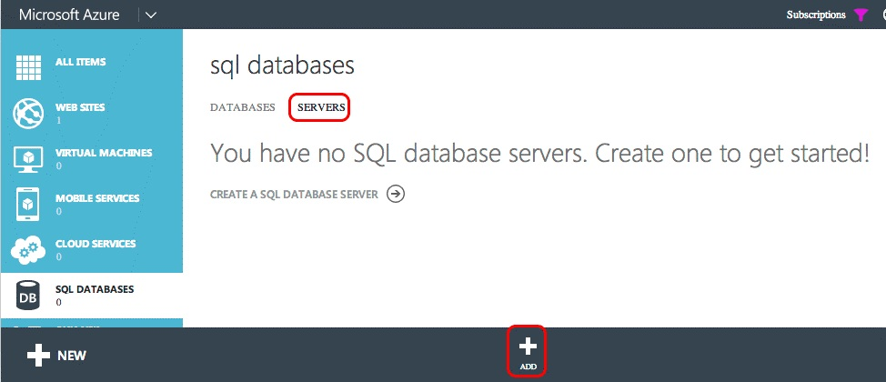
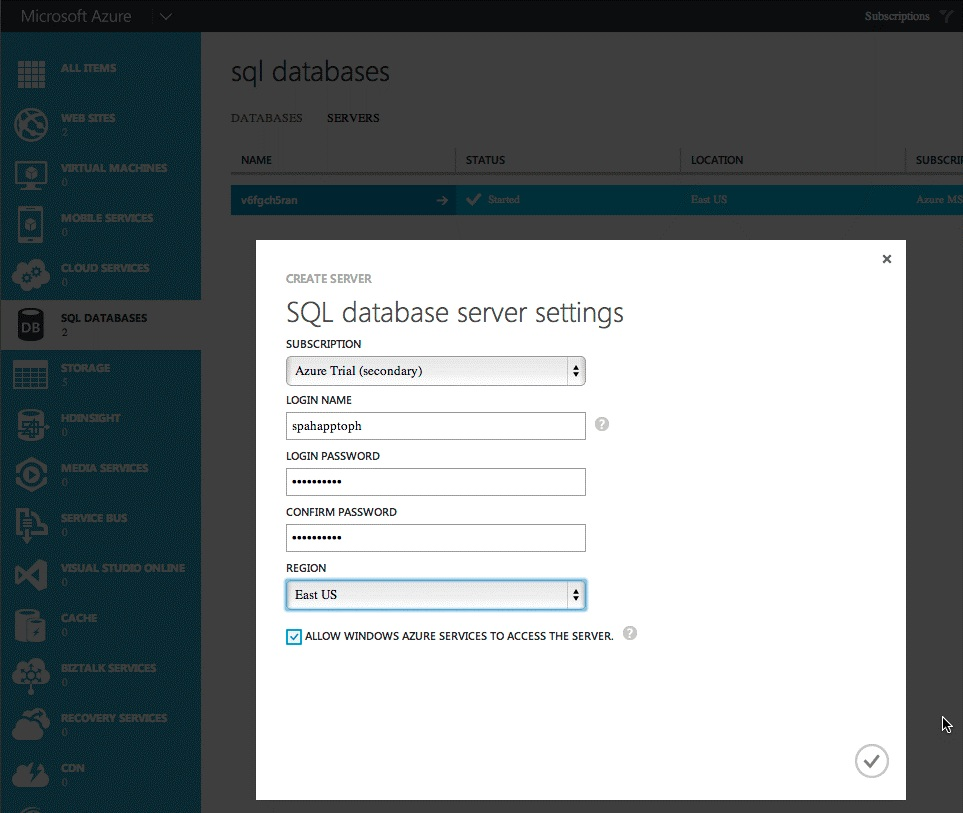
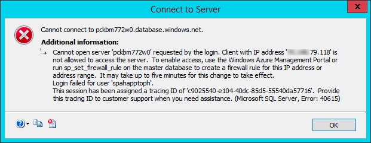
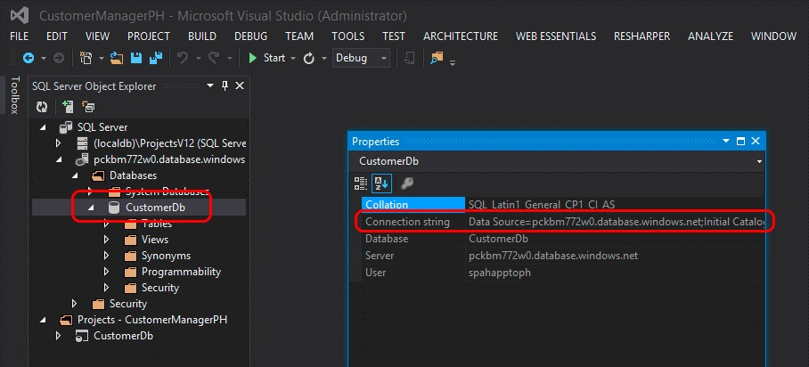
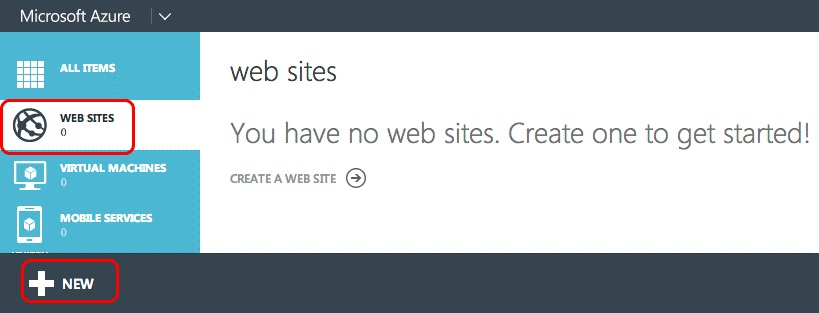
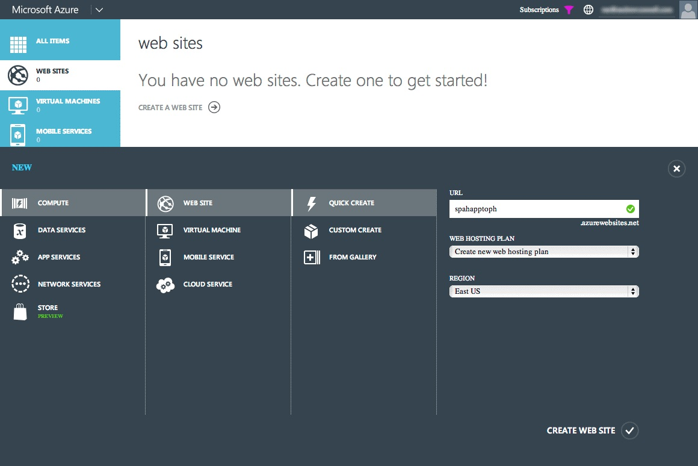
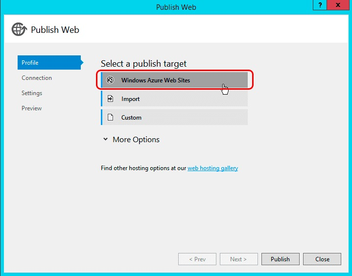
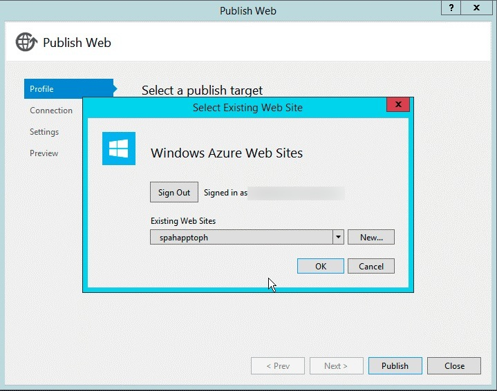
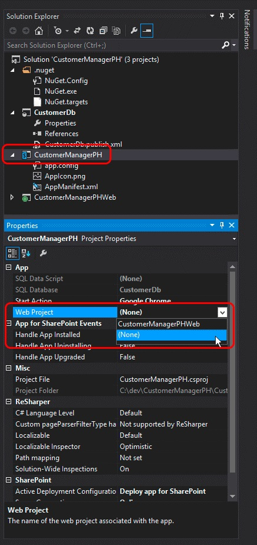

# 將自動裝載 SharePoint 增益集轉換成提供者主控增益集 (英文)
了解如何將自動裝載SharePoint Add-in轉換成提供者主控增益集。
Microsoft SharePoint 2013導入新的方法來擴充 SharePoint 網站除了使用方案為基礎的自訂的舊的方法。SharePoint、 呼叫增益集模型，此新擴充性模型可讓開發人員建立可以部署至 SharePoint 環境不論是否所執行的內部部署、 自訂實作SharePoint Online或混合式部署。
  
    
    

開發人員可以建立兩種不同類型的 SharePoint 增益集。在瀏覽器中，主要是執行 SharePoint 主控增益集的第一個類型與所有支援 HTML、 CSS、 圖像及JavaScript之類的資產儲存，而且所 SharePoint 服務。其他類型的增益集分為雲端增益集模型 (攝影機) 和主要外部 sharepoint 上執行另一部伺服器並與使用用戶端物件模型 (CSOM) 與 REST API 的 SharePoint 通訊。他們建立使用 SharePoint 2013 所支援的熱門 OAuth 2.0 通訊協定身分識別。
開發人員可以實作增益集使用增益集模型中兩種方式之一，SharePoint 2013 發行，但在 2014 年 5 月日 Microsoft 已宣佈其就會關閉預覽程式並將不再支援建立自動裝載增益集的提供者主控增益集或自動裝載增益集自動裝載增益集已發行為預覽程式。宣告，請參閱 ＜ [在自動裝載增益集預覽程式更新](http://blogs.office.com/2014/05/16/update-on-autohosted-apps-preview-program/)。
  
    
    

本文說明如何轉換並自動裝載增益集移轉至裝載提供者增益集。不過，務必開發人員瞭解某些特定的兩個差異式升級因為此知識庫大幅簡化轉換程序。
## 自動裝載增益集轉換至裝載提供者增益集的必要軟體

- 在所有 [必要條件開發提供者主控增益集](get-started-creating-provider-hosted-sharepoint-add-ins.md#SP15createselfhostapp_bk_prereq)。
    
  
- Azure SDK v2.3。從這裡是 [下載中心本頁](http://azure.microsoft.com/downloads)中安裝它。
    
  

### 若要知道的核心概念

將自動裝載增益集轉換至裝載提供者增益集之前，您應該會有基本了解SharePoint Add-ins和之間的差異 SharePoint 主控、 提供者主控及自動裝載SharePoint Add-ins。表格 1 中所列的各篇文章應該提供該了解。
  
    
    

**表 1。轉換自動裝載的核心概念增益集的提供者主控增益集**

|**文章標題**|**描述**|
|:-----|:-----|
| [SharePoint Add-ins](sharepoint-add-ins.md)   |了解新增益集模型中的全部SharePoint 2013可讓您建立增益集，亦即使用者的小型、 易於使用的解決方案。   |
| [重要方面之 SharePoint 增益集架構設計和開發入門](important-aspects-of-the-sharepoint-add-in-architecture-and-development-landscap.md)   |了解方面SharePoint Add-ins以及SharePoint 增益集相關的模型，包括增益集主控選項、 使用者介面 (UI) 選項、 部署系統、 安全性系統及生命週期的架構。   |
| [選擇如何開發和裝載您 SharePoint 的增益集的模式](choose-patterns-for-developing-and-hosting-your-sharepoint-add-in.md)   |了解您能託管SharePoint Add-ins的各種方式。   |
| [主機 web、 增益集 web 及 SharePoint 2013 中的 SharePoint 元件](host-webs-add-in-webs-and-sharepoint-components-in-sharepoint-2013.md)   |了解主機 web 與增益集 web 之間的差別。也了解 SharePoint 2013 元件可以包含在 SharePoint 增益集、 其部署至主機網頁、 其部署至增益集 web 及增益集 web 隔離網域中的部署方式。   |
   

## 轉換增益集

將自動裝載SharePoint Add-in轉換成提供者主控增益集需要修改兩個或三個元件。
  
    
    

- 本身的 SharePoint 增益集
    
  
- 遠端 web 應用程式或服務
    
  
- Microsoft Azure SQL Database，如果有任何的增益集
    
  
SharePoint 自動裝載增益集部署Azure 網站和Microsoft Azure SQL Database自動它已安裝，不過裝載提供者增益集可以有其遠端 web 應用程式及其他服務存在於任何 web 平台。本文假設自動裝載增益集與其設為遠端元件會保持為 Azure 服務追蹤轉換成提供者主控增益集。
  
    
    
下列各節逐步解說轉換為自動裝載增益集的提供者主控增益集的程序。範例自動裝載增益集使用 - 客戶經理-為簡單，以專注於轉換步驟並不實際增益集。它包含三個專案：
  
    
    

- CustomersDb: SQL 資料庫專案會產生必要 *.dacpac。請注意那里無結構描述定義這個專案中。它只用以因為結構描述建立 ASP.NET web 應用程式所建立的資料庫。
    
  
- CustomerManagerAH: SharePoint 自動裝載增益集設定為包含 ASP.NET web 應用程式專案和 Azure SQL 資料層應用程式產生 SharePoint 增益集套件中。
    
  
- CustomerManagerAHWeb: ASP.NET MVC web 應用程式使用實體架構的程式碼第一個遷移方法以建立的資料庫結構描述以及讀取及寫入至資料庫。
    
  
增益集是可以同時顯示 customers 資料表中Microsoft Azure SQL Database以及新增新客戶 ASP.NET MVC web 應用程式。這是讓任何人檢視或新增客戶匿名的 web 應用程式。可從下列公用存放庫下載自動裝載增益集和相關聯的專案的 Visual Studio 解決方案： [自動裝載移轉-程式碼範例](https://github.com/OfficeDev/Auto-Hosted-Migration-Code-Samples)。
  
    
    
SharePoint 2013 自動裝載增益集轉換至裝載提供者增益集包含多個步驟。每個是由下列各節所述。
  
    
    

1. 部署Microsoft Azure SQL Database
    
  
2. 建立Azure 網站主控的遠端 web 應用程式
    
  
3. 增益集登錄與 SharePoint 網站
    
  
4. 更新及部署Azure 網站遠端 web 應用程式
    
  
5. 更新和部署 SharePoint 提供者主控增益集
    
  

### 部署 Azure SQL 資料庫

轉換的自動裝載增益集的提供者主控增益集的第一個步驟是部署 ASP.NET web 應用程式將依賴Microsoft Azure SQL Database 。有許多不同方式來建立Microsoft Azure SQL Database，部份只都記載在 Microsoft Azure 文件網站： [如何部署資料庫以 Azure](http://azure.microsoft.com/documentation/articles/sql-database-deploy/)。
  
    
    
因為這是資料庫如何部署 SharePoint 自動裝載增益集的下列步驟中所述的方法就會使用資料層應用程式部署模型。這會產生資料層應用程式套件 (*.dacpac) 以及如何使用它來建立資料庫。
  
    
    

#### 建立及部署 Azure SQL 資料庫

先在 Visual Studio 中開啟自動裝載解決方案。以滑鼠右鍵按一下資料庫專案 **CustomerDb**並選取 [ **建置**]。這會產生 CustomerDb.dacpac 檔案 `[..]\\bin\\[debug | release]`資料夾中。
  
    
    
下一步是建立新的Microsoft Azure SQL Database。 **Azure 管理入口網站**(https://manage.windowsazure.com) 與一次儀表板的登入載入、 邊界中選取 [SQL 資料庫連結：
  
    
    

**Azure Management Portal 中 azure SQL 資料庫儀表板**

  
    
    

  
    
    

  
    
    
按一下上方導覽列中的 [ **伺服器**] 連結] 和 [頁尾中的 [ **新增**] 按鈕，如下圖所示：
  
    
    

**Azure Management Portal 中 azure SQL 資料庫儀表板**

  
    
    

  
    
    

  
    
    
在出現 **建立的伺服器**] 對話方塊中，選取將伺服器的權限和選取 [使用先前建立Azure 網站時的相同 **區域**使用者 Azure **訂閱**的 **登入名稱**和 **密碼**。這些會在後續步驟中所需進行登入名稱及密碼的附註。
  
    
    

**Azure Management Portal 中建立 Azure SQL 資料庫**

  
    
    

  
    
    

  
    
    
一旦填寫表單，按一下 [ **檢查] 圖示**來建立資料庫的右下。雖然現在建立伺服器時，只可以存取它的資源是其他 Azure 的服務。因為這會在後續步驟中所需進行Microsoft Azure SQL Database名稱的附的註。
  
    
    
若要連線至Microsoft Azure SQL Database及部署資料庫的防火牆規則必須建立的允許從將部署資料庫之電腦的流量。否則Microsoft Azure SQL Database連線將會遭到拒絕與類似下圖中的錯誤：
  
    
    

**連線至 Azure SQL 資料庫的錯誤**

  
    
    

  
    
    

  
    
    
若要建立防火牆規則、 內 **Azure Management Portal**中，選取先前建立的Microsoft Azure SQL Database和 [上方導覽列中的 [ **設定**] 連結。 **允許 IP 位址**] 區段的 [IP 位址目前顯示如下圖所示。按一下 [新增防火牆規則 **新增至允許 IP 位址**。這樣會允許Microsoft Azure SQL Database及部署之資料庫的連線。請務必按一下 [在頁尾中的 [ **儲存**] 按鈕。
  
    
    

**Azure Management Portal 中 Azure SQL 資料庫的建立防火牆規則**

  
    
    

  
    
    

  
    
    
下一步是部署資料庫。這可以完成從 Visual Studio 使用 Azure SDK v2.3。從 [下載中心本頁](http://azure.microsoft.com/downloads)中安裝它。Visual Studio 內開啟 [ **SQL Server 物件總管**] 工具視窗、 以滑鼠右鍵按一下 [ **SQL Server** ] 節點並選取 [ **新增 SQL Server**：
  
    
    

**在伺服器檔案總管中新增 Azure SQL 資料庫**

  
    
    

  
    
    

  
    
    
在 [ **連接到伺服器**] 對話方塊中輸入 **伺服器名稱**、 設為 **SQL Server 驗證**的 **驗證**及相同的 **登入**及 **密碼**時建立Microsoft Azure SQL Database定義。伺服器名稱應該是這是 `[server-name].database.windows.net`、 之伺服器的完整的名稱，如下圖所示：
  
    
    

**連線至 Visual Studio 中 Azure SQL 資料庫**

  
    
    

  
    
    

  
    
    
連接至Microsoft Azure SQL Database之後，展開 [新增的伺服器] 節點、 以滑鼠右鍵按一下 [ **資料庫**] 節點並選取 **發佈資料層應用程式**以啟動 [發佈精靈]。
  
    
    
[ **來源資料層應用程式 (.dacpac)**] 區段中使用 [ **瀏覽**] 按鈕來尋找從資料庫專案時在先前步驟中建立並確認 **資料庫名稱**設為CustomerDb，然後按 [ **發佈**到發佈 CustomerDb 中Microsoft Azure SQL Database產生 *.dacpac 檔案。
  
    
    

**發佈使用 Visual Studio Azure SQL 資料庫的資料層應用程式**

  
    
    

  
    
    

  
    
    
若要查看 CustomerDb 列在 [ **資料庫**] 節點底下的 [Visual Studio **SQL Server 物件總管**工具] 視窗的重新整理。
  
    
    

    
> **注意事項**
> 根據如何建立資料庫時自動裝載增益集，可能需要將其部署至 Azure 一些額外的工作。請參閱 MSDN 中的其他指導的下列文章：>  [Converting between Data-tier Application Projects and Database Projects](http://msdn.microsoft.com/library/40b51f5a-d52c-44ac-8f84-037a0917af33.aspx)>  [Creating &amp; Managing Data-Tier Application](http://msdn.microsoft.com/library/18907b6c-7678-4182-9304-fe56fdb9f0bd.aspx)
  
    
    

#### 部署後動作

一旦建立Microsoft Azure SQL Database 、 複製用來建立連線至資料庫的連線字串。這可取得兩種方式。其中一個方法是登入 **Azure 管理入口網站**(https://manage.windowsazure.com) 並瀏覽至最後一個步驟中建立Microsoft Azure SQL Database : CustomerDb。在 [ **儀表板**] 頁面上的資料庫上按一下連結 **顯示連接字串**來查看連接字串的清單。請在稍後使用 **ADO.NET**連接字串的複本。
  
    
    

**從 Azure 管理入口網站取得 Azure SQL 資料庫連線字串**

  
    
    

  
    
    

  
    
    
若要取得的連接字串的其他方式是從 Visual Studio 內提供安裝 Azure SDK v2.3。在 **SQL Server 物件總管**工具期間內 Visual Studio 中選取 [資料庫 **CustomerDb**]。一旦選取資料庫時，查看 [ **屬性**] 工具視窗來查看連接字串。這是在上方 **Azure Management Portal**中找到的值相同。
  
    
    

**從 Visual Studio 透過 Azure sdk (英文) 取得 Azure SQL 資料庫連線字串**

  
    
    

  
    
    

  
    
    

  
    
    

  
    
    

### 建立Azure 網站

下一步是建立新的Azure 網站提供者主控增益集所在的遠端 web 應用程式。這就是先因為遠端 web 應用程式的 URL 需要再登錄的增益集。不過的增益集在 SharePoint 中註冊應前面加上部署的 ASP.NET web 應用程式的檔案由於註冊程序 (用戶端識別碼和用戶端密碼) 從之前的 ASP.NET web 應用程式檔案部署所需的兩個輸出。
  
    
    
若要建立新的Azure 網站、 第一部登入 **Azure 管理入口網站**(https://manage.windowsazure.com)。儀表板載入時，按一下 [ **網站**] 導覽連結左邊界、 中的然後如下圖所示之頁尾中的 [ **新增**] 按鈕：
  
    
    

**Azure Management Portal 中 azure 網站儀表板**

  
    
    

  
    
    

  
    
    
下一步] 在新的網站精靈] 中選取 [ **計算**、 **網站**、 **快速建立**，然後指定 **URL**和 **WEB 主控規劃**。最後指定應該在其中建立網站的 **區域**。請務必記住因為稍後建立Microsoft Azure SQL Database應使用相同的區域所選取的區域。此外，如果虛擬主機計劃不存在或需要一份新，請選取選項 **主控計劃建立新的 web**。下圖顯示範例：
  
    
    

**Azure Management Portal 中建立 Azure 網站**

  
    
    

  
    
    

  
    
    
建立之後Azure 網站，使用於網站之 url 的附註。在上述圖表中建立之網站是 `http://spahapptoph.azurewebsites.net`。
  
    
    

### 註冊新的增益集

使用增益集模型建立的所有SharePoint Add-ins必須以 SharePoint 和遠端 web 應用程式之間建立信任都登錄與主控的 SharePoint 伺服器陣列或租用。這會註冊新的增益集主體與 SharePoint 指定下列值：
  
    
    

- **用戶端識別碼**的增益集識別碼
    
  
- **用戶端密碼**增益集的密碼
    
  
- **標題**的增益集的名稱
    
  
- **增益集網域**- 遠端 web 應用程式的最上層網域
    
  
當自動裝載增益集已安裝在SharePoint Online時、 Office 365 會自動建立增益集主體。因為它會自動建立網站知道遠端 web 應用程式的 URL。它也採用的用戶端識別碼和用戶端密碼並將它們新增至遠端 web 應用程式的 web.config。Web.config 是其中 (TokenHelper.cs 或.vb 檔案中) 的 Microsoft 提供的類別會尋找它們時驗證要求和驗證與 SharePoint。
  
    
    
不過，提供者主控增益集] 中開發人員必須手動註冊增益集和手動更新 web.config ASP.NET web 專案中。
  
    
    
若要註冊新的增益集、 瀏覽至 [增益集登錄] 頁面上的 SharePoint 網站的增益集將會安裝。此頁面已找到 `http://[SharePoint-site-url]/_layouts/15/appregnew.aspx`。增益集登錄] 索引標籤上的 **增益集類型**設為 **增益集執行的網頁伺服器上**，按一下 [建立新的 **用戶端識別碼**及 **用戶端密碼**的兩個 **產生**按鈕。在 [ **標題**] 欄位中輸入增益集的名稱和目標Azure 網站 URL 其上一個步驟中建立 **增益集的網域**] 欄位。最後，按一下 [ **建立**] 按鈕。
  
    
    
登錄的增益集之後，SharePoint 會建立註冊表單中顯示資訊所使用的摘要。務必非常此資訊會複製的妥善保存，特別是用戶端識別碼和用戶端密碼，因為這些所需的後續步驟。
  
    
    

### 遠端 web 應用程式 / Azure 網站設定變更

下一步是來重新設定之遠端 web 應用程式，讓它可以部署為提供者主控增益集，而不是自動裝載增益集。有多種方式的 ASP.NET 網站部署至包括部署它Azure 網站直線從 Visual Studio、 自動從原始檔控制 like Visual Studio 線上，或從 GitHub，或甚至是藉由使用嘗試 true FTP 選項。本文中使用 Visual Studio。之前 web 應用程式可以部署，不過它首先需要幾個更新才能使用的提供者主控增益集。
  
    
    

#### 更新的遠端 web 應用程式專案

需要 ASP.NET MVC web 應用程式中發生重大變更是在 web.config 檔案。在這個檔案內有三個 **<appSettings>**節點中找到的設定。這些是 **ClientId**、 **ClientSecret**及 **SqlAzureConnectionString**。第二個會使用 Microsoft 提供的類別、 TokenHelper.cs 或.vb，有助於驗證和遠端 web 應用程式與 SharePoint 通訊。後面，  `SqlAzureConnectionString`，由增益集來連線至Microsoft Azure SQL Database。
  
    
    
SharePoint 自動裝載增益集] 中的 Office 365 中填入這些設定的值時安裝增益集時建立Azure 網站和Microsoft Azure SQL Database 。不過在主控提供者增益集這些必須手動設定之前部署中之增益集。
  
    
    
貼上的步驟，與上述的三種設定的值是一個選項但此方法與缺點他們曾經需要變更，如果 web.config 必須手動更新及重新部署高度模糊至Azure 網站。
  
    
    
另一個作法是只要清除 (只是設定為空字串的 **value=""**屬性就地保留設定金鑰) 這些設定並改用Azure 網站設定透過 **Azure Management Portal**中定義它們。這個方法會表示不會更新程式碼基底可以會變更設定。
  
    
    
若要這樣做，登入 **Azure 管理入口網站**(https://manage.windowsazure.com) 並瀏覽至 [上一個步驟中建立Azure 網站 。在Azure 網站儀表板] 頁面上，按一下上方導覽功能表中的 **設定**，然後捲動至 [ **增益集設定**] 區段。新增三個新增益集設定 web.config 檔案中使用相同的相同設定名稱。使用 ClientId、 ClientSecret，及 SqlAzureConnectionString 取得上一個步驟中的值。
  
    
    
請確定Microsoft Azure SQL Database連線字串為正確且有效因為時的連接字串會公開透過 **Azure 管理入口網站**和 Visual Studio、 password 屬性由取代遮罩。連接字串中的遮罩的密碼應使用正確的密碼定義建立的Microsoft Azure SQL Database登入時變更。
  
    
    

#### 部署Azure 網站遠端 web 應用程式

現在 ASP.NET MVC web 應用程式檔案必須部署至Azure 網站做為遠端 web 應用程式。在 Visual Studio 中，以滑鼠右鍵按一下 [web 專案並選取 [ **發行**]。這會啟動 [ **發佈**精靈] 對話方塊。在此對話方塊中選取 [ **Windows Azure 的網站**] 選項並按一下 [ **發佈**]。
  
    
    

**Visual Studio 發佈網頁] 對話方塊**

  
    
    

  
    
    

  
    
    
在下一個步驟中，選取Azure 網站 ，如下圖所示在上一個步驟中建立的名稱、 按一下 [ **確定**] 並確定網站的 URL 是 HTTPS。
  
    
    

**發佈的 ASP.NET web 應用程式至現有 Azure 的網站**

  
    
    

  
    
    

  
    
    
在最後一個步驟中，按一下 [ **驗證連線**至確保的設定及連線良好的工作順序，最後按一下 [ **發佈**] 按鈕。這樣會觸發 Visual Studio 部署Azure 網站ASP.NET web 應用程式。
  
    
    
之後部署之網站、 Visual Studio 將啟動偵錯瀏覽器的預設值並瀏覽至 [ Azure 網站。不過網站將會轉譯錯誤。這是因為 ASP.NET MVC 控制器以預期傳送至控制站的 HTTP POST 要求標頭中的特定值的 SharePoint 屬性 (特別是 `SharePointContextFilter`) 裝飾但根據預設瀏覽器啟動 HTTP GET 要求，因此預期此錯誤。
  
    
    

    
> **注意事項**
> 請參閱 Azure 的文件部署至Azure 網站ASP.NET web 應用程式的其他選項： [如何部署 Microsoft Azure 網站](http://azure.microsoft.com/documentation/articles/web-sites-deploy)。
  
    
    

#### 部署後動作

下一步是將複製網站的 URL。
  
    
    

#### 自訂網域和Azure 網站的 SSL 憑證

所有Azure 網站都使用下列的命名慣例：  `http[s]://[site-name].azurewebsites.net`。Microsoft 已新增到 `*.azurewebsites.net` [網域] 底下的所有網站的萬用字元 SSL 憑證，但客戶是免費其Azure 網站建立關聯的自訂網域以及他們自己的 SSL 憑證用於這些自訂的網域。
  
    
    
如需使用自訂的網域，請參閱 Azure 文件： [設定為自訂的網域名稱的 Microsoft Azure 網站](http://azure.microsoft.com/documentation/articles/web-sites-custom-domain-name)。如需新增自訂的 SSL 憑證的自訂網域名稱，請參閱 Azure 文件： [啟用 HTTPS 的 Microsoft Azure 網站](http://azure.microsoft.com/documentation/articles/web-sites-configure-ssl-certificate)。
  
    
    

### 重新設定 SharePoint 增益集專案

最後一個步驟是重新設定 SharePoint 增益集專案。SharePoint 中之增益集的 Visual Studio 專案已設定為自動裝載的增益集類型。先變更這從自動裝載提供者主控 SharePoint 增益集專案中開啟 AppManifest.xml 檔案和選項變更為 **裝載的類型**從 **自動裝載** **提供者主控**。
  
    
    
此外，設定 **開始] 頁面上**的增益集以指到遠端 web 應用程式的開始頁面即Azure 網站URL 的 URL。請確定要包含的查詢字串值{StandardTokens}，如果不是已經存在。這可確保該 SharePoint 新增核心查詢字串語彙基元的 url 時開啟的遠端 web 應用程式。
  
    
    
在 Visual Studio **方案總管**中選取 SharePoint 增益集專案中下一步] 移除 SharePoint 增益集專案中的 ASP.NET MVC web 應用程式中的參考 (英文) 和 **屬性**工具] 視窗中，將 **Web 專案**屬性 **(無)**、 圖 20 所示：
  
    
    

**從 SharePoint 增益集套件中移除的遠端 web 應用程式**

  
    
    

  
    
    

  
    
    
因為部分設定不會公開設計工具中的最後一個步驟會需要 AppManifest.xml 檔案手動更新。透過將現有的任何變更儲存至 AppManifest.xml 檔案並執行這項作業然後以滑鼠右鍵按一下 [ **方案總管**中的相同檔案並選取 [ **檢視程式碼**。
  
    
    

**在 [程式碼] 檢視中開啟 AppManifest.xml 檔案**

  
    
    

  
    
    

  
    
    
AppManifest.xml 檔案的程式碼] 檢視中移除兩個參照至 ASP.NET MVC web 應用程式專案與 SQL 資料層應用程式專案不所需的 SharePoint 提供者主控增益集內。
  
    
    
下一步] 建立新的 GUID，並取代 **ProductId**屬性中的現有 GUID。這會告訴 SharePoint 這是新增益集至現有的增益集的更新。
  
    
    

    
> **重要**
> 如果使用現有的 ProductId SharePoint 會傳回錯誤 」 所提供的增益集不同於其他增益集具有相同的版本及產品識別碼"轉換後的增益集安裝的情況。
  
    
    

然後尋找 **<RemoteWebApplication>**元素，並更新 **ClientId**屬性設為相同搭配 SharePoint 及所登錄的增益集已使用Azure 網站web.config 增益集設定] 中取得的 GUID。
  
    
    

**設定 SharePoint 提供者主控增益集 ClientId**

  
    
    

  
    
    

  
    
    
之後將所有變更都儲存至 AppManifest.xml 檔案、 增益集是現在已準備好用於測試以 SharePoint 主控的提供者增益集部署至 SharePoint 伺服器陣列或 SharePoint Online 網站，以確認轉換步驟增益集已正確地執行。
  
    
    

## 其他資源

SharePoint 增益集模型、 SharePoint 主控的增益集或增益集模型的詳細資訊，請遵循開發工具、 指令碼及公用程式來協助建立 SharePoint 增益集和從自動裝載增益集移轉至裝載提供者增益集的 [Office 開發人員部落格](http://blogs.office.com/dev/)新聞和更新。
  
    
    

