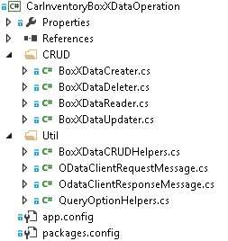
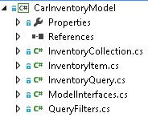

# 建立的雲端商務增益集使用 SAP 閘道
了解如何建立 LightSwitch SharePoint 提供者主控增益集來存取 Microsoft 藉由 SAP 閘道的 SAP 資料。
本文著重於 microsoft 開發小組用以建立 LightSwitch SharePoint 提供者主控增益集可以存取 SAP 資料藉由 SAP 閘道 Microsoft 的關鍵步驟。此增益集支援 CRUD 作業對 SAP 資料，可用來從檢視圖片] 和 [上傳圖片至 SharePoint 圖片庫。
  
    
    

本文的目的是要顯示的增益集可協助您建立類似的增益集的關鍵點。 在程式碼範例會提供與，讓您可以查看工作方案建立的方式，以強化您學習文章連結。
 **範例下載 (英文)：** [範例： 開發的雲端商務增益集存取 SAP 閘道的 Microsoft ](https://code.msdn.microsoft.com/Sample-Developing-a-Cloud-25d6d1ea)
  
    
    


## 開始之前

以下是本文中的程序的必要條件：
  
    
    

- Microsoft Azure Active Directory (Azure AD) 租用相關聯的 Office 365 網域中 **的 Office 365 開發人員網站** 。請參閱 [註冊 Office 365 開發人員網站，設定您的工具和環境及開始部署增益集](http://msdn.microsoft.com/en-us/library/office/fp179924%28v=office.15%29.aspx)或 [How to： 建立您現有的 Office 365 訂閱內的開發人員網站。](http://msdn.microsoft.com/en-us/library/office/jj692554%28v=office.15%29.aspx)
    
  
- **Visual Studio 2013 更新 4** 或更新版本，其中您可以從 [ [歡迎使用 Visual Studio 2013](http://msdn.microsoft.com/en-us/library/dd831853.aspx)取得。
    
  
- **Microsoft Office 開發人員工具的 Visual Studio。** 會包含在更新 4 的 Visual Studio 2013 以後版本。
    
  
- **SAP Gateway for Microsoft** 已部署及設定 Microsoft Azure 中。如需詳細資訊，請參閱 [Microsoft SAP 閘道](http://go.microsoft.com/fwlink/?LinkId=507635)文件。
    
  
- **In Microsoft Azure 組織帳戶。** 請參閱 [建立組織的使用者帳戶在 Azure AD](http://go.microsoft.com/fwlink/?LinkID=512580)。
    
    > **注意事項**
      > Office 365 帳戶 (login.microsoftonline.com) 來建立帳戶之後變更暫時密碼登入。
- 將含有範例資料中 **的 SAP OData 端點** 。請參閱 [Microsoft SAP 閘道](http://go.microsoft.com/fwlink/?LinkId=507635)文件。
    
  
- **Azure AD.基本熟悉** 請參閱 ＜ [Getting started with Azure AD](http://msdn.microsoft.com/en-us/library/azure/dn655157.aspx)。
    
  
- **基本熟悉建立 SharePoint 增益集** 請參閱 [How to： 建立基本提供者主控 SharePoint 增益集](http://msdn.microsoft.com/en-us/library/office/fp142381%28v=office.15%29.aspx)。
    
  
- **在 Azure AD.OAuth 2.0 基本熟悉** 請參閱 [OAuth 2.0 和 Azure AD](http://msdn.microsoft.com/en-us/library/azure/dn645545.aspx)和其子主題。
    
  

## 解決方案概觀 (英文)

Contoso 馬達是虛構自動銷售公司代表真實公司汽車經銷商順序它解除與其他經銷商銷售代表與共用的汽車其庫存相關資訊。使用此增益集、 銷售人員可以檢查其汽車經銷商庫存、 增益集存取直接從 SAP 藉由 SAP 閘道的 Microsoft 的目前狀態。所有的資料會儲存在 SAP，及每個汽車的圖片儲存在 SharePoint Online 中的圖片庫中。 SAP 與 SharePoint 圖片庫資料放在一起，且此增益集所顯示。增益集，主管和系統管理員可以執行標準 CRUD 作業在 SAP 中每個汽車相關的詳細資料。
  
    
    
在本文中範例中，會 SellerDashboard 增益集處理 SAP 與 SharePoint 圖片庫中的與其圖片的汽車經銷商庫存資料。在此增益集的標準 CRUD (建立、 讀取、 更新及刪除) 作業支援在 SAP 中每個汽車的詳細資訊。
  
    
    

> **秘訣**
> 此增益集的視訊示範，請觀看 [技術網路-SAP Gateway for Microsoft &amp; Microsoft Azure 開發模型](http://go.microsoft.com/fwlink/?LinkId=517378)影片 BrightTalk 上。應用程式的功能示範開始在時間表上 48:00 分鐘。
  
    
    

 **程式碼架構**
  
    
    
SellerDashboard 解決方案包含八個專案並為下圖顯示，它分為兩個類別: BoxXDataStudio 和 SellerDashboardStudio。
  
    
    

  
    
    

  
    
    

### BoxXDataStudio

此 studio 包含所有的 Microsoft 與 SAP 閘道互動所需的元件。
  
    
    

- **AADAuthLib**
    
    此元件用以執行 [Azure AD 驗證程式碼流程](https://msdn.microsoft.com/en-us/library/azure/dn645542.aspx)，它會使用單一模式。
    
    下列程式碼片段顯示 AADAuthLib 元件提供的主要函數。如需詳細資訊，請參閱 AADAuthLib/AuthUtil.cs 範例程式碼協助程式類別。
    


  ```cs
  
// Use the auth code, acquire the refresh token and access token, and store them in the current session
        public bool AcquireTokenFromAuthCode(string authCode, string redirectUrl = "redirectUrl")
        {
            if (!IsAuthorized &amp;&amp; !string.IsNullOrEmpty(authCode))
            {
                AuthenticationResult authResult = _authContext.AcquireTokenByAuthorizationCode(authCode,
                    new Uri(ConfigurationManager.AppSettings["ida:" + redirectUrl]),
                    _clientCredential,
                    ConfigurationManager.AppSettings["ida:ResourceUrl"]);

                HttpContext.Current.Session["RefreshToken"] = authResult.RefreshToken;
                HttpContext.Current.Session["AccessToken-" + ConfigurationManager.AppSettings["ida:ResourceUrl"]] = new Tuple<string, DateTimeOffset>(authResult.AccessToken, authResult.ExpiresOn);

                return true;
            }

            return false;
  }

 // Provide the access token, which is stored in the current session, if the access token expired, use the refresh token get a new one.
 public string AccessToken
        {
            get
            {
                if (!IsAuthorized) throw new UnauthorizedAccessException();

                var accessToken = HttpContext.Current.Session["AccessToken-" + ConfigurationManager.AppSettings["ida:ResourceUrl"]] as Tuple<string, DateTimeOffset>;

                if (IsAccessTokenValid(accessToken))
                {
                    return accessToken.Item1;
                }

                accessToken = RenewAccessToken();
                HttpContext.Current.Session["AccessToken-" + ConfigurationManager.AppSettings["ida:ResourceUrl"]] = accessToken;

                return accessToken.Item1;
            }
  }
  ```

- **BoxXDataService**
    
    這是 WCF RIA 服務，這是架設在 Azure、 SellerDashboard 伺服器端元件所使用的介面和其使用來自 SAP 閘道的 SAP 資料來源提供的 Microsoft.
    
    下列程式碼片段是 CRUD Web 方法，此方法的 WCF RIA 服務支援。如需詳細資訊請參閱 BoxXDataService/BoxXDataService.cs。
    


  ```cs
  
[Query(IsDefault = true)]
        public IQueryable<InventoryItem> GetAllCarInventory()
        {
            BoxXDataReader dataReader = BoxXDataReader.Instance;
            IInventoryCollection dataCollection = ModelFactory.CreateInventoryCollection(dataReader.SchemaPropertyNames);
            IInventoryQuery query = QueryFactory.CreateQuery();
            dataReader.GetData(dataCollection, query);

            return dataCollection.Items.Cast<InventoryItem>().AsQueryable();
        }

        [Update]
        public void UpdateCarInventoryItem(InventoryItem carInventoryItem)
        {
            BoxXDataUpdater dataUpdater = BoxXDataUpdater.Instance;
            dataUpdater.UpdateInventoryItem(carInventoryItem);
        }

        [Insert]
        public void InsertCarInventoryItem(InventoryItem carInventoryItem)
        {
            BoxXDataCreater dataCreater = BoxXDataCreater.Instance;
            dataCreater.CreateInventoryItem(carInventoryItem);
        }

        [Delete]
        public void DeleteCarInventoryItem(InventoryItem carInventoryItem)
        {
            BoxXDataDeleter.DeleteInventoryItem(carInventoryItem.ID);
 }
  ```

- **CarInventoryBoxXDataOperation**
    
    這是實際 CRUD 實作的 BoxXDataService。下圖顯示 CarInventoryBoxXDataOperation 的主要的程式碼架構。CRUD 命名空間用來實作 CRUD 作業與公用程式命名空間是 CRUD 命名空間的協助程式碼。
    
     
  

  

  
- **CarInventoryModel**
    
    這是用來實作資料模型和公用程式庫專案。資料模型定義具有符合 OData 端點 SAP 閘道所使用的 Microsoft、 SAP 資料結構描述為基礎的中繼資料。BoxXDataService 和 CarInventoryBoxXDataOperation 用它來將 SAP 資料庫項目轉換成汽車庫存執行個體。
    
    下圖顯示的主要元件。
    
  

  
    
    

  
    
    

  
    
    

  
    
    

### SellerDashboardStudio

SellerDashboardStudio 包含標準 LightSwitch SharePoint 增益集的元件。
  
    
    

- **SellerDashboard**
    
    SellerDashboard 會啟動專案，並加以使用 SellerDashboard 增益集發佈至 Azure 網站和其 SharePoint 增益集的 SharePoint 開發人員網站。
    
  
- **SellerDashboard.HTMLClient**
    
    此元件包含畫面、 自訂控制項及相片上傳控制項。 下圖顯示它的主要元件。
    
  
- 
     
  

    SellerDashboard.HTML.Client 包含下列四個畫面：
    
  - BrowseInventoryItems 是主畫面，用來瀏覽所有的庫存項目的基本資訊。
    
  
  - ViewInventoryItem 是詳細資料] 畫面上，用來顯示每個庫存項目的詳細的檢視。
    
  
  - EditInventoryItem 是用來編輯詳細目錄項目編輯快顯畫面。
    
  
  - AddInventoryItem 是用來新增新的庫存項目新增快顯畫面。
    
  

    UserCode.js 檔案包含 UX 自訂控制項程式碼。
    
    Photohelper.js 和 sharepointauthhelper.js、 檔案、 指令碼] 資料夾中包含根據下列文章中提供的指導 [逐步解說： 建立增益集的 SharePoint 所使用的 LightSwitch](http://msdn.microsoft.com/en-us/library/jj969621.aspx)。
    
  
- **SellerDashboard.Server**
    
    此元件包含 WCF RIA 資料來源、 SharePoint 資料來源與相片上傳 Web API。 下圖顯示它的主要元件。
    
     
  

    SharePointContext.cs 和 TokenHelper.cs 會提供用戶端的內容來驗證在 sharepoint 的輔助類別。這可讓相片上傳 Web API 要用來將汽車的相片上傳至圖片庫。PhotoListHelper.cs 和 PhotosController.cs 檔案實作相片上傳 Web API。如需 LightSwitch 如何使用相片上傳 Web API 的詳細資訊，請參閱下列文章 [逐步解說： 建立增益集的 SharePoint 所使用的 LightSwitch](http://msdn.microsoft.com/en-us/library/jj969621.aspx)。
    
  
- **SellerDashboard.SharePoint**
    
    若要啟用的 SharePoint 專案 LightSwitch 解決方案之後就包含這個元件。您可以使用此元件可設定用於圖片庫的 SharePoint 網站以及設定增益集的必要權限。 SellerDashboard 必須被授與主控圖片庫的 SharePoint 網站上的完全控制 」 權限層級。
    
  

## 實作


  
    
    

### Overview

下圖顯示組成 SellerDashboard 的元件。實線顯示資料流和點線顯示 OAuth 流程。綠色元件相關的 SAP 資料作業、 藍色元件相關 SharePoint 圖片庫作業並橘色元件描繪的整個 SellerDashboard 應用程式的作業。
  
    
    
 **SellerDashboard 解決方案**
  
    
    

  
    
    

  
    
    

  
    
    

  
    
    

### 資料 mashup

LightSwitch 支援資料 mashup 新增設計工具中的兩個資料來源之間的關係。
  
    
    
 **SAP 資料來源**
  
    
    

-  *SAP 資料庫中的資料結構描述* 
    
    下列程式碼片段的 Microsoft 顯示來自 SAP 閘道資料結構描述的範例。
    


  ```XML
  
<?xml version="1.0" encoding="UTF-8"?> 
- <edmx:Edmx xmlns:sap="http://www.sap.com/Protocols/SAPData" xmlns:m="http://schemas.microsoft.com/ado/2007/08/dataservices/metadata" 
xmlns:edmx:"http://schemas.microsoft.com/ado/2007/06/edmx" Version="1.0">
   - <edmx:DataServices m:DataServiceVersion="2.0">
      - <Schema xml:lang="en" xmlns="http://schemas.microsoft.com/ado/2008/09/edm" Namespace="ZCAR_POC_SRV">
         - <EntityType sap:content-version="1" Name="ContosoMotors">
              - <Key>
                     <PropertyRef Name="ID"/>
               </Key>
               <Property Name="ContactPhone" Type="Edm.String"/>
               <Property Name="ContactEmail" Type="Edm.String"/>
               <Property Name="ID" Type="Edm.Int32" Nullable="false"/>
               <Property Name="BuyerEmail" Type="Edm.String" MaxLength="255"/>
               <Property Name="MaxPower" Type="Edm.Int32" Nullable="false"/>
               <Property Name="Engine" Type="Edm.String" Nullable="false" MaxLength="255"/>
               <Property Name="BodyStyle" Type="Edm.String" Nullable="false" MaxLength="255"/>
               <Property Name="Transmission" Type="Edm.String" Nullable="false" MaxLength="255"/>
               <Property Name="Year" Type="Edm.Int32" Nullable="false"/>
               <Property Name="Model" Type="Edm.String" Nullable="false" MaxLength="255"/>
               <Property Name="Brand" Type="Edm.String" Nullable="false" MaxLength="255"/>
               <Property Name="ExtColor" Type="Edm.String" Nullable="false" MaxLength="255"/>
              <Property Name="IntColor" Type="Edm.String" Nullable="false" MaxLength="255"/>
              <Property Name="ContactName" Type="Edm.String" Nullable="false" MaxLength="255"/>
              <Property Name="Price" Type="Edm.String" Nullable="false"/>
              <Property Name="StockNo" Type="Edm.String" Nullable="false"/>
              <Property Name="Arrived_Date" Type="Edm.DateTime" Nullable="false" Precision="0"/>
              <Property Name="Status" Type="Edm.String" Nullable="false" MaxLength="255"/>
      </EntityType>
   - <EntityContainer Name="ZCAR_POC_SRV_Entities" m:IsDefaultEntityContainer="true">
          <EntitySet sap:content-version="1" Name="ContosoMotorsCollection" sap:searchable="true" EntityType="ZCAR_POC_SRV.ContosoMotors"/>
     </EntityContainer>
     <atom:link xmlns:atom="http://www.w3.org/2005/Atom" href="http://contoso.cloudapp.net:8080/perf/sap/opu/odata/sap/ZCAR_POC_SRV/$metadata" rel="self"/>
     <atom:link xmlns:atom="http://www.w3.org/2005/Atom" href="http://contoso.cloudapp.net:8080/perf/sap/opu/odata/sap/ZCAR_POC_SRV/$metadata" rel="latest-version"/>
</Schema>
</edmx:DataServices>
</edms:Edmx>               

  ```


    這是我們的測試資料群與屬性類型和 Null 值為基礎的案例。ID 是 PropertyRef 及 OData CRUD 作業根據識別碼。StockNo 屬性用於好與汽車圖片儲存在 SharePoint 圖片庫中的資料。
    
  
-  *針對 RIA 服務所定義的資料模型* 
    
  ```cs
  
public interface IInventoryItem
    	{
        IEnumerable<InventoryPropertyName> ValidPropertyNames { get; }
        bool IsValid { get; }

        int ID { get; set; }
        DateTime ArrivedDate { get; set; }
        string BodyStyle { get; set; }
        string Brand { get; set; }
        string BuyerEmail { get; set; }
        string ContactEmail { get; set; }
        string ContactName { get; set; }
        string ContactPhone { get; set; }
        string Engine { get; set; }
        string ExtColor { get; set; }
        IEnumerable<Uri> Images { get; }
        string IntColor { get; set; }
        int MaxPower { get; set; }
        string Model { get; set; }
        decimal Price { get; set; }
        bool Removed { get; }
        string Status { get; set; }
        string StockNo { get; set; }
        string Transmission { get; set; }
        int Year { get; set; }

        void AddImageUrl(Uri url);
        bool CopyFrom(IInventoryItem other);
        object GetPropertyValue(InventoryPropertyName property);
        void MarkAsRemoved();
        void SetPropertyValue(InventoryPropertyName property, object value);
       }

    	public interface IInventoryCollection
       {
        IEnumerable<InventoryPropertyName> QueriedPropertyNames { get; }
        IEnumerable<IInventoryItem> Items { get; }
        bool Valid { get; }

        IInventoryItem this[int id] { get; }
        bool Contains(int id);
        void AddItem(IInventoryItem inventoryItem);
        IInventoryCollection Filter(Predicate<IInventoryItem> match);
        bool CopyFrom(IInventoryCollection other);
}

  ```


    可忽略 SAP 資料庫結構描述中不包含任何屬性。例如， **影像** 已新增屬性以下的延展性考量。此資料模型是實際的 SAP 資料庫與 SellerDashboard.Server 資料來源之間的中間層。 LightSwitch 專案有兩個元件： 檢視和伺服器。新增外部資料來源之伺服器端之後，LightSwitch 可協助您建立新增至伺服器端的資料來源的抽象資料層。
    
    大部分的內容 SAP 資料庫結構描述，但不包括 StockNo，其類型已從 **int**變更 **string**中有相同的類型為屬性。這是因為 StockNo 會用來做為定義的 SAP 資料與 SharePoint 圖片庫之間的關係。
    
    > **秘訣**
      > 因為 SharePoint 圖片庫中所儲存的值是 **文字** StockNo 必須具備類型 **字串** 。這兩種類型必須符合才能完成資料 mashup。

    實作的兩個介面是 CarInventoryModel/InventoryItem.cs 和 CarInventoryModel/InventoryCollection.cs 中。
    
  
-  *LightSwitch 伺服器端所耗用的資料來源* 
    
     
  

    當您新增 WCF RIA 服務 (BoxXDataService)、 CarInventoryModel 中所定義的資料模型，包含在內，並取得相關的運算列表 SellerDashboard server。您可以變更屬性的部分的類型。例如，您可以從 **字串** 變更 **BuyerEmail** 類型為 **電子郵件地址** ，並 LightSwitch 支援用戶端上的電子郵件格式] 核取。
    
  
 **SharePoint 圖片庫**
  
    
    
圖片庫中的 SharePoint 主機網站名為 ContosoMotorsPictureLibrary，並包含三個分別名為 StockNo、 ThumbnailUrl、 和 FullImageUrl 的新欄。所有這些設定為 **文字** 欄位。
  
    
    

> **秘訣**
> 資料行名稱會區分大小寫。
  
    
    

StockNo 欄用來建立關聯的 SAP 資料。ThumbnailUrl 和 FullImageUrl 欄可用來取得相關的圖片的 URL 的方便的方式。
  
    
    
 *LightSwitch 伺服器端所耗用的資料來源* 
  
    
    
ContosoMotorsPicture 會對應至 SharePoint 主機網站圖片庫，LightSwitch 伺服器端的 LightSwitch 資料來源模型。
  
    
    

  
    
    

  
    
    
 **資料關聯性**
  
    
    
新增一個以零關係或 InventoryItem 與 ContosoMotorsPicture 之間的一對一關係。下圖顯示這看起來像是使用 Visual Studio LightSwitch
  
    
    

  
    
    

  
    
    

  
    
    

  
    
    

### 使用 Azure AD 的 OAuth &amp; ACS

本節提供如何增益集實作 OAuth 在 Azure AD 的概觀及存取控制服務 (ACS)。
  
    
    
 **Overview**
  
    
    
SharePoint 提供者主機增益集以操作對這兩個資料來源的是 SellerDashboard： SharePoint 圖片庫與 SAP 資料藉由 SAP 閘道的 Microsoft。
  
    
    
若要存取 SharePoint 圖片庫，SellerDashboard 必須向 ACS、 驗證及從其取得存取 token。若要存取的 SAP 資料，但 SellerDashboard 需要不同的存取權杖從取得 Azure AD 因為 Microsoft SAP 閘道使用 Azure AD 驗證和授權。
  
    
    

  
    
    

  
    
    
 **實作**
  
    
    
SellerDashboard 是 SharePoint 提供者主控增益集所使用的 SharePoint 用戶端物件模型支援圖片上傳作業。快取用來建立 SharePoint 主機的用戶端內容、 SharePoint 內容，以及用戶端快顯然後使用上傳網頁 API。
  
    
    
OAuth ACS 程序完成後，會將驗證要求傳送給 Azure AD。若要完成這個工作，增益集使用 cookie 登入 Login.MicrosoftOnline.com，然後完成傳回增益集可以快取未來的驗證要求的工作階段期間重新整理語彙基元的 Azure AD 驗證程式碼流程。 以下是使用此程序的程式碼。
  
    
    


```cs

protected override void Page_Load(object sender, EventArgs e)
{
    if (!IsPostBack)
    {
 SharePointContext spContext = SharePointContextProvider.Current.GetSharePointContext(Context);
        if (spContext != null)
        {
     // Cache the SharePoint Context, which will be used to create Client Context for SharePoint host
            _spContext = spContext;
        }

		
        // Acquire refresh token and access token, and store them in the current session, which will be used do the OAuth with AAD for operating the SAP data
        AuthUtil.Instance.AcquireTokenFromAuthCode(Request.QueryString["code"]);

        if (!AuthUtil.Instance.IsAuthorized)
        {
             Response.Redirect(AuthUtil.Instance.AuthCodeUrl);
        }
     }

     base.Page_Load(sender, e);
 }
```

如需詳細資訊，請參閱 SellerDashBoard.Server/SharePointLaunch.aspx.cs、 和 AADAuthLib/AuthUtil.cs 中的程式碼範例。
  
    
    
SellerDashboard.Server 包含 SharePointContext.cs 和 TokenHelper.cs 檔，其可用來取得 SharePoint 主機僅限應用程式的用戶端內容。。這兩個檔案新增至您的 SharePoint 專案會自動由 Visual Studio。(Visual Studio 名稱的專案 < *yourprojectname*  > 網頁，例如 SharePointAppWeb。)然後可以將這兩個檔案複製到您的 SellerDashboard 增益集來源程式碼並納入您的專案。
  
    
    

### 從 SAP 閘道的 SAP 資料的 Microsoft CRUD 作業

下列程式碼片段顯示 CRUD 作業的主要的程式碼邏輯。如需詳細資訊，請參閱中的程式碼範例的 CarInventoryBoxXDataOperation 實作。
  
    
    
 **BoxXDataCreater**
  
    
    


```cs

        public void CreateInventoryItem(IInventoryItem inventoryItem)
        {
            if (_model == null)
            {
                _model = BoxXDataCRUDHelpers.GetMetadata(BoxXDataCRUDHelpers.MetadataUrl);
            }

            // Create new entry request generate
            var requestMessage = new ODataClientRequestMessage(new Uri(BoxXDataCRUDHelpers.DataCollectionUrl),
                                                                ODataConstants.MethodPost);
            BoxXDataCRUDHelpers.CreateEntryRequestHeaderSetter(requestMessage, AuthUtil.Instance.AccessToken);
            BoxXDataCRUDHelpers.SetODataRequestContent(requestMessage, _model, inventoryItem);

            // Create new entry request execute
            IODataResponseMessage responseMessage = requestMessage.GetResponse();

        }
BoxXDataReader
 public void GetData(IInventoryCollection dataCollection, IInventoryQuery query)
        {
            GetValueWithoutLocallyFiltering(dataCollection, query);

            if (query.Filters.Any())
            {
                var filteredCollection = dataCollection.Filter(inventoryItem =>
                    query.Filters.Any(filter => filter.Match(inventoryItem)));

                dataCollection.CopyFrom(filteredCollection);
            }
        }
```

 **BoxXDataUpdater**
  
    
    


```cs

public void UpdateInventoryItem(IInventoryItem inventoryItem)
        {
            if (_model == null)
            {
                _model = BoxXDataCRUDHelpers.GetMetadata(BoxXDataCRUDHelpers.MetadataUrl);
            }

            // Update existing entry request generate
            var requestMessage = new ODataClientRequestMessage(new Uri(BoxXDataCRUDHelpers.DataCollectionUrl + '(' + inventoryItem.ID + ')'),
                                                                ODataConstants.MethodPut);
            BoxXDataCRUDHelpers.UpdateEntryRequestHeaderSetter(requestMessage, AuthUtil.Instance.AccessToken);
            BoxXDataCRUDHelpers.SetODataRequestContent(requestMessage, _model, inventoryItem);

            // Update existing entry request execute
            IODataResponseMessage responseMessage = requestMessage.GetResponse();
        }
BoxXDataDeleter
 public static void DeleteInventoryItem(int ID)
        {
            // Delete existing entry request generate
            var requestMessage = new ODataClientRequestMessage(new Uri(BoxXDataCRUDHelpers.DataCollectionUrl + '(' + ID + ')'),
                                                                ODataConstants.MethodDelete);
            BoxXDataCRUDHelpers.DeleteEntryRequestHeaderSetter(requestMessage, AuthUtil.Instance.AccessToken);

            // Delete existing entry request execute
            IODataResponseMessage responseMessage = requestMessage.GetResponse();
        }
```


### 將相片上傳至 SharePoint 圖片庫

相片上傳控制項和相片上傳 Web API 實作可用來將相片上傳至 SharePoint 圖片庫中，使用下列程式碼依據下列文章中的指引 [逐步解說： 建立增益集的 SharePoint 所使用的 LightSwitch](http://msdn.microsoft.com/en-us/library/jj969621.aspx)。
  
    
    
 **Photohelper.js 變更：**
  
    
    
上載表單是用來將 StockNo 傳遞給相片上傳 Web API 新增新的欄位。
  
    
    


```

uploadForm = $(
             '<form id="uploadForm" method="POST" enctype="multipart/form-data" action="' + API_URL + '"  data-ajax="false" target="uploadTargetIFrame">' +
             '   <input name="fileInput" id="fileInput" type="file" size="30" data-theme="c" accept="image/*" multiple="true"/>' +
             '   <input type="hidden" name=' + screen.InventoryItem.StockNo + '>' +
             '</form>');

```

新增快取圖片 URL 的邏輯和圖片設回邏輯。
  
    
    


```

function completeUpload(uploadedFiles) {
            var fullImageUrl = uploadedFiles[0];
            var photoNameWithExt = fullImageUrl.substr(fullImageUrl.lastIndexOf('/') + 1);
            var photoNameWithoutExt = photoNameWithExt.substr(0, photoNameWithExt.lastIndexOf("."));
            var photoPathUri = fullImageUrl.substr(0, fullImageUrl.lastIndexOf('/'));
            var photoExt = photoNameWithExt.substr(photoNameWithExt.lastIndexOf(".") + 1, photoNameWithExt.length);
            var thumbnailUrl = photoPathUri + "/_t/" + photoNameWithoutExt + "_" + photoExt + ".jpg";
            setCacheUrl(screen.InventoryItem.StockNo, fullImageUrl + "*#00#" + thumbnailUrl);
            setDetailsCarPicture(fullImageUrl);
            screen.closePopup();
        }
```

 **PhotosController.cs 變更：**
  
    
    
SharePoint 主機建立快取的 SharePoint 內容所使用的僅限應用程式的用戶端內容。
  
    
    
因為 ContosoMotorsPictureLibrary 不屬於 SellerDashboard 增益集 ； 執行這項作業而是屬於 SharePoint 主機網站。此外，移除相片刪除相關的程式碼。
  
    
    


```cs

private ClientContext AppWebContext
    {
        get
        {
            if (appWebContext == null)
            {
                appWebContext = SharePointLaunch.getAppWebContext();
            }
            return appWebContext;
        }
    }

```

 **PhotoListHelper.cs 變更：**
  
    
    
新增圖片更新邏輯，將會刪除舊的圖片項目若有的話，並再新增圖片項目。指派新的圖片項目、 StockNo，同時設定 FullImageUrl 和 ThumbnailUrl 值至新的圖片項目。
  
    
    


```cs

            // Delete the old picture item
            foreach (ListItem item in items)
            {
                if (!string.IsNullOrEmpty((string)(item["StockNo"])))
                {
                    string tempStockNo = item["StockNo"].ToString();
                    if (tempStockNo.Equals(stockNo))
                    {
                        item.DeleteObject();
                        siteContext.ExecuteQuery();
                        break;
                    }
                }
            }

            // Update the new picture item
            foreach (ListItem item in items)
            {
                string fullImageName = item["FileLeafRef"].ToString();
                string thumbnailName = fullImageName.Replace('.', '_') + ".jpg";

                if (photoUri.Contains(fullImageName))
                {
                    item["StockNo"] = stockNo;
                    item["FullImageUrl"] = photoUri;
                    item["ThumbnailUrl"] = photoUri.Replace(fullImageName, "_t/" + thumbnailName);
                    item.Update();
                    siteContext.ExecuteQuery();
                    break;
                }
            }


```


### 使用者經驗

針對特殊案例的要求許多自訂控制項實作以支援要求。您可以在 UserCode.js 檔案中找到相關的程式碼。您可以使用 LightSwitch 設計工具的快速建立簡單的使用者介面。常見的畫面設定符合您的測試要求。因為使用者經驗不是此文件的重點、 詳細資料不提供以下。
  
    
    

## 部署應用程式

完成本節中之增益集部署中的步驟。在部署此增益集之前，請確定 SAP Gateway for Microsoft 已部署及設定 Azure 租用戶上。
  
    
    

### 建立 Azure 的網站


1. 以全域管理員身分登入 [Microsoft Azure 入口網站](http://go.microsoft.com/fwlink/?LinkID=512959) 。
    
  
2. 在 [左] 功能表中按一下 [ **網站**]。
    
    > **注意事項**
      > 您將使用此網站來主控 SharePoint 提供者主控的增益集 SellerDashboard。
3. 在命令列中在頁面底部，按一下 [ **新增**]。
    
  
4. 選取 [ **計算 > 網站 > 快速建立**。
    
  
5. 在 [ **URL** ] 方塊中輸入您要使用、 選取 [Web 主控規劃，然後按一下 [ **建立網站**的 URL 的第一個部分。因為您稍後註冊增益集的更新] 區段中的本文時所需複製此 URL。例如，使用 Constoso.azurewebsites.net。
    
  

### 登錄 SharePoint 應用程式

空白 SharePoint 增益集用來授與 SharePoint 增益集必須從 SharePoint Online 中的圖片庫中擷取的汽車圖像的讀取權限。完成下列步驟以包含此圖片庫的 SharePoint 網站登錄 SharePoint 增益集及增益集讀取存取權授與網站。
  
    
    

### 若要註冊 SharePoint 增益集


1. 在 [方案總管中開啟的方案。
    
  
2. 在 [SharePoint 增益集的屬性，輸入包含圖片庫的 SharePoint 網站 **的網站 URL** 。在 [登入提示出現，網站擁有者身分登入。
    
  
3. 設定的應用程式資訊清單中的 「 讀取 」 權限。
    
     
  

  

  
4. 設定增益集為啟動專案，並執行專案。您可以 ContosoMotorsCarInventoryWeb/Web.config 檔案中找到的 ClientID 和 ClientSecret 值。程式碼應該類似如下：
    
  ```XML
  
<add key="ClientId" value="06af1059-8916-4851-a271-2705e8cf53c6"/>
<add key="ClientSecret" value="LypZu2yVajlHfPLRn5J2hBrwCk5aBOHxE4PtKCjIQkk="/>
  ```

5. 取代在"裝載增益集 」 中設定與 ContosoMotorsCarInventoryWeb/TokenHelper.cs 上方值 ClientID 和 ClientSecret 的值。程式碼應該類似如下：
    
  ```cs
  
private static readonly string ClientId = "06af1059-8916-4851-a271-2705e8cf53c6";
private static readonly string ClientSecret = "LypZu2yVajlHfPLRn5J2hBrwCk5aBOHxE4PtKCjIQkk=";

  ```


### Azure AD 中註冊您的 web 應用程式

本節中的步驟說明如何註冊增益集範例從 Azure 管理入口網站。
  
    
    

1. 以 [Azure Management Portal](http://go.microsoft.com/fwlink/?LinkID=512959)與 Azure 服務管理員或共同撰寫的系統管理員帳戶的登入。
    
  
2. 在左側的導覽窗格中，按一下 [ **Active Directory** ]。
    
  
3. 在 [active directory] 頁面上按一下 [已針對 SAP 閘道設定為 Microsoft 目錄]。
    
    > **秘訣**
      > 如果您不確定哪一個用，詢問您的 SAP 閘道 Microsoft 管理員。 提示: 它是包含的使用者和群組 SAP 閘道的 Microsoft 目錄。
4. 在上方導覽列中，選擇 [ **應用程式** ]。
    
  
5. 在頁面的底端，按一下 [ **新增** ]。
    
  
6. 在對話方塊的 [開啟] 方塊中按一下 [ **新增應用程式開發我的組織** 。
    
  
7. 在 [ **新增應用程式** ] 對話方塊中，名稱之應用程式。 例如，命名為"SellerDashboard"。
    
  
8. 選擇 [ **Web 應用程式及/或 web API** 類型為應用程式，並再按一下 [向右箭號。
    
  
9. 在 [ **新增屬性** ] 對話方塊中，使用您先前建立的網站 URL (在 [建立您 Azure 網站] 區段中) 為登 ON URL。例如，使用 *https://Constoso.azurewebsites.net*  。
    
  
10. 針對 **應用程式識別碼 URI**給應用程式的唯一 URI，例如附加至 **登 ON URL**; 結尾的應用程式名稱例如，使用 *https://Constoso.azurewebsites.net/SellerDashboard*  、 Constoso.azurewebsites.net 所在之網站您稍早在本文中建立。
    
  
11. 按一下 [建立應用程式的核取記號。
    
    應用程式的 Azure 儀表板隨即開啟並顯示成功訊息。
    
  

> **注意事項**
> 您必須以 Azure AD 兩次註冊增益集： 一次適用於偵錯，然後再為實際執行，部署為所述步驟 10。> 若要偵錯用途登錄的增益集，使用 **登 ON URL**和 **應用程式識別碼 URI** SellerDashboard.Server 專案的偵錯 url，讓您可以執行 Visual Studio 偵錯工具 (F5)。 此 URL 會是表單 https://localhost。 *nnnn*  、 *nnnn*  所在的連接埠號碼。 您可以在 Visual Studio 中的 [內容] 窗格中找到此 URL。> 接著，當您準備好的實際執行部署，編輯註冊使用正確的實際執行的 URL。
  
    
    


### 設定應用程式設定

設定您在前一程序中建立新的應用程式的設定。
  
    
    

1. 在 [應用程式] 頁面的上方，按一下 [ **設定** ]。
    
  
2. 設定參數其中有需要，並記下的組態設定下表所述。
    

|**參數**|**Action**|
|:-----|:-----|
|用戶端識別碼 <br/> |複製會出現在 [用戶端識別碼] 欄位的值。 <br/> |
|用戶端密碼 <br/> |產生新的應用程式機碼： <br/> [機碼] 區段中選取 [1 或 2 年的重要的持續期間。 <br/> 在命令列中在頁面底部，按一下 [ **儲存**]。 <br/> 現在會顯示索引鍵的值。 <br/> 複製並儲存供日後使用; 機碼值您無法擷取其之後保留] 頁面。 <br/> |
|應用程式識別碼 URI <br/> |複製會出現在 [ **增益集識別碼 URI** ] 欄位的值。 <br/> |
   

    請記得這項資訊方便使用，因為您將在稍後的程序中需要它。
    
  
3. 在 **其他應用程式的權限**] 區段中，執行下列動作：
    
1. 選取您的 Microsoft 應用程式的 SAP 閘道。
    
  
2. 在 [ **委派權限**] 欄中啟用 SAP Gateway for Microsoft SharePoint 提供者主控增益集的 SellerDashboard 會需要的權限的方塊。
    
  
4. 在命令列中在頁面底部，按一下 [ **儲存**]。
    
  

### 取代部署所需的設定


1. 找出 SellerDashboardHTMLClient/UserCode.js，並尋找下列程式碼版面配置區：
    
  ```cs
  
sharePointUrl: "Replace with your SharePoint host site",
// https://fake_domain.sharepoint.com/sites/Developer
SharePointRootUrl: "Replace with your SharePoint root site"
 // https://fake_domain.sharepoint.com/ 

  ```


1. SharePointUrl 值取代為您的 SharePoint 網站，其中的增益集將會安裝且也包含圖片庫。
    
  
2. SharePointRootUrl 值取代為相關的 SharePoint 根網站。
    
  
2. SellerDashboard 解決方案中找出 SellerDashboard.Server/Web.config 並尋找下列設定版面配置區：
    
  ```XML
  
<add key="ClientSecret" value="MwMp1yxOyy8BGhfD5d9VvuqlRbhaqWESxVNLzgpYNHU=" />
<add key="ClientId" value="ed138b32-c89d-4f22-b74d-7d9d5044b260" />
<add key="Ida:ClientId" value="Replace with Azure register add-in client id" />
<add key="Ida:ClientSecret" value="Replace with Azure register add-in client secret" />
<add key="Ida:TenantId" value="Replace with the SAP Gateway for Microsoft tenant domain, for example <yourDomain>.onmicrosoft.com" />
<add key="Ida:RedirectUrl" value="Replace with the Azure host site, for example https://contoso.azurewebsites.net/SharePointLaunch.aspx" />
<add key="Ida:ResourceUrl" value="Replace with the SAP Gateway for Microsoft instance, for example http://contoso.cloudapp.net/" />
<add key="Ida:ODataServiceBaseUrl" value="Replace with the SAP OData endpoint url, for example https://contoso.cloudapp.net:8081/perf/sap/opu/odata/sap/ZCAR_POC_SRV/" />
<add key="Ida:ODataServiceMetadataUrl" value="Replace with the SAP OData endpoint metadata url, for example https://contoso.cloudapp.net:8081/perf/sap/opu/odata/sap/ZCAR_POC_SRV/$metadata" />
<add key="Ida:DataCollection" value="Replace with OData EntitySet name, for example ContosoMotorsCollection" />
<add key="Ida:ODataFeedOrEntryFormat" value="application/atom+xml" />
<add key="Ida:ODataMetadataFormat" value="application/xml" />
<add key="Ida:ODataContentType" value="application/xml" />
<add key="Ida:ODataVersion" value="2.0" />
<add key="Ida:ODataMaxVersion" value="3.0" />
<add key="Ida:ODataWriterTypeName" value="Replace with the OData EntityType, for example ZCAR_POC_SRV.ContosoMotors" />
<add key="Ida:DefaultID" value="1024" />
<add key="Ida:DefaultStockNo" value="2048" />
<add key="Ida:SPPicLib" value="Replace with you picture library name, for example ContosoMotorsPictureLibrary" />
  ```


1. ClientId 和 ClientSecret 值取代為您在前一程序中取得的值。
    
  
2. Ida: ClientId 和 Ida: ClientSectet valuse 取代 Azure AD 應用程式中的值。
    
  
3. Ida: TenantId 值取代為 < *yourDomain*  >。 onmicrosoft.com。
    
    例如，如果您組織的帳戶是某人 @ < *yourDomain*  >。 onmicrosoft.com、 < *yourDomain*  >。 onmicrosoft.com 為您的需要。
    
  
4. Ida: RedirectUrl 值取代為您建立在 Azure、 裝載此增益集測試網站。
    
  
5. Ida: ResourceUrl 值取代為 SAP 閘道的已部署及設定 Azure 中的 Microsoft 執行個體。
    
  
6. SAP 閘道 Ida: ODataServiceBaseUrl 值取代為 Microsoft 執行個體 OData 端點 URL。
    
  
7. SAP 閘道 Ida: ODataServiceMetadataUrl 值取代為 Microsoft 執行個體 OData 端點的中繼資料 URL
    
  
8. 取代 Ida: DataCollection 值。您可以取得這個值從中繼資料。例如，使用 ContosoMotorsCollection。
    
  
9. 取代 Ida: ODataWriterTypeName 值。您可以取得正確的值從中繼資料。
    
    例如，使用下列方法：
    


  ```XML
  
ZCAR_POC_SRV.ContosoMotors

<EntityContainer Name="ZCAR_POC_SRV_Entities" m:IsDefaultEntityContainer="true">
     <EntitySet sap:content-version="1" Name="ContosoMotorsCollection" sap:searchable="true" EntityType="ZCAR_POC_SRV.ContosoMotors"/>
</EntityContainer>
<atom:link xmlns:atom="http://www.w3.org/2005/Atom" href="http://contoso.cloudapp.net:8080/perf/sap/opu/odata/sap/ZCAR_POC_SRV.ContosoMotors"/>
  ```

10. Ida: SPPicLib 值取代為您在 SharePoint 主機網站中建立圖片庫名稱。
    
  

### 發佈專案


1. 找出 SellerDashboard 專案 SellerDashboard 解決方案中。
    
  
2. 以滑鼠右鍵按一下要發佈專案 SellerDashboard。
    
  
3. 選擇 [ **提供者主控**。
    
  
4. 選擇 [ **Windows Azure**。
    
  
5. 以全域管理員身分登入。
    
  
6. 選擇您在 Azure 中建立的網站。
    
  
7. 指出您想要使用 HTTPS。
    
  
8. 使用預設的資料連線字串。
    
  
9. 輸入您建立為主機網站; Azure 中的網站輸入 ClientId 和 ClientSecret 值的值在前一程序中取得。
    
  
10. 發佈
    
    您會收到已發佈的套件。
    
  

### 安裝應用程式


1. 網站管理員身分登入您的 SharePoint 部署網站。
    
  
2. 在網站首頁上，按一下 [ **新增益集來部署**。
    
  
3. 選擇您要從發佈程序取得封裝。
    
  
4. 部署和信任它。
    
  

## 外部的程式碼清單


  
    
    


|**Web 來源**|**收集**|**程式碼位置**|**授權**|
|:-----|:-----|:-----|:-----|
| [調查增益集教學課程： 開發 SharePoint 應用程式使用 LightSwitch](http://code.msdn.microsoft.com/Survey-App-Tutorial-a70d0afd) <br/>  [逐步解說： 使用 LightSwitch 建立增益集 sharepoint](http://msdn.microsoft.com/en-us/library/jj969621.aspx) <br/> |**相片上載程式：** <br/> PhotoListHelper.cs <br/> PhotosController.cs <br/> Global.asax.cs <br/> | [調查增益集教學課程： 開發 SharePoint 應用程式使用 LightSwitch (C#)](http://www.getcodesamples.com/src/2571E87E/) <br/> |Apache 授權，版本 2.0 <br/> |
|null <br/> |**ACS 驗證：** <br/> SharePointContext.cs <br/> TokenHelper.cs <br/> |**VS 內部範本：** <br/> Visual C# / Office/SharePoint/應用程式/AppforSharePoint <br/> ||
   
