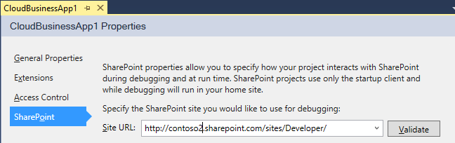

# 建立的雲端商務增益集
使用 Visual Studio 中的雲端商務增益集範本，您可以新增和管理資料最佳化的 Office 365 上建立 SharePoint 增益集 2013年或 SharePoint。
> **注意事項**
> 您也可以使用增益集的 SharePoint 2013 範本建置SharePoint Add-in 。
  
    
    

### 若要建立的雲端商務增益集

1. 功能表列上，選擇 [ **檔案**、 **新增**、 **專案**]。
    
    [新增專案] 對話方塊隨即開啟。
    
  
2. 在範本清單中，展開 [ **Visual Basic**或 **Visual C#** ] 節點、 展開 [ **Office/SharePoint** ] 節點、 選擇 [ **增益集**] 節點，然後選擇 **雲端商務增益集**，如圖 1 所示。
    
   **圖 1。雲端商務增益集範本**

  

     
  

  

  
3. 在 [ **名稱**] 文字方塊中輸入您的專案的名稱，然後選擇 [ **確定**] 按鈕。
    
    **新的雲端商務增益集**精靈] 隨即開啟。
    
  
4. 在 [ **新的雲端商務增益集**精靈] 中輸入網站 URL SharePoint server 或 Office 365 開發人員網站圖 2 所示，然後選擇 [ **完成**] 按鈕。
    
   **圖 2。SharePoint URL**

  

     
  

    URL 應該採取表單 https://  _MySite_.sharepoint.com/sites/Developer/。
    
    新的解決方案與四個專案新增至 [方案總管: 最上層的專案、 **HTMLClient**專案、 **Server**專案及 **SharePoint**專案。
    
  

### 若要變更的雲端商務增益集的網站

1. 在 **方案總管**] 中開啟專案的最上層節點的快顯功能表並選擇 **屬性**，如圖 3 所示。
    
   **圖 3。Project 最上層節點**

  

     
  

    在應用程式的設計工具會隨即開啟。
    
  
2. 在應用程式的設計工具中，選擇 [ **SharePoint** ] 索引標籤圖 4 所示。
    
   **圖 4。[SharePoint] 索引標籤**

  

     
  

  

  
3. 在 [ **網站 URL** ] 清單中選擇現有的 URL 或輸入您的 SharePoint server 或 Office 365 開發人員網站的網站 URL。
    
  
4. 選擇 [ **驗證**] 按鈕，以確認 URL。
    
  

## 其他資源

-  [開發雲端商務增益集](develop-cloud-business-add-ins.md)
    
  
-  [建立雲端商務增益集](create-cloud-business-add-ins.md)
    
  

