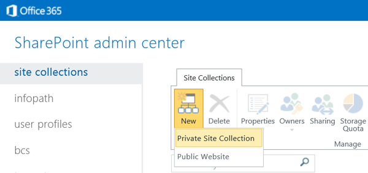

# 建立現有的 Office 365 訂閱開發人員網站
Office 365 開發人員網站讓您更容易取得設定並開始建立、 測試及部署您Office 與 SharePoint 增益集更快速。許多Office 365 Business、 Enterprise、 教育和 Government 訂閱包含可用來建立開發人員網站網站範本。
 **開始之前**
  
    
    

- **請確定您有支援開發人員網站Office 365訂閱。** 如果您有一個Office 365訂閱方案，您可以建立開發人員網站您現有的訂閱內：
    

  
    
    
> Office 365 中型企業版
    
  

  
    
    
> Office 365企業版 E1、 E3、 E4、 E5 或 K1
    
  

  
    
    
> Office 365 Education A2、A3 或 A4
    
  

  
    
    
> Office 365 Government G1、G3、G4 或 K1
    
  
- **如果您有 Office 365 Small Business 訂閱，** 則支援只有單一網站集合，所以您無法建立開發人員網站集合。如果您想要深入了解您的企業的 Office 365 計劃，請參閱 [SharePoint Online： 軟體界限和限制](http://office.microsoft.com/en-us/office365-sharepoint-online-enterprise-help/sharepoint-online-software-boundaries-and-limits-HA102694293.aspx)。
    
  
- 如需 Office 365 企業版方案的詳細資訊，請參閱 ＜ [計劃與價格](http://products.office.com/en-us/business/office-365-enterprise-e1-business-software )。
    
  

## 建立開發人員網站

1. 登入Office 365為通用或 SharePoint Online 管理]。
    
    **您必須登入身為通用或 SharePoint Online 管理員建立新的網站集合，**例如開發人員網站。只有系統管理員可以看到系統選項登入 Office 365 時。如果您不是系統管理員，連絡公司內的系統管理員與擁有其執行下列其中一項：
    
  - 授與您系統權限，因此您可以自行建立開發人員網站 。
    
  
  - 建立開發人員網站您，並指定您身為網站集合管理員。
    
  
2. 按一下上方導覽列的最左側 App 啟動器] 按鈕。
    
  
3. 按一下 [ **系統**] 磚。
    
  
4. 在左側導覽樹狀目錄中，依序展開 [ **系統**]，然後選取 [ **SharePoint**。
    
  
5. 在 **SharePoint 系統管理中心** ，在 [ **網站集合** ] 索引標籤上按一下 [ **新增 > 私用網站集合** 。
    
     
  

  

  
6. 在 [ **新的網站集合** ] 對話方塊中，提供開發人員網站的相關資訊。
    
|||
|:-----|:-----|
|**Title**   |您想要授與開發人員網站名稱。   |
|**公用網站通訊** 清單   |網域名稱及 URL 路徑 — **/sites/**或 **/teams/**— 然後輸入網站集合的 URL 名稱。   |
|在 [ **範本選擇** ] 區段中 **選取的語言** 清單   |若要使用開發人員網站的主要語言。   **請務必選取適當的語言開發人員網站網站集合，因為一旦您選擇它，就無法變更。**   選取語言開發人員網站 (英文) 不會影響您可以提供 Office 與 SharePoint 增益集的語言。   您可以啟用 SharePoint 網站、 多個語言介面但網站集合的主要語言為您選擇以下其中一個。   |
|**範本選擇**] 區段中 **選取範本**] 下的 [ **共同作業**] 索引標籤   |選擇 [ **開發人員網站。**   |
|**時區**   |適用於開發人員網站的地區設定的時區。   |
|**管理員**   |您的網站集合管理員使用者名稱。   |
|**儲存配額**   |您想要此開發人員網站網站集合來配置的位元組 (MB) 的數目。   |
|**伺服器資源配額**   |配置給網站集合的資源數量。   此數字是有關沙箱化解決方案中的程式碼 (例如處理器時間及未處理的例外狀況) 的效能評量的組合。當 level 超過每日配額時，沙箱會關閉此網站集合。   |
   
7. 按一下 [確定]。
    
    您會看見 [ **網站集合**] 清單中的新開發人員網站 URL。當完成建立網站時，您可以瀏覽至要開啟 [開發人員網站的 URL。
    
     
  

  

  

## 其他資源

-  [SharePoint Add-ins](sharepoint-add-ins.md)
    
  
-  [建立或刪除網站集合](http://office.microsoft.com/en-us/office365-sharepoint-online-enterprise-help/create-or-delete-a-site-collection-HA102772354.aspx?CTT=1)
    
  

