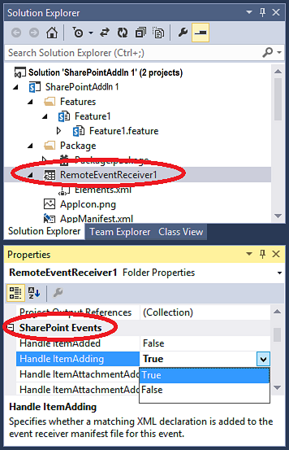

# 在 SharePoint 增益集建立的遠端事件接收器
建立清單和清單項目事件SharePoint Add-in中的會處理的遠端事件接收器 (RER)。
## 必要條件
<a name="SP15appevent_prereq"> </a>

如果您先了解提供者主控SharePoint Add-ins，以及您已經開發幾個的移最少很有幫助超過"Hello World"層級。此外，您應該先熟悉 [處理事件中 SharePoint 增益集](handle-events-in-sharepoint-add-ins.md)。
  
    
    

## 建立的遠端事件接收器
<a name="MakeRER"> </a>

本文說明如何新增處理 itemadded 增益集 web 中的自訂清單的遠端事件接收器 (RER) 擴充SharePoint Add-in 。使用宣告式標記增益集 web 登錄 RER。RERs 並登錄 *主機網頁*  以程式設計方式。沒有能力的程式碼範例，請參閱 [OfficeDev/PnP/Samples/Core.EventReceivers](https://github.com/OfficeDev/PnP/tree/master/Samples/Core.EventReceivers)。
  
    
    
RER 必須 SOAP web 服務。延續範例實作此以 Windows Communication Foundation (WCF) 服務 ；但有可能在非 Microsoft 堆疊實作 RER 這當中中。
  
    
    
若要遵循本文以及並輸入自己的程式碼，從 [SharePoint-增益集在-CSOM-BasicDataOperations](https://github.com/OfficeDev/SharePoint-Add-in-CSOM-BasicDataOperations)，下載範例，然後開啟樣本Visual Studio中。
  
    
    

> [!注意事項]
> 這則範例會使用Office Developer Tools for Visual Studio所產生的 TokenHelper.cs 檔案。 本範例建立，但可能會在當您閱讀這不是最新版本，與其目前的版本。此範例是建立您第一個 RER 仍更好。但是當您準備好要移動以外的您應該查看以下 [下一步] 區段中所列的範例。他們是很可能會保持在最新。
  
    
    


### 若要註冊的遠端事件接收器


1. SharePoint Add-in中開啟專案Visual Studio。
    
  
2. 在 **方案總管**] 中選擇 [增益集專案的節點。
    
  
3. 功能表列上，選擇 [ **專案**、 **新增項目**]。
    
  
4. 在 **已安裝的範本**] 窗格中，選擇 [ **Office / SharePoint**節點。
    
  
5. 在 [ **範本**] 窗格中選擇的 **遠端事件接收器**範本。
    
  
6. 在 [ **名稱**] 方塊中保留預設名稱 (RemoteEventReceiver1)，然後按 [ **新增**] 按鈕。
    
  
7. 在 **您需要何種類型的事件接收器?**清單中，選擇 **清單項目事件**。
    
  
8. 在 **項目應為事件來源?**清單中，選擇 [ **自訂清單**。
    
    持續的範例會使用自訂的泛型清單。但是 RER 也可以處理事件發生在標準的 SharePoint 清單，例如 **宣告**或 **連絡人**。
    
  
9. 在 **處理下列事件**] 清單中，選擇 [ **新增項目**，並再選擇 [ **完成**] 按鈕。
    
    Web 服務會新增至 web 應用程式來處理所指定的遠端事件。遠端事件接收器新增至SharePoint Add-in和清單項目事件參照是本身的增益集 web 功能中所包含的受話方的 Elements.xml 檔案中。
    
  

### 若要建立清單


1. **方案總管**中選取增益集專案的節點。
    
  
2. 功能表列上，選擇 [ **專案**、 **新增項目**]。
    
  
3. 在 **已安裝的範本**] 窗格中，選擇 [ **Office SharePoint** ] 節點。
    
  
4. 在 [ **範本**] 窗格中選擇的 **清單**範本。
    
  
5. 在 [ **名稱**] 方塊中保留預設名稱 (清單 1)，然後按 [ **新增**] 按鈕。
    
  
6. 選擇 [ **建立清單執行個體根據現有的清單範本**] 選項按鈕、 [] 清單中選擇 **自訂清單**，然後選擇 [ **完成**] 按鈕。
    
  

### 將功能新增至遠端事件接收器


1. 如果您的測試 SharePoint 伺服器陣列未出現在同一部電腦執行Visual Studio、 (或您為測試 SharePoint 網站使用SharePoint Online租用) 設定偵錯使用Microsoft Azure服務匯流排的專案。如需詳細資訊，請參閱 [偵錯及疑難排解中的 SharePoint 增益集的遠端事件接收器](debug-and-troubleshoot-a-remote-event-receiver-in-a-sharepoint-add-in.md)。
    
  
2. 在程式碼檔案中的遠端事件接收器 (亦即 RemoteEventReceiver1.svc.cs) 服務，取代下列程式碼中的內容。
    
    這段程式碼會執行下列工作。
    
  - 取得有效的用戶端快顯物件。
    
  
  - 如果已命名 **EventLog**清單尚未存在，會建立一個包含遠端所發生之事件的名稱。
    
  
  - 將項目新增至事件，包括時間及日期戳記的清單。
    
  

    > [!注意事項]
      > 本文撰寫次Office Developer Tools for Visual Studio接收者會建立，但可能不會更新版本的工具時新增所需的組件的參照。如果您收到編譯器錯誤，只要加入遺失的參考;例如，您可能需要新增 System.ServiceModel 或 System.ComponentModel.DataAnnotations 參照。


  ```cs
  
using System;
using System.Collections.Generic;
using System.Linq;
using System.Net;
using System.Text;
using Microsoft.SharePoint.Client;
using Microsoft.SharePoint.Client.EventReceivers;
using System.Runtime.Serialization;
using System.ServiceModel;
using System.ServiceModel.Channels;


namespace BasicDataOperationsWeb.Services
{
    public class RemoteEventReceiver1 : IRemoteEventService
    {
        public SPRemoteEventResult ProcessEvent(SPRemoteEventProperties properties)
        {
            // When a "before" event occurs (such as ItemAdding), call the event 
            // receiver code.
            ListRemoteEventReceiver(properties);
            return new SPRemoteEventResult();
        }

        public void ProcessOneWayEvent(SPRemoteEventProperties properties)
        {
            // When an "after" event occurs (such as ItemAdded), call the event 
            // receiver code.            
        }

        public static void ListRemoteEventReceiver(SPRemoteEventProperties properties)
        {
            string logListTitle = "EventLog";

            // Return if the event is from the EventLog list itself. Otherwise, it may go into
            // an infinite loop.
            if (string.Equals(properties.ItemEventProperties.ListTitle, logListTitle, 
                  StringComparison.OrdinalIgnoreCase))
                return;

            // Get the token from the request header.
            HttpRequestMessageProperty requestProperty = 
                  (HttpRequestMessageProperty)OperationContext
                   .Current.IncomingMessageProperties[HttpRequestMessageProperty.Name];
            string contextTokenString = requestProperty.Headers["X-SP-ContextToken"];

            // If there is a valid token, continue.
            if (contextTokenString != null)
            {
                SharePointContextToken contextToken =
                    TokenHelper.ReadAndValidateContextToken(contextTokenString, 
                         requestProperty.Headers[HttpRequestHeader.Host]);

                Uri sharepointUrl = new Uri(properties.ItemEventProperties.WebUrl);
                string accessToken = TokenHelper.GetAccessToken(contextToken, 
                                                      sharepointUrl.Authority).AccessToken;
                bool exists = false;

                // Retrieve the log list "EventLog" and add the name of the event that occurred
                // to it with a date/time stamp.
                using (ClientContext clientContext = 
                     TokenHelper.GetClientContextWithAccessToken(sharepointUrl.ToString(), 
                                                                                                         accessToken))
                {
                    clientContext.Load(clientContext.Web);
                    clientContext.ExecuteQuery();
                    List logList = clientContext.Web.Lists.GetByTitle(logListTitle);

                    try
                    {
                        clientContext.Load(logList);
                        clientContext.ExecuteQuery();
                        exists = true;
                    }

                    catch (Microsoft.SharePoint.Client.ServerUnauthorizedAccessException)
                    {
                        // If the user doesn't have permissions to access the server that's 
                        // running SharePoint, return.
                        return;
                    }

                    catch (Microsoft.SharePoint.Client.ServerException)
                    {
                        // If an error occurs on the server that's running SharePoint, return.
                        exists = false;
                    }

                    // Create a log list called "EventLog" if it doesn't already exist.
                    if (!exists)
                    {
                        ListCreationInformation listInfo = new ListCreationInformation();
                        listInfo.Title = logListTitle;
                        // Create a generic custom list.
                        listInfo.TemplateType = 100;
                        clientContext.Web.Lists.Add(listInfo);
                        clientContext.Web.Context.ExecuteQuery();
                    }

                    // Add the event entry to the EventLog list.
                    string itemTitle = "Event: " + properties.EventType.ToString() + 
                          " occurred on: " + 
                          DateTime.Now.ToString(" yyyy/MM/dd/HH:mm:ss:fffffff");
                    ListCollection lists = clientContext.Web.Lists;
                    List selectedList = lists.GetByTitle(logListTitle);
                    clientContext.Load<ListCollection>(lists);
                    clientContext.Load<List>(selectedList);
                    ListItemCreationInformation listItemCreationInfo = 
                          new ListItemCreationInformation();
                    var listItem = selectedList.AddItem(listItemCreationInfo);
                    listItem["Title"] = itemTitle;
                    listItem.Update();
                    clientContext.ExecuteQuery();
                }
            }
        }
    }
}
  ```

3. 在 Home.aspx.cs、 變更所有執行個體 `SPHostUrl`至 `SPAppWebUrl`。
    
    例如，  `sharepointUrl = new Uri(Request.QueryString["SPHostUrl"]);`應該變更為 `sharepointUrl = new Uri(Request.QueryString["SPAppWebUrl"]);`。
    
  

## 執行及測試的事件處理常式
<a name="RunAndTest"> </a>

測試您的處理常式使用下列程序。
  
    
    

1. 按 **F5**鍵來執行專案。
    
  
2. 信任的增益集來達成出現提示時。
    
    您SharePoint Add-in執行和可用清單的表格會出現，並包含 **清單 1**。
    
  
3. 選擇 [ **清單 1**的識別碼。
    
    **擷取清單項目**] 方塊會複製該 ID。
    
  
4. 選擇 **擷取清單項目**] 按鈕。
    
    **清單 1**會不出現在它的任何項目。
    
  
5. 在 [ **新增項目**] 方塊中，指定第一個項目，並再選擇 [ **新增項目**] 按鈕。
    
    清單項目已命名的 **第一個項目**新增至 **清單 1**，如此會使遠端事件接收器引發並將項目新增至事件記錄檔清單。
    
  
6. 選擇 [ **重新整理清單**] 按鈕以返回清單的表格。
    
    在表格中，已命名 **EventLog**新清單隨即顯示。
    
  
7. 選擇 **EventLog**、 **ListID** GUID 值，然後選擇 [ **擷取清單項目**] 按鈕。
    
    **事件記錄檔**的表格會出現在項目加入 **清單 1**時所發生之 **處理 ItemAdding**事件的項目。
    
  

## 新增或移除使用 Visual Studio 的事件處理常式
<a name="Handle"> </a>


1. 在 **方案總管**] 中選擇 [專案] 節點的遠端事件接收器。
    
  
2. 在 [ **內容**] 窗格中，設定您想要以 **True**處理事件的屬性。
    
    例如，如果您想要回應每當使用者會新增清單項目、 設 **處理 ItemAdding**屬性的值為 **True**。如果您不想處理該事件，請至 **False**設定該屬性的值。
    

   **圖 1。SharePoint Visual Studio 中的遠端事件**

  

     
  

  

  
3. 如果您已新增事件，新增事件處理程式碼程式碼檔案中的 web 服務如同與先前的事件。
    
    若要處理不同類型的事件，新增SharePoint Add-in另一個遠端事件接收器。例如，如果的遠端事件接收器處理清單項目事件，您可以新增其他的清單項目事件給它。但是您必須新增其他的遠端事件接收器如果您想要處理清單事件。
    
  

## URL 及主控的實際執行的遠端事件接收器限制
<a name="Handle"> </a>

遠端事件接收器可以裝載在雲端或未也使用為 SharePoint server 的內部伺服器。實際執行收件者的 URL 不能指定特定的連接埠。這表示您必須使用其中一個連接埠 443 HTTPS，我們建議，或連接埠 80 http。 如果您使用 HTTPS，而接收者服務裝載內部部署，但增益集位於Microsoft SharePoint Online，然後裝載伺服器必須具備公開信任的憑證從憑證授權單位。(只有當增益集是內部部署 SharePoint 伺服器陣列中運作方式的自我簽署的憑證)。
  
    
    

## 後續步驟
<a name="Handle"> </a>

使用下列程式碼範例來改善 RERs 您了解：
  
    
    

-  [OfficeDev/PnP/Samples/Core.EventReceivers](https://github.com/OfficeDev/PnP/tree/master/Samples/Core.EventReceivers)
    
  
-  [OfficeDev/PnP/Samples/Provisioning.ReR](
https://github.com/OfficeDev/PnP/tree/master/Samples/Provisioning.ReR)
    
  
-  [OfficeDev/PnP/Scenarios/ECM.AutoTagging](https://github.com/OfficeDev/PnP/tree/master/Samples/ECM.AutoTagging)
    
  

## 其他資源
<a name="Additional"> </a>


-  [處理事件中 SharePoint 增益集](handle-events-in-sharepoint-add-ins.md)
    
  
-  [偵錯及疑難排解中的 SharePoint 增益集的遠端事件接收器](debug-and-troubleshoot-a-remote-event-receiver-in-a-sharepoint-add-in.md)
    
  
-  [常見問題集的遠端事件接收器](handle-events-in-sharepoint-add-ins.md#RERFAQ)
    
  

