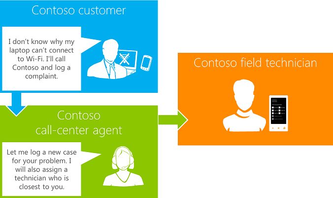

# 如何： 建立 sharepoint 的同一系列文件行動應用程式的應用程式
了解如何在SharePoint 2013中建立現有或新提供者主控應用程式隨附的行動裝置應用程式。
 * **適用於:*** 
  
    
    

 **本文內容**
  
    
    
 [SharePoint 的應用程式隨附的行動裝置應用程式的案例](#bkmk_scenariodetails)
  
    
    
 [建立隨附的行動裝置應用程式的步驟](#bkmk_stepsforcreatingapp)
  
    
    
 [建立 sharepoint 應用程式隨附的行動裝置應用程式的先決條件](#bkmk_prereq)
  
    
    
 [在本章節中](#bkmk_inthissection)
  
    
    
 [其他資源](#bk_addresources)
SharePoint 2013 introduces a Cloud App Model that enables you to createapps. Apps are self-contained pieces of functionality that extend the capabilities of a SharePoint website. Apps integrate the best of the web and SharePoint; they are targeted, lightweight, and easy to use, and they do a great job at solving a user need. Users discover and download apps from the Office Store or from their organization's private App Catalog and install them on their SharePoint sites. For more information, see  [建置 SharePoint 的應用程式](37727101-0692-4652-a481-e6d6379cf921.md).
  
    
    

In addition, SharePoint 2013 enables you to build mobile apps that travel with users, are interactive and attractive, and are available whenever and wherever users want to work with them. You can combine mobile apps with on-premises SharePoint services and applications, or with remote SharePoint services and applications that run in the cloud (such as those that use SharePoint Online) to create powerful applications that extend the functionality beyond the traditional desktop or laptop, and into a truly portable and much more accessible environment. For more information, see  [建置存取 SharePoint 2013 的 Windows Phone 應用程式](http://msdn.microsoft.com/library/36681335-f772-4499-8445-f94481bc18e7%28Office.15%29.aspx).在一起，雲端應用程式模型與SharePoint 2013中的行動應用程式支援提供您的 SharePoint 和其隨附的行動應用程式建立的應用程式吸引人有機會。在本系列文章中，您將會查看 for SharePoint and 及其隨附的 Windows Phone 7 應用程式建立應用程式。SharePoint 2013 provides two Visual Studio templates for creating Windows Phone apps for SharePoint. You can get the templates by downloading the  [Microsoft SharePoint SDK for Windows Phone 7.1](http://www.microsoft.com/en-us/download/details.aspx?id=30476). For more information about the Windows Phone SharePoint list application templates, see  [Visual Studio 中的 Windows Phone SharePoint 2013 應用程式範本的概觀 (英文)](http://msdn.microsoft.com/library/6ae27957-fa41-4e6f-92e3-db11dae1f6c2%28Office.15%29.aspx). For SharePoint list-based apps, you can use the list template, or you can use the Windows Phone Empty SharePoint Application template to create a Windows Phone app for SharePoint from scratch. If you're creating a companion app on other platforms like Android or iOS, you can use REST endpoints to access SharePoint data. For more information, see  [建置使用 SharePoint 2013 其他平台的行動應用程式](http://msdn.microsoft.com/library/017df869-44fb-4ffe-82fb-4654e01329ad%28Office.15%29.aspx).
## SharePoint 的應用程式隨附的行動裝置應用程式的案例

此為一組的用法文章，您建立應用程式的 SharePoint 和及其隨附的 Windows Phone 應用程式所使用的 Windows Phone SharePoint 清單應用程式範本
  
    
    
在此程序，涵蓋供和支援中心的案例。客戶支援專員可新增客戶要求使用 SharePoint ； 客戶支援應用程式供使用行動裝置應用程式，以接收推入通知，以及存取指派給他們，所有情況下，如圖 1 所示。
  
    
    

**圖 1。SharePoint 的隨附的行動應用程式的案例**

  
    
    

  
    
    

  
    
    

  
    
    

  
    
    

## 建立隨附的行動裝置應用程式的步驟

此程序包含下列三個步驟：
  
    
    

-  [步驟 1： 在 SharePoint 2013 中建立一個清單為基礎提供者裝載應用程式](e79ee2e7-0a80-4858-a311-c4f1f8d72a56.md)
    
  
-  [步驟 2： 設定推入 SharePoint 在提供者裝載的應用程式中的通知](5abfda20-118b-42bc-bc51-65f6ff6f7010.md)
    
  
-  [步驟 3： 建立行動應用程式和登錄的推入通知](ca56ac7f-f7cf-4fab-b2b7-66abb814fac2.md)
    
  

## 建立 sharepoint 應用程式隨附的行動裝置應用程式的先決條件

您需要下列元件，才可完成此程序：
  
    
    

- Visual Studio 2012 Office 開發人員工具
    
  
- Visual Studio 2012
    
  
- Office 365帳戶。
    
    For more information about how to set up an Office 365 account, see  [在 Office 365 上設定 SharePoint 增益集的開發環境](b22ce52a-ae9e-4831-9b68-c9210af6dc54.md). For more information about Office 365 development, see  [在 Office 365 上設定 SharePoint 增益集的開發環境](b22ce52a-ae9e-4831-9b68-c9210af6dc54.md).
    
  
- Visual Studio Express 2010 與Microsoft SharePoint SDK for Windows Phone 7.1http://www.microsoft.com/en-us/download/details.aspx?id=30476 
    
  

### 了解 sharepoint 建立隨附的行動裝置應用程式的應用程式的核心概念

下列文章提供背景及其他資訊可協助您了解 SharePoint 及行動應用程式的應用程式。
  
    
    

**表 1。核心概念**

|**文章標題**|**描述**|
|:-----|:-----|
| [開始開發 SharePoint 應用程式](d07e0a13-1e74-4128-857a-513dedbfef33.md)   |取得熟悉 SharePoint 相關應用程式，以顯示您的應用程式可以執行的作業，範例的資源設定開發環境中，資訊開發的更進階及野心勃勃種 apps for SharePoint。   |
| [建置存取 SharePoint 2013 的 Windows Phone 應用程式](http://msdn.microsoft.com/library/36681335-f772-4499-8445-f94481bc18e7%28Office.15%29.aspx)   |了解如何建立整合SharePoint 2013和行動裝置，例如 Windows Phone 的 SharePoint 應用程式。   |
| [Visual Studio 中的 Windows Phone SharePoint 2013 應用程式範本的概觀 (英文)](http://msdn.microsoft.com/library/6ae27957-fa41-4e6f-92e3-db11dae1f6c2%28Office.15%29.aspx)   |了解 Windows Phone SharePoint 軟體開發套件 (英文) 行動裝置應用程式開發安裝Visual Studio範本。   |
| [操作方法： 設定及在 SharePoint 2013 應用程式中使用 Windows Phone 推入通知](http://msdn.microsoft.com/library/68fa2138-86d9-4e35-9c7c-5cd292087b80%28Office.15%29.aspx)   |了解如何在 SharePoint Server 中建立的解決方案傳送推入通知及開發接收通知的 Windows Phone 應用程式。   |
   

## 在本章節中

若要建立 SharePoint 隨附的行動裝置應用程式，請參閱 ＜ 表格 2 中所列的文章。
  
    
    

**表 2。建立 sharepoint 應用程式隨附的行動裝置應用程式的步驟**

|**步驟**|**描述**|
|:-----|:-----|
| [步驟 1： 在 SharePoint 2013 中建立一個清單為基礎提供者裝載應用程式](e79ee2e7-0a80-4858-a311-c4f1f8d72a56.md)   |使用Visual Studio 2012 Office 開發人員工具建立基本提供者主控SharePoint Add-inSharePoint 2013中, 已導入的地理位置欄位 (以位置為主欄)，並啟用SharePoint Add-in中的推入通知。   |
| [步驟 2： 設定推入 SharePoint 在提供者裝載的應用程式中的通知](5abfda20-118b-42bc-bc51-65f6ff6f7010.md)   |建立提供者主控SharePoint Add-ins使用的遠端事件接收器的推入通知。   |
| [步驟 3： 建立行動應用程式和登錄的推入通知](ca56ac7f-f7cf-4fab-b2b7-66abb814fac2.md)   |建立SharePoint Add-in隨附的行動裝置應用程式並設定它的推入通知。   |
   

## 其他資源

-  [SharePoint Add-ins](cd1eda9e-8e54-4223-93a9-a6ea0d18df70.md)
    
  
-  [註冊 Office 365 開發人員帳戶](dfe001bd-50fc-4031-be50-853a85cd238f.md)
    
  
-  [Windows Phone 7.1 sdk (英文)](http://www.microsoft.com/en-us/download/details.aspx?id=27570)
    
  
-  [Microsoft SharePoint SDK for Windows Phone 7.1](http://www.microsoft.com/en-us/download/details.aspx?id=30476)
    
  
-  [在 SharePoint 2013 中的程式撰寫模型](http://msdn.microsoft.com/library/061985ec-6129-4e91-991b-a72488ce1d34%28Office.15%29.aspx)
    
  
-  [建置存取 SharePoint 2013 的 Windows Phone 應用程式](http://msdn.microsoft.com/library/36681335-f772-4499-8445-f94481bc18e7%28Office.15%29.aspx)
    
  
-  [操作方法： 設定及在 SharePoint 2013 應用程式中使用 Windows Phone 推入通知](http://msdn.microsoft.com/library/68fa2138-86d9-4e35-9c7c-5cd292087b80%28Office.15%29.aspx)
    
  
-  [整合在 SharePoint 2013 中的位置和對應功能](http://msdn.microsoft.com/library/10d4a904-ed27-4513-8c20-d2098aebf22c%28Office.15%29.aspx)
    
  
