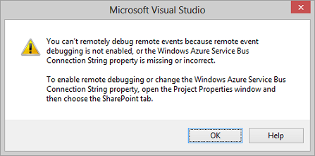

# 偵錯及疑難排解中的 SharePoint 增益集的遠端事件接收器
設定開發環境來使用 Visual Studio 偵錯中的遠端事件。
## 設定偵錯的遠端 SharePoint 測試網站

> **注意事項**
> 本節中的程序適用於測試 SharePoint 網站是從Visual Studio不同的電腦上或您測試網站使用SharePoint Online開發人員網站時，才。如果 SharePoint 和Visual Studio在同一部電腦上，略過這一節。
  
    
    

當SharePoint Add-in專案Visual Studio中包含的遠端事件接收器 (RER) 或增益集事件接收器時，您必須之前您可以進行偵錯增益集 (F5) 以進行一些其他的快速設定專案屬性中。此組態中，接著，需要您一些 Azure 的設定。您沒有重複 Azure 組態的每個專案的 RER 或增益集事件。 (如果增益集包括 AppInstalled 事件處理常式，增益集將不會甚至是執行與 f5 鍵或 Ctrl F5 [執行而不偵錯] 除非您執行本節中的設定)。
  
    
    

### 若要設定 Azure

1. 如果您已經沒有一個，取得Microsoft Azure訂閱。其中已包含為與 [MSDN 訂閱](http://azure.microsoft.com/en-us/pricing/member-offers/msdn-benefits/)的好處。
    
  
2. 執行 [How To: Create or Modify a Service Bus Service Namespace](http://msdn.microsoft.com/library/fa561f70-007c-45aa-b34d-56317dbbfc87.aspx)中的指示。
    
  

### 若要在 Visual Studio 中設定 SharePoint 增益集專案

1. 您應該會有Visual Studio 2013 Office 開發人員工具、 如此 [執行 WebPI 安裝程式](http://aka.ms/OfficeDevToolsForVS2013)或 [安裝程式對 Office 開發人員工具的 Visual Studio 2015](http://aka.ms/OfficeDevToolsForVS2015)的最新版本。
    
  
2. 您將 RER 或增益集事件處理常式新增至Visual StudioSharePoint Add-in專案之後，以滑鼠右鍵按一下 [ **方案總管**中的專案並選取 [ **內容**]。
    
  
3. 在 [內容] 窗格中，開啟 **SharePoint** ] 索引標籤和捲軸底部。
    
  
4. 選取此核取方塊 [ **啟用透過 Microsoft Azure 服務匯流排偵錯**。
    
  
5. 在所提供的文字方塊中輸入完整的連線字串。您取得進行這些步驟的字串。
    
1. Azure 入口網站登入並開啟 [ **服務匯流排**] 索引標籤。
    
  
2. 開啟您建立用於 RER 偵錯的命名空間，並瀏覽至 [連接字串。Azure 入口網站 UI 經常變更。如果您找不到連接字串，請參閱 [Azure 入口網站說明](https://msdn.microsoft.com/en-us/library/azure/dn578292.aspx) 。
    
  
3. 複製 **SAS**連接字串。這是您輸入Visual Studio專案屬性中的字串。
    
  
未來，當您建立Visual StudioSharePoint Add-in專案，這項資訊會預先填入，所以您不需要每次開啟 Azure 入口網站。
## 測試組態

使用本節中的程序確認您可以偵錯 RER。
  
    
    

### 若要建立的遠端事件接收器專案

1. Visual Studio 中建立提供者主控SharePoint Add-in。
    
    請參閱 [開始建立提供者主控 SharePoint 增益集](get-started-creating-provider-hosted-sharepoint-add-ins.md)。
    
  
2. 在 **方案總管**] 中選擇 [增益集專案的節點。
    
  
3. 功能表列上，選擇 [ **專案**、 **新增項目**]。
    
  
4. 在 [ **範本**] 窗格中，選擇 [ **清單**] 範本，然後選擇 [ **新增**] 按鈕。
    
  
5. 選擇 [ **完成**] 按鈕以將預設自訂清單新增至增益集專案。
    
  
6. 將另一個項目新增至增益集專案由該指令程式在 [ **範本**] 窗格中，選擇 [ **遠端事件接收器**範本。
    
  
7. 在 [ **名稱**] 方塊中保留預設名稱 (RemoteEventReceiver1)，然後按 [ **新增**] 按鈕。
    
  
8. 在 **您需要何種類型的事件接收器?**清單中，選擇 **清單項目事件**。
    
    事件來源保留 **清單 1**，您在先前步驟中新增的清單。
    
  
9. 在 **處理下列事件**] 清單中，選擇 [ **新增項目**，並再選擇 [ **完成**] 按鈕。
    
    Web 服務會新增至 web 應用程式來處理所指定的遠端事件。遠端事件接收器新增到SharePoint Add-in。受話方參考之 web 服務和事件接收器的 Elements.xml 檔案中的清單項目事件。
    
  
10. 在增益集專案中，開啟 AppManifest.xml。
    
  
11. 變更為清單] 頁面上的 [開始] 頁面上：  _AddInProjectName_/Lists/List1。
    
     _AddInProjectName_取代為您增益集專案名稱，例如清單 1 SharePointAddIn4/清單。此範例中，我們正在設定清單] 頁面上的 [開始] 頁面。不過，一般增益集，您都有可能點自己專案網頁上的 UI。
    
  

### 若要執行及測試事件處理常式偵錯

1. 如果您尚未這麼做，完成 **設定 Visual Studio SharePoint 增益集專案** 中的程序稍早本文。
    
  
2. 在 web 專案中，開啟遠端事件接收器服務 (RemoteEventReceiver1.svc)，然後再新增中斷點至任何程式碼內的 `ProcessEvent()`方法。
    
  
3. 選擇 [ **F5**鍵以執行專案。
    
  
4. 選擇 [ **+ 新項目**] 按鈕新增至清單的項目。
    
  
5. 項目提供標題，然後選擇 [ **儲存**] 按鈕。
    
    您加入至遠端事件接收器中斷點，確認您正在偵錯遠端事件接收器。
    
  
6. 選擇 [ **F5**鍵以繼續執行專案，然後停止 [偵錯完成時。
    
  

## 開啟開/關通知從 Visual Studio 偵錯必須設定該事件

如果您已將專案中的遠端事件，尚未設定遠端事件偵錯Visual Studio會提示您設定偵錯 (請參閱圖 1) 的遠端事件。您可以變更此行為清除 **通知我尚未設定遠端事件偵錯** ] 核取方塊 [ **SharePoint** ] 索引標籤。
  
    
    

**圖 1。遠端事件偵錯通知**

  
    
    

  
    
    

  
    
    

  
    
    

  
    
    

## 確認您的服務會裝載於服務匯流排

按 F5 和信任的增益集之後，移至 [在瀏覽器; 服務匯流排命名空間例如 http://mynamespace.servicebus.windows.net，而且您應該會看到您列為數字的端點。圖 2 顯示頁面外觀命名空間時 *未*  列出;也就是按 F5 之前。
  
    
    

**圖 2。瀏覽至服務匯流排命名空間**

  
    
    

  
    
    

  
    
    

  
    
    

  
    
    

## RER 不叫用中斷點

根據事件的遠端事件可能會是同步或非同步。可能需要幾秒或其他非同步是否會叫用中斷點。
  
    
    

## 錯誤： 「 有無端點聆聽"

當您處理常式會執行在生產環境中，您會收到下列錯誤：
  
    
    
「 失敗的遠端事件接收器圖說文字。詳細資料： 有聆聽 https:// _{domain}_在沒有端點： _nnnnn_/ _{path}_/AppEventReceiver.svc 無法接受郵件。這是通常所造成的不正確地址或 SOAP 巨集指令。"  _nnnnn_所在的連接埠。
  
    
    
SharePoint 要求那里沒有明確的連接埠是在生產環境中的處理常式的 URL。這表示您必須使用其中一個連接埠 443 HTTPS，我們建議，或連接埠 80 http。
  
    
    

## 錯誤： 「 無法建立信任關係的授權 SSL/TLS 安全通道"

當您處理常式會執行在生產環境中，您會收到下列錯誤：
  
    
    
「 失敗的遠端事件接收器圖說文字。詳細資料： 無法建立信任關係的授權 SSL/TLS 安全通道 」
  
    
    
當增益集在Microsoft SharePoint Online，但是的遠端事件接收器服務內部，並建議您使用 HTTPS 時，裝載受話方的伺服器無法在生產環境中使用自我簽署的憑證。伺服器必須接受公開憑證從憑證授權單位。如果增益集是內部部署 SharePoint 伺服器陣列中，都可接受 [自我簽署的憑證。
  
    
    

## 其他資源

-  [處理事件中 SharePoint 增益集](handle-events-in-sharepoint-add-ins.md)
    
  
-  [偵錯 SharePoint 2013 使用 Visual Studio 2012 的遠端事件](http://blogs.msdn.com/b/officeapps/archive/2013/03/21/update-to-debugging-sharepoint-2013-remote-events-using-visual-studio-2012.aspx)
    
  

