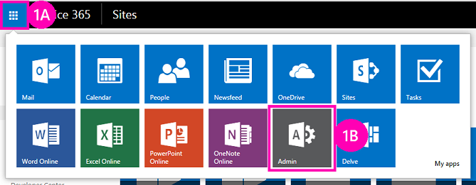

# 部署及安裝 SharePoint 主控 SharePoint 增益集
了解如何部署與安裝SharePoint Add-ins 。
這是一系列的開發 SharePoint 主控SharePoint Add-ins基本知識文章中的第二個。您應該先熟悉主題 [SharePoint Add-ins](sharepoint-add-ins.md)及以上的主題系列中：
  
    
    

-  [開始建立 SharePoint 主控 SharePoint 增益集](get-started-creating-sharepoint-hosted-sharepoint-add-ins.md)
    
  

> [!注意事項]
> 如果您有已使用透過這一系列有關 SharePoint 主控增益集，則您需要您可以使用以繼續執行本主題的Visual Studio解決方案。您也可以下載 [SharePoint_SP-hosted_Add-Ins_Tutorials](https://github.com/OfficeDev/SharePoint_SP-hosted_Add-Ins_Tutorials)在存放庫並開啟 BeforeColumns.sln 檔案。
  
    
    

您可找到更容易開發 SharePoint 主控SharePoint Add-ins如果您熟悉的使用者部署並安裝您的增益集的方式。如此，在本文中，我們將簡短休息從編碼建立和使用增益集目錄，並安裝您已在工作的增益集。
## 建立增益集類別目錄

  
    
    

1. 以管理員身分在Office 365訂閱的登入。選擇 [增益集啟動器] 圖示，然後按 **系統**中之增益集。
    
   **Office 365 增益集啟動器**

  

     
  

    
    
  
2. 在 **管理中心**中，依序展開 [工作窗格中的 [ **管理員**] 節點並再選擇 [ **SharePoint**。
    
  
3. 在 **SharePoint 系統管理中心**中，選擇 [ **增益集**] 工作窗格中。
    
  
4. 在 [ **增益集**] 頁面上選擇 [ **增益集型錄**。(如果已經訂閱中新增的類別目錄網站集合，它會開啟並已完成。您無法建立一個以上的增益集類別目錄訂閱中)。
    
  
5. 在 [ **增益集目錄網站**] 頁面上選擇 **[確定]**以接受預設選項並建立新的增益集目錄網站。
    
  
6. 在 [ **建立增益集目錄網站集合**] 對話方塊中，指定您的增益集目錄網站的標題] 和 [網站位址。我們建議您在 [標題] 和 [使其成為安全易記和分辨在 **SharePoint 管理中心**URL 包含"catalog"。
    
  
7. 指定 **的時區**並將您自己設為 **系統管理員**。
    
  
8. 設為最低的可能值的 **儲存配額**(目前 110，但可能會變更)，因為您上傳到此網站集合的增益集套件會極小。
    
  
9. 將 **伺服器資源配額**設定為 0 (零)，並再選擇 **[確定]**。(與伺服器資源配額相關節流不良執行沙箱化解決方案，但您將不會在您的增益集目錄網站上安裝任何沙箱化解決方案 )。
    
  
建立網站集合時，SharePoint 會引導您回復至 **SharePoint 系統管理中心**。在幾分鐘後您會看到已建立的集合。
## 增益集封裝並將其上傳至型錄

  
    
    

1. 開啟Visual Studio解決方案，然後再以滑鼠右鍵按一下 [ **方案總管**中的 [專案] 節點。選擇 [ **發佈**]。
    
  
2. 在 [ **發佈**] 窗格中，選擇 [ **增益集的套件**。增益集已封裝並儲存為 *.app 檔案的解決方案 \\bin\\debug\\web.publish\\1.0.0.0 資料夾中。
    
  
3. 在瀏覽器中開啟您的增益集目錄網站並選擇 **SharePoint Add-ins**導覽列中。
    
  
4. **SharePoint Add-ins**目錄為標準 SharePoint 資產庫。將增益集套件上傳至其使用任何一種方法的上傳檔案至 SharePoint 文件庫。
    
  

## 當使用者執行安裝的增益集

1. 瀏覽至 [ SharePoint Online訂閱的任何網站並開啟 [ **網站內容**] 頁面。
    
  
2. 選擇 [ **新增增益集**] 以開啟 [ **增益集**] 頁面。
    
  
3. 找出 **員工方向**增益集的 **增益集可以新增**] 區段中，按一下 [其並排顯示。
    
  
4. 選擇 [ **信任**在同意] 對話方塊。[ **網站內容**] 頁面會自動開啟及增益集已安裝的標記法會出現。它會在安裝之後，使用者可以選擇執行增益集並排顯示。
    
  

## 移除增益集

若要繼續進行強化Visual Studio相同SharePoint Add-in將移除增益集 (請參閱 [下一個步驟](#Nextsteps)) 進行這些步驟：
  
    
    

1. 在 [ **網站內容**] 頁面上移一段的增益集資料指標使圖說文字按鈕 **...**隨即顯示。
    
  
2. 選擇 [註標] 按鈕，並再選擇 [圖說文字中的 [ **移除**。
    
  
3. 瀏覽至 [增益集目錄網站並選擇 **SharePoint Add-ins**導覽列中。
    
  
4. 反白顯示的增益集選擇清單、 正上方的任務列上的 **管理**與然後選擇 [管理] 功能表上的 [ **刪除**。
    
  

## 

我們強烈建議您先繼續使用這一系列有關 SharePoint 主控的增益集之前，前往更進階的主題。收到來編碼 [將自訂欄新增至 SharePoint hostedSharePoint 增益集](add-custom-columns-to-a-sharepoint-hostedsharepoint-add-in.md)在下一步]。
  
    
    

