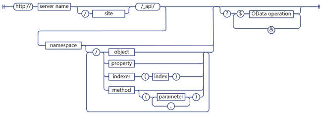

# 決定 SharePoint REST 服務端點 Uri
了解一般的指導方針來決定 SharePoint REST 端點 Uri 從對應的用戶端物件模型 Api 的簽章。
 **開始之前**
  
    
    


-  [若要了解 SharePoint 2013 REST 服務取得](get-to-know-the-sharepoint-2013-rest-service.md)
    
  
-  [瀏覽表示 REST 服務中的 SharePoint 資料結構](navigate-the-sharepoint-data-structure-represented-in-the-rest-service.md)
    
  

 **後續步驟**
  
    
    


-  [在 SharePoint 其餘邀請中使用 OData 查詢作業](use-odata-query-operations-in-sharepoint-rest-requests.md)
    
  

## SharePoint REST 端點 URI 結構

可存取使用 REST 服務的 SharePoint 資源之前，您必須先算出 URI 端點來指向該資源。盡可能這些 REST 端點 URI 密切模擬 SharePoint 用戶端物件模型中的資源之 API 簽章。例如：
  
    
    
 *用戶端物件模型的方法：* 
  
    
    
List.GetByTitle(listname).GetItems()
  
    
    
 *REST 端點：* 
  
    
    
 `http://server/site/_api/lists/getbytitle('listname')/items`
  
    
    
在某些情況下，但端點 URI 不同於對應的用戶端物件模型簽章，以符合 REST 或 OData 慣例。
  
    
    
下圖顯示 SharePoint REST Uri 的一般語法結構。
  
    
    

**SharePoint REST URI 語法結構**

  
    
    

  
    
    

  
    
    
此語法結構以外的 SharePoint 資源一些端點：
  
    
    

- 需要做為參數的複雜類型的方法。
    
    如果對應的用戶端物件模型方法需要複雜類型會傳遞為參數，以便 REST 限制的這個語法建構可能以外 REST 端點。
    
  
- 靜態的方法和屬性。
    
    REST 端點以外此語法結構之 Uri 的代表靜態方法和屬性。
    
  

## 決定SharePoint 2013 REST 服務端點

若要建構 SharePoint 資源 REST 端點，執行下列步驟：
  
    
    

1. 開始使用 REST 服務參考 （英文）：
    
     `http://server/site/_api`
    
  
2. 指定適當的進入點。例如：
    
     `http://server/site/_api/web`
    
  
3. 瀏覽的進入點至您想要存取之特定資源。這包括指定參數值會對應至用戶端物件模型中方法的端點。例如：
    
     `http://server/site/_api/web/lists/getbytitle('listname')`
    
  

### 在您的端點 URI SharePoint 2013 REST 服務參考 （英文)

使用 `_api`SharePoint 2013中 REST 服務您的端點 Uri。REST 服務是 client.svc web 服務的一部分。不過，以方便 REST URI 結構和縮短基底的其餘部分 URI 路徑、 REST 服務使用 `_api`抽象離開需要明確參照 client.svc web 服務。REST 服務仍可辨識並接受參考 client.svc web 服務的 Uri。例如，您可以使用 `http://server/site/_vti_bin/client.svc/web/lists`而不是 `http://server/site/_api/web/lists`。不過，使用 `_api`是慣用的慣例。Url 必須是 256 字元限制，因此會使用 `_api`縮短基底的 URI，離開多個字元用於建構 URL 的其餘部分。
  
    
    

### 指定SharePoint 2013 REST 服務的進入點

REST 服務的主要進入點會代表網站集合與網站的指定內容。如此一來，這些進入點會對應至 [ClientContext.Site](https://msdn.microsoft.com/library/Microsoft.SharePoint.Client.ClientContext.Site.aspx) 屬性及 [ClientContext.Web](https://msdn.microsoft.com/library/Microsoft.SharePoint.Client.ClientContext.Web.aspx) 的用戶端物件模型中的屬性。
  
    
    
若要存取特定網站集合，請使用下列情況下：
  
    
    
 `http://server/site/_api/site`
  
    
    
若要存取特定站台，請使用下列情況下：
  
    
    
 `http://server/site/_api/web`
  
    
    
其中 *伺服器*  代表伺服器的名稱與 *網站*  代表名稱，或以特定網站的路徑。
  
    
    
除了 `/site`和 `/web`，REST 服務包含數個其他啟用瀏覽至特定功能的開發人員的 access 點。下表列出一些這些存取點。
  
    
    


|**功能區**|**存取點**|
|:-----|:-----|
|網站 <br/> |http:// _server/site_/_api/網站 <br/> |
|網站 <br/> |http:// _server/site_/_api/網頁 <br/> |
|使用者設定檔 <br/> |http:// _server/site_/_api/SP.UserProfiles.PeopleManager <br/> |
|搜尋 <br/> |http:// _server/site_/_api/搜尋 <br/> |
   

### 瀏覽至您想要存取之特定資源

這裡建構更具體的 REST 端點 '從查閱 「 物件模型、 使用 Api 從用戶端物件模型的名稱隔開正斜線 （/）。下表顯示的用戶端物件模型呼叫範例與對等的 REST 端點。
  
    
    


|**用戶端物件模型 API**|**REST 端點**|
|:-----|:-----|
|ClientContext.Web.Lists <br/> |http:// _server_/ _site_/_api/web/lists <br/> |
|ClientContext.Web.Lists[guid] <br/> |http:// _server_/ _site_/_api/web/lists(' _guid_') <br/> |
|ClientContext.Web.Lists.GetByTitle("Title") <br/> |http:// _server_/ _site_/_api/web/lists/getbytitle(' _Title_') <br/> |
   
端點 Uri 是不區分大小寫。在上一個表格中，例如用於 `/getbytitle`指定 **GetByTitle()** 方法 REST 相等。
  
    
    

## REST 端點 Uri 中指定參數

SharePoint 2013延伸 OData 規格以讓您能夠使用括號內指定方法的參數和索引值。這可防止去除混淆的潛在問題 Uri 中包含多個具有相同名稱的參數。例如，下列兩種 Uri 包含具有相同名稱的參數：
  
    
    
 `http://server/site/_api/web/lists/getByTitle('Announcements')/fields/getByTitle('Description')`
  
    
    
 `http://server/site/_api/web/lists('<guid>')/fields/getById('<guid>')`
  
    
    
若要指定多個參數，包含當做名稱 / 值組，參數，且使用逗號分隔參數。例如：
  
    
    
 `http://server/site/_api/web/getAvailableWebTemplates(lcid=1033, includeCrossLanguage=true)`
  
    
    
下圖顯示 SharePoint REST 參數語法。
  
    
    

**SharePoint REST 參數語法**

  
    
    

  
    
    

  
    
    

### 做為參數 REST 服務複雜類型

用戶端物件模型中的某些方法會需要大型承載做為參數。維護功能同位及其對應的用戶端物件模型 api （英文） 與 REST 端點] 的端點必須以參數接受複雜類型。在下列情況下，REST 服務擴充現有的 OData 通訊協定以啟用接受做為參數的單一複雜類型這些 REST 端點。這適用於 **POST**作業只，且必須將傳遞 [Atom](http://www.odata.org/developers/protocols/atom-format#RepresentingComplexTypesProperties)格式或 [JSON](http://www.odata.org/developers/protocols/json-format#RepresentingComplexTypeProperties)格式中的複雜類型根據 OData 標準 （英文）。
  
    
    
例如，  [ListCollection.Add](https://msdn.microsoft.com/library/Microsoft.SharePoint.Client.ListCollection.Add.aspx) 方法會採用 [Microsoft.SharePoint.Client.ListCreationInformation](https://msdn.microsoft.com/library/Microsoft.SharePoint.Client.ListCreationInformation.aspx) 物件做為參數。若要將清單新增至指定的網站，如下建構適當的 REST 端點：
  
    
    
 `http://server/site/_api/web/lists/add`
  
    
    
然後，傳遞複雜類型要求本文中，使用 JSON 以下格式化。
  
    
    


```

{ "d" : {
   "results": {
     "__metadata": {
       "type": "SP.ListCreationInformation"
     }, 
     "CustomSchemaXml": "…large payload…/", 
     "Description": "desc", 
     "DocumentTemplateType": "1", 
     "TemplateType": "101", 
     "Title": "Announcements"
   }
} 
}

```


### 使用參數別名中呼叫 REST 服務

您可以使用 「 參數別名"語意中 OData 將參數傳遞至 SharePoint REST 端點。在參數別名參數值會識別與別名參數呼叫，和 URI 的查詢字串中指定的實際值。這可讓您以支援多個字元和使用的查詢字串的一致格式設定類型。
  
    
    
例如，下列兩個其他 Uri 是對等：
  
    
    
 *直接指定參數值：* 
  
    
    
 `http://server/site/_api/web/applyWebTemplate("STS#0")`
  
    
    
 *使用參數別名，並在 URI 的查詢字串中指定的實際參數值：* 
  
    
    
 `http://server/site/_api/web/applyWebTemplate(title=@template)?@template="STS#0"`
  
    
    
不過，SharePoint REST 服務不支援透過參數別名傳遞複雜的類型。例如，下列的 URI 包含參數別名的複雜類型，不支援：
  
    
    
 `http://server/site/_api/userProfiles/People(7)/GetWorkplace(@address)?@address={"__metadata":{"type: "ODataDemo.Address"},"Street":"NE 228th", "City":"Sammamish","State":"WA","ZipCode":"98074","Country": "USA"}`
  
    
    

**SharePoint REST service parameter aliasing syntax**

  
    
    

  
    
    

  
    
    

  
    
    

  
    
    

### 參數值為指定的字典

會對應至採取 `Dictionary<String, String>`字典做為參數的方法的 REST 端點，請傳遞字典為一系列的逗號分隔的查詢字串中成對的名稱和值。
  
    
    

**REST service syntax for Dictionary parameters**

  
    
    

  
    
    

  
    
    
 `Dictionary<String, object>`會以名稱 KeyedPropertyValue，為具有下列字串內容的多重值物件表示：
  
    
    

- **機碼** 多重值物件的索引鍵。
    
  
- **值** 物件的值
    
  
- **值鍵入** 值類型的物件。簡單的值對應至現有的實體資料模型 (EDM) 類型的類型、 REST 服務會傳回適當的 EDM 類型字串 ；例如，"Edm.String"。如果沒有，REST 服務會傳回值類型 **Type.ToString**函數所傳回。
    
  

### 查詢字串中指定的參數值

如果方法呼叫中終止 REST URI，您可以使用查詢字串語法來指定參數值的方法。例如：
  
    
    
 `http://<server>/<site>/_api/web/applyWebTemplate?template="STS#0"`
  
    
    
下圖顯示參數的 REST 服務語法中的查詢字串。
  
    
    

**REST service syntax for parameters in query string**

  
    
    

  
    
    

  
    
    

  
    
    

  
    
    

## 指定作為 REST 服務 Uri 的靜態方法和屬性

若要建構對應至靜態方法或屬性的 Uri，使用從 ECMAScript 物件模型，開頭命名空間宣告和使用點標記法的對應 API 名稱。例如，  [SP.Utilities.Utility.getImageUrl(imageName)](http://msdn.microsoft.com/en-us/library/ee658947.aspx) ECMAScript 在用戶端物件模型會有下列其他對等資格：
  
    
    
 `http://server/site/_api/SP.Utilities.Utility.getImageUrl('imageName')`
  
    
    
不過，靜態屬性可以只直接存取並不允許較大的 URI 組合的一部分。例如，直接存取 REST **SP.Utility.AssetsLibrary**方法是允許，如下：
  
    
    
 `http://server/site/_api/SP.Utility.assetsLibrary/id`
  
    
    
不過，該資源位置做為參數的更複雜的 URI，顯示在下列範例中，不允許使用：
  
    
    
 `http://server/site/_api/getList(~SP.Utility/assetsLibrary/id)`
  
    
    
下圖顯示 SharePoint REST 服務 static 成員語法。
  
    
    

**SharePoint REST service static member syntax**

  
    
    

  
    
    

  
    
    

  
    
    

  
    
    

## 後續步驟

若要選取、 篩選或排序您要求的端點資料、 SharePoint REST 服務支援寬度的 OData 查詢字串運算子。
  
    
    

## 其他資源
<a name="bk_addresources"> </a>


-  [若要了解 SharePoint 2013 REST 服務取得](get-to-know-the-sharepoint-2013-rest-service.md)
    
  
-  [使用 SharePoint 2013 其餘端點完成基本作業](complete-basic-operations-using-sharepoint-2013-rest-endpoints.md)
    
  
-  [使用清單及清單項目與 REST](working-with-lists-and-list-items-with-rest.md)
    
  
-  [使用資料夾與其餘的檔案](working-with-folders-and-files-with-rest.md)
    
  
-  [瀏覽表示 REST 服務中的 SharePoint 資料結構](navigate-the-sharepoint-data-structure-represented-in-the-rest-service.md)
    
  
-  [在 SharePoint 其餘邀請中使用 OData 查詢作業](use-odata-query-operations-in-sharepoint-rest-requests.md)
    
  
-  [REST API 參考和範例](http://msdn.microsoft.com/library/02128c70-9d27-4388-9374-a11bce68fdb8%28Office.15%29.aspx)
    
  
-  [同步處理 SharePoint 項目的使用 REST 服務](synchronize-sharepoint-items-using-the-rest-service.md)
    
  
-  [使用 ETag 值，透過其他服務，來取得文件清單項目版本設定](5f7e0579-46b7-44ab-b3b4-cdbc622dcd98.md)
    
  

  
    
    

