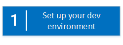
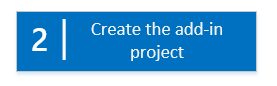
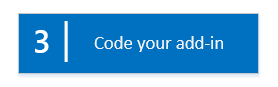
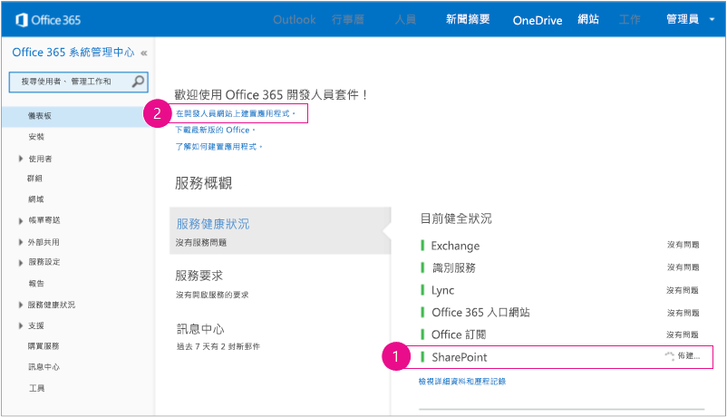
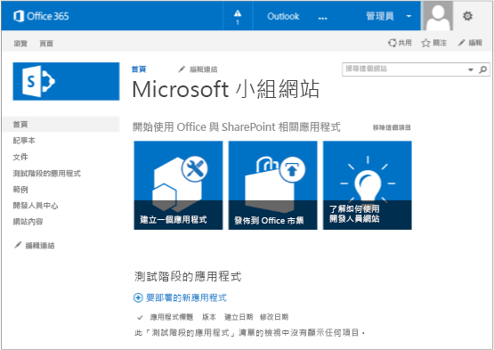
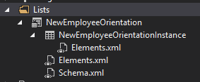

# 開始建立 SharePoint 主控 SharePoint 增益集
設定開發環境並建立您第一個 SharePoint 主控SharePoint Add-in。
SharePoint 主控的增益集是下列其中一個SharePoint Add-ins兩種主要類型。SharePoint Add-ins並兩種不同類型的概觀，請參閱 [SharePoint Add-ins](sharepoint-add-ins.md)。 以下是 SharePoint 主控增益集的摘要：
  
    
    


- 它們包含 SharePoint 清單、 網頁組件、 工作流程、 自訂頁面及其他元件都已安裝在子網站，呼叫web 增益集、 增益集安裝所在之 SharePoint 網站。
    
  
- 擁有該唯一程式碼的JavaScript自訂 SharePoint 頁面上。
    
  

 [
  
    
    
](get-started-creating-sharepoint-hosted-sharepoint-add-ins.md#Setup) [
  
    
    
](get-started-creating-sharepoint-hosted-sharepoint-add-ins.md#Create) [
  
    
    
](get-started-creating-sharepoint-hosted-sharepoint-add-ins.md#Code)
  
    
    


## 設定開發環境
<a name="Setup"> </a>

有許多種設定SharePoint Add-ins開發環境。本節說明最簡單的方法。替代項目，請參閱 ＜ [其他資源](#bk_addresources)。
  
    
    

### 要取得之工具


- 如果您已經沒有 **Visual Studio** 2013年或更新版本已安裝，再安裝到在 [Install Visual Studio](http://msdn.microsoft.com/library/da049020-cfda-40d7-8ff4-7492772b620f.aspx)使用指示。我們建議使用 [最新版本從 Microsoft 下載中心](https://www.visualstudio.com/downloads/download-visual-studio-vs)。
    
  
- Visual Studio 包含 **Microsoft Office Developer Tools for Visual Studio** 。有時之間的Visual Studio更新發行版本的工具。若要確認您具備最新版的工具，請 [Office 開發人員工具的 Visual Studio 2013 的安裝程式](http://aka.ms/OfficeDevToolsForVS2013)、 或 [installer 的 Office 開發人員工具的 Visual Studio 2015](http://aka.ms/OfficeDevToolsForVS2015)執行。
    
  

### 註冊 Office 365 開發人員網站
<a name="o365_signup"> </a>


> [!注意事項]
> 您可能已經具備存取權Office 365 開發人員網站。> **是 MSDN 訂閱者吗？** Visual 項 Studio 最終與 MSDN 訂閱者與 Visual Studio Premium 收到 Office 365 開發人員訂閱作為福利。 [今天贖回您福利。](https://msdn.microsoft.com/subscriptions/manage/default.aspx)> **您有下列其中一個 Office 365 訂閱計劃嗎？**> **如果， Office 365訂閱的管理員可以建立開發人員網站** 使用 [Office 365 系統管理中心](https://portal.microsoftonline.com/admin/default.aspx)。如需詳細資訊，請參閱 [建立現有的 Office 365 訂閱開發人員網站](create-a-developer-site-on-an-existing-office-365-subscription.md)。
  
    
    

有三種方法可以取得Office 365計劃。
  
    
    

- 透過 Office 365 開發人員計劃，註冊免費、為期一年的 Office 365 開發人員帳戶。 [取得更多資訊](http://dev.office.com/devprogram)，或直接前往 [註冊表單](https://profile.microsoft.com/RegSysProfileCenter/wizardnp.aspx?wizid=14b845d0-938c-45af-b061-f798fbb4d170)。在您註冊開發人員計劃後，將會收到一封電子郵件，其中包含的連結可讓您註冊開發人員帳戶。請使用下列的指示。
    
  
- 利用一個使用者授權，開始使用 [免費 30 天試用](https://portal.microsoftonline.com/Signup/MainSignUp.aspx?OfferId=6881A1CB-F4EB-4db3-9F18-388898DAF510&amp;DL=DEVELOPERPACK)。
    
  
- 購買  [Office 365 開發人員訂閱](https://portal.microsoftonline.com/Signup/MainSignUp.aspx?OfferId=C69E7747-2566-4897-8CBA-B998ED3BAB88&amp;DL=DEVELOPERPACK)。
    
  

> [!秘訣]
> 在另一個視窗或索引標籤中開啟這些連結，以便使用下列指示。
  
    
    


**圖 1。Office 365 開發人員網站網域名稱**

  
    
    

  
    
    

  
    
    

  
    
    

  
    
    

1. 註冊表單的第一頁 （不會顯示） 是自我闡明;提供要求的資訊，然後選擇 [ **下一步**。
    
  
2. 在第二頁上 (圖 1 中所示)，指定訂閱管理員的使用者識別碼。
    
  
3. 建立的子網域 **。 onmicrosoft.com**；例如，contoso.onmicrosoft.com。
    
    之後，註冊，您可以使用所產生的認證 (在 @ _yourdomain_格式 _UserID_。 onmicrosoft.com) Office 365入口網站讓您管理您的帳戶登入。您SharePoint Online開發人員網站在您的新網域設定︰ **http:// _yourdomain_。 sharepoint.com** 。
    
  
4. 選擇 [ **下一步**及填寫表單的最後一個頁面。如果您選擇提供電話號碼以取得確認程式碼，您可以提供行動電話或室內電話號碼，但VoIP (Voice over Internet Protocol) 數字。
    
  

    
> [!注意事項]
> 如果您登入到其他 Microsoft 帳戶嘗試註冊的開發人員帳戶時，您可能會看到此訊息： 「 抱歉，您輸入的使用者識別碼沒有運作。它看起來不正確。請確定您輸入您的組織指派給您的使用者識別碼。使用者識別碼通常看起來像是 *someone@example.com*  或 *someone@example.onmicrosoft.com*  。 」> 如果您看到該郵件，登出您所使用的 Microsoft 帳戶並再試一次。如果您仍會收到郵件，清除 [在瀏覽器快取或切換至 **[InPrivate 瀏覽**並再填寫表單。
  
    
    

註冊程序之後，請在瀏覽器開啟Office 365安裝] 頁面。選擇 [管理圖示來開啟系統中心] 頁面。
  
    
    

**圖 2。Office 365 管理中心頁面**

  
    
    

  
    
    

  
    
    

  
    
    

1. 您開發人員網站等候完成設定。佈建完成之後，重新整理 admin center 頁面在瀏覽器中。
    
  
2. 然後選擇 [ **建置增益集**的連結 [頁面] 以開啟您開發人員網站左上角。您應該會看到看起來像圖 3 中的網站。 **在測試增益**集清單] 頁面上的確認網站上次進行 SharePoint 開發人員網站範本。如果您看到正常的小組網站而等候數分鐘並再重新啟動您的網站。
    
  
3. 記下之網站的 URL;它用Visual Studio中建立SharePoint Add-ins專案時。
    
  

**圖 3. 具有 [測試階段的增益集] 清單的開發人員網站首頁**

  
    
    

  
    
    

  
    
    

  
    
    

  
    
    

## 建立增益集專案
<a name="Create"> </a>


1. 啟動Visual Studio使用 [ **以系統管理員身分執行**] 選項。
    
  
2. 選擇 [ **檔案**] > **新增**> **新專案**。
    
  
3. 在 **新的專案**] 對話方塊，依序展開 **Visual C#**節點、 [ **Office/SharePoint** ] 節點，然後選擇 [ **增益集**> **SharePoint 的增益集**。
    
  
4. 專案EmployeeOrientation、 命名並再選擇 **[確定]**。
    
  
5. 在 [第一個 **增益集的 SharePoint 設定指定**] 對話方塊中，提供您想要使用增益集的偵錯SharePoint網站的完整 URL。這是開發人員網站的 URL。（使用 HTTPS，而非 HTTP 在 URL 中）。在 [ **您要如何裝載您 SharePoint 的增益集**，請選擇 **SharePoint 主控**。選擇 [ **完成時間**。
    
  
6. 系統可能會提示您登入您開發人員網站。若是如此，使用您的訂閱管理員認證。
    
  
7. 建立專案後，開啟檔案 **/Pages/Default.aspx** 專案的根目錄中。除此之外，這個產生的檔案會載入一或兩個架設在 SharePoint 中的兩個指令碼： sp.runtime.js 和 sp.js。標記為載入這些檔案是具有識別碼 **PlaceHolderAdditionalPageHead**檔案頂端附近 **Content**控制項中。標記而異 **Microsoft Office Developer Tools for Visual Studio** 您所使用的版本。這一系列教學課程需要這兩個檔案會載入及它們使用一般的 HTML **<script>**標籤、 不 **<SharePoint:ScriptLink>**標籤載入。確定下列幾行 **PlaceHolderAdditionalPageHead**控制項 *正上方*  中線條 `<meta name="WebPartPageExpansion" content="full" />`：
    
  ```
  
<script type="text/javascript" src="/_layouts/15/sp.runtime.js"></script>
<script type="text/javascript" src="/_layouts/15/sp.js"></script> 

  ```


    再也會載入一個還是這些檔案的其他任何其他標記檔案中搜尋並移除重複標記。儲存並關閉檔案。
    
  

## 程式碼增益集
<a name="Code"> </a>

針對您第一個 SharePoint 主控SharePoint Add-in，我們將會包含傳統的 SharePoint 延伸模組： 自訂清單及清單執行個體。
  
    
    

1. 在 **方案總管**] 中開啟 AppManifest.xml 檔案。
    
  
2. 資訊清單的設計工具開啟，加入時 **Title** ] 欄位中單字之間的空格，讓它可讀取員工方向。(不要 *變更 [ **Name** ] 欄位中*  。)
    
  
3. 儲存並關閉檔案。
    
  
4. 以滑鼠右鍵按一下 [ **方案總管**中的專案並選擇 [ **新增**> **新資料夾**。 名稱列出的資料夾。
    
  
5. 以滑鼠右鍵按一下新資料夾並選擇 [ **新增]** > **新增項目**。[ **新增項目**] 對話方塊隨即開啟 **Office/SharePoint** ] 節點。
    
  
6. 選擇 **清單**。指定其名稱NewEmployeeOrientation，，然後選擇 [ **新增]**。
    
  
7. 在 **SharePoint 自訂精靈**] 的 [ **選擇清單設定**] 頁面上保留清單顯示名稱的預設 **NewEmployeeOrientation**、 選擇 [ **建立可自訂清單範本和它的清單執行個體**] 選項按鈕，然後在下拉式清單選擇 [ **預設 （自訂清單）** 。然後選擇 [ **完成時間**。
    
  
8. 精靈會建立名為 **NewEmployeeOrientationInstance**子清單執行個體 **NewEmployeeOrientation**清單範本。可能會開啟清單設計。它用在後續步驟。
    
  
9. 展開 [ **NewEmployeeOrientationInstance**節點在 **方案總管**中，如果它已經不是，以便您可以清楚區別是清單 *執行個體*  的清單 *範本*  子項 elements.xml 檔案中的子系 elements.xml 檔案。
    
   **方案總管中的 [清單] 節點**

  

     
  

    
    
  
10. 開啟 [ **NewEmployeeOrientation**清單範本的 elements.xml 子系]。
    
  
11. 使其更容易使用的 **DisplayName**屬性 （不 **Name**屬性） 加入空格: "新員工方向"。
    
  
12. 將 **Description**屬性設定為「 關於新員工方向資訊 」。
    
  
13. 將所有其他屬性保留在其預設值、 儲存檔案並關閉。
    
  
14. 如果未開啟設計程式] 清單，選擇 **NewEmployeeOrientation**節點 [ **方案總管**中。
    
  
15. 開啟設計工具] 的 [ **清單**] 索引標籤。這個索引標籤用來設定特定值清單 *執行個體*  、 不清單 *範本*  ，但有某些加以繼承自範本的預設值。
    
  
16. 在這個索引標籤上的值變更為下列：
    
  - **標題**：西雅圖新員工
    
  
  - **清單 URL**︰清單/NewEmployeesInSeattle
    
  
  - **描述**： Seattle 新員工。
    
  

    保留在其預設狀態的核取方塊、 儲存檔案並關閉設計。
    
  
17. 清單執行個體可能會在 **方案總管**中有其舊的名稱。若是如此，請開啟 **NewEmployeeOrientationInstance**快顯功能表，並選擇 [ **重新命名**、 名稱變更為NewEmployeesInSeattle。
    
  
18. 開啟 schema.xml 檔案。
    
  
19. **BaseViewID**值是"0" **View**元素，取代下列標記為現有 **ViewFields**元素。（如名為 `Title` **FieldRef**使用完全這個 GUID）。
    
     *分行符號可能會在此自動產生 schema.xml 檔案中的奇數 places 甚至。請確定您已經找到相符的 begin 和 end 標記為 **ViewFields**項目。新增以改善可讀性分行符號。* 
    


  ```
  
<ViewFields>
  <FieldRef Name="Title" ID="{fa564e0f-0c70-4ab9-b863-0177e6ddd247}" DisplayName="Employee" />
 </ViewFields>
  ```

20. 仍在 schema.xml 檔案並將其 **BaseViewID**值為"1"的 **View**元素中用下列標記來取代現有的 **ViewFields**元素。（如名為 `LinkTitle` **FieldRef**使用完全這個 GUID）。
    
  ```
  
<ViewFields>
  <FieldRef Name="LinkTitle" ID="{82642ec8-ef9b-478f-acf9-31f7d45fbc31}" DisplayName="Employee" />
</ViewFields>
  ```

21. 儲存並關閉 schema.xml 檔案。
    
  
22. 開啟 [是] 清單 *執行個體* **NewEmployeesInSeattle** (而不是清單 *範本* **NewEmployeeOrientation**子項 elements.xml) 子項 elements.xml 檔案。
    
  
23. 在此檔案中，填入部分初始的資料清單。您這麼做為 **ListInstance**元素的子元素新增下列 **Data**元素標記。
    
  ```
  
<Data>
  <Rows>
    <Row>
      <Field Name="Title">Tom Higginbotham</Field>
    </Row>
    <Row>
      <Field Name="Title">Satomi Hayakawa</Field>
    </Row>
    <Row>
      <Field Name="Title">Cassi Hicks</Field>
    </Row>
    <Row>
      <Field Name="Title">Lertchai Treetawatchaiwong</Field>
    </Row>
  </Rows>
</Data>
  ```

24. 儲存並關閉檔案。
    
  
25. 在 [ **方案總管**] 中，按兩下 **Feature1**開啟 Feature designer。在設計工具中， **標題**新員工方向元件及設為清單和取得導向至公司的員工的其他元件的 **描述**。儲存檔案並關閉設計程式]。
    
  
26. 如果未自動更名 **Feature1** **方案總管**中，開啟捷徑功能表、 選擇 [ **重新命名**、 和NewEmployeeOrientationComponents重新命名。
    
  
27. 開啟 Default.aspx 檔案。
    
  
28. 尋找具有識別碼 **PlaceHolderPageTitleInTitleArea**的 ASP.NET **Content**項目。取代預設的字串"頁面 Title"與"新員工的位置」。
    
  
29. 尋找與識別碼 **PlaceHolderMain**的 ASP.NET **Content**元素。 *取代*  其中具有下列標記的內容。 ` _spPageContextInfo`是頁面中自動包含 SharePoint JavaScript物件。它的 `webAbsoluteUrl`屬性會傳回增益集網頁的 URL。
    
  ```XML
  
<p><asp:HyperLink runat="server"
    NavigateUrl="JavaScript:window.location = _spPageContextInfo.webAbsoluteUrl + '/Lists/NewEmployeesInSeattle/AllItems.aspx';" 
    Text="New Employees in Seattle" /></p>

  ```


## 增益集執行及測試清單
<a name="Code"> </a>


  
    
    

1. 使用 F5 鍵以部署及執行您的增益集Visual Studio讓您測試 SharePoint 網站上的增益集的暫存安裝並立即執行增益集 （若要找出使用者如何執行已安裝的SharePoint Add-in，請參閱 [下一個步驟](#Nextsteps)）。
    
  
2. 增益集的預設頁面開啟時，選擇 **新員工 Seattle**連結以開啟 [自訂清單執行個體。
    
   **預設頁面和清單檢視頁面**

  

     ![增益集的預設頁面會與其標題 [依位置的新進員工] 一起顯示。有標示為 [西雅圖新進員工] 的連結。來自此連結的箭號指向清單的清單檢視頁面。它的標題為 [西雅圖新進員工] 且其下有此清單。](images/9dc5cefe-083a-4807-bee6-473001f23db9.png)
  

    
    
  
3. 新增並從清單中刪除項目。
    
  
4. 若要結束偵錯工作階段，關閉瀏覽器視窗或停止在Visual Studio中偵錯。每次您按 F5、 Visual Studio會撤銷舊版增益集和安裝最新的其中一個。
    
  
5. 您將會使用此增益集及Visual Studio解決方案其他篇文章和是一個增益集要撤銷個好習慣完成您的最後一次一段使用它。以滑鼠右鍵按一下 [ **方案總管]**中的專案，並選擇 **Retract**。
    
  

## 
<a name="Nextsteps"> </a>

到目前為止，不太多方向的資訊清單中。我們將此系列中新增一些中更新的文章。不過，首先，會從編碼以了解部署中 [部署及安裝 SharePoint 主控 SharePoint 增益集](deploy-and-install-a-sharepoint-hosted-sharepoint-add-in.md)SharePoint Add-ins簡短符號。
  
    
    

