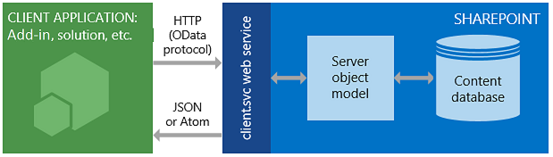

# 若要了解 SharePoint 2013 REST 服務取得
取得使用SharePoint 2013 REST 服務來存取和更新使用 REST 和 OData 網路通訊協定標準的 SharePoint 資料的基本知識。
SharePoint 2013介紹就相當於現有的 SharePoint [用戶端物件模型](http://msdn.microsoft.com/library/88e5e1b9-eab2-4f3b-a3f2-75c96b86f1f4%28Office.15%29.aspx)的代表性狀態傳輸 (REST) 服務。現在，開發人員可以從遠端 SharePoint 資料互動使用任何支援 REST 網路要求的技術。這表示的開發人員可以 **Create**、 **Read**、 **Update**及 **Delete** (CRUD) 作業從執行其 SharePoint 增益集、 解決方案及用戶端應用程式使用 REST web 技術和標準開啟資料通訊協定 (OData) 語法。
  
    
    


## 必要條件

本主題假設您有基本的應對 REST 和如何建構 REST 要求。
  
    
    

## SharePoint 2013 REST 服務的運作方式
<a name="bk_how"> </a>

SharePoint 2013新增您可以使用 REST 的 SharePoint 網站與遠端互動的能力。現在，您可以使用任何支援的技術，標準的其餘部分功能互動直接與 SharePoint 的物件。
  
    
    
若要存取使用 REST 的 SharePoint 資源，建構 RESTful HTTP 要求，使用開啟資料通訊協定 (OData) 標準，以對應至想要的用戶端物件模型 API。例如：
  
    
    
 *用戶端物件模型的方法：* 
  
    
    
List.GetByTitle(listname)
  
    
    
 *REST 端點：* 
  
    
    
 `http://server/site/_api/lists/getbytitle('listname')`
  
    
    
在 SharePoint 中的 client.svc web 服務會處理 HTTP 要求和做 Atom 或 JSON (JavaScript 物件表示法) 中的適當回應格式。用戶端應用程式必須再剖析該回應。下圖顯示 SharePoint REST 結構的高階檢視。
  
    
    

**SharePoint REST service architecture**

  
    
    

  
    
    

  
    
    
因為功能並方便使用的用戶端物件模型提供，都保持使用.NET Framework 通訊的 SharePoint 網站的主要的開發選項的 managed 程式碼、 Silverlight 或 JavaScript。
  
    
    

### 使用 HTTP 命令與SharePoint 2013 REST 服務
<a name="bk_usingHTTP"> </a>

若要使用內建於SharePoint 2013的其餘部分功能，您建構 RESTful HTTP 要求，使用 OData 標準，以對應至您想要使用的用戶端物件模型 API。Client.svc web 服務會處理 HTTP 要求並提供適當的回應 Atom 或 JavaScript Object Notation (JSON) 格式。用戶端應用程式必須再剖析該回應。
  
    
    
在SharePoint 2013 REST 服務端點會對應至的類型和 SharePoint 的用戶端物件模型中的成員。藉由使用 HTTP 要求，您可以使用這些 REST 端點以執行對 SharePoint 實體，例如清單與網站的一般 CRUD 作業。
  
    
    
一般：
  
    
    


|**如果您想要執行這項作業至端點**|**使用此 HTTP 要求**|**請記住**|
|:-----|:-----|:-----|
|讀取資源 <br/> |**GET** <br/> ||
|建立或更新的資源 <br/> |**POST** <br/> |使用 **POST**建立實體例如清單與網站。SharePoint 2013 REST 服務可支援加入到端點，表示集合的物件定義的傳送端 **POST**命令。 <br/> **POST**作業不需要任何屬性設定為其預設值。如果您嘗試將唯讀的屬性設定成 **POST**作業的一部分，服務會傳回發生例外狀況。 <br/> |
|更新或插入的資源 <br/> |**PUT** <br/> |使用 **PUT**及 **MERGE**作業來更新現有的 SharePoint 物件。 <br/> 代表物件屬性 **set**作業任何服務端點支援 **PUT**要求和 **MERGE**要求。 <br/> **MERGE**要求設定屬性是選擇性的。在您未明確設定任何屬性保留其目前的屬性。 <br/> **PUT**要求，如果您沒有指定的物件更新所有必要的屬性的 REST 服務會傳回例外狀況。此外，您未明確設定任何選擇性屬性設定為其預設屬性。 <br/> |
|刪除資源 <br/> |**DELETE** <br/> |使用針對特定的端點 URL 的 HTTP **DELETE**命令來刪除該端點所代表之 SharePoint 物件。 <br/> 但如果是可回收物件，例如清單、 檔案和清單項目，這會導致 **Recycle**作業。 <br/> |
   

### 建構 REST Url 來存取 SharePoint 資源
<a name="bk_constructURLs"> </a>

盡可能這些 REST 端點 URI 密切模擬 SharePoint 用戶端物件模型中的資源之 API 簽章。REST 服務的主要進入點代表的網站集合及網站的指定內容。
  
    
    
若要存取特定網站集合，請使用下列情況下：
  
    
    
 `http://server/site/_api/site`
  
    
    
若要存取特定站台，請使用下列情況下：
  
    
    
 `http://server/site/_api/web`
  
    
    
每個 *伺服器*  代表伺服器的名稱，而 *網站*  代表至特定站台的名稱或路徑。
  
    
    
從這個起始點，您可以再建構更具體的其餘部分 Uri '從查閱 「 物件模型中，使用從用戶端物件模型以正斜線 (/) 分隔 Api 的名稱。
  
    
    
此語法不會套用至 SocialFeedManager 或 SocialFollowingManager REST api (英文)。請參閱 [Social feed REST API reference for SharePoint 2013](http://msdn.microsoft.com/library/f1cb914f-1e91-4e23-bf53-d2ab323eac13%28Office.15%29.aspx)和 [Following people and content REST API reference for SharePoint 2013](http://msdn.microsoft.com/library/c05755df-846d-4a39-941d-950d066cc6d4%28Office.15%29.aspx)如需詳細資訊。
  
    
    
請參閱 [決定 SharePoint REST 服務端點 Uri](determine-sharepoint-rest-service-endpoint-uris.md)的更多的指導方針來決定從對應的用戶端物件模型 Api 的簽章的 SharePoint REST 端點 Uri。
  
    
    

## SharePoint REST 端點範例
<a name="bk_URLexamples"> </a>

下表包含一般 REST 端點 URL 範例讓您開始使用 SharePoint 資料。前面加上表所示來建構完整的其餘部分 URL 的 URL 片段 `http://server/site/_api/` 。在必要時 **POST**命令、 表格包含必須通過 HTTP 要求本文來建立指定之的 SharePoint 項目中的範例資料。以斜體顯示的項目代表您必須將您的值取代的變數。
  
    
    


|**描述**|**URL 端點**|**HTTP 方法**|**本文內容**|
|:-----|:-----|:-----|:-----|
|擷取清單的標題 <br/> | `web/title` <br/> |Get <br/> |不適用 <br/> |
|會擷取在網站上的所有清單 <br/> | `lists` <br/> |Get <br/> |不適用 <br/> |
|擷取單一 ' 清單的中繼資料 <br/> | `lists/getbytitle('listname')` <br/> |Get <br/> |不適用 <br/> |
|擷取清單內的項目 <br/> | `lists/getbytitle('listname')/items` <br/> |Get <br/> |不適用 <br/> |
|擷取的文件的特定屬性。(在此例中的文件標題。) <br/> | `lists/getbytitle('listname')?select=Title` <br/> |Get <br/> |不適用 <br/> |
|會建立一個清單 <br/> | `lists` <br/> |Post <br/> |
```

{
  '_metadata':{'type':SP.List},
  'AllowContentTypes': true,
  'BaseTemplate': 104 ,
  'ContentTypesEnabled': true,
  'Description': 'My list description ',
  'Title': 'RestTest '
}
```

|
|新增項目清單 <br/> | `lists/getbytitle('listname')/items` <br/> |Post <br/> |
```

{
  '_metadata':{'type':SP.listname ListItem},
  'Title': 'MyItem'
}

```

|
   

## 批次工作支援
<a name="batch"> </a>

SharePoint Online (及內部SharePoint 2016年或更新版本) REST 服務可支援合併成單一呼叫服務的多個要求使用 OData  `$batch`查詢選項。 詳細資料與程式碼範例的連結，請參閱 [請使用 REST Api 的批次要求](make-batch-requests-with-the-rest-apis.md)。。
  
    
    

## 其他資源
<a name="bk_learnmore"> </a>

使用下面所列若要深入了解使用 SharePoint REST 服務的資源。
  
    
    

|||
|:-----|:-----|
| [使用 SharePoint 2013 其餘端點完成基本作業](complete-basic-operations-using-sharepoint-2013-rest-endpoints.md) <br/> |了解如何執行基本建立、 讀取、 更新和刪除與SharePoint 2013 REST 介面 (CRUD) 作業。 <br/> |
| [使用清單及清單項目與 REST](working-with-lists-and-list-items-with-rest.md) <br/> |了解如何執行基本建立、 讀取、 更新及刪除清單和清單項目與SharePoint 2013 REST 介面 (CRUD) 作業。 <br/> |
| [使用資料夾與其餘的檔案](working-with-folders-and-files-with-rest.md) <br/> |了解如何執行基本建立、 讀取、 更新及刪除資料夾和檔案與SharePoint 2013 REST 介面 (CRUD) 作業。 <br/> |
| [瀏覽表示 REST 服務中的 SharePoint 資料結構](navigate-the-sharepoint-data-structure-represented-in-the-rest-service.md) <br/> |了解如何從指定的 SharePoint 項目、 REST 端點啟動並瀏覽至並存取父網站或該項目所在的文件庫結構等相關的項目。 <br/> |
| [決定 SharePoint REST 服務端點 Uri](determine-sharepoint-rest-service-endpoint-uris.md) <br/> |了解一般的指導方針來決定從對應的用戶端物件模型 Api 的簽章的 SharePoint REST 端點 Uri。 <br/> |
| [在 SharePoint 其餘邀請中使用 OData 查詢作業](use-odata-query-operations-in-sharepoint-rest-requests.md) <br/> |了解如何使用寬度的 OData 查詢字串運算子來選取、 篩選和排序您從 SharePoint REST 服務要求的資料。 <br/> |
| [REST API 參考和範例](http://msdn.microsoft.com/library/02128c70-9d27-4388-9374-a11bce68fdb8%28Office.15%29.aspx) <br/> |此頁面包含所有可用的 MSDN 上的SharePoint 2013開發人員的 REST 資源的連結。 <br/> |
| [SharePoint 搜尋 REST API 概觀](http://msdn.microsoft.com/library/8a4f7863-e4c1-4099-9189-a1894db36930%28Office.15%29.aspx) <br/> |使用 SharePoint Server 2013 中的搜尋 REST 服務以及任何支援 REST 網路要求的技術，來新增用戶端及行動應用程式的搜尋功能。 <br/> |
| [Social feed REST API reference for SharePoint 2013](http://msdn.microsoft.com/library/f1cb914f-1e91-4e23-bf53-d2ab323eac13%28Office.15%29.aspx) <br/> |深入了解進行摘要相關工作的 SharePoint 2013 REST 端點。 <br/> |
| [Following people and content REST API reference for SharePoint 2013](http://msdn.microsoft.com/library/c05755df-846d-4a39-941d-950d066cc6d4%28Office.15%29.aspx) <br/> |深入了解 SharePoint 2013 REST 端點以追蹤人員和內容。 <br/> |
| [請使用 REST Api 的批次要求](make-batch-requests-with-the-rest-apis.md) <br/> |了解如何合併成單一呼叫 REST 服務的多個要求。 <br/> |
| [同步處理 SharePoint 項目的使用 REST 服務](synchronize-sharepoint-items-using-the-rest-service.md) <br/> |了解如何使用 SharePoint REST 服務一部分 **GetListItemChangesSinceToken**資源同步處理 SharePoint 與增益集或服務之間的項目。 <br/> |
| [使用 ETag 值，透過其他服務，來取得文件清單項目版本設定](5f7e0579-46b7-44ab-b3b4-cdbc622dcd98.md) <br/> |了解如何使用 HTML Etag 使用 SharePoint REST 服務並行控制項的 SharePoint 清單及清單項目。 <br/> |
   

## OData 資源
<a name="SP15startREST_bk_addlresources"> </a>


  
    
    

-  [簡介 (英文) OData](http://msdn.microsoft.com/en-us/data/hh237663)
    
  
-  [範例開啟資料通訊協定](http://msdn.microsoft.com/en-us/library/ff478141.aspx)
    
  
-  [開啟資料通訊協定](http://www.odata.org/)
    
  
-  [OData 通訊協定 URI 慣例](http://www.odata.org/documentation/odata-version-2-0/uri-conventions/)
    
  
-  [解決服務作業](http://www.odata.org/documentation/odata-version-2-0/uri-conventions#AddressingServiceOperations)
    
  
-  [OData 通訊協定作業](http://www.odata.org/documentation/odata-version-2-0/operations/)
    
  
-  [錯誤條件](http://www.odata.org/documentation/odata-version-2-0/operations#ErrorConditions)
    
  

