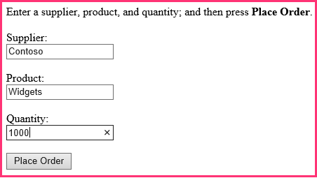

# 將 SharePoint 外觀和操作提供增益集
了解如何讓您提供者主控SharePoint Add-ins的 SharePoint 外觀與風格。
這是一系列的開發提供者主控SharePoint Add-ins基本知識文章中的第二個。您首先應該先熟悉 [SharePoint Add-ins](sharepoint-add-ins.md)與此系列中舊的文章：
  
    
    


-  [開始建立提供者主控 SharePoint 增益集](get-started-creating-provider-hosted-sharepoint-add-ins.md)
    
  

在這一系列上一篇文章您學會如何設定開發環境以及如何使用Visual Studio來建立第一個"Hello World"層級增益集公開增益集的遠端 web 應用程式中的 SharePoint 資料。在本文中，我們已經建立SharePoint Add-in解決方案的開頭。包含 ASP.NET Web 表單應用程式與 SQL Azure database。我們已建立這些您因為這一系列文章以專注於SharePoint Add-ins僅適用對象。您將會增加更多 SharePoint 功能和整合至與此系列中每篇文章的增益集。
  
    
    


## 認識基底的增益集

我們不會在教導 ASP.NET 或 T-SQL 程式設計這一系列，但您需要知道的一點的增益集的遠端元件之前我們可以開始將其整合到 SharePoint。分析藍本的增益集可構想的鏈結之一零售商店且每個儲存區的小組網站中的母公司SharePoint Online訂閱。當儲存會在其小組網站上安裝的增益集時、 增益集可讓它們可以整合自己的 SharePoint 資料與經驗的母公司資料庫中的資料。每個執行個體中之增益集自己租賃公司資料庫中，而且使用者只可以互動其儲存區相關聯的公司資料。
  
    
    

### 先建立鏈結中的兩個儲存區的小組網站


1. 開啟您SharePoint Online首頁並再按一下 [快速啟動] 上的 [ **網站內容**] 連結。在 **[網站內容**] 頁面上，向下捲動直到您看到 **新的子網站**連結] 並按一下它。
    
  
2. 在 [ **新增 SharePoint 網站**] 頁面上填寫表單新的小組網站所使用的值在下列螢幕擷取畫面。
    
     
  

  

  
3. 保留所有其他設定的預設值，然後按下 **建立**。
    
  

### 探索增益集


1. 移至 [SharePoint_Provider-hosted_Add-Ins_Tutorials](https://github.com/OfficeDev/SharePoint_Provider-hosted_Add-ins_Tutorials)並按一下 [ **下載 ZIP** ] 按鈕儲存機制下載到您的桌面。解壓縮的檔案。
    
  
2. Visual Studio *系統管理員身分*  啟動]，然後開啟 [BeforeSharePointUI.sln。解決方案中有三個專案：
    
  - **ChainStore** - SharePoint Add-in專案。
    
  
  - **ChainStoreWeb** -遠端 web 應用程式。
    
  
  - **ChainCorporateDB** -SQL Azure database。
    
  
3. 選取 **ChainStore**專案並在 [ **屬性**] 視窗中設定 **的網站 」 URL**屬性 Hong 特別行政區小組網站的完整 url: https://{YOUR_SHAREPOINT_DOMAIN}/hongkong/。請務必包含結尾的"/"字元。按下 [ **儲存**] 按鈕。 *在某些此程序中，會提示您登入SharePoint Online訂閱。* 
    
  
4. 以滑鼠右鍵按一下頂端的 [ **方案總管中**的 [解決方案] 節點並選取 [ **設定啟動專案**。
    
  
5. 請確定所有三個專案設定以 **啟動**[ **動作**] 欄中。
    
  
6. 使用 F5 鍵以部署及執行您的增益集Visual Studio主控 IIS Express 的遠端 web 應用程式和主控 SQL 資料庫的 SQL Express。它也讓您測試 SharePoint 網站上的 [增益集的暫存安裝，並立即執行增益集。系統提示您授與權限的增益集才能開始] 頁面隨即開啟。
    
  
7. 在 「 開始 」 頁面增益集看起來像是中 」 螢幕擷取畫面下方。在最頂端為增益集安裝所在之 SharePoint 網站的名稱。這是一些範例程式碼Office Developer Tools for Visual Studio產生副作用。您將會在後續步驟中變更此設定。[] 頁面上有的區域可以看過公司 **庫存**、 **訂單**、 及 **員工**SQL 資料庫資料表的資料。最初這些表格是空的。
    
     
  

  

  
8. 開啟若要開啟 [訂單] 頁面底部的 [ **訂單**] 連結。在表單中輸入一些值並按下 **進行順序**。下列螢幕擷取畫面顯示範例。它將不會出現任何項目具有 nappened，但按鈕背後的程式碼將值傳遞給參數化的預存程序的 SQL 資料庫中。使用參數化的預存程序提供保護，將資料庫從 SQL 資料隱碼攻擊。
    
     
  

  

  
9. 若要瀏覽至 [開始] 頁面上，使用瀏覽器的 [上一頁] 按鈕，然後按 [ **顯示訂單**] 按鈕。這個頁面會重新整理，且您順序出現類似下列的螢幕擷取畫面] 頁面上。
    
    資料表具有測試 SharePoint 網站的 url 的 **租用戶**欄位值。這並非有時稱為租用SharePoint Online訂閱。而是每個執行個體中之增益集是公司的資料庫中的不同租用戶。由於不超過一個增益集的執行個體都可以安裝在特定的 SharePoint 主機網頁上的主機網站的 URL 可以做資料庫中的租用戶鑑別器。(如主機網頁與增益集 web 之間的差別的重新整理程式，請參閱 [SharePoint Add-ins](sharepoint-add-ins.md))。所有預存程序中的增益集包括鑑別子值時寫入或從資料庫讀取時。這可確保當使用者按下 [ **顯示訂單**(或 **顯示員工**或 **顯示庫存**)] 按鈕，從資料庫擷取相關聯的使用者存放區的資料。此設計也可確保該使用者可以只進行排列並新增員工他們自己的存放區。
    
    遠端 web 應用程式會取得主機網頁 URL 從 SharePoint 新增至 [開始] 頁面的 URL 時加以啟動增益集的查詢字串參數。由於使用 SSL，這個查詢字串會進行加密經由網際網路會移至遠端 web 應用程式。
    
     
  

  

  
10. 若要結束偵錯工作階段，關閉瀏覽器視窗或停止在Visual Studio中偵錯。每次您按 F5、 Visual Studio會撤銷舊版增益集和安裝最新的其中一個。
    
  
11. 預設的增益集仍會保留安裝於 SharePoint 主機網路傳來偵錯工作階段中Visual Studio。如需如何使用者安裝後會啟動它，請在瀏覽器中開啟 Fabrikam Hong 特別行政區 SharePoint 網站並瀏覽至 [ **網站內容**] 頁面上。您會看到增益集的磚原狀下列螢幕擷取畫面中：
    
     
  

    
    > **注意事項**
      > 如果您按一下 [並排顯示，因為Visual Studio關閉 IIS Express 工作階段停止偵錯時無法開啟起始頁面。

## 設定Visual Studio重建每個偵錯工作階段的公司資料庫
<a name="Rebuild"> </a>

根據預設， Visual Studio將會 *重建 SQL Express 資料庫*  。所以訂單和一個偵錯工作階段中將新增至資料庫的其他項目位於仍在資料庫中更新的工作階段。它會比較容易每當您按 F5，所以採取下列步驟開始使用空白的資料庫：
  
    
    

1. 以滑鼠右鍵按一下 **ChainCorporateDB**專案並選取 [ **內容**]。
    
  
2. 開啟 [ **偵錯**] 索引標籤，並啟用 [ **永遠重新建立資料庫**] 選項。
    
  

## 授與的遠端 web 應用程式的 SharePoint 外觀與風格
<a name="Rebuild"> </a>

在某些情況下，您想讓他們自己的品牌、 遠端頁面，但在大多數情況下所應模仿 SharePoint 使用者介面，讓使用者覺得它們仍深入了解 SharePoint。
  
    
    

### 將 SharePoint chrome 及上方列新增至 [開始] 頁面上


1. 在 [ **方案總管**中，瀏覽至 [ **ChainStoreWeb |頁面**，並開啟 CorporateDataViewer.aspx 檔案。這是在 「 開始 」 頁面增益集
    
  
2. 在 **head** ] 區段中，您會看到載入一些JavaScript文件庫的指令碼。新增下列其他指令碼其下方。此指令碼會載入 SP.使用者介面。這是 /_layouts/15/資料夾在每個 SharePoint 網站中 Controls.js 檔案。除此之外，這個檔案會載入 SharePoint CSS 文件庫。
    
  ```
  
<script type="text/javascript">
    var hostweburl;

    // Load the SharePoint resources.
    $(document).ready(function () {

        // Get the URI decoded add-in web URL.
        hostweburl =
            decodeURIComponent(
                getQueryStringParameter("SPHostUrl")
        );

        // The SharePoint js files URL are in the form:
        // web_url/_layouts/15/resource.js
        var scriptbase = hostweburl + "/_layouts/15/";

        // Load the js file and continue to the 
        // success handler.
        $.getScript(scriptbase + "SP.UI.Controls.js")
    });

    // Function to retrieve a query string value.
    function getQueryStringParameter(paramToRetrieve) {
        var params =
            document.URL.split("?")[1].split("&amp;");
        var strParams = "";
        for (var i = 0; i < params.length; i = i + 1) {
            var singleParam = params[i].split("=");
            if (singleParam[0] == paramToRetrieve)
                return singleParam[1];
        }
    }
</script>
  ```

3. 在 [內文] 區段中的頁面頂端，新增下列標記。此動作會插入 SharePoint 頂列，呼叫的 chrome 控制項放入頁面。當我們測試的修訂的增益集本文稍後的此標記的詳細資料會成為較清晰。(字串"app"會出現在某些屬性名稱的因為用來呼叫"apps"的增益集。)
    
  ```
  
<!-- Chrome control placeholder. Options are declared inline.  -->
<div 
    id="chrome_ctrl_container"
    data-ms-control="SP.UI.Controls.Navigation"  
    data-ms-options=
        '{  
            "appHelpPageUrl" : "Help.aspx",
            "appIconUrl" : "/Images/AppIcon.png",
            "appTitle" : "Chain Store",
            "settingsLinks" : [
                {
                    "linkUrl" : "Account.aspx",
                    "displayName" : "Account settings"
                },
                {
                    "linkUrl" : "Contact.aspx",
                    "displayName" : "Contact us"
                }
            ]
         }'>
</div>
  ```

4. **H1**標頭和內文] 頁面的超連結會自動使用讓他們不需要變更 SharePoint 的 CSS 文件庫中所定義的樣式。為了說明如何使用 SharePoint 樣式，設定欄標題中的三個 **GridView**控制項 SharePoint 的"全部大寫"樣式將 **HeaderStyle-CssClass**屬性新增至每個控制項和其值設為" `ms-uppercase`"。以下是範例。對所有三個 **GridView**控制項進行相同變更。
    
  ```XML
  
<asp:GridView ID="ordersGridView" runat="server" CellPadding="5" GridLines="None"
HeaderStyle-CssClass="ms-uppercase" />
  ```

5. Chrome 控制項使用增益集] 圖示，因此我們需要圖示檔的遠端網頁伺服器上的第二個複本。在 **方案總管**] 中以滑鼠右鍵按一下 **ChainStore**專案中的 AppIcon.png 檔案，並選擇 [ **複製**]。
    
  
6. 以滑鼠右鍵按一下 **ChainStoreWeb**專案中的 [ **圖像**] 資料夾，並選擇 [ **貼**。
    
  
7. 開啟 CorporateDataViewer.aspx.cs 檔案。
    
  
8.  `CorporateDataViewer`類別的宣告類型 **SharePointContext**私用成員。此類別是Office Developer Tools for Visual Studio產生建立專案時 SharePointContext.cs 檔案中定義。您可以為類似如下的 **HttpContextBase**類別的 ASP.NET，但具有 SharePoint 內容相關資訊，如主機網頁的 URL 新增至其認為它。
    
    **Page_Load**方法只有的 **using**陳述式會寫入遠端起始頁面上的 SharePoint 主機網站的名稱。這是範例程式碼，所以刪除整個 **using**陳述式。(但留下初始化 `spContext`變數的行)。此方法現在看起來應類似如下。
    


  ```cs
  
protected void Page_Load(object sender, EventArgs e)
{
    spContext = SharePointContextProvider.Current.GetSharePointContext(Context);
}
  ```

9. 有四個需要 SharePoint 使用者介面其他 ASP.NET 檔案：
    
  - Account.aspx
    
  
  - Contact.aspx
    
  
  - Help.aspx
    
  
  - OrderForm.aspx
    
  

    > **注意事項**
      > 永遠不會真的呈現 EmployeeAdder.aspx、 project 中的最後一個 aspx 檔案，因此您並不會變更其使用者介面。您將了解更多有關它在這一系列更新文章。

    但是我們不想讓這些頁面上的 chrome 控制項。我們只需要 SharePoint CSS 庫的存取權。針對每個這四個，新增下列標記 **head**元素。
    


  ```XML
  
<link type="text/css" rel="stylesheet"
href="<%= spContext.SPHostUrl.ToString() + "_layouts/15/defaultcss.ashx" %>" />
  ```

10. 此步驟和下一個已執行順序表單頁面及 [帳戶] 頁面上，讓他們僅適用於連絡人，並協助頁面。若要取得的 `spContext`物件上每個頁面、 開啟 *。 aspx.cs 程式碼後置檔案的三個 aspx 頁面。在每個新增的下列成員 **Page**類別。
    
  ```cs
  
protected SharePointContext spContext;
  ```

11. 取代下列版本 **Page_Load**方法。是要從工作階段快取擷取的物件。它是 「 快取那里其第一次建立的增益集開始頁面 **Page_Load**方法時。
    
  ```cs
  protected void Page_Load(object sender, EventArgs e)
{
    spContext = Session["SPContext"] as SharePointContext;
}
  ```

12. 開啟 [OrderForm.aspx] 頁面。上方 **Label**元素中，以取代參照 `ms-accentText` CSS 類別的 span 標記上片語 **進行順序**將 **<b>**項目。當您完成整個 **Label**控制項應該看起來如下。
    
  ```XML
  
<asp:Label ID="lblOrderPrompt" runat="server"
         Text="Enter a supplier, product, and quantity; and then press <span class='ms-accentText'>Place Order</span>.">
</asp:Label>
  ```


## 增益集執行及測試新的 SharePoint 使用者介面
<a name="Rebuild"> </a>


  
    
    

1. 使用 F5 鍵以部署及執行您的增益集Visual Studio主控 IIS Express 的遠端 web 應用程式和主控 SQL 資料庫的 SQL Express。它也讓您測試 SharePoint 網站上的 [增益集的暫存安裝，並立即執行增益集。系統提示您授與權限的增益集才能開始] 頁面隨即開啟。
    
  
2. 在 「 開始 」 頁面增益集開啟時，它現在看起來像是 SharePoint 頁面。按一下 [ **訂單**] 連結。現在也看起來像是 SharePoint 表單。
    
     
  

  

  
3. 建立順序並按下 **進行順序**。
    
  
4. 若要瀏覽至 [增益集開始] 頁面上，使用瀏覽器的 [上一頁] 按鈕，然後按 [ **顯示順序**。[] 頁面上看起來應該類似如下所示。請注意現在欄名全部大寫字。
    
     
  

  

  
5. 在結尾的 chrome 控制項上按 **?**圖示。簡單說明 」 頁面會隨即開啟。按一下 [瀏覽器的 [上一頁] 按鈕。
    
  
6. Chrome 控制項上按齒輪圖示。功能表開啟具有連結的帳戶及連絡人] 頁面。開啟 [帳戶] 頁面並回到 [開始] 頁面上使用瀏覽器的 [上一頁] 按鈕。執行 [連絡人] 頁面上的相同。
    
  
7. 按一下 [ **返回網站**上的按鈕的 chrome 控制項。主機網站，Hong 特別行政區存放區小組網站的首頁隨即開啟。
    
  
8. 按一下 [頂列上的齒輪圖示，然後選擇 [ **變更外觀**。
    
  
9. 請遵循提示來變更為其中一個替代 「尋找」 的網站。
    
  
10. 瀏覽至 [ **網站內容**] 頁面並啟動從其磚鏈結市集應用程式。自訂頁面已對所選擇的外觀。下列螢幕擷取畫面顯示他們顯示的 **性質**組成外觀的方式。
    
     
  

  

  
11. 變更網站的外觀回預設值，會呼叫 **Office**。
    
  
12. 若要結束偵錯工作階段，關閉瀏覽器視窗或停止在Visual Studio中偵錯。每次您按 F5、 Visual Studio會撤銷舊版增益集和安裝最新的其中一個。
    
  
13. 您將會使用此增益集及Visual Studio解決方案中其他文章與是很好的作法若要撤銷一個增益集時您已完成的最後一次一段使用它。以滑鼠右鍵按一下 [ **方案總管**中的專案，並選擇 **Retract**。
    
  

## 
<a name="Nextsteps"> </a>

增益集現在起來 SharePoint，但它仍只是不會超過從 SharePoint 中並排顯示正在啟動真正整合與 SharePoint 的 web 應用程式。您將會新增自訂命令、 從下一篇文章中的自訂功能區按鈕啟動:  [包含自訂按鈕中的增益集](include-a-custom-button-in-the-provider-hosted-add-in.md)。
  
    
    

