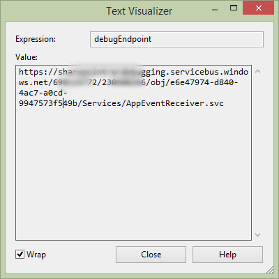

# 處理提供者主控增益集的清單項目事件
了解如何處理提供者主控SharePoint Add-in中的清單項目事件。
這是以一系列的基本知識文章的開發提供者主控SharePoint Add-ins十分之一。您首先應該先熟悉 [SharePoint Add-ins](sharepoint-add-ins.md)與此系列中舊的文章：
  
    
    


-  [開始建立提供者主控 SharePoint 增益集](get-started-creating-provider-hosted-sharepoint-add-ins.md)
    
  
-  [將 SharePoint 外觀和操作提供增益集](give-your-provider-hosted-add-in-the-sharepoint-look-and-feel.md)
    
  
-  [包含自訂按鈕中的增益集](include-a-custom-button-in-the-provider-hosted-add-in.md)
    
  
-  [取得 SharePoint 物件模型的快速概觀](get-a-quick-overview-of-the-sharepoint-object-model.md)
    
  
-  [將 SharePoint 相關寫入作業新增至 [增益集]](add-sharepoint-write-operations-to-the-provider-hosted-add-in.md)
    
  
-  [Include an add-in part in the provider-hosted add-in](include-an-add-in-part-in-the-provider-hosted-add-in.md)
    
  
-  [處理增益集事件中的增益集](handle-add-in-events-in-the-provider-hosted-add-in.md)
    
  
-  [將初次執行邏輯加入至增益集](add-first-run-logic-to-the-provider-hosted-add-in.md)
    
  
-  [以程式設計方式部署中的增益集的自訂按鈕](programmatically-deploy-a-custom-button-in-the-provider-hosted-add-in.md)
    
  

> [!注意事項]
> 如果您有已使用透過這一系列有關提供者主控增益集，則您需要您可以使用以繼續執行本主題的Visual Studio解決方案。您也可以下載 [SharePoint_Provider-hosted_Add-Ins_Tutorials](https://github.com/OfficeDev/SharePoint_Provider-hosted_Add-ins_Tutorials)在存放庫並開啟 BeforeRER.sln 檔案。
  
    
    

您正早在這一系列文章中時所在的順序，它會新增至公司資料庫中的 [ **Orders** ] 資料表和其項目會自動新增至 **預期出貨**清單。當它到達本機存放區時，使用者會將 **Arrived**欄設定為 [ **是]**。變更欄位值的項目會建立可以將新增自訂的處理常式的項目更新的事件。在本文中，您會建立此清單項目事件處理常式並以程式設計方式將部署於SharePoint Add-in初次執行邏輯。您的處理常式會將項目新增至 [ **詳細目錄** ] 表格中的公司的資料庫。它會再設 **已新增至庫存**清單欄的 **預期出貨** **[是]**。您也將會了解如何防止此第二個項目更新的事件設定關閉無限的一系列的項目更新事件。
## 以程式設計方式部署預期出貨清單


> [!注意事項]
> 啟動專案的設定中Visual Studio往往每當解決方案重新開啟後還原為預設值。一律 updatefromfile 此系列文章中的範例方案後立即執行這些步驟：
  
    
    


1. 在 **方案總管**] 中開啟 Utilities\\SharePointComponentDeployer.cs 檔案 **ChainStoreWeb**專案中。 `SharePointComponentDeployer`類別新增下列方法。這段程式碼不會介紹您已經尚未在這一系列、 上一篇文章中看到但是請注意下列任何功能：
    
  - 會將設定 **數量**欄位的 **Required**屬性為 **TRUE**讓欄位必須一律有值。然後將預設值設定為 1。
    
  
  - 新項目表單上隱藏 **Arrived**及 **庫存已新增**的欄位。
    
  
  - 理想狀況下， **新增至庫存**欄位也會隱藏的編輯項目] 表單上，因為它應該只能為 **Yes**時變更此項目更新事件處理常式前已新增項目到公司的 [ **詳細目錄**] 表格。我們會在後續步驟中說明的技術考量，欄位有顯示在編輯項目表單中，如果我們想要以程式設計方式在項目更新的事件處理常式中撰寫給它。
    
  

  ```cs
  
private static void CreateExpectedShipmentsList()
 {
    using (var clientContext = sPContext.CreateUserClientContextForSPHost())
    {
        var query = from list in clientContext.Web.Lists
                    where list.Title == "Expected Shipments"
                    select list;
        IEnumerable<List> matchingLists = clientContext.LoadQuery(query);
        clientContext.ExecuteQuery();
                   
        if (matchingLists.Count() == 0)
        {
                ListCreationInformation listInfo = new ListCreationInformation();
                listInfo.Title = "Expected Shipments";
                listInfo.TemplateType = (int)ListTemplateType.GenericList;
                listInfo.Url = "Lists/ExpectedShipments";
                List expectedShipmentsList = clientContext.Web.Lists.Add(listInfo);

                Field field = expectedShipmentsList.Fields.GetByInternalNameOrTitle("Title");
                field.Title = "Product";
                field.Update();

                expectedShipmentsList.Fields.AddFieldAsXml("<Field DisplayName='Supplier'" 
                                                            + " Type='Text' />", 
                                                            true,
                                                            AddFieldOptions.DefaultValue);
                expectedShipmentsList.Fields.AddFieldAsXml("<Field DisplayName='Quantity'" 
                                                            + " Type='Number'" 
                                                            + " Required='TRUE' >" 
                                                            + "<Default>1</Default></Field>",
                                                            true, 
                                                            AddFieldOptions.DefaultValue);
                expectedShipmentsList.Fields.AddFieldAsXml("<Field DisplayName='Arrived'" 
                                                           + " Type='Boolean'"
                                                           + " ShowInNewForm='FALSE'>"
                                                           + "<Default>FALSE</Default></Field>",
                                                            true, 
                                                            AddFieldOptions.DefaultValue);
                expectedShipmentsList.Fields.AddFieldAsXml("<Field DisplayName='Added to Inventory'" 
                                                            + " Type='Boolean'" 
                                                            + " ShowInNewForm='FALSE'>"
                                                            + "<Default>FALSE</Default></Field>", 
                                                            true, 
                                                            AddFieldOptions.DefaultValue);

                clientContext.ExecuteQuery();
        }
     }
 }
  ```

2. 在 `DeployChainStoreComponentsToHostWeb`方法中，新增下列行、 線條 `RemoteTenantVersion = localTenantVersion`的正上方。
    
  ```
  
CreateExpectedShipmentsList();
  ```


## 建立清單項目事件接收器


> [!注意事項]
> 如果您有已透過此系列文章工作，然後已設定開發環境適用於偵錯的遠端事件接收器。如果您未完成的請參閱 ＜  [設定偵錯的事件接收器的解決方案](handle-add-in-events-in-the-provider-hosted-add-in.md#RERDebug)之前您前往任何進一步本主題中。
  
    
    

Office Developer Tools for Visual Studio包括可新增到SharePoint Add-in解決方案的 **遠端事件接收器**項目。不過，在這篇文章所撰寫的時間此專案項目假設 (與接收者會註冊) 的清單會新增在 web 上與因此工具所建立的增益集網頁伺服器及某些 SharePoint 成品中。但鏈結存放區中之增益集的受話方會將登錄 (在後續步驟中) 與 **預期出貨**清單上主機 web 因此增益集不需要增益集網頁。(如增益集 web 與主機 web 之間的差別的提醒，請參閱 [SharePoint Add-ins](sharepoint-add-ins.md))。
  
    
    

> [!注意事項]
> 清單及清單項目事件接收器稱為的遠端事件接收器(RER) 因為其程式碼是遠端從 SharePoint]，在雲端中或在 SharePoint 伺服器陣列外的內部伺服器。不過，會觸發這些事件會在 SharePoint 中。
  
    
    


1. 在 **方案總管**] 中 **ChainStoreWeb**專案中的 [ **服務**] 資料夾上按一下滑鼠右鍵並選取 [ **新增 |WCF 服務**。
    
  
2. 出現提示時，命名服務RemoteEventReceiver1，並按下 **[確定]**。
    
  
3. 工具所建立的介面檔案、 *.svc 檔案與程式碼後置檔案。我們不需要介面檔案 IRemoteEventReceiver1.cs，所以將其刪除。(工具可能會有其自動開啟。若是如此，關閉並將其刪除。)
    
    > [!注意事項]
      > 當您建立增益集的事件接收器安裝及解除安裝舊版的這一系列文章中的事件時， Office Developer Tools for Visual Studio會新增其 Url 的應用程式資訊清單檔案。清單及清單項目事件接收器不會註冊應用程式資訊清單中。而這些 (中註冊的提供者主控增益集) 以程式設計方式。您將在稍後步驟這麼做。
4. 開啟的程式碼後置檔案: RemoteEventReceiver1.svc.cs。以其整個內容取代下列程式碼。請注意下列有關這段程式碼：
    
  - 介面 `IRemoteEventService`定義於 **Microsoft.SharePoint.Client.EventReceivers**命名空間。
    
  
  - 將不會有任何 「 之前 」 事件處理鏈存放區增益集，但是 `IRemoteEventService`介面所需的 **ProcessEvent**方法。
    
  

  ```cs
  using System;
using System.Collections.Generic;
using Microsoft.SharePoint.Client;
using Microsoft.SharePoint.Client.EventReceivers;
using System.Data.SqlClient;
using System.Data;
using ChainStoreWeb.Utilities;

namespace ChainStoreWeb.Services
{
    public class RemoteEventReceiver1 : IRemoteEventService
    {
        /// <summary>
        /// Handles events that occur before an action occurs, 
        /// such as when a user is adding or deleting a list item.
        /// </summary>
        /// <param name="properties">Holds information about the remote event.</param>
        /// <returns>Holds information returned from the remote event.</returns>
        public SPRemoteEventResult ProcessEvent(SPRemoteEventProperties properties)
        {
            throw new NotImplementedException();
        }

        /// <summary>
        /// Handles events that occur after an action occurs, 
        /// such as after a user adds an item to a list or deletes an item from a list.
        /// </summary>
        /// <param name="properties">Holds information about the remote event.</param>
        public void ProcessOneWayEvent(SPRemoteEventProperties properties)
        {

        }
    }
}
  ```

5. 將下列程式碼新增至 `ProcessOneWayEvent`方法。請注意 **ItemUpdated**事件僅需一個這則範例會處理，因此我們可能使用簡單 **if**結構，而不是 **switch**。但是事件接收器通常處理多個事件，因此我們想您查看您將最常使用事件處理常式中做為 SharePoint 增益集開發人員的圖樣。
    
  ```cs
  
switch (properties.EventType)
{
    case SPRemoteEventType.ItemUpdated:

        // TODO12: Handle the item updated event.
                    
        break;
}  
  ```

6.  `TODO12`取代下列程式碼。同樣地，這裡，我們使用 **switch**結構時一樣簡單 **if**結構，因為我們希望您查看 SharePoint 事件接收器中的常見模式。
    
  ```cs
  
switch (properties.ItemEventProperties.ListTitle)
{
    case "Expected Shipments":

        // TODO13: Handle the arrival of a shipment.

        break;
}
  ```

7. 回應到達物料的程式碼應該做兩件事：
    
  - 新增具有送達到公司庫存的存放區的項目。
    
  
  - 設定 **如預期出貨**清單 **是** **已新增至庫存**] 欄位。但如果項目已成功新增至表單庫存，應該只會發生這。
    
  

    新增以 `TODO13`取代下列程式碼。兩種方法、  `TryUpdateInventory` `RecordInventoryUpdateLocally`中建立和稍後的步驟。
    


  ```cs
  
bool updateComplete = TryUpdateInventory(properties);
if (updateComplete)
{
    RecordInventoryUpdateLocally(properties);
}
  ```


     `ProcessOneWayEvent`方法現在應該看起來如下：
    


  ```cs
  
public void ProcessOneWayEvent(SPRemoteEventProperties properties)
{
    switch (properties.EventType)
    {
        case SPRemoteEventType.ItemUpdated:

            switch (properties.ItemEventProperties.ListTitle)
            {
                case "Expected Shipments":
                    bool updateComplete = UpdateInventory(properties);
                    if (updateComplete)
                    {
                        RecordInventoryUpdateLocally(properties);
                    }
                    break;
            }
            break;
    }          
}
  ```

8.  `RemoteEventReceiver1`類別新增下列方法。
    
  ```cs
  
private bool TryUpdateInventory(SPRemoteEventProperties properties)
{
    bool successFlag = false;

        // TODO14: Test whether the list item is changing because the product has arrived
        // or for some other reason. If the former, add it to the inventory and set the success flag
        // to true.     

    return successFlag;
}
  ```

9. 有五個資料行上 **預期出貨**] 清單中，但我們不想處理常式來回應大部分類型的項目更新。例如，如果使用者會修正拼字的供應商的名稱，都會觸發此項目更新的事件，但是我們的處理常式應該執行任何動作。當 **Arrived**欄位只是已設為 [ **是]**，僅應採取動作處理常式。
    
    沒有要測試所需的另一個條件。假設 **Arrived**設為 [ **是]** ，並新增項目中的產品存貨 (和 **新增至庫存**設為 [ **是]**)。但使用者稍後遭將物料的 **Arrived**欄位變更為 [ **否]**並再重新設定為 **Arrived**修正其錯誤。觸發程序之項目的更新事件錯誤和修正程式。因為只有做 **Arrived**為 **[是]**，但它會回應將 **Arrived**回 **[是]**，所以相同的產品和數量會取得已新增至表單庫存第二次修正錯誤處理常式不會回應。此原因的處理常式應僅採取動作時 **新增至庫存**值為 [ **否**。
    
    因此處理常式需要知道什麼這些欄位的值是只在使用者之後更新此項目。 **SPRemoteEventProperties**物件有 **ItemEventProperties**屬性。和依次有保留更新的項目中的欄位的值已編製索引的 **AfterProperties**屬性。下列程式碼會使用這些屬性來測試是否應該回應的處理常式。將這 `TODO14`取代。
    


  ```cs
  
var arrived = Convert.ToBoolean(properties.ItemEventProperties.AfterProperties["Arrived"]);
var addedToInventory = Convert.ToBoolean(properties.ItemEventProperties.AfterProperties["Added_x0020_to_x0020_Inventory"]);

if (arrived &amp;&amp; !addedToInventory)
{

    // TODO15: Add the item to inventory

    successFlag = true;
}
  ```

10.  `TODO15`取代下列程式碼。這是主要 SQL 和 ASP.NET 程式設計 (英文)，所以但是我們仍不討論的詳細資訊，請注意：
    
  - 我們使用 **ItemEventProperties.WebUrl**屬性來取得租用戶名稱為主機 web URL。
    
  
  - 我們使用 **AfterProperties**再次取得的產品名稱及量值。
    
  
  - 我們參照產品名稱] 欄位中為"Title"即使的顯示名稱中已變更為 「 產品 」 (  `CreateExpectedShipmentsList`方法) 因為欄位永遠會參照到根據其內部的名稱。
    
  

  ```cs
  
using (SqlConnection conn = SQLAzureUtilities.GetActiveSqlConnection())
using (SqlCommand cmd = conn.CreateCommand())
{
    conn.Open();
    cmd.CommandText = "UpdateInventory";
    cmd.CommandType = CommandType.StoredProcedure;
    SqlParameter tenant = cmd.Parameters.Add("@Tenant", SqlDbType.NVarChar);
    tenant.Value = properties.ItemEventProperties.WebUrl + "/";
    SqlParameter product = cmd.Parameters.Add("@ItemName", SqlDbType.NVarChar, 50);
    product.Value = properties.ItemEventProperties.AfterProperties["Title"]; // not "Product"
    SqlParameter quantity = cmd.Parameters.Add("@Quantity", SqlDbType.SmallInt);
    quantity.Value = Convert.ToUInt16(properties.ItemEventProperties.AfterProperties["Quantity"]);
    cmd.ExecuteNonQuery();
}
  ```


    我們使用 `TryUpdateInventory`方法完成尚未，但此時看起來應該類似如下。
    


  ```cs
  
private bool TryUpdateInventory(SPRemoteEventProperties properties)
{
    bool successFlag = false;

    var arrived = Convert.ToBoolean(properties.ItemEventProperties.AfterProperties["Arrived"]);
    var addedToInventory = Convert.ToBoolean(properties.ItemEventProperties.AfterProperties["Added_x0020_to_x0020_Inventory"]);

    if (arrived &amp;&amp; !addedToInventory)
    {
        using (SqlConnection conn = SQLAzureUtilities.GetActiveSqlConnection())
        using (SqlCommand cmd = conn.CreateCommand())
        {
            conn.Open();
            cmd.CommandText = "UpdateInventory";
            cmd.CommandType = CommandType.StoredProcedure;
            SqlParameter tenant = cmd.Parameters.Add("@Tenant", SqlDbType.NVarChar);
            tenant.Value = properties.ItemEventProperties.WebUrl + "/";
            SqlParameter product = cmd.Parameters.Add("@ItemName", SqlDbType.NVarChar, 50);
            product.Value = properties.ItemEventProperties.AfterProperties["Title"]; // not "Product"
            SqlParameter quantity = cmd.Parameters.Add("@Quantity", SqlDbType.SmallInt);
            quantity.Value = Convert.ToUInt16(properties.ItemEventProperties.AfterProperties["Quantity"]);
            cmd.ExecuteNonQuery();
        }            
        successFlag = true;
    }  
    return successFlag;
}
  ```

11. 當 `TryUpdateInventory`方法會傳回 **true**時，我們的處理常式會呼叫會更新 **預期出貨**清單中的相同項目 **已新增至庫存**欄位設為 **[是]**方法 (尚未寫入)。此為本身項目更新事件處理常式，就會呼叫一次。( **已新增至庫存**欄位是現在 **是**，會防止處理常式新增相同物料清查第二次，但仍會呼叫處理常式)。
    
    SharePoint 的行為有點不同時都會觸發此項目更新的事件以程式設計方式更新，但是: *它只包含、 **AfterProperties**、 更新中已變更的欄位。*  如此， **Arrived**欄位不會存在，由於只有 **已新增至庫存**欄位變更。線條-
    
     `var arrived = Convert.ToBoolean(properties.ItemEventProperties.AfterProperties["Arrived"]);`
    
    -將會擲回 **KeyNotFoundException**。
    
    有一個以上的方式來解決這個問題。此範例中我們捕捉例外並確定 `successFlag`設為 [ **false**使用 **catch**區塊。執行此動作會確保項目不會更新第三個階段。
    
    將每個項目置於之間的第一行、  `bool successFlag = false;`、 和最後一行 `return successFlag;` 、 **try**區塊中的方法。
    
  
12. 新增下列 **catch**區塊下方 **try**區塊。
    
  ```cs
  
catch (KeyNotFoundException)
{
    successFlag = false;
}
  ```


    > [!注意事項]
      > **KeyNotFoundException**也是為什麼我們需要欄位請保留 **已新增至庫存**可見的編輯項目] 表單上的原因。SharePoint 不包括隱藏 **AfterProperties**中編輯項目] 表單的欄位。

    整個方法現在看起來應類似如下。
    


  ```cs
  
private bool TryUpdateInventory(SPRemoteEventProperties properties)
{
    bool successFlag = false;
    
    try 
    {
        var arrived = Convert.ToBoolean(properties.ItemEventProperties.AfterProperties["Arrived"]);
        var addedToInventory = Convert.ToBoolean(properties.ItemEventProperties.AfterProperties["Added_x0020_to_x0020_Inventory"]);

        if (arrived &amp;&amp; !addedToInventory)
        {
            using (SqlConnection conn = SQLAzureUtilities.GetActiveSqlConnection())
            using (SqlCommand cmd = conn.CreateCommand())
            {
                conn.Open();
                cmd.CommandText = "UpdateInventory";
                cmd.CommandType = CommandType.StoredProcedure;
                SqlParameter tenant = cmd.Parameters.Add("@Tenant", SqlDbType.NVarChar);
                tenant.Value = properties.ItemEventProperties.WebUrl + "/";
                SqlParameter product = cmd.Parameters.Add("@ItemName", SqlDbType.NVarChar, 50);
                product.Value = properties.ItemEventProperties.AfterProperties["Title"]; // not "Product"
                SqlParameter quantity = cmd.Parameters.Add("@Quantity", SqlDbType.SmallInt);
                quantity.Value = Convert.ToUInt16(properties.ItemEventProperties.AfterProperties["Quantity"]);
                cmd.ExecuteNonQuery();
            }            
            successFlag = true;
        }  
    }
    catch (KeyNotFoundException)
    {
        successFlag = false;
    }
    return successFlag;
}
  ```

13.  `RemoteEventReceiver1`類別新增下列方法。現在此模式的程式碼是熟悉從舊版中這一系列的文章。但是請注意其中不同。程式碼呼叫我們呼叫至 SharePoint 頁面，例如 「 EmployeeAdder 」 頁面上的程式碼中使用 **TokenHelper.CreateRemoteEventReceiverClientContext**方法，而不是 **SharePointContext.CreateUserClientContextForSPHost**方法來取得 **ClientContext**物件。主要原因有不同的方法來取得 **ClientContext**物件是 SharePoint 會傳遞至建立這類物件以不同方式來事件接收器從頁面它傳遞的方式所需的資訊。事件接收器，它會傳遞 **SPRemoteEventProperties**物件，但它的頁面會傳遞名內容權杖，啟動 [增益集] 頁面上的要求的內文中的特殊欄位。
    
  ```cs
  
private void RecordInventoryUpdateLocally(SPRemoteEventProperties properties)
{
    using (ClientContext clientContext = TokenHelper.CreateRemoteEventReceiverClientContext(properties))
    {
        List expectedShipmentslist = clientContext.Web.Lists.GetByTitle(properties.ItemEventProperties.ListTitle);
        ListItem arrivedItem = expectedShipmentslist.GetItemById(properties.ItemEventProperties.ListItemId);
        arrivedItem["Added_x0020_to_x0020_Inventory"] = true;
        arrivedItem.Update();
        clientContext.ExecuteQuery();
    }
}
  ```

14. 儲存並關閉接收器程式碼檔案。
    
  

## 註冊受話方

最後一個任務是要告訴我們已我們想要呼叫每次更新在 **預期出貨**清單項目 SharePoint 自訂接收者的 SharePoint。
  
    
    

1. 開啟 SharePointContentDeployer.cs 檔案並將下行新增至 `DeployChainStoreComponentsToHostWeb`方法會建立 **預期出貨**清單的行下方。我們將下一個步驟中新增此方法。請注意，我們會傳遞給方法會傳遞至 `DeployChainStoreComponentsToHostWeb`方法的開始頁面增益集的 **HttpRequest**物件。
    
  ```cs
  
RegisterExpectedShipmentsEventHandler(request);
  ```

2.  `SharePointComponentDeployer`類別新增下列方法。
    
  ```cs
  private static void RegisterExpectedShipmentsEventHandler(HttpRequest request)
{
    using (var clientContext = sPContext.CreateUserClientContextForSPHost())    
    {
        var query = from list in clientContext.Web.Lists
                    where list.Title == "Expected Shipments"
                    select list;
        IEnumerable<List> matchingLists = clientContext.LoadQuery(query);
        clientContext.ExecuteQuery();

        List expectedShipmentsList = matchingLists.Single();

        // TODO16: Add the event receiver to the list's collection of event receivers.       

        clientContext.ExecuteQuery();
    }
}
  ```

3.  `TODO16`取代下列幾行。請注意有簡易 ***CreationInformation**類別的事件接收器就如同有清單及清單項目。
    
  ```cs
  
EventReceiverDefinitionCreationInformation receiver = new EventReceiverDefinitionCreationInformation();
receiver.ReceiverName = "ExpectedShipmentsItemUpdated";
receiver.EventType = EventReceiverType.ItemUpdated;

 // TODO17: Set the URL of the receiver.

expectedShipmentsList.EventReceivers.Add(receiver);

  ```

4. 現在您需要告知 SharePoint 事件接收器的 URL。在實際執行，則將要會位於相同網域的遠端頁面、 /Services/RemoteEventReceiver1.svc 的路徑。由於初次執行邏輯從增益集 「 開始 」 頁面中所登錄的處理常式，網域就是在主機標頭中稱為 [] 頁面上的要求之 **HttpRequest**物件。我們的程式碼有傳遞該物件從 `DeployChainStoreComponentsToHostWeb`方法] 頁面上，哪些本身傳遞它 `RegisterExpectedShipmentsEventHandler`方法。因此我們可以設定下列程式碼的受話方的 URL。
    
     `receiver.ReceiverUrl = "https://" + request.Headers["Host"] + "/Services/RemoteEventReceiver1.svc";`
    
    但是，這將無法運作時您正在偵錯增益集從Visual Studio。當您正在偵錯時，受話方被架設在 Azure 服務匯流排、 不在遠端頁面裝載在哪裡 localhost URL。我們需要根據是否我們正在進行偵錯或不受話方設定不同的 Url，所以 `TODO17`取代為使用 C# 編譯器指示詞的下結構。請注意偵錯模式讀取受話方的 URL 是從 web.config 設定。 *您會在後續步驟中建立此設定。* 
    


  ```cs
  
#if DEBUG
                    receiver.ReceiverUrl = WebConfigurationManager.AppSettings["RERdebuggingServiceBusUrl"].ToString();
#else
                    receiver.ReceiverUrl = "https://" + request.Headers["Host"] + "/Services/RemoteEventReceiver1.svc"; 
#endif

  ```


    整個 `RegisterExpectedShipmentsEventHandler`方法現在看起來應類似如下。
    


  ```cs
  
private static void RegisterExpectedShipmentsEventHandler(HttpRequest request)
{    
    using (var clientContext = sPContext.CreateUserClientContextForSPHost())
    {
        var query = from list in clientContext.Web.Lists
		            where list.Title == "Expected Shipments"
		            select list;
        IEnumerable<List> matchingLists = clientContext.LoadQuery(query);
        clientContext.ExecuteQuery();

        List expectedShipmentsList = matchingLists.Single();

        EventReceiverDefinitionCreationInformation receiver = new EventReceiverDefinitionCreationInformation();
        receiver.ReceiverName = "ExpectedShipmentsItemUpdated";
        receiver.EventType = EventReceiverType.ItemUpdated;

#if DEBUG
        receiver.ReceiverUrl = WebConfigurationManager.AppSettings["RERdebuggingServiceBusUrl"].ToString();
#else
        receiver.ReceiverUrl = "https://" + request.Headers["Host"] + "/Services/RemoteEventReceiver1.svc"; 
#endif
        expectedShipmentsList.EventReceivers.Add(receiver);
        clientContext.ExecuteQuery();
    }
}
  ```

5. 將下列 **using**陳述式新增至檔案頂端。
    
  ```cs
  
using System.Web.Configuration;
  ```

6. 若要確保 `DEBUG`是則為 true，且唯有、 偵測增益集，請執行下列子程序：
    
1. 在 [ **方案總管**中，以滑鼠右鍵按一下 **ChainStoreWeb**專案並選取 [ **內容**]。
    
  
2. 開啟 [ **建立**] 索引標籤的 **屬性**，然後再選取 [從 **設定**下拉式清單頂端的 [ **偵錯**。
    
  
3. 請確定已核取 [ **定義偵錯常數**方塊。(它通常是由預設值)。下列螢幕擷取畫面顯示適當的設定。
    
     ![Visual Studio 中 [內容] 索引標籤的 [組建] 子索引標籤。 [設定] 下拉式清單是設定為「偵錯」。已核取「定義 DEBUG 常數」的核取方塊。](images/4f81174f-d875-4a9e-bff4-adea0f176f00.PNG)
  

  

  
4. 變更 **設定**放置到 **版本**，以及然後確定 **定義偵錯常數**方塊 ** *會檢查* ** 。(其通常不是預設。)下列螢幕擷取畫面顯示適當的設定。
    
     ![[內容] 索引標籤的 [組建] 子索引標籤。[設定] 下拉式清單寫著「版本」。尚未選取「定義 DEBUG 常數」的核取方塊。](images/7fd942de-a324-4f70-a750-f5304c993832.PNG)
  

  

  
5. 如果您進行任何變更，儲存並關閉 [ **內容**] 索引標籤。
    
  
7. 開啟 web.config 檔案，並新增下列標記 **appSettings**元素的子。我們在下一節中取得設定的值。
    
  ```XML
  <add key="RERdebuggingServiceBusUrl" value="" />
  ```


## 適用於偵錯取得接收器 URL

增益集事件及清單項目事件接收器是 Windows Communication 服務 (WCF) 服務與每個 WCF 服務知道自己的結束點並將它儲存在多個位置，包括 **System.ServiceModel.OperationContext.Current.Channel.LocalAddress.Uri**物件。當您正在偵錯時、 增益集接收者架設在是幾乎相同的端點清單項目接收者的 Azure 服務匯流排結束點。不同的是以"AppEventReceiver.svc"結束的增益集端點 URL 但清單項目接收器 URL 結尾"RemoteEventReceiver1.svc"。因此我們可以取得的端點 URL 中增益集接收者，小型變更到結尾，，然後將其作為我們 web.config **RERdebuggingServiceBusUrl**設定的值。
  
    
    

1. 開啟 [ **服務**] 資料夾的 **ChainStoreWeb**專案 AppEventReceiver.svc.cs 檔案。
    
  
2. 將下列新增為 **ProcessEvent**方法的非常第一行。
    
  ```cs
  string debugEndpoint = System.ServiceModel.OperationContext.Current.Channel.LocalAddress.Uri.ToString(); 
  ```

3. 新增中斷點至非常下一行的方法。
    
  
4. 按 F5 偵錯增益集。由於 web.config 已開啟及Office Developer Tools for Visual Studio會在每次按 F5 將在其設定變更，所以會提示您重新載入它。選取 **[是]**。
    
  
5. 叫用中斷點、 將滑鼠游標停留在 `debugEndpoint`變數。Visual Studio資料提示出現時，按一下向下箭號並選取 **文字視覺化檢視**。
    
     
  

  

  
6. 從視覺化檢視複製為字串值並將其貼到某處。
    
  
7. 關閉視覺化檢視，並停止 [ Visual Studio中偵錯。
    
  
8. 刪除或註解您在此程序的第二個步驟中新增一行，然後刪除中斷點也。
    
  
9. 在字串中複製、 取代"AppEventReceiver.svc"結尾以"RemoteEventReceiver1.svc"。
    
  
10. 複製並貼入經過修改的 URL 做為 **RERdebuggingServiceBusUrl**機碼的 web.config 檔案中的值。
    
  

> [!注意事項]
> 手動複製服務匯流排 URL 並貼至 (修改版本) 它將 web.config 並不是唯一方式的不同 URL 需要處理偵錯從當執行時在生產環境中的遠端事件接收器時。> 我們無法以程式設計方式將值儲存 **System.ServiceModel.OperationContext.Current.Channel.LocalAddress.Uri**的某處 SharePoint 或遠端資料庫中且然後我們初次執行的程式碼讀取並將其指派給 `receiver.ReceiverUrl`屬性。> 我們無法將清單項目事件接收器登錄的增益集已安裝的事件處理常式的一部分。然後我們無法以程式設計方式讀取 **System.ServiceModel.OperationContext.Current.Channel.LocalAddress.Uri**、 修改它，並將其指派給 `receiver.ReceiverUrl`而不需要任何地方儲存。這項策略會需要的 **預期出貨**也建立清單的增益集已安裝的事件處理常式中由於它必須存在於之前的處理常式無法註冊與它。(此外，請注意我們無法合併為我們的增益集事件接收器和清單項目事件接收器的單一接收器 (也就是相同的.svc 及。 svc.cs 檔案)。在該情況下 URL 的任何修改不是  `receiver.ReceiverUrl` 的必要之前使用值)。
  
    
    


## 增益集執行及測試清單項目接收器


  
    
    

1. 開啟 Hong 特別行政區存放區的網站的 [ **網站內容**] 頁面上 *及移除 **預期出貨**清單如果有的話!* 
    
  
2. 使用 F5 鍵以部署及執行您的增益集Visual Studio主控 IIS Express 的遠端 web 應用程式和主控 SQL 資料庫的 SQL Express。它也讓您測試 SharePoint 網站上的 [增益集的暫存安裝，並立即執行增益集。系統提示您授與權限的增益集才能開始] 頁面隨即開啟。
    
  
3. 在 「 開始 」 頁面增益集開啟時，按一下 [ **返回網站**上的按鈕頂端的 chrome 控制項。
    
  
4. 從 Hong 特別行政區首頁儲存、 瀏覽至 [ **網站內容**] 頁面並開啟 **預期出貨**清單。
    
  
5. 建立為項目和新項目表單上。請注意 [ **Arrived** ] 和 [ **詳細目錄已新增**欄位不會出現在表單上。
    
  
6. 建立項目之後，請將它重新開啟供編輯。檢查 **Arrived** ] 方塊中，並儲存項目。這樣會觸發項目 updated 的事件。此項目會新增至 [詳細目錄] 與 [值的 **新增至 [詳細目錄**] 欄位會變更為 **[是]**。(您必須重新整理頁面才能看見 **已新增至庫存**變更)。
    
  
7. 除非您回位於鏈結存放區增益集的 [開始] 頁面上，然後按 [ **顯示詳細目錄**] 按鈕使用瀏覽器的 [上一頁] 按鈕。您標示成 **Arrived**現在已列項目。
    
  
8. 瀏覽至 [ **預期出貨**清單並新增其他項目 *完全相同的產品名稱及供應商名稱*  ，但不同的數量。
    
  
9. 建立項目之後，請將它重新開啟供編輯。 **Arrived**的值變更為 [ **是]**並儲存項目。
    
  
10. 除非您回位於鏈結存放區增益集的 [開始] 頁面上，然後按 [ **顯示詳細目錄**] 按鈕使用瀏覽器的 [上一頁] 按鈕。產品名稱和供應商，還是只是一個項目但數量現在已 **如預期出貨**清單上的兩個項目總數。
    
  
11. 若要結束偵錯工作階段，關閉瀏覽器視窗或停止在Visual Studio中偵錯。每次您按 F5、 Visual Studio會撤銷舊版增益集和安裝最新的其中一個。
    
  
12. 您將會使用此增益集及Visual Studio解決方案中其他文章與是很好的作法若要撤銷一個增益集時您已完成的最後一次一段使用它。以滑鼠右鍵按一下 [ **方案總管**中的專案，並選擇 **Retract**。
    
  

## 
<a name="Nextsteps"> </a>

請參閱 [部署及安裝 SharePoint 增益集： 方法與選項](deploying-and-installing-sharepoint-add-ins-methods-and-options.md)以了解如何發佈至SharePoint網站增益集。或者移至 [增益集使用開發 SharePoint 這些節點的 MSDN 中的進階工作：
  
    
    

-  [設計 SharePoint 增益集](design-sharepoint-add-ins.md)
    
  
-  [開發 SharePoint 的增益集](develop-sharepoint-add-ins.md)
    
  
-  [發佈 SharePoint 增益集](publish-sharepoint-add-ins.md)
    
  
-  [工具及開發 SharePoint 的增益集的環境](tools-and-environments-for-developing-sharepoint-add-ins.md)
    
  

