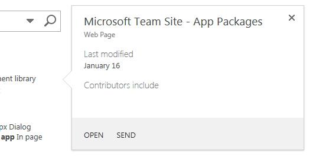

# 反白顯示的內容和增強功能的 SharePoint 主控 SharePoint 增益集與圖說文字控制項
SharePoint 的圖說文字控制項提供彈性的方法來連絡您的使用者和展現您 SharePoint 主控應用程式的功能。您可以在各種方式以符合您的應用程式使用者介面中進行設定。本文說明如何建構此控制項、 將其新增至您的頁面，以及自訂其外觀與行為。當您執行SharePoint 2013網站中的搜尋時，您會看見巨集指令，圖說文字之控制項的範例為其彈出每當您將滑鼠停留在自訂的搜尋結果。圖 1 顯示的單一搜尋結果的圖說文字並顯示內容控制項中的一般事項是一些: 標題、 項目] 索引標籤和項目可採取的動作 ( **開啟**及 **傳送**) 一些資訊。在此例中的資訊和動作相對簡單但還可以看到使用它的兩個優點。首先，它可讓您時，需要時，及第二，它可讓您典雅方式新增功能] 頁面上的頁面中顯示項目相關的其他資訊。
**圖 1。SharePoint 2013 搜尋結果頁面上的 [註標] 控制項的範例**

  
    
    

  
    
    

  
    
    

  
    
    

  
    
    

## 藉由包括 callout.js 檔案的 HTML 網頁讓控制項
<a name="GettingStarted"> </a>

此範例會使用 `SP.SOD.executeFunc`方法以確保指令碼檔案會載入才能執行取決於它的任何程式碼。
  
    
    

```

SP.SOD.executeFunc("callout.js", "Callout", function () {
    });
```

您傳遞到 `SP.SOD.executeFunc`函數函數中包含您想要執行後 callout.js 檔案會載入的程式碼。載入這些檔案之後，您可以使用 `CalloutManager`物件來建立每個頁面元素具有與它相關聯的註標控制項所需的 `Callout`物件。 `CalloutManager`是將每個 `Callout`物件的參照儲存在關聯的陣列內的頁面的單一物件。 `Callout`物件有兩個所需的成員：  `ID`和 `launchPoint`。 `ID`成員是對應到 `Callout`物件中 `CalloutManager`機碼：  `CalloutManager["value of the callout's ID member"]`。 `launchPoint`成員是 HTML 網頁元素。您可以、 例如建立或取得 `div`元素在] 頁面並將其傳 `Callout`物件的成員身分。根據預設，每當使用者按一下 `launchPoint`元素，會出現圖說文字控制項。本範例會示範如何建立的最簡單的可能的圖說文字控制項只有兩個的必要的成員與標題字串。
  
    
    


```

var calloutPageElement = document.createElement("div");
var callout = CalloutManager.createNew({
   ID: "unique identifier",
   launchPoint: calloutPageElement,
   title: "callout title"
});

```

此特定的註標快顯並顯示在控制項頂端的標題每當使用者按一下頁面元素。您可以使用選用的成員的一些非常強大的方式自訂控制項的外觀、 行為、 位置和動作。圖說文字控制項也有組方法可用來建立控制項的執行個體之後設定任何參數的值。
  
    
    


```

callout.set({openOptions:{event: "hover"}});
```

您可以也 `CalloutOptions`物件中的註標成員的所有設定值並再將該物件傳遞至 `createNew`方法。
  
    
    


```
var calloutPageElement = document.createElement("div");
var calloutOptions = new CalloutOptions();
calloutOptions.ID = unique identifier;
calloutOptions.launchPoint = calloutPageElement;
calloutOptions.title = callout title;
var callout = CalloutManager.createNew(calloutOptions);
```


## 自訂註標控制項的外觀
<a name="Appearance"> </a>

您可以使用這些成員來控制的圖說文字顯示。
  
    
    


|**Member**|**目的**|**有效的值 (以粗體顯示的預設值)**|
|:-----|:-----|:-----|
|職稱 <br/> |在控制項的上方顯示標題。 <br/> |字串、 **null** 、 包含 HTML 字串 <br/> |
|內容 <br/> |顯示 HTML 內控制項時沒有 `contentElement`成員的值。 <br/> |包含 HTML、 **null** 字串必須是 null 如果 `contentElement`值 <br/> |
|contentElement <br/> |顯示控制項的內部 HTML 元素時沒有 `content`成員的值。 <br/> |任何 HTML 元素 **null** ，必須是 null 如果 `content`值 <br/> |
|contentWidth <br/> |指定像素為單位的圖說文字本文容器的寬度。讓控制項是 32 像素大於本文寬度您指定此容器兩側各也有 1 像素框線和 15 像素邊框距離。控制項的 CSS  `overflow`屬性設為 `hidden`，因此如果它不符合您指定的寬度內會裁剪您的內容。如果您將此成員在開啟的圖說文字時，變更會立即生效。這不是其他成員，則為 true。 <br/> |240 和 610、 **350** (進行控制 382 像素寬的預設值) 之間的任何數字 <br/> |
|beakOrientation <br/> |指定的方向 beak 或註標控制項的指標。 <br/> |**topBottom** ，看起來像是 (圖 2)： **圖 2。TopBottom 方向圖說文字控制項的 beak 出現**          **leftRight** ，看起來像是 (圖 3)： **圖 3。其中的圖說文字控制項的 beak 會出現在 leftright 方向**         |
   

## 自訂註標控制項的行為方式
<a name="Behavior"> </a>

您可以使用下列成員來控制行為的圖說文字。因為它可讓您指定如何將會開啟控制項的開頭重要 `openOptions`成員並關閉使用者與其互動上時。
  
    
    


|**這些值用於 `openOptions`成員**|**目的**|
|:-----|:-----|
|**{事件:"按一下 ["、 closeCalloutOnBlur: true}** <br/> |使圖說文字控制項時，使用者點選具有滑鼠 `launchPoint`項目顯示並關閉每當使用者移動滑鼠開 `launchPoint`元素。由於 `event`的值是 `click`，  `showCloseButton`選項的值為 **true** 預設且無法變更。這是預設值組合。 <br/> |
| `{event: "hover", showCloseButton: true}` <br/> |使圖說文字控制當使用者停留在具有滑鼠 `launchPoint`項目時出現並關閉每當使用者按一下控制項的右上角的 **X** ] 按鈕。因為 `hover` `event`值即 `closeCalloutOnBlur`的值不適用，且無法進行設定。 <br/> |
| `{event: "click", closeCalloutOnBlur: false}` <br/> |使圖說文字控制當使用者停留在具有滑鼠 `launchPoint`項目時出現並關閉僅每當使用者按一下控制項的右上角的 **X** ] 按鈕。由於 `event`的值是 `click`，  `showClosebutton`選項的值為 **true** 預設且無法變更。 <br/> |
   
這些是您可以設定控制圖說文字之行為的成員。
  
    
    


|**使用此成員**|**目的**|**有效的值 (以粗體顯示的預設值)**|
|:-----|:-----|:-----|
|onOpeningCallback <br/> |執行必須發生前的圖說文字控制項會呈現在] 頁面上的動作。因為 `Callout`物件必須當做參數傳遞至您所提供的函數，您可以使用這個成員之前控制項會呈現設定任何控制項的屬性值。您也可以使用這個成員開始非同步動作的新增或變更控制項的內容。您可以此成員僅一次設定一個值。 <br/> | `function(callout /*=Callout*/) {...}`、 **null** <br/> |
|onOpenedCallback <br/> |執行必須在頁面上呈現並完整的動畫效果的圖說文字控制項之後發生的動作。您可能會使用這個成員操作控制文件物件模型 (DOM)。您可以此成員僅一次設定一個值。 <br/> | `function(callout /*=Callout*/) {...}`、 **null** <br/> |
|onClosingCallback <br/> |執行時關閉的圖說文字控制項，但它已完全從頁面移除之前必須發生的動作。您可以此成員僅一次設定一個值。 <br/> | `function(callout /*=Callout*/) {...}`、 **null** <br/> |
|onClosedCallback <br/> |執行圖說文字控制項已關閉並已從頁面移除之後必須發生的動作。您可以此成員僅一次設定一個值。 <br/> | `function(callout /*=Callout*/) {...}`、 **null** <br/> |
   

## 如何使用圖說文字控制項方法
<a name="CalloutMethods"> </a>

您可以使用這些方法自訂註標控制項的行為。
  
    
    


|**使用此方法**|**目的**|**有效的參數值**|
|:-----|:-----|:-----|
|設定 ({成員: 值}) <br/> |設定值成員之後已建構之控制項的執行個體。 <br/> |定義值的任何註標控制項成員名稱/值組。 <br/> ```var callout = new Callout({openOptions:{event: "click"}});callout.set({openOptions:{event: "hover"}});```|
|getOrientation() <br/> |會傳回指出號的圖說文字控制哪些方式將 `CalloutOrientation`物件。此物件具有四個布林值的成員：  `up`、  `down`、  `left`及 `right`。開啟控制項時，兩個值會是 **true** ，以及兩個則為 **false** ( `up`和 `right`，例如)。 <br/> |不含參數 <br/> |
|addEventCallback (字串 eventName、 CalloutCallback 回撥 <br/> |註冊的圖說文字控制項變更為 `eventName`參數所指定的狀態時就會呼叫回呼函式。 <br/> | `eventName`參數必須是下列值之一：  `opening`、  `open`、  `closing`、  `closed`。 `callback`參數必須是採用的執行個體做為其第一個參數的圖說文字控制項的函數。 <br/> |
|開放 <br/> |顯示在控制項。如果控制項已經開啟或前後，這個方法會傳回 **false** 並沒有任何動作。 <br/> |不含參數 <br/> |
|close(bool useAnimation) <br/> |隱藏控制項。如果控制項是關閉或已關閉，這個方法會傳回 **false** 並沒有任何動作。 <br/> |布林值會指定控制項是否會關閉與動畫。預設為關閉動畫。 <br/> |
|切換。 <br/> |切換控制項的開啟/關閉狀態。 <br/> |不含參數 <br/> |
|addAction(CallOutAction calloutAction) <br/> |將新的 `CalloutAction`新增至 `CalloutAction`物件的圖說文字控制項的陣列。這些物件定義要顯示在控制項的頁尾中的動作。 [如何新增動作至圖說文字控制項](#AddActions)本節說明如何建構這些物件。您可以只建立控制項的執行個體之後新增動作。控制項可以有不超過三個動作，而如果您嘗試新增更多您會得到例外狀況。 <br/> | `CalloutAction`物件。 <br/> |
|refreshActions() <br/> |重新載入所有已新增到控制項的動作。您可以使用此方法來變更、 啟用或停用動作控制在開啟時發生。 <br/> |不含參數 <br/> |
   

## 如何新增動作至圖說文字控制項
<a name="AddActions"> </a>

您已建立之圖說文字控制項的執行個體之後，您加入動作。圖說文字巨集指令可以由單一動作或] 功能表中的動作所組成。您可以新增註標控制項最多三個動作。建立註標巨集指令之後, 新增至 `CalloutControl`物件以其 `addAction`方法。此範例巨集指令會在瀏覽器中開啟新的視窗之後，使用者點選文字。
  
    
    

```

//Create CalloutAction
var calloutAction = new CalloutAction({
            text: "Open window"
            onClickCallback: function() {                
                window.open(url);
            }
        });

//Add Action to an instance of the CalloutControl        
        myCalloutControl.addAction(calloutAction);
```

您也可以針對 `CalloutAction`成員 `CalloutActionOptions`物件中的所有設定值並將該物件傳遞至 `CalloutAction`建構函式。
  
    
    


```

//Create CalloutAction
var calloutActionOptions = new CalloutActionOptions();
calloutActionOptions.text = "Open window";
actionOptions.onClickCallback = function() {
    window.open(url);
};
var calloutAction = new CalloutAction(calloutActionOptions);

//Add Action to an instance of the CalloutControl        
        myCalloutControl.addAction(calloutAction);
```

您可以使用這些成員來定義行為的圖說文字巨集指令。
  
    
    


|**使用此成員**|**目的**|**有效的值 (以粗體顯示的預設值)**|
|:-----|:-----|:-----|
|文字 (必要) <br/> |顯示巨集指令的文字標籤。 <br/> |**null** 字串 <br/> |
|onClickCallback <br/> |定義使用者點選的圖說文字動作標籤上時所發生的動作。 <br/> | `function(calloutAction /*=CalloutAction*/) {...}`、 **null** <br/> |
|isEnabledCallback <br/> |定義執行之前圖說文字線會顯示並決定是否啟用巨集指令的回呼函數。如果此函數會傳回 **true** ，圖說文字線會顯示已啟用巨集指令。如果它會傳回 **false** ，圖說文字線會顯示巨集指令的文字，但會停用巨集指令。 <br/>  `function(calloutAction /*=CalloutAction*/) {...}`、 **null** <br/> |
|isVisibleCallback <br/> |定義執行之前圖說文字線會顯示並決定是否要顯示的巨集指令文字回呼函式。如果此函數會傳回 **true** ，圖說文字線會顯示巨集指令的文字。如果它會傳回 **false** ，圖說文字線會隱藏巨集指令的文字。其他動作將會向左移動進行的隱藏巨集指令。 <br/> | `function(calloutAction /*=CalloutAction*/) {...}`、 **null** <br/> |
|工具提示 <br/> |使用者停留於圖說巨集指令文字時顯示的文字。 <br/> |**null** 字串 <br/> |
|disabledTooltip <br/> |當使用者停留在註標巨集指令文字和圖說文字動作的顯示文字 (如果 `isEnabledCallback`函數會傳回 **false** ) 已停用。 <br/> |**null** 字串 <br/> |
|menuEntries <br/> |定義動作，而不是單一動作] 的功能表。下一節說明如何建立 `CalloutActionMenuEntry`並將其新增至 `CalloutAction`物件。 <br/> |[ `CalloutActionMenuEntry`，...]、 null <br/> |
   

### 如何將動作功能表新增至圖說文字控制項

圖說文字動作包含時，而不是單一動作] 功能表，使用者會看見註標巨集指令的文字，如圖 4 所示] 旁的向下箭號。
  
    
    

**圖 4。當使用者按一下 [動作] 標籤旁的箭號的圖說文字巨集指令會顯示功能表**

  
    
    

  
    
    

  
    
    
您可以建立為您想要並將它們在陣列中，傳遞 `CalloutAction`物件的 `menuEntries`成員的值新增至的圖說文字巨集指令的功能表項目數目。
  
    
    


```

//Create two menu entries.
var menuEntry1 = new CalloutActionMenuEntry("Entry One", calloutActionCallbackFunction, "/_layouts/images/DOC16.GIF");
var menuEntry2 = new CalloutActionMenuEntry("Some Other Entry", calloutActionCallbackFunction, "/_layouts/images/XLS16.GIF");

//Add the menu entries to the callout action.
var calloutAction = new CalloutAction({
   text: "MENU W/ ICONS",
   menuEntries: [menuEntry1, menuEntry2]
})

//Add the callout action to the callout control.
callout.addAction(calloutAction);

```

 `CalloutActionMenuEntry`建構函式會有三個參數。前兩個參數是必要的。第三個是選擇性的但它很有幫助因為它可讓您顯示圖示的文字。
  
    
    

- 將字串做為第一個參數來顯示每個項目的文字標籤。
    
  
- 傳遞函數做為第二個參數來定義使用者按一下的功能表項目時發生的動作。
    
  
- 傳遞含有您想要顯示的文字標籤左邊的圖示 URL 的字串。
    
  

## 如何使用CalloutManager來建立和管理的圖說文字控制項的執行個體
<a name="UseCalloutManager"> </a>

 `CalloutManager`單一物件儲存在頁面上每個 `Callout`物件的參照。它在其中的每個控制項 `ID`值是索引鍵關聯陣列儲存每個執行個體的圖說文字控制項。 `CalloutManager`包含方法可協助您建立及管理其儲存的 `Callout`物件。
  
    
    


|**使用此方法**|**目的**|**有效的參數值**|
|:-----|:-----|:-----|
|createNew(members) <br/> |建立新的 `Callout`物件。當您這樣做時，  `CalloutManager`新增控制項的項目關聯的陣列，所需的成員 `ID`做索引鍵的值。 <br/> |將值指派給您想要使用每個成員關聯陣列。 `ID`和 `launchPoint`成員是必要的。 <br/> |
|createNewIfNecessary (成員) <br/> |如果您傳遞做為參數 `launchPoint`都不會有註標建立 `Callout`物件已經指派給它的控制項。 <br/> |將值指派給您想要使用每個成員關聯陣列。 `ID`和 `launchPoint`成員是必要的。 <br/> |
|getFromLaunchPoint: 函數 (/*@type(HTMLElement)*/launchPoint) <br/> |取得在函數中所提供的 `launchPoint`相關聯的 `Callout`物件。 如果 `launchPoint`沒有指派給它的 `Callout`物件這個方法會擲回例外狀況。 <br/> |不含參數 <br/> |
|getFromLaunchPointIfExists: 函數 (/*@type(HTMLElement)*/launchPoint) <br/> |取得在函數中所提供的 `launchPoint`相關聯的 `Callout`物件。 此方法會傳回 null 如果 `launchPoint`沒有指派給它的 `Callout`物件。 <br/> |不含參數 <br/> |
|getFromCalloutDescendant: 函數 (/*@type(HTMLElement)*/descendant) <br/> |取得與指定元素的函數中所提供的 HTML 元素相關聯的 `Callout`物件。此元素可以是任何註標元素的子系。 例如，您無法傳遞 `contentElement`成員時所建立的 `Callout`物件指派的值。如果沒有與它相關聯的 `Callout`物件的子代。 此方法會擲回例外狀況。 <br/> |不含參數 <br/> |
|closeAll() <br/> |會關閉所有開啟的 `Callout`物件。此方法會傳回 true 如果會在關閉至少一個圖說文字。 <br/> |不含參數 <br/> |
|isAtLeastOneCalloutOpen() <br/> |查看是否已開啟至少一個圖說文字。 <br/> |不含參數 <br/> |
   

## 如何將位置] 頁面上的 [註標] 控制項
<a name="Positioning"> </a>


|**使用此成員**|**目的**|**有效的值 (以粗體顯示的預設值)**|
|:-----|:-----|:-----|
|boundingBox <br/> |指定將會當做圖說文字控制項 `offsetParent`相等的 HTML 元素。根據預設，這的預設值將是圖說文字控制項的 `offsetParent`，但是您可以使用這個成員來確定控制項位於正確。圖說文字控制項會嘗試將使其可看見此方塊位置本身擷取。它會保持可見其內 (從上到下或從左到右，根據 beak 方向) 變更方向。 <br/> |任何 HTML 元素， **包含註標控制項之 HTML 元素 offsetParent** <br/> |
|positionAlgorithm <br/> |覆寫預設的定位的圖說文字控制項的演算法。下節說明如何使用 `calloutPositioningProxy`物件來撰寫定位的圖說文字控制項的演算法。 <br/> |**CalloutOptions.prototype.defaultPositionAlgorithm**, `function(calloutPositioningProxy) { ... }` <br/> |
   

### 如何撰寫位置與 calloutPositioningProxy 演算法

 `calloutPositioningProxy`物件包含方法和屬性可用來覆寫預設的註標控制項使用定位邏輯。例如，如果您想要控制項看起來下方和右邊的所有 `launchPoint`元素的時間，撰寫定位演算法看起來像是下列。
  
    
    

```

function alwaysGoDownAndRight(calloutPositioningProxy)  {
    calloutPositioningProxy.moveDownAndRight();
} 

```

您再傳送該函數 `Callout`物件的 `positionAlgorithm`成員的值。您可以執行的動作時建立 `Callout`，或更新版本所設定的值。
  
    
    


```

callout.set({positionAlgorithm: alwaysGoDownAndRight});

```

您可以一律仔細定位邏輯來啟動您的瀏覽器JavaScript主控台 (Internet Explorer F12 開發人員工具，例如) 的預設值。
  
    
    


```

CalloutOptions.prototype.positionAlgorithm.toString()
```

您可以使用 `CalloutPositioningProxy`物件中的這些方法來撰寫自己的定位邏輯。
  
    
    


|**方法**|**描述**|
|:-----|:-----|
|isCalloutTooFarTop() <br/> |會傳回布林值。 <br/> |
|isCalloutTooFarRight() <br/> |會傳回布林值。 <br/> |
|isCalloutTooFarBottom() <br/> |會傳回布林值。 <br/> |
|isCalloutTooFarLeft() <br/> |會傳回布林值。 <br/> |
|isCalloutLeftOfHardBoundingBox() <br/> |會傳回布林值。 **true**、 左側的控制項座落外其容器項目。不可見與使用者無法向上捲動給它。 <br/> |
|isCalloutRightOfHardBoundingBox() <br/> |會傳回布林值。 **true**，將控制項右邊座落外其容器項目。不可見與使用者無法向上捲動給它。 <br/> |
|isCalloutAboveHardBoundingBox() <br/> |會傳回布林值。 **true**、 控制項頂端座落外其容器項目。不可見與使用者無法向上捲動給它。 <br/> |
|isCalloutBelowHardBoundingBox() <br/> |會傳回布林值。 **true**、 控制項底端座落外其容器項目。不可見與使用者無法向上捲動給它。 <br/> |
|isOrientedUp() <br/> |會傳回布林值。 <br/> |
|isOrientedDown() <br/> |會傳回布林值。 <br/> |
|isOrientedLeft() <br/> |會傳回布林值。 <br/> |
|isOrientedRight() <br/> |會傳回布林值。 <br/> |
|moveUpAndRight() <br/> |會傳回 nothing。變更控制項的方向。 <br/> |
|moveUpAndLeft() <br/> |會傳回 nothing。變更控制項的方向。 <br/> |
|moveDownAndRight() <br/> |會傳回 nothing。變更控制項的方向。 <br/> |
|moveDownAndLeft() <br/> |會傳回 nothing。變更控制項的方向。 <br/> |
|moveTowardsOppositeQuadrant() <br/> |會傳回 nothing。變更控制項的方向。 <br/> |
|flipHorizontal() <br/> |會傳回 nothing。變更控制項的方向。 <br/> |
|flipVertical() <br/> |會傳回 nothing。變更控制項的方向。 <br/> |
|numberOfEdgesCollidingWithBoundingBox() <br/> |會傳回整數介於 0 和代表邊緣數目的 4 圖說文字線會與可見的邊界。 例如，如果控制項頂端由頂端的文件本文裁剪，呼叫 `moveUpAndRight()`方法之後，  `numberOfEdgesCollidingWithBoundingBox()`方法會傳回數大於 1。 <br/> |
   
此位置的演算法進行移文字上方或下方的控制項。 `CalloutPositioningProxy` `isRTL`屬性會告訴您文字是否會顯示為從右至左的語言。您檢查這個屬性來確定該控制項永遠都會正確相對於頁面的文字。
  
    
    


```
function examplePositionAlgorithm(calloutPositioningProxy) {
    if (!calloutPositioningProxy.isRTL) {
        calloutPositioningProxy.moveDownAndRight();
        if (calloutPositioningProxy.isCalloutTooFarBottom()) {
            calloutPositioningProxy.moveUpAndRight();
        }
    }
    else {
        calloutPositioningProxy.moveDownAndLeft();
        if (calloutPositioningProxy.isCalloutTooFarBottom()) {
            calloutPositioningProxy.moveUpAndLeft();
        }
    }
}
callout.set({positionAlgorithm: examplePositionAlgorithm});

```

此位置的演算法變更控制項的預設方向為 `downAndRight`而不是 `upAndRight`，但它會使用預設的演算法如果有任何衝突。
  
    
    


```

function tryDownAndRightThenGoDefault(calloutPositioningProxy) {
    if (!calloutPositioningProxy.isRTL)
        calloutPositioningProxy.moveDownAndRight();
    else
        calloutPositioningProxy.moveDownAndLeft();
    
    if (calloutPositioningProxy.numberOfEdgesCollidingWithBoundingBox() > 0)
        return CalloutOptions.prototype.positionAlgorithm.apply(this, arguments);
};
callout.set({positionAlgorithm: tryDownAndRightThenGoDefault});

```


## 其他資源
<a name="bk_addresources"> </a>


-  [SharePoint 2013： SharePoint 主控的增益集中使用清單檢視、 註標與 dialogs](http://code.msdn.microsoft.com/officeapps/SharePoint-2013-Use-list-cb3e4e14)
    
  
-  [開始建立 SharePoint 主控 SharePoint 增益集](get-started-creating-sharepoint-hosted-sharepoint-add-ins.md)
    
  
-  [使用 Napa Office 365 開發工具建立基本 SharePoint 主控增益集 (英文)](create-a-basic-sharepoint-hosted-add-in-by-using-napa-office-365-development-too.md)
    
  
-  [UX 設計的 SharePoint 增益集](ux-design-for-sharepoint-add-ins.md)
    
  

  
    
    
