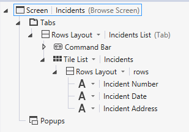
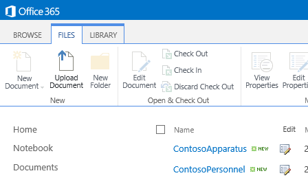
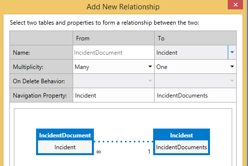
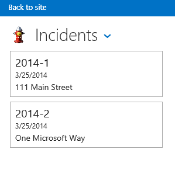

# 事件管理員： 的雲端商務增益集教學課程
使用 Visual Studio 中的 **雲端商務增益集**範本，您可以建立 SharePoint 裝載在其行動裝置使用者可以檢視、 新增、 並使用現代、 觸控導向電話與平板電腦等裝置更新遠端位置的資料。在本教學課程中，您將建立增益集的虛構 Contoso 消防隊處理上場景附隨管理。逐步解說涵蓋建置的雲端商務增益集以及更進階的概念，例如整合 SharePoint 清單與文件庫的核心概念。您可以從 MSDN 範例庫下載事件管理範例應用程式和相關聯的檔案: [事件管理員： 雲端商務增益集教學課程](http://code.msdn.microsoft.com/Incident-Manager-A-Cloud-c32d9b04)。
## 必要條件

此逐步解說需要 Visual Studio 2013 更新 1 和 Microsoft 開發人員工具的 Visual Studio 2013 - 2014 年 3 月更新。
  
    
    
若要裝載增益集，您也需要在 Office 365，您可以從 [註冊 Office 365 開發人員網站](http://go.microsoft.com/fwlink/?LinkId=263490)中取得的 SharePoint 開發人員網站。
  
    
    

> [!注意事項]
> 您也可裝載的雲端商務增益集在 SharePoint 2013 網站上。
  
    
    


## 建立事件管理應用程式
<a name="add-in"> </a>

Contoso 消防隊回應會觸發、 醫療輔助工具、 motor vehicle 事故和其他緊急事件。每個緊急事件需要也不少文件事件。且目前輸入資訊使用紙張表單上-場景，然後將資訊輸入其電腦系統時其返回 firehouse。他們最近採用 SharePoint for Office 365 進行記錄管理和其已購買啟用輸入的資料上-場景事件指揮官平板電腦。
  
    
    
您會建立行動增益集將會用來輸入事件的基本資訊。由於許多事件還涉及醫療輔助工具、 增益集將也需要能夠輸入多個事件病患資料。本節中您會建立與基本的應用程式，學習的雲端商務增益集隨時基礎。
  
    
    

### 建立專案


1. 功能表列上，選擇 [ **檔案**、 **新增**、 **專案**]。
    
    [新增專案] 對話方塊隨即開啟。
    
  
2. 在範本清單中，展開 [ **Visual Basic**或 **Visual C#** ] 節點、 展開 [ **Office/SharePoint** ] 節點、 選擇 [ **增益集**] 節點，然後選擇的 **雲端商務增益集**範本，如圖 1 所示。
    
   **圖 1。雲端商務增益集範本**

  

     
  

  

  
3. 在 [ **名稱**] 文字方塊中輸入IncidentManager，，然後選擇 [ **確定**] 按鈕。
    
    **新的雲端商務增益集**精靈] 隨即開啟。
    
  
4. 在 [ **新的雲端商務增益集**精靈] 中輸入您的 Office 365 開發人員網站的 URL，，然後選擇 [ **完成**] 按鈕。
    
    URL 應該採取表單 https://  _MySite_.sharepoint.com/sites/Developer/。
    
    **IncidentManager**解決方案之四個專案新增至 [方案總管: 最上層的 **IncidentManager**專案、 **IncidentManager.HTMLClient**專案、 **IncidentManager.Server**專案和 **IncidentManager.SharePoint**專案。
    
    
  
    
    

    
    在下一個步驟中，您將新增至代表一群事件的實體。實體建立增益集內建的 SQL Server 資料庫資料表。它會儲存每個事件的相關資訊。
    
  

### 若要新增的事件實體


1. 在 [ **開始**] 畫面中，選擇 [ **建立新的資料表**超連結。
    
    實體設計工具會隨即開啟。
    
  
2. 在 [ **屬性**] 視窗中， **Name**屬性，如文字方塊中輸入事件。
    
  
3. 在實體設計工具中，選擇 **< 新增屬性 >**連結並輸入IncidentNumber。
    
  
4. 選擇 [ Enter鍵，接受預設的 **類型**、 **String**，並離開選取 **所需**的核取方塊。
    
  
5. 在 [ **屬性**] 視窗中，選取 **包含在唯一索引**] 核取方塊。
    
    事件號碼必須是唯一的每個事件。
    
  
6. 選擇 **< 新增屬性 >**連結和輸入IncidentDate，然後按 **Tab**鍵。
    
  
7. 在 [ **類型**] 欄中，選擇 [ **日期**]，然後選擇Tab鍵按兩次。
    
  
8. 在 [ **名稱**] 欄中輸入 [ DispatchTime，然後在 [ **類型**] 欄中選擇 [ **DateTime**資料類型。
    
  
9. 在下一步] 列輸入IncidentType ，然後選擇 [ **Integer**做為資料類型。
    
  
10. 在下一步] 列輸入IncidentAddress ，然後選擇 [ **String**做為資料類型。
    
  
11. [下一步] 列中輸入ReportingPartyName及選擇的資料型別為 **String** ，然後清除 [ **必要**] 核取方塊。
    
    有時事件會回報匿名，所以您不想需要在此欄位的值。
    
  
12. 在下一步] 列輸入ReportingPhone ，然後選擇 [ **PhoneNumber**資料類型。
    
    **電話號碼**是自訂商務類型的自動設定格式，並提供電話號碼的驗證。
    
  
13. 在 [ **屬性**] 視窗中，選擇 [ **電話號碼格式**的超連結。
    
    **電話號碼格式**] 對話方塊隨即開啟。
    
  
14. 在 **電話號碼格式**] 對話方塊中，選擇適當格式的地區設定，然後按將移至清單頂端的 [ **上移**] 按鈕。
    
  
15. 在 [ **測試電話號碼驗證**] 文字方塊中輸入電話號碼並確認其具有正確的格式，然後選擇 [ **儲存**] 按鈕。
    
    **電話號碼**商務類型會處理格式設定和驗證您在任何] 畫面上的出現的位置。
    
  
16. 在下一步] 列輸入IncidentCommander ，然後選擇 [ **Person**資料類型。
    
    **人員**商務類型提供提取使用者資訊從 Active Directory SharePoint 使用者設定檔服務連線。
    
    圖 2 顯示完成的實體。
    

   **圖 2。事件實體**

  

     
  

    
  
    
    

    
    在下一個步驟中，您將新增可讓使用者選擇一組固定值從選擇清單。在此例中消防隊有一組的常見的事件類型。
    
  

### 若要新增的選擇清單


1. 在實體設計工具中，選擇 [ **IncidentType** ] 欄位中，然後選擇 [ **內容**] 視窗中的 [ **選擇清單**超連結。
    
    **選擇清單**] 對話方塊隨即開啟。
    
  
2. 在 [ **選擇清單**] 對話方塊中，選擇 [ **新增值**] 連結並輸入1。
    
  
3. 在 [ **顯示名稱**] 欄中，輸入 **消防 - 商業**。
    
  
4. 輸入下列值和顯示名稱、，然後選擇 [ **確定**] 按鈕。
    

|**值**|**顯示名稱**|
|:-----|:-----|
|2 <br/> |觸發-住家 <br/> |
|3 <br/> |消防 - 單一引擎回應 <br/> |
|4 <br/> |輔助工具-進階 Life 支援 <br/> |
|5 <br/> |輔助工具-基本 Life 支援 <br/> |
|6 <br/> |Motor Vehicle 衝突 <br/> |
|7 <br/> |服務通話 <br/> |
|||
   

    在執行階段顯示名稱的清單呈現給使用者。當進行選擇時、 對應 **Integer**值將會儲存在資料庫中。
    
    
  
    
    

    
    在下一個步驟中，您將新增病患實體。許多消防隊事件涉及醫療輔助工具，並建立單一事件通常涉及多個病患。
    
  

### 若要新增的病患實體


1. 在 **方案總管**] 中開啟 [ **資料來源**] 節點的快顯功能表並選擇 [ **新增表格**。
    
  
2. 在 [ **屬性**] 視窗中， **Name**屬性，如文字方塊中輸入病患。
    
  
3. 在實體設計工具中，新增下列欄位圖 3 所示：
    
   **圖 3。完成的病患實體**

  

     
  

    
  
    
    

    
    在下一個步驟中，您將會定義事件與病患實體之間的關係。事件可以有多個相關的病患。
    
  

### 若要定義關聯性


1. 在 **方案總管**] 中開啟 **Incidents.lsml**節點的快顯功能表並選擇 [ **開啟**。
    
  
2. 在工具列上，選擇 [ **關係**] 按鈕。
    
    **新增新的關聯**] 對話方塊隨即出現。
    
  
3. 在 [ **新增新的關聯**] 對話方塊的 [ **名稱**] 列中，[ **到**] 欄中選擇 **病患**。
    
  
4. 在 [ **重數**] 列中，[ **從**] 欄中選擇 [ **零或一**。
    
  
5. 在 [ **至**] 欄中，選擇 **許多**，然後選擇 **[確定]**按鈕。
    
    圖 4 顯示的關係。
    

   **圖 4。事件與病患關係**

  

     
  

    這會建立為零或一對多事件和病患之間的關聯。事件記錄不必須要有病患但每位病患都必須具有相關的事件記錄。
    
    
  
    
    

    
    在下一個步驟中，您將新增檢視、 新增和編輯病患和事件記錄的畫面。
    
  

### 若要新增的畫面


1. 在 **方案總管**] 中開啟 **Incidents.lsml**節點的快顯功能表並選擇 [ **開啟**。
    
  
2. 在螢幕設計工具] 的 **觀點**列上，選擇 [ **HTML 用戶端**] 索引標籤，然後在工具列上選擇 [ **螢幕**] 按鈕。
    
    **新增新的畫面**] 對話方塊隨即開啟。
    
  
3. 在 [ **新增新的畫面**] 對話方塊的 [ **選取] 畫面上的範本**] 清單中選擇 [ **常見螢幕設定**。
    
  
4. 在 **畫面上設定名稱**] 文字方塊中，輸入事件。
    
  
5. 在 **畫面上的資料**] 清單中，選擇 [ **事件**]。
    
  
6. 選取的 **事件詳細資料**和 **事件病患**] 核取方塊，然後選擇 [ **確定**] 按鈕。
    
    圖 5 顯示 [新增新的畫面] 對話方塊。
    

   **圖 5。新增新畫面] 對話方塊**

  

     ![[事件] 畫面集](images/CBA_IM_4.PNG)
  

    瀏覽、 檢視詳細資料及新增/編輯畫面會新增至 HTMLClient 專案。瀏覽] 畫面上會自動設為應用程式的主畫面及所需的命令以啟動 [檢視並自動提供新增/編輯畫面。
    
  
7. 功能表列上，選擇 [ **偵錯**、 執行應用程式的 [ **開始偵錯**]。 如果出現 [ **連線至 SharePoint** ] 對話方塊，請輸入您的使用者名稱和密碼。
    
  
8. 如果出現提示，請選擇 [ **信任該**按鈕。增益集將會開啟空白的畫面。請注意螢幕標題 **IncidentsSet**。
    
  
9. 選擇 [ **新增**] 按鈕。
    
    [ **事件**] 對話方塊隨即開啟。請注意雖然您可以輸入事件的資料，會新增病患沒有佈建。您將自訂的畫面修正的問題以及其他設計。
    
    
  
    
    

    
    在下一個步驟中，您將自訂瀏覽] 畫面。
    
  
10. 關閉 [ **事件**] 對話方塊，然後關閉 [返回設計模式中的瀏覽器視窗。
    
  

### 若要自訂的瀏覽] 畫面


1. 在 **方案總管**] 畫面上，開啟 **BrowseIncidentsSet.lsml**節點的快顯功能表並選擇 [ **開啟**。
    
  
2. 在 [ **屬性**] 視窗中，選擇 [ **顯示名稱**屬性並輸入事件。
    
  
3. 在螢幕設計工具中，選擇 [ **資料列配置 | 列**] 節點，然後展開 [ **新增**] 清單並選擇 **事件地址**。
    
  
4. 選擇 [ **發送時間**] 節點，然後選擇 [在工具列上的 [[ **刪除**] 按鈕。
    
    圖 6 顯示完成] 畫面上的版面配置。
    

   **圖 6。瀏覽] 畫面上的版面配置**

  

     
  

    在執行階段] 畫面上會顯示每一個事件，如磚和每個並排顯示會顯示事件的數字、 日期和地址。
    
    
  
    
    

    
    在下一個步驟中，您將自訂 [新增/編輯畫面。
    
  

### 若要自訂新增/編輯畫面


1. 在 **方案總管**] 畫面上，開啟 **AddEditIncidents.lsml**節點的快顯功能表並選擇 [ **開啟**。
    
  
2. 選擇 **事件位址**、 **報告名稱**和 **報告電話**節點並將其拖曳 **資料列配置 | 左**] 區段中的 **事件類型**的節點下方。
    
  
3. 選擇 [ **發送時間**] 節點，然後在 [ **屬性**] 視窗中清除 **日期選擇器已啟用**] 核取方塊。
    
    日期不需要它一律為相同的事件的日期之後。
    
  
4. 在螢幕設計左邊的窗格，選擇 [ **新增病患**連結圖 7 所示。
    
   **圖 7。新增病患連結**

  

     ![[新增病患] 連結](images/CBA_IM_5.PNG)
  

  

  
5. 在左窗格中，選擇 [ **病患**] 節點並將其拖曳在中央窗格的 [ **事件指揮官**] 節點下。
    
    圖 8 顯示完成] 畫面上的版面配置。
    

   **圖 8。新增/編輯螢幕版面配置**

  

     ![[新增/編輯] 畫面版面配置](images/CBA_IM_5a.PNG)
  

    
  
    
    

    
    在下一個步驟中，您將建立畫面，以新增病患記錄。
    
  

### 若要新增病患畫面


1. 在 **方案總管**] 畫面上，開啟 **AddEditIncidents.lsml**節點的快顯功能表並選擇 [ **開啟**。
    
  
2. 在螢幕設計工具] 下 **資料列配置 |詳細資料 (] 索引標籤)**節點中，開啟 **命令列**節點的快顯功能表並選擇 [ **新增] 按鈕**。
    
  
3. 在 [ **新增] 按鈕**] 對話方塊中，展開 **showTab**清單 **病患**] 群組中選擇 [ **addAndEditNew**、，然後選擇 **[確定]**按鈕。
    
    **新增新的畫面**] 對話方塊隨即開啟。
    
  
4. 在 [ **新增新的畫面**] 對話方塊中，接受預設值並選擇 **[確定]**按鈕。
    
    **AddEditPatient** ] 畫面上會在螢幕設計工具中開啟。
    
  
5. 在 [屬性] 視窗中，選擇 [ **顯示名稱**屬性並輸入新增病患。
    
  
6. 在螢幕設計工具中，選擇 [ **事件**] 節點並將其刪除。
    
    [ **事件**] 欄位中不需要自病患已與事件關聯。
    
    圖 9 顯示完成] 畫面上的版面配置。
    

   **圖 9。新增/編輯螢幕版面配置**

  

     ![[新增/編輯] 畫面版面配置](images/CBA_IM_6.PNG)
  

    
  
    
    

    
    在下一個步驟中，您用來執行一些資料增益集] 和 [加入。
    
  

### 若要測試增益集


1. 在功能表列中，選擇 [偵錯] > [開始偵錯]。
    
  
2. 在執行增益集、 選擇 [ **新增**] 按鈕。
    
    圖 10 所示開啟 **事件**快顯功能表。
    

   **圖 10。事件快顯功能表**

  

     ![[新增事件] 快顯畫面](images/CBA_IM_7.PNG)
  

  

  
3. 在 [ **事件數**] 文字方塊輸入2014年-1。
    
  
4. **事件日期**] 和 [ **發送時間**] 欄位中使用 **日期選擇器**和 **時間選擇器**控制項選取日期和時間。
    
  
5. 在 **事件類型**] 清單中，選擇 [ **輔助工具-基本 Life 支援**。
    
  
6. 在 [ **事件地址**] 文字方塊中輸入您的城市的街道地址。
    
    不包含-市/鎮、 狀態或郵遞區號。假設消防隊只提供一個縣/市。
    
  
7. **事件指揮官** **人員選擇器**控制項中輸入您的 SharePoint 網站上的使用者名稱。
    
    請注意當您輸入的所有比對清單會顯示名稱。
    
  
8. 選擇 [ **新增病患**] 按鈕。
    
    圖 11 所示開啟 **新增病患**快顯功能表。
    

   **圖 11。新增病患快顯功能表**

  

     ![[新增病患] 快顯畫面](images/CBA_IM_8.PNG)
  

  

  
9. 輸入病患資訊，然後選擇 [ **儲存**] 按鈕。
    
    您新增病患的名稱會顯示在 **事件**快顯功能表。如果您想，您可以新增更多的病患。
    
  
10. **事件**快顯功能表上選擇 [ **儲存**] 按鈕。
    
    如果您已追蹤的指示，您會看到驗證錯誤訊息。 **報告的電話**欄位是必要的欄位。雲端商務增益集具有內建驗證的必要欄位。
    
  
11. 輸入電話號碼，然後選擇 [ **儲存**] 按鈕。
    
    並排顯示會顯示在使用事件的數字、 日期和地址首頁的 [ **事件**] 畫面上。
    
  
12. 選擇 [開啟事件檢視畫面並排顯示。
    
    請注意 **報告電話**] 欄位會顯示為超連結，提供給您的預設電話應用程式的直接存取。
    
  
13. 選擇 [開啟 **AddEditIncidents** ] 畫面上，並選擇 [ **放棄**] 按鈕以返回 [ **檢視**] 畫面上的 [ **編輯**] 按鈕。
    
  
14. 選擇要顯示的病患清單 **病患**] 索引標籤，然後選擇 [病患並排顯示。
    
    請注意其不會開啟病患檢視畫面。那是因為尚未建立一個。
    
  
15. 若要返回 [設計模式中瀏覽器中選擇 [ **關閉**] 按鈕。
    
    
  
    
    

    
    在下一個步驟中，您將新增至檢視病患螢幕。
    
  

### 若要新增檢視畫面


1. 在 **方案總管**] 畫面上，開啟 **Patients.lsml**節點的快顯功能表並選擇 [ **開啟**。
    
  
2. 在實體設計工具] 的 **觀點**列上，選擇 **HTMLClient**，，然後在工具列上選擇 [ **螢幕**] 按鈕。
    
    **新增新的畫面**] 對話方塊隨即開啟。
    
  
3. 在 [ **新增新的畫面**] 對話方塊的 [ **選取] 畫面上的範本**] 清單中選擇 [ **檢視詳細資料] 畫面**。
    
  
4. 在 **畫面上名稱**] 文字方塊中，輸入 **ViewPatient**、 在 **畫面上的資料**] 清單中，選擇 **病患**，然後選擇 [ **確定**] 按鈕。
    
    **ViewPatient** ] 畫面上會在螢幕設計工具中開啟。
    
  
5. 在螢幕設計工具] 下 **資料列配置 |詳細資料 (] 索引標籤)**節點中，開啟 **命令列**節點的快顯功能表並選擇 [ **新增] 按鈕**。
    
  
6. 在 [ **新增] 按鈕**] 對話方塊中，展開 **showTab**清單 **病患**] 群組中選擇 [ **編輯**，然後選擇 **[確定]**按鈕。
    
  
7. 執行應用程式，並確認您可以立即檢視並編輯病患的記錄。
    
    
  
    
    

    
    您現在內建功能完整的事件管理增益集，但是沒有更多運用雲端商務增益集。在下一步] 區段中，您將了解如何運用附隨管理增益集從 SharePoint 網站上的資源。
    
  

## 整合 SharePoint 資源
<a name="integrate"> </a>

Contoso 消防隊已經開始使用事件管理員 」 增益集，並就一般軟體開發專案中他們現在所要求的新功能。除了事件及病患的資訊，他們也需要管理等消防用和人員的資源。他們已經具備用和人員清單在其 SharePoint 網站，讓您將會使用這些清單作為其他資料來源中之增益集。
  
    
    
第一個步驟是將幾個預先填入的清單範本新增至您的開發人員網站。
  
    
    

### 若要新增清單範本


1. 功能表列上，選擇 [ **偵錯**，若要執行的增益集的 [ **開始偵錯**]。
    
  
2. 在執行增益集的 chrome 列上，選擇 [ **回站台**連結瀏覽至您的 SharePoint 開發人員網站，如圖 12 中所示。
    
   **圖 12。最下層網站連結**

  

     
  

  

  
3. 在 [ **開發人員**] 索引標籤上選擇 [ **網站內容**] 連結。
    
  
4. 在 [ **網站內容**] 頁面上選擇 [ **設定**] 連結，如圖 13 所示。
    
   **圖 13。[設定] 連結**

  

     ![[網站設定] 連結](images/CBA_IM_8b.PNG)
  

  

  
5. 在 [ **網站設定**] 頁面的 [ **網站設計工具庫**] 清單中選擇 **清單範本**連結圖 14 所示。
    
   **圖 14。清單範本連結**

  

     ![[清單範本] 清單](images/CBA_IM_8c.PNG)
  

  

  
6. **清單範本庫**] 索引標籤上選擇 [ **檔案**] 索引標籤，然後在功能區上選擇 [ **上傳文件**] 按鈕。
    
  
7. 在 [ **新增範本**] 對話方塊中，選擇 [ **瀏覽**] 按鈕，然後瀏覽至 [下載事件管理範例 [ **資源**] 資料夾。
    
  
8. 選擇 [ **ContosoApparatus.stp**檔案並選擇 [ **開啟**] 按鈕，然後選擇 **[確定]**按鈕。
    
  
9. 在 [ **清單範本庫**] 對話方塊中，選擇 [ **儲存**] 按鈕。
    
  
10. 重複此程序並上傳 **ContosoPersonnel.stp**檔案。
    
   **圖 15。上傳的檔案**

  

     
  

  

  
11. 選擇 [ **網站內容**] 連結，並在 [ **網站內容**] 頁面上選擇 [ **增益集新增**並排顯示。
    
  
12. 在 **網站內容 > 增益集**] 頁面上，選擇 [ **Contoso 用**並排顯示。
    
    > [!注意事項]
      > 您可能需要移至 [增益集來尋找 **Contoso 用**並排顯示的第二頁。
13. 在 [ **新增自訂清單**] 對話方塊中，選擇 [ **名稱**] 文字方塊中輸入Contoso 用，與然後選擇 [ **建立**] 按鈕。
    
  
14. 重複此程序並新增 **Contoso 人員**清單中，輸入Contoso 人員做為名稱。
    
  
15. 在 [ **網站內容**] 頁面上，確認 **Contoso 用**與 **Contoso 人員**清單現在出現。
    
    
  
    
    

    
    在下一個步驟中，您將做為資料來源新增 SharePoint 網站。
    
  

### 若要新增的 SharePoint 資料來源


1. 在 **方案總管**] 中開啟 [ **資料來源**] 節點的快顯功能表並選擇 [ **新增資料來源**。
    
    **附加資料來源精靈]**隨即開啟。
    
  
2. 在 **附加資料來源精靈]**中，選擇 [ **SharePoint** ] 圖示圖 16 所示，然後選擇 [ **下一步**] 按鈕。
    
   **圖 16。SharePoint 資料來源**

  

     
  

  

  
3. 在 [ **請輸入連接資訊**] 頁面上確認您的 SharePoint 開發人員網站的 URL 正確無誤後，並再選擇 [ **下一步**] 按鈕。
    
  
4. 在 [ **選擇您的 SharePoint 項目**] 頁面上選取 [ **ContosoApparatus** ] 及 [ **ContosoPersonnel**清單] 核取方塊圖 17 所示，然後選擇 [ **完成**] 按鈕。
    
   **圖 17。選取的清單**

  

     
  

    在 **方案總管**] 中的 [ **資料來源**] 節點下的新 **開發人員資料**節點新增實體和 **ContosoApparatus**實體實體設計工具中開啟。
    
    
    > [!注意事項]
      > 您可能已經注意到已也新增 **UserInformationLists**實體。這份清單是 SharePoint 所用來管理 **CreatedBy**和 **ModifiedBy**欄位的清單。
5. 在 [ **屬性**] 視窗中選擇 [ **顯示名稱**屬性並將其變更為用。
    
    
  
    
    

    
    在下一個步驟中，您將定義的查詢來限制傳回的 **ApparatusSet**實體的資料。在此例中，您只想要查看服務中的用。
    
  

### 若要定義 AvailableApparatus 查詢


1. 在 **方案總管**] 中開啟 **ApparatusSet.lsml**節點的快顯功能表並選擇 [ **新增查詢**。
    
    查詢設計工具會隨即開啟。
    
  
2. 在 [ **屬性**] 視窗中，選擇 [ **Name**屬性，輸入AvailableApparatus。
    
  
3. 在查詢設計工具中，選擇 [ **新增篩選**] 連結，並在第二個下拉式清單中選擇 [ **線上**。
    
  
4. 在最後一個文字] 方塊中，變更 **為 False** **，則為 True**。
    
    圖 18 顯示查詢。
    

   **圖 18。AvailableApparatus 查詢**

  

     
  

    
  
    
    

    
    在下一個步驟中，您將會定義為 **ContosoPersonnel**實體的另一個查詢。在此例中，您只想要查看已指派給"A"shift 鍵的人員。
    
  

### 若要定義 AvailablePersonnel 查詢


1. 在 **方案總管**] 中開啟 **ContosoPersonnels.lsml**節點的快顯功能表並選擇 [ **新增查詢**。
    
    查詢設計工具會隨即開啟。
    
  
2. 在 [ **屬性**] 視窗中，選擇 [ **Name**屬性，輸入AvailablePersonnel。
    
  
3. 在查詢設計工具中，選擇 [ **新增篩選**] 連結，並在第二個下拉式清單中選擇 [ **shift 鍵**。
    
  
4. 在最後一個文字] 方塊中，輸入 **A**。
    
    圖 19 顯示查詢。
    

   **圖 19。AvailablePersonnel 查詢**

  

     ![[關係] 對話方塊](images/CBA_IM_10a.PNG)
  

    
  
    
    

    
    在下一個步驟中，您將新增至 **ViewIncidents** ] 畫面上的可用用和人員清單。
    
  

### 若要新增查詢] 畫面上


1. 在 **方案總管**] 中開啟 **ViewIncidents.lsml**節點的快顯功能表並選擇 [ **開啟**。
    
  
2. 螢幕設計工具中開啟 **] 索引標籤**] 節點的快顯功能表並選擇 [ **新增] 索引標籤**。
    
  
3. 在 [ **屬性**] 視窗中，變更資源的 **Name**屬性。
    
  
4. 在螢幕設計工具中，在工具列上，選擇 [ **新增資料項目**]。
    
    **新增資料項目**] 對話方塊隨即開啟。
    
  
5. 在 [ **加入資料項目**] 對話方塊中，選擇 [ **查詢**] 選項按鈕。
    
  
6. 在清單中，選擇 **DeveloperData.AvailableApparatus**圖 20 所示，然後選擇 [ **確定**] 按鈕。
    
   **圖 20。AvailableApparatus 查詢**

  

     
  

    **AvailableApparatus**集合已新增至螢幕設計工具的左窗格中。
    
  
7. 重複此程序，在畫面上加入 **AvailablePersonnel**查詢。
    
  
8. 下 **資料列配置 (英文) |資源**] 節點，開啟 [ **新增**] 清單，並選擇 **可用用**。
    
  
9. 選擇 **清單 |提供用**節點中，開啟 [ **清單**] 清單，並選擇 **並排顯示清單**。
    
  
10. 刪除所有項目底下 **資料列配置 |Contoso 用**但不包括 **用數字**及 **用類型**的節點。
    
  
11. 下 **資料列配置 (英文) |資源**節點中，開啟 [ **新增**] 清單並選擇 **可用的人員**。
    
  
12. 選擇 **清單 |提供人員**節點中，開啟 [ **清單**] 清單並選擇 [ **表格**。
    
  
13. 刪除所有項目底下 **表格列 |Contoso 人員**但不包括 **名稱**、 [ **排名**] 及 **工作分派**] 節點。
    
    圖 21 顯示螢幕版面配置。
    

   **圖 21。螢幕版面配置**

  

     ![[資源] 索引標籤版面配置](images/CBA_IM_11a.PNG)
  

  

  
14. 執行增益集，並觀察所做的變更。選擇事件，然後再選擇 [以查看的可用資源清單的 **資源**] 索引標籤。
    
    
  
    
    

    
    變更項目的皆已完成。在下一步] 區段中，您將了解如何新增及建立關聯的 SharePoint 文件庫增益集。
    
  

## 建立文件庫的關聯
<a name="associate"> </a>

在場景事件的事件指揮官有許多事項，部分使用現有的表單與某些特定的文件。建立場景上的文件之後，必須可以存取且必須依照輕鬆擷取的事件。事件管理增益集，您可以運用 SharePoint 與每個事件產生關聯的文件中的自訂文件庫功能。
  
    
    

### 將文件庫新增至 SharePoint 網站


1. 功能表列上，選擇 [ **偵錯**，若要執行的增益集的 [ **開始偵錯**]。
    
  
2. 在執行增益集的 chrome 列上，選擇 [ **回站台**連結瀏覽至您的 SharePoint 開發人員網站圖 22 中所示。
    
   **圖 22。最下層網站連結**

  

     
  

  

  
3. 在 [ **開發人員**] 索引標籤上選擇 [ **網站內容**] 連結。
    
  
4. 在 [ **網站內容**] 頁面上選擇 [ **新增增益集**] 磚。
    
  
5. 在 **網站內容 > 增益集**] 頁面上，選擇 [ **文件庫**] 磚。
    
  
6. 在 [ **新增文件庫**] 對話方塊中，在 [ **名稱**] 文字方塊中輸入事件的文件，然後選擇 [ **建立**] 按鈕。
    
  
7. 在 [ **網站內容**] 頁面上選擇 [開啟文件庫、 **事件的文件**磚，然後選擇 [ **文件庫**] 索引標籤。
    
  
8. 在 **功能區**中，選擇 [ **建立欄**] 按鈕。
    
  
9. [ **建立欄**] 對話方塊中，在 **資料行名稱**] 文字方塊中輸入IncidentNumber、，然後選擇 **[確定]**按鈕。
    
    圖 23 會顯示 [新增] 欄中。
    

   **圖 23。事件的文件的文件庫**

  

     
  

    若要建立關聯的文件庫增益集、 文件庫必須包含自訂欄對應至您的實體的唯一欄位。在此例中 **IncidentNumber**資料行對應至 **事件**實體的 **IncidentNumber**欄位。
    
    
  
    
    

    
    在下一個步驟中，您將新增到增益集的文件庫。
    
  

### 將文件庫新增至專案


1. 在 **方案總管**] 中開啟 **開發人員資料**節點的快顯功能表並選擇 **更新資料來源**。
    
  
2. 在 [ **選擇您的 SharePoint 項目**] 頁面的左窗格中，選擇 [ **文件庫**清單項目，並在右窗格中，選取 **IncidentDocuments** ] 核取方塊圖 24 所示，然後選擇 [ **完成**] 按鈕。
    
   **圖 24。IncidentDocuments 實體**

  

     
  

    **IncidentDocuments.lsml**節點會新增至 [方案總管中。
    
    
  
    
    

    
    在下一個步驟中，您將建立的文件庫與事件實體之間的關係。
    
  

### 若要建立資料來源之間的關係


1. 在 **方案總管**] 中開啟 **IncidentDocuments.lsml**節點的快顯功能表並選擇 [ **開啟**。
    
  
2. 實體設計工具中 **觀點**列上選擇 [ **伺服器**，然後選擇 [在工具列上的 [ **關係**。
    
  
3. 在 **新增新的關聯**] 對話方塊的 [ **到**] 下拉式清單中，選擇 [ **事件**圖 25 所示。
    
   **圖 25。新增新的關聯] 對話方塊**

  

     
  

  

  
4. **外部**索引鍵] 下拉式清單中，選擇 [從 **IncidentDocuments**實體的 **IncidentNumber (String)** ] 欄位。
    
  
5. 在 **主要**金鑰] 下拉式清單中，從 **事件**實體選擇 **IncidentNumber (String)** ] 欄位，然後選擇 **[確定]**按鈕。
    
    圖 26 顯示外部和主索引鍵。
    

   **圖 26。外部和主要鍵**

  

     
  

    
  
    
    

    
    在下一個步驟中，您將新增至 **ViewIncidents** ] 畫面上的文件庫。
    
  

### 若要新增至] 畫面上的文件庫


1. 在 **方案總管**] 中開啟 **ViewIncidents.lsml**節點的快顯功能表並選擇 [ **開啟**。
    
  
2. 螢幕設計工具中開啟 **] 索引標籤**] 節點的快顯功能表並選擇 [ **新增] 索引標籤**。
    
  
3. 在 [ **屬性**] 視窗中，變更 **Name**屬性的文件。
    
  
4. 在螢幕設計工具] 的左窗格中，選擇 [ **新增 IncidentDocuments** ] 連結。
    
  
5. 在中央窗格的 [下 **資料列配置 |文件**節點中，開啟 [ **新增**] 清單，並選擇 **事件的文件**。
    
  
6. 下 **資料列配置 (英文) |文件**節點中，開啟 **命令列**節點的快顯功能表並選擇 [ **新增] 按鈕**。
    
  
7. 在 [ **新增] 按鈕**] 對話方塊中，展開 **showTab**清單 **IncidentDocuments** ] 群組中選擇 **createOrUploadDocument**示圖 27，然後選擇 **[確定]**按鈕。
    
   **圖 27。[新增] 按鈕] 對話方塊**

  

     
  

  

  
8. 在 [ **屬性**] 視窗中，選擇 [ **顯示名稱**屬性並輸入新增文件。
    
  
9. 展開 [ **圖示**] 屬性清單，並選擇 [ **附件**。
    
  
10. 功能表列上，選擇 [ **偵錯**，若要執行的增益集的 [ **開始偵錯**]。
    
  
11. 選擇事件、 選擇 [ **文件**] 索引標籤，然後選擇 [ **新增文件**] 按鈕。
    
    SharePoint **建立新檔**] 對話方塊隨即開啟，如圖 28 所示。
    

   **圖 28。[建立新的 [檔案] 對話方塊**

  

     ![SharePoint [建立新檔案] 對話方塊](images/CBA_IM_15.PNG)
  

  

  
12. 選擇 **上傳現有的檔案**連結並選擇要上傳任何檔案，然後選擇 [ **開啟**] 按鈕。
    
    將檔案新增至 **文件**] 索引標籤。
    
    > [!秘訣]
      > 如果您選擇 Office 文件，您可以在增益集來進行檢視。
13. 選擇 [新增文件] 按鈕，並在 [ **建立新檔**] 對話方塊中，選擇 [ **Word 文件**。
    
    **Word Online**中開啟新的 Word 文件。
    
  
14. 標題列上，選擇 [ **文件**的名稱] 欄位中圖 29 所示並輸入附隨報告。
    
   **圖 29。[文件名稱] 欄位**

  

     
  

    這將做為文件的檔案名稱。
    
    
    > [!注意事項]
      > 如果未輸入檔案名稱，則會儲存具有預設名稱 **Document.docx**。儲存之後，來存取在 SharePoint 中的文件庫中只可以變更的檔案名稱。
15. 若要返回 [增益集在瀏覽器中選擇 [上一頁] 按鈕。 **附隨報告**文件應該會出現在 [ **文件**] 索引標籤上。
    
  
16. 若要返回 [設計模式中瀏覽器中選擇 [ **關閉**] 按鈕。
    
    
  
    
    

    
    在下一步] 區段中，您將自訂增益集和新增一些 JavaScript 程式碼。
    
  

## 自訂的增益集
<a name="custom"> </a>

Contoso 消防隊很高興與新增至事件管理增益集，但其清單上有幾個多個 「 配合和完成 」 項目。他們想要在而不是預設圖示畫面上顯示其標誌。他們不想要 **FlipSwitch**控制項 **Insured**欄位 **AddEditPatient**畫面上的，並且想它取代為] 核取方塊。 最後，由於不是所有的事件有病患，他們不想在 **ViewIncidents**螢幕上的 [ **病患**] 索引標籤會顯示如果沒有任何病患。
  
    
    

### 若要顯示的自訂標誌


1. 在 [ **方案總管**中，在 **IncidentManager.HtmlClient**專案中，展開 [ **內容**與 **圖像**節點。
    
  
2. 選擇 [圖 30 中所示的 **使用者 logo.png**和 **使用者-開頭顯示畫面-screen.png**檔案，並予以刪除。
    
   **圖 30。若要刪除檔案**

  

     
  

  

  
3. 開啟 [ **圖像**] 節點的快顯功能表中選擇 [ **新增**]， **現有的項目**。
    
  
4. 在 [ **加入現有項目**] 對話方塊中，選擇 [ **瀏覽**] 按鈕，然後瀏覽至 [下載事件管理範例 [ **資源**] 資料夾。
    
  
5. 選擇 **使用者 logo.png**及 **使用者-開頭顯示畫面-screen.png**檔案，然後選擇 [ **新增**] 按鈕。
    
    新的圖像將顯示的增益集與顯示時載入增益集的開頭顯示畫面中的標題列上。
    
    
  
    
    

    
    在下一個步驟中，您將會取代為 **FlipSwitch**控制] 核取方塊。
    
  

### 若要取代 FlipSwitch 控制項


1. 在 **方案總管**] 中開啟 **AddEditPatient.lsml**螢幕節點的快顯功能表並選擇 [ **開啟**。
    
  
2. 在螢幕設計工具中，展開 **Insured**節點的清單，選擇 [ **自訂控制項**。
    
  
3. 在 [ **屬性**] 視窗中，選擇 [ **編輯轉譯程式碼**] 連結。
    
  
4. 在程式碼編輯器中，會將下列程式碼新增至 **Insured_render**方法：
    
  ```
  
// Create the checkbox and add it to the DOM.
    var checkbox = $("<input type='checkbox'/>")
            .css({
                height: 20,
                width: 20,
                margin: "10px"
            })
            .appendTo($(element));

    // Determine if the change was initiated by the user.
    var changingValue = false;

    checkbox.change(function () {
        changingValue = true;
        contentItem.value = checkbox[0].checked;
        changingValue = false;
    });
    contentItem.dataBind("value", function (newValue) {
        if (!changingValue) {
            checkbox[0].checked = newValue;
        }
    });
  ```


    這段程式碼建立呈現螢幕 **] 核取方塊**控制項。您也需要新增程式碼來設定初始值。
    
  
5. 在 **方案總管**] 中開啟 **Patients.lsml** entity 節點的快顯功能表並選擇 [ **開啟**。
    
  
6. 在實體設計工具] 的 **觀點**列上，選擇 [ **HTMLClient** ] 索引標籤。
    
  
7. 在工具列上，依序展開 [ **撰寫程式碼**清單並選擇 **建立**。
    
  
8. 在程式碼編輯器中，會將下列程式碼新增至 **created**方法：
    
  ```
  
entity.Insured = new Boolean();
    entity.Insured = 'true';
  ```


    這段程式碼會設定控制項的起始值為 checked (true) 畫面會在建立時。
    
    
  
    
    

    
    在下一個步驟中，您將新增程式碼來隱藏 **病患**] 索引標籤沒有病患存在。
    
  

### 有條件地隱藏] 索引標籤


1. 在 **方案總管**] 中開啟 **ViewIncidents.lsml**螢幕節點的快顯功能表並選擇 [ **開啟**。
    
  
2. 在工具列上，開啟 **撰寫程式碼**清單，並選擇 [ **建立**。
    
  
3. 在程式碼編輯器中，會將下列程式碼新增至 **ViewIncidents_created**方法：
    
  ```
  
screen.getPatients().then(function (results) {
        var queryCount = results.count;
        if (queryCount == 0 ) {
            screen.findContentItem("Patients").isVisible = false;
        }
    });
  ```


    若要取得 **Patients**計數 **GetPatients**查詢執行此程式碼。結果為零， **findContentItem**方法會設定 [ **病患**] 索引標籤的 **isVisible**屬性設為 false，隱藏它。
    
  
4. 功能表列上，選擇 [ **偵錯**，在畫面上執行新的標誌出現的增益集通知的 [ **開始偵錯**]。開啟您稍早建立第一個事件，並編輯病患。確認 Insured 的欄位現在是核取方塊。新增建立新的事件沒有任何病患，並確認 **病患**] 索引標籤隱藏 [檢視] 畫面上。
    
    
  
    
    

    
    最後一個區段中，您將完成的增益集至 SharePoint 發佈。
    
  

## 發佈至 SharePoint
<a name="pub"> </a>

到目前為止已只執行增益集在偵錯模式中，由其使用 SharePoint 提供驗證並重新導向至本機電腦的 IIS Express 的執行個體。接下來將發佈的增益集為自動裝載 SharePoint 增益集] 中的自動佈建在 Office 365 的增益集和內建資料庫的空間。尤其是增益集將裝載於 Microsoft Azure 與 SQL Azure 中的資料庫。您發佈增益集之後，其他人可以從 SharePoint 啟動其電腦和行動裝置上。
  
    
    

### 若要發佈的增益集


1. Visual Studio 在工具列上，開啟 [ **偵錯**] 清單中並選擇 [ **發行**]。
    
  
2. 在 **方案總管**] 中開啟 **IncidentManager**節點的快顯功能表圖 31 所示，，然後選擇 [ **發佈**。
    
   **圖 31。IncidentManager 節點**

  

     
  

    **LightSwitch 發佈應用程式精靈**] 隨即出現。
    
  
3. 在 **SharePoint**選項] 頁面上，選擇 [ **自動裝載**選項] 按鈕圖 32 所示，然後選擇 [ **發佈**] 按鈕。
    
   **圖 32。自動裝載選項**

  

     
  

    增益集發佈時， **檔案總管]**會隨即顯示並顯示您的專案的 [ **發佈**] 資料夾。
    
  
4. 在瀏覽器中，瀏覽至您的 SharePoint 開發人員網站
    
  
5. 在 **測試中的增益集**] 清單中，選擇 [ **IncidentManager**、] 旁的省略符號 (...) 連結，然後選擇 [ **移除**] 連結 33 圖所示。
    
   **圖 33。移除連結**

  

     
  

  

  
6. 選擇 [ **新增益集來部署**] 連結。
    
  
7. 在 [ **部署增益集**] 對話方塊中，選擇 [ **上傳**] 連結 34 圖所示。
    
   **圖 34。[上傳] 連結**

  

     ![[部署應用程式] 對話方塊](images/CBA_IM_20a.PNG)
  

    **上傳增益集**] 對話方塊隨即開啟。
    
  
8. 在 [ **上傳增益集**] 對話方塊中，選擇 [ **瀏覽**] 按鈕及瀏覽至 [增益集的 [ **發佈**] 資料夾和選擇 **IncidentManager.SharePoint.app**檔案、 選擇 [ **開啟**] 按鈕，然後選擇 **[確定]**按鈕。
    
    已上傳檔案， **部署增益集**] 對話方塊隨即開啟。
    
  
9. 在 [ **部署增益集**] 對話方塊中，選擇 [ **部署**] 按鈕。
    
  
10. 在 [ **上傳增益集**] 對話方塊中，選擇 [ **信任該**按鈕。
    
    增益集將會安裝在 SharePoint 網站上。程序可能需要數分鐘。
    
    圖 35 會顯示增益集測試清單中如已安裝的增益集。
    

   **圖 35。在 [測試] 清單中之增益集**

  

     
  

  

  
11. 選擇 [ **網站內容**] 連結。
    
    圖 37 顯示網站內容] 清單為安裝的增益集。
    

   **圖 37。安裝的增益集**

  

     
  

  

  
12. 一旦增益集已完成安裝，選擇 [增益集執行 **事件管理員**並排顯示。
    
    圖 38 顯示網站內容] 清單之後安裝的增益集。
    

   **圖 38。已安裝的增益集**

  

     
  

    增益集在瀏覽器中開啟並尋找完全相同做為當您執行增益集偵錯模式。請注意您在開發期間所輸入的資料會消失。部署時的增益集，但不是包括資料部署資料庫。
    
  
13. 某些資料輸入並確認每個項目運作如預期般運作。
    
    桌面的瀏覽器中顯示的增益集顯示圖 39。
    

   **圖 39。並排檢視**

  

     
  

    您也可以驗證您增益集在行動裝置上。從您的裝置上的網頁瀏覽器登入您的 SharePoint 網站，然後啟動增益集。
    
    行動裝置瀏覽器中顯示的增益集顯示圖 40。
    

   **圖 40。清單檢視**

  

     
  

  

  
恭喜 ！現在您已經完成教學課程中，並在您知道的雲端商務增益集建立基本知識。現在移並建立您自己的增益集 - 下的其他資源，應協助您進一步移。
## 其他資源
<a name="bk_addresources"> </a>


-  [開始進行開發雲端商務增益集](get-started-developing-cloud-business-add-ins.md)
    
  
-  [開發雲端商務增益集](develop-cloud-business-add-ins.md)
    
  
-  [發佈雲端商務增益集](publish-cloud-business-add-ins.md)
    
  

