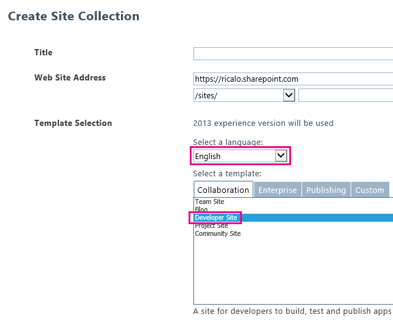

# 找出 SharePoint 增益集
使用資源檔案、 JavaScript資源檔、 及其他技術 (英文) 當地語系化SharePoint Add-in 。
> [!注意事項]
> 本主題假設您熟悉基本建立SharePoint Add-ins;與SharePoint功能、 增益集 web 與主機 web 之間的差別 [何種 SharePoint 元件可以為的增益集](host-webs-add-in-webs-and-sharepoint-components-in-sharepoint-2013.md#TypesOfSPComponentsInApps)，並使用.resx 檔案的當地語系化的基本知識。
  
    
    


## 學會使用找出 SharePoint 增益集
<a name="Prerequisites"> </a>

開始之前，請確認下列：
  
    
    

- 增益集所需支援的地區設定。SharePoint Online與SharePoint內部部署與安裝的語言套件可讓使用者建立網站中特定的語言和文化特性。決定客戶會使用並決定何種這些您想要支援當地語系化版本的增益集的元件有何種本地化的網站。
    
  
- 您需要找出在增益集中的元件。
    
  
此外，請注意下列事項：
  
    
    

- 本文中的程序假設您已使用最新版本的 [Office 開發人員工具的 Visual Studio 2013](http://aka.ms/OfficeDevToolsForVS2013)或 [Office 開發人員工具的 Visual Studio 2015](http://aka.ms/OfficeDevToolsForVS2015)。
    
    > [!注意事項]
      > 如果您的測試 SharePoint 網站是在內部部署 SharePoint 伺服器陣列，而不是Microsoft SharePoint Online開發人員網站，您可能需要安裝在其中您已將轉譯您SharePoint Add-in語言的語言套件。如需詳細資訊，請參閱 [安裝或解除安裝 SharePoint 2013 的語言套件](http://technet.microsoft.com/en-us/library/cc262108%28v=office.15%29.aspx)和 [in SharePoint Server 2013 的語言套件](http://technet.microsoft.com/en-us/library/ff463597%28v=office.15%29.aspx)，並在後面的下載連結。
- 螢幕擷取畫面及本文中的程式碼範例會反映範例 [SharePoint-增益集在-當地語系化](https://github.com/OfficeDev/SharePoint-Add-in-Localization)。您可以下載範例，以查看本文所述的程序的結果。
    
  

## 找出增益集 web 元件
<a name="LocalizingAppWeb"> </a>

增益集 web 可以包含特定類型的 SP 元件。如需可在 SharePoint 增益集的 SharePoint 元件類型的詳細資訊，請參閱 ＜ [類型的 SharePoint 元件可在 SharePoint 增益集](host-webs-add-in-webs-and-sharepoint-components-in-sharepoint-2013.md#TypesOfSPComponentsInApps)。 找出部署至增益集 web 元件，您可以新增.resx 檔案中包含的增益集 web 元件的相同功能模組中。您參照中的元件標記的資源。本文稍後的說明來方式達成此目的。不過， SharePoint Add-in中的自訂網站頁面使用JavaScript字串變數檔案而不是.resx 檔案，如本節所述更新版本。
  
    
    

> [!注意事項]
> 多個增益集 web 功能無法共用資源檔案。每個.wsp 檔案的功能，您必須建立不同組的資源檔案。
  
    
    


### 若要建立增益集的 web 資源檔案


1. SharePoint Add-in中開啟專案Visual Studio。(本主題的螢幕擷取畫面所採取的範例是提供者主控增益集與遠端 web 應用程式的一部分專案的 ASP.NET 網頁表單)。
    
  
2. 在 **方案總管**] 中開啟快顯功能表的功能名稱，然後選擇 [ **新增功能資源**。
    
  
3. 在 [ **新增資源**] 對話方塊中選擇 **語言而異 (而異國家)**，然後選擇 **[確定]**按鈕。Resources.resx 檔案新增至在 **方案總管**] 中的功能資料夾和Visual Studio **資源編輯器**中開啟檔案。
    
    此"語言而異"檔案編輯，包含在您要的語言中的所有網站上的 [ **功能**] 庫中所用的字串 *未*  移至要提供當地語系化的版本的字串。因此使用此檔案中的字串的語言應該是人員的很有可能是人員的使用 SharePoint 的第二個語言的語言。傳統上，提供英文版來達到這個目的中，但在某些情況下另一種語言可能較佳的選擇。例如中某些區域 (英文)、, 法文可能會第二個比英文語言更為常見的使用者。本主題持續範例使用英文作為語言而異。
    
    > [!注意事項]
      > SharePoint Add-in無法安裝在 **支援的地區設定**] 區段中的增益集資訊清單中未列出之語言的網站。請記住本文將告訴您在您要的語言移至要提供本地化增益集] 中執行仍然需要將這類語言新增至增益集資訊清單。請參閱如需支援的增益集資訊清單中的地區設定的詳細本文中的程序 **可建立的主機網站的資源檔案** 。
4. 上方列 **資源編輯器**中的 [ **名稱**] 欄中輸入字串 (或其他 resource) 的描述性名稱 — 例如OrdersListInstance_Title和OrdersListInstance_Description。這些名稱的可當地語系化的資源不自行進行當地語系化。每個資源必須擁有自己的名稱。
    
  
5. 在 [ **值**] 欄中語言而異輸入適當的字串 (或 URL 或其他 resource) — 例如訂單」，並儲存訂單的清單。
    
  
6. 新增額外的名稱與值配對的所有字串及應該用於您功能的任何元件當地語系化的資源。
    
  
7. 儲存檔案。
    
  
8. 將另一個資源檔案新增至功能，如同前，但選取特定語言而不是 **語言而異 (而異國家/地區)**。例如，您可以選擇 **西班牙文 (西班牙)**。Resources.LL CC.resx 檔案 (其中 `LL`和 `CC`均 [網際網路工程工作強制 (IETF)-相容](http://tools.ietf.org/html/rfc1766)語言和文化特性代碼) 新增至在 **方案總管**] 中的功能資料夾和Visual Studio **資源編輯器**中開啟檔案。
    
  
9. 使用 **資源編輯器**，從 Resources.resx、 複製的所有資料列，並將它們貼到新的 Resources.LL CC.resx 檔案。(如果 **副本**未啟用資源編輯器的快顯功能表上，使用Ctrl C要複製之資料列至剪貼簿。)
    
  
10. 在 Resources.LL CC.resx 檔案並將 **值**儲存格取代為轉譯後的版本的字串值。Url 及其他非字串資源、 值取代為適用的語言和文化特性的新值。
    
  
11. 另存新檔。
    
  
12. 針對每個外部語言重複上一次四個步驟。
    
    > [!注意事項]
      > 請考慮將相同語言的特定語言的檔案新增為您的語言而異。如果您可以複製資料列而不變更的字串值。在許多情況下，不需要有尤其是當檔案中的唯一資源為字串時所使用的語言而異，資源檔案中的相同語言的特定語言的檔案。但資源檔案可以包含影像、 圖示、 檔案及其他類型的資源太。有時，您需要使用映像或不同的對應資源在 *任何*  特定語言的檔案的其他資源的語言而異資源檔案。
13. 每個檔案，確認 [ **建置動作**屬性設為 **內容**。
    
  

### 若要在自訂清單呼叫當地語系化的資源


1. 找出自訂清單的標題及描述屬性，開啟 **Elements.xml**檔案清單中的執行個體。 例如，在本主題所附範例中，您會瀏覽 **BookstoreApp** > **順序狀態**> **OrderStatusInstance** > **Elements.xml** **方案總管**中。
    
  
2. 在 **標題**屬性中，輸入$Resources： _StringName_，其中 _StringName_是名稱不是值已授與上一個程序名稱的自訂清單中的字串中 — 例如$Resources： OrdersListInstance_Title。請注意，不同於.resx 檔案用於在其中某些內容中，資源檔名為 *不*  屬於您的輸入。
    
  
3. 使用 **Description**屬性的相同方式來呼叫清單描述字串資源 — 例如$Resources： OrdersListInstance_Description。以下是清單的在 Elements.xml 檔案中執行個體使用的當地語系化的字串的標記。
    
  ```XML
  
<?xml version="1.0" encoding="utf-8"?>
<Elements xmlns="http://schemas.microsoft.com/sharepoint/">
  <ListInstance 
      Title="$Resources:OrdersListInstance_Title" 
      OnQuickLaunch="TRUE" 
      TemplateType="10000" 
      Url="Lists/Orders" 
      Description="$Resources:OrdersListInstance_Description">
  </ListInstance>
</Elements>
  ```


    下圖顯示英文版的當地語系化的自訂清單。
    

   **當地語系化的自訂清單**

  

     
  

  

  

### 找出自訂清單的欄名稱


1. 您無法在相同的方式當地語系化自訂清單的欄名為您找出的標題與描述。找出資料行名稱，您必須宣告 **Elements.xml** 檔案中的清單欄位，然後設定 **DisplayName**屬性值參照中的增益集 web 資源檔案。 若要開始，開啟自訂清單的 **Schema.xml** 檔案。找出 [ **Fields** ] 節點並複製所有其 **Field**節點。
    
  
2. 開啟您的自訂清單的 **Elements.xml** 檔案。請確定您開啟 Elements.xml 檔案的清單定義、 和而不是清單的執行個體。貼上一個步驟的節點上為 **Elements**節點的子系。
    
  
3. 每個 **Field** ] 節點中，輸入的值為$Resources： _StringName_ _StringName_所在的增益集 web 資源檔案中的項目名稱 **DisplayName**屬性中。
    
  
4. 在自訂清單的 **Schema.xml**檔案中，移除您先前已複製每個 **Field**節點 **DisplayName**屬性。以下是清單定義的 **Elements.xml** 檔案中使用的當地語系化的字串範例標記。
    
  ```
  
<?xml version="1.0" encoding="utf-8"?>
<Elements xmlns="http://schemas.microsoft.com/sharepoint/">
    <ListTemplate
        Name="Orders"
        Type="10000"
        BaseType="0"
        OnQuickLaunch="TRUE"
        SecurityBits="11"
        Sequence="410"
        DisplayName="Orders"
        Description="My List Definition"
        Image="/_layouts/15/images/itgen.png"/>
    <Field
        Name="Bookname"
        ID="{2ef60a05-29b6-41db-9611-c0cf7d8e73c5}"
        DisplayName="$Resources:OrdersListColumn_Bookname"
        Type="Text"
        Required="TRUE" />
    <Field
        Name="Price"
        ID="{7af42815-d69e-426a-a1c8-9da5610e362c}"
        DisplayName="$Resources:OrdersListColumn_Price"
        Type="Currency"
        Required="FALSE" />
    <Field
        Name="Orderstatus"
        ID="{687ee751-2e0a-4099-966e-d2c225d48234}"
        DisplayName="$Resources:OrdersListColumn_Orderstatus"
        Type="Lookup"
        Required="FALSE"
        List="Lists/Order status"
        ShowField="Title" />
</Elements>
  ```


### 若要建立JavaScript自訂頁面的資源檔案


1. SharePoint Add-in中的自訂網站頁面使用JavaScript字串變數檔案，而不是.resx 檔案。
    
    若要如果沒有其中有已經開始，請在 [ **方案總管**中，新增至 SharePoint 增益集專案 (非 web 應用程式專案) 的指令碼的資料夾名稱。 **Scripts**資料夾上按一下滑鼠右鍵，然後新增選擇 [ **新增]** > **新增項目**> **Web** > **JavaScript 檔案**。命名該檔案資源。 _LL_ _CC_.js (其中 _LL_語言碼，  _CC_國家 (地區) 或文化特性代碼);例如， Resources.en US.js。
    
  
2. 針對每個外部語言重複上述步驟。您現在應該有每個語言的空白JavaScript檔案。執行動作 *無法*  建立名為"Resources.js"語言而異檔案。原因是後續的程序所述。
    
  
3. 開啟新的JavaScript檔案中的第一個。
    
  
4. 每個可當地語系化字串中每個自訂頁面，以識別用途的字串名稱檔案中將變數宣告並將其指派語言適用的值。以下是 Resources.en US.js 檔案的內容。
    
  ```
  
var instructionstitle = "Instructions:";
var step01 = "Go to any document library in the host web.";
var step02 = "Go to the Library tab.";
var step03 = "Click \\"Request a book\\" in the Settings group.";
var step04 = "Click the contextual menu in any document.";
var step05 = "Click \\"Buy this book\\" in the contextual menu.";
var step06 = "Go to any SharePoint page in the host web and add the" +
    " Bookstore orders add-in part.";
var step07 = "Review the localized <a href=\\"../Lists/Orders\\">Orders</a>" +
    " and <a href=\\"../Lists/Order status\\">Order status</a> custom lists.";

  ```

5. 將檔案的內容複製到每個剩餘的JavaScript檔案，並儲存所有檔案。
    
  
6. 每個檔案中的每個變數值取代為適合的語言檔案的新值。 *不會變更變數的名稱。* 
    
  

### 若要自訂 ASPX 頁面中呼叫的當地語系化的變數


1. 在 **方案總管**] 中開啟的自訂 ASPX 頁面檔案。
    
  
2. 確定只有其中一個當地語系化的JavaScript檔案會載入您的頁面載入時，而且應該是一個適用的 SharePoint 增益集 (英文) 網站的語言。若要這樣做，新增下列標記至具有與值 `PlaceholderAdditionalPageHead` `ContentPlaceholderId`頁面 **asp:content**元素。 *下列標記中有無版面配置區。按照以下顯示輸入標記。* 
    
  ```HTML
  
<script type="text/javascript" src="../scripts/Resources.<SharePoint:EncodedLiteral runat='server' text='<%$Resources:wss,language_value%>' EncodeMethod='HtmlEncode' />.js"></script>
  ```


    此標記會載入一個JavaScript檔。它會決定哪些語言来載入檔案閱讀SharePoint資源名為"language_value"。此資源會將圖樣 _LL_- _CC_早程序中所述的語言文化名稱解析。尤其是它會解析為增益集網頁的語言。
    
    > [!注意事項]
      > 因此名為"Resources.js"的檔案會永遠不呼叫此指令碼所， SharePoint資源"language_value"永遠不是 null。這是您並未不讓一個以上的程序中的原因。沒有.js 檔案是語言"language_value"的值時，此指令碼會載入 nothing。下一步說明字串在該情況下所取得的語言而異值。
3. 針對每個可當地語系化元素和屬性值] 頁面上的，為其指定為預設值的語言而異，但然後使用JavaScript將其資源指派適當的變數。 _LL_- _CC_.js 檔案。例如，如果頁面 **h2**元素中具有標題，授與之元素的 **id**屬性和再插入下方指派給本地化元素的 **innerText**屬性的當地語系化的字串的本地化元素 **script**元素。這個本地化程式碼應該才執行的資源。 _LL_- _CC_.js 檔案載入及宣告的變數。如此將它置於先測試是否其中一個變數所定義的條件區塊。如果不存在，然後不載入任何資源指令碼與預設值 (而異) 值應保持不變。以下是範例。
    
    > [!秘訣]
      > "而異"已新增至 word 而異字串中的第一個。就無法這麼做實際執行增益集，但是當您要測試，很實用的方式的看不到一覽是否正在使用語言而異字串或資源。載入 _LL_ _CC_.js 檔案之語言的被您語言而異。

  ```HTML
  <h2 id="instructionsheading">INVARIANT Instructions</h2>
<ol>
    <li id="step01">Go to any document library in the host web.</li>
    <li id="step02">Go to the Library tab.</li>
    <li id="step03">Click "Request a book" in the Settings group.</li>
    <li id="step04">Click the contextual menu in any document.</li>
    <li id="step05">Click "Buy this book" in the contextual menu.</li>
    <li id="step06">Go to any SharePoint page in the host web and add the Bookstore orders add-in part.</li>
    <li id="step07">Review the localized <a href="../Lists/Orders">Orders</a> and <a href="../Lists/Order status">Order status</a> custom lists.</li>
</ol>

<!-- Use the localized strings in the resource JavaScript file -->
<script type="text/javascript">
    window.onload = function () {
        <!-- Test whether a Resources.LL-CC.js loaded.
             If none was, the invariant values remain unchanged. -->
        if (typeof instructionstitle != 'undefined')  
        {
            document.getElementById("instructionsheading").innerText = instructionstitle;
            document.getElementById("step01").innerText = step01;
            document.getElementById("step02").innerText = step02;
            document.getElementById("step03").innerText = step03;
            document.getElementById("step04").innerText = step04;
            document.getElementById("step05").innerText = step05;
            document.getElementById("step06").innerText = step06;
            document.getElementById("step07").innerHTML = step07;
        }
    }
</script>

  ```


    下圖提供英文版的頁面中之增益集已完成之後的外觀的預覽。
    

   **網頁使用 JavaScript 資源檔案的當地語系化的字串**

  

     
  

  

  

## 找出主控 web 元件
<a name="LocalizingHostWeb"> </a>

您可以找出增益集標題，這會 AppManifest.xml 檔案中指定。這是使用者看到 **Your Add-ins** ] 頁面上。SharePoint Add-in主機 web 也可以包含自訂動作、 增益集組件，或兩者。這些部署中的主機 web 功能。這兩個這些元件可以有可當地語系化的字串。
  
    
    
當地語系化主控 web 元件的基本方法是與當地語系化增益集 web 元件相同: 當地語系化的資源分項.resx 檔案中與呼叫標記檔案。不過， Visual Studio沒有量工具的支援程序套用至主控 web 功能。有限制的手動程序的相關本節稍後說明。
  
    
    

### 若要建立的主機網站的資源檔案


1. 在 **方案總管**] 中選擇要開啟的增益集資訊清單設計工具工具 AppManifest.xml 檔案。
    
  
2. 開啟 [ **支援的地區設定**] 索引標籤。
    
  
3. 在 [ **地區**] 欄的頂端空白儲存格，開啟下拉式清單中並選擇您要支援的第一個地區設定。這兩個檔案的建立和新增至SharePoint Add-in專案: Resources.resx，這是語言而異的資源檔案和資源。 _LL_- _CC_.resx，其會包含當地語系化的資源。 *並不會變更這些檔案的名稱。* 
    
  
4. 針對您想要使用增益集的當地語系化版本支援每個地區設定重覆上述步驟。其他資源。 _LL_- _CC_.resx 檔案被建立每個地區設定。
    
    > [!注意事項]
      > 每個這些檔案 **建置動作**屬性是設定為 **內容**、 **資源**。 *並不會變更此設定。* 
5. 也新增您想要用增益集設為可安裝，每個區域設定的地區設定項目，但它應該在其中使用語言而異;也就是您將會的地區設定 *不*  會提供增益集的當地語系化的版本 *刪除.resx 檔案所建立的這些地區設定。* 
    
  
6. 只是如同對增益集 web 資源檔案開啟 Resources.resx 檔案並新增資源名稱和值的檔案。在最低限度下，您應該會有增益集標題的資源。主機網路功能沒有出現在 SharePoint 使用者介面任何地方，所以您不需要的本土化字串的主機 web 功能標題或描述。如果此功能的自訂動作，您需要資源的 **CustomAction**項目，以及可能的自訂動作標記中的其他字串 **Title**屬性。如果沒有增益集組件，則需要資源 **ClientWebPart**元素的 **標題**與 **描述**屬性。如果增益集組件的自訂屬性，每個 **Property**具有應該也當地語系化的屬性。這每一項，您需要的資源檔案中的列。
    
  
7. 將 Resources.resx 檔案的內容複製到每個資源。 _LL_- _CC_.resx 檔案。
    
  
8. 找出在每個資源的每個資源。 _LL_- _CC_.resx 檔作為您並未增益集 web 資源檔案。
    
  

### 若要呼叫的增益集資訊清單和其他的 XML 檔案中的本地化的資源


1. 開啟 AppManifest.xml 檔案，並以適當的資源字串呼叫取代 **標題**元素值。例如，如果您名為字串Addin_Title、 **Title**元素看起來應該類似如下:
    
  ```XML
  
<Title>$Resources:Addin_Title;</Title>
  ```


    > [!注意]
      > **Title**的值可以 *只*  資源的呼叫包含。可以是任何其他文字、 符號或空格。
2. 若要呼叫當地語系化的資源之其他 XML 檔案，例如 Elements.xml 增益集組件及自訂動作、 您可以使用所用的相同格式增益集資訊清單檔案中。
    
  

## 找出遠端元件中的 SharePoint 增益集
<a name="LocalizingAutohosted"> </a>

如果遠端元件 PHP 或其他非 Microsoft 格式，請參閱適當的平台的當地語系化指引。當遠端 componets ASP.NET時，您當地語系化它們就像任何其他ASP.NET應用程式一樣。如需詳細資訊，請參閱 [ASP.NET Globalization and Localization](http://msdn.microsoft.com/library/8ef3838e-9d05-4236-9dd0-ceecff9df80d.aspx)。
  
    
    
覆寫] 頁面上的執行緒語言及要比對的主機網站的語言。您執行這項作業來覆寫繼承的 **InitializeCulture**方法在程式碼後置的ASP.NET頁面。若要識別主機網頁的語言，請使用 SharePoint 會傳遞至遠端網頁 **SPLanguage**查詢參數。下列程式碼示範如何在ASP.NET執行這項作業。您應該執行 parallel PHP web 應用程式或其他平台。
  
    
    


```cs
protected override void InitializeCulture()
{
    if (Request.QueryString["SPLanguage"] != null)
    {
        string selectedLanguage = Request.QueryString["SPLanguage"];
        
        // Override the page language.
        UICulture = selectedLanguage;
        Culture = selectedLanguage;

        // Reset the thread language.
        Thread.CurrentThread.CurrentCulture =
            CultureInfo.CreateSpecificCulture(selectedLanguage);
        Thread.CurrentThread.CurrentUICulture = new
            CultureInfo(selectedLanguage);
    }
    base.InitializeCulture();
}
```


## 找出遠端JavaScript及 SharePoint 的 chrome 控制項
<a name="JSandChrome"> </a>

如果您的 web 應用程式JavaScript有可當地語系化的字串值，您可以找出其使用JavaScript資源檔案。特別重要的可當地語系化JavaScript範例是 [SharePoint 的 chrome 控制項](use-the-client-chrome-control-in-sharepoint-add-ins.md)，可以用來授與遠端頁面 SharePoint 網頁的外觀。我們會使用當地語系化的 chrome 控制項為本節中的範例。
  
    
    

> [!注意事項]
> 本節僅討論字串當地語系化。更強大的當地語系化需求，例如當地語系化的日期或貨幣格式設定，請考慮使用當地語系化或全球化文件庫，例如 [jQuery Globalize 附加元件](https://github.com/jquery/globalize)。
  
    
    


### 找出的 chrome 控制項


1. 運作的 chrome 控制項之後，會傳回 `renderChrome`方法您用來設定的 chrome 選項。
    
  ```
  
function renderChrome() {
    var options = {
        "appIconUrl": "siteicon.png",
        "appTitle": "My SharePoint add-in", // Localizable string
        "appHelpPageUrl": "Help.html?"
            + document.URL.split("?")[1],
        "onCssLoaded": "chromeLoaded()",
        "settingsLinks": [
            {
                "linkUrl": "Account.html?"
                    + document.URL.split("?")[1],
                "displayName": "Account settings" // Localizable string
            },
            {
                "linkUrl": "Contact.html?"
                    + document.URL.split("?")[1],
                "displayName": "Contact us" // Localizable string
            }
        ]
    };

  ```

2. 註解所述，有三個以上的可當地語系化字串。每個與您在後續步驟中所宣告的變數名稱取代。
    
  ```
  
function renderChrome() {
    var options = {
        "appIconUrl": "siteicon.png",
        "appTitle": chromeAppTitle, // Localized value
        "appHelpPageUrl": "Help.html?"
            + document.URL.split("?")[1],
        "onCssLoaded": "chromeLoaded()",
        "settingsLinks": [
            {
                "linkUrl": "Account.html?"
                    + document.URL.split("?")[1],
                "displayName": chromeAccountLinkName // Localized value
            },
            {
                "linkUrl": "Contact.html?"
                    + document.URL.split("?")[1],
                "displayName": chromeContactUsLinkName // Localized value
            }
        ]
    };

  ```

3. 新增至 web 應用程式專案名為 ChromeStrings.js JavaScript檔案。它應該宣告上述步驟中所用的變數並且指派每個語言而異中的值。
    
  ```
  
var chromeAppTitle = "My SharePoint add-in";
var chromeAccountLinkName = "Account settings";
var chromeContactUsLinkName = "Contact us";

  ```

4. 針對您當地語系化的增益集的每個語言，新增其他JavaScript檔案名稱為 ChromeStrings。 _LL-CC_.js，  _LL-CC_所在語言識別碼。 *之基底的檔案名稱，在此例中"ChromeStrings，"必須完全相同所用的語言而異檔案。*  將語言而異檔案的內容複製到每個當地語系化檔案並值取代為轉譯後的版本。
    
  ```
  
var chromeAppTitle = "Mi aplicación SharePoint";
var chromeAccountLinkName = "Preferencias";
var chromeContactUsLinkName = "Contacto";

  ```

5. 在任何頁面檔案所在的指令碼 SP.呼叫 UI.controls.js、 新增其上方 ChromeStrings.js 呼叫。例如，如果 SP.呼叫呼叫 ChromeLoader.js 中繼檔案會載入 UI.controls.js，此時頁中的標記看起來應該類似下列。
    
  ```
  
<Scripts>
  <asp:ScriptReference Path="Scripts/ChromeStrings.js" />
  <asp:ScriptReference Path="Scripts/ChromeLoader.js" />
</Scripts>
  ```

6. 將 **ResourceUICultures**屬性新增至您的字串會呼叫 **ScriptReference**元素。其值為逗點分隔的清單所支援的語言。
    
  ```
  
<Scripts>
  <asp:ScriptReference Path="Scripts/ChromeStrings.js" ResourceUICultures="en-US,es-ES" />
  <asp:ScriptReference Path="Scripts/ChromeLoader.js" />
</Scripts>
  ```


    **ResourceUICultures**屬性的效果會為該ASP.NET會尋找具有名稱 ChromeStrings 的檔案。 _LL-CC_.js，其中 _LL-CC_是頁面的語言，並載入。如果找不到這類檔案，它會載入 ChromeStrings.js 檔案。
    
  

## 測試您本地化 SharePoint 的增益集
<a name="TestingLocalizedApps"> </a>

測試增益集部署至SharePoint網站佈建的其中一個增益集支援的語言。您可以測試增益集的SharePoint Online網站或內部網站上。
  
    
    

### 若要測試增益集在SharePoint Online網站


1. 前往您Office 365系統管理中心。
    
  
2. 選擇 [瀏覽] 功能表上的 **服務設定**，然後選擇 [ **網站**。
    
  
3. 網站集合] 下選擇 [ **建立網站集合**]。
    
  
4. **選取語言**] 下選取您要測試增益集的語言。
    
  
5. 在 [ **選取範本**，請選擇 **開發人員網站**。
    
  
6. 您的SharePoint Add-in專案更新 **SiteUrl**屬性與新的網站集合的 URL。
    
  
7. 按 f5 鍵，以執行增益集。
    
  

**Create site collection page**

  
    
    

  
    
    

  
    
    

### 若要測試增益集的內部網站


1. 安裝語言套件中您要測試增益集。如需詳細資訊，請參閱 [安裝或解除安裝 SharePoint 2013 的語言套件](http://technet.microsoft.com/library/cc262108.aspx)與 [SharePoint Server 2013 中的語言套件](http://technet.microsoft.com/en-us/library/ff463597%28v=office.15%29.aspx)。
    
  
2. 開啟管理中心的伺服器陣列。
    
  
3. **應用程式管理**] 下選擇 [ **建立網站集合**]。
    
  
4. **選取語言**] 下選取您要測試增益集的語言。
    
  
5. 在 [ **選取範本**，請選擇 **開發人員網站**。
    
  
6. 在SharePoint Add-in專案，更新 **SiteUrl**將最近建立的網站集合的 url。
    
  
7. 按 f5 鍵，以執行增益集。
    
  

## 其他資源
<a name="SP15Localizeapp_addlresources"> </a>


-  [開發 SharePoint 的增益集](develop-sharepoint-add-ins.md)
    
  
-  [Office 增益集的當地語系化](http://msdn.microsoft.com/library/5a1a1cd7-b716-4597-b51f-fa70357d0833%28Office.15%29.aspx)
    
  
-  [ASP.NET Globalization and Localization](http://msdn.microsoft.com/library/8ef3838e-9d05-4236-9dd0-ceecff9df80d.aspx)
    
  
-  [SharePoint-Add-in-Localization](https://github.com/OfficeDev/SharePoint-Add-in-Localization)
    
  

