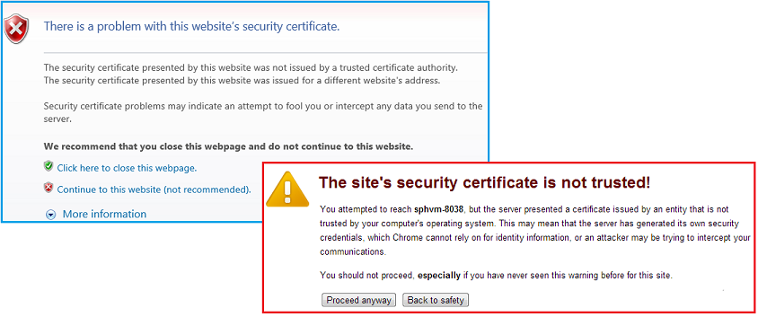

# 封裝並發佈高信任 SharePoint 增益集
了解如何封裝並發佈高信任SharePoint Add-in供內部使用。
## 封裝和發佈高信任層級增益集的先決條件
<a name="Prereqs"> </a>

您需要下列項目：
  
    
    

- 在內部SharePoint 2013開發環境。請參閱 [設定內部部署開發環境的 SharePoint 增益集](set-up-an-on-premises-development-environment-for-sharepoint-add-ins.md)的安裝指示。
    
  
- IIS web 伺服器来裝載的遠端 web 應用程式。應該安裝 IIS 管理員。
    
  
- Visual Studio安裝遠端或SharePoint 2013的安裝所在的電腦上。
    
  
- Microsoft Office Developer Tools for Visual Studio
    
  
-  [Web 部署](http://www.iis.net/downloads/microsoft/web-deploy)Visual Studio的電腦上安裝和遠端 web 應用程式伺服器上安裝的 **網頁部署** 相同的版本。
    
  
表 1 列出一些實用的文章可協助您了解建立SharePoint Add-ins所需的概念。
  
    
    

**表 1。發佈高信任層級增益集的核心概念**


|**文章標題**|**描述**|
|:-----|:-----|
| [開始建立提供者主控 SharePoint 增益集](get-started-creating-provider-hosted-sharepoint-add-ins.md) <br/> |了解如何建立基本提供者主控SharePoint Add-inOffice Developer Tools for Visual Studio。 <br/> |
| [建立高信任 SharePoint 增益集](create-high-trust-sharepoint-add-ins.md) <br/> |了解如何使用Office Developer Tools for Visual Studio建立基本的高信任SharePoint Add-in使用自我簽署的憑證和相關聯的簽發者識別碼。 <br/> |
| [Web 部署](http://www.iis.net/downloads/microsoft/web-deploy) <br/> |Web 部署簡化部署 web 應用程式與網站的 IIS 伺服器的網站。 <br/> |
| [Digital Certificates](http://msdn.microsoft.com/library/e523b335-0156-4f47-b55c-b80495587c4f.aspx)和 [Working with Certificates](http://msdn.microsoft.com/library/6ffb8682-8f07-4a45-afbb-8d2487e9dbc3.aspx) <br/> |了解數位憑證背後的基本概念。 <br/> |
   

> [!注意事項]
> 高信任SharePoint Add-ins只能以安裝在內部部署 SharePoint，不適用於Microsoft SharePoint Online、 和主要對象搭配內部部署，而不是雲端式 web 應用程式。本文說明如何將發佈該案例中的 [增益集。此外，本文中 「 客戶 」 是指 business 傳回安裝SharePoint Add-in和主控遠端元件的增益集。
  
    
    


## 註冊高信任層級增益集
<a name="Register"> </a>

您可以發佈的增益集之前，它已註冊的 SharePoint 伺服器陣列的增益集管理服務。高信任SharePoint Add-ins一律在其的增益集是要安裝 SharePoint 伺服器陣列上登錄。(這些不能是銷售透過Office Store)。註冊執行 hit highlight，頁面 http:// _SharePoint_website_/_layouts/15/appregnew.aspx 下列程序所述。
  
    
    

### 若要註冊增益集


1. 瀏覽至 http:// _SharePoint_website_/_layouts/15/appregnew.aspx 頁面。選擇 [ **產生**] 按鈕產生值的增益集識別碼和密碼。(秘密實際上無法使用在高信任SharePoint Add-ins，但表單需要一個)。提供的增益集的遠端 web 應用程式將會執行所在之網域的基底 URL。在網域中不包含通訊協定 (HTTPS)，但您必須包含遠端元件會使用 HTTPS 要求如果原本不是 443 (例如www.contoso.com:5555或MyAppServer:4444) 的連接埠。
    
    如果您需要重新導向 URI，請輸入一個值，也。請參閱 [驗證程式碼 OAuth 流程 for SharePoint 增益集](authorization-code-oauth-flow-for-sharepoint-add-ins.md)如需如何使用重新導向 URI 的說明。
    
    在頁面表單看起來應該類似圖 1。在此範例中的遠端 web 應用程式伺服器聆聽的預設連接埠 443 上的 HTTPS 要求因此不需要增益集網域中指定的連接埠。
    

   **圖 1。註冊增益集在 appregnew.aspx**

  

     
  

  

  
2. 選擇 [ **建立**]。您所輸入的增益集的資訊將會顯示在 [下一步] 頁面上。請務必因為會使用Visual Studio發送工具時需要保留這項資訊。考慮進行快速頁面的螢幕擷取畫面。
    
  

## 選擇 [取得、 維護及部署的高信任SharePoint Add-ins憑證的策略
<a name="Certificate"> </a>

當開發人員使用 **F5**Visual Studio在開發和偵錯高信任SharePoint Add-in時、 開發人員可以使用自我簽署的憑證，  [建立高信任 SharePoint 增益集](create-high-trust-sharepoint-add-ins.md)所述。不過時的增益集 *發佈*  ，請, 使用自我簽署的憑證會使它將會開啟的遠端 web 應用程式起始頁面之前顯示警告] 頁面上的瀏覽器。使用者有選擇是否要繼續執行。圖 3 顯示這類警告的範例。
  
    
    

**圖 3。自我簽署的憑證會顯示警告**

  
    
    

  
    
    

  
    
    
不便可能是可接受適用於開發人員，但是說過的客戶無法接受。因此最終發佈至生產環境前客戶可以取得由受信任的協力廠商所簽署的憑證。第三方可以商業憑證授權單位 (CA) 或內部 CA。對於商業 CAs 方面記下產業 phasing 取出的網頁伺服器的 「 僅供內部網路 」 憑證。他們仍能形式購買，但這類的所有憑證會 11、 2016、 在都到期或更快。不需要以這種憑證高信任SharePoint Add-in，因為可用的網際網路對向網頁伺服器的憑證也可用於內部網路網頁伺服器，但後者通常提高成本。
  
    
    
憑證應以兩種格式的個人資訊交換 (pfx) 和安全性憑證 (cer)。如果不是其中一項時原本取得這些格式，客戶可以在轉換使用公用程式。此外之後已取得 pfx 格式版本、 pfx 檔案可以匯入 IIS 和 cer 版本然後匯出成, 如下所述。
  
    
    
如果原來取得憑證是 cer 格式，它會包含私人和公用機碼。一般的作法是 SharePoint 所用的.cer 檔案不可以包含私密金鑰。請考慮將原始憑證匯入 IIS，然後匯出新的 cer 版本不包含私密金鑰如下所示。如需.pfx 和.cer 檔案的詳細資訊，請參閱 [軟體發行者憑證](http://msdn.microsoft.com/en-us/library/windows/hardware/ff552299%28v=vs.85%29.aspx)。
  
    
    
此外，客戶可以考慮是否要針對每個使用單一憑證所有高信任SharePoint Add-ins或不同的憑證。如需此決策的詳細資訊，請參閱 [決定使用一個憑證或許多的高信任SharePoint Add-ins之間](creating-sharepoint-add-ins-that-use-high-trust-authorization.md#Deciding)。
  
    
    

## 設定遠端網頁伺服器的憑證
<a name="ConfigureRemote"> </a>

在裝載的遠端 web 應用程式的遠端網頁伺服器上執行下列程序。
  
    
    

### 若要設定的遠端 web 伺服器和 pfx 憑證


1. 提供.pfx 憑證強式密碼。如需詳細資訊，請參閱 [建立強式密碼的方針](http://msdn.microsoft.com/en-us/library/bb416446.aspx)和 [強式密碼](http://msdn.microsoft.com/en-us/library/ms161962.aspx)。
    
  
2. 匯入至 IIS 進行這些步驟遠端網頁伺服器上：
    
1. 在 IIS 管理員中，選取 [在左邊的樹狀檢視中的 [  _ServerName_ ] 節點。
    
  
2. 按兩下 [ **伺服器憑證**] 圖示。
    
  
3. 在右邊的 [ **動作**] 窗格中選取 [ **匯入**。
    
  
4. 在 [ **匯入憑證**] 對話方塊中，瀏覽至.pfx 檔案並使用 [瀏覽] 按鈕，然後輸入憑證的密碼。
    
  
5. 如果您使用 IIS 管理員 8，沒有 **選取憑證存放區**] 下拉式。選擇 [ **個人**]。(這是指 「 個人 」 憑證存放區的電腦，使用者無法。)
    
  
6. 如果您已經不需要的 cer 版本，或您執行動作，但它包含私密金鑰，啟用 [ **允許匯出此憑證**。
    
  
7. 按一下 [確定]。
    
  

### 若要開啟 [Windows 憑證存放區


1. 在相同的伺服器上開啟 **Microsoft Management Console**並 [開啟 MMC 3.0](http://technet.microsoft.com/en-us/library/cc766121.aspx)中所述。
    
  
2. 新增 **憑證**嵌入式管理單元中的電腦帳戶 [新增至 MMC [憑證] 嵌入式管理單元](http://technet.microsoft.com/en-us/library/cc754431.aspx)中所述。請務必使用 *電腦*  、 使用者或服務未使用的程序。選擇 [ *本機*  電腦、 不"另一個"的電腦、 出現提示時。
    
  
如果您使用 ISS 管理員 8 略過下一個程序。
  
    
    

### 若要取得憑證至 Windows 憑證存放區的 ISS 管理員 7 的其他步驟


1. 非常暫時儲存區進行使用的憑證伺服器檔案系統上建立資料夾。
    
  
2. 在 IIS 管理員中，選取 [在左邊的樹狀檢視中的 [  _ServerName_ ] 節點。
    
  
3. 按兩下 [ **伺服器憑證**] 圖示。
    
  
4. 在 [ **伺服器憑證**] 清單中憑證上按一下滑鼠右鍵，然後選取 **匯出**，如圖 4 所示。
    
   **圖 4。匯出憑證**

  

     
  

  

  
5. 將檔案匯出至您建立的資料夾，然後輸入其密碼。
    
  
6. 在 **Microsoft Management Console**匯入憑證 [匯入憑證](http://technet.microsoft.com/en-us/library/cc754489.aspx)中所述。請務必指定 **個人**存放區。
    
  
7. 讓 [主控台保持開啟以便進行下一個程序。
    
  
8.  *刪除資料夾所建立的第一個步驟和憑證檔案的情形。*  安全性憑證存放區中保持憑證種失敗時也在檔案系統上。
    
  
下一個程序適用於 IIS Manager 7 和 8。
  
    
    

### 若要取得之憑證的序號


1. 在 **Microsoft Management Console**] 瀏覽至 [ **憑證 (本機電腦)**嵌入式管理單元的 **個人**資料夾下的 [ **憑證**] 資料夾如果它不是已經開啟。
    
  
2. 按兩下憑證您SharePoint Add-in加以開啟，然後再開啟 [ **詳細資料**] 索引標籤。
    
  
3. 選取要進行整個序號 **序號**欄位看] 方塊中。
    
  
4. 將序號， *不含空格*  ，複製到的文字檔案並將其提供給SharePoint Add-in的開發人員。
    
    > [!秘訣]
      > 某些開發人員部落格文章及論壇 (英文) 問題報表的序號直接複製到剪貼簿建立隱藏任何字元的字串，會序號無法辨識的程式碼中SharePoint Add-in。請考慮手動輸入而不是將它複製編號。
接下來您建立之憑證的 cer 版本。這包含公開金鑰的遠端網頁伺服器與 SharePoint 所用解密的遠端 web 應用程式的要求及驗證這些要求的存取 token。將會建立遠端網頁伺服器上，然後將其移至 SharePoint 伺服器陣列。
  
    
    

### 若要建立的 cer 憑證


1. 在 [IIS 管理員中，選取 _ServerName_節點左側的樹狀檢視中。
    
  
2. 按兩下 [伺服器憑證]。
    
  
3. **伺服器憑證**在檢視中，按兩下憑證以顯示憑證的詳細資訊。
    
  
4. 在 [ **詳細資料**] 索引標籤上選擇 [以啟動 **憑證匯出精靈**] 的 [ **複製到檔案**，然後選擇 [ **下一步**。
    
  
5. 使用預設值 [ **否，不要匯出私密金鑰**]，然後選擇 [ **下一步**。
    
  
6. 在 [下一步] 頁面上使用的預設值。選擇 [ **下一步**]。
    
  
7. 選擇 [ **瀏覽**並瀏覽至任何資料夾。(Cer 檔案移至無論如何都要移動登出這台電腦)。提供的檔案 pfx 檔案並將相同的名稱，然後選擇 [ **儲存**。憑證會儲存為.cer 檔。
    
  
8. 選擇 [下一步]。
    
  
9. 選擇 [ **完成**]。
    
  

## 設定 SharePoint 使用的憑證
<a name="ConfigureSP"> </a>

本節中的程序可以在任何已安裝的 **SharePoint 管理命令介面**的 SharePoint 伺服器上執行。
  
    
    

### 若要發佈至 SharePoint 的 cer 檔案


1. 建立資料夾，並確定已閱讀下列 IIS 增益集區的增益集區身分識別由右到：
    
  - **SecurityTokenServiceApplicationPool**
    
  
  - 增益集區中做為您的測試 SharePoint 網站的 SharePoint web 應用程式主控父項的 IIS 網站。 **SharePoint - 80** IIS 網站的集區會呼叫 **OServerPortalAppPool**。
    
  
2.  *移動*  (不只是複製) 從遠端網頁伺服器的.cer 檔案的資料夾您剛才建立的 SharePoint 伺服器上。檔案會在此資料夾僅暫時。
    
  
下列程序設定為在 SharePoint 中的受信任權杖發行者的憑證。它會執行一次只 (適用於每個高信任SharePoint Add-in)。
  
    
    

### 設定憑證


1. 如果您尚未執行此動作，建立高信任層級設定Windows PowerShell指令碼或您需要的指令碼 [SharePoint 2013 高信任層級設定指令碼](high-trust-configuration-scripts-for-sharepoint-2013.md)中所述。
    
  
2. 將指令碼複製到 SharePoint server。
    
  
3. 開啟 **SharePoint 管理命令介面**以系統管理員身分並執行適當的指令碼。
    
  
4. 指令碼的其中一個適合使用 「 客戶共用多個SharePoint Add-ins之間的單一憑證時。該指令碼會輸出檔案所包含的 token 簽署者的 GUID。如果您使用的指令碼，請將它會輸出的檔案提供給高信任SharePoint Add-in的開發人員。
    
  
5.  *從 SharePoint 伺服器的檔案系統中刪除 cer 檔案。* 
    
  

> [!注意事項]
> 註冊為權杖發行者的憑證不是有效立即且增益集將無法運作到為止。可能需要只要之前的所有 SharePoint 伺服器都辨識新的權杖發行者的 24 小時。執行 iisreset 所有 SharePoint 伺服器上，您可以執行的動作不干擾 SharePoint 使用者，將會導致其立即辨識發行者。
  
    
    


## 修改 web.config 檔案
<a name="WebConfig"> </a>


> [!秘訣]
> 包含經過修改的 web.config 的程式碼範例，請參閱 [PnP / 範例 (英文) / Core.OnPrem.S2S.WindowsCertStore](https://github.com/OfficeDev/PnP/tree/dev/Samples/Core.OnPrem.S2S.WindowsCertStore).
  
    
    

編輯 web.config 檔案使其包含新 `appSettings`節點中下列機碼值：
  
    
    

- **ClientID:**這是 web 應用程式的用戶端識別碼 (GUID) 產生 appregnew.aspx 上。
    
  
- **ClientSigningCertificateSerialNumber:** *(您必須新增此機碼，如果Microsoft Office Developer Tools for Visual Studio並未新增助)*  這是憑證的序號。應該會有任何空格或連字號的值。
    
  
- **IssuerId:**這是 ( *其必須是小寫*  ) 的 token 簽署者的 GUID。其值取決於客戶憑證策略：
    
  - 如果高信任SharePoint Add-in它不要與其他SharePoint Add-ins共用其專屬憑證、  `IssuerId`是 `ClientId`相同。
    
  
  - 如果SharePoint Add-in共用相同的憑證使用的其他SharePoint Add-ins 、  `IssuerId`是任意的 GUID。您可以在 [SharePoint 2013 高信任層級設定指令碼](high-trust-configuration-scripts-for-sharepoint-2013.md)找到此案例的指令碼中產生此 guid 的文字檔案。IT 人員可以傳遞 outputted 的檔案至增益集開發人員為 `IssuerId`的 web.config 檔案中的插入。
    
  

> [!注意事項]
> Office Developer Tools for Visual Studio可能已新增 **ClientSigningCertificatePath**和 **ClientSigningCertificatePassword**的增益集設定機碼。這些不適用於實際執行增益集和應刪除。
  
    
    

以下是範例。請注意高信任SharePoint Add-in沒有 **ClientSecret**金鑰。
  
    
    


```XML

<appSettings>
  <add key="ClientID" value="c1c12d4c-4900-43c2-8b89-c05725e0ba30" />
  <add key="ClientSigningCertificateSerialNumber" value="556a1c9c5a5415994941abd0ef2f947b" />
  <add key="IssuerId" value="f94591d5-89e3-47cd-972d-f1895cc158c6" />
</appSettings>

```


## 修改 TokenHelper 檔案
<a name="WebConfig"> </a>

Office Developer Tools for Visual Studio所產生的 TokenHelper.cs (或.vb) 檔需要修改以搭配使用 Windows 憑證存放區中的憑證和擷取的序號。下列範例會顯示一種方式。此範例會使用 C#。
  
    
    

> [!秘訣]
> 包含經過修改的 tokenhelper.cs 程式碼範例，請參閱 [PnP / 範例 (英文) / Core.OnPrem.S2S.WindowsCertStore](https://github.com/OfficeDev/PnP/tree/dev/Samples/Core.OnPrem.S2S.WindowsCertStore).
  
    
    


### 若要修改 TokenHelper


1.  `#region private fields`組件之檔案的底端接近所 `ClientSigningCertificatePath`、  `ClientSigningCertificatePassword`，及 `ClientCertificate`的宣告。移除所有三個。
    
  
2. 在他們的地方新增下列行：
    
  ```
  
private static readonly string ClientSigningCertificateSerialNumber
    = WebConfigurationManager.AppSettings.Get("ClientSigningCertificateSerialNumber");
  ```

3. 尋找宣告 `SigningCredentials`欄位的行。取代為下行：
    
  ```
  
private static readonly X509SigningCredentials SigningCredentials
    = GetSigningCredentials(GetCertificateFromStore());
  ```

4. 移至 `#region private methods`組件的檔案並新增下列兩種方法：
    
  ```
  
private static X509SigningCredentials GetSigningCredentials(X509Certificate2 cert)
{
    return (cert == null) ? null 
                          : new X509SigningCredentials(cert, 
                                                       SecurityAlgorithms.RsaSha256Signature, 
                                                       SecurityAlgorithms.Sha256Digest);
}

private static X509Certificate2 GetCertificateFromStore()
{
    if (string.IsNullOrEmpty(ClientSigningCertificateSerialNumber))
    {
        return null;
    }  

    // Get the machine's personal store
    X509Certificate2 storedCert;
    X509Store store = new X509Store(StoreName.My, StoreLocation.LocalMachine); 

    try
    {
        // Open for read-only access                 
        store.Open(OpenFlags.ReadOnly);

        // Find the cert
        storedCert = store.Certificates.Find(X509FindType.FindBySerialNumber, 
                                             ClientSigningCertificateSerialNumber, 
                                             true)
                       .OfType<X509Certificate2>().SingleOrDefault();
    }
    finally
    {
        store.Close();
    }

    return storedCert;
}
  ```


## 使用封裝在一起的遠端 web 應用程式及發佈SharePoint Add-inVisual Studio精靈
<a name="Package"> </a>


> [!秘訣]
> Microsoft 更新Visual Studio並永遠無法更新Office Developer Tools for Visual Studio比過去和文件中的更常排程隨時變更。本節是撰寫使用Visual Studio於 2013 年 10 日發行的版本與Office Developer Tools for Visual Studio中其所包含的版本。如果您正在處理Visual Studio或工具的舊版或更新版本，您可能需要查閱Visual Studio說明與部落格文章，以尋找相等方法執行這些程序中的步驟。
  
    
    


### 若要封裝的遠端 web 應用程式


1. 在 [ **方案總管**中，以滑鼠右鍵按一下 [web 應用程式專案 (非SharePoint Add-in專案)，然後選取 [ **發行**。
    
  
2. 在 [ **設定檔**] 索引標籤上選取 [下拉式清單上的 **新設定檔**。
    
  
3. 出現提示時，授與設定檔的適當的名稱。例如薪資 SP 增益集 - 遠端 Web 應用程式。
    
  
4. 在 [ **連線**] 索引標籤上選取 [ **發佈**方法下拉式清單中的 **網站部署套件**。
    
  
5. **封裝位置**、 使用的任何資料夾。為了簡化稍後的程序，這應該是空的資料夾。通常用於專案 bin 資料夾的子資料夾。
    
  
6. 作為網站名稱中，輸入要架設的 web 應用程式之 IIS 網站的名稱。不包括通訊協定或連接埠或斜線名稱 ；例如"PayrollSite"。如果您想要在預設的網站的子 web 應用程式，請使用 [ Default Web Site _/<website name>_;例如，「 預設網站/PayrollSite。 」(如果尚未存在之 IIS 網站，它會建立在後續的程序中執行 Web 部署套件時)。
    
  
7. 按 [下一步]。
    
  
8. 在 [ **設定**] 索引標籤上選取 [ **設定**下拉式清單上的 [ **版本**] 或 [ **偵錯**。
    
  
9. 按一下 [ **下一步**，然後 **發佈**。封裝位置中建立的 zip 檔案和各種會在後續的程序安裝 web 應用程式所使用的其他檔案。
    
  

### 若要建立SharePoint Add-in套件


1. 以滑鼠右鍵按一下您的解決方案的SharePoint Add-in專案，然後選擇 [ **發佈**。
    
  
2. 在 [ **目前的設定檔**下拉式，選取您在最後一個程序中建立的設定檔。
    
  
3. 如果小型黃色的警告符號出現旁的 [ **編輯**] 按鈕，請按一下 [ **編輯**] 按鈕。表單開啟並要求相同的 web.config 檔案中包含的資訊。由於您使用發佈的方法，將 **網站部署套件**，但是不能保留空白表單，則不需要此資訊。在 [四個文字] 方塊中輸入任何字元並按一下 [ **完成]**。
    
  
4. 按一下 [ **封裝增益集**] 按鈕。(請不要按一下 **部署 web 專案**。此按鈕只會重複中的最後一個程序的最後一個步驟。) **增益集的套件**表單隨即開啟。
    
  
5. 在 **網站主控?**文字] 方塊中，輸入網域的遠端 web 應用程式的 URL。必須包含通訊協定、 HTTPS，且如果 web 應用程式將會接聽 HTTPS 要求的連接埠不是 443，然後您必須包含連接埠也;例如， https://MyServer:4444。(這是值取代使用該Office Developer Tools for Visual Studio ~ remoteAppUrl 權杖SharePoint Add-in的增益集資訊清單中。)
    
  
6. 在 **新功能增益集用戶端識別碼？**文字] 方塊中，輸入所產生 appregnew.aspx] 索引標籤上與您也在 web.config 檔案中輸入的用戶端識別碼。
    
  
7. 按一下 [ **完成**]。建立您的增益集套件。
    
  

## 發佈的遠端 web 應用程式並安裝SharePoint Add-in
<a name="PublishRemote"> </a>


  
    
    

### 若要發佈的 web 應用程式


1. 瀏覽至 [封裝的遠端 web 應用程式時作為 **封裝位置**的資料夾及隨後中的所有檔案都複製至遠端伺服器上的資料夾。
    
  
2. 在此資料夾中開啟 _project_name_.deploy readme.txt 檔案 (  _project_name_是Visual Studio web 應用程式專案的名稱)，並遵循檔案中的指示來安裝 web 應用程式使用 _project_name_。 deploy.cmd 檔案。
    
  

### 若要設定之 web 應用程式的通訊協定繫結


1. 在 IIS 管理員中，請反白顯示 [ **連線**] 窗格中的新網站。(如果新的 web 應用程式是 **預設的網站**的子系，請反白顯示 **預設的網站**和 **預設的網站**執行此程序)。
    
  
2. 在 [ **動作**] 窗格中按一下 [ **繫結**。
    
  
3. 在 **站台繫結**] 對話方塊中按一下 [ **新增**]。在 [ **新增站台繫結**] 對話方塊會隨即開啟，採取下列步驟。
    
1. 在 [ **類型**] 下拉式清單中選取 **HTTPS** 。
    
  
2. 選取 [ **全部未指派** **的 IP 位址**] 下拉式清單中。
    
  
3. 在 [ **連接埠**] 文字方塊中輸入連接埠。如果您註冊SharePoint Add-in appregnew.aspx (如下所述 [註冊高信任層級增益集](#Register)) 上的連接埠指定增益集網域中，您必須在這裡使用相同的號碼。如果您未在 appregnew 指定連接埠，則以下使用 443。
    
  
4. 在 [ **SSL 憑證**] 下拉式清單中，選取您用來設定上述 [設定遠端網頁伺服器的憑證](#ConfigureRemote)的伺服器的憑證。
    
  
5. 按一下 [確定]。
    
  
4. 按一下 **[關閉]**。
    
  

### 若要設定 web 應用程式的驗證


1. 當新的 web 應用程式已安裝在 IIS、 匿名存取已開始但幾乎所有的高信任SharePoint Add-in的設計用來要求使用者進行驗證時，所以您需要加以變更。在 IIS 管理員中，請反白顯示在 [ **連線**] 窗格中的 web 應用程式。它會是預設的網站的對等網站或子 Default Web Site。
    
  
2. 按兩下 [在中央窗格開啟 [ **驗證**] 窗格的 [ **驗證**] 圖示。
    
  
3. 反白顯示 **匿名驗證**] 和 [ **停用**[ **動作**] 窗格中。
    
  
4. Web 應用程式的驗證系統的設計用來使用並按一下 [ **動作**] 窗格中的 [ **啟用**醒目提示。
    
    如果 web 應用程式的程式碼使用 TokenHelper 與 SharePointContext 檔案中修改的使用者驗證的組件的檔案而產生的程式碼，web 應用程式使用 **Windows 驗證**，所以也就是您應該啟用的選項。
    
  
5. 如果您使用修改的使用者驗證的組件的檔案沒有產生的程式碼檔案，您也需要使用下列步驟設定驗證提供者：
    
1. 在 [ **驗證**] 窗格中，醒目提示 **Windows 驗證**。
    
  
2. 按一下 [ **提供者**。
    
  
3. 在 [ **提供者**] 對話方塊中，確定 **NTLM**是列出 *上述* **交涉**。
    
  
4. 按一下 [確定]。
    
  

### 上傳並安裝SharePoint Add-in


1. 將SharePoint Add-in *.app 套件檔案上傳至組織增益集類別目錄。(透過Office Store無法分散式高信任SharePoint Add-ins )。如需詳細資訊，請參閱 [新增增益集，將增益集目錄](http://technet.microsoft.com/en-us/library/fp161234.aspx#AddApps)。
    
  
2. 在相同的父 SharePoint web 應用程式包含增益集目錄內任何網站上安裝的增益集。如需上載及安裝SharePoint Add-in的詳細資訊，請參閱 [新增 SharePoint 增益集至 SharePoint 2013 網站](http://technet.microsoft.com/en-us/library/fp161231)。
    
  

## 其他資源
<a name="bk_addresources"> </a>


-  [建立高信任 SharePoint 增益集](create-high-trust-sharepoint-add-ins.md)
    
  
-  [使用 Visual Studio 發佈 SharePoint 增益集](publish-sharepoint-add-ins-by-using-visual-studio.md)
    
  
-  [註冊 sharepoint2013 增益集](register-sharepoint-add-ins-2013.md)
    
  
-  [開始建立提供者主控 SharePoint 增益集](get-started-creating-provider-hosted-sharepoint-add-ins.md)
    
  

