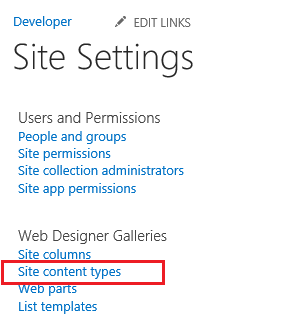
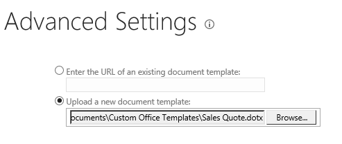
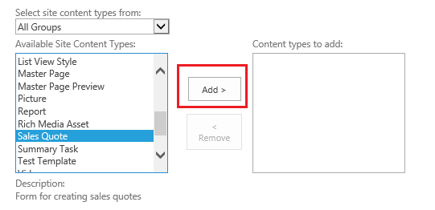

# 提供的文件庫中的雲端商務增益集的範本
除了您新增至 SharePoint 文件庫的文件時所能使用 Office 範本，您可以提供您自己的範本。例如，您可能必須您想要新增新的訂單時使用您自己銷售報價範本。
## 

如果您尚未這麼做，關聯到文件庫雲端商務增益集。請參閱 [文件庫建立關聯的實體](associate-a-document-library-with-an-entity.md)。
  
    
    

### 若要新增的範本

1. 前往 SharePoint 開發人員網站，並在 [ **開發人員**] 頁面中選擇 [ **網站內容]**。
    
  
2. 在 [ **網站內容**] 頁面上選擇 [ **設定**，如圖 1 所示。
    
   **圖 1。[設定] 連結**

  

     ![[網站設定] 連結](images/CBA_IM_8b.PNG)
  

  

  
3. 在 [ **網站設定**] 頁面上 [ **網站設計工具庫**] 清單中選擇 [ **網站內容類型**，如圖 2 所示。
    
   **圖 2。網站內容類型連結**

  

     
  

  

  
4. 在 [ **網站內容類型**] 頁面上，選擇 [ **建立**、 圖 3 所示。
    
   **圖 3。[建立] 連結**

  

     
  

  

  
5. 在 [ **新網站內容類型**] 頁面上輸入的名稱和範本的描述。 **上層內容類型**，選擇 **文件內容類型**與 **文件**，如圖 4 所示。
    
   **圖 4。上層內容類型選擇**

  

     
  

  

  
6. 在 [ **群組**] 區段中 **現有的群組**] 清單中，如圖 5 所示選擇 [ **文件內容類型**，然後選擇 **[確定]**。
    
   **圖 5。群組設定**

  

     
  

  

  
7. 在 [ **網站內容類型**] 頁面上選擇 [ **進階的設定**]。
    
  
8. 在 [ **進階設定**] 頁面上 [輸入現有文件範本的 URL 或圖 6 所示上傳新文件範本與然後選擇 **[確定]**。
    
   **圖 6。指定文件範本**

  

     
  

  

  
9. 移至 [ **網站內容**] 頁面上選擇 [文件庫與則請移至 [ **設定**] 頁面。
    
  
10. 在 [ **設定**] 頁面上選擇 [ **從現有的網站內容類型新增]**。
    
  
11. 在 [ **新增內容類型**] 頁面上新增您的範本圖 7 所示並再選擇 **[確定]**。
    
   **圖 7。新增的範本**

  

     
  

  

  
12. 執行增益集，並新增文件。您應該會看到您的範本中 **建立新檔**] 對話方塊中，如圖 8 所示。
    
   **圖 8。[建立新檔案] 對話方塊以新的範本**

  

     ![含新範本的 [建立新檔案] 對話方塊](images/CBA_IM_30.PNG)
  

  

  

## 其他資源

-  [開發雲端商務增益集](develop-cloud-business-add-ins.md)
    
  
-  [文件庫建立關聯的實體](associate-a-document-library-with-an-entity.md)
    
  

