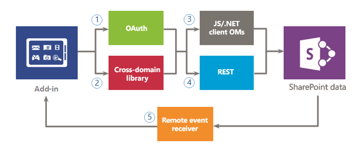

# 保護資料存取及用戶端物件模型的 SharePoint 增益集
了解您必須建立SharePoint Add-ins，包括存取SharePoint以及外部系統的資料連線選項時的資料存取選項為您想要從增益集存取資料時所能使用的 Api。
在評估SharePoint Add-ins可用於資料存取選項，您必須評估增益集環境考量下列因素，例如用戶端和伺服器，與所需的增益集來執行工作所需的權限層級之間的通訊。您也必須評估SharePoint 增益集相關的模型中可用的 Api。
  
    
    

## SharePoint Add-ins中資料的高階概觀 (英文)

很難想像SharePoint Add-in (或所有的增益集的專家)，不需要查詢、 儲存、 或操作資料。您增益集，您會經常必須擷取及操作SharePoint資料，例如文件庫與清單、 中繼資料、 或使用者設定檔中的項目。同樣地，您可能會有您要存取外部資料的增益集的案例。SharePoint 增益集相關的模型提供多個連線選項和一組豐富的 Api 存取的資料和都位於SharePoint及外部系統的服務。
  
    
    
當您設計您增益集和資料存取的計劃時，您必須進行兩個主要決策：
  
    
    

1. 應該使用哪個連線選項？
    
  
2. 我應該使用何種 Api 存取我需要的資料？
    
  
下圖摘要說明SharePoint 增益集相關的模型所提供的不同選項。在遵循區段中，您將檢查每個選項的詳細資訊，並了解使用時機。
  
    
    
圖 1 說明您擁有存取在增益集中的SharePoint資料的選項。當您正在處理這些案例時，您必須決定是否要進行驗證和溝通SharePoint使用 (1) OAuth、 或跨網域文件庫(2)。然後針對資料存取 API，您必須決定 (3) 之間的用戶端物件模型 (JavaScript/.NET 用戶端物件模型)或 (4)代表性狀態傳輸 (REST)。
  
    
    
請記住，您也可以存取特定資料 (5) *的遠端事件接收器*  ，但主要分析藍本的遠端事件接收器是遠端執行程式碼。
  
    
    

**圖 1。在增益集中使用 SharePoint 資料的選項**

  
    
    

  
    
    

  
    
    
圖 2 顯示有存取上增益集的外部資料的選項。當您正在處理這些案例時，您必須決定是否要使用 *web proxy*  (1)、 (2) 的 *外部內容類型*  、 或 *跨網域與自訂的 proxy] 頁面上的文件庫*  (3) 來驗證及通訊與外部服務或系統。您也可以使用 (4)用戶端物件模型 (JavaScript/.NET 用戶端物件模型)或 (5)代表性狀態傳輸 (REST)。
  
    
    

**圖 2。在增益集中使用外部資料的選項**

  
    
    

  
    
    

  
    
    

  
    
    

  
    
    

## SharePoint Add-ins的資料連線選項

您必須考慮的數個層面當您在增益集使用的資料。例如，路由用途使用資料？它是來自或經由伺服器吗？它會經由用戶端吗？是否確定来驗證已登入使用者吗？沒有增益集需要提高的權限吗？下列各節可協助您使用這些結構元件及您可能會有其他問題。
  
    
    

### SharePoint資料連線

存取SharePoint資料 (請參閱圖 1) 時可使用下列連線選項：
  
    
    

- **OAuth:** 啟用安全授權的簡單和標準方式開放式通訊協定。OAuth 讓使用者可以核准，對其代理不含共用其使用者名稱和密碼的應用程式。您可以使用 OAuth 與伺服器端程式碼。如果您需要執行非互動式的程序，或者您需要提高至以外的登入使用者的權限是良好的選擇。如需 OAuth 詳細資訊，請參閱 [授權與驗證的 SharePoint 增益集](authorization-and-authentication-of-sharepoint-add-ins.md)。
    
  
- **跨網域文件庫：** 用戶端的替代 ( **SP. JavaScript檔案格式RequestExecutor.js** ) 裝載於您可以參考在遠端增益集中的 SharePoint 網站。跨網域文件庫可讓您與多個網域中您遠端增益集] 頁面上透過 proxy 進行互動。如果您偏好增益集程式碼執行用戶端中而不是在伺服器上，或是沒有連線障礙，例如SharePoint與遠端的基礎結構之間的防火牆，這是良好的選擇。如需詳細資訊，請參閱 [存取 SharePoint 2013 資料增益集使用跨網域文件庫](access-sharepoint-2013-data-from-add-ins-using-the-cross-domain-library.md)。
    
  
- **的遠端事件接收器:** 您可以使用的遠端事件接收器來處理事件發生在增益集，例如清單、 清單項目或網頁中的項目。這些事件類似的傳統SharePoint解決方案，，但是他們可以使用SharePoint Add-in遠端元件。請注意部分的項目屬性可遠端事件接收器。如需詳細資訊，請參閱 [在 SharePoint 增益集建立的遠端事件接收器](create-a-remote-event-receiver-in-sharepoint-add-ins.md)。以類似方式，您可以使用自訂如何增益集安裝、 更新及解除安裝的增益集事件接收器。如需詳細資訊，請參閱 [建立增益集事件接收器中 SharePoint 增益集](create-an-add-in-event-receiver-in-sharepoint-add-ins.md)。
    
  

### SharePoint資料連線選項: 應該使用哪一種？

下表列出的一般需求和您在建置增益集時可能發生的案例。帶 **x** ] 欄中指出您可以使用每個案例中的選項。
  
    
    

**表 1。SharePoint資料連線選項**

|**需求/案例**|**OAuth**|**跨網域文件庫**|
|:-----|:-----|:-----|
|使用用戶端技術 (HTML + JavaScript)。   ||X   |
|我想要使用 REST 介面。   |X   |X   |
|SharePoint 與我遠端增益集之間的防火牆因此我必須發出透過瀏覽器通話。   ||X   |
|「 我的增益集必須登入使用者存取的資源。   |X   |X   |
|「 我的增益集需要提高權限是目前已登入使用者的權限。   |X   ||
|「 我的增益集必須代表一個登入之外的使用者身分。   |X   ||
|「 我的增益集必須僅期間的使用者登入執行作業。   |X   |X   |
|「 我的增益集必須即使使用者未登入執行作業。   |X   ||
|「 我的增益集必須以回應事件中SharePoint執行遠端程式碼。   |||
   
自遠端事件接收器所建置上方的 OAuth，此表格中的比較不是以決定是否應使用這些或不的最佳方式。當您需要執行除了資料交換的遠端程式碼時使用遠端事件接收器。
  
    
    

### 外部資料連線

存取外部資料 (請參閱圖 2) 時可使用下列連線選項：
  
    
    

- **Web proxy:** 身為開發人員，您可以使用用戶端 Api 等 JSOM 中公開的 web proxy。當您使用的 web proxy 時，您會發出至SharePoint初始要求。接著，SharePoint 會要求指定的結束點的資料，將您] 頁面上的回應。當您想在伺服器層級進行通訊時使用的 web proxy。Web proxy 的設計來存取不需要驗證的非結構化的資料。如需詳細資訊，請參閱 [查詢使用 SharePoint 2013 中的 web proxy 遠端服務](query-a-remote-service-using-the-web-proxy-in-sharepoint-2013.md)。
    
  
- **外部內容類型：** 您可以建立增益集來自 SAP、 Netflix、 和專利和其他類型的資料存取的外部資料而不涉及用戶系統管理員。存取外部應用程式會維護透過 Business Connectivity Services (BCS)，會提供一致且統一的介面，可供其他SharePoint應用程式。應用程式範圍 Ect 會成為良好的選擇時所使用的 BCS 模型及資料存取需要驗證。如需詳細資訊，請參閱 [新增在-範圍的外部內容類型 in SharePoint 2013](http://msdn.microsoft.com/library/a34cbbba-dc38-4d3d-b796-d54b5848bdfb%28Office.15%29.aspx)。
    
  
- **自訂的跨網域文件庫的 proxy] 頁面上：** 您可以使用的跨網域文件庫如果要提供自訂 proxy] 頁面上必需遠端的增益集基礎結構中的存取在遠端增益集中的資料。為開發人員，您將負責自訂 proxy] 頁面上實作與必須提供自訂邏輯，例如遠端增益集所驗證機制的跨網域文件庫與自訂 proxy 頁面如果您想使用用戶端層級進行通訊。如需詳細資訊，請參閱 [SharePoint 2013 中建立自訂的 proxy] 頁面上的跨網域文件庫](create-a-custom-proxy-page-for-the-cross-domain-library-in-sharepoint-2013.md)。
    
  

### 外部資料連線選項: 應該使用哪一種？

下表列出的一般需求和您在建置增益集時可能發生的案例。帶 **x** ] 欄中指出您可以使用每個案例中的選項。
  
    
    

**表 2。外部資料連線選項**

|**需求/案例**|**Web Proxy**|**外部內容類型**|**使用自訂的 proxy] 頁面上的跨網域文件庫**|
|:-----|:-----|:-----|:-----|
|使用用戶端技術 (HTML + JavaScript)。   |{x}   |{x}   |{x}   |
|無法將網頁或元件新增至遠端增益集 (英文) 或服務。   |X   |X   ||
|我想要使用 REST 介面。   |X   |X   |X   |
|我想要使用JavaScript CSOM。   |X   |X   |X   |
|我想要使用.NET CSOM。   |X   |X   ||
|有SharePoint基礎結構與 「 我的增益集之間沒有直接連線能力。我需要發出透過瀏覽器的通話。   ||X   |X   |
|「 我的增益集必須登入使用者存取的資源。   |X   |X   |X   |
   

## 可用的資料存取SharePoint Add-ins api (英文)

您想要從增益集存取SharePoint資料時，可使用下列 API 選項：
  
    
    

- **代表性狀態傳輸 (REST)：** 針對您要從用戶端技術，不使用JavaScript並不會在.NET Framework平台上建置存取SharePoint實體的情況下， SharePoint提供使用 [開啟的資料 (OData) 通訊協定](http://www.odata.org/)執行 CRUDQ REST web 服務的實作SharePoint資料 (建立、 讀取、 更新、 刪除和查詢) 作業。此外，幾乎所有的用戶端物件模型中的 API 有相對應的 REST 端點。這可讓您使用任何支援標準的其餘部分功能技術，直接與SharePoint互動的程式碼。若要使用內建於SharePoint的其餘部分功能，您的程式碼會建構對應至想要的SharePoint物件的端點 RESTful HTTP 要求。REST 服務會處理 HTTP 要求和回應做 Atom 或JavaScript Object Notation (JSON)格式。若要深入了解在 SharePoint 中的其餘部分，請參閱 [在 SharePoint 其餘邀請中使用 OData 查詢作業](use-odata-query-operations-in-sharepoint-rest-requests.md)。
    
  
- **.NET framework 用戶端物件模型 (.NET 用戶端 OM)：** 核心網站和清單伺服器端物件模型中的幾乎每一個類別.NET Framework用戶端物件模型中有相對應的類別。此外， .NET Framework用戶端物件模型也會公開一組完整的 Api 的擴充其他功能，包括一些SharePoint-例如 ECM、 分類法、 使用者設定檔的層級功能進階搜尋、 分析、 BCS、 及其他人。若要深入了解用戶端物件模型，請參閱 [選擇 [設定 SharePoint 2013 中的右 API](http://msdn.microsoft.com/library/f36645da-77c5-47f1-a2ca-13d4b62b320d%28Office.15%29.aspx)。
    
  
- **JavaScript用戶端物件模型 (JSOM)：** SharePoint中內嵌指令碼或不同.js 檔案用於提供JavaScript物件模型。將所有相同包含.NET Framework用戶端物件模型的功能。JSOM 是實用的方式包括自訂SharePoint程式碼增益集，特別是在SharePoint 裝載的增益集中，在伺服器端的自訂程式碼不允許的位置。它也可讓 web 開發人員使用其現有的JavaScript技術來建立最少的學習曲線SharePoint Add-ins 。若要深入了解用戶端物件模型，請參閱 [選擇 [設定 SharePoint 2013 中的右 API](http://msdn.microsoft.com/library/f36645da-77c5-47f1-a2ca-13d4b62b320d%28Office.15%29.aspx)。
    
  
可能會有您可以使用您SharePoint Add-in存取外部資料時的其他 Api。它取決於新介面的外部服務且系統提供給。您也應該在您的設計考量這些介面。
  
    
    

## 其他資源

-  [授權與驗證的 SharePoint 增益集](authorization-and-authentication-of-sharepoint-add-ins.md)
    
  
-  [存取 SharePoint 2013 資料增益集使用跨網域文件庫](access-sharepoint-2013-data-from-add-ins-using-the-cross-domain-library.md)
    
  
-  [SharePoint 2013 中建立自訂的 proxy] 頁面上的跨網域文件庫](create-a-custom-proxy-page-for-the-cross-domain-library-in-sharepoint-2013.md)
    
  
-  [查詢使用 SharePoint 2013 中的 web proxy 遠端服務](query-a-remote-service-using-the-web-proxy-in-sharepoint-2013.md)
    
  
-  [在 SharePoint 增益集建立的遠端事件接收器](create-a-remote-event-receiver-in-sharepoint-add-ins.md)
    
  
-  [選擇 [設定 SharePoint 2013 中的右 API](http://msdn.microsoft.com/library/f36645da-77c5-47f1-a2ca-13d4b62b320d%28Office.15%29.aspx)
    
  
-  [在 SharePoint 其餘邀請中使用 OData 查詢作業](use-odata-query-operations-in-sharepoint-rest-requests.md)
    
  

