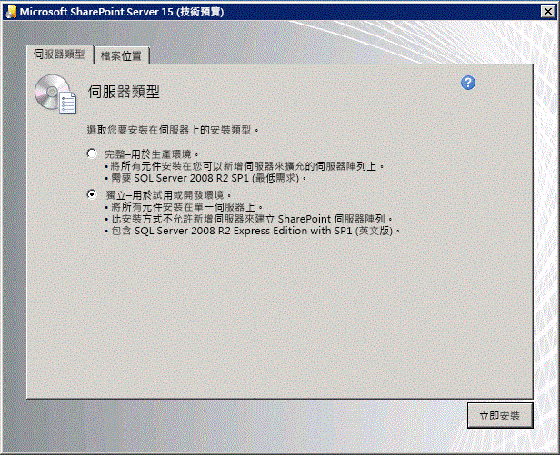
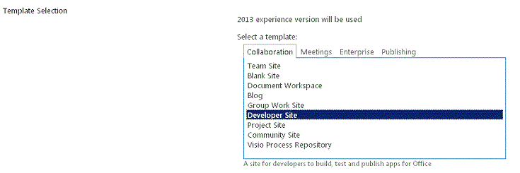

# 設定內部部署開發環境的 SharePoint 增益集
了解如何設定特別適合開發SharePoint Add-ins與SharePoint的內部部署安裝的開發環境。
## 安裝作業系統SharePoint Add-ins的開發環境
<a name="bk_installOS"> </a>

在開發環境的需求是較嚴密和昂貴比在實際執行環境的需求與此處所述的準則不支援實際執行環境中安裝。請參閱 [SharePoint 2013 概觀 (英文) 安裝和設定](http://technet.microsoft.com/en-us/library/ee667264%28v=office.15%29)、  [SharePoint 2013 的硬體和軟體需求](http://technet.microsoft.com/en-us/library/cc262485%28v=office.15%29)、 和 [設定環境的 SharePoint 增益集](http://technet.microsoft.com/en-us/library/fp161236%28office.15%29.aspx)如設定SharePoint的實際執行環境中安裝指示。
  
    
    
在任何開發環境中，所應使用的電腦至少需要 16 GB 的 RAM x64 能夠 CPU 與安裝及執行SharePoint;試試為 24 GB 的 RAM。
  
    
    
依據您的特定需求及預算，您可以選擇下列選項：
  
    
    

- 在 Windows Server 2008 R2 Service Pack 1 x64 或 Windows Server 2012 上安裝 SharePoint。
    
  
- 使用 Microsoft Hyper-V 並在執行 Windows Server 2008 R2 Service Pack 1 x64 或 Windows Server 2012 客體作業系統的虛擬機器上安裝 SharePoint。如需為 SharePoint 設定 Microsoft Hyper-V 虛擬機器的相關指示，請參閱  [使用 SharePoint 2013 虛擬機器與 Hyper-V 環境的最佳做法設定](http://technet.microsoft.com/zh-tw/library/ff621103%28v=office.15%29.aspx)。
    
  

> [!注意事項]
> 只有在Windows Server 2008 R2 Service Pack 1 x64 或 Windows Server 2012 上可支援SharePoint安裝。如果您想開發SharePoint Add-ins的SharePointWindows 7或Windows 8上，您可以註冊Office 365開發人員網站及遠端開發增益集。
  
    
    


## 安裝作業系統和SharePoint的必要條件
<a name="bk_prereqsOS"> </a>


1. 執行 PrerequisiteInstaller.exe 工具隨附安裝檔案。
    
  
2. 執行 Setup.exe 工具隨附安裝檔案。
    
  
3. 接受 Microsoft 軟體授權條款。
    
  
4. 在 [選擇您要的安裝] 頁面上，選擇 [獨立]。
    
   **圖 1。安裝類型選擇**

  

     
  

  

  
5. 如果安裝中發生任何錯誤，請檢閱記錄檔。若要尋找記錄檔，開啟 [命令提示字元] 視窗，並在命令提示字元中輸入下列命令。安裝完成時，也會出現記錄檔的連結。
    
  ```
  
cd %temp%
dir /od *.log
  ```

6. 安裝完成後，系統會提示您啟動 [SharePoint 產品及技術設定精靈]。
    
    > [!注意事項]
      > 如果您使用的已加入網域，但可在網域控制站未連接的電腦的 [SharePoint 產品及技術設定精靈可能會失敗。如果您看到此失敗、 連線至網域控制站其直接或透過虛擬私人網路 (VPN) 連線或登入本機帳戶的電腦具有系統管理權限。
7. [設定精靈] 完成之後，您會看到新SharePoint網站的 [ **範本選擇**] 頁面。在此頁面上，選擇 **開發人員網站**範本。您可以僅部署SharePoint Add-insVisual Studio從開發人員網站。
    
   **圖 2。選擇網站範本] 頁面上**

  

     
  

  

  

## 設定伺服器對伺服器增益集使用SharePoint中的服務
<a name="Servertoserver"> </a>

在此步驟中，您可以設定中SharePoint增益集使用伺服器對伺服器的服務。這些步驟確保您能夠建立高信任提供者主控增益集與您的安裝。請參閱 [建立高信任 SharePoint 增益集](create-high-trust-sharepoint-add-ins.md)如需建立這種增益集的詳細資訊。
  
    
    

1. 請確定已設定 App Management Service 和 user profile 應用程式。(它是可以呼叫"App Management Service"因為SharePoint Add-ins原本已名為"SharePoint 相關應用程式 」)。步驟如下所示：
    
1. 在 [ **管理中心**] **應用程式管理**] 下選取 [ **管理服務應用程式**。
    
  
2. 在 [ **服務應用程式**] 頁面上，確定已啟動下列服務：
    
  - User Profile Service 應用程式
    
  
  - 應用程式管理服務
    
  
3. **應用程式管理**] 下選取 [ **管理伺服器上的服務**]。
    
  
4. 在 [ **伺服器上的服務**] 頁面上，確定已啟動下列服務：
    
  - 使用者設定檔服務
    
  
2. 請確定至少一個設定檔的方式建立的 **User Profile Service 應用程式**中。步驟如下所示：
    
1. 在 [ **管理中心**] **應用程式管理**] 下選取 [ **管理服務應用程式**。
    
  
2. 下一步] 選取 [ **User Profile Service 應用程式**]。
    
  
3. 在 **管理設定檔服務: User Profile Service 應用程式**] 頁面上， **人員**] 下的選取 [ **管理使用者設定檔**。
    
  
4. 在 [ **管理使用者設定檔**] 頁面上，選取 **新設定檔**。
    
  
5. 在 [ **新增使用者設定檔**] 頁面上輸入帳戶名稱和電子郵件地址。
    
  
6. 選取 [ **儲存並關閉**。
    
    > [!注意事項]
      > 如果您要取得您嘗試已建立的設定檔存在的訊息，請選取 [ **取消並返回**。
7. 在 [ **管理使用者設定檔**] 頁面上，您應該看到 **設定檔總數: 1**。
    
  

## 安裝Visual Studio和Office Developer Tools for Visual Studio
<a name="SP15Appdevonprem_bk_installVS"> </a>


- 如果您尚未安裝 **Visual Studio** 2013 或更新版本，請使用 [Install Visual Studio](http://msdn.microsoft.com/library/da049020-cfda-40d7-8ff4-7492772b620f.aspx) 中的指示進行安裝。建議您使用 [Microsoft 下載中心內的最新版本](https://www.visualstudio.com/downloads/download-visual-studio-vs)。
    
  
- Visual Studio 包含 **Microsoft Office Developer Tools for Visual Studio** ，但有時候之間的Visual Studio更新發行的版本的工具。若要確認您具備最新版的工具使用執行 [的 Visual Studio 2013 的 Office 開發人員工具的安裝程式](http://aka.ms/OfficeDevToolsForVS2013)或 [安裝程式對 Office 開發人員工具的 Visual Studio 2015](http://aka.ms/OfficeDevToolsForVS2015)。
    
  

### Visual Studio 中的詳細資訊記錄

如果您想要開啟詳細資訊記錄，請遵循下列步驟：
  
    
    

1. 開啟登錄並瀏覽至 **HKEY_CURRENT_USER\\Software\\Microsoft\\VisualStudio\\ _nn.n_\\SharePointTools** ，其中 _nn.n_ 是Visual Studio 的版本，例如 12.0 或 14.0。
    
  
2. 加入名為 **EnableDiagnostics** 的 DWORD 機碼。
    
  
3. 將機碼的值設為 **1** 。
    
  
在未來版本的 Visual Studio 中，登錄路徑將會變更。
  
    
    

## 在 SharePoint 中設定的隔離之增益集網域
<a name="SP15appdevonprem_bk_configure"> </a>

請在您執行本節中的所有程序之前，先閱讀 [主機 web、 增益集 web 及隔離的網域](host-webs-add-in-webs-and-sharepoint-components-in-sharepoint-2013.md#IsolatedDomain)。
  
    
    
您必須在您的測試 SharePoint 伺服器陣列中建立的隔離的網域。此外， SharePoint安裝需要它將可佈建 SharePoint 主控的增益集的一般萬用字元主機標頭網域。
  
    
    
開發基於，您可以修改主機檔案視需要路由開發電腦SharePoint Add-in測試執行個體。Visual Studio會在您建立及部署的增益集時自動修改主機檔案。
  
    
    

> [!注意事項]
> 適用於實際執行伺服器陣列，您必須建立內部網路中的 DNS 路由策略及選擇性地設定防火牆。如需如何建立及設定SharePoint Add-ins的實際執行環境的詳細資訊，請參閱 [安裝和管理 SharePoint 增益集](http://technet.microsoft.com/en-us/library/fp161232%28v=office.15%29) 。
  
    
    

執行下列程序來建立隔離增益集 (英文) 網域中的步驟。
  
    
    

> [!注意事項]
> 您必須執行的所有步驟中的下列程序時伺服器陣列系統管理員身分登入與您必須以系統管理員身分執行命令提示字元中與 SharePoint 管理命令介面。
  
    
    


### 開發的電腦上建立的隔離之增益集網域


1. 請確定 spadmin 和 sptimer 服務正在執行開啟命令提示字元並輸入下列命令。
    
  ```
  
net start spadminv4
net start sptimerv4
  ```

2. 建立隔離的增益集網域系統管理員身分執行 [SharePoint 管理命令介面，並輸入下列命令。 _contosoaddins.com_取代為您增益集的網域。它應該 *不*  是主機 SharePoint 網域的子網域。所以主要動作就失去了安全性優點擁有隔離增益集的網域。例如，如果主機網域是 contoso.com，請勿 addins.contoso.com 為增益集網域。
    
  ```
  
Set-SPAppDomain "contosoaddins.com"
  ```

3. 請確定 SPSubscriptionSettingsService 和 AppManagementServiceInstance 服務正在執行在 SharePoint 管理命令介面中輸入下列命令。
    
  ```
  Get-SPServiceInstance | where{$_.GetType().Name -eq "AppManagementServiceInstance" -or $_.GetType().Name -eq "SPSubscriptionSettingsServiceInstance"} | Start-SPServiceInstance
  ```

4. 確認 SPSubscriptionSettingsService 和 AppManagementServiceInstance 服務正在執行在 SharePoint 管理命令介面中輸入下列命令。輸出會表示每個服務是否在線上。
    
  ```
  Get-SPServiceInstance | where{$_.GetType().Name -eq "AppManagementServiceInstance" -or $_.GetType().Name -eq "SPSubscriptionSettingsServiceInstance"}
  ```

5. 您必須指定其中 SPSubscriptionService 和 AppManagementServiceInstance 服務執行個體的帳戶執行。此帳戶必須是 SPManagedAccount。您可以建立 SPManagedAccount SharePoint 管理命令介面中輸入下列命令。(提示您的網域 \\ 使用者帳戶和密碼。)
    
  ```
  $account = New-SPManagedAccount
  ```

6. SharePoint 管理命令介面中輸入下列程式碼來指定應用程式集區與資料庫設定的 SPSubscriptionService 和 AppManagementServiceInstance 服務的帳戶。如果您在上述步驟中建立 SPManagedAccount，這裡使用該帳戶名稱。
    
  ```
  $account = Get-SPManagedAccount "domain\\user"
$appPoolSubSvc = New-SPServiceApplicationPool -Name SettingsServiceAppPool -Account $account
$appPoolAppSvc = New-SPServiceApplicationPool -Name AppServiceAppPool -Account $account
$appSubSvc = New-SPSubscriptionSettingsServiceApplication -ApplicationPool $appPoolSubSvc -Name SettingsServiceApp -DatabaseName SettingsServiceDB 
$proxySubSvc = New-SPSubscriptionSettingsServiceApplicationProxy -ServiceApplication $appSubSvc
$appAppSvc = New-SPAppManagementServiceApplication -ApplicationPool $appPoolAppSvc -Name AppServiceApp -DatabaseName AppServiceDB
$proxyAppSvc = New-SPAppManagementServiceApplicationProxy -ServiceApplication $appAppSvc

  ```

7. 指定增益集前置詞 (請參閱 [主機 web、 增益集 web 及隔離的網域](host-webs-add-in-webs-and-sharepoint-components-in-sharepoint-2013.md#IsolatedDomain)) 在 [SharePoint 管理命令介面中輸入下列程式碼。
    
  ```
  
Set-SPAppSiteSubscriptionName -Name "add-in" -Confirm:$false
  ```

 **只有當您的環境使用 proxy 伺服器執行下列程序。** 建立隔離的增益集網域之後，請在下列程序，將該網域新增至 Internet Explorer 中略過清單中執行步驟。這可確保您可以瀏覽至 [這個網域部署的 SharePoint 裝載增益集或提供者主控增益集，其中包含增益集網頁之後。
  
    
    

### 將隔離的增益集網域新增至 Internet Explorer 中略過清單


1. 在 Internet Explorer 中，移至 [ **工具]**。
    
  
2. 選擇 [ **網際網路選項**]。
    
  
3. 在 [ **連線**] 索引標籤上選擇 [ **LAN 設定**] 按鈕。
    
  
4. 清除 [ **自動偵測設定**] 核取方塊。
    
  
5. 選取 [在您的區域網路使用 Proxy 伺服器] 核取方塊。
    
  
6. 選擇 [ **進階**] 按鈕，然後再新增*。YourAddinsDomain.com **例外規則**清單。
    
  
7. 選擇 [確定] 按鈕。
    
  
8. 選擇 [ **確定**] 按鈕關閉 [ **區域網路 (LAN) 設定**] 對話方塊。
    
  
9. 選擇 [ **確定**] 按鈕關閉 [ **網際網路選項**] 對話方塊。
    
  
請參閱 [部署及安裝 SharePoint 增益集： 方法與選項](deploying-and-installing-sharepoint-add-ins-methods-and-options.md)的部署您的增益集選項的相關資訊。
  
    
    

> [!秘訣]
> SharePoint 主控增益集部署至您的安裝後，系統可能會提示您嘗試啟動它時，使用您的認證登入。您必須停用回送檢查除去這些提示。請參閱 [您會收到錯誤 401.1 瀏覽網站所使用整合式驗證與裝載於 IIS 5.1 或更新版本時](http://support.microsoft.com/kb/896861)如需如何停用回送檢查的指示。
  
    
    


## 其他資源
<a name="SP15SetupSPO365_bk_addlresources"> </a>


-  [SharePoint Add-ins](sharepoint-add-ins.md)
    
  
-  [開始建立提供者主控 SharePoint 增益集](get-started-creating-provider-hosted-sharepoint-add-ins.md)
    
  
-  [開始建立 SharePoint 主控 SharePoint 增益集](get-started-creating-sharepoint-hosted-sharepoint-add-ins.md)
    
  

  
    
    

