# SharePoint 增益集 UX 設計的指導方針
瞭解一般的使用者體驗 (UX) 設計的指導方針SharePoint 2013，包括選擇色彩、 使用 CSS、 管理使用者授權]，以及其他設計工作中的增益集。
增益集是新的概念，如SharePoint 2013，讓使用者將其網站中的新功能，同時仍然確保可靠性本身在 SharePoint 網站。建立良好的增益集，就需要不僅很棒的功能 （但是當然重要的是），但也確定增益集看起來沒問題並完美融入安裝所在的網站。
  
    
    


## 選擇增益集的 chrome
<a name="UXGuide_AppChrome"> </a>

您必須決定您要建立增益集的第一個項目是您想要建立頁面多少或如何運作，以及您希望他們裝載的位置。根據這些選項，您使用 power 您 chrome 哪一種技術會是相當大的 ︰
  
    
    

- **ASPX 頁面裝載在 SharePoint:**使用增益集的範本。
    
  
- **裝載於 SharePoint 或 SharePoint 外的任何頁面的 HTML 頁面 ︰**使用 chrome 的控制項。
    
  
- **自訂下列方式建立品牌頁面 ︰**使用您自己的色彩。
    
  

### 使用 SharePoint 裝載於頁面的增益集的範本
<a name="UXGuide_AppTemplate"> </a>

僅適用於 SharePoint 裝載 ASPX 頁面可增益集的範本。範本包含 **app.master**主版頁面 （其中包含 chrome 適當的增益集和設計用來與主機網站的佈景主題），並將其隱藏部分不適用或無法有意義的增益集網站內的 SharePoint 功能。圖 1 顯示 SharePoint 裝載於頁面的使用增益集的範本。
  
    
    

**圖 1。使用增益集的範本的 SharePoint 裝載頁面**

  
    
    

  
    
    

  
    
    
增益集的範本是Visual Studio中的預設值，當您建立的增益集網站及頁面的 web。
  
    
    

### 使用 chrome 控制項中SharePoint Add-ins
<a name="UXGuide_ChromeControl"> </a>

如果您無法建立 SharePoint 裝載 ASPX 頁面，但您仍希望增益集成帶有含義與使用從主機網站，該 chrome 控制項是正確的選擇。圖 2 顯示 chrome 的控制項。
  
    
    

**圖 2。在網頁組件區塊控制項**

  
    
    

  
    
    

  
    
    

  
    
    

**觀看影片 ︰ SharePoint 2013 chrome 的控制項**

  
    
    

  
    
    

  
    
    

  
    
    

  
    
    

  
    
    

### 若要使用的 chrome 的控制項


1. 新增控制項的文件庫的參考。有兩種方式進行這項操作 ︰
    
  - 指向文件庫，在 [版面配置] 資料夾的根目錄，如下列範例所示。
    
  ```
  
<script
    type="text/javascript" 
    src="http://{server URL}/_layouts/15/sp.ui.controls.js">
</script>
  ```

  - 複製文件庫至您自己的網站，然後從該處加以參考。
    
    > **注意**
      > 如果您選擇此替代增益集不助益從更新至控制項。
2. 新增版面配置區 DOM 元素位置會呈現控制項，在此範例中所示。
    
  ```
  
<div id='chromeControlContainer'></div>
  ```

3. 初始化控制項。
    
  ```
  function addchromecontrol(){
    var options = {};
    options.siteTitle ="{host site title}";
    options.siteUrl = "{host URL}";
    options.appHelpPageUrl = "{help page URL}";
    options.appIconUrl = "{app icon URL}";
    options.appTitle = "add-in Title";
    nav = new SP.UI.Controls.Navigation("chromeControlContainer", options);
    nav.setVisible(true);
}
  ```

4. （選用）如果您不想讓頁面上的 [標題] 區域，您可以藉由執行下列JavaScript程式碼將其移除。
    
  ```
  
nav.setBottomHeaderVisible(false);
  ```

Chrome 控制項提供兩個選用增益集圖示 ︰ 頂端導覽列和標題區域中的其中一個。在上方導覽列上的 [增益集] 圖示 24 x 24 像素 （像素），而標題區域中的圖示會相同的 SharePoint 網站圖示大小，最多 64 像素高最 180 度像素長。我們建議您使用的 PNG 影像，因為使用者和管理員可以變更網站佈景主題，您已測試白色、 黑色、 灰色、 明亮，及已設成靜音背景上。如需有關使用 chrome 控制項的詳細資訊，請參閱 [使用用戶端的 chrome 控制項中 SharePoint 增益集](use-the-client-chrome-control-in-sharepoint-add-ins.md)。
  
    
    

### 建立自訂品牌SharePoint Add-ins中的使用者介面
<a name="UXGuide_CustomUI"> </a>

如果，而不是對齊至主機網站的佈景主題，放置到 SharePoint 網站中位置安裝增益集，您會想要使用您自己的品牌內增益集，您必須建立從頭您 chrome。不過，您應該左上角的使用者回位置安裝增益集網站重新導向頁面 （右上方的 [從右至左] 從右至左的語言） 仍有 「 返回網站] 連結。
  
    
    

## 使用SharePoint Add-ins主機 web CSS
<a name="UXGuide_CSS"> </a>

藉由使用相同的樣式主機網站上使用，您可以確保仍一致與 SharePoint 網站的廠商增益集。實際的樣式可能會根據網站的設計變更，但所參照的主機 web CSS 檔案，您就會知道的增益集能無論安裝的位置。
  
    
    
若要從主機網路上取得的 CSS 樣式，您必須參照其 CSS 檔案。您可以透過以下數種不同的方式。
  
    
    

### 若要參照主機網頁的 CSS 檔案


1. 如果您使用的增益集的範本或增益集 chrome 的控制項，這是自動付的適合您。
    
  
2. 如果您是增益集網站內，您可以使用 **CssRegistration** ] 和 [ **CssLink**控制項參照 CSS 檔案放在您的主版頁面或 ASPX 頁面上的下列程式碼 ︰
    
  ```HTML
  <SharePoint:CssRegistration runat="server" name="default" />
<SharePoint:CssLink runat="server />

  ```

3. 若要藉由建立人員主機的 URL 網址，參考 CSS 檔案，如下圖所示，在此範例中，您可以使用 < link > 項目。
    
  ```HTML
  
<link rel="stylesheet" href="{host web URL}/_layouts/15/defaultcss.ashx" />
  ```


    如果您使用此方法時，您必須執行JavaScript在頁面上，以取得主機關閉查詢字串的網站的 URL。然後頁面 dom 書寫項目之前，就可以將 **link**項目插入主機網站的 URL
    
  
設定增益集的樣式時的第一個項目是使用最大的語意 HTML。這表示使用 **H1**、 **H2**、 **H3**，等各種不同的標題，並輸入的標籤] 按鈕。您也應該嘗試使用 SharePoint 核心樣式盡可能讓主機網站的佈景主題變更時，增益集挑選這些變更和自動。下表顯示預設佈景主題樣式的使用方式。
  
    
    

**資料表 1。本文文字樣式**


|**範例**|**用於**|**Style**|
|:-----|:-----|:-----|
|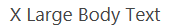|超大型本文 <br/> |.ms textXLarge <br/> |
||大型的本文 <br/> |ms-textlarge <br/> |
|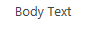|標準的本文 <br/> |自動繼承 <br/> |
||小型本文 <br/> |ms-textsmall <br/> |
||中繼資料的文字 <br/> |ms-metadata <br/> |
   

**資料表 2。標題和標題樣式**


|**範例**|**用於**|**Style**|
|:-----|:-----|:-----|
|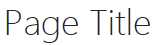|在頁面上的主標題 <br/> |ms-core-pagetitle <br/> |
||對話方塊、 表單、 部落格和討論文章標題。這是選擇性的內容類型或佔據整個 pagethat 您想要不同的一般 wiki 或網頁組件頁面的增益集的替代 「 主要 」 標題。 <br/> |H1 <br/> |
||第二個相對於 H1 標題。例如，社群使用 H1 輔色為了獲得最佳的 「 回應 」 文章標題的文章，與 H2 輔色。 <br/> |H2 <br/> |
||通常次標題底下 H2。 <br/> |附近的 H3 <br/> |
||附近的 H3 之下的子標題。 <br/> |H4 <br/> |
|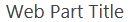|主要/主要網頁組件的頁面上，或主要章節標題的標題。 <br/> |ms-webpart-titletext <br/> |
|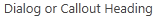|標題中的對話方塊或圖說文字的標題。 <br/> |ms-dlg-heading <br/> |
   

**資料表 3。瀏覽樣式**


|**範例**|**用於**|**Style**|
|:-----|:-----|:-----|
||左的導覽列中的標題。 <br/> |.ms 核心-listMenu verticalBox >.ms 核心-listMenu 根 > 平 >.ms 核心-listMenu-項目 <br/> |
|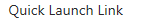|在左側的導覽列中的連結。 <br/> |.ms 核心-listMenu verticalBox <br/> |
||在左側的導覽列中選取的項目。 <br/> |.ms 核心-listMenu verticalBox +.ms accentText <br/> |
||上方導覽列中的項目。 <br/> ||
|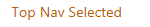|選取上方導覽列中的項目。 <br/> ||
   

**表 4。命令樣式**


|**範例**|**用於**|**Style**|
|:-----|:-----|:-----|
||您預期使用者指定的容器或頁面中的主要動作連結。例如，這會用來樣式的圖說文字下方的命令。此一定會瀏覽] 及 [未瀏覽] 命令的同一個色彩。 <br/> |ms-commandlink <br/> |
||也使用樣式動作連結，但會次要內容的動作。這個樣式用於這些次要的動作，讓它們不競爭以強調的內容。 <br/> |ms-secondarycommandlink <br/> |
||圖說文字中的連結。 <br/> |ms-calloutlink <br/> |
   

**表 5。輔助按鍵的樣式**


|**範例**|**用於**|**Style**|
|:-----|:-----|:-----|
||協助程式的文字，其中提供輔色目前的佈景主題的色彩類別。 <br/> |ms-accenttext <br/> |
||內容中的連結應該繼承預設超連結樣式和行為。超連結樣式套用色彩與將游標暫留效果表示它是一個連結，而非標準文字。 <br/> |繼承自使用 < >。 <br/> |
||在表單中發生的錯誤訊息。 <br/> |ms-error <br/> |
||協助提供 softened 的灰色的文字，應該會小於強調比標準的內文文字的類別。 <br/> |ms-soften <br/> |
||協助程式用於表明已停用的狀態的文字套用 「 停用 」 的色彩類別。 <br/> |ms-disabled <br/> |
||協助程式轉換為所有大寫字文字的類別。 <br/> |ms-uppercase <br/> |
|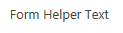|協助程式類別至樣式的文字，例如表單。 <br/> |ms-helper <br/> |
||虛線線條分隔線，用來將 [快速啟動和功能表中的節。 <br/> |hr <br/> |
   

**[表 6。部分使用者介面樣式**


|**範例**|**用於**|**Style**|
|:-----|:-----|:-----|
||按一下頂端的 [組件的主要內嵌文字。 <br/> |.ms textXLarge +.ms 柔 <br/> |
|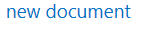|在 [組件; 的最上方的線條的命令最多有應該只有一或兩個每組件。 <br/> |ms-herocommandlink <br/> |
||用於引誘使用者互動的組件，它不含資料時所顯示的文字。 <br/> |ms-attractmode <br/> |
|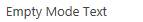|顯示給使用者，沒有可用的資料時的文字。 <br/> |ms-emptymode <br/> |
|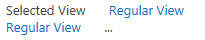|檢視控制項，例如樞紐分析表。 <br/> |mspivotlink <br/> |
||清單項目連結。 <br/> |ms-listlink <br/> |
   

**表格 7。背景和框線的樣式**


|**範例**|**用於**|**Style**|
|:-----|:-----|:-----|
|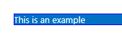|若要將應該重度強調頁面的矩形樣式。 <br/> |ms-emphasis <br/> |
||強調的元素的邊框。 <br/> |ms-emphasisborder <br/> |
||更精巧的強調標記項目。 <br/> |ms-subtleemphasis <br/> |
||套用 ms subtleEmphasis，且的項目中的命令。 <br/> |ms-subtleemphasiscommand <br/> |
||在項目中套用 ms subtleEmphasis，且已停用的命令。 <br/> |ms-subtleemphasiscommand-disabled <br/> |
||側邊的導覽項目。 <br/> |ms-sidenav <br/> |
||樣式選取側邊的導覽項目。 <br/> |ms-sidenav-selected <br/> |
||若要強調使用框線的項目。 <br/> |ms-lines <br/> |
|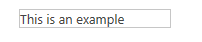|若要強調的項目使用精巧的框線。 <br/> |ms-subtlelines <br/> |
||若要強調使用強式或彩色框線的項目。 <br/> |ms-stronglines <br/> |
|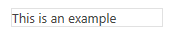|若要強調使用框線停用的項目。 <br/> |ms-disabledlines <br/> |
||若要強調使用輔色框線的項目。 <br/> |ms-accentlines <br/> |
||若要包含的快顯視窗。 <br/> |ms-popupborder <br/> |
||若要套用背景項目上的重疊。 <br/> |ms-bgoverlay <br/> |
||若要顯示已停用一個元素的背景。 <br/> |.ms bgDisabled <br/> |
||若要套用標題的背景色彩。 <br/> |ms-bgheader <br/> |
||若要套用的頁尾背景色彩。 <br/> |ms-bgfooter <br/> |
|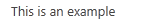|將游標暫留在應有醒目提示的色彩的項目。滑鼠不停留在其上時，範例顯示的項目。 <br/> |.ms bgHoverable <br/> |
||將游標暫留在應有醒目提示的色彩的項目。滑鼠指標停留在其上時，範例顯示的項目。 <br/> |.ms bgHoverable <br/> |
|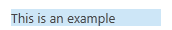|若要顯示的項目上的選取範圍。 <br/> |ms-bgselected <br/> |
||在頁面的頂端列中的項目。 <br/> |ms-topbar <br/> |
   
如需詳細資訊，請參閱 [使用 SharePoint 網站的樣式表中 SharePoint 增益集](use-a-sharepoint-website-s-style-sheet-in-sharepoint-add-ins.md)。
  
    
    

## 設定一般的項目一致SharePoint Add-ins中的樣式
<a name="UXGuide_Styling"> </a>

若要協助使用者瞭解翻譯 SharePoint 與增益集之間的技巧，您應該一致樣式幾個常見的項目。
  
    
    

### 內部導覽

若要提供增益集導覽，有兩個主要的圖樣，追蹤 ︰ 左導覽與上方導覽。您使用的選項取決於有些內容功能中其餘的增益集。一般而言，左側導覽畫面中會正確的選擇，尤其是如果您正在切換不同的清單，或增益集的焦點母片詳細檢視。相反地，如果您的瀏覽主要會什麼可能被視為相同清單的不同檢視之間切換，您可以選擇改為使用上方導覽。
  
    
    
上方導覽和左側導覽畫面中有時它們會在 SharePoint 中設定正確樣式的物件模型表示。SharePoint 頁面以外，您將需要執行更多工作自己建立的標記的上方或左側的導覽，然後加入適當的 CSS 類別，使其位於正確地套用樣式。
  
    
    

### 工具列

在許多情況下，您會有幾個您想要快速地呈現給使用者的命令。如果您使用功能區已在頁面上，最佳選擇是將命令新增至現有的功能區中的邏輯位置。不過，在情況中，您還沒有功能區的頁面，就可能沒有任何意義新增的命令。在此情況下，我們建議您將關聯式工具列新增至] 命令會套用位置的項目。您應該使用其中一個圖像，文字的格式 ms commandLink，或兩者來代表您應該要有相同的背景色彩] 頁面的其餘的工具列上的命令。
  
    
    

### 清單

清單是常見的方式呈現給使用者的資料。如果增益集使用 SharePoint 頁面，您可以使用清單檢視網頁組件呈現給使用者的資料，並取得的樣式和隨附的互動。不過，如果您有頁面其他位置，或您想要進一步控制使用者可使用您的清單的互動，您應該模仿在 SharePoint 中清單的樣式設定，同時提供您自己的轉譯及互動。以下是當您使用清單中的增益集時，請記住一些樣式問題 ︰
  
    
    

- **檢視 ︰**當代表一份清單上的多個檢視，您應該使用樞紐分析表頂端的清單中，就像一般的 SharePoint 清單也可以。您永遠不應該做為主要詳細資料的方式使用樞紐分析。
    
  
- **篩選 ︰**時提供現有清單] 或 [母片詳細資料排列方式的篩選，您應該使用提要欄位的內容區域的左側對齊，而的會至少 300 個像素寬。您也應該將複製指出哪一個篩選] 或 [項目會選取使用者的 SharePoint 選取樣式。
    
  
- **表單 ︰**當使用者檢視或編輯的單一項目時，您應該使用內建 SharePoint 表單或模仿其樣式一致的體驗。
    
  

### 表單、] 對話方塊及圖說文字

使用者輸入有三個不同的圖樣提供使用者深入瞭解物件，或提供的使用者介面 (UI): 整頁的表單、 對話方塊及圖說文字。無論您使用的項目取決於使用者意圖和多少資訊會顯示，或要求。
  
    
    

- **整頁的表單 ︰** 當您想要使用者輸入多個不同部分資訊，或您想要顯示它們大量一次結構化資訊時，這是最佳選擇。整頁表單也會讓最有意義中更複雜的互動模型，例如功能區中，在哪裡必要的案例。在此情況下，您會將使用者指向必要時中的 [表單] 頁面。請確定已儲存] 或 [取消所做的變更，使用 [按鈕] 或 [功能區的 [清除方法。在冗長表單中可能需要捲動，最好置於頂端和底部的表單中的 [ **儲存**] 和 [ **取消**] 選項。
    
  
- **對話方塊 ︰** 這些是強制回應 UI 容器，通常是用來顯示內容的方式的詳細資訊或動作。他們也會使用較短的表單或使用者輸入。一般而言，裝載在對話方塊內的 UI 應該簡單且適用於較小的呈現介面。較長的表單或更複雜的互動模型，例如功能區] 會更有效地提供，整頁的表單，請改為。
    
  
- **註標 ︰** 以下提供內容的相關資訊與特定項目周圍的動作。對使用者顯示的詳細資訊或相關項目動作中精簡 UI，通常用圖說文字。如果需要捲軸或使用者輸入，請圖說文字可能不是很不錯的選擇。
    
  

### 動畫

雖然動畫，可能會導致生動、 更加吸引人的體驗，您應該謹慎過度它使用您的使用者介面中。做為很好的動畫會根本很難醒目的通知使用者，但可以讓更快、 更容易執行 UI 的印象。時使用動畫，您應該確認尊重物理等慣性的概念，提供似乎自然和正常的使用者介面。我們強烈建議您不要誇張動畫，例如過多彈跳或 elasticity，或是在警鈴的使用者動作飛在螢幕上的物件。物件到的目的地，通常應該採取直接路徑，通常只需要實際的變更會動畫以便為使用者提供有意義的郵件會移至第一個或最後 10%。
  
    
    

### 定位點和樞紐分析

在 SharePoint 中，功能區上是唯一的位置，您應該使用索引標籤。在 SharePoint 中的其他地方應該使用樞紐分析，快速變更內容區域的概念。
  
    
    

## Office 使用者介面布料的轉印圖樣與 SharePoint 增益集的常見問題集
<a name="Fabric"> </a>

若要瞭解如何使用 Office 使用者介面布料的轉印圖樣，使您的SharePoint Add-in外觀與風格，就像其他的 Office 365 中使用此常見問題集。
  
    
    
 **1.什麼是 Office 使用者介面布料的轉印圖樣？**
  
    
    
Office 使用者介面布料的轉印圖樣是回應行動第一個、 前端架構，可讓您使用 Office 設計語言建立 web 體驗。實作與一組字型，以及與 CSS 類別，提供使用者介面元件、 圖示、 動畫和正式 Office 調色盤。如需詳細資訊，請參閱 [Office 使用者介面布料的轉印圖樣](https://github.com/OfficeDev/Office-UI-Fabric)。
  
    
    
 **2.是否可以使用 Office 使用者介面布料的轉印圖樣中我 SharePoint 的增益集？**
  
    
    
[是]。增益集頁面可以參考的 Office 使用者介面布料的轉印圖樣檔案其他 CSS 架構，啟動安裝程式，例如所參照的方式相同。
  
    
    
 **3.何時應該使用 Office 使用者介面布料的轉印圖樣與 SharePoint 增益集？**
  
    
    
當您想要增益集有 Office 365 外觀與風格，請使用它。是用其他方法來使用 CSS 檔案的 SharePoint 主應用程式網頁。
  
    
    
 **4.如何 Office 使用者介面布料的轉印圖樣可在 SharePoint 增益集？**
  
    
    
只要將 Office 使用者介面布料的轉印圖樣檔案新增至開發專案，並包含 HTML 或 ASPX 頁面 fabric.css 文件庫的參考。如需詳細資訊，請參閱 [快速入門](https://github.com/OfficeDev/Office-UI-Fabric#get-started)。
  
    
    
 **5。 如何 Office 使用者介面布料的轉印圖樣元件可在 SharePoint 增益集？**
  
    
    
只要新增 fabric.components.css 文件庫的參照至 HTML 或 ASPX 頁面。如需詳細資訊，請參閱 [快速入門](https://github.com/OfficeDev/Office-UI-Fabric/blob/master/ghdocs/GETTINGSTARTED.md)。
  
    
    
 **6.可以使用 Office 使用者介面布料的轉印圖樣以及 SharePoint 增益集的主機 web CSS 嗎？**
  
    
    
目前，我們建議您不要使用 [主機 web CSS 混合 Office 使用者介面布料的轉印圖樣。這是以避免類別名稱衝突和樣式不相符。
  
    
    
 **7。 Office 使用者介面布料的轉印圖樣是否支援 SharePoint 佈景主題？**
  
    
    
[否]。Office 使用者介面布料的轉印圖樣不支援 SharePoint 佈景主題。不過，套用 Office 使用者介面布料的轉印圖樣佈景主題將不會衝突 SharePoint 佈景主題。
  
    
    

## 將 SharePoint 使用者介面擴充增益集
<a name="UXGuide_Extending"> </a>

SharePoint 可讓增益集來延伸部分現有的使用者介面，可讓您將增益集可在使用者可能會需要的位置。您可以使用下列方法來擴充主機網路的使用者介面 ︰
  
    
    

- **增益集組件 ︰** 可讓您呈現 **iframe**項目以包含增益集的內容。
    
  
- **自訂動作 ︰** 您可以擴充功能區或透過自訂動作的操作功能表。增益集提供的清單項目或文件或其他位置會顯示在功能區，請自訂動作。
    
  

### 增益集組件新增至主機的網站

組件都的介面部分資訊或小型的互動指向主機 web 位置安裝增益集的增益集的方法。使用者可以將這些組件頁面中內嵌在 SharePoint 中使用的網頁組件架構。圖 3 顯示標籤雲端組件的組件的範例。
  
    
    

**圖 3。標籤雲端組件**

  
    
    

  
    
    

  
    
    
圖 3 **標記雲從 UX 設計增益集**是組件的標題。標記雲本身由增益集的內容，並會裝載於 **iframe**項目和完整隔離裝載的網頁。增益集的內容使用主機網頁的 CSS 檔案，因為其符合流暢地使用主頁面。
  
    
    
某些類型的 UI 擔任也公開透過部分使用者介面。例如，您可能要到不同的經驗的增益集，或甚至單一啟動點的使用者可以內嵌在其他頁面上提供一組快速鍵。另一個可能的增益集，顯示一小部分的資料，或顯示內容的最新變更。您可能會想要提供小型互動式區域而不需開啟要讓它執行的增益集的快速動作。何種類型的組件所提供會導向由分析藍本增益集支援。您應該請記住，並非所有的增益集必須組件，您應該只提供這些如果使用者的體驗。
  
    
    
會 **iframe**中，在裝載您顯示在組件頁面，因此您應該確認您所撰寫的任何JavaScript瞭解的並為智慧存取項目，例如視窗物件的相關。即使增益集的其餘部分重度下列方式建立品牌，您應該考慮採用主機網頁組件]，因為它會內嵌於主機的網頁，看起來 jarring 和 unappealing 如果它不符合設定樣式。若要使用 [主機網頁的樣式，您必須以手動方式建立預設 CSS 檔案的連結。如需詳細資訊，請參閱 [如何 ︰ 參照主機網頁的 CSS 檔案](sharepoint-add-ins-ux-design-guidelines.md#UXGuide_CSSHowto)本文中。也不應該有任何 chrome 在頁面上，因為它已經有 chrome 本身的頁面上內嵌。
  
    
    
頁面有使用精美 **iframe**不同的網域，因此請確定，您不指定相同，僅適用於此頁面的 X-框架設定的選項。根據預設，SharePoint 頁面只應該 **iframe**中相同的網域中指定。因此會裝載於 SharePoint 的頁面，您必須退出的行為，要在下列範例所示，在 [組件中顯示在頁面上，新增 **AllowFraming**位置網頁組件的頁面。
  
    
    


```
<WebPartPages:AllowFraming ID="AllowFraming1" runat="server" />
```

由於您無法強制執行頁面會將 iframed 的網域，頁面主機增益集組件中的受到 clickjacking 安全性攻擊。Clickjacking 攻擊，在頁面中的 iframe 惡意在頁面上，而使用者無法騙選擇採取動作並不知道的按鈕。設計您的頁面，您應該知道這和請確定您不公開應危險如果運用惡意頁面中的組件頁面中的任何功能。
  
    
    
雖然使用者可以手動設定您的組件的不同大小，您就可以設定組件定義中的組件的特定大小。您也可以要求您的組件以動態方式調整透過 **postmessages**的能力。根據預設，我們建議您的量 （如 150px 或 210px） 30px 您組件選擇大小讓當從不同的增益集組件混合相同頁面上，使用者仍然可以存取的有意義的每個部分建立使用相同的空間。如果您用來模仿從方塊的快速入門體驗，應有的高度及寬度 150px。如果部分用來顯示側欄以顯示詳細資料，它應該有 300px 的寬度。
  
    
    
如果您的組件顯示動態內容時，最好要求的調整大小，以減少無法內嵌在網頁中的捲軸。下列範例會顯示如何使用 **postmessages**調整大小的組件 ︰
  
    
    


```
window.parent.postMessage('<message senderId={your ID}>resize(120, 300)</message>', {hostweburl});
```

在上述範例中， **senderId**會在頁面的查詢字串自動設定的增益集組件的程式碼當頁面呈現。您的頁面會只需讀取人員查詢字串 **SenderId**值，並要求調整時使用。將 **StandardTokens**或 **HostUrl**權杖附加至 **Src** 屬性，在您的增益集組件定義，您可以從查詢字串中擷取主機網頁 URL。
  
    
    
若要指定主機網頁組件，您必須指定的用戶端網頁組件中的增益集套件 （不在套件中 WSP 功能檔案） 的功能檔案。您可以建立可能是可設定使用者，例如的組件依指定郵遞區號。下列標記指定增益集組件，然後是選擇性 **Properties**項目 ︰
  
    
    


```XML
<ClientWebPart
    Name="Sample Add-in Part" 
    DefaultWidth="600" 
    DefaultHeight="300" 
    Title="Sample Add-in Part" 
    Description="This is a sample part with properties.">
    <Content Type="html" Src="~appWebUrl/Pages/Part.aspx?Property1=_prop1_&amp;amp;Property2=_prop2_&amp;amp;Property3=_prop3_&amp;amp;Property4=_prop4_" />
    <Properties>
        <Property 
            Name="prop1" 
            Type="string" 
            WebBrowsable="true" 
            WebDisplayName="First Property" 
            WebDescription="Description 1" 
            WebCategory="Custom Properties" 
            DefaultValue="String Property" 
            RequiresDesignerPermission="true" />
        <Property 
            Name="prop2" 
            Type="boolean" 
            WebBrowsable="true" 
            WebDisplayName="Second Property" 
            WebDescription="Description 2" 
            WebCategory="Custom Properties" 
            DefaultValue="TRUE" 
            RequiresDesignerPermission="true" />
        <Property 
            Name="prop3" 
            Type="int" 
            WebBrowsable="true" 
            WebDisplayName="Third Property" 
            WebDescription="Description 3" 
            WebCategory="Custom Properties" 
            DefaultValue="1" 
            RequiresDesignerPermission="true" />
        <Property 
            Name="prop4" 
            Type="enum" 
            WebBrowsable="true" 
            WebDisplayName="Fourth Property" 
            WebDescription="Description 4" 
            WebCategory="Custom Properties" 
            DefaultValue="one" 
            RequiresDesignerPermission="true" >
            <EnumItems>
                <EnumItem Value="one" WebDisplayName="One" />
                <EnumItem Value="two" WebDisplayName="Two" />
                <EnumItem Value="three" WebDisplayName="Three" />
            </EnumItems>
        </Property>
    </Properties>
</ClientWebPart>
```

在您的 **ClientWebPart**項目，您會想要指定下列項目 ︰
  
    
    

- **名稱 ︰** 內部名稱，用來識別增益集。必須是唯一的。
    
  
- **DefaultWidth/DefaultHeight:** 網頁組件的預設大小。如有需要，您可以調整大小的組件內的頁面。
    
  
- **標題 ︰** 對方將您的組件新增至網頁組件加法電路到頁面時，所顯示的使用者名稱。
    
  
- **描述 ︰** 當對方將您的組件新增至網頁組件加法電路到頁面時，會顯示使用者的描述。
    
  
您可以指定類型 **string**、 **enum**、 **int**及 **Boolean**的組件屬性。您可以指定 **toolpart**類別您想要使用 **WebCategory**屬性中出現您的內容。在您想要指定 **Property**項目上的屬性如下所示 ︰
  
    
    

- **名稱 ︰** 使用以符合上要取代的查詢字串的權杖與此屬性的名稱。
    
  
- **WebDisplayName:** 使用工具組件中的名稱。
    
  
- **WebCategory:** 若要新增到此屬性的工具窗格中工具組件。
    
  
- **類型 ︰** 使用者必須輸入的資料類型。類型可以 **string**、 **enum**、 **int**或 **Boolean**。
    
  
- **DefaultValue:** 您屬性的預設值。
    
  
組件會新增至頁面，符合圖樣 _propertyName_ 的任何字串查詢字串中會自動取代成在網頁組件執行個體名稱屬性的值或預設值如果使用者未設定該公用網站。然後，您想要執行查詢字串剖析和拉出中轉譯，並在頁面上的互動使用它們的屬性頁面中的程式碼。
  
    
    
您也可以選擇傳送在查詢字串來取代在查詢字串代表 [您要的位置使用 _wpid_ 字串網頁組件識別碼。這可能是很有幫助區分不同部分的執行個體，如果您要儲存每個執行個體為基礎的使用者選擇或互動的相關資訊。如需詳細資訊，請參閱 [建立增益集組件安裝與您 SharePoint 的增益集](create-add-in-parts-to-install-with-your-sharepoint-add-in.md)。
  
    
    

### 新增自訂動作至主機的網站

如果您想要對曲面圖或主機網頁版中的特定功能區索引標籤上的清單項目或文件內容中有意義的功能，您可以新增至內容功能表或功能區使用自訂動作。Host （主機） 網路中的運用自訂動作至您必須定義其包含 **ClientWebPart**定義為相同的增益集套件中寬鬆功能檔案中。
  
    
    

**圖 4。在關聯式功能表中的自訂巨集指令**

  
    
    

  
    
    

  
    
    
Host （主機） 網頁版中呈現的自訂動作的程式碼是與舊版 SharePoint 中，使用下列限制相同 ︰
  
    
    

- **Location**屬性必須 **CommandUI.Ribbon**或 **EditControlBlock**。
    
  
- **CustomAction**不能包含JavaScript:
    
  - 任何 **UrlActions**或 **CommandActions**必須瀏覽至 URL。可以使用標準的自訂動作權杖，除了特定應用程式的權杖參數化 URL。
    
  
  - 在功能區自訂不允許 **EnabledScript** 。
    
  
以正常方式當使用者選擇自訂動作，它會瀏覽這些至您指定的解決任何權杖的 URL 根據其選取項目。然而，有可能要保持在內容在頁面上，例如使用者在特定的文件的快速動作的某些情況的下。如果您想要有開啟對話方塊，而不是瀏覽您自訂巨集指令，您應該新增下列屬性的 **CustomAction**項目。
  
    
    


```

HostWebDialog="TRUE"
HostWebDialogHeight="500" 
HostWebDialogWidth="500"
```

 **HostWebDialogHeight**屬性和 **HostWebDialogWidth**屬性是選擇性的。如果未指定的屬性，則會使用對話方塊，以在 SharePoint 中的預設大小。一般而言，不過，您應該指定您] 對話方塊的大小使其看起來沒問題，並顯示給使用者時，無法使用捲軸。
  
    
    
對話方塊永遠會包含對話方塊方塊 chrome 中的 **[關閉**] 按鈕。您也可以包含在您關閉對話方塊並告知原始網頁是否需要重新整理] 頁面上的按鈕。如果您已完成可能會反映在檢視中的項目位於使用者 (例如 ︰ 更新上的文件的屬性)，您應該重新整理頁面。另一方面，如果您沒有更新任何項目 (例如: 「 取消 」 動作或傳送至封存的檔案，而不會更新任何屬性)，您可以告訴頁面沒有重新整理有必要。下列範例會顯示如何傳送文章郵件，以關閉對話方塊。
  
    
    


```

window.parent.postMessage('CloseCustomActionDialogRefresh', '*');
window.parent.postMessage('CloseCustomActionDialogNoRefresh', '*');
```

根據您是否使用 **CloseCustomActionDialogRefresh**或 **CloseCustomActionDialogNoRefresh**，會關閉對話方塊，及 [重新整理頁面，其背後，或者不存在。
  
    
    
您無法新增自訂索引標籤的主機 web 功能區，從增益集。您只可以新增自訂群組或個別的控制項。您應該覆寫任何預設的 SharePoint 功能區控制項。您應該已存在於 SharePoint 控制項並排控制項。
  
    
    
如果您有幾個控制項的相關彼此，或使用者可能會與使用增益集時，您應該群組進行自己的自訂群組，讓使用者很容易找到。如果您要新增的功能很容易會相反地，使用者將其網站的核心體驗的一部分，您應該嘗試符合邏輯的位置，在現有的功能區位置該控制項。如需詳細資訊，請參閱 [建立部署與 SharePoint 增益集的自訂動作](create-custom-actions-to-deploy-with-sharepoint-add-ins.md)。
  
    
    

## 設定頁面提供增益集設定
<a name="UXGuide_Settings"> </a>

在許多情況下，讓您增益集有一些設定資訊的使用者可以變更，並利用 [設定] 頁面進行這項資訊的方式公開。理想的情況下，您可以選擇的設定，預設值，而且使用者可以選擇以移至設定使用者介面，才需要修改這些預設值。在某些情況下，增益集需要特定資訊或增益集可運作之前，必須提供的選項。當增益集需要資訊之前，可以函數時，您應該提供更新設定的 [設定] 頁面會引導使用者的使用者體驗。
  
    
    
您應該新增設定] 頁面的應用程式右上功能表視 URL，讓使用者可以輕鬆地找到。如果增益集的快速入門體驗] 或 [其他設定，您可以將它們新增也。如需詳細資訊，請參閱 [使用用戶端的 chrome 控制項中 SharePoint 增益集](use-the-client-chrome-control-in-sharepoint-add-ins.md)。
  
    
    
您也應該請記住，目前正在造訪增益集的使用者可能無法將它設定。您的使用者介面也不應該假設目前的使用者都能完成設定。增益集應該指南找到正確的人員，如果無法設定讓它的使用者。
  
    
    

## 管理使用者授權增益集
<a name="UXGuide_License"> </a>

如果增益集不是免費，您應該會發現很好的平衡之間使用或限制試用或未授權的模式與完全付費的版本中的功能。
  
    
    
如果您提供時間限制試用版時，應該就像付費的版本試用期間執行動作的試用版。授與使用者的內容就會看到他們支付增益集時的實際期望。如果您選擇任何項目限制試用期間，是很清楚瞭解如何時薪水使用者可以取得更多項目。您應該針對不受限制的試用版，公開為多您認為功能所需的使用者，以取得好您的增益集進行的值，清除哪些額外的福利將會被所支付它。
  
    
    
當人員先看到增益集時，他們可能沒有授權它。比方說，一位使用者可能增益集新增至小組網站，但忘記授權其他人。小組網站上的其他使用者想要使用增益集沒有授權，直到授權管理員可修正這種情況。您應該確認，如此會比較容易要求或購買授權，就會看到深刻的印象。則一定要讓使用者檢視並瀏覽您的增益集中的資料建議您先清楚瞭解如何有授權可讓更多的功能，但不提醒他們接多次每個工作階段。
  
    
    
如果您的應用程式核心值是以顯示資料 （且您不想要的辦公室免費提供），您應該顯示有限的資料的子集，或顯示不含任何互動功能的資料。您應該封鎖從增益集未授權的使用者應收到的哪些增益集可以執行，使其更有可能購買種種檢視未授權的使用者。
  
    
    

### 鼓勵獲得授權的使用者

未獲授權或試用版授權使用者使用增益集的位置的情況下，您應該鼓勵他們取得完整的授權。有兩種方式鼓勵取得完整的授權的使用者 ︰
  
    
    

- 使用狀態列在頁面頂端，表示其授權的狀態。
    
  
- 內容中當使用者嘗試存取內容或功能時，需要授權。
    
  
您應該注意關於過度使用授權警告的第二個大小寫。當您使用的最上層的狀態訊息，並停用任何未獲授權的功能比若要讓使用者 unpleasantly 會讓無法執行某些動作，則較佳的經驗的使用者。在任一情況，您的郵件應該要好記且鼓勵而不是史丹的事了。您應該讓使用者連結店面增益集詳細資料頁面的增益集，他們可以在哪裡取得授權。
  
    
    

### 授權的狀態列

SharePoint 具有您可以使用 SharePoint 頁面，則可電話JavaScript API 的內建狀態列。您也可以複製的內建的狀態列上的樣式。您應該使用的黃色的 「 警告 」 「 色彩]，並根據使用者位於，例如情況的郵件 ︰
  
    
    

- **不受限制的試用版** 的使用者 ︰ 這是試用版的 _<app name>_。請前往這裡購買完整版和解除鎖定 _<paid functionality>_。
    
  
- **未到期的時間限制試用版** 的使用者 ︰ 該處 [is|are] _<amount of time, expressed in a human-readable metric like "3 days" not "73:42:12">_的 _<app name>_此試用版的。若要購買的完整版本，並確保您未接到的完整功能一些時間，請前往此處。
    
  
- 使用者的 **到期時間限制試用版** ︰ 很抱歉，那里沒有更多的時間內為此試用版的 _<app name>_。若要購買的完整版本，並返回 [完整功能，請前往此處。
    
  
- 為使用者 **沒有任何授權** ︰ 您沒有很抱歉， _<app name>_的授權。請前往這裡購買完整版，並啟用 _<paid functionality>_。
    
  

## SharePoint Add-ins其他設計考量
<a name="UXGuide_Other"> </a>

除了什麼已被探索，您應該保留記住這些項目，您可以建立 SharePoint 增益集。
  
    
    

### 在 [cookie 保存必要的資訊

會有大量增益集必須和 SharePoint 中，例如主機網站或 SharePoint 認證張貼訊息的 URL 互動的資訊。在用戶端 cookie 保存資訊表示增益集不需要保留從 SharePoint]，為使用者引導至多、 效能要求的資訊。
  
    
    

### 要求新的 OAuth 權杖

如果增益集沒有認證，您可以要求一個新的使用者重新導向至您的增益集識別碼與使用者嘗試移至的 URL 重新導向頁面。URL 必須是在重新導向 URL 您使用的 OAuth 增益集 id 註冊的網域。將下列 URL 是如何重新導向您的增益集使用者的範例。（版面配置區是在大括弧）。
  
    
    
 `{hostWebURL}/_layouts/15/appredirect.aspx?client_id={OAuth_app_ID}&amp;redirect_uri={redirectUrl}`
  
    
    

### 檢查 SharePoint 網站上的唯讀模式

因為升級或維護網站，可能是 SharePoint 處於唯讀模式時的使用者存取增益集的時間。 如果您要讓使用者管理 SharePoint 資料，請確定您不讓使用者變更無法儲存到伺服器。停用在唯讀模式中編輯的使用者介面。若要查看網站以唯讀模式時，您可以呼叫此 API:
  
    
    
 `{hostWebUrl}/_api/site/ReadOnly`
  
    
    

## 其他資源
<a name="bk_addresources"> </a>


-  [UX 設計的 SharePoint 增益集](ux-design-for-sharepoint-add-ins.md)
    
  
-  [在 SharePoint 2013 中建立 UX 元件](create-ux-components-in-sharepoint-2013.md)
    
  
-  [使用 SharePoint 網站的樣式表中 SharePoint 增益集](use-a-sharepoint-website-s-style-sheet-in-sharepoint-add-ins.md)
    
  
-  [使用用戶端的 chrome 控制項中 SharePoint 增益集](use-the-client-chrome-control-in-sharepoint-add-ins.md)
    
  
-  [建立增益集組件安裝與您 SharePoint 的增益集](create-add-in-parts-to-install-with-your-sharepoint-add-in.md)
    
  
-  [建立部署與 SharePoint 增益集的自訂動作](create-custom-actions-to-deploy-with-sharepoint-add-ins.md)
    
  
-  [自訂清單檢視中 SharePoint 增益集使用用戶端轉譯](customize-a-list-view-in-sharepoint-add-ins-using-client-side-rendering.md)
    
  

  
    
    

