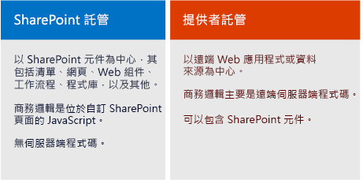

# SharePoint Add-ins
SharePoint Add-ins 是 SharePoint 網站的獨立延伸，該延伸為您所建立，且不需要在 SharePoint 伺服器上執行自訂程式碼。
## SharePoint 增益集 overview

有兩種基本類型的 SharePoint Add-ins — SharePoint 裝載和提供者裝載。若要為開發案例做最正確的決定，請先從學習 SharePoint Add-ins 這兩種類型的共同點開始。
  
    
    

> **注意事項**
> 裝置應用程式，例如行動應用程式，即便在存取 SharePoint 時，仍不能算是 「SharePoint Add-in。對於從 SharePoint 之外啟動的 Web 應用程式也是同樣的道理。如果您要開發這其中任一類型的應用程式，請參閱  [從行動裝置與原生裝置應用程式存取 SharePoint](http://msdn.microsoft.com/library/42014171-5ee5-421d-9cde-413efc3aecef%28Office.15%29.aspx)。 
  
    
    

- **SharePoint Add-in 為一種獨立的功能** ，可擴充 SharePoint 網站的功能，以解決完善定義的商務問題。
    
  
- **增益集不需要在 SharePoint 伺服器執行自訂程式碼** 。相反地，所有自訂的邏輯可「上」移至雲端，或「下」移至用戶端電腦，或是「移動」到 Sharepoint 伺服器陣列或 SharePoint Online 訂閱以外的內部部署伺服器。將自訂程式碼排除在 SharePoint 之外，可向 SharePoint 系統管理員保證，增益集無法破壞其伺服器或降低其 SharePoint Online 網站的效能。
    
  
- 在 SharePoint Add-in 的 **商務邏輯可透過包含在 SharePoint** 內多個用戶端 API 中的一個來進行 SharePoint 資料的存取。對於增益集所要使用的 API，會依您所做的某些其他設計決策而定。
    
  
- **幾乎所有 SharePoint 元件的主要類型都可以是 SharePoint Add-in** 的一部份，包含頁面、清單、工作流程、自訂內容類型、清單範本、網頁組件等等。
    
  
- SharePoint Add-ins 進行安裝以及使用者啟動所在的 **SharePoint 網站，都可稱作 主機 Web。** 不過，SharePoint 元件通常是在稱為增益集 Web的主機 Web 下的特殊子 Web 中。
    
  
- **SharePoint Add-ins 可以數種方式** 放入 SharePoint 網站中：
    
|||
|:-----|:-----|
||**做為沈浸式的整頁體驗** 可以有 SharePoint 頁面的外觀與風格。   |
||**做為網頁的一部分，使用一種特殊的控制項，稱作 增益集組件** ，呈現包含增益集的 iframe 元素。   |
||清單、文件等等 **做為擴充功能區和功能表的 UI 指令** 。   |
   
- **所有使用者所安裝的 SharePoint Add-ins 會在 SharePoint 網站的 **網站內容**頁面上並排顯示。** 按一下 [並排顯示] 以執行增益集。
    
  
- **使用「增益集資訊清單」設定 SharePoint Add-in** —該清單為 XML 檔案，在增益集啟動時，宣告增益集的基本屬性，執行的位置，和 SharePoint 開始時應執行的作業。在其他方面，資訊清單可以指定增益集支援的語言，其依據的 SharePoint 服務和功能，以及增益集所需的主機 Web 權限。(SharePoint Add-ins 可完全掌控其自身的增益集 Web。)
    
  
- **您在增益集套件中散佈的 SharePoint Add-ins** 一定要包含至少增益集資訊清單。（如果沒有 SharePoint 元件，增益集套件中就只有增益集資訊清單）。如果增益集在增益集 Web 中有 SharePoint 元件，這些都會包含在套件中，做為一組的 XML 檔案組。裝載於 SharePoint 外部的遠端元件，例如遠端 Web 應用程式或資料庫，不包含在套件中，並須分別從增益集套件部署。（不過，增益集資訊清單未指定遠端元件的 URL）。
    
  
- **增益集套件也可以包含 Office 增益集。** 當 SharePoint Add-in 安裝時，Office 增益集 會加入至 SharePoint 中的 Office 增益集 類別目錄。使用者可以從類別目錄將其安裝至 Office 應用程式，像是 Word 或 Excel。
    
  

> **秘訣**
> **請看幾個在** [Office 市集](https://store.office.com/appshome.aspx?productgroup=SharePoint) 以便更了解可以開發的方向。或是開啟 SharePoint 2013 網站並安裝一些免費的 SharePoint Add-ins。只要導覽至 ** 網站內容 | 新增增益集 | SharePoint 市集**。 
  
    
    

### 幾個針對 SharePoint 資深開發人員的要點

我們已取代包含自訂伺服器端程式碼的 沙箱化解決方案 。我們仍支援只包含 JavaScript 的「無程式碼」沙箱化解決方案 和 沙箱化解決方案。
  
    
    
SharePoint Add-ins 不使用伺服器端的 SharePoint 物件模型。用戶端物件模型在 SharePoint 2013 中會大幅擴展。雖然 SharePoint 伺服器物件模型中的某些 API 在用戶端物件模型中無法使用，這些幾乎都是和系統管理與安全性相關的類別。用來說明這些問題的自訂 SharePoint 邏輯更適用於 Windows PowerShell 指令碼或傳統 SharePoint farm solution。若要瞭解如何在 SharePoint Add-ins、傳統 SharePoint 伺服器陣列解決方案 和 沙箱化解決方案 間作選擇，請參閱  [與 SharePoint 解決方案比較 SharePoint 增益集](http://msdn.microsoft.com/library/0e9efadb-aaf2-4c0d-afd5-d6cf25c4e7a8%28Office.15%29.aspx)。
  
    
    

## 兩種可以散佈或銷售增益集套件的方式

您可以依兩種方式散佈增益集套件︰
  
    
    

- **散佈到組織的增益集目錄** ，也就是 SharePoint Online 訂閱或內部部署陣列中專用的 SharePoint 網站集合。當增益集是為特定組織量身訂做時，便可使用這個方法。
    
  
- **散佈到 [Office 市集](https://store.office.com/appshome.aspx?productgroup=SharePoint)** 。市集為您處理從探索、購買到更新的行銷程序。Microsoft 具有 **賣方儀表板** ，可協助您透過 Office Store 銷售增益集。
    
  
在您使用其中一種部署增益集的方法後，其可供安裝在 SharePoint 網站的 **新增增益集**網頁上。如果增益集需要主機 Web 或其父訂閱的權限，SharePoint 會提示要安裝增益集的使用者須授與這些權限。 
  
    
    
當您需要更新增益集以修正 Bug 或新增功能時，請在增益集資訊清單中進行變更，並提高增益集的版本號碼。然後重新將增益集套件部署至市集或增益集目錄。在 24 小時內，使用者會在 SharePoint 使用者介面中收到通知，表示有可用的更新。只要按一下便可以安裝更新。 
  
    
    

## 兩種 SharePoint Add-ins 的類型：SharePoint 裝載和提供者裝載

  
    
    

  
    
    

### SharePoint-hosted SharePoint Add-ins

SharePoint 裝載的增益集幾乎完整地包含 SharePoint 在增益集 Web 中的元件。它們有時是指在 SharePoint 中具有的中心。
  
    
    
如同所有的 SharePoint Add-ins，使用者可以從其所安裝的 SharePoint 網站中，在 **網站內容**網頁上的並排顯示，執行 SharePoint 裝載增益集。它也可以選擇在主機 Web 中有其他兩種 UI 元件；增益集組件和自訂動作 (也就是自訂功能區按鈕或功能表項目)。 **SharePoint 裝載增益集中的其他功能則部署在增益 Web。** 使用 XML 檔案，以宣告方式定義這些元件，而且它們還可以包括，當中其他的︰
  
    
    

||||
|:-----|:-----|:-----|
|自訂頁面    |工作流程    |模組 (檔案組)    |
|清單範本    |清單與程式庫的執行個體    |自訂清單表單及檢視    |
|自訂內容類型    |Web 範本    |內建欄 (非自訂欄)    |
|內建的 Web 組件 (非自訂 Web 組件)    |JavaScript 檔案    |增益集 Web 的自訂按鈕和功能表項目    |
   

  
    
    
所有在 SharePoint 裝載增益集的商務邏輯，皆可直接在自訂頁面上，或是從自訂頁面參照的 JavaScript 檔案中使用 JavaScript。SharePoint 物件模型 (JSOM) 的 JavaScript 版本可讓增益集更簡單地進行建立、讀取、更新和刪除 (CRUD) SharePoint 資料上的作業。
  
    
    
SharePoint 裝載增益集中的自訂頁面，通常是 ASP.NET 頁面 (ASPX)，並且可以宣告方式參照 ASP.NET 和內建的 SharePoint 控制項，但有可能沒有程式碼後置。不過，您可以使用用戶端呈現選項和自訂 JavaScript 來自訂 SharePoint 控制項。
  
    
    
在 SharePoint 裝載增益集中的 JavaScript 可以存取增益集 Web 之外的資料和資源，透過使用兩者其中一種技術，安全地解決瀏覽器的相同來源原則︰特殊的 JavaScript 跨網域程式庫或特定的 JavaScript WebProxy 類別。透過使用這些技術，SharePoint 裝載增益集可以在主機 Web 上、其父訂閱上，或在網際網路上的任何地方使用資料。
  
    
    

### 提供者裝載 SharePoint Add-ins

任何可以在 SharePoint 裝載增益集中的 SharePoint 元件，也可以在提供者裝載增益集之中 。但提供者裝載增益集和 SharePoint 裝載增益集是有所區別，因為它們包含至少一個遠端元件；例如，從外部 Sharepoint 伺服器陣列或 SharePoint Online 訂閱來裝載 Web 應用程式、服務或資料庫。這可以是在相同公司網路中做為 Sharepoint 伺服器陣列或雲端服務的伺服器。可以在任何虛擬主機堆疊，包括 Linux、Apache、MySQL、PHP (LAMP) 堆疊進行外部元件的裝載。 
  
    
    

> **注意事項**
> **「提供者」指的是擁有伺服器或雲端帳戶的人。** 它可以是擁有 Sharepoint 伺服器陣列或增益集安裝所在 SharePoint Online 承租的相同公司或組織。但增益集的開發人員也可以是提供者。一般而言，當為組織建立增益集，組織會提供代管。不過，當為多個組織建立增益集時，比較可能是由開發人員管理遠端元件。如果 SharePoint Add-in 是透過 Office Store 行銷，則開發人員代管為強制性；因為開發人員不具有任何增益集購買者的連絡人資訊。在這個案例中，增益集的不同執行個體都知道遠端元件的 URI，因為已在增益集資訊清單中指定。
  
    
    

您對於用在遠端元件的主機架構有充份的彈性。您不需要使用 Microsoft 堆疊。可以使用任何虛擬主機架構，包括 LAMP (Linux、pache 伺服器、MySQL、PHP)、MEAN (MongoDB、ExpressJS、AngularJS、Nodejs)、JAVA、Python，以及其他；而且您可以自由地使用非 Microsoft 開發的工具。此外，遠端元件可以裝載在非 Microsoft 的雲端服務內。
  
    
    
 **您可以提供增益集內的遠端頁面和 SharePoint 頁面一樣的外觀及操作** ，藉由使用特殊的組件區塊控制項。
  
    
    
 **遠端資料 可以是 Blob、快取、訊息佇列、內容傳遞網路 (CDN) 和資料庫** ，等等。而且資料庫可以是任何型別包括關聯式和物件導向。可以使用各種方式來存取遠端資料。例如，您可以使用 Business Connectivity Services (BCS) 來呈現 SharePoint 清單中的資料。另一種選項是在遠端 web 應用程式頁面上的格線內公開資料。
  
    
    
 **SharePoint Add-ins 使用 SharePoint API 連接並整合 SharePoint** 功能—搜尋、工作流程、社交網路、分類、使用者設定檔、BCS，以及其他等等。這可讓其閱讀文件、執行搜尋、與人聯繫，以及執行 CRUD 作業。有一組以上的 API：
  
    
    

- 當遠端元件和 .NET 進行實作，便可使用Managed 程式碼 **SharePoint 用戶端物件模型 (CSOM)** 程式庫。
    
  
- 針對不以.NET 為基礎的遠端元件，有一組 **REST/OData API** ，可用來存取 SharePoint 資料。如果您想要使用 OData 介面，這些也可以從 .NET 用戶端使用。
    
  
- 先前所述， **JSOM 程式庫** 無法用在遠端頁面上，但在這些頁面上的增益集 Web 和 JavaScript 內有自訂 SharePoint 頁面的提供者裝載增益集，則可以使用 JSOM 程式庫。
    
  
 **如同使用者及群組，存取 SharePoint 的提供者裝載增益集為安全性主體** 。如同使用者，增益集主體必須經驗證並授權。增益集需要權限以便執行在主機 Web 中的 SharePoint 資料作業。大部分的情況下，使用者透過 SharePoint Add-in 使用 SharePoint 的有效權限，為使用者權限及增益集權限的交集處；雖然在某些情況下，使用者可以使用增益集執行某些動作，是其在其他情況下不會有的權限。
  
    
    
 **提供者裝載增益集可以連線到任何內部或公用 Web 服務** ；而且，不像 SharePoint 裝載增益集，它們可以 **處理 SharePoint 清單和清單項目事件** ，例如將項目加入文件庫。
  
    
    

## 選擇您的 SharePoint 開發路徑

準備好要開始了嗎？
  
    
    

- **如果您是經驗豐富的 SharePoint 開發人員，我們建議您開始使用 SharePoint 裝載增益集。** 它們最類似於過去您所做的 SharePoint 延伸類型。
    
     [開始建立 SharePoint 主控 SharePoint 增益集](get-started-creating-sharepoint-hosted-sharepoint-add-ins.md)
    
  
- **如果您是經驗豐富的 ASP.NET Web 應用程式開發人員，我們建議您開始使用提供者裝載增益集。** 它們是以 Web 應用程式而建立的。
    
     [開始建立提供者主控 SharePoint 增益集](get-started-creating-provider-hosted-sharepoint-add-ins.md)
    
  
- **如果您想要在非 Microsoft 堆疊上開發提供者裝載增益集，以下是可以著手的方式︰**
    
  -  如果您還沒有工具，請安裝適用於堆疊的工具。
    
  
  - 請在 Office 365 取得以測試及偵錯為目的的開發人員帳戶。如需詳細資訊，請移至  [在 Office 365 上設定 SharePoint 增益集的開發環境](set-up-a-development-environment-for-sharepoint-add-ins-on-office-365.md)，或如果您已經有 Office 365 訂閱，您只需要 [在其上建立開發人員網站](create-a-developer-site-on-an-existing-office-365-subscription.md)。
    
  
  - 增益集將會使用 SharePoint 的 REST/OData API 來執行 SharePoint 資料上的 CRUD 作業︰
    
  - 在 [若要了解 SharePoint 2013 REST 服務取得](get-to-know-the-sharepoint-2013-rest-service.md)文章中尋找說明文件和其他所連結的文件。
    
  
  - 於  [適用於 SharePoint 2013 的 REST API 參考資料](http://msdn.microsoft.com/library/3514e753-19f9-4b41-a1ae-f35c5ffc17d2%28Office.15%29.aspx)尋找參考文件。
    
  
  - 如果您不使用 Visual Studio，您必須建立增益集資訊清單檔案和增益集套件。如需詳細資訊，請參閱 [探索應用程式資訊清單結構和套件的 SharePoint 增益集](explore-the-app-manifest-structure-and-the-package-of-a-sharepoint-add-in.md)。使用 Visual Studio 和 Microsoft Office Developer Tools for Visual Studio 來建立資訊清單和套件有許多節省時間的優點。我們建議您考慮這些因素，即使您使用其他工具來建立其本身的遠端 Web 應用程式。 [社群版本的 Visual Studio ](https://www.visualstudio.com/news/vs2013-community-vs.aspx)是免費的。
    
  
  - 在  [GitHub OfficeDev 一節](https://github.com/OfficeDev)有某些非 Microsoft 語言和平台的提供者裝載增益集範例；例如， [PHP-App-for-SharePoint](https://github.com/OfficeDev/PHP-App-for-SharePoint)。
    
  

> **注意事項**
> 如果您是 SharePoint 與 Web 開發的初學者，從 Microsoft Virtual Academy 的免費課程開始會受益最大，或是透過使用一本關於 SharePoint 2013 開發的書。 
  
    
    

## 請參閱

#### 其他資源

  
    
    
 [開始躍入開發 Microsoft SharePoint 伺服器 2013 核心解決方案](http://www.microsoftvirtualacademy.com/training-courses/developing-microsoft-sharepoint-server-2013-core-solutions-jump-start)
