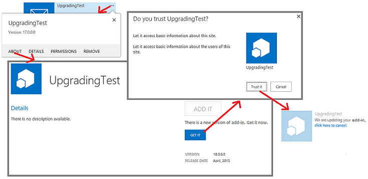

# 更新 SharePoint 增益集
了解如何建立及部署SharePoint Add-in更新。
您可以透過使用內建於SharePoint 2013更新支援更新您SharePoint Add-in 。24 小時內將增益集的更新的版本上傳至組織的增益集目錄或增益集接受Office Store中，在之後有可用的更新通知會顯示旁的 [安裝所在的每個網站的 **網站內容**] 頁面上的增益集。如您所見圖 1] 中，以立即安裝更新的使用者提供的連結。
  
    
    

**圖 1。SharePoint 更新程序的增益集**

  
    
    

  
    
    

  
    
    
使用者可以安裝更新而不第一個解除安裝舊版。更新基礎結構測試更新安裝並回復如果有任何錯誤會回復。
    
> **重要**
> 您無法變更使用更新系統的 *增益集類型*  。例如，就無法變更增益集從 SharePoint 主控的更新裝載提供者。若要變更的類型時，您需要 [從舊增益集新增一個移轉](sharepoint-add-ins-update-process.md#Major)。特別自 [在關閉自動裝載的增益集的預覽程式](http://blogs.office.com/2014/05/16/update-on-autohosted-apps-preview-program/)，您應該注意您無法提供者主控增益集來更新自動裝載增益集。您必須將轉換增益集 [將自動裝載 SharePoint 增益集轉換成提供者主控增益集 (英文)](convert-an-autohosted-sharepoint-add-in-to-a-provider-hosted-add-in.md)所述。
  
    
    

## 更新 SharePoint 增益集的必要條件

  
    
    

- 設定增益集隔離的測試SharePoint 2013安裝。請參閱如何設定Office 365 開發人員網站 [在 Office 365 上設定 SharePoint 增益集的開發環境](set-up-a-development-environment-for-sharepoint-add-ins-on-office-365.md)的指示。
    
  
- 通常是用於建立SharePoint Add-in工具也用於更新它。例如，大部分的開發人員使用Visual Studio和Microsoft Office Developer Tools for Visual Studio建立SharePoint Add-ins。
    
  

### 若要知道要更新的 SharePoint 增益集的核心概念

  
    
    

**表 1。更新 SharePoint 增益集的核心概念**

|**文章標題**|**描述**|
|:-----|:-----|
| [選擇如何開發和裝載您 SharePoint 的增益集的模式](choose-patterns-for-developing-and-hosting-your-sharepoint-add-in.md)   |了解不同類型的SharePoint Add-ins。更新程序類型而有所不同。   |
| [SharePoint 增益集更新程序](sharepoint-add-ins-update-process.md)   |了解更新SharePoint Add-ins的程序。   |
| [Upgrading Features](http://msdn.microsoft.com/library/e917f709-6491-4d50-adbe-2ab8f35da990%28Office.15%29.aspx)   |了解如何更新功能 (SharePoint 2010 SDK)。   |
| [部署及安裝 SharePoint 增益集： 方法與選項](deploying-and-installing-sharepoint-add-ins-methods-and-options.md)   |了解發佈、 安裝及解除安裝SharePoint Add-in方法。   |
| [處理事件中 SharePoint 增益集](handle-events-in-sharepoint-add-ins.md)   |了解SharePoint 2013中的遠端事件接收器。   |
   

## 在增益集更新的主要步驟

以下是當您建立SharePoint Add-in更新可能需要的主要步驟。每個步驟的詳細資訊連結的節或文章中討論。每個更新專案所需的所有步驟。您必須執行的動作而定元件中有哪些已增益集及元件您要新增。只有使用 ***** 標記的項目一律是必要的。
  
    
    

- 增益集的更新資訊清單。
    
  -  *引發中 appmanifest.xml 檔案的 [應用程式](http://msdn.microsoft.com/library/d5f30dfe-7500-5f85-0f08-f4f220c0c692%28Office.15%29.aspx)元素的 **Version**數字。(增益集已呼叫"apps"結構描述已先發行時)。請勿 *變更 **ProductID**數*  。
    
  
  - 變更 [  [AppPermissionRequests](http://msdn.microsoft.com/library/4e617622-78d3-3d23-677d-9957eb1fb107%28Office.15%29.aspx) ] 區段中的 appmanifest.xml 檔案。
    
  
  - 變更 [  [AppPrerequisites](http://msdn.microsoft.com/library/7622b55f-01a1-2c39-9daa-7cfb1a3c890f%28Office.15%29.aspx) ] 區段中的 appmanifest.xml 檔案。
    
  

    如需詳細資訊，請參閱 [更新增益集版本、 權限要求和先決條件](#UpdateManifest)。
    
  
- 新增或更新的增益集 web 元件的標記。如需詳細資訊，請參閱 [更新 SharePoint 2013 中的增益集 web 元件](update-add-in-web-components-in-sharepoint-2013.md)。
    
  
- 新增或更新主機 web 元件的標記。如需詳細資訊，請參閱 [更新 SharePoint 2013 中的主機 web 元件](update-host-web-components-in-sharepoint-2013.md)。
    
  
- 新增自訂邏輯至 [UpgradedEventEndpoint](http://msdn.microsoft.com/library/09a93d44-d295-47bb-f91c-d243178b0f53%28Office.15%29.aspx)並將其登錄 appmanifest.xml 檔案中。如需詳細資訊，請參閱 [建立更新事件處理常式中 SharePoint 增益集](create-a-handler-for-the-update-event-in-sharepoint-add-ins.md)。
    
  
- 更新遠端元件：
    
  - 提供者主控增益集、 更新遠端元件使用適用於主控平台堆疊的技術。
    
  

    如需詳細資訊，請參閱 [更新遠端元件的 SharePoint 增益集](update-remote-components-in-sharepoint-add-ins.md)。
    
  
-  *將增益集套件上傳至Office Store或組織的增益集目錄。
    
  

## 增益集更新的最佳作法

下列各節將討論您應該遵循的作法和重點考慮當您打算更新。
  
    
    

### 決定是否真的有更新

為提供者主控SharePoint Add-in、 改良功能的增益集不一定需要更新增益集。如果所有的變更會以遠端的元件] 這些變更沒有反映在 SharePoint 元件中，您可以變更遠端元件不會更新增益集。只要 Url 和 SharePoint 元件用來存取遠端元件的連線字串不會變更、 SharePoint Add-in會繼續運作。例如，假設您將按鈕新增至讀取欄從 SharePoint 清單無法沒有先前讀取 web 應用程式的遠端 web 應用程式。資料行已經存在清單上，如果您沒有變更在 SharePoint 中的任何項目。您可以將上傳 [修訂] 網頁的修訂程式碼後置或 JavaScript、 遠端 web 應用程式。當他們啟動SharePoint Add-in使用者立即使用的新功能。
  
    
    

### 請記住更新是使用者的選用屬性

當您SharePoint Add-in新版有空Office Store或組織的增益集目錄中時，在增益集並排顯示在有可用的更新以通知使用者 [ **網站內容**] 頁面上會出現訊息。延長不得超過 24 小時的值會出現此訊息。但在 SharePoint 基礎結構中為 nothing 強制使用者更新。因此對遠端元件所做的變更必須不會自動換行增益集的舊版本。一般，但不是太萬用，規則是您應該 *新增*  遠端元件的事項，但避免刪除、 重新命名、 移動或變更的結構描述、 連線字串或 URL 的任何現有的元件。
  
    
    
如果遠端元件需要知道的增益集執行個體呼叫它的版本，您可以從 SharePoint 傳遞此資訊。例如，您可以新增增益集版本為增益集的 [首頁](http://msdn.microsoft.com/library/3092674c-a6c3-9021-3d7e-e716562a4a4f%28Office.15%29.aspx)URL 上的查詢參數。
  
    
    

### 建立及偵錯新版好像它是全新的增益集

您應該分隔開發及偵錯的增益集從更新標記和邏輯的偵錯的新版本。若要這樣做，請從開發測試 SharePoint 網站解除安裝舊版的增益集。儲存較早版本的增益集套件檔案的備份複本。新增並依需要變更增益集的元件，然後先測試及偵錯它們針對測試網站好像很全新增益集從零開始建立。
  
    
    

### 測試與每個增益集的較早版本的更新

當新版的增益集有正確運作為"new"增益集時、 重建的程式碼和標記使專案已更新的舊的增益集。例如，增加如下所述 [在增益集更新的主要步驟](#MajorAppUpgradeSteps)增益集版本號碼。如需更新成開啟專案的詳細資訊，請參閱本主題的子主題。
  
    
    
當您準備好測試您更新、 撤銷新版從測試網站和重新部署舊版讓您可以測試更新邏輯。如果您已傳送的增益集的多個舊版、 安裝每個舊版不同測試網站的子網站上。然後將最新版的增益集上傳至測試網站的增益集目錄及更新的每個具有最新的增益集版本號碼及最新版的所有元件增益集確認每個執行個體。如果增益集的增益集網頁，確認已部署 [確認部署增益集 web 元件](update-add-in-web-components-in-sharepoint-2013.md#VerifyDeployAppWebComp)中使用此程序的增益集 web 元件。
  
    
    

### 增益集更新而不需要等候 24 小時

開發 SharePoint 測試網站上增益集更新、 時並不實用等待更新之間的 24 小時。您 (和實際執行的 SharePoint 網站上的使用者) 可以更新增益集上傳至Office Store或組織的增益集目錄進行這些步驟後，立即：
  
    
    

### 若要立即更新增益集

1. 最新的更新上傳至增益集目錄之後，開啟的增益集安裝所在的網站上的 [ **網站內容**] 頁面上，選擇 [增益集並排顯示的 [ **...** ] 按鈕。
    
  
2. 在開啟的註標，選擇 [ **關於**] 索引標籤。 **關於**在頁面上會隨即開啟，有新的版本是可用的通知。
    
  
3. 選擇 **要取得其**] 按鈕。[ **網站內容**] 頁面上時重新開啟，並沒有在增益集磚要更新的增益集的通知。
    
  
圖 2 說明這些步驟。
  
    
    

**圖 2。立即更新 SharePoint 增益集的程序**

  
    
    

  
    
    

  
    
    

    
> **注意事項**
> 如果您需要查看在增益集的 「 可更新 」 通知並排顯示每隔 24 小時進行較頻繁，您可以使用 [更新程序的 SharePoint 增益集](sharepoint-add-ins-update-process.md#Minor)所述的方法將會緊接著顯示的通知。
  
    
    

## 更新增益集版本、 權限要求和先決條件

之後Visual Studio專案資料夾的備份複本，請開啟的增益集專案。開啟增益集清單與引發資訊清單的設計工具在 [ **一般**] 索引標籤上的版本號碼。
  
    
    
如果增益集的更新的版本需要更多 (或更少) 元件的權限的主機網站，請視 [AppPermissionRequests](http://msdn.microsoft.com/library/4e617622-78d3-3d23-677d-9957eb1fb107%28Office.15%29.aspx) ] 區段中的增益集進行變更。在Visual Studio，使用設計程式資訊清單中的 [ **權限**] 索引標籤。增益集更新時，一律會授與權限、 權限已變更還是不自舊版以來提示使用者。如果新的版本要求 *較少*  的權限] 在以上的版本比以上版本 *未撤銷*  的其他權限。若要限制增益集的最新版本所需的權限的唯一方法是開啟頁面 *{SharePointDomain}*  `/_layouts/15/appinv.aspx`增益集更新之後，並再手動輸入符合的權限標記 [AppPermissionRequests](http://msdn.microsoft.com/library/4e617622-78d3-3d23-677d-9957eb1fb107%28Office.15%29.aspx)結構描述的使用者。
  
    
    
如果增益集的更新的版本具有必要的舊版沒有 (或不再具有較早版本有一些先決條件)、 視 [AppPrerequisites](http://msdn.microsoft.com/library/7622b55f-01a1-2c39-9daa-7cfb1a3c890f%28Office.15%29.aspx) ] 區段中的增益集進行變更。在Visual Studio，使用設計程式資訊清單中的 [ **必要條件**] 索引標籤。
  
    
    

## 後續步驟

繼續執行的 [在增益集更新的主要步驟](#MajorAppUpgradeSteps)] 區段中的下一個項目符號或直接移至其中的下列文章：
  
    
    

-  [更新 SharePoint 2013 中的增益集 web 元件](update-add-in-web-components-in-sharepoint-2013.md)
    
  
-  [更新 SharePoint 2013 中的主機 web 元件](update-host-web-components-in-sharepoint-2013.md)
    
  
-  [建立更新事件處理常式中 SharePoint 增益集](create-a-handler-for-the-update-event-in-sharepoint-add-ins.md)
    
  
-  [更新遠端元件的 SharePoint 增益集](update-remote-components-in-sharepoint-add-ins.md)
    
  

## 其他資源

-  [開發 SharePoint 的增益集](develop-sharepoint-add-ins.md)
    
  
-  [SharePoint 增益集更新程序](sharepoint-add-ins-update-process.md)
    
  

