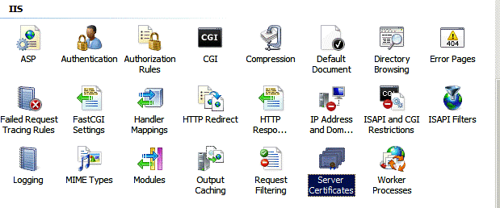
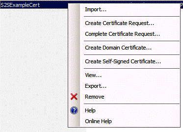
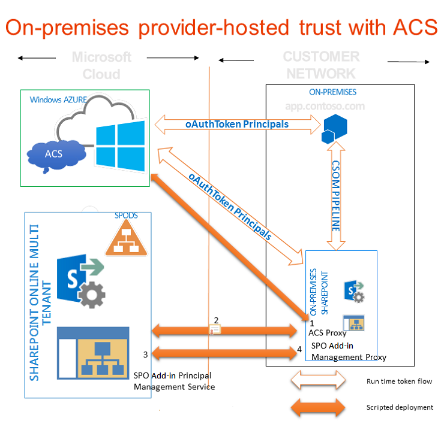

# 若要授權提供者主控增益集內部部署 SharePoint 網站上使用 Office 365 SharePoint 網站
使用Office 365 SharePoint 網站建立的環境，您可以使用 ACS 建立信任的提供者主控增益集與內部部署SharePoint 2013伺服器陣列之間如果您要開發Office 365 SharePoint 網站的增益集，就像的操作一樣。
## 使用 ACS 的提供者主控增益集在內部部署環境中的先決條件
<a name="Prerequisites"> </a>

請確定您有下列。
  
    
    

- 內部部署SharePoint 2013的開發環境。請參閱 [設定內部部署開發環境的 SharePoint 增益集](set-up-an-on-premises-development-environment-for-sharepoint-add-ins.md)。
    
  
- Office 365的 SharePoint 網站。如果其中一個還沒有您想要快速設定的開發環境，您可以 [在 Office 365 上設定 SharePoint 增益集的開發環境](set-up-a-development-environment-for-sharepoint-add-ins-on-office-365.md)。
    
  
-  [Visual Studio 2012](https://www.microsoft.com/en-us/download/details.aspx?id=30682)遠端或SharePoint 2013安裝的電腦上安裝。
    
  
-  [Microsoft Office for Visual Studio 2012 的開發人員工具](https://msdn.microsoft.com/en-us/office/aa905340.aspx) 。
    
  
- 64 位元版本的 [Microsoft Online Services 登入小幫手。](http://www.microsoft.com/en-us/download/details.aspx?id=41950)在您安裝SharePoint 2013電腦上安裝。
    
  
-  [Microsoft Online Services 模組用於 Windows Powershell (64 位元)](http://go.microsoft.com/fwlink/p/?linkid=236297)在您安裝SharePoint 2013電腦上安裝。
    
  

## 建立憑證，使其SharePoint 2013的內部部署安裝的安全性 token 服務 (STS) 憑證
<a name="Certificate"> </a>

您必須SharePoint 2013的內部部署安裝的預設安全性 token 服務 (STS) 憑證換成您自己的憑證。本文提供您如何建立和使用 IIS 中的 [ **建立自我簽署憑證**選項匯出測試憑證的範例。您也可以使用的憑證授權單位核發的商業憑證。
  
    
    
 [首先，建立測試.pfx 憑證檔案，然後再對應測試.cer 檔](http://msdn.microsoft.com/en-us/library/windows/hardware/ff552299%28v=vs.85%29.aspx)。
  
    
    
 [您也可以使用 MakeCert 測試程式產生測試 X.509 憑證](http://msdn.microsoft.com/en-us/library/ms537364%28VS.85%29.aspx)。
  
    
    

### 若要建立測試.pfx 憑證檔案


1. 在 [IIS 管理員] 中，選取 _ServerName_節點左側的樹狀檢視中。
    
  
2. 圖 1 所示，請選擇 **伺服器憑證**]。
    
   **圖 1。IIS 中的伺服器憑證選項**

  

     
  

  

  
3. 圖 2] 中所示，請按一下 [ **建立自我簽署憑證**連結在右側，連結的設定]。
    
   **圖 2。建立自我簽署憑證連結**

  

     
  

  

  
4. SampleCert，為憑證，然後選擇 **[確定]**。
    
  
5. 憑證，以滑鼠右鍵按一下，然後在圖 3 中所示，選擇 [ **匯出**]。
    
   **圖 3。匯出測試憑證**

  

     
  

  

  
6. 將檔案匯出至您選擇，將它密碼的位置。在此範例中，密碼是 **密碼** 。在生產環境中，使用強式密碼。請參閱 [建立強式密碼方針](http://msdn.microsoft.com/en-us/library/bb416446.aspx)和 [強式密碼](http://msdn.microsoft.com/en-us/library/ms161962.aspx)。
    
  

## 讓您的憑證SharePoint 2013的內部部署安裝的 STS 憑證
<a name="STSCertificate"> </a>

您已經有憑證，您可讓 STS 憑證內部部署 SharePoint 伺服器陣列。
  
    
    
開啟 [以系統管理員身分SharePoint Management Shell並執行這個Windows PowerShell指令碼。
  
    
    


```

$certPrKPath = "c:\\location of your .pfx file"
$certPassword = "password"
$stsCertificate = New-Object System.Security.Cryptography.X509Certificates.X509Certificate2 $certPrKPath, $certPassword, 20
Set-SPSecurityTokenServiceConfig -ImportSigningCertificate $stsCertificate -confirm:$false

```


> **注意事項**
> 可供下載 [的混合式 SharePoint 2013 資源頁面](http://www.microsoft.com/en-us/download/details.aspx?id=35593)上 [設定 Office 365 與 SharePoint Server 2013 單向混合式環境](http://download.microsoft.com/download/6/4/4/644BA525-96CB-4739-B08F-18949A9BDADC/sps-2013-config-one-way-hybrid-environment.docx)文件更詳細說明如何知名的憑證授權單位的憑證或自我簽署的憑證取代您的內部部署伺服器陣列的預設 STS 憑證。
  
    
    


## 設定您的內部部署安裝的SharePoint 2013使用 ACS
<a name="ConnectAAD"> </a>

圖 4 顯示啟用連線，您需要提供者主控增益集在內部部署網站上執行的整體架構中的四個步驟。當正在執行增益集時，它也會顯示 OAuth 權杖的流程。
  
    
    

**圖 4。請使用 Office 365 SharePoint 網站使用的 SharePoint 內部部署安裝的 ACS**

  
    
    

  
    
    

  
    
    

  
    
    

1. 在您的內部部署SharePoint 2013伺服器陣列中建立的 ACS proxy。
    
  
2. 安裝您Office 365 tenancy 內部部署伺服器的憑證。
    
  
3. 在您要執行的增益集至您Office 365 tenancy 的服務主體名稱集合的SharePoint 2013伺服器陣列中新增網站的完整的網域名稱。
    
  
4. 在您SharePoint 2013陣列上建立的增益集管理 proxy。
    
  
下列函數會以設定您的內部部署SharePoint 2013網站，以使用 ACS 的所有工作。您也可以使用此函數來執行某些清理工作，如果您需要移除先前的設定。有多種方式在 PowerShell 中執行的函數。以下是一種方法:
  
    
    

  
    
    

1. 在內部部署 SharePoint 伺服器上，在函數中複製的程式碼，將文字檔案並加以儲存以一個或另一下列資料夾 (而非兩者) MySharePointFunctions.psm1 名稱。您可能必須建立的路徑，部分包含不存在的資料夾。請注意，在這兩種情況下，[最低] 資料夾的路徑中已有相同的名稱另存檔案。
    
    > **秘訣**
      > 若要儲存為 ANSI 格式，不 utf-8 有檔案。PowerShell 載入使用非 ANSI 格式的檔案時，可能會提供語法錯誤。若要將其儲存為 ANSI 預設 Windows 記事本。如果您使用任何其他編輯器來儲存檔案時，請確定您要將其儲存為 ANSI。

  -  `C:\\users\\username\\documents\\windowspowershell\\modules\\MySharePointFunctions`，其中 _username_是將會執行檔案的伺服器陣列管理員。
    
  
  -  `C:\\windows\\system32\\windowspowershell\\V1.0\\modules\\MySharePointFunctions`
    
  
2. 開啟 [以系統管理員身分SharePoint Management Shell ，然後執行下列 cmdlet，以確認已列出 MySharePointFunctions 模組。
    
  ```
  
Get-Module -listavailable
  ```

3. 執行下列 cmdlet 匯入的模組。
    
  ```
  Import-Module MySharePointFunctions
  ```

4. 執行下列 cmdlet，以驗證連線 SPFarmToAAD 函數會列在模組的一部分:
    
  ```
  Get-Command -module MySharePointFunctions
  ```

5. 執行下列 cmdlet，以驗證連線 SPFarmToAAD 函數會載入。
    
  ```
  ls function:\\ | where {$_.Name -eq "Connect-SPFarmToAAD"}
  ```

6. 執行 `Connect-SPFarmToAAD`函數。請務必提供必要的參數和用於開發人員環境任何選擇性參數。請參閱下一節的詳細資料] 與 [範例。
    
  

  
    
    

### 連線 SPFarmToAAD 函數參數
<a name="parameters"> </a>


|**參數**|**值**|
|:-----|:-----|
| `-AADDomain`(必要) <br/> |*。 您註冊Office 365網站時所建立的 onmicrosoft.com 網域 ( _yourcustomdomain_。 onmicrosoft.com)。當指令碼會提示您驗證時，請使用使用者名稱和密碼，您建立此網域:  _username_@ _yourcustomdomain_。 onmicrosoft.com。 <br/> |
| `-SharePointOnlineUrl`(必要) <br/> |Office 365 SharePoint 網站的 URL ( _https://yourcustomdomain_。 sharepoint.com)。請注意的上層網域 *不*  onmicrosoft.com。 <br/> |
| `-SharePointWeb`(有時必填) <br/> |您會在其中執行提供者主控增益集的內部部署 SharePoint web 應用程式完整 URL (包括通訊協定)。此函數將從您的內部部署伺服器陣列中只有一個 SharePoint web 應用程式加入至 ACS。如果您沒有此指定的值，指令碼會在您的伺服器陣列中選取第一個 web 應用程式。如果您使用 [主機名稱網站集合 (HNSC) 可定義使用萬用字元 (例如 _http://*.contoso.com_)，您可以為值使用該字串，此參數的項目。如果 web 應用程式有網際網路區域的替代存取對應 (AAM)，您必須使用該 AAM URL 此參數。如果 SharePoint web 應用程式未設定為 HTTPS，您必須使用 HTTP 為通訊協定和 *必須使用 - AllowOverHttp 切換 (請參閱下面這個資料表)。*  <br/> 如果您想要執行提供者主控的增益集在您的伺服器陣列中的多個 web 應用程式使用 ACS，必須將其新增至服務主體名稱集合。遵循下列 `Connect-SPFarmToAAD`函數的Windows PowerShell指令碼會顯示如何將您的伺服器陣列上的所有 web 應用程式新增至服務主體名稱集合。 <br/> |
| `-AllowOverHttp`(選用) <br/> |如果您正在使用的開發環境，而且不想使用 SSL 與增益集，請使用這個選項。您必須使用這個選項，如果 SharePoint web 應用程式不設定為 HTTPS。 <br/> |
| `-O365Credentials`(選用) <br/> |第一個字元是 「 O 」，不零大寫字母。如果您發現自己重複執行指令碼偵錯，此選項可讓您不必手動輸入您的 O365 名稱和密碼每次。您可以使用此參數之前，您必須建立您將會透過下列 cmdlet，指派認證物件: <br/> ```$User = "username@yourcustomdomain.onmicrosoft.com"$PWord = ConvertTo-SecureString -String "the_password" -AsPlainText -Force$Credential = New-Object -TypeName System.Management.Automation.PSCredential -ArgumentList $User, $PWord```使用 `$Credential`為 `-O365Credentials`參數的值。 <br/> |
| `-Verbose`(選用) <br/> |這個參數會產生更詳細的意見反應，如果函數無法運作，您需要回到偵錯可能有幫助的。 <br/> |
| `-RemoveExistingACS`(選用) <br/> |如果您要取代現有的Microsoft Azure Active Directory 連線，請使用這個選項。如果您已經建立一個陣列，它就會移除現有的 ACS proxy。 <br/> |
| `-RemoveExistingSTS`(選用) <br/> |如果您要取代現有的Microsoft Azure Active Directory 連線，請使用這個選項。它會移除現有的信任的安全性權杖發行者的從左移到從舊版連線到 ACS。 <br/> |
| `-RemoveExistingSPOProxy`(選用) <br/> |如果您要取代現有的Microsoft Azure Active Directory 連線，請使用這個選項。如果您已經建立一個陣列，它就會移除現有的增益集管理 proxy。 <br/> |
| `-RemoveExistingAADCredentials`(選用) <br/> |如果您要取代Office 365 SharePoint 網站，請使用這個選項。 <br/> |
   
以下是範例:
  
    
    

```

Connect-SPFarmToAAD -AADDomain 'MyO365Domain.onmicrosoft.com' -SharePointOnlineUrl https://MyO365Domain.sharepoint.com

Connect-SPFarmToAAD -AADDomain 'MyO365Domain.onmicrosoft.com' -SharePointOnlineUrl https://MyO365Domain.sharepoint.com -SharePointWeb https://fabrikam.com

Connect-SPFarmToAAD -AADDomain 'MyO365Domain.onmicrosoft.com' -SharePointOnlineUrl https://MyO365Domain.sharepoint.com -SharePointWeb http://northwind.com -AllowOverHttp

Connect-SPFarmToAAD -AADDomain 'MyO365Domain.onmicrosoft.com' -SharePointOnlineUrl https://MyO365Domain.sharepoint.com -SharePointWeb http://northwind.com -AllowOverHttp -RemoveExistingACS -RemoveExistingSTS -RemoveExistingSPOProxy -RemoveExistingAADCredentials

```


### 連線 SPFarmToAAD 函數指令碼
<a name="function"> </a>


```

function Connect-SPFarmToAAD {
param(
    [Parameter(Mandatory)][String]   $AADDomain,
    [Parameter(Mandatory)][String]   $SharePointOnlineUrl,
    #Specify this parameter if you don't want to use the default SPWeb returned
    [Parameter()][String]            $SharePointWeb,
    [Parameter()][System.Management.Automation.PSCredential] $O365Credentials,
    #Use these switches if you're replacing an existing connection to AAD.
    [Parameter()][Switch]            $RemoveExistingACS,
    [Parameter()][Switch]            $RemoveExistingSTS,
    [Parameter()][Switch]            $RemoveExistingSPOProxy,
    #Use this switch if you're replacing the Office 365 SharePoint site.
    [Parameter()][Switch]            $RemoveExistingAADCredentials,
    #Use this switch if you don't want to use SSL when you launch your app.
    [Parameter()][Switch]            $AllowOverHttp
)
    #Prompt for credentials right away.
    if (-not $O365Credentials) {
        $O365Credentials = Get-Credential -Message "Admin credentials for $AADDomain"
    }
    Add-PSSnapin Microsoft.SharePoint.PowerShell
    #Import the Microsoft Online Services Sign-In Assistant.
    Import-Module -Name MSOnline
    #Import the Microsoft Online Services Module for Windows Powershell.
    Import-Module MSOnlineExtended -force -verbose 
    #Set values for Constants.
    New-Variable -Option Constant -Name SP_APPPRINCIPALID -Value '00000003-0000-0ff1-ce00-000000000000' | Out-Null
    New-Variable -Option Constant -Name ACS_APPPRINCIPALID -Value '00000001-0000-0000-c000-000000000000' | Out-Null
    New-Variable -Option Constant -Name ACS_APPPROXY_NAME -Value ACS
    New-Variable -Option Constant -Name SPO_MANAGEMENT_APPPROXY_NAME -Value 'SPO Add-in Management Proxy'
    New-Variable -Option Constant -Name ACS_STS_NAME -Value ACS-STS
    New-Variable -Option Constant -Name AAD_METADATAEP_FSTRING -Value 'https://accounts.accesscontrol.windows.net/{0}/metadata/json/1'
    New-Variable -Option Constant -Name SP_METADATAEP_FSTRING -Value '{0}/_layouts/15/metadata/json/1'
    #Get the default SPWeb from the on-premises farm if no $SharePointWeb parameter is specified.
    if ([String]::IsNullOrEmpty($SharePointWeb)) {
        $SharePointWeb = Get-SPSite | Select-Object -First 1 | Get-SPWeb | Select-Object -First 1 | % Url
    }

    #Configure the realm ID for local farm so that it matches the AAD realm.
    $ACSMetadataEndpoint = $AAD_METADATAEP_FSTRING -f $AADDomain
    $ACSMetadata = Invoke-RestMethod -Uri $ACSMetadataEndpoint
    $AADRealmId = $ACSMetadata.realm

    Set-SPAuthenticationRealm -ServiceContext $SharePointWeb -Realm $AADRealmId
    
    $LocalSTS = Get-SPSecurityTokenServiceConfig
    $LocalSTS.NameIdentifier = '{0}@{1}' -f $SP_APPPRINCIPALID,$AADRealmId
    $LocalSTS.Update()

    #Allow connections over HTTP if the switch is specified.
    if ($AllowOverHttp.IsPresent -and $AllowOverHttp -eq $True) {
        $serviceConfig = Get-SPSecurityTokenServiceConfig
        $serviceConfig.AllowOAuthOverHttp = $true
        $serviceConfig.AllowMetadataOverHttp = $true
        $serviceConfig.Update()
    }

    #Step 1: Set up the ACS proxy in the on-premises SharePoint farm. Remove the existing ACS proxy
    #if the switch is specified.
    if ($RemoveExistingACS.IsPresent -and $RemoveExistingACS -eq $True) {
        Get-SPServiceApplicationProxy | ? DisplayName -EQ $ACS_APPPROXY_NAME | Remove-SPServiceApplicationProxy -RemoveData -Confirm:$false
    }
    if (-not (Get-SPServiceApplicationProxy | ? DisplayName -EQ $ACS_APPPROXY_NAME)) {
        $AzureACSProxy = New-SPAzureAccessControlServiceApplicationProxy -Name $ACS_APPPROXY_NAME -MetadataServiceEndpointUri $ACSMetadataEndpoint -DefaultProxyGroup
    }

    #Remove the existing security token service if the switch is specified.
    if ($RemoveExistingSTS.IsPresent) {
        Get-SPTrustedSecurityTokenIssuer | ? Name -EQ $ACS_STS_NAME | Remove-SPTrustedSecurityTokenIssuer -Confirm:$false
    }
    if (-not (Get-SPTrustedSecurityTokenIssuer | ? DisplayName -EQ $ACS_STS_NAME)) {
        $AzureACSSTS = New-SPTrustedSecurityTokenIssuer -Name $ACS_STS_NAME -IsTrustBroker -MetadataEndPoint $ACSMetadataEndpoint
    }

    #Update the ACS Proxy for OAuth authentication.
    $ACSProxy = Get-SPServiceApplicationProxy | ? Name -EQ $ACS_APPPROXY_NAME
    $ACSProxy.DiscoveryConfiguration.SecurityTokenServiceName = $ACS_APPPRINCIPALID
    $ACSProxy.Update()

    #Retrieve the local STS signing key from JSON metadata.
    $SPMetadata = Invoke-RestMethod -Uri ($SP_METADATAEP_FSTRING -f $SharePointWeb)
    $SPSigningKey = $SPMetadata.keys | ? usage -EQ "Signing" | % keyValue
    $CertValue = $SPSigningKey.value
    
    #Connect to Office 365.
    Connect-MsolService -Credential $O365Credentials
    #Remove existing connection to an Office 365 SharePoint site if the switch is specified.
    if ($RemoveExistingAADCredentials.IsPresent -and $RemoveExistingAADCredentials -eq $true) {
        $msolserviceprincipal = Get-MsolServicePrincipal -AppPrincipalId $SP_APPPRINCIPALID
        [Guid[]] $ExistingKeyIds = Get-MsolServicePrincipalCredential -ObjectId $msolserviceprincipal.ObjectId -ReturnKeyValues $false | % {if ($_.Type -ne "Other") {$_.KeyId}}
        Remove-MsolServicePrincipalCredential -AppPrincipalId $SP_APPPRINCIPALID -KeyIds $ExistingKeyIds
    }
    #Step 2: Upload the local STS signing certificate
    New-MsolServicePrincipalCredential -AppPrincipalId $SP_APPPRINCIPALID -Type Asymmetric -Value $CertValue -Usage Verify

    #Step 3: Add the service principal name of the local web application, if necessary.
    $indexHostName = $SharePointWeb.IndexOf('://') + 3
    $HostName = $SharePointWeb.Substring($indexHostName)
    $NewSPN = '{0}/{1}' -f $SP_APPPRINCIPALID, $HostName
    $SPAppPrincipal = Get-MsolServicePrincipal -AppPrincipalId $SP_APPPRINCIPALID
    if ($SPAppPrincipal.ServicePrincipalNames -notcontains $NewSPN) {
        $SPAppPrincipal.ServicePrincipalNames.Add($NewSPN)
        Set-MsolServicePrincipal -AppPrincipalId $SPAppPrincipal.AppPrincipalId -ServicePrincipalNames $SPAppPrincipal.ServicePrincipalNames
    }

    #Remove the existing SharePoint Online proxy if the switch is specified.
    if ($RemoveExistingSPOProxy.IsPresent -and $RemoveExistingSPOProxy -eq $True) {
        Get-SPServiceApplicationProxy | ? DisplayName -EQ $SPO_MANAGEMENT_APPPROXY_NAME | Remove-SPServiceApplicationProxy -RemoveData -Confirm:$false
    }
    #Step 4: Add the SharePoint Online proxy
    if (-not (Get-SPServiceApplicationProxy | ? DisplayName -EQ $SPO_MANAGEMENT_APPPROXY_NAME)) {
        $spoproxy = New-SPOnlineApplicationPrincipalManagementServiceApplicationProxy -Name $SPO_MANAGEMENT_APPPROXY_NAME -OnlineTenantUri $SharePointOnlineUrl -DefaultProxyGroup
    }  
}
```


### 設定增益集與Office Store的 SharePoint web 應用程式
<a name="function"> </a>

如果他們想讓使用者能夠安裝提供者主控的增益集使用Office StoreACS，有生產環境中，應採用伺服器陣列管理員是選擇性的設定步驟。(其用途不在您的 SharePoint 開發環境除非您安裝增益集存放區上的環境中使用 ACS 的計劃。) 下列 cmdlet 這可讓。將此程式碼可以新增至上述的函數。
  
    
    

```

New-SPMarketplaceWebServiceApplicationProxy -Name "ApplicationIdentityDataWebServiceProxy" -ServiceEndpointUri "https://oauth.sellerdashboard.microsoft.com/ApplicationIdentityDataWebService.svc" -DefaultProxyGroup

```

也是一個不錯的實際執行 SharePoint web 應用程式已完成上述設定步驟之後，請啟動 **增益集需要存取網際網路具結束點的**功能。(請參閱下列指示)。此功能會實際執行任何動作。只要當成旗標，告知Office Store可以安裝在 SharePoint web 應用程式中的網站上的提供者主控的增益集使用 ACS。
  
    
    
系統可能會對您SharePoint Add-in的增益集資訊清單產生影響。如果您打算銷售增益集透過市集，是新增下列 **AppPrerequiste**的 **AppPrerequisites**區段增益集資訊清單的最佳作法:
  
    
    


```

<AppPrerequisite Type="Feature" ID="{7877bbf6-30f5-4f58-99d9-a0cc787c1300}" />
```

必要條件的效果，是當使用者瀏覽從內部部署 SharePoint 伺服器陣列市集，增益集會灰色及可解除安裝時上層 SharePoint web 應用程式沒有啟用 **增益集需要存取網際網路具端點的**功能。這樣您就不會從客戶的內部部署的 SharePoint 網站和尋找無法運作的安裝增益集取得抱怨。
  
    
    
有兩種方法可以啟用的功能。第一種是在任何 SharePoint 伺服器上執行下列 PowerShell cmdlet (也就可以加入至上述函式結尾):
  
    
    


```
Enable-SPFeature -identity "7877bbf6-30f5-4f58-99d9-a0cc787c1300" -Url http://domain_of_the_SharePoint_web_application
```

若要啟用此功能的另一個方式是執行下列步驟在管理中心:
  
    
    

1. 在 **SharePoint 管理中心**] 中瀏覽至 **應用程式管理 |管理 web 應用程式**。
    
  
2. 在 [ **管理 Web 應用程式**] 頁面中，選取您想要變更的 web 應用程式。
    
  
3. 在功能區中，按一下 [ **管理功能**]。
    
  
4. 在 [功能] 清單旁 **增益集，需要存取網際網路具結束點**] 下，按一下 [ **啟動**]。
    
  
5. 按一下 [確定]。
    
  

  
    
    

### 設定伺服器陣列中的其他 SharePoint web 應用程式
<a name="function"> </a>

如果您在 SharePoint 伺服器陣列上有其他 web 應用程式，且您想要執行提供者主控的增益集在其使用 ACS 信任，您可以將其新增至服務主體名稱集合 (在SharePoint Management Shell) 使用此Windows PowerShell指令碼。
  
    
    

```
$SPAppPrincipal = Get-MsolServicePrincipal -AppPrincipalId 00000003-0000-0ff1-ce00-000000000000
$id = "00000003-0000-0ff1-ce00-000000000000/"

Get-SPWebApplication | ForEach-Object {
    $hostName = $_.Url.substring($_.Url.indexof("//") + 2)
    $hostName = $hostName.Remove($hostName.Length - 1, 1)

    $NewSPN = $id + $hostName

    Write-Host "Adding SPN for" $NewSPN

    if ($SPAppPrincipal.ServicePrincipalNames -notcontains $NewSPN) {
       $SPAppPrincipal.ServicePrincipalNames.Add($NewSPN)
       Set-MsolServicePrincipal -AppPrincipalId $SPAppPrincipal.AppPrincipalId -ServicePrincipalNames $SPAppPrincipal.ServicePrincipalNames
    }
}

```


## 後續步驟
<a name="CreateApp"> </a>

請依照 [開始建立提供者主控 SharePoint 增益集](get-started-creating-provider-hosted-sharepoint-add-ins.md)建立簡單"hello 全球 「 提供者主控增益集與權杖發行者使用 ACS。
  
    
    

## 其他資源
<a name="bk_addresources"> </a>


-  [授權與驗證的 SharePoint 增益集](authorization-and-authentication-of-sharepoint-add-ins.md)
    
  
