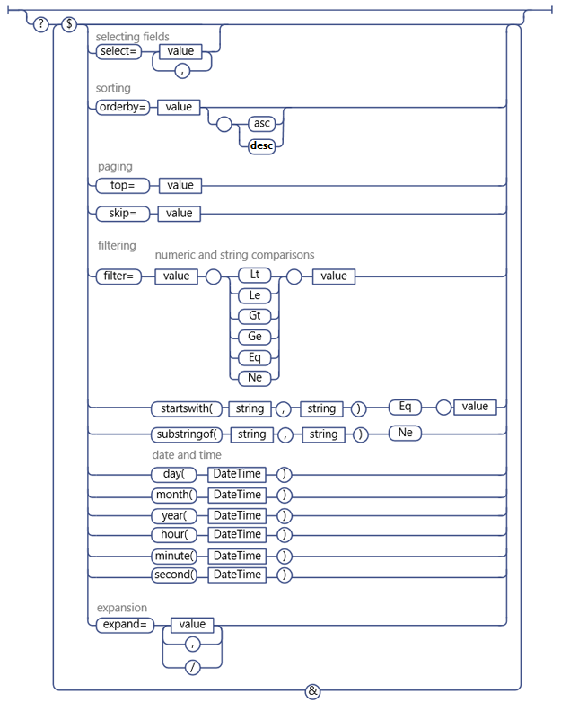

# 在 SharePoint 其餘邀請中使用 OData 查詢作業
瞭解如何使用寬 OData 查詢字串運算子來選取、 篩選和排序您從 SharePoint 其餘服務要求的資料。
 **在您開始之前**
  
    
    

-  [若要了解 SharePoint 2013 REST 服務取得](get-to-know-the-sharepoint-2013-rest-service.md)
    
  
-  [瀏覽表示 REST 服務中的 SharePoint 資料結構](navigate-the-sharepoint-data-structure-represented-in-the-rest-service.md)
    
  
-  [決定 SharePoint REST 服務端點 Uri](determine-sharepoint-rest-service-endpoint-uris.md)
    
  

SharePoint 其餘服務支援寬 OData 查詢字串運算子可讓您可以選取、 篩選和排序您要求的資料。
  
    
    

> **秘訣**
> SharePoint Online （與內部部署SharePoint 2016年及更新版本） 其餘服務支援合併成單一呼叫服務的多個要求，請使用 OData  `$batch`查詢選項。 如需詳細資料與程式碼範例的連結，請參閱 [請使用 REST Api 的批次要求](make-batch-requests-with-the-rest-apis.md)。
  
    
    

## 選取要傳回的欄位

使用 [$select](http://www.odata.org/documentation/odata-version-2-0/uri-conventions#SelectSystemQueryOption)查詢選項，指定要指定的清單、 清單項目，或其他 SharePoint 物件表示實體集傳回的欄位。您可以使用 `$select=*`傳回所有可用的欄位。
  
    
    

> **注意事項**
> 一般而言，如果您不指定 `$select`查詢選項，其餘服務會預設傳回所有可用的欄位。不過，在一些情況下，部分 SharePoint 物件包括非常耗用擷取; 資源的屬性若要最佳化其餘服務效能，這些屬性不會包含在預設查詢，然後必須明確要求。> 例如， **SPWeb.EffectiveBasePermissions**屬性就不會傳回根據預設，，必須明確要求使用 `$select`查詢] 選項。
  
    
    

此外，您可以指定要求會傳回預期的欄位，從其他清單及值的查閱。若要這麼做，請指定欄位名稱中的 `$select` 」 及 「 `$expand`查詢選項。例如 ︰
  
    
    
 `http://server/site/_api/web/lists('guid')/items?$select=Title,Products/Name&amp;$expand=Products/Name`
  
    
    
不支援大量展開] 及 [選取範圍的相關項目。
  
    
    

## 選取要傳回的項目

若要選取要傳回的項目使用 [$filter](http://www.odata.org/documentation/odata-version-2-0/uri-conventions#FilterSystemQueryOption)查詢選項。 [在 SharePoint 的其餘服務中支援的 OData 查詢運算子](#bk_supported)清單篩選查詢比較] 選項，您可以使用 SharePoint 其餘服務的函數。
  
    
    

## 單一值的查閱欄位的查詢

單一值的查閱欄位由兩個 SharePoint 其餘服務中的另一個欄位 ︰ 一個代表實際的欄位值，以及另一個代表欄位名稱的欄位。當您想要的資料類型的任何其他欄位，您可以執行查閱欄位值的查詢。例如，如果查閱欄位值是字串，您可以使用字串比較選項您在查詢中。
  
    
    

## 使用者的查詢

在 SharePoint 的其餘服務中，使用者會以使用者的好記 （顯示） 的名稱，並不其別名或的網域 \\ 別名組合。因此，您必須建立使用者對查詢使用者的好記的名稱。
  
    
    

> **注意事項**
> 不支援的成員資格為基礎的使用者查詢。> 不支援 **Current**運算子如何使用目前的使用者識別碼查詢的使用方式。
  
    
    

## 多重值查閱欄位和使用者的查詢

多個值的字串傳回多重值查閱欄位，因為沒有至查詢的方法 （例如，相當於 **Includes**項目或 **NotIncludes**項目不支援時）。
  
    
    

## 傳回的項目排序

使用 [$orderby](http://www.odata.org/documentation/odata-version-2-0/uri-conventions#OrderBySystemQueryOption)查詢選項來指定如何排序您的查詢傳回集合中的項目。若要依據多個欄位排序，指定逗點分隔的欄位清單。您也可以指定是否要排序的項目以遞增或遞減順序，請將 **asc**或 **desc**關鍵字附加至您的查詢。
  
    
    

## 瀏覽傳回的項目

若要選取的項目，否則會傳回查詢子集使用 [$top](http://www.odata.org/documentation/odata-version-2-0/uri-conventions#TopSystemQueryOption)和 [$skiptoken](http://msdn.microsoft.com/library/dd942121.aspx)查詢選項。
  
    
    

> **注意事項**
> $Skip 查詢選項不適用於 SharePoint 清單項目的的查詢。
  
    
    

 `$top`選項可讓您選取第 *n*  個項目，為傳回的回覆。例如，下列 URI 要求實際上傳回的第一次十個項目預期傳回集合中 ︰
  
    
    
 `http://server/site/_api/web/lists('<guid>')/items$top=10`
  
    
    
$Skiptoken 選項可讓您略過的項目，直到達到指定的項目，並傳回其餘部分。
  
    
    
 `$skiptoken=Paged=TRUE&amp;p_ID=5`
  
    
    

> **注意事項**
> 使用這些查詢選項時，考慮 OData 中的分頁是序數。例如，假設您在實作下的 [頁面] 按鈕，以顯示 SharePoint 清單項目。您使用的其餘服務啟用以傳回項目 1-20 按一下時，[] 按鈕，然後項目 21 透過 40，依此類推。不過，假設其他使用者刪除的項目 4 18 之間按下 [下一步] 按鈕。在這種情況下，重設序數的其他項目的位置，並顯示項目到 40 21 實際略過超過兩個項目。
  
    
    

## 在 SharePoint 的其餘服務中支援的 OData 查詢運算子

|**支援。**|**不支援。**|
|:-----|:-----|
|**數字的比較**   Lt   Le   Gt   Ge   Eq   Ne   |算術運算子          新增、 子、 Mul、 Div (Mod）   基本的數學函數          （round、 樓面 ceiling）   |
|**字串比較**   startsWith   substringof   Eq   Ne   |endsWith   replace   子字串   tolower   toupper   修剪   concat 函數   |
|**日期與時間函數**   day()   month()   year()   hour()   minute()   second()   |DateTimeRangesOverlap 運算子   查詢為日期時間是否落在循環日期時間模式   |
   
下圖顯示支援的 OData 查詢選項。
  
    
    

**支援的 OData 查詢選項**

  
    
    

  
    
    

  
    
    

  
    
    

  
    
    

## 其他資源

-  [若要了解 SharePoint 2013 REST 服務取得](get-to-know-the-sharepoint-2013-rest-service.md)
    
  
-  [使用 SharePoint 2013 其餘端點完成基本作業](complete-basic-operations-using-sharepoint-2013-rest-endpoints.md)
    
  
-  [使用清單及清單項目與 REST](working-with-lists-and-list-items-with-rest.md)
    
  
-  [使用資料夾與其餘的檔案](working-with-folders-and-files-with-rest.md)
    
  
-  [瀏覽表示 REST 服務中的 SharePoint 資料結構](navigate-the-sharepoint-data-structure-represented-in-the-rest-service.md)
    
  
-  [決定 SharePoint REST 服務端點 Uri](determine-sharepoint-rest-service-endpoint-uris.md)
    
  
-  [REST API 參考和範例](http://msdn.microsoft.com/library/02128c70-9d27-4388-9374-a11bce68fdb8%28Office.15%29.aspx)
    
  

  
    
    
