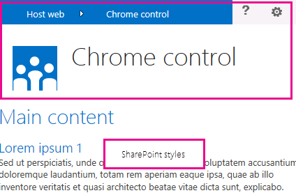

# UX 設計的 SharePoint 增益集
了解使用者經驗時建立增益集SharePoint 2013有的 (UX) 選項。
身為開發人員，您應該永遠以提供高優先順序的使用者經驗 (UX) 建立增益集時。SharePoint 增益集相關的模型提供許多 UX 元件和機制可協助您建立更好的使用者經驗。增益集模型中的使用者經驗也是足夠的彈性，讓您使用的技術和最能否的一般使用者需求的平台。
  
    
    

## 增益集 UX SharePoint 2013中的高階概觀 (英文)

為增益集開發人員，您必須知道您的增益集的架構。決定您的增益集將分佈方式在遠端與 SharePoint 平台之後，您可以決定之間建置您的增益集 UX 可用的替代方法您可能會要求您自己的下列問題：
  
    
    

- 如果我正在建立雲端託管增益集 (英文)，我可以使用什麼？
    
  
- 如果我正在建立的SharePoint 裝載增益集 (英文)，我可以使用什麼？如需詳細資訊，請參閱 [選擇如何開發和裝載您 SharePoint 的增益集的模式](choose-patterns-for-developing-and-hosting-your-sharepoint-add-in.md)。
    
  
- 如何連線到主機 web 我 UX？如需詳細資訊，請參閱 [主機 web、 增益集 web 及 SharePoint 2013 中的 SharePoint 元件](host-webs-add-in-webs-and-sharepoint-components-in-sharepoint-2013.md)。
    
  
下圖顯示的主要案例及考量當您在設計您的增益集 UX 的選項
  
    
    

**圖 1。增益集 UX 主要案例及選項**

  
    
    

  
    
    

  
    
    
選擇您的設計，您應該基本上考慮增益集的哪個部分都架設在 SharePoint 和這不是。您也應該考量增益集的互動方式主機網頁。
  
    
    

## 增益集 UX 案例在雲端託管增益集

假設您決定的使用者經驗的部分不架設 SharePoint 中。這些案例中，預計在您的使用者移反覆之間的 SharePoint 網站及雲端託管增益集。您可以使用的技術和工具中的平台，但 SharePoint 也提供的資源可協助您設計更順暢的使用者。
  
    
    
雲端託管增益集在SharePoint 2013可用下列 UX 資源：
  
    
    

- **Chrome 控制項:**Chrome 控制項可讓您可以使用在增益集中的特定 SharePoint 網站的導覽標頭而不需要註冊的伺服器文件庫或使用特定的技術或工具。若要使用這項功能，您必須註冊透過標準 < 指令碼 > 標記 SharePoint JavaScript文件庫。您可以使用 HTML **div**元素提供版面配置區及進一步自訂控制項使用可用的選項。控制項繼承指定的 SharePoint 網站及其外觀。如需詳細資訊，請參閱 [使用用戶端的 chrome 控制項中 SharePoint 增益集](use-the-client-chrome-control-in-sharepoint-add-ins.md)。
    
   **觀賞影片： SharePoint 2013 的 chrome 控制項**

  

  
    
    

  
    
    

  
    
    

  
    
    
- **Stylesheet:** 您可以在您SharePoint Add-in中參考的 SharePoint 網站的樣式表和使用樣式這些網頁使用可用的類別。此外，如果使用者變更 SharePoint 網站的佈景主題、 增益集可以採用一組新的樣式而不修改中增益集的參照。如需詳細資訊，請參閱 [使用 SharePoint 網站的樣式表中 SharePoint 增益集](use-a-sharepoint-website-s-style-sheet-in-sharepoint-add-ins.md)。
    
  
圖 2 顯示SharePoint 增益集相關的模型雲端託管增益集的資源。
  
    
    

**圖 2。增益集 UX 的資源雲端託管增益集**

  
    
    

  
    
    

  
    
    

  
    
    

  
    
    

## 增益集 UX 案例中 SharePoint 主控的增益集

如果您的增益集在 SharePoint 中裝載，所以使用者經驗也可能無法變更太多主機 web 及增益集網路之間來回移動使用者時。增益集部署時，增益集 web 採用的樣式表和佈景主題與主機 web。您仍然可以使用的 chrome 控制項和樣式表中的 SharePoint 裝載增益集，但是具有雲端託管案例最大的差別在於增益集範本的可用性。
  
    
    
下列 UX 資源是可用的 SharePoint 主控的增益集：
  
    
    

- **增益集範本：** 增益集範本包括 **app.master** masterpage。當您建立增益集的 web 是預設選項。
    
  
SharePoint 主控的增益集也受益自行現有資源及功能區、 網頁組件基礎結構與用戶端轉譯等在 SharePoint 中的技術。
  
    
    

## 連線至主機網頁的增益集 UX 的案例

增益集的使用情況的一些可觸發從主機網路內。SharePoint 提供從文件庫或清單方式顯示某些您增益集 UX，SharePoint 主控的頁面內除了開啟增益集的方式。
  
    
    
連線至主機網頁的 [您的增益集 UX 可用下列 UX 資源：
  
    
    

- **自訂動作** ： 您可以使用自訂動作連線主機 web UX 與增益集。有兩種類型的自訂動作：功能區] 或 [ ECB。自訂動作可以傳送給遠端] 頁面上的參數，例如清單或上次叫用在其的項目。如需詳細資訊，請參閱 [建立部署與 SharePoint 增益集的自訂動作](create-custom-actions-to-deploy-with-sharepoint-add-ins.md)。
    
  
- **增益集組件：** 您可以在主機 web 包含一些您的增益集使用者經驗使用增益集組件。網頁組件中的增益集組件有組件庫中主機 web 當您部署的增益集使用者可以新增至頁面增益集組件所使用的 **網頁組件新增項目** 控制項。如需詳細資訊，請參閱 [建立增益集組件安裝與您 SharePoint 的增益集](create-add-in-parts-to-install-with-your-sharepoint-add-in.md)。
    
  
圖 3 顯示SharePoint 增益集相關的模型您的增益集 UX 連接到主機網站中的資源。
  
    
    

**圖 3。增益集 UX 的資源的主機網站**

  
    
    

  
    
    

  
    
    

  
    
    

  
    
    

## 其他資源

若要了解如何使用SharePoint Add-ins增益集 UX 選項，請參閱下列資源：
  
    
    

-  [設計 SharePoint 增益集](design-sharepoint-add-ins.md)
    
  
-  [SharePoint Add-ins](sharepoint-add-ins.md)
    
  
-  [若要考慮的三種方式設計選項的 SharePoint 增益集](three-ways-to-think-about-design-options-for-sharepoint-add-ins.md)
    
  
-  [重要方面之 SharePoint 增益集架構設計和開發入門](important-aspects-of-the-sharepoint-add-in-architecture-and-development-landscap.md)
    
  
-  [主機 web、 增益集 web 及 SharePoint 2013 中的 SharePoint 元件](host-webs-add-in-webs-and-sharepoint-components-in-sharepoint-2013.md)
    
  
-  [SharePoint 增益集 UX 設計的指導方針](sharepoint-add-ins-ux-design-guidelines.md)
    
  
-  [在 SharePoint 2013 中建立 UX 元件](create-ux-components-in-sharepoint-2013.md)
    
  
-  [使用 SharePoint 網站的樣式表中 SharePoint 增益集](use-a-sharepoint-website-s-style-sheet-in-sharepoint-add-ins.md)
    
  
-  [使用用戶端的 chrome 控制項中 SharePoint 增益集](use-the-client-chrome-control-in-sharepoint-add-ins.md)
    
  
-  [建立增益集組件安裝與您 SharePoint 的增益集](create-add-in-parts-to-install-with-your-sharepoint-add-in.md)
    
  
-  [建立部署與 SharePoint 增益集的自訂動作](create-custom-actions-to-deploy-with-sharepoint-add-ins.md)
    
  

