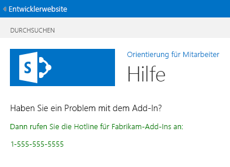

# Hinzufügen einer benutzerdefinierten Seite und Formatvorlage zu einem von SharePoint gehosteten Add-In für SharePoint
Erfahren Sie, wie Sie eine benutzerdefinierte Seite und CSS-Datei in ein SharePoint-Add-Ins einschließen.
Dies ist der siebte einer Reihe von Artikeln über die Grundlagen der Entwicklung von von SharePoint gehosteter SharePoint-Add-Ins. Machen Sie sich zunächst mit  [SharePoint-Add-Ins](sharepoint-add-ins.md) und den vorherigen Artikeln dieser Reihe vertraut:
  
    
    


-  [Erste Schritte beim Erstellen von von SharePoint gehosteten SharePoint-Add-Ins](get-started-creating-sharepoint-hosted-sharepoint-add-ins.md)
    
  
-  [Bereitstellung und Installation eines von SharePoint gehosteten Add-Ins für SharePoint](deploy-and-install-a-sharepoint-hosted-sharepoint-add-in.md)
    
  
-  [Hinzufügen von benutzerdefinierten Spalten zu einem von SharePoint gehosteten Add-In für SharePoint](add-custom-columns-to-a-sharepoint-hostedsharepoint-add-in.md)
    
  
-  [Hinzufügen eines benutzerdefinierten Inhaltstyps zu einem von SharePoint gehosteten Add-In für SharePoint](add-a-custom-content-type-to-a-sharepoint-hostedsharepoint-add-in.md)
    
  
-  [Hinzufügen eines Webparts zu einer Seite in einem von SharePoint gehosteten Add-In für SharePoint](add-a-web-part-to-a-page-in-a-sharepoint-hosted-sharepoint-add-in.md)
    
  
-  [Hinzufügen eines Workflows zu einem von SharePoint gehosteten Add-In für SharePoint](add-a-workflow-to-a-sharepoint-hosted-sharepoint-add-in.md)
    
  

> **HINWEIS**
> Wenn Sie diese Reihe zu von SharePoint gehosteten Add-Ins durchgearbeitet haben, haben Sie eine Visual Studio-Lösung, die Sie verwenden können, um mit diesem Thema fortzufahren. Sie können außerdem das Repository unter  [SharePoint_SP-Hosted_Add-Ins_Tutorials](https://github.com/OfficeDev/SharePoint_SP-hosted_Add-Ins_Tutorials) herunterladen und die Datei „BeforePage.sln" öffnen.
  
    
    

In diesem Artikel fügen Sie dem SharePoint-Add-In „Employee Orientation" eine Hilfeseite hinzu und konfigurieren diese für die Verwendung eines benutzerdefinierten CSS-Stylesheets. 
## Hinzufügen einer Seite


1. Klicken Sie im **Projektmappen-Explorer** mit der rechten Maustaste auf den Ordner **Seiten**, und wählen Sie **Hinzufügen** und **Neuer Ordner** aus. Das Dialogfeld **Neues Element hinzufügen** wird mit dem Knoten **Office/SharePoint** geöffnet.
    
  
2. Wählen Sie **Seite** aus, und geben Sie der Seite den NamenHelp.aspx. 
    
  
3. Suchen Sie nach den beiden **asp:Content**-Elementen in der Datei, und fügen Sie das folgende dritte **asp:Content**-Markup dazwischen hinzu.
    
 ```HTML
  
<asp:Content ContentPlaceHolderID="PlaceHolderPageTitleInTitleArea" runat="server">
    Help
</asp:Content> 
 ```

4. Suchen Sie nach dem **asp:Content**-Element mit der ID **PlaceholderAdditionalPageHead**, und fügen Sie das folgende Markup hinzu.
    
 ```HTML
  
<link rel="Stylesheet" type="text/css" href="../Content/App.css" />
 ```

5. Suchen Sie nach dem **asp:Content**-Element mit der ID **PlaceHolderMain**, und entfernen Sie alle darin enthaltenten untergeordneten Elemente.
    
  
6. Fügen Sie Folgendes als Inhalt zum selben **asp:Content**-Element hinzu.
    
 ```HTML
  <H3>Having a problem with the add-in?</H3>
<p> Call the help line for Fabrikam Add-ins:</p>
<p>1-555-555-5555</p>
 ```

7. Speichern und schließen Sie die Datei.
    
  
8. Öffnen Sie die Datei „Default.aspx".
    
  
9. Suchen Sie nach dem **asp:Content**-Element mit der ID **PlaceHolderMain**, und fügen Sie an dessen Ende das folgende Markup hinzu. 
    
 ```HTML
  
<p><asp:HyperLink runat="server" NavigateUrl="JavaScript:window.location = _spPageContextInfo.webAbsoluteUrl + '/Pages/Help.aspx';"
    Text="Get help for the Employee Orientation add-in" /></p>

 ```

10. Speichern und schließen Sie die Datei.
    
  

## Hinzufügen einer Formatvorlagenklasse zum Stylesheet


  
    
    

1. Öffnen Sie im **Projektmappen-Explorer** im Ordner **Inhalt** die Datei „app.css", und fügen Sie der Datei dann die folgende Zeile hinzu.
    
 ```
  
p {color: green;}
 ```

2. Speichern und schließen Sie die Datei.
    
  

## Ausführen und Testen des Add-Ins


  
    
    

1. Verwenden Sie die F5-TASTE, um Ihr Add-In bereitzustellen und auszuführen. Visual Studio führt eine temporäre Installation des Add-Ins auf Ihrer SharePoint-Testwebsite durch und führt das Add-In sofort aus. 
    
  
2. Wenn die Standardseite des Add-Ins geöffnet wird, klicken Sie auf den Link **Hilfe zum Add-In „Employee Orientation"**, um die Seite **Hilfe** zu öffnen.
    
    Ihre benutzerdefinierte Seite wird geöffnet, und die beiden Zeilen, die Sie in <p>-Tags gesetzt haben, sind grün.
    

   **Hilfeseite**

  

     
  

    
    
  
3. Schließen Sie zum Beenden der Debugsitzung das Browserfenster, oder beenden Sie das Debuggen in Visual Studio. Jedes Mal, wenn Sie F5 drücken, zieht Visual Studio die vorherige Version des Add-Ins zurück und installiert die neueste.
    
  
4. Da Sie mit diesem Add-In und dieser Visual Studio-Lösung in anderen Artikeln arbeiten werden, hat es sich bewährt, das Add-In ein letztes Mal zurückzuziehen, wenn Sie Ihre Arbeit daran für eine Weile abgeschlossen haben. Klicken Sie mit der rechten Maustaste auf das Projekt im **Projektmappen-Explorer**, und wählen Sie **Zurückziehen** aus.
    
  

## 
<a name="Nextsteps"> </a>

Im nächsten Artikel in dieser Reihe fügen Sie ein benutzerdefiniertes clientseitiges Rendering zu einer Listenspalte in einem SharePoint-Add-In hinzu:  [Hinzufügen des benutzerdefinierten clientseitigen Renderings für ein von SharePoint-gehostetes SharePoint Add-In](add-custom-client-side-rendering-to-a-sharepoint-hosted-sharepoint-add-in.md).
  
    
    

