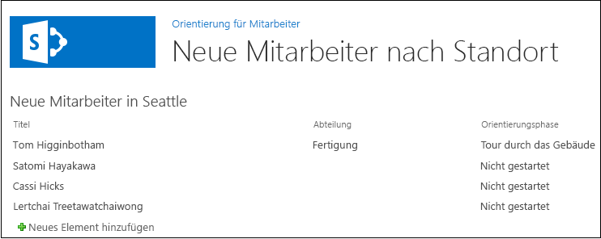

# Hinzufügen eines Webparts zu einer Seite in einem von SharePoint gehosteten Add-In für SharePoint
Erfahren Sie, wie Sie Webparts auf einer Seite in SharePoint-Add-Ins einfügen.
Dies ist der fünfte in einer Reihe von Artikeln über die Grundlagen der Entwicklung von von SharePoint gehosteten SharePoint-Add-Ins. Machen Sie sich zunächst mit  [SharePoint-Add-Ins](sharepoint-add-ins.md) und den vorherigen Artikeln in dieser Reihe vertraut:
  
    
    


-  [Erste Schritte beim Erstellen von von SharePoint gehosteten SharePoint-Add-Ins](get-started-creating-sharepoint-hosted-sharepoint-add-ins.md)
    
  
-  [Bereitstellung und Installation eines von SharePoint gehosteten Add-Ins für SharePoint](deploy-and-install-a-sharepoint-hosted-sharepoint-add-in.md)
    
  
-  [Hinzufügen von benutzerdefinierten Spalten zu einem von SharePoint gehosteten Add-In für SharePoint](add-custom-columns-to-a-sharepoint-hostedsharepoint-add-in.md)
    
  
-  [Hinzufügen eines benutzerdefinierten Inhaltstyps zu einem von SharePoint gehosteten Add-In für SharePoint](add-a-custom-content-type-to-a-sharepoint-hostedsharepoint-add-in.md)
    
  

> **HINWEIS**
> Wenn Sie diese Reihe zu von SharePoint gehosteten Add-Ins durchgearbeitet haben, haben Sie eine Visual Studio-Lösung, die Sie verwenden können, um mit diesem Thema fortzufahren. Sie können außerdem das Repository unter  [SharePoint_SP-Hosted_Add-Ins_Tutorials](https://github.com/OfficeDev/SharePoint_SP-hosted_Add-Ins_Tutorials) herunterladen und die Datei „BeforeWebPart.sln" öffnen.
  
    
    

In diesem Artikel fügen Sie ein Webpart zur Standardseite des SharePoint-Add-Ins „Employee Orientation" hinzu.
## Hinzufügen eines Webparts zu einer Seite


  
    
    

1. Öffnen Sie imProjektmappen-Explorer die Datei „Default.aspx". 
    
  
2. Wir fügen ein Listenansicht-Webpart zu der Seite hinzu, auf der die Liste Neue Mitarbeiter in Seattle angezeigt wird, damit kein Link zur Listenansichtsseite für die Liste mehr erforderlich ist. Entfernen Sie das Element **<asp:HyperLink>** aus dem Element **<asp:Content>**, dessen **ContentPlaceHolderId** `PlaceHolderMain` lautet.
    
  
3. Fügen Sie im selben **<asp:Content>**-Element die folgende **WebPartZone** hinzu.
    
  ```XML
  
<WebPartPages:WebPartZone runat="server" FrameType="TitleBarOnly"
      ID="HomePage1" Title="loc:full" />

  ```

4. Speichern und schließen Sie die Datei.
    
  
5. Öffnen Sie im **Projektmappen-Explorer** im Knoten **Seiten** die Datei „elements.xml" für die Seite.
    
  
6. Wenn das Element **File** selbstschließend ist, entfernen Sie das Zeichen „/" daraus, und fügen Sie das Endtag `</File>` hinzu.
    
  
7. Fügen Sie im Element **File** ein untergeordnetes **AllUsersWebPart**-Element hinzu, und legen Sie dessen **WebPartZoneID** auf die ID der Webpartzone fest, die Sie auf der Seite erstellt haben. Der Inhalt der Datei sollte nun wie folgt aussehen. Dieses Markup weist SharePoint an, ein **AllUsersWebPart** in der Webpartzone namens „HomePage1" einzufügen.
    
  ```
  
<Elements xmlns="http://schemas.microsoft.com/sharepoint/">
  <Module Name="Pages">
    <File Path="Pages\\Default.aspx" Url="Pages/Default.aspx" ReplaceContent="TRUE" >
      <AllUsersWebPart WebPartZoneID="HomePage1" WebPartOrder="1">

      </AllUsersWebPart>
    </File>
  </Module>
</Elements>

  ```

8. Fügen Sie ein **CDATA**-Element als untergeordnetes Element von **AllUsersWebPart** hinzu, und fügen Sie dann ein **webParts**-Element als untergeordnetes Element von **CDATA** hinzu, wie im folgenden Markup gezeigt.
    
  ```
  
<AllUsersWebPart WebPartZoneID="HomePage1" WebPartOrder="1">
  <![CDATA[
    <webParts>

    </webParts>
  ]]>
</AllUsersWebPart>
  ```

9. Fügen Sie das folgende **webPart**-Markup als untergeordnetes Element des Elements **webParts** hinzu. Dieses Markup fügt ein **XsltListViewWebPart** hinzu und weist das Webpart an, die ListeNeue Mitarbeiter in Seattle anzuzeigen. Beachten Sie, dass der Eigenschaftswert **ViewContentTypeId** nur „0x" und nicht die tatsächliche ID des InhaltstypsNewEmployee ist.
    
  ```
  
  <webPart xmlns="http://schemas.microsoft.com/WebPart/v3">
    <metaData>
      <type name="Microsoft.SharePoint.WebPartPages.XsltListViewWebPart, 
                   Microsoft.SharePoint, Version=15.0.0.0, Culture=neutral, 
                   PublicKeyToken=71e9bce111e9429c" />
    </metaData>
    <data>
      <properties>
        <property name="ListUrl">Lists/NewEmployeesInSeattle</property>
        <property name="IsIncluded">True</property>
        <property name="NoDefaultStyle">True</property>
        <property name="Title">New Employees in Seattle</property>
        <property name="PageType">PAGE_NORMALVIEW</property>
        <property name="Default">False</property>
        <property name="ViewContentTypeId">0x</property>
      </properties>
    </data>
  </webPart>
  ```


## Ausführen und Testen des Add-Ins


  
    
    

1. Verwenden Sie die F5-TASTE, um Ihr Add-In bereitzustellen und auszuführen. Visual Studio führt eine temporäre Installation des Add-Ins auf Ihrer SharePoint-Testwebsite durch und führt das Add-In sofort aus. 
    
  
2. Wenn die Standardseite des Add-Ins geöffnet wird, ist das Listenansicht-Webpart auf der Seite aktiv, und die Liste wird angezeigt. 
    
   **Standardseite mit Listenansicht-Webpart**

  

     
  

    
    
  
3. Versuchen Sie, der Liste neue Elemente hinzuzufügen und vorhandene Elemente zu bearbeiten.
    
  
4. Schließen Sie zum Beenden der Debugsitzung das Browserfenster, oder beenden Sie das Debuggen in Visual Studio. Jedes Mal, wenn Sie F5 drücken, zieht Visual Studio die vorherige Version des Add-Ins zurück und installiert die neueste.
    
  
5. Da Sie mit diesem Add-In und dieser Visual Studio-Lösung in anderen Artikeln arbeiten werden, hat es sich bewährt, das Add-In ein letztes Mal zurückzuziehen, wenn Sie Ihre Arbeit daran für eine Weile abgeschlossen haben. Klicken Sie mit der rechten Maustaste auf das Projekt im **Projektmappen-Explorer**, und wählen Sie **Zurückziehen** aus.
    
  

## 
<a name="Nextsteps"> </a>

Im nächsten Artikel dieser Reihe fügen Sie einen Workflow zum SharePoint-Add-In hinzu:  [Hinzufügen eines Workflows zu einem von SharePoint gehosteten Add-In für SharePoint](add-a-workflow-to-a-sharepoint-hosted-sharepoint-add-in.md).
  
    
    

