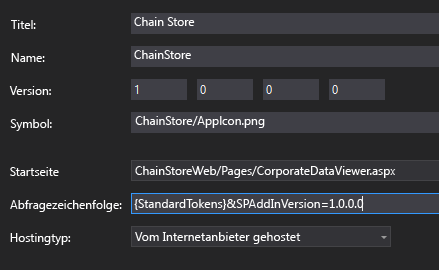
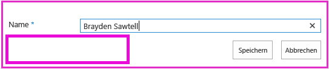

# Hinzufügen der Logik für die erste Ausführung zum vom Anbieter gehosteten Add-In
Erfahren Sie, wie Sie „First-Run"-Code in ein vom Anbieter gehostetes SharePoint-Add-In einfügen.
Dies ist der achte einer Reihe von Artikeln über die Grundlagen der Entwicklung von vom Anbieter gehosteten SharePoint-Add-Ins. Machen Sie sich zunächst mit  [SharePoint-Add-Ins](sharepoint-add-ins.md) und den vorherigen Artikeln dieser Reihe vertraut:


-  [Erste Schritte beim Erstellen von von einem Anbieter gehosteten SharePoint-Add-Ins](get-started-creating-provider-hosted-sharepoint-add-ins.md)


-  [Erteilen des Aussehens und Verhaltens von SharePoint für Ihr vom Anbieter gehostetes Add-In](give-your-provider-hosted-add-in-the-sharepoint-look-and-feel.md)


-  [Einfügen einer benutzerdefinierten Schaltfläche in das vom Anbieter gehostete Add-In](include-a-custom-button-in-the-provider-hosted-add-in.md)


-  [Schnelle Übersicht über das SharePoint-Objektmodell](get-a-quick-overview-of-the-sharepoint-object-model.md)


-  [Hinzufügen von SharePoint-Schreibvorgängen zum vom Anbieter gehosteten Add-In](add-sharepoint-write-operations-to-the-provider-hosted-add-in.md)


-  [Einfügen eines Add-In-Webparts in das vom Anbieter gehostete Add-In](include-an-add-in-part-in-the-provider-hosted-add-in.md)


-  [Behandeln von Add-In-Ereignissen im vom Anbieter gehosteten Add-In](handle-add-in-events-in-the-provider-hosted-add-in.md)


> **HINWEIS**
> Wenn Sie diese Reihe zu vom Anbieter gehosteten Add-Ins durchgearbeitet haben, haben Sie eine Visual Studio-Projektmappe, die Sie verwenden können, um mit diesem Thema fortzufahren. Sie können außerdem das Repository unter  [SharePoint_Provider-hosted_Add-Ins_Tutorials](https://github.com/OfficeDev/SharePoint_Provider-hosted_Add-ins_Tutorials) herunterladen und die Datei „BeforeFirstRunLogic.sln" öffnen.


In diesem Artikel fügen Sie Code zur Startseite des ChainStore-SharePoint-Add-Ins hinzu, der überprüft, ob die aktuelle Instanz des Add-Ins zum ersten Mal ausgeführt wird. Wenn es das erste Mal ist, stellt Ihr Code die Liste **Lokale Mitarbeiter** und die benutzerdefinierte Menübandschaltfläche bereit.
## Erstellen der grundlegenden Klasse für die Bereitstellung von SharePoint-Komponenten


> **HINWEIS**
>  Die Einstellungen für Startprojekte in Visual Studio werden normalerweise auf die Standardwerte zurückgesetzt, wann immer die Projektmappe erneut geöffnet wird. Führen Sie die folgenden Schritte immer unmittelbar nach dem erneuten Öffnen der Beispielprojektmappe in dieser Artikelreihe durch:>  Klicken Sie mit der rechten Maustaste oben im **Projektmappen-Explorer** auf den Projektmappenknoten, und wählen Sie **Startprojekte festlegen** aus.>  Stellen Sie sicher, dass alle drei Projekte in der Spalte **Aktion** auf **Start** festgelegt sind.


1. Klicken Sie im **ChainStoreWeb**-Projekt im **Projektmappen-Explorer** mit der rechten Maustaste auf den Ordner **Dienstprogramme**, und wählen Sie dann **Hinzufügen | Vorhandenes Element** aus.


2. Navigieren Sie im daraufhin geöffneten **Datei-Explorer** zum Projektmappenordner, dem **ChainStoreWeb**-Ordner, und öffnen Sie dann den Ordner **Dienstprogramme**.


3. Wählen Sie SharePointComponentDeployer.cs aus, und klicken Sie auf **Hinzufügen**.


4. Öffnen Sie die Datei SharePointComponentDeployer.cs. Sie enthält eine statische Klasse und zwei statische Methoden, die die Add-In-Version in der Tabelle **Mandanten** der Unternehmensdatenbank abrufen und festlegen. Diese Methoden werden nicht besprochen, da diese Artikelreihe nicht dafür vorgesehen ist, Kenntnissse der ASP.NET- oder SQL Server-/Azure-Programmierung zu vermitteln.


5. Fügen Sie die folgenden **using**-Anweisungen an den Anfang der Datei hinzu.

  ```

using System.Web;
using System.Linq;
using System.Collections.Generic;
using Microsoft.SharePoint.Client;
  ```

6. Fügen Sie oben in der Klasse  `SharePointComponentDeployer` die folgenden zwei statischen Felder hinzu. Beide werden in der Methode **Page_Load** Startseite des Add-Ins initialisiert. Sie fügen diesen Code in einem späteren Schritt hinzu. Das erste Feld enthält das Objekt **SharePointContext**, das zum Durchführen der CRUD-Vorgänge in SharePoint erforderlich ist. Das zweite enthält die Versionsnummer des Add-Ins, das im Hostweb installiert ist. Dieser Wert weicht anfangs vom Standardwert ab ( **0000.0000.0000.0000** ), der in der Tabelle **Mandanten** des Unternehmen aufgezeichnet wird, wenn der Handler für die Installation den Mandanten registriert. Die erste Version des Add-Ins ist z. B. **1.0.0.0**.

  ```cs

internal static SharePointContext sPContext;
internal static Version localVersion;
  ```

7. Erstellen Sie die folgende statische Eigenschaft für die Version des Add-Ins, die derzeit in der Tabelle **Mandanten** des Unternehmens aufgezeichnet ist. Sie verwendet die zwei Methoden, die bereits in der Datei vorhanden waren, um diesen Wert abzurufen und festzulegen.

  ```cs

internal static Version RemoteTenantVersion
{
    get
    {
        return GetTenantVersion();
    }
    set
    {
        SetTenantVersion(value);
    }
}
  ```

8. Erstellen Sie jetzt die folgende  `IsDeployed`-Eigenschaft. Beachten Sie Folgendes bei diesem Code:

  - Die Methode **Page_Load** der Startseite für das Add-In verwendet den Wert dieser Eigenschaft, um zu bestimmen, ob das Add-In zum ersten Mal ausgeführt wird. Der Wert **false** signalisiert, dass das Add-In im aktuellen Hostweb noch nicht ausgeführt wurde und deshalb seine Komponenten bereitgestellt werden müssen.


  - Das Kriterium ist, ob die in der Tabelle **Mandanten** registrierte Versionsnummer niedriger als die tatsächlich installierte Version ist. Bei der ersten Ausführung des Add-Ins ist die Nummer kleiner. In einem späteren Schritt geschriebener Code legt die Version in der Tabelle **Mandanten** auf dieselbe Version wie die tatsächlich installierte fest. Wenn das Add-In also erneut ausgeführt wird, gibt `IsDeployed` den Wert **true** zurück und die Bereitstellungslogik wird nicht erneut ausgeführt.


  ```cs

public static bool IsDeployed
{
    get
    {
        if (RemoteTenantVersion < localVersion)
            return false; 
        else
            return true; 
    }
}
  ```

9. Fügen Sie die folgende Methode zur Klasse  `SharePointComponentDeployer` hinzu. Beachten Sie, dass die letzte Aktion, die die Methode ausführt, das Aktualisieren der Mandantenversion ist, die in der Datenbank des Unternehmens registriert ist ( **0000.0000.0000.0000** ), damit sie mit der aktuellen Version des Add-Ins im Hostweb übereinstimmt ( **1.0.0.0** ). Sie schließen diese Methode in einem späteren Schritt ab.

  ```cs

internal static void DeployChainStoreComponentsToHostWeb(HttpRequest request)
{
    // TODO4: Deployment code goes here.

    RemoteTenantVersion = localVersion;
}
  ```


> **HINWEIS**
> Sie fragen sich vielleicht, warum das Add-In Versionsnummern und einen „Kleiner als"-Test verwendet, um die Antwort auf eine einfache Ja/Nein-Frage zu ermitteln: Wird das Add-In zum ersten Mal ausgeführt? Es könnte ebenso gut ein einfaches Zeichenfolgenfeld in der Tabelle **Mandanten** vorhanden sein, das im Installationshandler auf „Noch nicht ausgeführt" und dann von der Logik für die erste Ausführung in „Bereits einmal ausgeführt" geändert wird, nachdem die SharePoint-Komponenten bereitgestellt wurden.> Für das ChainStore-Add-In funktioniert ein einfacher Test. Es empfiehlt sich jedoch im Allgemeinen, Versionsnummern zu verwenden. Der Grund ist, dass ein Produktions-Add-In in Zukunft wahrscheinlich direkt aktualisiert wird, d. h. nachdem es bereits installiert wurde. Dann muss Ihre Add-In-Logik auf mehr als die zwei Möglichkeiten Noch nicht ausgeführt undBereits einmal ausgeführt reagieren können. Angenommen Sie möchten beispielsweise eine weitere Liste zum Hostweb im Upgrade von Version 1.0.0.0 auf 2.0.0.0 hinzufügen. Sie könnten dies mit einem Updateereignishandler durchführen oder in einer „Erste Ausführung nach Update"-Logik. In beiden Fällen muss Ihre Bereitstellungslogik neue Komponenten bereitstellen, aber auch vermeiden, dass versucht wird, Komponenten erneut bereitzustellen, die in einer früheren Version des Add-Ins bereitgestellt wurden. Die Versionsnummer 1.0.0.0 würde signalisieren, dass die Komponenten der Version 1.0.0.0 bereitgestellt wurden, aber die Logik für die erste Ausführung nach dem Update noch nicht ausgeführt wurde. 


## Hinzufügen der grundlegenden Startlogik


1. Das SharePoint-Hostweb muss der Remotewebanwendung mitteilen, welche Version des Add-Ins installiert wurde. Dafür wird ein Abfrageparameter verwendet. Öffen Sie die Datei AppManifest.xml im **ChainStore**-Projekt. Im Designer sehen Sie den Platzhalter **{StandardTokens}** als Wert für das Feld **Abfragezeichenfolge**. Fügen Sie die Zeichenfolge &amp;SPAddInVersion=1.0.0.0 an das Ende hinzu. Der Manifest-Designer sollte etwa wie folgt aussehen. *Beachten Sie, dass die Versionsnummer, die Sie in der Abfragezeichenfolge übergeben, mit dem Wert im Feld **Version** des Designers übereinstimmen muss.*  (Wenn Sie das Add-In aktualisieren, besteht eine Ihrer Aufgaben darin, diese zwei Werte zu erhöhen und gleich zu halten.)




2. Öffnen Sie die Datei CorporateDataViewer.aspx.cs, und fügen Sie den folgenden Code zur Methode **Page_Load** hinzu, direkt unter der Zeile, die das Objekt `spContext` initialisiert. Beachten Sie Folgendes bei diesem Code:

  - Er beginnt mit der Festlegung der zwei statischen Felder in der statischen  `SharePointComponentDeployer`-Klasse. Er übergibt das Objekt **SharePointContext**, da der Code in  `SharePointComponentDeployer` SharePoint aufruft und den Abfrageparameter verwendet, den Sie hinzugefügt haben, um die Eigenschaft `localVersion` festzulegen.


  - Es geschieht nichts, wenn  `IsDeployed` true ist. Das heißt, wenn die Logik für die „erste Ausführung" bereits ausgeführt wurde. Andernfalls wird die Bereitstellungsmethode aufgerufen, und das ASP.NET-Anforderungsobjekt wird übergeben.


  ```cs

SharePointComponentDeployer.sPContext = spContext;
SharePointComponentDeployer.localVersion = new Version(Request.QueryString["SPAddInVersion"]);

if (!SharePointComponentDeployer.IsDeployed)
{
    SharePointComponentDeployer.DeployChainStoreComponentsToHostWeb(Request);
}
  ```


## Programmgesteuertes Bereitstellen einer SharePoint-Liste


1. Ersetzen Sie in der Datei SharePointComponentDeployer.cs  `TODO4` mit der folgenden Zeile. Im nächsten Schritt erstellen Sie diese Methode.

  ```cs

CreateLocalEmployeesList();
  ```

2. Fügen Sie der Klasse  `SharePointComponentDeployer` die folgende Methode hinzu. Beachten Sie Folgendes bei diesem Code:

  - Er enthält zwei Aufrufe von **ExecuteQuery**. Die erste ist erforderlich, um festzustellen, ob die Liste bereits vorhanden ist. Die zweite erstellt die Liste.


  - Die Methode **ClientContext.LoadQuery** ist vergleichbar mit **ClientContext.Load**, mit der Ausnahme, dass keine Entität wie eine Liste, sondern die aufzählbaren Ergebnisse einer Abfrage auf den Client gebracht werden.


  ```cs
  private static void CreateLocalEmployeesList()
{
    using (var clientContext = sPContext.CreateUserClientContextForSPHost())
    {
        var query = from list in clientContext.Web.Lists
                    where list.Title == "Local Employees"
                    select list;
        IEnumerable<List> matchingLists = clientContext.LoadQuery(query);
        clientContext.ExecuteQuery();

        if (matchingLists.Count() == 0)
        {
           // TODO5: Create the list 

           // TODO6: Rename the Title field on the list 

           // TODO7: Add "Added to Corporate DB" field to the list 

           clientContext.ExecuteQuery();
        }
    }
}
  ```

3. Ersetzen Sie  `TODO5` durch den folgenden Code. Beachten Sie Folgendes bei diesem Code:

  - Die Klasse **ListCreationInformation** ist vergleichbar mit der Klasse **ListItemCreationInformation**, die Sie in einem früheren Artikel dieser Reihe gesehen haben. Es ist eine einfache Klasse, die sich besser für das Senden von Informationen aus der Webanwendung an SharePoint eignet als die vollständige **List**-Klasse.


  - Es gibt viele Arten von Listenvorlagen, z. B. den Typ „Aufgaben" für eine To-Do-Liste und den Typ „Ereignisse" für einen Kalender. Die Liste **Lokale Mitarbeiter**basiert auf der einfachsten Art: dem Typ „Generisch".


  - Die Eigenschaft **ListCreationInformation.Url** enthält die URL der Liste *relativ*  zum Hostweb. Durch Angeben von „Listen/LokaleMitarbeiter" legt der Code die vollständige URL der Liste auf „https:// *{SharePointDomain}*  /hongkong/_layouts/15/start.aspx#/Lists/Local%20Employees" fest.


  ```cs

ListCreationInformation listInfo = new ListCreationInformation();
listInfo.Title = "Local Employees";
listInfo.TemplateType = (int)ListTemplateType.GenericList;
listInfo.Url = "Lists/Local Employees";
List localEmployeesList = clientContext.Web.Lists.Add(listInfo);
  ```

4. Ersetzen Sie  `TODO6` durch den folgenden Code, der den öffentlichen Namen des Felds „Titel" (Spalte) von „Titel" in „Name" ändert. Diese Aktion haben Sie auf auf der Seite **Listeneinstellungen** durchgeführt, als Sie die Liste manuell erstellt haben.

  ```cs

Field field = localEmployeesList.Fields.GetByInternalNameOrTitle("Title");
field.Title = "Name";
field.Update();
  ```

5. Sie haben außerdem manuell ein Feld namens **Zu Unternehmens-DB hinzugefügt** erstellt. Um diese Aktion programmgesteuert durchzuführen, fügen Sie den folgenden Code anstelle von `TODO7` hinzu. Beachten Sie Folgendes bei diesem Code:

  - Die wichtigsten Eigenschaften des Felds werden mit einem XML-Blob angegeben. Hierbei handelt es sich um ein Relikt aus der SharePoint-Architektur: Websites, Listen, Felder, Inhaltstypen und die meisten anderen Arten von SharePoint-Komponenten werden im XML-Format definiert. In diesem Fall geben wir den Anzeigenamen, den Datentyp und den Standardwert für das Feld an.


  - Der zweite Parameter bestimmt, ob das Feld in der Standardansicht der Liste angezeigt wird. Er wird auf **true** festgelegt.


  - Der dritte Parameter kann verwendet werden, um zu bestimmen, welchen Inhaltstypen das Feld hinzugefügt wird. Wenn Sie **DefaultValue** übergeben, wird er nur zum Standardinhaltstyp der Liste hinzugefügt.


  ```cs

localEmployeesList.Fields.AddFieldAsXml("<Field DisplayName='Added to Corporate DB'"
                                         +"Type='Boolean'>"
                                         + "<Default>FALSE</Default></Field>",
                                         true,
                                         AddFieldOptions.DefaultValue);
  ```

6. Sie erinnern sich, dass **Zu Unternehmens-DB hinzugefügt** standardmäßig **Nein** ist (d. h. false), die benutzerdefinierte Menübandschaltfläche im Add-In dies aber auf **Ja** festlegt, nachdem Mitarbeiter zur Unternehmensdatenbank hinzugefügt wurden. Dieses System funktioniert nur am besten, wenn Benutzer den Wert des Felds nicht manuell ändern können. Um dies sicherzustellen, machen Sie das Feld in den Formularen für das Erstellen und Bearbeiten von Elementen in der Liste **Lokale Mitarbeiter** unsichtbar. Dazu müssen wir zwei weitere Attribute zum ersten Parameter hinzufügen, wie im Folgenden dargestellt.

  ```cs

localEmployeesList.Fields.AddFieldAsXml("<Field DisplayName='Added to Corporate DB'"
                                         + " Type='Boolean'"
                                         + " ShowInEditForm='FALSE' "
                                         + " ShowInNewForm='FALSE'>"
                                         + "<Default>FALSE</Default></Field>",
                                         true,
                                         AddFieldOptions.DefaultValue);
  ```


    Die gesamte  `CreateLocalEmployeesList` sollte jetzt wie folgt aussehen.


  ```cs

private static void CreateLocalEmployeesList()
{
    using (var clientContext = sPContext.CreateUserClientContextForSPHost())
    {
        var query = from list in clientContext.Web.Lists
                    where list.Title == "Local Employees"
                    select list;
        IEnumerable<List> matchingLists = clientContext.LoadQuery(query);
        clientContext.ExecuteQuery();

        if (matchingLists.Count() == 0)
        {
            ListCreationInformation listInfo = new ListCreationInformation();
            listInfo.Title = "Local Employees";
            listInfo.TemplateType = (int)ListTemplateType.GenericList;
            listInfo.Url = "LocalEmployees";
            List localEmployeesList = clientContext.Web.Lists.Add(listInfo);

            Field field = localEmployeesList.Fields.GetByInternalNameOrTitle("Title");
            field.Title = "Name";
            field.Update();

            localEmployeesList.Fields.AddFieldAsXml("<Field DisplayName='Added to Corporate DB'" 
                                                    + " Type='Boolean'"
                                                   + " ShowInEditForm='FALSE' "
                                                   + " ShowInNewForm='FALSE'>"
                                                   + "<Default>FALSE</Default></Field>",
                                                    true,
                                                    AddFieldOptions.DefaultValue);
            clientContext.ExecuteQuery();
        }
    }
}
  ```


## Vorübergehendes Entfernen der benutzerdefinierten Schaltfläche aus dem Projekt

Aus technischen Gründen, die wir im nächsten Artikel behandeln, kann die benutzerdefinierte Schaltfläche, die wir erstellt haben, nicht ohne Änderung installiert werden, wenn sie auf dem Menüband einer Liste eingefügt wird, die programmgesteuert bereitgestellt wird. Wir müssen sie vorübergehend aus dem Projekt entfernen, damit wir unsere Logik für die erste Ausführung testen können. Im nächsten Artikel wird die Schaltfläche wieder in das Menüband zurückgebracht.


Klicken Sie im **Projektmappen-Explorer**im **ChainStore**-Projekt der rechten Maustaste auf den Knoten **AddEmployeeToCorpDB**, und wählen Sie **Aus Projekt ausschließen** aus.


## Anfordern der Berechtigung zum Verwalten von Listen im Hostweb

Da das Add-In jetzt eine Liste zum Hostweb und nicht nur Elemente zu einer vorhandenen Liste hinzufügt, müssen die Berechtigungen, die das Add-In anfordert, von „Schreiben" zu „Verwalten" eskaliert werden. Gehen Sie folgendermaßen vor.


1. Öffnen Sie im **Projektmappen-Explorer** die Datei AppManifest.xml im **ChainStore**-Projekt. 


2. Öffnen Sie die Registerkarte **Berechtigungen**, und behalten Sie für den Wert **Bereich** die Option „Web" bei, aber wählen Sie im Feld **Berechtigung** die Option **Verwalten** aus der Dropdownliste aus.


3. Speichern Sie die Datei.


## Ausführen des Add-Ins und Testen der Logik für die erste Ausführung


1. Öffnen Sie die Seite **Websiteinhalte** der Website des Hongkong-Stores, *und entfernen Sie die Liste **Lokale Mitarbeiter**!* 


2. Verwenden Sie die F5-TASTE, um Ihr Add-In bereitzustellen und auszuführen. Visual Studio hostet die Remotewebanwendung in IIS Express und die SQL-Datenbank in SQL Express. Außerdem wird eine temporäre Installation des Add-Ins auf Ihrer SharePoint-Testwebsite durchgeführt, und das Add-In wird sofort ausgeführt. Sie werden aufgefordert, Berechtigungen für das Add-In zu erteilen, bevor die Startseite geöffnet wird.


3. Wenn die Add-In-Startseite geöffnet wird, wählen Sie den Link **Zurück zur Website** auf dem Chromesteuerelement im oberen Bereich aus.


4. Navigieren Sie zur Seite **Websiteinhalte**. Die Liste **Lokale Mitarbeiter** ist vorhanden, da Ihre Logik für die erste Ausführung sie hinzugefügt hat.

    > **HINWEIS**
      > Wenn die Liste nicht vorhanden ist oder Sie andere Anzeichen haben, dass der zuerst ausgeführte Code nicht ausgeführt wird, wird möglicherweise die Tabelle **Mandanten** nicht in einen leeren Zustand zurückgesetzt, wenn Sie F5 drücken. Die häufigste Ursache hierfür ist, dass das Projekt **ChainCorporateDB** nicht mehr als Startprojekt in Visual Studio festgelegt ist. Im oberen Bereich dieses Artikels finden Sie Informationen, wie Sie dies beheben. Stellen Sie außerdem sicher, dass Sie die Datenbank so konfiguriert haben, dass sie wie unter [Konfigurieren von Visual Studio zum erneuten Erstellen der Unternehmensdatenbank bei jeder Debugsitzung](give-your-provider-hosted-add-in-the-sharepoint-look-and-feel.md#Rebuild) beschrieben neu erstellt wird.
5. Öffnen Sie die Liste, und fügen Sie ein Element hinzu. Beachten Sie, dass im Formular für neue Elemente das Feld **Zu Unternehmens-DB hinzugefügt** nicht mehr vorhanden ist und deshalb nicht manuell festgelegt werden kann. Dies gilt auch für das Formular zum Bearbeiten von Elementen.




6. Verwenden Sie im Browser die Schaltfläche „Zurück", um zurück zur Startseite für das Add-In zu navigieren.


7. Klicken Sie auf das Zahnradsymbol des Chromsteuerelements im oberen Bereich, und wählen Sie **Kontoeinstellungen** aus.


8. Klicken Sie auf der Seite **Konten** und dann auf die Schaltfläche **Add-In-Version anzeigen**. Die Version wird als **1.0.0.0** angezeigt, da die Logik für die erste Ausführung sie geändert hat.


9. Schließen Sie zum Beenden der Debugsitzung das Browserfenster, oder beenden Sie das Debuggen in Visual Studio. Jedes Mal, wenn Sie F5 drücken, zieht Visual Studio die vorherige Version des Add-Ins zurück und installiert die neueste.


10. Da Sie mit diesem Add-In und dieser Visual Studio-Projektmappe in anderen Artikeln arbeiten werden, hat es sich bewährt, das Add-In ein letztes Mal zurückzuziehen, wenn Sie Ihre Arbeit daran für eine Weile abgeschlossen haben. Klicken Sie mit der rechten Maustaste auf das Projekt im **Projektmappen-Explorer**, und wählen Sie **Zurückziehen** aus.


## 
<a name="Nextsteps"> </a>

 Im nächsten Artikel wird gezeigt, wie Sie die benutzerdefinierte Schaltfläche für das Menüband **Lokale Mitarbeiter** zurück in das Add-In bringen, nachdem die Liste jetzt programmgesteuert bereitgestellt wird: [Programmgesteuerte Bereitstellung einer benutzerdefinierten Schaltfläche im vom Anbieter gehosteten Add-In](programmatically-deploy-a-custom-button-in-the-provider-hosted-add-in.md)


