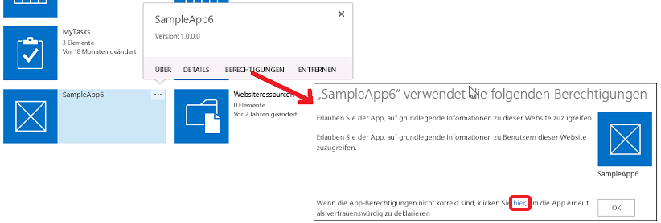

# Add-In-Berechtigungen in SharePoint 2013
Dieser Artikel enthält Informationen zu Add-In-Berechtigungen in SharePoint, zu Typen von Add-In-Berechtigungen, Berechtigungsanforderungsbereichen und der Verwaltung von Berechtigungen. Zudem werden in diesem Artikel die Unterschiede zwischen Add-In-Berechtigungsrechten, Benutzerrechten und Office Store-App-Rechten besprochen.
Sie sollten sich zuerst mit dem Thema  [Autorisierung und Authentifizierung für Add-Ins in SharePoint 2013](authorization-and-authentication-of-sharepoint-add-ins.md) vertraut machen, bevor Sie diesen Artikel lesen.


**Sehen Sie sich ein Video über App-Berechtigungen an.**


## Übersicht über App-Berechtigungen in SharePoint
<a name="Perm_intro"> </a>

Ein SharePoint-Add-In fordert die Berechtigungen, die es benötigt, während der Installation von dem installierenden Benutzer an. Der Entwickler eines Add-Ins muss über die Add-In-Manifestdatei die Berechtigungen anfordern, die das bestimmte Add-In benötigt, um ausgeführt werden zu können. (Geräte- und Web-Apps, die auf SharePoint zugreifen, aber nicht auf SharePoint-Websites installiert werden, müssen während der Laufzeit Berechtigungen von dem Benutzer gewährt werden, der das Add-In ausführt. Weitere Informationen finden Sie unter  [Übersicht über Add-Ins, die dynamisch Zugriffsberechtigungen von SharePoint anfordern](authorization-code-oauth-flow-for-sharepoint-add-ins.md#Overview).) Benutzer können nur die Berechtigungen gewähren, über die sie selbst verfügen. Der Benutzer muss entweder alle Berechtigungen gewähren, die ein Add-In anfordert, oder keine Berechtigungen gewähren. Eine selektive Gewährung von Berechtigungen ist nicht möglich. (Bei Add-Ins, die dynamisch Berechtigungen anfordern, kann nur ein Benutzer mit Verwaltungsberechtigungen für die SharePoint-Ressourcen, auf die das Add-In zugreifen möchte, das Add-In ausführen, selbst wenn das Add-In geringere Berechtigungen wie beispielsweise eine Leseberechtigung anfragt.)


Die Berechtigungen, die der App gewährt wurden, werden außerdem in der Inhaltsdatenbank der SharePoint-Farm oder der SharePoint Online-Mandantschaft gespeichert. Sie werden nicht mit einem sicheren Tokendienst wie Microsoft Azure Access Control Service (ACS) gespeichert. Wenn ein Benutzer einer App erstmals Berechtigungen gewährt, ruft SharePoint Informationen zu der von ACS ab. SharePoint speichert dann die grundlegenden Informationen zur App zusammen mit den Berechtigungen der App im App-Verwaltungsdienst und der Inhaltsdatenbank. Weitere Informationen zu ACS finden Sie unter  [Erstellen von SharePoint-Add-Ins, die die Autorisierung mit niedriger Vertrauensebene verwenden](creating-sharepoint-add-ins-that-use-low-trust-authorization.md).


Wenn ein Objekt, für das der App Berechtigungen gewährt wurden, gelöscht wird, werden auch die zugehörigen Berechtigungen gelöscht. Wenn ein Objekt, für das der App Berechtigungen gewährt wurden, recycelt wird, dann ändert SharePoint die zugehörigen Berechtigungen nicht, damit die Berechtigungen noch intakt sind, wenn das Objekt aus dem Papierkorb wiederhergestellt wird. .


Wenn eine App entfernt wird, dann werden alle Berechtigungen widerrufen, die dieser App in dem Bereich, aus dem sie entfernt wird, gewährt wurden. Auf diese Weise soll sichergestellt werden, dass die App nicht weiterhin remote auf geschützte SharePoint-Ressourcen zugreifen kann, nachdem ein Benutzer die App aus SharePoint entfernt hat.


## Arten von App-Berechtigungen und Berechtigungsbereichen
<a name="Perm_types"> </a>

Ein SharePoint-Add-In gibt mithilfe von Berechtigungsanforderungen die Berechtigungen an, die für sein ordnungsgemäßes Funktionieren erforderlich sind. Die Berechtigungsanforderungen geben sowohl die von einem Add-In benötigten Rechte als auch den Bereich an, in dem die Rechte benötigt werden. Diese Berechtigungen werden als Teil des Add-In-Manifests angefordert.


> **HINWEIS**
> Die in diesem Abschnitt beschriebenen Bereiche gelten nur für Listeninhalte und Bibliotheksinhalte. Weitere Informationen zu Bereichen und anderen Features finden Sie unter  [Arten von App-Berechtigungen und Berechtigungsbereichen](#Perm_types) in diesem Artikel.


Berechtigungsanforderungsbereiche geben die Position in der SharePoint-Hierarchie an, auf die sich eine Berechtigungsanforderung bezieht.


> **HINWEIS**
> Ein SharePoint-Add-In besitzt eine eigene Identität und ist ein Sicherheitsprinzipal, der als Add-In-Prinzipal bezeichnet wird. Wie Benutzer und Gruppen hat auch ein Add-In-Prinzipal bestimmte Berechtigungen oder Rechte. Da der Add-In-Prinzipal Vollzugriff auf das Add-In-Web besitzt, muss er nur Berechtigungen zum Zugriff auf die SharePoint -Ressourcen im Hostweb oder auf andere Speicherorte außerhalb des Add-In-Webs anfordern. Weitere Informationen zum Add-In-Web finden Sie unter [Wichtige Aspekte der Architektur und Entwicklungslandschaft von Add-Ins für SharePoint](important-aspects-of-the-sharepoint-add-in-architecture-and-development-landscap.md) und [Hostwebsites, Add-In-Websites und SharePoint-Komponenten in SharePoint 2013](host-webs-add-in-webs-and-sharepoint-components-in-sharepoint-2013.md). 


SharePoint unterstützt vier verschiedene Berechtigungsbereiche innerhalb der Inhaltsdatenbank und Mandanteneinheit, die in Tabelle 1 dargestellt werden. Berechtigungsbereiche werden mit URIs, einschließlich "http:"-Präfix, benannt, sind aber keine URLs und enthalten keine Platzhalter. Die Berechtigungsbereich in dieser Tabelle und in diesem Artikel sind Zeichenfolgenliterale.


**Tabelle 1. URIs und Beschreibungen des SharePoint-App-Berechtigungsanforderungsbereichs**

|||
|:-----|:-----|
|**Bereichs-URI** <br/> |**Beschreibung** <br/> |
|Mandanteneinheit  <br/> http://sharepoint/content/tenant  <br/> |Die Mandanteneinheit, in der die App installiert ist. Sie umfasst alle untergeordneten Elemente dieses Bereichs.  <br/> |
|Websitesammlung  <br/> http://sharepoint/content/sitecollection  <br/> |Die Websitesammlung, in der die App installiert ist. Sie umfasst alle untergeordneten Elemente dieses Bereichs.  <br/> |
|Website  <br/> http://sharepoint/content/sitecollection/web  <br/> |Die Website, auf der die App installiert ist. Sie umfasst alle untergeordneten Elemente dieses Bereichs.  <br/> |
|Liste  <br/> http://sharepoint/content/sitecollection/web/list  <br/> |Eine einzelne Liste auf der Website, auf der das Add-In installiert ist. Wenn der Benutzer, der das Add-In installiert, zum Erteilen von Berechtigungen aufgefordert wird, kann der Benutzer im Dialogfeld eine Liste auswählen, für die dem Add-In Berechtigungen erteilt werden. Wenn das Add-In Berechtigungen für mehrere Listen benötigt, muss es die Berechtigung für den Webbereich anfordern. Da Sie als Entwickler außerdem nicht steuern können, welche Liste der Benutzer auswählt, oder dem Benutzer nicht mitteilen können, welche Liste er auswählen soll, müssen Sie den Webbereich verwenden, wenn eine Liste vorhanden ist, für die Ihr Add-In die Berechtigung haben  *muss*  . (Es gibt jedoch eine Möglichkeit, die Auswahl des Benutzers auf bestimmte Untersammlungen von Listen einzuschränken. Weitere Informationen dazu finden Sie unter [Berechtigungsanforderungsbereich mit den zugehörigen Eigenschaften](#AssociatedProperties) weiter unten.) <br/> |
 
Wenn einer App eine Berechtigung für einen der Bereiche gewährt wird, gilt diese Berechtigung für alle untergeordneten Elemente des Bereichs. Wenn einer App beispielsweise Berechtigungen für eine Website gewährt werden, dann erhält die App auch Berechtigungen für alle Listen dieser Website und für alle Listenelemente dieser Listen.


Da Berechtigungsanforderungen ohne Informationen zur Topologie der Websitesammlung erfolgen, in der die App installiert ist, wird der Bereich als Typ statt als URL einer bestimmten Instanz ausgedrückt. Diese Bereichstypen werden als URIs angegeben. Auf die SharePoint-Inhaltsdatenbank bezogene Berechtigungen werden unter dem folgenden URI zusammengefasst:  `http://sharepoint/content`.


## Verstehen der Unterschiede zwischen App-Berechtigungsrechten und Benutzerrechten
<a name="Perm_diff"> </a>

Berechtigungen geben die Aktivitäten an, die eine App im Anforderungsbereich ausführen darf. SharePoint unterstützt vier Berechtigungsstufen in der Inhaltsdatenbank. Für jeden Bereich kann die App über folgende Rechte verfügen:


- Read


- Write


- Manage


- FullControl


> **HINWEIS**
> Weitere Informationen dazu, was die Rechte Read, Write, Manage und FullControl beinhalten finden Sie im Thema zur  [Planung der App-Berechtigungsverwaltung](http://technet.microsoft.com/de-de/library/jj219576%28office.15%29.aspx). 


> **HINWEIS**
> Diese Rechte entsprechen den Standard-Benutzerberechtigungsstufen von SharePoint: Leser, Teilnehmer, Designer und Vollzugriff. Weitere Informationen zu Berechtigungen und Berechtigungsstufen finden Sie unter  [Benutzerberechtigungen und Berechtigungsstufen](http://technet.microsoft.com/de-de/library/cc288074.aspx). <BR/><BR /> Um Verwechslungen zu vermeiden, stimmen die Namen der App-Rechte nicht mit den Namen der Rechte von SharePoint-Benutzerrollenberechtigungen überein. Weil sich die Anpassung der Berechtigungen, die mit SharePoint-Benutzerrollen verknüpft sind, nicht auf die App-Berechtigungsanforderungsstufen auswirken, entsprechen die Namen der App-Rechte nicht den entsprechenden SharePoint-Benutzerrollen mit Ausnahme des Rechts FullControl, das nicht über die Benutzeroberfläche zur Berechtigungsverwaltung angepasst werden kann. 


Zudem gilt:


- Nur für den Bereich Search gilt, dass eine App das Query-Recht zum Abfragen haben kann.


- Bei einigen Microsoft Project Server 2013-Bereichen ist auch das SubmitStatus-Recht oder das Elevate-Recht verfügbar. Bei den meisten Bereichen für Project Server 2013 sind nur die Rechte zum Lesen und Schreiben verfügbar. Weitere Informationen finden Sie im Abschnitt  [Arten von App-Berechtigungen und Berechtigungsbereichen](#Perm_types) in diesem Artikel.


- Für den Bereich Taxonomy sind nur Rechte zum Lesen und Schreiben verfügbar.


> **HINWEIS**
> Für Office Store-Apps gelten Beschränkungen hinsichtlich der Typen von Rechten, die ein Add-In anfordern kann. Weitere Informationen finden Sie im Abschnitt  [Arten von App-Berechtigungen und Berechtigungsbereichen](#Perm_types) in diesem Artikel.


Im Gegensatz zu SharePoint-Benutzerrollen sind diese Berechtigungsstufen nicht anpassbar. Damit soll sichergestellt werden, dass die App durch die Gewährung einer Berechtigungsanforderung eine vorhersehbare Gruppe von Funktionen erhält und nicht der Möglichkeit Rechnung tragen muss, unter Umständen weniger als die erwarteten Berechtigungen zu erhalten.


Ein Benutzer kann einer App keine Berechtigungen gewähren, über die er nicht selbst verfügt. Wenn ein Benutzer versucht, eine App zu installieren, die mehr Berechtigungen anfordert, als der Benutzer hat, wird eine Fehlermeldung angezeigt, die den Benutzer darüber informiert, dass er nicht über ausreichende Berechtigungen verfügt, um die Anforderungen der App erfüllen zu können.


Berechtigungen, die SharePoint nicht kennt, werden ignoriert. Das heißt, wenn eine App eine Berechtigung anfordert, die SharePoint nicht erkennt, dann kann die App installiert werden, aber der Benutzer wird nicht aufgefordert, diese Berechtigung zu gewähren, und die App erhält diese Berechtigung nicht.


## Weitere Informationen zu den verfügbaren Bereichen und Berechtigungen sowie zu Einschränkungen für Office Store-App-Berechtigungen
<a name="Perm_rightlist"> </a>

Verschiedene Bereiche verfügen über verschiedene Rechte, die von einem Add-In angefordert werden können. In diesem Abschnitt werden die Gruppen von Rechten beschrieben, die für die einzelnen Bereiche verfügbar sind. Zudem wird auf die für SharePoint-Add-Ins, die über den Office Store verkauft werden, geltenden Beschränkungen hingewiesen.


### Rechte von Office Store-Apps

Nur die Rechte Lesen, Schreiben und Verwalten sind für Office Store-Apps zulässig. Wenn Sie versuchen, eine App, die FullControl-Rechte benötigt, an den Office Store zu übermitteln, wird die Übermittlung dieser App blockiert. Da sich der Block in der Office Store-Übermittlungspipeline befindet, können Apps, die mehr als Verwaltungsberechtigungen anfordern, dennoch über den Add-In-Katalog bereitgestellt werden.


### Berechtigungsanforderungsbereiche für Listeninhalte und Bibliotheksinhalte
<a name="PermissionsForLists"> </a>

Tabelle 2 enthält den Berechtigungsanforderungsbereich für Listen- und Bibliotheksinhalte. Zudem enthält sie die Rechte, die für die einzelnen Bereichs-URIs angegeben werden können.


> **HINWEIS**
> Die in Tabelle 2 angegebenen URIs sind Literalwerte. 


**Tabelle 2. URIs und verfügbare Rechte des SharePoint-Berechtigungsanforderungsbereichs**

|||
|:-----|:-----|
|**Bereichs-URI** <br/> |**Verfügbare Rechte** <br/> |
|http://sharepoint/content/sitecollection  <br/> |Read, Write, Manage, FullControl  <br/> |
|http://sharepoint/content/sitecollection/web  <br/> |Read, Write, Manage, FullControl  <br/> |
|http://sharepoint/content/sitecollection/web/list  <br/> |Read, Write, Manage, FullControl  <br/> |
|http://sharepoint/content/tenant  <br/> |Read, Write, Manage, FullControl  <br/> |
 
Im folgenden Code wird gezeigt, wie Sie Berechtigungsbereiche und Rechte in der Datei **AppManifest.xml** verwenden. Im ersten Beispiel fordert die App Schreibzugriff auf den Listenbereich an.


```XML

<?xml version="1.0" encoding="utf-8" ?>
<App xmlns="http://schemas.microsoft.com/sharepoint/2012/app/manifest"
     ProductID="{4a07f3bd-803d-45f2-a710-b9e944c3396e}"
     Version="1.0.0.0"
     SharePointMinVersion="15.0.0.0"
     Name="MySampleAddIn"
>
  <Properties>
    <Title>My Sample Add-in</Title>
    <StartPage>~remoteAppUrl/Home.aspx?{StandardTokens}</StartPage>
  </Properties>

  <AppPrincipal>
    <RemoteWebApplication ClientId="1ee82b34-7c1b-471b-b27e-ff272accd564" />
  </AppPrincipal>

  <AppPermissionRequests>
    <AppPermissionRequest Scope="http://sharepoint/content/sitecollection/web/list" Right="Write"/>
  </AppPermissionRequests>
</App>
```

Im folgenden Code wird eine App veranschaulicht, die Lesezugriff auf den Webbereich und Schreibzugriff auf den Listenbereich anfordert.


```XML

<?xml version="1.0" encoding="utf-8" ?>
<App xmlns="http://schemas.microsoft.com/sharepoint/2012/app/manifest"
     ProductID="{4a07f3bd-803d-45f2-a710-b9e944c3396e}"
     Version="1.0.0.0"
     SharePointMinVersion="15.0.0.0"
     Name="MySampleAddIn"
>
  <Properties>
    <Title>My Sample Add-in</Title>
    <StartPage>~remoteAppUrl/Home.aspx?{StandardTokens}</StartPage>
  </Properties>

  <AppPrincipal>
    <RemoteWebApplication ClientId="6daebfdd-6516-4506-a7a9-168862921986" />
  </AppPrincipal>

  <AppPermissionRequests>
    <AppPermissionRequest Scope="http://sharepoint/content/sitecollection/web" Right="Read"/>
    <AppPermissionRequest Scope="http://sharepoint/content/sitecollection/web/list" Right="Write"/>
  </AppPermissionRequests>
</App>
```


### Berechtigungsanforderungsbereiche für andere SharePoint-Funktionen
<a name="PermissionsForLists"> </a>

Die Berechtigungsanforderungsbereiche für andere SharePoint-Funktionen sind in den folgenden Tabellen aufgeführt. 


> **HINWEIS**
> Die in der Tabelle angegebenen URIs sind Literalwerte. 


Tabelle 3 enthält den Berechtigungsanforderungsbereich von Business Connectivity Services (BCS). Darin werden auch die Rechte aufgeführt, die für diesen Bereichs-URI angegeben werden können.


**Tabelle 3. URIs und verfügbare Rechte des App-Berechtigungsanforderungsbereichs BCS**

|||
|:-----|:-----|
|**Bereichs-URI** <br/> |**Verfügbare Rechte** <br/> |
|http://sharepoint/bcs/connection  <br/> |Read  <br/> |
 

> **HINWEIS**
> Weitere Informationen zum App-Berechtigungsanforderungsbereich für BCS finden Sie unter  [Business Connectivity Services in SharePoint 2013](http://msdn.microsoft.com/library/64b7d032-4b83-4e9e-bc08-f0a161af5457%28Office.15%29.aspx). 


Tabelle 4 enthält den App-Berechtigungsanforderungsbereich Search. Sie enthält auch die Rechte, die für diesen Bereichs-URI angegeben werden können.


**Tabelle 4. URIs und verfügbare Rechte des App-Berechtigungsanforderungsbereichs Search**

|||
|:-----|:-----|
|**Bereichs-URI** <br/> |**Verfügbare Rechte** <br/> |
|http://sharepoint/search  <br/> |QueryAsUserIgnoreAppPrincipal  <br/> |
 

> **HINWEIS**
> Weitere Informationen zum App-Berechtigungsanforderungsbereich Search finden Sie unter  [Suche in SharePoint 2013](http://msdn.microsoft.com/library/59220f81-0e5e-4945-8056-cf0a116446cb%28Office.15%29.aspx). 


Tabelle 5 enthält den Berechtigungsanforderungsbereich für Project Server 2013. Darin werden auch die Rechte aufgeführt, die für diesen Bereichs-URI angegeben werden können.


> **HINWEIS**
> Anwendungen, die Features und Dienste von Project Server 2013 verwenden, sollten in einer Umgebung getestet werden, die über die erforderlichen Project Server-Features und -Dienste verfügen. Die Berechtigungsanbieterassembly von Project Server 2013, in der die Project Server 2013-Berechtigungsbereiche verzeichnet sind, wird nicht standardmäßig mit SharePoint Server installiert. Weitere Informationen finden Sie in der Project Server 2013-Entwicklerdokumentation. 


**Tabelle 5. URIs und verfügbare Rechte des App-Berechtigungsanforderungsbereichs Project Server**

|||
|:-----|:-----|
|**Bereich** <br/> |**Verfügbare Rechte** <br/> |
|http://sharepoint/projectserver  <br/> |Manage  <br/> |
|http://sharepoint/projectserver/projects  <br/> |Read, Write  <br/> |
|http://sharepoint/projectserver/projects/project  <br/> |Read, Write  <br/> |
|http://sharepoint/projectserver/enterpriseresources  <br/> |Read, Write  <br/> |
|http://sharepoint/projectserver/statusing  <br/> |SubmitStatus  <br/> |
|http://sharepoint/projectserver/reporting  <br/> |Read  <br/> |
|http://sharepoint/projectserver/workflow  <br/> |Elevate  <br/> |
 


Tabelle 6 enthält den Berechtigungsanforderungsbereich für Features für soziale Netzwerke. Darin werden auch die Rechte aufgeführt, die für diesen Bereichs-URI angegeben werden können.


**Tabelle 6. URIs und verfügbare Rechte des App-Berechtigungsanforderungsbereichs für Features für soziale Netzwerke**

|||
|:-----|:-----|
|**Bereichs-URI** <br/> |**Verfügbare Rechte** <br/> |
|http://sharepoint/social/tenant  <br/> |Read, Write, Manage, FullControl  <br/> |
|http://sharepoint/social/core  <br/> |Read, Write, Manage, FullControl  <br/> |
|http://sharepoint/social/microfeed  <br/> |Read, Write, Manage, FullControl  <br/> |
 

> **HINWEIS**
> Weitere Informationen zum App-Berechtigungsanforderungsbereich für Features für soziale Netzwerke finden Sie unter  [App-Berechtigungsanforderungen für den Zugriff auf soziale Features](http://msdn.microsoft.com/library/8852ce36-8309-45a7-a141-2e10ac17a123%28Office.15%29.aspx#bkmk_AppPerms). 


Tabelle 7 enthält den App-Berechtigungsanforderungsbereich Taxonomy. Darin werden auch die Rechte aufgeführt, die für diesen Bereichs-URI angegeben werden können.


**Tabelle 7. URIs und verfügbare Rechte des App-Berechtigungsanforderungsbereichs Taxonomy**

|||
|:-----|:-----|
|**Bereichs-URI** <br/> |**Verfügbare Rechte** <br/> |
|http://sharepoint/taxonomy  <br/> |Read, Write  <br/> |
 

> **HINWEIS**
> Weitere Informationen zum App-Berechtigungsanforderungsbereich Taxonomy finden Sie unter  [Hinzufügen von SharePoint 2013-Funktionen](http://msdn.microsoft.com/library/11ecb65e-6dc5-4cf1-80ca-3c16418697b6%28Office.15%29.aspx). 


### Berechtigungsanforderungsbereich mit den zugehörigen Eigenschaften
<a name="AssociatedProperties"> </a>

Der Berechtigungsanforderungsbereich für Listen verfügt über eine zusätzliche Eigenschaft. Dem Listenbereich kann eine Eigenschaft namens **BaseTemplateId** und ein ganzzahliger Wert für eine Listenbasisvorlage übergeben werden, wie im Markupbeispiel unten gezeigt. Wenn keine Listenbasisvorlagen-ID angegeben wird, hat der Benutzer, der das Add-In installiert, die Wahl, ihr die Berechtitung für *eine Liste*  aus allen Listen im Web zu gewähren. Durch die Angabe einer Listenbasisvorlagen-ID wird die Auswahl des Benutzers auf die Gruppe von Listen eingeschränkt, die dem Wert der Eigenschaft **BaseTemplateId** entsprechen.


Die **BaseTemplateId** -Eigenschaft ist ein untergeordnetes Element, kein Attribut des **AppPermissionRequest** -Elements. Im folgenden Code wird gezeigt, wie die **BaseTemplateId** -Eigenschaft verwendet wird.


```XML

<AppPermissionRequest Scope="http://sharepoint/content/sitecollection/web/list" Right="Write">
  <Property Name="BaseTemplateId" Value="101"/>
</AppPermissionRequest>
```


**Tabelle 7. Berechtigungsanforderungsbereich mit zugehörigen Eigenschaften**

||||
|:-----|:-----|:-----|
|**Bereichs-URI** <br/> |**Eigenschaft** <br/> |**Typ** <br/> |
|http://sharepoint/content/sitecollection/web/list  <br/> |**BaseTemplateId** <br/> |Integer  <br/><br /> **HINWEIS** <br /> Weitere Informationen zu **BaseTemplateId** und dem zugehörigen ganzzahligen Wert für die Listenbasisvorlage finden Sie unter dem **Type**-Attribut von  [List-Element (Liste)](http://msdn.microsoft.com/library/b2b26fee-eb45-48ac-99f1-65f725da293f%28Office.15%29.aspx).           |
 

## Verwalten von App-Berechtigungen und Problembehandlung
<a name="Perm_manage"> </a>

SharePoint-Add-Ins, die in SharePoint installiert sind, werden bei der Installation Berechtigungen gewährt. Add-Ins, die auf anderen Plattformen installiert sind, aber auf SharePoint zugreifen, werden während der Laufzeit von dem Benutzer, der das Add-In ausführt, Berechtigungen gewährt. Gelegentlich kann die erste Art von Add-In die Berechtigungen verlieren. Add-Ins können mit den folgenden Schritten erneut Berechtigungen gewährt werden:


1. Klicken Sie auf der Seite **Websiteinhalt** der Website, auf der die App Berechtigungen verloren zu haben scheint, auf die Schaltfläche **…** auf der Kachel der App. Damit wird ein Popup mit dem Link **BERECHTIGUNGEN** oder einer weiteren **…**-Schaltfläche geöffnet. 


2. Klicken Sie auf den Link **BERECHTIGUNGEN**, wenn dieser vorhanden ist, und überspringen Sie den nächsten Schritt, oder klicken Sie auf die Schaltfläche **…**.


3. Klicken Sie auf den Link **Berechtigungen**.


4. Klicken auf der daraufhin geöffneten Seite auf den Link **hier** im letzten Satz. Damit werden der App ihre Berechtigungen erneut gewährt, und der Browser wird zurück zu Seite **Websiteinhalt** geleitet.





Wenn Sie eine App entwickeln oder Fehler in einer App beheben, gibt es möglicherweise Situationen, in denen Sie die Berechtigungen einer bereits installierten App ändern oder erneut gewähren möchten. Gehen Sie dafür wie folgt vor :


1. Navigieren Sie zu  `http://<SharePointWebSite>/_layouts/15/AppInv.aspx`, wobei  _\<SharePointWebSite\>_ die URL der Website ist, auf der die App installiert ist. Achten Sie sorgfältig darauf, dass Sie der URL keine Abfrageparameter hinzufügen. Das benötigte Formular wird nur auf dieser Seite angezeigt, wenn Sie die URL exakt wie angezeigt eingeben.


2. Geben Sie die ID der App, die auch als Client-ID bezeichnet wird, in das Feld **App-ID** ein, und klicken Sie auf **Suchen**. Die anderen Felder im Formular werden dann mit Informationen zur App ausgefüllt.


3. Füllen Sie das Feld **Berechtigungsanforderungs-XML** genau so mit Berechtigungsanforderungen aus, wie Sie sie in einem App-Manifest eingeben würden. Beispiele finden Sie unter [Berechtigungsanforderungsbereiche für Listeninhalte und Bibliotheksinhalte](#PermissionsForLists) weiter oben. Informationen zur vollständigen Syntax finden Sie unter [AppPermissionRequest-Element](http://msdn.microsoft.com/library/4ad90fb0-33b2-aee5-69c2-5b97ca5334f8%28Office.15%29.aspx).


4. Klicken Sie auf **Erstellen**. 


Die Berechtigungen einer App für einen bestimmten Bereich werden widerrufen, wenn die App aus diesem Bereich entfernt wird.


## Erfahren Sie, warum Apps nicht vor Benutzern ausgeblendet werden können
<a name="CannotBeHidden"> </a>

Jeder Benutzer mit Rechten zum Durchsuchen für eine SharePoint-Website kann jedes auf der Website installierte SharePoint-Add-In starten. Ob der Benutzer etwas mit dem Add-In anfangen kann, hängt von den anderen Berechtigungen des Benutzers und davon ab, welcher  [Autorisierungsrichtlinientyp](add-in-authorization-policy-types-in-sharepoint-2013.md) von dem Add-In verwendet wird. Wenn der Benutzer versucht, etwas mit dem Add-In auszuführen, für das der Benutzer keine Berechtigung besitzt, und der Aufruf an SharePoint die Benutzer- und Add-In-Richtlinie verwendet, wird der Aufruf fehlschlagen.


## Zusätzliche Ressourcen
<a name="Filename_AdditionalResources"> </a>


-  [Autorisierung und Authentifizierung für Add-Ins in SharePoint 2013](authorization-and-authentication-of-sharepoint-add-ins.md)


-  [SharePoint-Add-Ins](sharepoint-add-ins.md)


-  [Einrichten einer lokalen Entwicklungsumgebung für SharePoint-Add-Ins](set-up-an-on-premises-development-environment-for-sharepoint-add-ins.md)


-  [Erste Schritte beim Erstellen von von einem Anbieter gehosteten SharePoint-Add-Ins](get-started-creating-provider-hosted-sharepoint-add-ins.md)


-  [Erste Schritte beim Erstellen von von SharePoint gehosteten SharePoint-Add-Ins](get-started-creating-sharepoint-hosted-sharepoint-add-ins.md)


