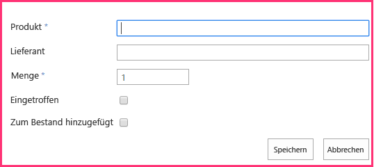
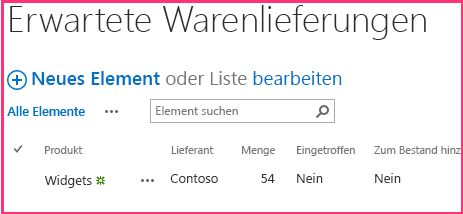

# Hinzufügen von SharePoint-Schreibvorgängen zum vom Anbieter gehosteten Add-In
Erfahren Sie, wie Sie Daten an SharePoint in einem vom Anbieter gehosteten SharePoint-Add-In schreiben.
Dies ist der fünfte einer Reihe von Artikeln über die Grundlagen der Entwicklung von vom Anbieter gehosteten SharePoint-Add-Ins. Machen Sie sich zunächst mit  [SharePoint-Add-Ins](sharepoint-add-ins.md) und den vorherigen Artikeln dieser Reihe vertraut:
  
    
    


-  [Erste Schritte beim Erstellen von von einem Anbieter gehosteten SharePoint-Add-Ins](get-started-creating-provider-hosted-sharepoint-add-ins.md)
    
  
-  [Erteilen des Aussehens und Verhaltens von SharePoint für Ihr vom Anbieter gehostetes Add-In](give-your-provider-hosted-add-in-the-sharepoint-look-and-feel.md)
    
  
-  [Einfügen einer benutzerdefinierten Schaltfläche in das vom Anbieter gehostete Add-In](include-a-custom-button-in-the-provider-hosted-add-in.md)
    
  
-  [Schnelle Übersicht über das SharePoint-Objektmodell](get-a-quick-overview-of-the-sharepoint-object-model.md)
    
  

> **HINWEIS**
> Wenn Sie diese Reihe zu vom Anbieter gehosteten Add-Ins durchgearbeitet haben, haben Sie eine Visual Studio-Projektmappe, die Sie verwenden können, um mit diesem Thema fortzufahren. Sie können außerdem das Repository unter  [SharePoint_Provider-hosted_Add-Ins_Tutorials](https://github.com/OfficeDev/SharePoint_Provider-hosted_Add-ins_Tutorials) herunterladen und die Datei „BeforeSharePointWriteOps.sln" öffnen.
  
    
    

In diesem Artikel kehren wir zurück zur Codierung und fügen einige Funktionen hinzu, die Daten an das ChainStore-SharePoint-Add-In schreiben.
## Ändern eines Spaltenwerts für ein SharePoint-Listenelement

Unser Add-In verfügt über eine benutzerdefinierte Menübandschaltfläche, die einen Mitarbeiter aus der Liste **Lokale Mitarbeiter** des Geschäfts in Hongkong zur Datenbank des Unternehmens hinzufügt. Aber der Benutzer muss daran denken, den Wert des Felds **Zu Unternehmens-DB hinzugefügt** manuell aufJa zu ändern. Lassen Sie uns den Code hinzufügen, der dies automatisch ausführt.
  
    
    

> **HINWEIS**
>  Die Einstellungen für Startprojekte in Visual Studio werden normalerweise auf die Standardwerte zurückgesetzt, wann immer die Projektmappe erneut geöffnet wird. Führen Sie die folgenden Schritte immer unmittelbar nach dem erneuten Öffnen der Beispielprojektmappe in dieser Artikelreihe durch:>  Klicken Sie mit der rechten Maustaste oben im **Projektmappen-Explorer** auf den Projektmappenknoten, und wählen Sie **Startprojekte festlegen** aus.>  Stellen Sie sicher, dass alle drei Projekte in der Spalte **Aktion** auf **Start** festgelegt sind.
  
    
    


1. Öffnen Sie im **Projektmappen-Explorer** die Datei EmployeeAdder.cs.
    
  
2. Fügen Sie die folgende Zeile zur Methode **Page_Load**zwischen dem Aufruf von `AddLocalEmployeeToCorpDB` und dem Aufruf von **Response.Redirect** hinzu. Sie erstellen die Methode `SetLocalEmployeeSyncStatus` im nächsten Schritt.
    
  ```cs
  
// Write to SharePoint
SetLocalEmployeeSyncStatus();
  ```

3. Fügen Sie der Klasse  `EmployeeAdder` die folgende neue Methode hinzu. Beachten Sie Folgendes bei diesem Code:
    
  - Der interne Name für das Feld **Corporate DB hinzugefügt** sieht seltsam aus. Interne Feldnamen dürfen keine Leerzeichen enthalten. Wenn ein Benutzer also ein Feld mit Leerzeichen im Anzeigenamen erstellt, ersetzt SharePoint jedes Leerzeichen durch die Zeichenfolge „_x0020_", wenn der interne Name festgelegt wird. Dadurch wird „Zu Unternehmens-DB hinzugefügt" zu „Zu_x0020_Unternehmens-DB_x0020_hinzugefügt". Da interne Namen höchstens 32 Zeichen lang sein dürfen, wird der Name auf „Zu_x0020_Unternehmens-DB_x0020_h" gekürzt.
    
  
  - Obwohl die Spalte **Zu Unternehmens-DB hinzugefügt** in der SharePoint-UI als „Ja/Nein"-Feld bezeichnet wird, handelt es sich tatsächlich um ein boolesches Feld. Deshalb wird sein Wert auf **true**, nicht „Ja" festgelegt.
    
  
  - Die Methode **Update** der Klasse **ListItem** muss aufgerufen werden, um die Änderungen an der SharePoint-Inhaltsdatenbank zu übernehmen. Es ist eine allgemeine, aber nicht ganz universelle Regel, dass Sie, wenn Sie einen Eigenschaftswert eines Objekts ändern, das in den SharePoint-Datenbanken gespeichert ist, die Methode **Update** des Objekts aufrufen müssen.
    
  

  ```cs
  
private void SetLocalEmployeeSyncStatus()
{
    using (var clientContext = spContext.CreateUserClientContextForSPHost())
    {
        List localEmployeesList = clientContext.Web.Lists.GetByTitle("Local Employees");
        ListItem selectedLocalEmployee = localEmployeesList.GetItemById(listItemID);
        selectedLocalEmployee["Added_x0020_to_x0020_Corporate_x"] = true;
        selectedLocalEmployee.Update();
        clientContext.ExecuteQuery();
    }
}
  ```


## Anfordern der Berechtigung zum Schreiben in die Hostwebliste

Da das Add-In nun sowohl in die Liste schreibt als auch aus ihr liest, müssen wir die Berechtigungen, die das Add-In benötigt, von Lesen auf Schreiben eskalieren. Gehen Sie folgendermaßen vor.
  
    
    

1. Öffnen Sie im **Projektmappen-Explorer** die Datei AppManifest.xml im **ChainStore**-Projekt. 
    
  
2. Öffnen Sie die Registerkarte **Berechtigungen**, und wählen Sie im Feld **Berechtigung** die Option **Schreiben** aus der Dropdownliste aus.
    
  
3. Speichern Sie die Datei. 
    
  

## Ausführen des Add-Ins und Testen der Schaltfläche


  
    
    

1. Verwenden Sie die F5-TASTE, um Ihr Add-In bereitzustellen und auszuführen. Visual Studio hostet die Remotewebanwendung in IIS Express und die SQL-Datenbank in SQL Express. Außerdem wird eine temporäre Installation des Add-Ins auf Ihrer SharePoint-Testwebsite durchgeführt, und das Add-In wird sofort ausgeführt. Sie werden aufgefordert, Berechtigungen für das Add-In zu erteilen, bevor die Startseite geöffnet wird. 
    
  
2. Wählen Sie im Berechtigungsformular **Lokale Mitarbeiter** aus der Liste aus, und klicken Sie dann auf **Vertrauen**.
    
  
3. Wenn die Add-in-Startseite geöffnet wird, klicken Sie auf **Zurück zur Website** im Chromesteuerelement im oberen Bereich.
    
  
4. Navigieren Sie auf der Startseite der Website zu **Websiteinhalte | Lokale Mitarbeiter**. Die Seite mit der Listenansicht wird geöffnet.
    
  
5. Wenn auf der Liste keine Mitarbeiter mit **Neine** in der Spalte **Zu Unternehmens-DB hinzugefügt** vorhanden sind, fügen Sie einen Mitarbeiter zu der Liste hinzu, und *aktivieren Sie nicht das Kontrollkästchen **Zu Unternehmens-DB hinzugefügt**.* 
    
  
6. Öffnen Sie auf dem Menüband die Registerkarte **Elemente**. Im Abschnitt **Aktionen** der Registerkarte wird die benutzerdefinierte Schaltfläche **Zu Unternehmens-DB hinzufügen** angezeigt.
    
  
7. Wählen Sie einen Mitarbeiter in der Liste aus, für den **Nein** in der Spalte **Zu Unternehmens-DB hinzugefügt** angezeigt wird.
    
  
8. Klicken Sie auf die Schaltfläche **Zu Unternehmens-DB hinzufügen**.  * **Sie müssen zuerst ein Element auswähl!*** 
    
  
9. Da Seite scheint neu geladen zu werden, da die Methode **Page_Load** der Seite EmployeeAdder zur Seite umleitet. Der Wert des Felds **Zu Unternehmens-DB hinzugefügt** für den Mitarbeiter hat sich zu **Ja** geändert.
    
    > **HINWEIS**
      > Was verhindert, dass ein Benutzer den Wert **Zu Unternehmens-DB hinzugefügt** in einer Weise manuell ändert, die dazu führt, dass die Liste und die Unternehmensdatenbank inkonsistent werden? Für den Moment nichts. Die Lösung für dieses Problem erfahren Sie in einem späteren Artikel dieser Reihe.
10. Schließen Sie zum Beenden der Debugsitzung das Browserfenster, oder beenden Sie das Debuggen in Visual Studio. Jedes Mal, wenn Sie F5 drücken, zieht Visual Studio die vorherige Version des Add-Ins zurück und installiert die neueste.
    
  
11. Klicken Sie mit der rechten Maustaste auf das Projekt im **Projektmappen-Explorer**, und wählen Sie **Zurückziehen** aus.
    
  

## Erstellen einer neuen benutzerdefinierten Liste auf der Hostwebsite

Die nächste Verbesserung am ChainStore-Add-In besteht darin, neue Elemente in einer Liste zu erstellen, statt lediglich ein Feld in einem vorhandenen Element zu ändern. Spezifisch gesagt, wenn eine neue Bestellung auf Unternehmensebene aufgegeben wird, wird automatisch ein Element in einer SharePoint-Liste erstellt, das lokale Mitarbeiter darauf aufmerksam macht, eine Lieferung zu erwarten. Die Liste heißt **Erwartete Lieferungen** und wird mit den folgenden Schritten erstellt. In einem späteren Artikel dieser Reihe erfahren Sie, wie Sie eine benutzerdefinierte Liste programmgesteuert zu einer Hostwebsite hinzufügen, aber für den Moment werden Sie diese manuell hinzufügen.
  
    
    

1. Navigieren Sie auf der Startseite des Fabrikam-Geschäfts in Hongkong zu **Websiteinhalte | Add-In hinzufügen | Benutzerdefinierte Liste**. 
    
  
2. Geben Sie im Dialogfeld **Benutzerdefinierte Liste hinzufügen**Erwartete Lieferungen als Namen an, und klicken Sie auf **Erstellen**. 
    
  
3. Öffnen Sie auf der Seite **Websiteinhalte** die Liste **Erwartete Lieferungen**.
    
  
4. Öffnen Sie die Registerkarte **Liste** auf dem Menüband, und klicken Sie dann auf die Schaltfläche **Listeneinstellungen**.
    
  
5. Klicken Sie im Abschnitt **Spalten** der Seite **Listeneinstellungen** auf die Spalte **Titel**. 
    
  
6. Ändern Sie im Formular **Spalte bearbeiten** die Option **Spaltenname** von „Titel" imProdukt, und klicken Sie dann auf **OK**.
    
  
7. Klicken Sie auf der Seite **Einstellungen** auf **Spalte erstellen**.
    
  
8. In einem vorherigen Artikel dieser Reihe haben Sie gelernt, wie Sie benutzerdefinierte Spalten für eine Liste erstellen. Fügen Sie für die Liste **Erwartete Lieferungen** vier Spalten hinzu, und verwenden Sie dabei die Werte in der folgenden Tabelle. Behalten Sie für alle anderen Einstellungen die Standardeinstellungen bei.
    

|**Spaltenname**|**Typ**|**Erforderlich?**|**Standardwert**|
|:-----|:-----|:-----|:-----|
|Lieferant <br/> |**Eine Textzeile** <br/> |Nicht erforderlich  <br/> |Keine  <br/> |
|Menge <br/> |**Anzahl** <br/> |Erforderlich  <br/> |1 <br/> |
|Eingegangen <br/> |**Ja/Nein** <br/> |Nicht erforderlich  <br/> |Nein <br/> |
|Zu Bestand hinzugefügt <br/> |**Ja/Nein** <br/> |Nicht erforderlich  <br/> |Nein <br/> |
   
9. Nachdem Sie die Spalten erstellt haben, klicken Sie auf der Seite mit den Listeneinstellungen auf **Websiteinhalte**, um die Seite **Websiteinhalte** zu öffnen. Öffnen Sie die Liste **Erwartete Lieferungen**.
    
  
10. Klicken Sie auf **Neues Element**. Das Formular für das Erstellen von Elementen sollte genau wie folgt aussehen, einschließlich der zwei Sternchen, die erforderliche Felder angeben:
    
     
  

  

  
11. Da wir Elemente in dieser Liste nicht manuell erstellen möchten, klicken Sie auf **Abbrechen**.
    
  

## Einfügen eines Elements in eine SharePoint-Liste

Jetzt fügen Sie eine Funktion zum Add-In hinzu, die immer dann ein Element in der Liste **Erwartete Lieferungen** erstellt, wenn eine Bestellung für das Geschäft in Hongkong auf Unternehmensebene aufgegeben wird.
  
    
    

1. Öffnen Sie im **Projektmappen-Explorer** die Datei OrderForm.aspx.cs.
    
  
2. Fügen Sie eine **using**-Anweisung für **Microsoft.SharePoint.Client** am Anfang der Datei hinzu.
    
  
3. Fügen Sie in der Methode  `btnCreateOrder_Click` die folgende Zeile direkt unter dem Aufruf an `CreateOrder` hinzu. Im nächsten Schritt erstellen Sie die CreateExpectedShipment-Methode.
    
  ```cs
  
CreateExpectedShipment(txtBoxSupplier.Text, txtBoxItemName.Text, quantity);
  ```

4. Fügen Sie der Klasse  `OrderForm` die folgende Methode hinzu. Beachten Sie Folgendes bei diesem Code:
    
  - Ein **ListItem**-Objekt wird aus Gründen der Systemleistung nicht mit einem Konstruktor erstellt. Ein **ListItem**-Objekt hat viele Eigenschaften (mit Standardwerten). Wenn ein Konstruktor verwendet wird, würde das gesamte Objekt in der XML-Meldung enthalten sein, die die Methode **ExecuteQuery** an den Server sendet. Das Objekt **ListItemCreationInformation** ist ein einfaches Objekt, das nur die minimalen vom Standard abweichenden Werte enthält, die der Server zum Erstellen eines **ListItem**-Objekts benötigt. Es mag wirken, als würde eine Zeile ein **ListItem**-Objekt erstellen, aber denken Sie daran, dass diese Zeile nur einige XML-Markups zu einer Meldung hinzufügt, die an den Server gesendet wird. Das Objekt **ListItem** wird auf dem Server erstellt.
    
  
  - Es besteht keine Notwendigkeit, das Objekt **ListItem** zurück zum Client zu bringen. Deshalb gibt keinen Aufruf an die Methode **ClientContext.Load**.
    
  
  - Der Code muss nicht explizit die Felder **Angekommen** oder **Zu Bestand hinzugefügt** festlegen, da diese die Standardwerte „Nein" enthalten, was dem entspricht, was wir wollen.
    
  

  ```
  private void CreateExpectedShipment(string supplier, string product, UInt16 quantity)
{
    using (var clientContext = spContext.CreateUserClientContextForSPHost())
    {
        List expectedShipmentsList = clientContext.Web.Lists.GetByTitle("Expected Shipments");
        ListItemCreationInformation itemCreateInfo = new ListItemCreationInformation();
        ListItem newItem = expectedShipmentsList.AddItem(itemCreateInfo);
        newItem["Title"] = product;
        newItem["Supplier"] = supplier;
        newItem["Quantity"] = quantity;
        newItem.Update();
        clientContext.ExecuteQuery();
    }
}
  ```


## Suchen nach gelöschten Komponenten

Jeder Benutzer mit Rechten als Eigentümer der Liste für eine SharePoint-Liste kann die Liste löschen. Und wenn die Liste von einem Add-In an das Hostweb bereitgestellt wird, kann der Websiteeigentümer des Hostwebs sie löschen. Das geschieht möglicherweise, wenn der Besitzer entscheidet, ohne die Funktionalität der Liste zurechzukommen. (Sie kann aus dem SharePoint-Papierkorb wiederhergestellt werden, wenn der Eigentümer seiner Meinung ändert.) 
  
    
    
Die Methode  `CreateExpectedShipment` hängt vom Vorhandensein der Liste **Erwartete Lieferungen** ab. Angenommen, der Besitzer einer Website entscheidet, die Liste zu löschen. Später, wenn eine Bestellung zum **Bestellformular** des Add-Ins hinzugefügt wird, wird `CreateExpectedShipment` aufgerufen und löst eine Ausnahme aus, deren Meldung besagt, dass keine Liste **Erwartete Lieferungen** auf der SharePoint-Website vorhanden ist.
  
    
    
Möglicherweise sollten Sie die Methode  `expectedShipmentsList` auf Nichtigkeit überprüfen lassen, bevor sie eine Aktion daran durchführt. Wenn Sie mit CSOM arbeiten, können Sie diese Überprüfung *nicht*  mit einer einfachen Struktur wie der folgenden durchführen:
  
    
    
 `if (expectedShipmentsList != null) { ... }`
  
    
    
Stattdessen müssen Sie eine spezielle CSOM-Klasse verwenden, die als **ConditionalScope** bezeichnet wird. Die Gründe hierfür hängen mit dem Batchverarbeitungssystem von CSOM zusammen, das im vorherigen Artikel dieser Reihe erwähnt wurde. (Siehe [Clientseitige Laufzeit und Batchverarbeitung](get-a-quick-overview-of-the-sharepoint-object-model.md#CSOMBatching)). **ConditionalScope** und das Batchverarbeitungssystem sind fortgeschrittene Themen, die über den Umfang dieser Reihe für die ersten Schritte hinausgeht, aber Sie sollten einen Blick in die MSDN-Dokumentation dazu werfen, wenn Sie diese Reihe von Lernprogrammen abgeschlossen haben.
  
    
    
Es gibt eine alternative Möglichkeit zum Prüfen, ob eine Liste vorhanden ist: Statt die Methode **GetByTitle** zu verwenden, um einen Verweis auf die Liste zu erhalten, können Sie mit Code wie dem folgenen überprüfen, ob sich eine Liste mit dem angegebenen Namen in der „Liste der Listen" der Website befindet.
  
    
    


```cs

var query = from list in clientContext.Web.Lists
             where list.Title == "Expected Shipments" 
             select list; 
IEnumerable<List> matchingLists = clientContext.LoadQuery(query); 
clientContext.ExecuteQuery(); 
if (matchingLists.Count() != 0) 
{ 
    List expectedShipmentsList = matchingLists.Single(); 
    // Do something with the list. 
}
clientContext.ExecuteQuery(); 
```

Dieser Code hat den Vorteil, dass Sie die Komplikationen der Klasse **ConditionalScope** vermeiden können, und wir verwenden genau diesen Code an anderer Stelle in dieser Artikelreihe. Es gibt jedoch auch einen Nachteil: Dieser Code erfordert einen zusätzlichen Aufruf von **ExecuteQuery**, nur um den Wert abzurufen, den Sie in der **if**-Anweisung überprüfen möchten. Wenn dieses Verfahrens in  `CreateExpectedShipment` verwendet wird, um zu prüfen, ob die Liste vorhanden ist, hat diese Methode zwei Aufrufe von **ExecuteQuery**, die jeweils eine HTTP-Anforderung vom Remotewebserver an SharePoint durchführen. Diese Anforderungen sind der zeitaufwändigste Teil jeder CSOM-Methode. Daher ist es im Allgemeinen empfehlenswert, diese zu minimieren.
  
    
    
 `CreateExpectedShipment` wird wie gehabt beibehalten, aber in einem Produktions-Add-In müssen Sie überlegen, wie Ihr Code funktioniert, wenn eine Komponente, die darauf verweist, gelöscht wird. Das programmgesteuerte Wiederherstellen der Liste aus dem Papierkorb ist eine Option, aber diese würde Benutzer stören, die absichtlich entscheiden, die Liste zu löschen. Berücksichtigen Sie auch, dass möglicherweise die Möglichkeit darin besteht, nichts zu tun, um die Ausnahme zu verhindern. Eine Ausnahme von SharePoint würde Benutzer warnen, dass das Löschen der Liste einen Teil des Add-Ins untauglich macht, was der Person, die sie gelöscht hat, möglicherweise nicht bemerkt hat. Ein Benutzer kann dann entscheiden, ob die Liste aus dem Papierkorb wiedergeherstellt wird oder er ohne den Teil der Add-In-Funktionalität auskommt, der nicht mehr funktioniert.
  
    
    

## Anfordern der Berechtigung zum Verwalten der Website

Sie erinnern sich, dass SharePoint, wenn ein Add-In Lese- oder Schreibberechtigungen im Bereich der Liste anfordert, den Benutzer auffordert, dem Add-In zu vertrauen. Das Dialogfeld enthält eine Dropdownliste, aus der der Benutzer die Liste auswählt, auf die das Add-In Zugriff haben sollte. Nur eine Liste kann ausgewählt werden. Aber das ChainStore-Add-In schreibt jetzt in zwei verschiedene Listen. Um Zugriff auf mehrere Listen zu erhalten, muss das Add-In die Berechtigung im Bereich des Web anfordern. Gehen Sie wie folgt vor:
  
    
    

1. Öffnen Sie im **Projektmappen-Explorer** die Datei AppManifest.xml im **ChainStore**-Projekt. 
    
  
2. Öffnen Sie die Registerkarte **Berechtigungen**, und wählen Sie im Feld **Bereich** die Option **Web** aus der Dropdownliste aus.
    
  
3. Wählen Sie im Feld **Berechtigung** die Option **Schreiben** aus der Dropdownliste aus.
    
  
4. Speichern Sie die Datei. 
    
  

## Ausführen des Add-Ins und Testen der Elementerstellung


  
    
    

1. Verwenden Sie die F5-TASTE, um Ihr Add-In bereitzustellen und auszuführen. Visual Studio hostet die Remotewebanwendung in IIS Express und die SQL-Datenbank in SQL Express. Außerdem wird eine temporäre Installation des Add-Ins auf Ihrer SharePoint-Testwebsite durchgeführt, und das Add-In wird sofort ausgeführt. Sie werden aufgefordert, Berechtigungen für das Add-In zu erteilen, bevor die Startseite geöffnet wird. 
    
  
2. Wenn die Add-In-Startseite geöffnet wird, klicken Sie auf den Link **Bestellformular** am unteren Rand der Seite.
    
  
3. Geben Sie einige Werte in das Formular ein, und klicken Sie auf **Bestellung aufgeben**.
    
  
4. Verwenden Sie im Browser die Schaltfläche „Zurück", um wieder zur Startseite zu navigieren, und klicken Sie dann auf **Zurück zur Website** auf dem Chromesteuerelement oben.
    
  
5. Navigieren Sie von der Startseite des Hongkong-Stores zur Seite **Websiteinhalte**, und öffnen Sie die Liste **Erwartete Lieferungen**. Es befindet sich jetzt ein Element in der Liste, das der Bestellung entspricht. Der folgende Screenshot ist ein Beispiel.
    
     
  

  

  
6. Schließen Sie zum Beenden der Debugsitzung das Browserfenster, oder beenden Sie das Debuggen in Visual Studio. Jedes Mal, wenn Sie F5 drücken, zieht Visual Studio die vorherige Version des Add-Ins zurück und installiert die neueste.
    
  
7. Klicken Sie mit der rechten Maustaste auf das Projekt im **Projektmappen-Explorer**, und wählen Sie **Zurückziehen** aus.
    
  

## 
<a name="Nextsteps"> </a>

 Im nächsten Artikel erfahren Sie, wie Sie das Remotebestellformular als Webpart auf einer SharePoint-Seite anzeigen: [Einfügen eines Add-In-Webparts in das vom Anbieter gehostete Add-In](include-an-add-in-part-in-the-provider-hosted-add-in.md)
  
    
    

