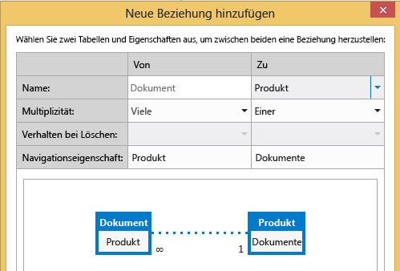

# Zuordnen einer Dokumentbibliothek zu einer Entität
Mit dem Dokumentbibliothek-Feature in SharePoint können Sie mit einzelnen Elementen in einer Liste oder Entität verknüpfte Dokumente erstellen oder hochladen. Sie können beispielsweise eine Dokumentbibliothek zum Speichern von Vertriebsdokumentationen und Produkthandbüchern für jedes Produkt in einer Liste verwenden. In einem Cloud-Geschäfts-Add-In können Sie einer Dokumentbibliothek eine Entität zuordnen, indem Sie eine Beziehung erstellen.
## Zuordnen einer Dokumentbibliothek

Der Prozess zum Zuordnen einer Dokumentbibliothek umfasst drei Schritte:

1. Fügen Sie Ihrem Projekt eine SharePoint-Dokumentbibliothek als Datenquelle hinzu.

    > **WICHTIG**
      > Sie müssen zunächst eine Dokumentbibliothek auf Ihrer SharePoint-Website erstellen. Sie muss eine benutzerdefinierte Spalte enthalten, die einem eindeutigen Feld in Ihrer Entität zugeordnet ist. 
2. Erstellen Sie eine Beziehung zwischen der Dokumentbibliothek und einer Entität.

3. Fügen Sie die Dokumentbibliothek zu einem Bildschirm hinzu. Der Prozess unterscheidet sich, je nachdem, ob Sie einen neuen Bildschirm erstellen oder sie zu einem vorhandenen Bildschirm hinzufügen.

### So fügen Sie eine Dokumentbibliothek hinzu

1. Öffnen Sie im **Projektmappen-Explorer** das Kontextmenü des Knotens **Datenquellen** und klicken Sie dann auf **Datenquelle hinzufügen**.

2. Klicken Sie im **Assistenten zum Zuordnen von Datenquellen** auf das **SharePoint**-Symbol und anschließend auf die Schaltfläche **Weiter**.

3. Geben Sie auf der Seite **Verbindungsinformationen eingeben** im Textfeld **Adresse der SharePoint-Website angeben** die URL Ihrer SharePoint-Entwicklerwebsite an und klicken Sie dann auf **Weiter**.

4. Klicken Sie auf der Seite **SharePoint-Elemente auswählen** im linken Bereich auf das Listenelement **Dokumentbibliotheken** und aktivieren Sie im rechten Bereich das Kontrollkästchen für Ihre Dokumentbibliothek, wie in Abbildung 1 dargestellt.

   **Abbildung 1. Auswahl der Dokumentbibliothek**

    In Abbildung 2 ist die Dokumentbibliothek auf der SharePoint-Website dargestellt.

   **Abbildung 2. Die benutzerdefinierte Spalte "Produktname"**

    > **WICHTIG**
      > Die Dokumentbibliothek muss bereits vorhanden sein und eine benutzerdefinierte Spalte enthalten, die einem eindeutigen Feld in Ihrer Entität zugeordnet ist. 
5. Geben Sie unter **Geben Sie den Namen der Datenquelle an** einen Namen ein und klicken Sie dann auf die Schaltfläche **Fertig stellen**.

### So erstellen Sie eine Beziehung

1. Öffnen Sie im **Projektmappen-Explorer** die Dokumentbibliothek-Entität und klicken Sie dann in der Leiste **Perspektive** auf die Registerkarte **Server**.

2. Klicken Sie in der Symbolleiste auf **Beziehung**.

3. Klicken Sie im Dialogfeld **Neue Beziehung hinzufügen** in der Dropdownliste **An** auf die Entität, die Sie zuordnen möchten, wie in Abbildung 3 dargestellt.

   **Abbildung 3. Erstellen einer Beziehung.**

4. Klicken Sie in der Dropdownliste **Fremdschlüssel** auf die benutzerdefinierte Spalte aus Ihrer Dokumentbibliothek.

5. Klicken Sie in der Dropdownliste **Primärschlüssel** auf das Feld aus Ihrer Entität, das der benutzerdefinierten Spalte in der Dokumentbibliothek zugeordnet ist, und klicken Sie dann auf die Schaltfläche **OK**. Für die benutzerdefinierte Spalte "Produktname" müssen Sie beispielsweise auf das Feld "Produktname" klicken, wie in Abbildung 4 dargestellt.

   **Abbildung 4. Verwandte Fremd- und Primärschlüssel**

    > **HINWEIS**
      > Das Feld muss den gleichen Datentyp aufweisen wie das Feld **Fremdschlüssel**. 

### So fügen Sie einer neuen Bildschirmgruppe eine Dokumentbibliothek hinzu

1. Öffnen Sie im **Projektmappen-Explorer** die Entität, die der Dokumentbibliothek zugeordnet ist, und klicken Sie dann in der Leiste **Perspektive** auf die Registerkarte **HTMLClient**.

2. Klicken Sie in der Symbolleiste auf **Bildschirm**.

3. Geben Sie in dem Dialogfeld **Neuen Bildschirm hinzufügen** im Textfeld **Bildschirmgruppenname** einen Namen für die Bildschirmgruppe ein.

4. Klicken Sie in der Liste **Bildschirmdaten** auf Ihre Entität.

5. Aktivieren Sie in der Liste **Zusätzliche einzuschließende Daten** das Kontrollkästchen für Ihre Dokumentbibliothek und klicken Sie dann auf die Schaltfläche **OK**.

    In Abbildung 5 ist eine Bildschirmgruppe für eine Produkt-Entität dargestellt.

   **Abbildung 5. Der Bildschirmsatz "Produkte"**

    Der für die Entität erstellte Bildschirm **Ansicht** enthält eine Registerkarte **Dokumente** mit einer **Dokument hinzufügen**-Schaltfläche. Die Schaltfläche zeigt ein Popup zum Hinzufügen oder Hochladen von Dokumenten an.

### So fügen Sie zu einem vorhandenen Bildschirm eine Dokumentbibliothek hinzu

1. Öffnen Sie im **Projektmappen-Explorer** das Kontextmenü des Bildschirms, den Sie einer Dokumentbibliothek zuordnen möchten und klicken Sie dann auf **Öffnen**.

2. Klicken Sie im Bildschirm-Designer auf den Knoten **Registerkarten** wie in Abbildung 6 dargestellt, und anschließend auf den Knoten **Registerkarte hinzufügen**.

   **Abbildung 6. Der Knoten "Registerkarten"**

3. Klicken Sie im Fenster **Eigenschaften** auf die Eigenschaft **Anzeigename** und geben Sie dann einen aussagekräftigen Namen für die neu hinzugefügte Registerkarte ein. Z. B.Dokumente.

4. Klicken Sie im linken Bereich des Bildschirm-Designers auf den Link  _DocumentLibraryName_ **Hinzufügen** wie in Abbildung 7 dargestellt, dabei ist _DocumentLibraryName_ der Name Ihrer Dokumentbibliothek.

   **Abbildung 7. Der Link "Produktdokumente hinzufügen"**

5. Klicken Sie im mittleren Bereich auf den Knoten der neuen Registerkarte, erweitern Sie die Liste **Hinzufügen** und klicken Sie dann auf _DocumentLibraryName_.

6. Erweitern Sie den Knoten **Befehlszeile** der neuen Registerkarte wie in Abbildung 8 dargestellt und klicken Sie dann auf **Hinzufügen**.

   **Abbildung 8. Der Knoten "Befehlszeile"**

7. Akzeptieren Sie im Dialogfeld **Schaltfläche hinzufügen** die Standardauswahlmöglichkeiten und klicken Sie dann auf die Schaltfläche **OK**.

    In Abbildung 9 ist das Dialogfeld **Schaltfläche hinzufügen** mit der Standardmethode, **createOrUploadDocument**, dargestellt.

   **Abbildung 9. Das Dialogfeld "Schaltfläche hinzufügen"**

8. Klicken Sie im Fenster **Eigenschaften** auf die Eigenschaft **Anzeigename** und geben Sie einen aussagekräftigen Namen für die Schaltfläche ein. Z. B.Dokument hinzufügen.

    Der Bildschirm enthält nun eine Registerkarte **Dokumente** mit einer Schaltfläche in der Befehlsleiste. Die Schaltfläche zeigt ein Popup zum Hinzufügen oder Hochladen von Dokumenten an.

## Zusätzliche Ressourcen

-  [Entwickeln von Cloud-Geschäfts-Add-Ins](develop-cloud-business-add-ins.md)

-  [Vorfall-Manager: ein Lernprogramm zu Cloud-Geschäfts-Add-Ins](incident-manager-a-cloud-business-add-in-tutorial.md)

