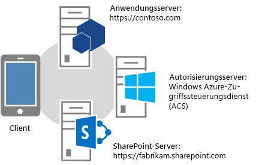
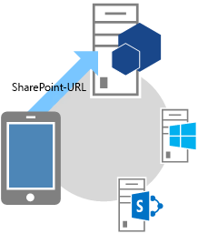
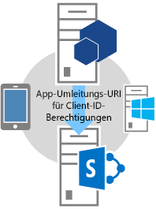
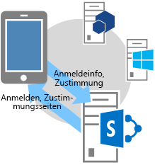
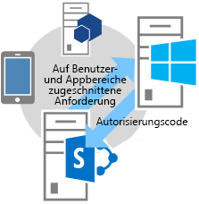
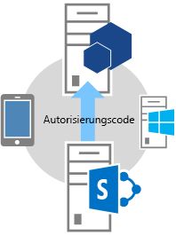
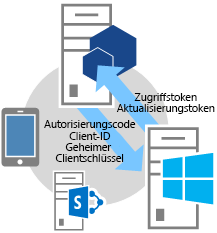
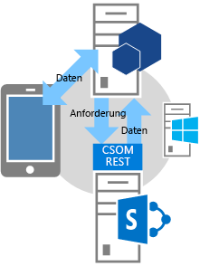

# OAuth-Ablauf mit Authentifizierungscode für SharePoint-Add-Ins
Erfahren Sie mehr über den OAuth-Ablauf für Add-Ins, die dynamisch Zugriff auf SharePoint-Ressourcen anfordern. Außerdem erhalten Sie Informationen zur Verwendung der OAuthAuthorize.aspx-Seite und des SharePoint-Umleitungs-URI.
## Übersicht über Add-Ins, die dynamisch Zugriffsberechtigungen von SharePoint anfordern
<a name="Overview"> </a>


> **HINWEIS**
> In diesem Artikel wird davon ausgegangen, dass Sie mit  [Erstellen von SharePoint-Add-Ins, die die Autorisierung mit niedriger Vertrauensebene verwenden](creating-sharepoint-add-ins-that-use-low-trust-authorization.md) und den Konzepten und Prinzipien von OAuth vertraut sind. Weitere Informationen zu OAuth finden Sie unter [OAuth.net](http://oauth.net/) und [Webautorisierungsprotokoll (oauth)](http://datatracker.ietf.org/doc/active/#oauth). 
  
    
    

In bestimmten Szenarien kann ein Add-In die Berechtigung für den Zugriff auf SharePoint-Ressourcen dynamisch anfordern, das heißt, ein **Add-In kann die Berechtigung für den Zugriff auf SharePoint-Ressourcen dynamisch während der Laufzeit** statt zum Zeitpunkt der Add-In-Installation anfordern. Diese Art von Add-In muss nicht von SharePoint gestartet und selbst nicht dort installiert sein. Stattdessen kann es sich dabei beispielsweise um ein systemeigenes Geräte-Add-In, ein von einer beliebigen Website gestartetes Add-In oder ein Office-Add-In handeln, das von einer Office-Anwendung gestartet wird und dynamisch auf SharePoint-Ressourcen zugreift.
  
    
    

> **HINWEIS**
> Dieser Add-In-Typ kann nur von Benutzern mit Verwaltungsberechtigungen für die Ressourcen ausgeführt werden, auf die das Add-In zugreifen möchte. Wenn ein Add-In beispielsweise nur die Leseberechtigung für eine Website anfordert, kann ein Benutzer das Add-In mit der Berechtigung "Lesen" ohne die Berechtigung "Verwalten" nicht ausführen. 
  
    
    

Um Aufrufe in SharePoint zu ermöglichen, muss diese Art von Add-In zunächst über das Verkäuferdashboard oder die Seite "appregnew.aspx" **registriert werden**. Weitere Informationen zum Registrieren von Add-Ins über das Verkäuferdashboard oder die Seite "appregnew.aspx" finden Sie unter [Registrieren von SharePoint-Add-Ins 2013](register-sharepoint-add-ins-2013.md).
  
    
    
Nach dem Registrieren des Add-Ins ist dieses ein  *Sicherheitsprinzipal*  und hat eine Identität, wie Benutzer und Gruppen sie haben. Diese Identität wird alsAdd-In-Prinzipal bezeichnet. Genau wie Benutzer und Gruppen besitzt auch ein Add-In-Prinzipal bestimmte Berechtigungen. Weitere Informationen zu Add-In-Prinzipalen finden Sie unter [Registrieren von SharePoint-Add-Ins 2013](register-sharepoint-add-ins-2013.md).
  
    
    
Wenn Sie das Add-In registrieren, erhalten Sie eine Client-ID, einen geheimen Clientschlüssel, eine Add-In-Domäne und einen Umleitungs-URI für den Add-In-Prinzipal. Diese Informationen werden beim Autorisierungsserver, Microsoft Azure Access Control Service (ACS), registriert.
  
    
    

## Informationen zum OAuth-Ablauf für Add-Ins, die dynamisch Berechtigungen anfordern
<a name="Flow"> </a>

In diesem Abschnitt wird der OAuth-Authentifizierungs- und -Autorisierungsablauf für ein SharePoint-Add-In beschrieben, das dynamisch Berechtigungen anfordert. Der Ablauf wird als **Authentifizierungscodeablauf** bezeichnet. In der Abfolge wird beschrieben, wie ein Add-In, das nicht von SharePoint gestartet wird, auf Ressourcen in SharePoint zugreifen kann.
  
    
    

> **HINWEIS**
> Der Ablauf **umfasst eine Reihe von Interaktionen zwischen dem Add-In, SharePoint, dem Autorisierungsserver (hier ACS) und dem Endbenutzer** während der Laufzeit. Der Ablauf erfordert also, dass entweder SharePoint Online oder eine SharePoint-Farm mit dem Internet verbunden ist, damit eine Kommunikation mit ACS möglich ist. SharePoint-Farmen, die nicht mit dem Internet verbunden sind, müssen [das besonders vertrauenswürdige Autorisierungssystem](creating-sharepoint-add-ins-that-use-high-trust-authorization.md) verwenden.
  
    
    

Es muss eine Webanwendung oder ein Dienst vorhanden sein, die bzw. der separat von SharePoint gehostet wird. Selbst wenn es sich beim Add-In um ein Geräte-Add-In handelt, muss es über eine Webanwendungs- oder Dienst-URL verfügen, die bei ACS registriert werden kann (siehe oben), selbst wenn die Webkomponente für nichts anderes verwendet wird. Aus Gründen der Einfachheit wird in diesem Artikel davon ausgegangen, dass das Add-In eine Webanwendung namens Contoso.com ist. Die Anwendung verwendet das SharePoint-Clientobjektmodell (CSOM) oder die SharePoint-REST-APIs, um Aufrufe an SharePoint durchzuführen. Wenn die Anwendung erstmals versucht, auf SharePoint zuzugreifen, fordert SharePoint einen Autorisierungscode von ACS an, der an die Contoso.com-Anwendung gesendet werden kann. Die Anwendung verwendet dann den Autorisierungscode, um ein Zugriffstoken von ACS anzufordern. Nachdem das Zugriffstoken abgerufen wurde, schließt die Contoso.com-Anwendung es in alle Anforderungen an SharePoint ein.
  
    
    

### Ausführliches Beispiel zum Ablauf
<a name="Fly"> </a>

Nehmen wir an, dass Contoso einen Online-Fotodruckdienst bereitstellt. Ein Benutzer möchte einige Fotos drucken. Der Benutzer möchte es dem Fotodruckdienst von Contoso ermöglichen, auf Fotos in unterschiedlichen Fotobibliotheken zuzugreifen, die der Benutzer auf einer SharePoint Online-Website,  `fabrikam.sharepoint.com`, aufbewahrt, und diese zu drucken.
  
    
    

  
    
    

  
    
    
Die Fotodruck-Anwendung ist registriert, verfügt also bereits über eine Client-ID, einen geheimen Clientschlüssel und einen Umleitungs-URI. Der von Contoso bei der Add-In-Registrierung angegebene Umleitungs-URI lautet  `https://contoso.com/RedirectAccept.aspx`. Die Client-ID und der geheime Clientschlüssel befinden sich in der web.config-Datei der Anwendung. Im Folgenden finden Sie ein Beispiel für die web.config-Datei der Anwendung mit Client-ID und geheimem Clientschlüssel.
  
    
    


```XML

<configuration>
  <appSettings>
    <add key="ClientId" value="c78d058c-7f82-44ca-a077-fba855e14d38 "/>
    <add key="ClientSecret" value="SbALAKghPXTjbBiLQZP+GnbmN+vrgeCMMvptbgk7T6w= "/>

  </appSettings>

</configuration>
```

Im Folgenden sind die einzelnen Schritte im Authentifizierungscodeablauf aufgeführt.
  
    
    

    
> **TIPP**
> Diese Schritte beziehen sich auf Methoden in der Datei TokenHelper.cs (oder TokenHelper.vb) file. Dieser verwaltete Code ist nicht kompiliert, es gibt dazu also keine Referenzthemen. However, the file itself is fully commented with descriptions of every class, member parameter, and return value. Consider having a copy of it open to refer to as you read these steps. 
  
    
    


||||
|:-----|:-----|:-----|
|**1** <br/> ||**Der Client öffnet eine Anwendung und leitet sie an eine SharePoint-Website für Daten um.** <br/> Ein Benutzer öffnet die Contoso-Fotodruck-Website und findet auf der Benutzeroberfläche den Hinweis, dass er Fotos drucken kann, die auf einer beliebigen SharePoint Online-Website aufbewahrt werden. In diesem Beispiel ist die URL  `https://contoso.com/print/home.aspx`.  <br/> Der Benutzer wird vom Fotodruck-Add-In Eingabe der URL der Fotosammlung aufgefordert. Der Benutzer gibt eine URL ein, die auf eine SharePoint Online-Website verweist:  `https://fabrikam.sharepoint.com/`.  <br/> |
|**2** <br/> ||**Das Add-In wird an die Autorisierungs-URL der SharePoint-Website weitergeleitet.** <br/> Wenn der Benutzer auf die Schaltfläche zum Abrufen der Fotos klickt, leitet das Contoso-Fotodruck-Add-In den Browser an  `https://fabrikam.sharepoint.com/` um. Diese Umleitung ist eine HTTP-302-Umleitungsantwort. <br/> Bei Verwendung von Microsoft .NET ist **Response.Redirect** eine von mehreren Möglichkeiten zum Implementieren der Umleitung in Ihrem Code. Mithilfe der Datei Tokenhelper.cs (oder Tokenhelper.vb) in Ihrem Projekt können Sie die überladene **GetAuthorizationUrl**-Methode (mit drei Argumenten) aufrufen. Durch diese Methode wird die Umleitungs-URL für "OAuthAuthorize.aspx" automatisch konstruiert. Sie können die URL aber auch manuell konstruieren.  <br/> Wenn Sie beispielsweise die **GetAuthorizationUrl**-Methode aufrufen, um die Umleitungs-URL für "OAuthAuthorize.aspx" automatisch zu konstruieren, ergibt sich bei Verwendung der Datei TokenHelper.cs (TokenHelper.vb) in Ihrem Projekt folgender Code:  <br/>  `Response.Redirect(TokenHelper.GetAuthorizationUrl(`           `sharePointSiteUrl.ToString(),`           `"Web.Read List.Write",`           `"https://contoso.com/RedirectAccept.aspx"));` <br/> Wenn Sie sich die Überladung mit drei Parametern der **GetAuthorizationUrl**-Methode in TokenHelper.cs (oder .vb) ansehen, werden Sie feststellen, dass der zweite Parameter ein Berechtigungsbereichparameter ist, wobei es sich um eine durch Leerzeichen getrennte Liste von Berechtigungen der Add-In-Anforderungen im Kurzformat handelt. Weitere Informationen zu Berechtigungsbereichen finden Sie unter  [App-Berechtigungsbereichsaliase und die Verwendung der OAuthAuthorize.aspx-Seite](#Scope). Der dritte Parameter muss derselbe Umleitungs-URI sein, der auch für die Registrierung des Add-Ins verwendet wurde. Weitere Informationen zur Registrierung finden Sie unter  [Registrieren von SharePoint-Add-Ins 2013](register-sharepoint-add-ins-2013.md). Sie werden außerdem feststellen, dass es sich bei der zurückgegebenen Zeichenfolge um eine URL einschließlich Abfragezeichenfolgenparameter handelt.  <br/> Die Umleitungs-URL für "OAuthAuthorize.aspx" kann ggf. auch manuell konstruiert werden. So lautet die URL, an die der Benutzer vom Fotodruck-Add-In von Contoso umgeleitet wird, in diesem Fall beispielsweise wie folgt:  <br/>  `https://fabrikam.sharepoint.com/_layouts/15/OAuthAuthorize.aspx?client_id=client_GUID&amp;scope=app_permissions_list&amp;response_type=code&amp;redirect_uri=redirect_uri` <br/> Wie im Beispiel gezeigt, sendet das Fotodruck-Add-In von Contoso die Client-ID und den Umleitungs-URI von OAuth als Abfragezeichenfolgenparameter an die Fabrikam-Website. Im Anschluss finden Sie ein Beispiel für die GET-Anforderung mit Beispielwerten für die Abfragezeichenfolge. Aus Gründen der Übersichtlichkeit wurden Zeilenumbrüche hinzugefügt. Die tatsächliche Ziel-URL ist eine einzelne Zeile.  <br/>  `GET /authcode HTTP/1.1`           `Host: fabrikam.sharepoint.com`                     `/oauthauthorize.aspx`           `?client_id= c78d058c-7f82-44ca-a077-fba855e14d38`           `&amp;scope=list.read`           `&amp;response_type=code`           `&amp;redirect_uri= https%3A%2F%2Fcontoso%2Ecom%2Fredirectaccept.aspx`           <br/> Wenn Sie ein separates Popupfenster zum Einholen der Zustimmung verwenden möchten, können Sie dem URL-Konstrukt den Abfrageparameter **IsDlg=1** hinzufügen, wie hier gezeigt: <br/>  `/oauthauthorize.aspx?IsDlg=1&amp;client_id= c78d058c-7f82-44ca-a077-fba855e14d38&amp;scope=list.read&amp;response_type=code&amp;redirect_uri= https%3A%2F%2Fcontoso%2Ecom%2Fredirectaccept.aspx` <br/> |
|**3** <br/> ||**SharePoint zeigt die Zustimmungsseite an, damit der Benutzer dem Add-In Berechtigungen erteilen kann.** <br/> Falls der Benutzer noch nicht bei der Fabrikam-SharePoint Online-Website angemeldet ist, wird er aufgefordert, sich anzumelden. Ist der Benutzer bereits angemeldet, wird eine HTML-Zustimmungsseite von SharePoint gerendert.  <br/> Der Benutzer wird auf der Zustimmungsseite aufgefordert, dem Fotodruck-Add-In von Contoso die vom Add-In angeforderten Berechtigungen zu gewähren (oder zu verweigern). Im vorliegenden Fall erteilt der Benutzer dem Add-In Lesezugriff auf die Bildbibliothek des Benutzers bei Fabrikam.  <br/> |
|**4** <br/> ||**SharePoint fordert bei ACS einen kurzfristigen Autorisierungscode an.** <br/> Die Fabrikam-SharePoint Online-Website fordert den Zugriffssteuerungsdienst auf, für diese Kombination aus Benutzer und Add-In einen kurzfristigen (ca. 5 Minuten gültigen) eindeutigen Autorisierungscode zu erstellen.  <br/> ACS sendet den Autorisierungscode an die Fabrikam-Website.  <br/> |
|**5** <br/> ||**Die SharePoint Online-Website wird an den registrierten Umleitungs-URI des Add-Ins weitergeleitet und übergibt dabei den Autorisierungscode an das Add-In.** <br/> Der Browser wird von der Fabrikam-SharePoint Online-Website über die HTTP-Antwort 302 wieder zu Contoso umgeleitet. Vom URL-Konstrukt für diese Umleitung wird der Umleitungs-URI verwendet, der bei der Registrierung des Fotodruck-Add-Ins angegeben wurde. Darüber hinaus enthält das Konstrukt den Autorisierungscode als Abfragezeichenfolge. Die Umleitungs-URL ist in etwa wie folgt strukturiert:  <br/>  `https://contoso.com/RedirectAccept.aspx?code=<authcode>` <br/> |
|**6** <br/> ||**Das Add-In verwendet den Autorisierungscode, um bei ACS ein Zugriffstoken anzufordern. ACS validiert die Anforderung, macht den Autorisierungscode ungültig und sendet dann Zugriffs- und Aktualisierungstoken dann an das Add-In.** <br/> Contoso ruft den Autorisierungscode aus dem Abfrageparameter ab und fügt ihn dann zusammen mit der Client-ID und dem geheimen Clientschlüssel in eine Anforderung an ACS für ein Zugriffstoken ein.  <br/> Wenn Sie verwalteten Code und das SharePoint-CSOM verwenden, benutzt die Datei TokenHelper.cs (oder .vb) für die Anforderung an ACS die Methode **GetClientContextWithAuthorizationCode**. In diesem Fall sieht der Code in etwa wie folgt aus (wobei  `authCode` eine Variable ist, der der Autorisierungscode zugewiesen wurde): <br/>  `TokenHelper.GetClientContextWithAuthorizationCode(`           `"https://fabrikam.sharepoint.com/",`           `"00000003-0000-0ff1-ce00-000000000000",`           `authCode,`           `"1ee82b34-7c1b-471b-b27e-ff272accd564",`           `new Uri(Request.Url.GetLeftPart(UriPartial.Path)));`           <br/> In der Datei TokenHelper.cs (oder .vb) ist der zweite Parameter der **GetClientContextWithAuthorizationCode**-Methode  `targetPrincipalName`. Dieser Wert ist immer die Konstante " `00000003-0000-0ff1-ce00-000000000000`" in einem Add-In, das auf SharePoint zugreift. Wenn Sie die Aufrufhierarchie von **GetClientContextWithAuthorizationCode** verfolgen, sehen Sie auch, dass die Client-ID und der geheime Schlüssel aus der Datei web.config abgerufen werden. <br/> ACS empfängt die Anforderung von Contoso und überprüft die Client-ID, den geheimen Clientschlüssel, den Umleitungs-URI und den Autorisierungscode. Sind alle Werte gültig, macht ACS den Autorisierungscode ungültig (da dieser immer nur einmal verwendet werden kann) und erstellt ein Aktualisierungs- und ein Zugriffstoken, die an Contoso zurückgegeben werden.  <br/> Die Contoso-Anwendung kann dieses Zugriffstoken zwischenspeichern, um es in späteren Anforderungen erneut zu verwenden. Standardmäßig sind Zugriffstoken jeweils etwa 12 Stunden lang gültig. Jedes Zugriffstoken gehört zu genau dem Benutzerkonto, das in der ursprünglichen Autorisierungsanforderung angegeben wurde, und gewährt ausschließlich Zugriff auf die Dienste, die in dieser Anforderung aufgeführt sind. Das Add-In muss das Zugriffstoken an einem sicheren Ort speichern.  <br/> Die Contoso-Anwendung kann auch das Aktualisierungstoken zwischenspeichern. Standardmäßig sind Aktualisierungstoken für 6 Monate gültig. Das Aktualisierungstoken kann für ein neues Zugriffstoken von ACS eingelöst werden, wann immer das Zugriffstoken abläuft. Weitere Informationen zu Token finden Sie unter  [Handhabung von Sicherheitstoken in vom Anbieter gehosteten Add-Ins für SharePoint mit niedriger Vertrauensebene](handle-security-tokens-in-provider-hosted-low-trust-sharepoint-add-ins.md).  <br/> |
|**7** <br/> ||**Das Add-In kann jetzt das Zugriffstoken verwenden, um Daten von der SharePoint-Website anzufordern, die sie dem Benutzer anzeigen kann.** <br/> Contoso schließt das Zugriffstoken ein, um eine REST-API- oder CSOM-Aufforderung an SharePoint durchzuführen und übergibt dabei das OAuth-Zugriffstoken im HTTP- **Authorization**-Header.  <br/> SharePoint gibt die von Contoso angeforderten Informationen zurück. Weitere Informationen zur Durchführung dieser Anforderung finden Sie unter  [Handhabung von Sicherheitstoken in vom Anbieter gehosteten Add-Ins für SharePoint mit niedriger Vertrauensebene](handle-security-tokens-in-provider-hosted-low-trust-sharepoint-add-ins.md).  <br/> |
   

## App-Berechtigungsbereichsaliase und die Verwendung der OAuthAuthorize.aspx-Seite
<a name="Scope"> </a>

In diesem Abschnitt wird davon ausgegangen, dass Sie mit dem Artikel  [Add-In-Berechtigungen in SharePoint 2013](add-in-permissions-in-sharepoint-2013.md) vertraut sind. In Tabelle 1 sind dieselben URIs für den Add-In-Berechtigungsanforderungsbereich aufgeführt wie in diesem Artikel, mit der Ausnahme, dass die Tabelle über eine zusätzliche Spalte ( **Bereichsalias** ) verfügt und das Recht "FullControl" nicht in der Spalte **Verfügbare Rechte** verfügbar ist, da ein Add-In, das die Berechtigung für den Zugriff auf SharePoint-Ressourcen dynamisch anfordert, keinen Vollzugriff anfordern kann.
  
    
    
Die Bereichswerte für Berechtigungsanforderungen in der Spalte **Bereichsalias** sind Kurzversionen der jeweiligen Pendants in der Spalte **Bereichs-URI**. Die Aliase können nur von Add-Ins verwendet werden, die die Berechtigung für den Zugriff auf SharePoint-Ressourcen dynamisch anfordern. (Der Bereichs-URI-Wert wird im Add-In-Manifest von Add-Ins verwendet, die von SharePoint gestartet werden. Diese Add-Ins fordern Berechtigungen während der Installation an.)
  
    
    
Die Bereichsaliaswerte kommen nur im Rahmen der Verwendung der OAuthAuthorize.aspx-Umleitungsseite zum Einsatz. Wie in Schritt 2 des im vorherigen Abschnitt beschriebenen OAuth-Ablaufs gezeigt, werden die Aliase, wenn das Add-In verwalteten Code verwendet, beim Aufrufen der Methode **GetAuthorizationUrl** von TokenHelper.cs (oder .vb) in Ihrem Projekt benutzt. Im Folgenden sehen Sie ein weiteres Beispiel:
  
    
    


```cs

Response.Redirect(TokenHelper.GetAuthorizationUrl(
    sharePointSiteUrl.ToString(), 
    "Web.Read List.Write ", 
    "https://contoso.com/RedirectAccept.aspx "));
```

Der  _scope_-Parameterwert  `Web.Read List.Write` ist ein Beispiel für die Anforderung von Berechtigungen unter Verwendung von Bereichsaliasen. Der _scope_-Parameter ist ein durch Leerzeichen getrennter Satz von Anforderungen für Berechtigungsbereiche und Rechte.
  
    
    
Wenn Sie keinen verwalteten Code verwenden, werden die Bereichsaliase im Bereichsfeld der Umleitungs-URL verwendet. Beispiel:
  
    
    
 `https://fabrikam.sharepoint.com/_layout/15/OAuthAuthorize.aspx?client_id=c78d058c-7f82-44ca-a077-fba855e14d38&amp;scope=list.write&amp;response_type=code&amp;redirect_uri=https%3A%2F%2Fcontoso%2Ecom%2Fredirectaccept.aspx`
  
    
    

> **HINWEIS**
> Eine Beschreibung der Bereiche finden Sie unter  [Add-In-Berechtigungen in SharePoint 2013](add-in-permissions-in-sharepoint-2013.md). 
  
    
    


**Tabelle 1. Berechtigungsanforderungsbereichs-URIs für SharePoint-Add-Ins und die entsprechenden Aliase**

||||
|:-----|:-----|:-----|
|**Bereichs-URI** <br/> |**Bereichsalias** <br/> |**Verfügbare Rechte** <br/> |
|http://sharepoint/content/sitecollection  <br/> |Website  <br/> |Read, Write, Manage  <br/> |
|http://sharepoint/content/sitecollection/web  <br/> |Web  <br/> |Read, Write, Manage  <br/> |
|http://sharepoint/content/sitecollection/web/list  <br/> |List  <br/> |Read, Write, Manage  <br/> |
|http://sharepoint/content/tenant  <br/> |AllSites  <br/> |Read, Write, Manage  <br/> |
|http://sharepoint/bcs/connection  <br/> |Keine (wird derzeit nicht unterstützt)  <br/> |Read  <br/> |
|http://sharepoint/search  <br/> |Search  <br/> |QueryAsUserIgnoreAppPrincipal  <br/> |
|http://sharepoint/projectserver  <br/> |ProjectAdmin  <br/> |Manage  <br/> |
|http://sharepoint/projectserver/projects  <br/> |Projects  <br/> |Read, Write  <br/> |
|http://sharepoint/projectserver/projects/project  <br/> |Project  <br/> |Read, Write  <br/> |
|http://sharepoint/projectserver/enterpriseresources  <br/> |ProjectResources  <br/> |Read, Write  <br/> |
|http://sharepoint/projectserver/statusing  <br/> |ProjectStatusing  <br/> |SubmitStatus  <br/> |
|http://sharepoint/projectserver/reporting  <br/> |ProjectReporting  <br/> |Read  <br/> |
|http://sharepoint/projectserver/workflow  <br/> |ProjectWorkflow  <br/> |Elevate  <br/> |
|http://sharepoint/social/tenant  <br/> |AllProfiles  <br/> |Read, Write, Manage  <br/> |
|http://sharepoint/social/core  <br/> |Social  <br/> |Read, Write, Manage  <br/> |
|http://sharepoint/social/microfeed  <br/> |MicroFeed  <br/> |Read, Write, Manage  <br/> |
|http://sharepoint/taxonomy  <br/> |TermStore  <br/> |Read, Write  <br/> |
   

## Verwenden eines Umleitungs-URI und ein Beispiel für eine Umleitungsseite
<a name="RedirectURI"> </a>


  
    
    
Der **Umleitungs-URI**, der von Add-Ins verwendet wird, die Berechtigungen dynamisch anfordern **, ist der URI, an den SharePoint den Browser nach Gewährung der Zustimmung weiterleitet** (mit als Abfrageparameter eingeschlossenem Autorisierungscode). In Schritt 2 der Ablaufbeschreibung weiter oben finden Sie ein Beispiel, in dem der URI in einem Aufruf an die Methode **GetAuthorizationUrl** hartcodiert ist. Alternativ kann ein ASP.NET-Add-In den Umleitungs-URI in der web.config-Datei speichern, wie im folgenden Beispiel gezeigt:
  
    
    


```XML

<configuration>
  <appSettings>
    <add key="RedirectUri" value="https://contoso.com/RedirectAccept.aspx" />
  </appSettings>
<configuration>
```

Der Wert kann mit einem Aufruf an  `WebConfigurationManager.AppSettings.Get("RedirectUri")` abgerufen werden.
  
    
    
Der **Endpunkt am Umleitungs-URI erhält den Autorisierungscode vom Abfrageparameter und wird verwendet, um ein Zugriffstoken abzurufen**, mit dem dann auf SharePoint zugegriffen werden kann. Normalerweise ist der Endpunkt dieselbe Seite oder Controllermethode oder Webmethode, die ursprünglich versucht hat, auf SharePoint zuzugreifen. Es kann sich jedoch auf um eine Seite oder Methode handeln, die nur das Autorisierungstoken erhält und es dann an eine andere Seite oder Methode weiterleitet. Die spezielle Seite oder Methode könnte das Autorisierungstoken übergeben oder zwischenspeichern. (Es hat eine Gültigkeitsdauer von rund 5 Minuten.) Alternativ kann sie das Autorisierungstoken verwenden, um ein Zugriffstoken abzurufen, das dann zwischengespeichert wird.
  
    
    
Im Folgenden finden Sie ein Beispiel für den Code hinter einer solchen Seite in einer ASP.NET-Anwendung. Beachten Sie Folgendes zu diesem Code:
  
    
    

- Er verwendet die Datei TokenHelper.cs, die von den Office-Entwicklertools für Visual Studio generiert wird.
    
  
- Der Code geht davon aus, dass es einen "Code"-Abfrageparameter gibt, der einen Autorisierungscode enthält. Das ist sicher, da die Seite nur von SharePoint aufgerufen wird, und nur dann, wenn ein Autorisierungscode weitergegeben wird.
    
  
- Er verwendet das CSOM-Clientkontextobjekt, um auf SharePoint zuzugreifen, könnte dieses Objekt aber auch einfach auf dem Server zwischengespeichert und an eine andere Seite weitergeleitet haben.
    
  
- Die Methode **GetClientContextWithAuthorizationCode** verwendet den Autorisierungscode, um einen Zugriffscode abzurufen. Dann erstellt sie ein SharePoint-Clientkontextobjekt und ändert den Handler des Objekts für das Ereignis **ExecutingWebRequest**, damit der Handler das Zugriffstoken in alle Anforderungen an SharePoint einschließt. Das Zugriffstoken ist tatsächlich im Objekt zwischengespeichert.
    
  
- Die Methode **GetClientContextWithAuthorizationCode** sendet die Umleitungs-URL im `rUrl`-Parameter zurück an ACS, das sie jedoch als eine Form der Identifikation verwendet, falls der Autorisierungscode gestohlen wurde. ACS verwendet sie jedoch nicht, um eine erneute Umleitung durchzuführen, damit dieser Code keine Umleitungsendlosschleife an sich selbst durchführt.
    
  
- Der Code sieht keine Methode für den Umgang mit einem abgelaufenen Zugriffstoken vor. Nachdem das Clientkontextobjekt erstellt wurde, verwendet es weiterhin dasselbe Zugriffstoken. Das Aktualisierungstoken verwendet es überhaupt nicht. Dies ist eine angemessene Strategie für Add-Ins, die nur in Sitzungen verwendet werden, die kürzer als die Gültigkeitsdauer eines Zugriffstokens andauern.
    
  
Ein komplexeres Beispiel zur Verwendung des Aktualisierungstoken zum Abrufen eines neuen Zugriffstokens finden Sie im nächsten Abschnitt.
  
    
    


```cs

public partial class RedirectAccept : System.Web.UI.Page
{
    protected void Page_Load(object sender, EventArgs e)
    {
        string authCode = Request.QueryString["code"];
        Uri rUri = new Uri("https://contoso.com/RedirectAccept.aspx");

        using (ClientContext context = TokenHelper.GetClientContextWithAuthorizationCode(
            "https://fabrikam.sharepoint.com/", 
            "00000003-0000-0ff1-ce00-000000000000",
            authCode,
            "1ee82b34-7c1b-471b-b27e-ff272accd564".
            rUri))
       {
           context.Load(context.Web);
           context.ExecuteQuery();

           Response.Write("<p>" + context.Web.Title + "</p>");
       }
    }
}

```


## Beispielcode für eine Seite, die auf SharePoint zugreift
<a name="Default"> </a>

Im Folgenden sehen Sie den Code, der einer Default.aspx-Seite zugrunde liegt. Diese Seite geht von einem Szenario aus, in dem die Default-Seite die Startseite für das Add-In und außerdem die registrierte Umleitungs-URL für das Add-In ist. Beachten Sie Folgendes zu diesem Code:
  
    
    

- Die Methode **Page_Load** überprüft zunächst, ob in der Abfragezeichenfolge ein Autorisierungscode vorhanden ist. Das ist der Fall, wenn der Browser von SharePoint zu der Seite umgeleitet wurde. Wenn einer vorhanden ist, verwendet der Code ihn, um ein neues Aktualisierungstoken abzurufen, das in einem dauerhaften Cache zwischengespeichert wird, der über Sitzungen bestehen bleibt.
    
  
- Die Methode überprüft dann, ob ein Aktualisierungstoken im Cache vorhanden ist. 
    
  - Wenn keins vorhanden ist, ruft die Methode eins ab, indem sie SharePoint mitteilt, welche Berechtigungen sie benötigt (Schreibberechtigungen im Webbereich) und einen Autorisierungscode bei SharePoint anfordert. Der Benutzer wird aufgefordert, die Berechtigung zu gewähren. Wenn sie gewährt wird, ruft SharePoint den Autorisierungscode von ACS ab und sendet ihn in einer Umleitung als Abfrageparameter auf dieselbe Seite zurück.
    
  
  - Wenn ein zwischengespeichertes Aktualisierungstoken vorhanden ist, verwendet die Methode dieses, um ein Zugriffstoken direkt von ACS abzurufen. Wie in dem Beispiel am Ende des vorstehenden Abschnitts in diesem Artikel wird das Zugriffstoken verwendet, um ein SharePoint-Clientkontextobjekt zu erstellen. Die Verwendung eines zwischengespeicherten Aktualisierungstokens zum Abrufen eines Zugriffstokens direkt von ACS vermeidet den zusätzlichen Netzwerkaufruf an SharePoint beim Sitzungsstart, sodass Benutzer das Add-In innerhalb der Gültigkeitsdauer des zwischengespeicherten Aktualisierungstokens schneller starten können.
    
  
- Wie im Beispiel am Ende des vorstehenden Abschnitts sieht dieser Code keine Methode für den Umgang mit einem abgelaufenen Zugriffstoken vor. Nachdem das Clientkontextobjekt erstellt wurde, verwendet es weiterhin dasselbe Zugriffstoken. Eine Möglichkeit, sich vor einem abgelaufenen Zugriffstoken zu schützen, besteht darin, das Zugriffstoken zusätzlich zum Aktualisierungstoken zwischenzuspeichern. In diesem Fall würden Sie den Code unten ändern, damit er die Methode **GetAccessToken** nur aufruft, wenn sich kein nicht abgelaufenes Zugriffstoken im Cache befindet. Auch wenn es zulässig ist, das Aktualisierungstoken auf dem Client, beispielsweise in einem Cookie zwischenzuspeichern, sollte das Zugriffstoken aus Sicherheitsgründen nur in einem serverseitigen Cache gespeichert werden. Das Aktualisierungstoken ist verschlüsselt und kann nur von ACS entschlüsselt werden. Das Zugriffstoken ist jedoch kaum ausreichend codiert (mit Base64-Codierung) und kann leicht durch einen Man-in-the-Middle-Angriff decodiert werden.
    
  
- Die in diesem Code referenzierte **TokenCache**-Klasse ist unten definiert.
    
  

```cs

using System;
using System.Collections.Generic;
using System.Linq;
using System.Web;
using System.Web.UI;
using System.Web.UI.WebControls;
using Microsoft.SharePoint.Samples;
using Microsoft.SharePoint.Client;

namespace DynamicAppPermissionRequest
{
    public partial class Default : System.Web.UI.Page
    {
        protected void Page_Load(object sender, EventArgs e)
        {
            Uri sharePointSiteUrl = new Uri("https://fabrikam.sharpoint.com/print/");

            if (Request.QueryString["code"] != null)
            {
                TokenCache.UpdateCacheWithCode(Request, Response, sharePointSiteUrl);
            }

            if (!TokenCache.IsTokenInCache(Request.Cookies))
            {
                Response.Redirect(TokenHelper.GetAuthorizationUrl(sharePointSiteUrl.ToString(), 
                                                                  "Web.Write"));
            }
            else
            {
                string refreshToken = TokenCache.GetCachedRefreshToken(Request.Cookies);
                string accessToken = 
                TokenHelper.GetAccessToken(
                           refreshToken, 
                           "00000003-0000-0ff1-ce00-000000000000", 
                           sharePointSiteUrl.Authority, 
                           TokenHelper.GetRealmFromTargetUrl(sharePointSiteUrl)).AccessToken;

                using (ClientContext context = 
                       TokenHelper.GetClientContextWithAccessToken(sharePointSiteUrl.ToString(), 
                                                                   accessToken))
                {
                    context.Load(context.Web);
                    context.ExecuteQuery();

                    Response.Write("<p>" + context.Web.Title + "</p>");
                }
            }
        }
    }
}
```

Im Folgenden sehen Sie ein Codebeispiel für ein Tokencachemodul, das vom vorherigen Beispiel aufgerufen wird. Dabei werden Cookies als Cache verwendet. Es gibt weitere Cacheoptionen. Weitere Informationen finden Sie unter  [Handhabung von Sicherheitstoken in vom Anbieter gehosteten Add-Ins für SharePoint mit niedriger Vertrauensebene](handle-security-tokens-in-provider-hosted-low-trust-sharepoint-add-ins.md).
  
    
    


```cs

using System;
using System.Collections.Generic;
using System.Linq;
using System.Web;
using Microsoft.SharePoint.Samples;

namespace DynamicAppPermissionRequest
{
    public static class TokenCache
    {
        private const string REFRESH_TOKEN_COOKIE_NAME = "RefreshToken";

        public static void UpdateCacheWithCode(HttpRequest request, 
                                               HttpResponse response, 
                                               Uri targetUri)
        {
            string refreshToken = 
                TokenHelper.GetAccessToken(
                    request.QueryString["code"], 
                    "00000003-0000-0ff1-ce00-000000000000", 
                    targetUri.Authority, 
                    TokenHelper.GetRealmFromTargetUrl(targetUri), 
                    new Uri(request.Url.GetLeftPart(UriPartial.Path)))
                   .RefreshToken;
            SetRefreshTokenCookie(response.Cookies, refreshToken);
            SetRefreshTokenCookie(request.Cookies, refreshToken);
        }

        internal static string GetCachedRefreshToken(HttpCookieCollection requestCookies)
        {
            return GetRefreshTokenFromCookie(requestCookies);
        }

        internal static bool IsTokenInCache(HttpCookieCollection requestCookies)
        {
            return requestCookies[REFRESH_TOKEN_COOKIE_NAME] != null;
        }

        private static string GetRefreshTokenFromCookie(HttpCookieCollection cookies)
        {
            if (cookies[REFRESH_TOKEN_COOKIE_NAME] != null)
            {
                return cookies[REFRESH_TOKEN_COOKIE_NAME].Value;
            }
            else
            {
                return null;
            }
        }

        private static void SetRefreshTokenCookie(HttpCookieCollection cookies, 
                                                  string refreshToken)
        {
            if (cookies[REFRESH_TOKEN_COOKIE_NAME] != null)
            {
                cookies[REFRESH_TOKEN_COOKIE_NAME].Value = refreshToken;
            }
            else
            {
                HttpCookie cookie = new HttpCookie(REFRESH_TOKEN_COOKIE_NAME, 
                                                   refreshToken);
                cookie.Expires = DateTime.Now.AddDays(30);
                cookies.Add(cookie);
            }
        }
    }
}

```


## Weitere Ressourcen
<a name="AR"> </a>


-  [Autorisierung und Authentifizierung für Add-Ins in SharePoint 2013](authorization-and-authentication-of-sharepoint-add-ins.md)
    
  
-  [Erstellen von SharePoint-Add-Ins, die die Autorisierung mit niedriger Vertrauensebene verwenden](creating-sharepoint-add-ins-that-use-low-trust-authorization.md)
    
  
-  [SharePoint-Add-Ins](sharepoint-add-ins.md)
    
  
-  [Einrichten einer lokalen Entwicklungsumgebung für SharePoint-Add-Ins](set-up-an-on-premises-development-environment-for-sharepoint-add-ins.md)
    
  
-  [Erste Schritte beim Erstellen von von einem Anbieter gehosteten SharePoint-Add-Ins](get-started-creating-provider-hosted-sharepoint-add-ins.md)
    
  
