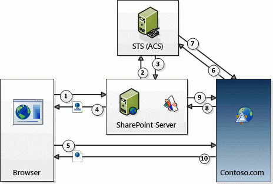

# OAuth-Ablauf mit Kontexttoken für Add-Ins in SharePoint
Hier lernen Sie die OAuth-Authentifizierung und den Autorisierungsablauf für von einem Anbieter gehostete Add-Ins mit niedriger Vertrauensebene in SharePoint kennen.
## Überblick über OAuth und in SharePoint von einem Anbieter gehosteten SharePoint-Add-Ins

In SharePoint **umfasst die OAuth-Authentifizierung und der Autorisierungsablauf eines von einem Anbieter gehosteten Add-Ins mit niedriger Vertrauensebene zur Laufzeit eine Reihe von Interaktionen zwischen dem Add-In, SharePoint, dem Autorisierungsserver und dem Browser**. In diesem Szenario ist Microsoft Azure Access Control Service (ACS) der Autorisierungsserver.

Mit einem von einem Anbieter gehosteten Add-In erhalten Sie Remotewebanwendungen oder Dienste, die von SharePoint separat und nicht Teil der SharePoint-Farm oder des SharePoint Online-Mandanten sind. Diese können in der Cloud oder auf einem lokalen Server gehostet werden. In diesem Artikel wird die Remotekomponente Contoso.com genannt.

> **HINWEIS**
> Die Remotekomponente kann auch Ereignisempfänger hosten, die auf Ereignisse reagieren, die bei SharePoint-Elementen wie Listen oder Listenelementen auftreten. Beispiele für Remoteereignisse, auf die Contoso.com möglicherweise reagieren sollte, sind Listenereignisse, z. B. das Hinzufügen oder Entfernen eines Listenelements, oder Webereignisse, wie das Hinzufügen oder Entfernen einer Website. Weitere Informationen zum Erstellen von Remoteereignisempfängern finden Sie unter  [Erstellen eines Remoteereignisempfängers in Add-Ins für SharePoint](create-a-remote-event-receiver-in-sharepoint-add-ins.md). 

Contoso.com verwendet das SharePoint-Clientobjektmodell (CSOM) oder die SharePoint-REST-APIs, um Aufrufe an SharePoint durchzuführen. Die Contoso.com-Anwendung verwendet einen OAuth-Ablauf mit Tokenübergabe für die Authentifizierung bei SharePoint. **SharePoint und Contoso.com vertrauen einander nicht, aber beide vertrauen ACS** und akzeptieren von ACS ausgestellte Token. An dem Ablauf sind drei Token beteiligt: SharePoint lässt ACS ein Kontexttoken erstellen, das SharePoint an Constoso.com weiterleitet. Contoso.com validiert, dass das Kontexttoken von ACS stammt und vertraut ihm deshalb. Contoso.com extrahiert dann ein Aktualisierungstoken aus dem Kontexttoken und verwendet es, um ein Zugriffstoken direkt von ACS zu erhalten. Das Zugrifftoken wird in alle Anforderungen an SharePoint eingeschlossen. SharePoint validiert, dass das Zugriffstoken von ACS ausgestellt wurde und reagiert deshalb auf die Anforderungen von Contoso.com.

 **Sie stellen den Code für die Tokenverarbeitung** in der Remotekomponente bereit. (Wenn Ihre Remotekomponente allerdings auf .NET gehostet ist, stellen die Microsoft Office-Entwicklertools für Visual Studio Beispielcode bereit, der den größten Teil der Arbeit für Sie übernimmt.) Ausführliche Informationen zum Code für die Tokenverarbeitung finden Sie unter [Handhabung von Sicherheitstoken in vom Anbieter gehosteten Add-Ins für SharePoint mit niedriger Vertrauensebene](handle-security-tokens-in-provider-hosted-low-trust-sharepoint-add-ins.md).

## Erfüllen der Voraussetzungen für die Verwendung des Ablaufs

Sie müssen einige vorbereitende Schritte unternehmen, bevor eine SharePoint-Add-In den Kontexttokenablauf verwenden kann. 

- Wenn die SharePoint-Add-In in einer lokalen SharePoint-Farm installiert werden soll, gibt es Setupanforderungen, die nicht gelten, wenn sie nur in SharePoint Online installiert wird:

  - Die **Farm muss so konfiguriert werden**, dass sie Add-Ins unterstützt. (Dies ist tatsächlich eine Anforderung für die Installation beliebiger SharePoint-Add-Ins in der Farm, selbst wenn sie den Kontexttokenablauf nicht verwenden.) Weitere Informationen finden Sie unter [Konfigurieren einer Umgebung für Add-Ins für SharePoint](http://technet.microsoft.com/de-de/library/fp161236%28v=office.15%29.aspx).

  - Der **Kunde**, der das Add-In installiert **, muss über ein Office 365-Konto verfügen**. Dies ist erforderlich, um Zugriff auf ACS zu erhalten. Der Kunde muss sein Konto nicht für andere Zwecke nutzen.

  - Die Farm muss für die Verwendung der Vertrauensstellung konfiguriert werden, die Office 365 mit ACS hat. Dies kann einfach über Windows PowerShell-Skripts durchgeführt werden. Ausführliche Informationen finden Sie unter  [Verwenden einer Office 365 SharePoint-Website, um vom Anbieter gehostete Add-Ins auf einer lokalen SharePoint-Website zu autorisieren](use-an-office-365-sharepoint-site-to-authorize-provider-hosted-add-ins-on-an-on.md).

- Unabhängig davon, ob das Add-In in SharePoint Online oder einer lokalen SharePoint-Farm installiert wird, muss die **SharePoint-Add-In bei ACS registriert werden**. Ausführliche Informationen zur entsprechenden Vorgehensweise finden Sie unter [Registrieren von SharePoint-Add-Ins 2013](register-sharepoint-add-ins-2013.md). Unter anderem stellt die App ACS ihre Client-ID und den geheimen Clientschlüssel als Teil der Registrierung bereit.

## Die einzelnen Schritte des Kontexttokenablaufs

Der OAuth-Authentifizierungs- und Autorisierungsablauf für ein von einem Anbieter gehostetes SharePoint-Add-In ist in der folgenden Abbildung dargestellt.

**OAuth-Kontexttokenablauf**

Die folgenden Schritte entsprechen den Nummern in der Abbildung:

1. Ein Benutzer startet die SharePoint-Add-In von SharePoint. Die genaue Vorgehensweise wird vom Design des Add-Ins bestimmt:

  - Wenn das Add-In so entworfen ist, dass es in der Remotewebanwendung (unter Contoso.com) in einem Add-In-Webpart part (der im Wesentlichen ein Wrapper um einen **IFRAME** ist) angezeigt werden soll, bedeutet das Starten des Add-Ins einfach, zu einer SharePoint-Seite zu navigieren, die das Add-In-Webpart enthält. (Wenn der Benutzer noch nicht angemeldet ist, fordert SharePoint den Benutzer auf, sich anzumelden.) SharePoint verarbeitet die Seite und erkennt, dass eine Komponente der Contoso.com-Anwendung auf der Seite vorhanden ist. (Ausführliche Informationen zu Add-In-Webparts finden Sie unter [Erstellen von Add-In-Webparts zur Installation mit Ihrem SharePoint-Add-In](create-add-in-parts-to-install-with-your-sharepoint-add-in.md).)

  - Wenn das Add-In so entworfen ist, dass es eine volle Seite im Browser verwendet, startet der Benutzer das Add-In, indem er auf der SharePoint-Website auf die entsprechende Add-In-Kachel auf der Seite **Site Contents** klickt. (Eine Variante dieser Vorgehensweise ist, wenn die App ein benutzerdefiniertes Menü- oder Menübandelement umfasst, mit dem die Remotekomponente gestartet wird.)

2. Unabhängig davon, wie das Add-In gestartet wird, muss SharePoint ein Kontexttoken abrufen, das an die Contoso.com-Anwendung gesendet werden kann. Deshalb fordert SharePoint bei ACS an, ein Kontexttoken zu erstellen, das die Informationen zum SharePoint-Kontext enthält, einschließlich des aktuellen Benutzers, der URL der Remoteanwendung und anderer Informationen. Das Kontexttoken enthält auch ein verschlüsseltes Aktualisierungstoken.

3. ACS signiert das Kontexttoken mit einem Algorithmus, der den geheimen Contoso.com-Add-In-Schlüssel verwendet, und gibt es an SharePoint zurück. Nur ACS und das Contoso.com-Add-In kennen den geheimen Schlüssel.

4. Wenn die Contoso.com-Anwendung in einem Add-In-Webpart angezeigt wird, gibt SharePoint die Seite wieder, auf der das Add-In-Webpart gehostet ist, und fügt das Kontexttoken zur URL hinzu, die der **IFRAME** im Add-In-Webpart aufruft, um seine Inhalte abzurufen. Wenn die Contoso.com-Anwendung eine volle Seite ist, leitet SharePoint den Browser zu Constoso.com um und fügt das Kontexttoken als Teil der Umleitungsantwort hinzu.

5. Das Kontexttoken wird in die Browseranforderung eingefügt, die an den Contoso.com-Server gesendet wird.

6. Der Contoso.com-Server erhält das Kontexttoken und validiert die Signatur, da er den geheimen Clientschlüssel kennt. Damit wird Contoso.com versichert, dass das Token von ACS ausgestellt wurde und nicht von einem Betrüger, der sich als SharePoint ausgibt. Contoso.com extrahiert das Aktualisierungstoken aus dem Kontexttoken und sendet es zusammen mit anderen Informationen wie der Client-ID und dem geheimen Clientschlüssel in einer Anforderung für ein Zugriffstoken, das den Zugriff auf SharePoint ermöglicht, an ACS.

7. ACS validiert das Aktualisierungstoken, um sicher zu sein, dass das Token von ACS ausgestellt wurde, und gibt dann ein Zugriffstoken an Contoso.com zurück. Optional kann Contoso.com dieses Zugriffstoken zwischenspeichern, damit ACS nicht bei jedem Zugriff auf SharePoint ein Zugriffstoken ausstellen muss. Standardmäßig sind Zugriffstoken jeweils für einige Stunden auf einmal gültig. (Zum Zeitpunkt, zu dem dieser Artikel geschrieben wurde, lag der Standardablaufzeitraum für von ACS ausgestellte Zugriffstoken für SharePoint bei 12 Stunden, aber das könnte sich ändern.) Jedes Zugriffstoken ist für das Benutzerkonto spezifisch, das in der Originalanforderung für eine Autorisierung angegeben ist, und gewährt nur den Zugriff auf den Dienst (in diesem Fall SharePoint), der in dieser Anforderung angegeben ist. Aktualisierungstoken sind länger gültig (sechs Monate zum Zeitpunkt, als dieser Artikel geschrieben wurde) und können ebenfalls zwischengespeichert werden. Dasselbe Aktualisierungstoken kann also für ein neues Zugriffstoken von ACS eingelöst werden, bis das Aktualisierungstoken selbst abläuft. (Weitere Informationen zum Zwischenspeichern von Token finden Sie unter  [Handhabung von Sicherheitstoken in vom Anbieter gehosteten Add-Ins für SharePoint mit niedriger Vertrauensebene](handle-security-tokens-in-provider-hosted-low-trust-sharepoint-add-ins.md).) Wenn das Aktualisierungstoken abläuft, kann Contoso.com ein neues erhalten, indem ein neues Kontexttoken abgerufen wird. Ausführliche Informationen zur entsprechenden Vorgehensweise finden Sie unter  [Abrufen eines neuen Kontexttokens](handle-security-tokens-in-provider-hosted-low-trust-sharepoint-add-ins.md#GetNewContextToken).

8. Contoso.com verwendet das Zugriffstoken, um einen SharePoint-REST-API-Aufruf oder eine CSOM-Anforderung an SharePoint durchzuführen. Dafür wird das OAuth-Zugriffstoken im HTTP- **Authorization**-Header übergeben. (Beispielcode für das Erstellen des Headers wird in den Office-Entwicklertools für Visual Studio bereitgestellt, wenn Ihre Remotekomponente auf einer .NET-Plattform gehostet wird.

9. SharePoint validiert das Zugriffstoken, damit sichergestellt ist, dass es von ACS ausgestellt wurde. Dann werden die von Contoso.com angeforderten Daten an Contoso.com gesendet oder der von Contoso.com angeforderte CRUD-Vorgang (Erstellen, Lesen, Aktualisieren oder Löschen) durchgeführt.

10. Die Contoso.com-Anwendungsseite wird im Browser (oder im **IFRAME** des Add-In-Webparts) wiedergegeben.

## Weitere Ressourcen

-  [Autorisierung und Authentifizierung für Add-Ins in SharePoint 2013](authorization-and-authentication-of-sharepoint-add-ins.md)

-  [Add-In-Berechtigungen in SharePoint 2013](add-in-permissions-in-sharepoint-2013.md)

-  [Wichtige Aspekte der Architektur und Entwicklungslandschaft von Add-Ins für SharePoint](important-aspects-of-the-sharepoint-add-in-architecture-and-development-landscap.md)

-  [Erste Schritte beim Erstellen von von SharePoint gehosteten SharePoint-Add-Ins](get-started-creating-sharepoint-hosted-sharepoint-add-ins.md)

