# Konvertieren eines automatisch gehosteten Add-Ins für SharePoint in ein vom Anbieter gehostetes Add-In
Erfahren Sie, wie Sie eine automatisch gehostete SharePoint-Add-In in ein vom Anbieter gehostetes Add-In konvertieren.
Mit Microsoft SharePoint 2013 wurde ein neuer Ansatz für die Erweiterung von SharePoint-Websites zusätzlich zum vorherigen Ansatz eingeführt, der auf der Verwendung lösungsbasierter Anpassungen basiert. Dieses neue Erweiterbarkeitsmodell für SharePoint, das als Add-In-Modell bezeichnet wird, ermöglicht Entwicklern die Erstellung von benutzerdefinierten Implementierungen, die an SharePoint-Umgebungen weitergegeben werden können, unabhängig davon, ob diese in einer lokalen SharePoint Online- oder Hybridbereitstellung ausgeführt werden.
  
    
    

Entwickler können zwei verschiedene Arten von Add-Ins für SharePoint entwickeln. Die erste ist ein von SharePoint gehostetes Add-In, das primär im Browser ausgeführt wird. Alle Ressourcen, die diese unterstützen, wie HTML, CSS, Bilder und JavaScript werden von SharePoint gespeichert und bereitgestellt. Die andere Art von Add-Ins gehört zum Cloud Add-In-Modell (CAM), wird hauptsächlich extern von SharePoint auf einem anderen Server ausgeführt und kommuniziert mit SharePoint über das clientseitige Objektmodell (CSOM) und die REST-API. Bei dieser Art von Add-Ins wird eine Identität über das beliebte OAuth 2.0-Protokoll eingerichtet, das von SharePoint 2013 unterstützt wird.
Entwickler könnten Add-Ins über das Add-In-Modell auf zweierlei Weise implementieren: als vom Anbieter gehostetes Add-In oder als automatisch gehostetes Add-In. Automatisch gehostete Add-Ins wurden als Vorschauprogramm bei der Veröffentlichung von SharePoint 2013 eingeführt. Im Mai 2014 kündigte Microsoft jedoch an, dass das Vorschauprogramm beendet und kein Support für das Erstellen von automatisch gehosteten Add-In mehr bereitgestellt wird. Die Ankündigung finden Sie unter  [Aktualisierte Informationen zum Vorschauprogramm für automatisch gehostete Add-Ins](http://blogs.office.com/2014/05/16/update-on-autohosted-apps-preview-program/).
  
    
    

In diesem Artikel werden die Konvertierung und Migration eines automatisch gehosteten Add-Ins zu einem vom Anbieter gehosteten Add-In erläutert. Eine wichtige Voraussetzung ist, dass Entwickler einige spezielle Unterschiede zwischen den zwei Ansätzen verstehen, da dieses Verständnis den Konvertierungsprozess erheblich vereinfacht.
## Voraussetzungen für die Konvertierung eines automatisch gehosteten Add-In in ein vom Anbieter gehostetes Add-In

- Alle  [Voraussetzungen für das Entwickeln von vom Anbieter gehosteten Add-Ins](get-started-creating-provider-hosted-sharepoint-add-ins.md#SP15createselfhostapp_bk_prereq)
    
  
- Azure SDK 2.3, das Sie über  [diese Download Center-Seite](http://azure.microsoft.com/downloads) installieren können.
    
  

### Kernkonzepte, die Sie kennen sollten

Bevor Sie ein automatisch gehostetes Add-In in ein vom Anbieter gehostetes Add-In konvertieren, sollten Sie ein grundlegendes Verständnis für SharePoint-Add-Ins und die Unterschiede zwischen von SharePoint gehosteten, vom Anbieter gehosteten und automatisch gehosteten SharePoint-Add-Ins haben. Mit den Informationen in den in Tabelle 1 aufgeführten Artikeln sollten Sie diese Unterschiede verstehen können.
  
    
    

**Tabelle 1: Kernkonzepte für das Konvertieren eines automatisch gehosteten Add-Ins in ein vom Anbieter gehostetes Add-In**

|**Titel des Artikels**|**Beschreibung**|
|:-----|:-----|
| [SharePoint-Add-Ins](sharepoint-add-ins.md)   |Hier finden Sie Informationen über das neue Add-In-Modell in SharePoint 2013, das es Ihnen ermöglicht, Add-Ins als kompakte, einfach zu verwendende Lösungen für Endbenutzer zu erstellen.    |
| [Wichtige Aspekte der Architektur und Entwicklungslandschaft von Add-Ins für SharePoint](important-aspects-of-the-sharepoint-add-in-architecture-and-development-landscap.md)   |Erfahren Sie mehr über Aspekte der Architektur von SharePoint-Add-Ins und das Modell für SharePoint-Add-Ins, wie z. B. die Hostingoptionen für Add-Ins, Benutzeroberflächenoptionen, das Bereitstellungssystem, das Sicherheitssystem und den Lebenszyklus.    |
| [Auswählen von Mustern für die Entwicklung und das Hosting Ihres Add-Ins für SharePoint](choose-patterns-for-developing-and-hosting-your-sharepoint-add-in.md)   |Hier finden Sie Informationen zu den verschiedenen Möglichkeiten zum Hosten von SharePoint-Add-Ins.    |
| [Hostwebsites, Add-In-Websites und SharePoint-Komponenten in SharePoint 2013](host-webs-add-in-webs-and-sharepoint-components-in-sharepoint-2013.md)   |Hier lernen Sie den Unterschied zwischen Hostwebs und Add-In-Webs kennen. Außerdem erfahren Sie, welche SharePoint 2013-Komponenten eines Add-Ins für SharePoint hinzugefügt werden können, welche für das Hostweb bereitgestellt werden, welche für das Add-In-Web bereitgestellt werden und wie das Add-In-Web in einer isolierten Domäne bereitgestellt wird.    |
   

## Konvertieren des Add-Ins

Beim Konvertieren einer automatisch gehosteten SharePoint-Add-In in ein vom Anbieter gehostetes Add-In müssen zwei oder drei Komponenten geändert werden.
  
    
    

- Das SharePoint-Add-In an sich
    
  
- Die Remotewebanwendung oder -dienste
    
  
- Die Microsoft Azure SQL-Datenbank in dem Add-In, falls vorhanden
    
  
Bei einem automatisch gehosteten SharePoint-Add-In wurden die Azure-Website und die Microsoft Azure SQL-Datenbank bei der Installation automatisch bereitgestellt, dagegen können bei vom Anbieter gehosteten Add-Ins die Remotewebanwendung und andere Dienste in jeder beliebigen Webplattform vorhanden sein. In diesem Artikel wird davon ausgegangen, dass die Remotekomponenten des automatisch gehosteten Add-Ins nach der Konvertierung in ein vom Anbieter gehostetes Add-In als Azure-Dienste vorhanden bleiben.
  
    
    
In den folgenden Abschnitten ist der Prozess der Konvertierung eines automatisch gehosteten Add-Ins in ein vom Anbieter gehosteten Add-In dargestellt. Das verwendete automatisch gehostete Beispiel-Add-In - Customer Manager - ist einfach, damit Sie sich auf die Konvertierungsschritte statt auf das eigentliche Add-In konzentrieren können. Es besteht aus drei Projekten:
  
    
    

- CustomersDb: Ein SQL-Datenbankprojekt, mit dem die erforderliche *.dacpac-Datei generiert wird. Beachten Sie, dass in diesem Projekt kein Schema definiert ist. Es wird einfach verwendet, um eine Datenbank zu erstellen, da das Schema von der ASP.NET-Webanwendung erstellt wird.
    
  
- CustomerManagerAH: Eine automatisch gehostetes SharePoint-Add-In, dessen Konfiguration das ASP.NET-Webanwendungsprojekt und die Azure SQL-Datenebenenanwendung in das resultierende SharePoint-Add-In-Paket einschließt.
    
  
- CustomerManagerAHWeb: Eine ASP.NET-MVC-Webanwendung, die dem Code First-Migrationsansatz von Entity Framework folgt, um das Datenbankschema zu erstellen sowie Lese- und Schreibvorgänge in der Datenbank auszuführen.
    
  
Das Add-In ist eine ASP.NET-MVC-Webanwendung, mit der sowohl die Kunden aus einer Tabelle in einer Microsoft Azure SQL-Datenbank angezeigt als auch neue Kunden hinzugefügt werden können. Mit dieser anonymen Webanwendung kann jede Person Kunden anzeigen oder hinzufügen. Die Visual Studio-Lösung für das automatisch gehostete Add-In und damit verbundene Projekte kann aus dem folgenden öffentlichen Repository heruntergeladen werden:  [Autohosted-Migration-Code-Samples](https://github.com/OfficeDev/Auto-Hosted-Migration-Code-Samples).
  
    
    
Für das Konvertieren eines automatisch gehosteten SharePoint 2013-Add-Ins in ein vom Anbieter gehostetes Add-In sind mehrere Schritte erforderlich, die jeweils in den folgenden Abschnitten dargestellt sind.
  
    
    

1. Bereitstellen der Microsoft Azure SQL-Datenbank
    
  
2. Erstellen der Azure-Website zum Hosten der Remotewebanwendung
    
  
3. Registrieren des Add-Ins bei Ihrer SharePoint-Website
    
  
4. Aktualisieren und Bereitstellen der Azure-Website für die Remotewebanwendung
    
  
5. Aktualisieren und Bereitstellen des vom Anbieter gehosteten SharePoint-Add-Ins
    
  

### Bereitstellen der Azure SQL-Datenbank

Der erste Schritt beim Konvertieren des automatisch gehosteten Add-Ins in ein vom Anbieter gehostetes Add-In besteht darin, die Microsoft Azure SQL-Datenbank bereitzustellen, auf der die ASP.NET-Webanwendung basiert. Sie können eine Microsoft Azure SQL-Datenbank mit verschiedenen Methoden erstellen, von denen einige auf der Microsoft Azure-Dokumentationswebsite dokumentiert sind:  [So stellen Sie eine Datenbank für Azure bereit](http://azure.microsoft.com/documentation/articles/sql-database-deploy/).
  
    
    
Bei dem in den folgenden Schritten dargestellten Ansatz wird das Datenebenenanwendungs-Bereitstellungsmodell verwendet, da die Datenbank auf diese Weise in einem automatisch gehosteten SharePoint-Add-In bereitgestellt wird. Dabei wird ein Datenebenenanwendungspaket (*.dacpac) erstellt und für die Erstellung der Datenbank verwendet.
  
    
    

#### Erstellen und Bereitstellen der Azure SQL-Datenbank

Öffnen Sie zunächst die automatisch gehostete Lösung in Visual Studio. Klicken Sie mit der rechten Maustaste auf das Datenbankprojekt **CustomerDb**, und wählen Sie **Erstellen** aus. Damit wird die Datei CustomerDb.dacpac im Ordner `[..]\\bin\\[debug | release]` erstellt.
  
    
    
Der nächste Schritt ist die Erstellung einer neuen Microsoft Azure SQL-Datenbank. Melden Sie sich beim **Azure-Verwaltungsportal** (https://manage.windowsazure.com) an, und wählen Sie nach dem Laden des Dashboards den Link SQL-DATENBANKEN am Seitenrand aus:
  
    
    

**Dashboard für die Azure SQL-Datenbank im Azure-Verwaltungsportal**

  
    
    

  
    
    
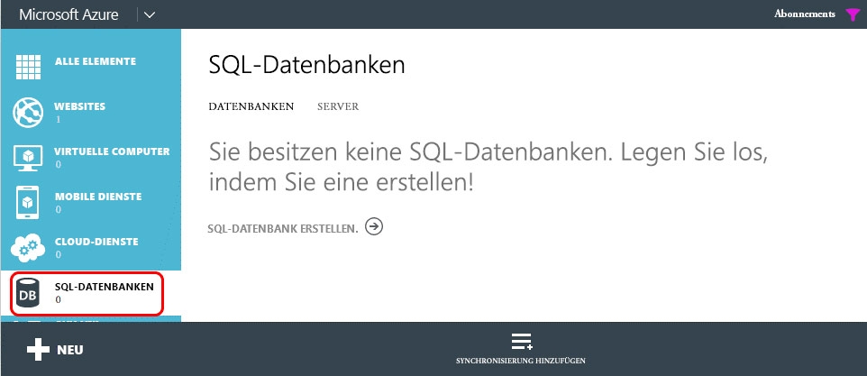
  
    
    
Klicken Sie im obersten Navigationsbereich auf den Link **SERVER**, und klicken Sie dann in der Fußzeile auf die Schaltfläche **HINZUFÜGEN**, wie in der folgenden Abbildung gezeigt:
  
    
    

**Dashboard für die Azure SQL-Datenbank im Azure-Verwaltungsportal**

  
    
    

  
    
    
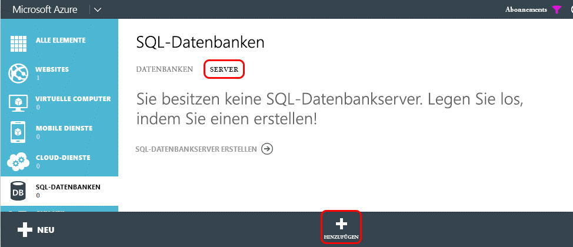
  
    
    
Wählen Sie im daraufhin angezeigten Dialogfeld **SERVER ERSTELLEN** das Azure- **ABONNEMENT**, den **ANMELDENAMEN** und das **KENNWORT** für den Benutzer, der Rechte auf dem Server haben wird, und dieselbe **REGION** aus, die beim Erstellen der Azure-Website zuvor verwendet wurde. Notieren Sie den Anmeldenamen und das Kennwort, da diese in einem späteren Schritt benötigt werden.
  
    
    

**Erstellen einer Azure SQL-Datenbank im Azure-Verwaltungsportal**

  
    
    

  
    
    
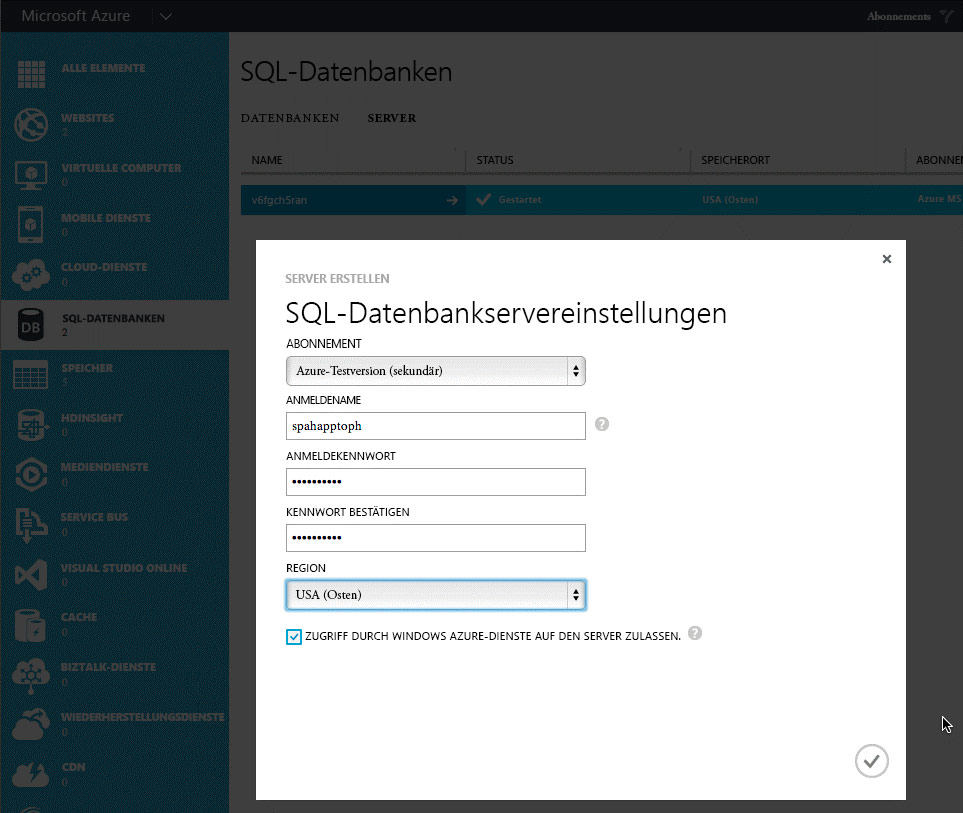
  
    
    
Nachdem das Formular ausgefüllt ist, klicken Sie auf das **Häkchensymbol** unten rechts, um die Datenbank zu erstellen. Während jetzt der Server erstellt wird, können als einzige Ressource nur andere Azure-Dienste darauf zugreifen. Notieren Sie den Namen der Microsoft Azure SQL-Datenbank, da dieser in einem späteren Schritt benötigt wird.
  
    
    
Zum Herstellen einer Verbindung mit der Microsoft Azure SQL-Datenbank und zum Bereitstellen der Datenbank muss eine Firewallregel erstellt werden, mit der der Datenverkehr von dem Computer zugelassen wird, der die Datenbank bereitstellt. Andernfalls werden Verbindungen mit der Microsoft Azure SQL-Datenbank mit Fehlern wie dem in der folgenden Abbildung gezeigten verweigert:
  
    
    

**Fehler beim Herstellen einer Verbindung mit einer Azure SQL-Datenbank**

  
    
    

  
    
    
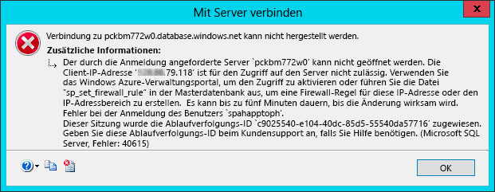
  
    
    
Zum Erstellen einer Firewallregel wählen Sie im **Azure-Verwaltungsportal** die zuvor erstellte Microsoft Azure SQL-Datenbank aus und klicken dann im obersten Navigationsbereich auf den Link **KONFIGURIEREN**. Unter dem Abschnitt **Zugelassene IP-Adressen** wird derzeit Ihre IP-Adresse angezeigt, wie in der folgenden Abbildung dargestellt. Klicken Sie auf **ZU DEN ZUGELASSENEN IP-ADRESSEN HINZUFÜGEN**, um eine Firewallregel hinzuzufügen. Damit werden Verbindungen mit der Microsoft Azure SQL-Datenbank und die Bereitstellung der Datenbank zugelassen. Achten Sie darauf, in der Fußzeile auf die Schaltfläche **Speichern** zu klicken.
  
    
    

**Erstellen einer Firewallregel für eine Azure SQL-Datenbank im Azure-Verwaltungsportal**

  
    
    

  
    
    
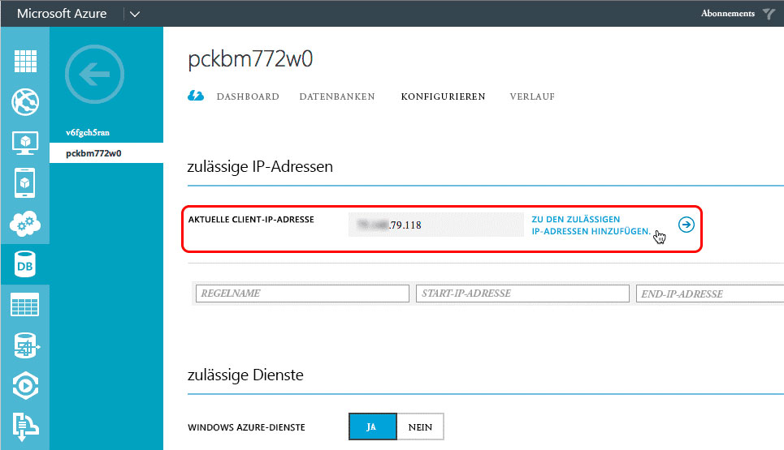
  
    
    
Der nächste Schritt ist die Bereitstellung der Datenbank und kann über das Azure SDK 2.3 in Visual Studio durchgeführt werden. Installieren Sie das SDK über  [diese Download Center-Seite](http://azure.microsoft.com/downloads). Öffnen Sie in Visual Studio das Toolfenster **SQL Server-Objekt-Explorer**, klicken Sie mit der rechten Maustaste auf den Knoten **SQL Server**, und wählen Sie **SQL Server hinzufügen** aus:
  
    
    

**Hinzufügen einer Azure SQL-Datenbank im Server-Explorer**

  
    
    

  
    
    

  
    
    
Geben Sie im Dialogfeld **Mit Server verbinden** den **Servernamen** ein, legen Sie die **Authentifizierung** auf **SQL Server-Authentifizierung** fest, und geben Sie denselben **Anmeldenamen** und dasselbe **Kennwort** ein, die beim Erstellen der Microsoft Azure SQL-Datenbank definiert wurden. Der Servername sollte der vollqualifizierte Name des Servers sein, in diesem Fall `[server-name].database.windows.net`, wie in der folgenden Abbildung gezeigt:
  
    
    

**Herstellen einer Verbindung mit einer Azure SQL-Datenbank in Visual Studio**

  
    
    

  
    
    
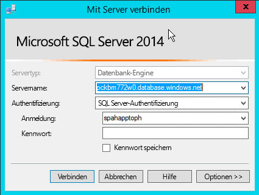
  
    
    
Erweitern Sie nach dem Herstellen der Verbindung mit Microsoft Azure SQL-Datenbank den Knoten für den neu hinzugefügten Server, klicken Sie mit der rechten Maustaste auf den Knoten **Datenbanken**, und wählen Sie **Datenebenenanwendung veröffentlichen** aus, um den Assistent für Veröffentlichungen aufzurufen.
  
    
    
Klicken Sie im Abschnitt **Quell-Datenebenenanwendung (.dacpac)** auf die Schaltfläche **Durchsuchen**, um nach der *.dacpac-Datei zu suchen, die beim Erstellen des Datenbankprojekts in einem vorherigen Schritt generiert wurde. Vergewissern Sie sich, dass der **Datenbankname** aufCustomerDb festgelegt ist, und klicken Sie dann auf **Veröffentlichen**, um die CustomerDb in der Microsoft Azure SQL-Datenbank zu veröffentlichen.
  
    
    

**Veröffentlichen einer Datenebenenanwendung an eine Azure SQL-Datenbank mithilfe von Visual Studio**

  
    
    

  
    
    
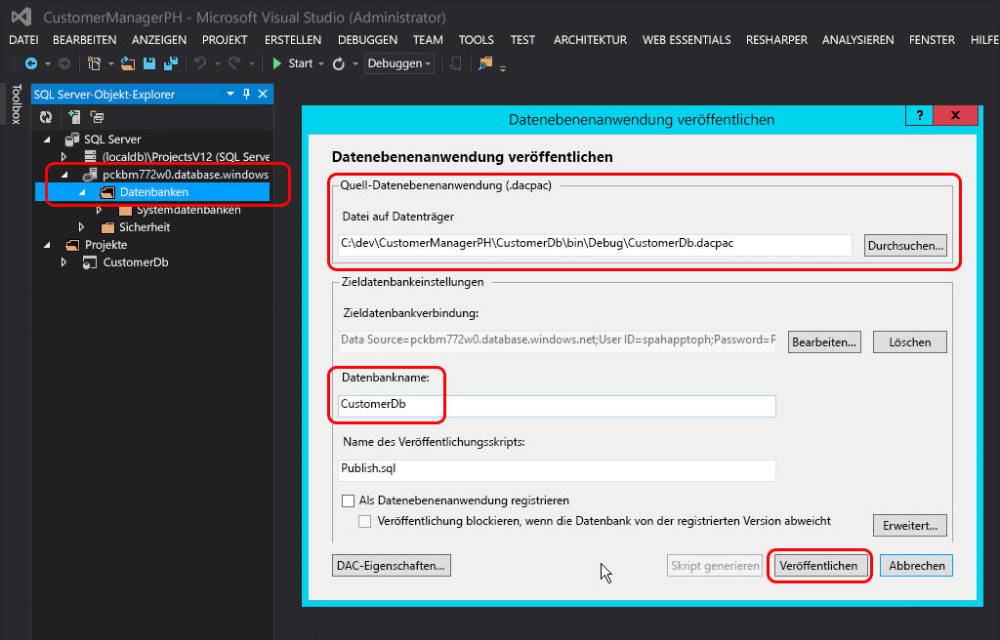
  
    
    
Aktualisieren Sie das Visual Studio-Toolfenster **SQL Server-Objekt-Explorer**, um zu sehen, dass CustomerDb unter dem Knoten **Datenbanken** aufgelistet ist.
  
    
    

    
> **HINWEIS**
>  Abhängig davon, wie die Datenbank für das automatisch gehostete Add-In erstellt wurde, sind möglicherweise einige weitere Schritte erforderlich, um es für Azure bereitzustellen. Zusätzliche Anweisungen finden Sie in den folgenden Artikeln in MSDN:
>  [Converting between Data-tier Application Projects and Database Projects](http://msdn.microsoft.com/library/40b51f5a-d52c-44ac-8f84-037a0917af33.aspx)
>  [Creating &amp; Managing Data-Tier Application](http://msdn.microsoft.com/library/18907b6c-7678-4182-9304-fe56fdb9f0bd.aspx)
  
    
    

#### Aktionen nach der Bereitstellung

Nachdem die Microsoft Azure SQL-Datenbank erstellt wurde, erstellen Sie eine Kopie der Verbindungszeichenfolge, die für die Herstellung einer Verbindung mit der Datenbank verwendet wird. Dies kann auf zweierlei Weise erfolgen. Erstens können Sie sich beim **Azure-Verwaltungsportal** (https://manage.windowsazure.com) anmelden und zu der im letzten Schritt erstellten Microsoft Azure SQL-Datenbank navigieren: CustomerDb. Klicken Sie auf der Seite **DASHBOARD** für die Datenbank auf den Link **Verbindungszeichenfolgen anzeigen**, um eine Liste der Verbindungszeichenfolgen anzuzeigen. Erstellen Sie eine Kopie der Verbindungszeichenfolge **ADO.NET** zur späteren Verwendung.
  
    
    

**Abrufen einer Azure SQL-Datenbankverbindungszeichenfolge aus dem Azure-Verwaltungsportal**

  
    
    

  
    
    

  
    
    
Zweitens können Sie die Verbindungszeichenfolge innerhalb von Visual Studio abrufen, vorausgesetzt, dass das Azure SDK v2.3 installiert ist. Wählen Sie im Toolfenster **SQL Server-Objekt-Explorer** in Visual Studio die Datenbank **CustomerDb** aus, und werfen Sie dann einen Blick in das Toolfenster **Eigenschaften**, in dem die Verbindungszeichenfolge angezeigt wird. Dies ist derselbe Wert wie im **Azure-Verwaltungsportal** oben.
  
    
    

**Abrufen von Azure SQL-Datenbankverbindungszeichenfolgen in Visual Studio über das Azure SDK**

  
    
    

  
    
    
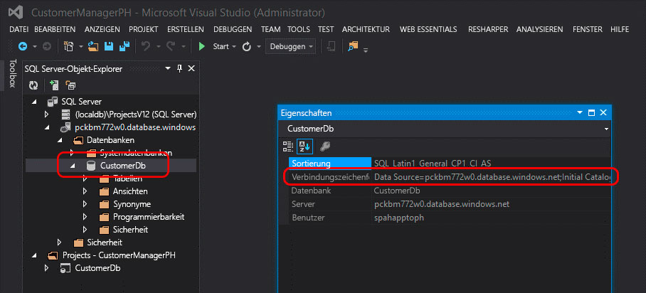
  
    
    

  
    
    

  
    
    

### Erstellen einer Azure-Website

Der nächste Schritt ist die Erstellung einer neuen Azure-Website, auf der sich die Remotewebanwendung für das vom Anbieter gehostete Add-In befindet. Dieser Schritt muss zuerst durchgeführt werden, weil die URL der Remotewebanwendung vor der Registrierung des Add-Ins benötigt wird. Die Registrierung des Add-Ins in SharePoint sollte jedoch vor der Bereitstellung der Dateien für die ASP.NET-Webanwendung erfolgen, da es zwei Ausgaben aus dem Registrierungsvorgang gibt (die Client-ID und den geheimen Clientschlüssel), die vor der Bereitstellung der ASP.NET-Webanwendungsdateien erforderlich sind.
  
    
    
Melden Sie sich zum Erstellen einer neuen Azure-Website zuerst beim **Azure-Verwaltungsportal** (https://manage.windowsazure.com) an. Wenn das Dashboard geladen ist, klicken Sie auf den Navigationslink **WEBSITES** am linken Rand und dann auf die Schaltfläche **NEU** in der Fußzeile, wie in der folgenden Abbildung gezeigt:
  
    
    

**Azure-Website-Dashboard im Azure-Verwaltungsportal**

  
    
    

  
    
    
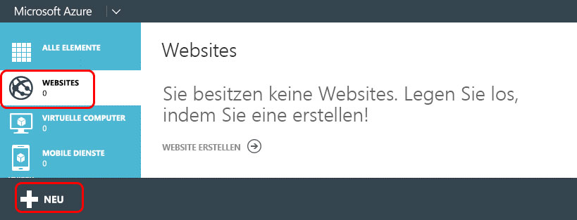
  
    
    
Wählen Sie danach im Assistenten zum Erstellen einer Website **BERECHNEN**, **WEBSITE**, **SCHNELLERFASSUNG** aus, und geben Sie eine **URL** und einen **WEBHOSTINGPLAN** an. Geben Sie schließlich die **REGION** an, in der die Website erstellt werden soll. Merken Sie sich unbedingt die Region, da diese Region für die später zu erstellende Microsoft Azure SQL-Datenbank verwendet werden muss. Wenn noch kein Webhostingplan vorhanden oder ein neuer erwünscht ist, wählen Sie darüber hinaus die Option **Neuen Webhostingplan erstellen** aus. In der folgenden Abbildung ist ein Beispiel gezeigt:
  
    
    

**Erstellen einer Azure-Website im Azure-Verwaltungsportal**

  
    
    

  
    
    
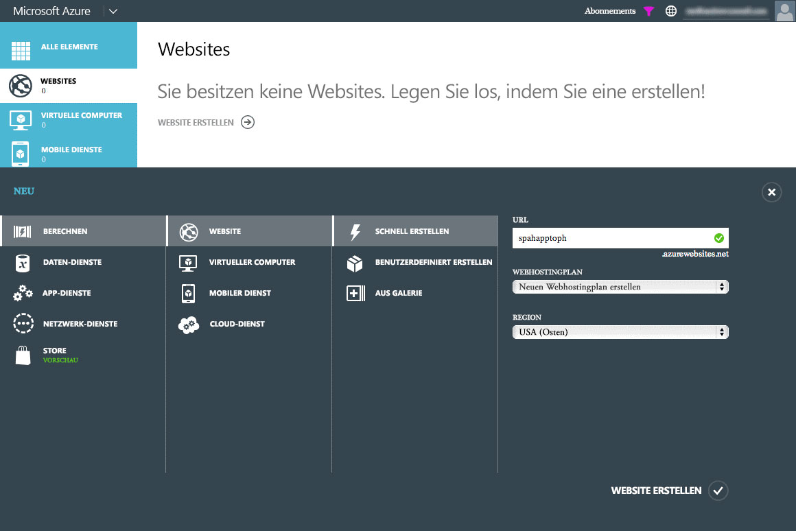
  
    
    
Notieren Sie nach dem Erstellen der Azure-Website die URL, die für die Website verwendet wird. In den Abbildungen oben wird die Website  `http://spahapptoph.azurewebsites.net` erstellt.
  
    
    

### Registrieren eines neuen Add-Ins

Alle über das Add-In-Modell erstellten SharePoint-Add-Ins müssen bei der hostenden SharePoint-Farm oder dem hostenden Mandanten registriert werden, um eine Vertrauensstellung zwischen SharePoint und der Remotewebanwendung herzustellen. Dafür muss ein neuer Add-In-Prinzipal bei SharePoint registriert werden, in dem die folgenden Werte angegeben sind:
  
    
    

- **Client-ID**: die Add-In-ID
    
  
- **Geheimer Clientschlüssel**: das Add-In-Kennwort
    
  
- **Titel**: der Name des Add-Ins
    
  
- **Add-In-Domäne**: die Domäne der obersten Ebene der Remotewebanwendung
    
  
Wenn ein automatisch gehostetes Add-In in SharePoint Online installiert wird, erstellt Office 365 automatisch den Add-In-Prinzipal. Office 365 kennt die URL der Remotewebanwendung, da die Website automatisch erstellt wird. Außerdem fügt Office 365 die Client-ID und den geheimen Clientschlüssel zur web.config-Datei der Remotewebanwendung hinzu. Eine von Microsoft bereitgestellte Klasse (in der Datei TokenHelper.cs oder .vb) sucht in dieser Datei nach diesen Angaben, wenn Anforderungen validiert und mit SharePoint authentifiziert werden.
  
    
    
In einem vom Anbieter gehosteten Add-In muss der Entwickler das Add-In jedoch manuell registrieren und die web.config-Datei im ASP.NET-Webprojekt manuell aktualisieren.
  
    
    
Zum Registrieren eines neuen Add-Ins navigieren Sie zur Add-In-Registrierungsseite der SharePoint-Website, auf der das Add-In installiert wird. Diese Seite finden Sie unter  `http://[SharePoint-site-url]/_layouts/15/appregnew.aspx`. Legen Sie auf der Add-In-Registrierungsseite die Option **Add-In-Typ** auf **Ein auf einem Webserver ausgeführtes Add-In** fest, und klicken Sie auf die zwei Schaltflächen **Generieren**, um eine neue **Client-ID** und den **geheimen Clientschlüssel** zu erstellen. Geben Sie den Namen des Add-Ins in das Feld **Titel** und die URL der im vorherigen Schritt erstellten Ziel-Azure-Website in das Feld **Add-In-Domäne** ein. Klicken Sie abschließend auf die Schaltfläche **Erstellen**.
  
    
    
Nachdem das Add-In registriert wurde, zeigt SharePoint eine Zusammenfassung der Informationen an, die im Formular zum Erstellen der Registrierung verwendet wurden. Es ist sehr wichtig, diese Informationen zur sicheren Aufbewahrung zu kopieren, insbesondere die Client-ID und den geheimen Clientschlüssel, da diese in einem späteren Schritt benötigt werden.
  
    
    

### Remotewebanwendung/Azure-Website - Änderungen der Konfiguration

Der nächste Schritt besteht darin, die Remotewebanwendung neu zu konfigurieren, damit sie als ein vom Anbieter gehostetes statt ein automatisch gehostetes Add-In bereitgestellt werden kann. Es gibt zahlreiche Methoden für die Bereitstellung einer ASP.NET-Website an eine Azure-Website, darunter die direkte Bereitstellung von Visual Studio, die automatische Bereitstellung über eine Quellcodeverwaltung wie Visual Studio Online, die Bereitstellung über GitHub oder sogar die bewährte FTP-Option. In diesem Artikel wird Visual Studio verwendet. Bevor die Webanwendung jedoch bereitgestellt werden kann, sind einige Aktualisierungen erforderlich, damit sie mit dem vom Anbieter gehosteten Add-In verwendet werden kann.
  
    
    

#### Aktualisieren des Remote-Webanwendungsprojekts

Die wichtigste Änderung in der ASP.NET-MVC-Webanwendung findet in der web.config-Datei statt. In dieser Datei finden Sie drei Einstellungen im Knoten **<appSettings>**: **ClientId**, **ClientSecret** und **SqlAzureConnectionString**. Die ersten zwei werden von den von Microsoft bereitgestellten Klassen in TokenHelper.cs oder .vb verwendet, um die Authentifizierung und Kommunikation mit SharePoint von der Remotewebanwendung zu erleichtern. Letztere,  `SqlAzureConnectionString`, wird von dem Add-In verwendet, um die Verbindung mit der Microsoft Azure SQL-Datenbank herzustellen.
  
    
    
In einem automatisch gehosteten SharePoint-Add-In füllt Office 365 die Werte für diese Einstellungen aus, wenn die Azure-Website und die Microsoft Azure SQL-Datenbank bei der Installation des Add-Ins erstellt werden. In einem vom Anbieter gehosteten Add-In müssen diese Werte jedoch manuell festgelegt werden, bevor das Add-In bereitgestellt wird.
  
    
    
Ein Option besteht darin, die Werte für die drei Einstellungen aus den Schritten oben zu kopieren und einzufügen, der Nachteil bei diesem Ansatz ist jedoch, dass die web.config-Datei, wenn die Werte jemals geändert werden müssen, manuell aktualisiert und erneut an die Azure-Website bereitgestellt werden muss.
  
    
    
Eine andere Option besteht darin, diese Einstellungen einfach zu löschen (die Einstellungsschlüssel beizubehalten und nur das Attribut **value=""** auf eine leere Zeichenfolge festzulegen) und sie stattdessen in den Azure-Website-Einstellungen für das **Verwaltungsportal** zu definieren. Dieser Ansatz bedeutet, dass die Einstellungen geändert werden können, ohne die Codebasis zu aktualisieren.
  
    
    
Melden Sie sich dafür beim **Azure-Verwaltungsportal** (https://manage.windowsazure.com) an, und navigieren Sie zu der in den vorherigen Schritten erstellten Azure-Website. Klicken Sie auf der Azure-Website-Dashboard-Seite im obersten Navigationsmenü auf **KONFIGURIEREN**, und blättern Sie dann zum Abschnitt **Add-In-Einstellungen** herunter. Fügen Sie drei neue Add-In-Einstellungen hinzu, indem Sie dieselben Einstellungsnamen wie in der web.config-Datei verwenden. Benutzen Sie die in den vorherigen Schritten ermittelten Werte für ClientId, ClientSecret und SqlAzureConnectionString.
  
    
    
Vergewissern Sie sich, dass die Microsoft Azure SQL-Datenbank-Verbindungszeichenfolge korrekt und gültig ist, denn wenn die Verbindungszeichenfolge über das **Azure-Verwaltungsportal** und Visual Studio verfügbar gemacht wird, wird das Kennwortattribut durch eine Maske ersetzt. Das maskierte Kennwort in der Verbindungszeichenfolge sollte in das korrekte Kennwort geändert werden, das beim Erstellen der Anmeldung für die Microsoft Azure SQL-Datenbank definiert wurde.
  
    
    

#### Bereitstellen der Remotewebanwendung an die Azure-Website

Jetzt müssen die ASP.NET-MVC-Webanwendungsdateien an die Azure-Website als Remotewebanwendung bereitgestellt werden. Klicken Sie in Visual Studio mit der rechten Maustaste auf das Webprojekt, und wählen Sie **Veröffentlichen** aus. Damit wird das Dialogfeld des Assistenten **Web veröffentlichen** angezeigt. Wählen Sie in diesem Dialogfeld die Option **Windows Azure-Websites** aus, und klicken Sie auf **Veröffentlichen**.
  
    
    

**Das Dialogfeld „Web veröffentlichen" in Visual Studio**

  
    
    

  
    
    
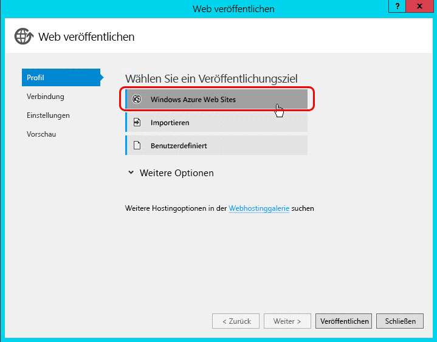
  
    
    
Wählen Sie im nächsten Schritt den Namen der Azure-Website aus, die in einem vorherigen Schritt erstellt wurde, wie in der folgenden Abbildung gezeigt. Klicken Sie auf **OK**, und vergewissern Sie sich, dass die URL der Website HTTPS enthält.
  
    
    

**Veröffentlichen der ASP.NET-Webanwendung an eine vorhandene Azure-Website**

  
    
    

  
    
    
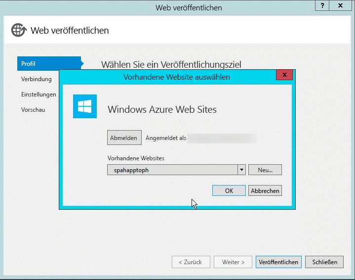
  
    
    
Klicken Sie im letzten Schritt auf die Schaltfläche **Verbindung überprüfen**, um sicherzustellen, dass die Einstellungen und die Verbindung ordnungsgemäß funktionieren, und klicken Sie abschließend auf **Veröffentlichen**. Damit wird die Bereitstellung der ASP.NET-Webanwendung an die Azure-Website durch Visual Studio ausgelöst.
  
    
    
Nach der Bereitstellung der Website startet Visual Studio den Standard-Debugging-Browser und navigiert zur Azure-Website. Die Website wird jedoch mit einem Fehler wiedergegeben. Der Grund ist, dass die ASP.NET-MVC-Controller mit einem Attribut (insbesondere  `SharePointContextFilter`) ausgestattet sind, das von SharePoint erwartet, dass bestimmte Werte an den Controller im Header einer HTTP POST-Anforderung gesendet werden, der Browser aber standardmäßig eine HTTP GET-Anforderung startet, deshalb wird dieser Fehler erwartet.
  
    
    

    
> **HINWEIS**
> Zusätzliche Optionen für das Bereitstellen von ASP.NET-Webanwendungen an eine Azure-Website finden Sie in der Azure-Dokumentation:  [So stellen Sie eine Microsoft Azure-Website bereit](http://azure.microsoft.com/documentation/articles/web-sites-deploy). 
  
    
    

#### Aktionen nach der Bereitstellung

Der nächste Schritt besteht darin, die URL der Website zu kopieren.
  
    
    

#### Benutzerdefinierte Domänen und SSL-Zertifikate für Azure-Websites

Für alle Azure-Websites wird die folgende Benennungskonvention verwendet:  `http[s]://[site-name].azurewebsites.net`. Microsoft hat allen Websites unter der  `*.azurewebsites.net`-Domäne ein Platzhalter-SSL-Zertifikat hinzugefügt, aber Kunden können auch beliebig eine benutzerdefinierte Domäne mit ihrer Azure-Website verbinden oder eigene SSL-Zertifikate für diese benutzerdefinierten Domänen verwenden.
  
    
    
Informationen zum Verwenden benutzerdefinierter Domänen finden Sie in der Azure-Dokumentation:  [Konfigurieren eines benutzerdefinierten Domänennamens für eine Microsoft Azure-Website](http://azure.microsoft.com/documentation/articles/web-sites-custom-domain-name). Informationen zum Hinzufügen eines benutzerdefinierten SSL-Zertifikats für Ihren benutzerdefinierten Domänennamen finden Sie in der Azure-Dokumentation:  [Aktivieren von HTTPS für eine Microsoft Azure-Website](http://azure.microsoft.com/documentation/articles/web-sites-configure-ssl-certificate).
  
    
    

### Erneutes Konfigurieren des SharePoint-Add-In-Projekts

Der letzte Schritt besteht in der erneuten Konfiguration des SharePoint-Add-In-Projekts. Bei dem Visual Studio-Projekt für das SharePoint-Add-In wurde der Add-In-Typ als automatisch gehostet konfiguriert. Ändern Sie dies zunächst von automatisch gehostet in vom Anbieter gehostet, indem Sie die Datei "AppManifest.xml" im SharePoint-Add-In-Projekt öffnen und die Option **Hosting-Typ** von **Automatisch gehostet** in **Vom Anbieter gehostet** ändern.
  
    
    
Legen Sie darüber hinaus die **Startseite** des Add-Ins so fest, dass sie auf die URL der Startseite der Remotewebanwendung verweist, die der URL der Azure-Website entspricht. Achten Sie darauf, dass Sie die Abfragezeichenfolge{StandardTokens} einfügen, falls sie noch nicht vorhanden ist. Damit wird sichergestellt, dass SharePoint der URL die Kernabfrage-Zeichenfolgetoken hinzufügt, wenn die Remotewebanwendung geöffnet wird.
  
    
    
Entfernen Sie dann die Referenz im SharePoint-Add-In-Projekt zur ASP.NET-MVC-Webanwendung, indem Sie das SharePoint-Add-In-Projekt im **Projektmappen-Explorer** von Visual Studio auswählen und im Toolfenster **Eigenschaften** die Eigenschaft **Webprojekt** auf **(Keine)** festlegen, wie in Abbildung 20 gezeigt:
  
    
    

**Entfernen der Remotewebanwendung aus dem SharePoint-Add-In-Paket**

  
    
    

  
    
    
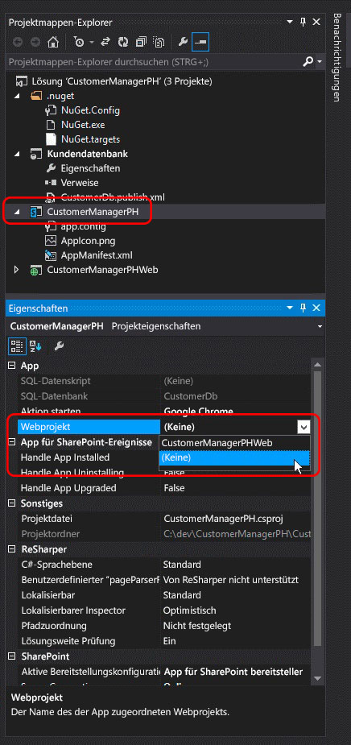
  
    
    
Im letzten Schritt ist eine manuelle Aktualisierung der Datei AppManifest.xml erforderlich, da einige Einstellungen im Designer nicht verfügbar gemacht werden. Speichern Sie dafür alle vorhandenen Änderungen an der Datei AppManifest.xml, klicken Sie dann mit der rechten Maustaste auf dieselbe Datei im **Projektmappen-Explorer**, und wählen Sie **Code anzeigen** aus.
  
    
    

**Öffnen der Datei AppManifest.xml in der Codeansicht**

  
    
    

  
    
    
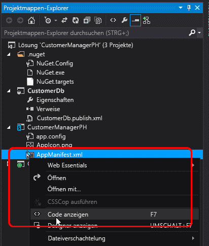
  
    
    
Entfernen Sie in der Codeansicht der Datei "AppManifest.xml" die zwei Referenzen auf das ASP.NET-MVC-Webanwendungsprojekt und das SQL-Datenebenen-Anwendungsprojekt, da diese in einem vom Anbieter gehosteten SharePoint-Add-In nicht erforderlich sind.
  
    
    
Erstellen Sie danach eine neue GUID, und ersetzen Sie die vorhandene GUID im Attribut **ProductId**. Damit wird SharePoint mitgeteilt, dass dies ein neues Add-In und keine Aktualisierung eines vorhandenen Add-Ins ist.
  
    
    

    
> **WICHTIG**
> Würde die vorhandene Produkt-ID verwendet werden, würde SharePoint die Fehlermeldung "Das bereitgestellte Add-In unterscheidet sich von einem anderen Add-In mit der gleichen Version und Produkt-ID" zurückgeben, wenn das konvertierte Add-In installiert wird. 
  
    
    

Suchen Sie dann nach dem Element **<RemoteWebApplication>**, und aktualisieren Sie das Attribut **ClientId** auf dieselbe GUID, die bei der Registrierung des Add-Ins bei SharePoint abgerufen und in den web.config-Add-In-Einstellungen der Azure-Website verwendet wurde.
  
    
    

**Festlegen der Client-ID für ein vom Anbieter gehostetes SharePoint-Add-In**

  
    
    

  
    
    
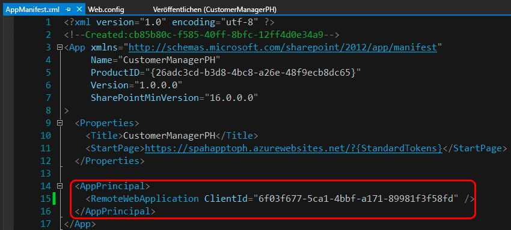
  
    
    
Nach dem Speichern aller Änderungen an der Datei "AppManifest.xml" ist das Add-In jetzt bereit für das Testen als vom Anbieter bereitgestelltes SharePoint-Add-In. Stellen Sie das Add-In an eine SharePoint-Farm oder SharePoint Online-Website bereit, um zu überprüfen, ob die Konvertierungsschritte ordnungsgemäß durchgeführt wurden.
  
    
    

## Weitere Ressourcen

Für weitere Informationen zum SharePoint-Add-In-Modell, von SharePoint gehosteten Add-Ins oder dem Add-In-Modell folgen Sie dem  [Blog für Office-Entwickler](http://blogs.office.com/dev/), in dem Sie Neuigkeiten und Aktualisierungen zu Entwicklungstools, Skripts und Dienstprogrammen finden, die Sie beim Erstellen von SharePoint-Add-Ins und der Migration von automatisch gehosteten Add-Ins zu vom Anbieter gehosteten Add-Ins unterstützen.
  
    
    

