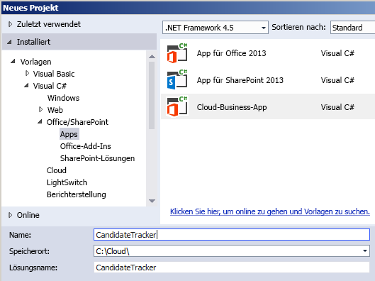
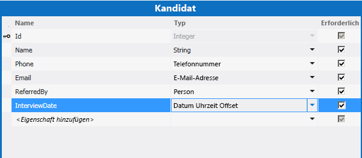
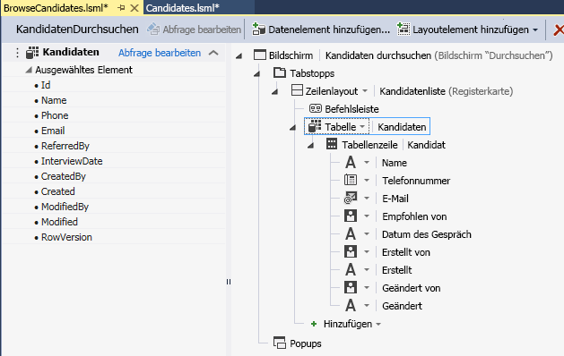
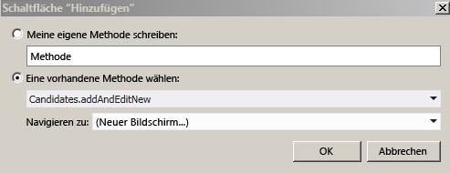
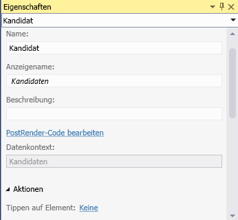
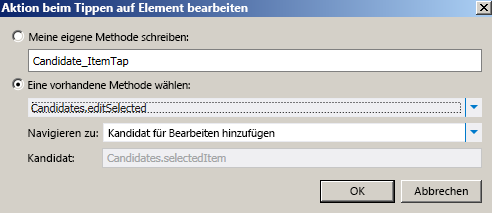
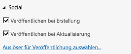

# Erstellen eines Cloud-Geschäfts-Add-Ins mit einem Newsfeed für soziale Netzwerke
Mit dem **Cloud-Geschäfts-Add-In**-Vorlage in Visual Studio können Sie SharePoint-Add-Ins erstellen, in denen Benutzer SharePoint-Daten anzeigen, hinzufügen und aktualisieren können. Der Projekttyp des **Cloud-Geschäfts-Add-Ins** verwendet Visual Studio LightSwitch-Technologien, die den Prozess zum Erstellen von in SharePoint gehosteten Geschäfts-Add-Ins deutlich vereinfachen. In dieser exemplarischen Vorgehensweise erstellen Sie ein Add-In zum Verfolgen von Kandidaten, die die Funktion von SharePoint für Office 365 zur Integration von sozialen Netzwerken nutzt, um einen Newsfeed für das Add-In bereitzustellen.Sie können die komplette Beispielanwendung aus der MSDN-Codegalerie herunterladen:  [Erstellen eines Cloud-Geschäfts-Add-Ins mit einem Newsfeed für soziale Netzwerke](http://code.msdn.microsoft.com/Creating-a-Cloud-Business-8540c0c9)
## Voraussetzungen

Für diese exemplarische Vorgehensweise ist Visual Studio 2013 erforderlich.
  
    
    
Zum Hosten des Add-Ins benötigen Sie außerdem eine SharePoint 2013-Website oder eine SharePoint-Entwicklerwebsite in Office 365, die Sie abrufen können unter  [Registrieren für eine Office 365-Entwicklerwebsite](http://go.microsoft.com/fwlink/?LinkId=263490).
  
    
    

## Erstellen eines Cloud-Geschäfts-Add-In-Projekts
<a name="bk_create"> </a>

 Beginnen Sie zum Erstellen eines Cloud-Geschäfts-Add-Ins mit der **Cloud-Geschäfts-Add-In**-Projektvorlage in Visual Studio.
  
    
    

### So erstellen Sie das Projekt


1. Klicken Sie in der Menüleiste auf **Datei**, **Neu**, **Projekt**.
    
    Das Dialogfeld **Neues Projekt** wird angezeigt.
    
  
2. Erweitern Sie in der Vorlagenliste den Knoten **Visual Basic** oder **Visual C#**, dann den Knoten **Office/SharePoint**, klicken Sie auf den Knoten **Add-Ins** und dann auf **Cloud-Geschäfts-Add-In**, wie in Abbildung 1 dargestellt.
    
   **Abbildung 1. Hinzufügen des Projekts**

  

     
  

  

  
3. Geben Sie im Textfeld **Name**CandidateTracker ein, und klicken Sie dann auf die Schaltfläche **OK**.
    
    Der Assistent **Neues Cloud-Geschäfts-Add-In** wird geöffnet.
    
  
4. Geben Sie im Assistenten **Neues Cloud-Geschäfts-Add-In** die URL Ihrer Office 365-Entwicklerseite ein, und klicken Sie dann auf die Schaltfläche **Fertig stellen**.
    
    Die URL sollte folgende Form annehmen https://  _MySite_.sharepoint.com/sites/Developer/.
    
    Im Projektmappen-Explorer wird eine **CandidateTracker**-Projektmappe mit vier Projekten hinzugefügt: ein **CandidateTracker**-Projekt auf oberster Ebene, ein **CandidateTracker.HTMLClient**-Projekt, ein **CandidateTracker.Server**-Projekt und ein **CandidateTracker.SharePoint**-Projekt.
    
  

## Hinzufügen von Daten und Bildschirmen
<a name="bk_add"> </a>

Das Kandidaten-Nachverfolgungs-Add-In benötigt eine Datenbanktabelle, die Sie im **Server**-Projekt erstellen, und Bildschirme zum Anzeigen, Hinzufügen und Aktualisieren von Daten, die Sie im **HTMLClient**-Projekt erstellen.
  
    
    

### So fügen Sie die Datenbanktabelle hinzu


1. Öffnen Sie im **Projektmappen-Explorer** das Kontextmenü des Knotens **CandidateTracker.Server** und klicken Sie dann auf **Tabelle hinzufügen**.
    
    Der Entity Designer wird geöffnet.
    
  
2. Geben Sie im Fenster **Eigenschaften** im Textfeld der Eigenschaft **Name**Kandidat ein.
    
  
3. Klicken Sie im Entity Designer auf den Link **<Eigenschaft hinzufügen>** und geben Sie dannName ein.
    
  
4. Drücken Sie die EINGABETASTE, um den Standardwert für **Typ**, **String** zu akzeptieren und lassen Sie das Kontrollkästchen **Erforderlich** aktiviert.
    
  
5. Klicken Sie auf den Link **<Eigenschaft hinzufügen>**, geben Sie Telefon ein, und klicken Sie dann auf die **TAB**-Taste.
    
  
6. Klicken Sie in der Spalte **Typ** auf **Telefonnummer** und drücken Sie dann zweimal dieTAB-Taste.
    
    **Telefonnummer** ist einbenutzerdefinierter Geschäftstyp, der Telefonnummer automatisch formatiert und überprüft.
    
  
7. Geben Sie in der nächsten Zeile bei **Name**E-Mail ein, und klicken Sie dann bei **Typ** auf **E-Mail-Adresse**.
    
    **E-Mail-Adresse** ist ein weiterer benutzerdefinierter Geschäftstyp, der eine Überprüfung für E-Mail-Adressen bereitstellt.
    
  
8. Geben Sie in der nächsten Zeile bei **Name**ReferredBy ein, und klicken Sie dann bei **Typ**auf **Person**.
    
    Der Geschäftstyp **Person** stellt eine Verbindung zum SharePoint-Benutzerprofildienst bereit, der die Benutzerinformationen aus dem Active Directory abruft.
    
  
9. Geben Sie in der nächsten Zeile bei **Name**InterviewDate ein, und klicken Sie dann bei **Typ** auf **Datums-/Uhrzeit-Offset**.
    
    Der Geschäftstyp **Datums-/Uhrzeit-Offset** speichert das Datum und die Uhrzeit im UTC-Format, sodass Benutzer in unterschiedlichen Zeitzonen die korrekte Uhrzeit angezeigt wird.
    
    In Abbildung 2 ist die fertige Entität dargestellt.
    

   **Abbildung 2. Die Candidates-Entität**

  

     
  

  

  

### So erstellen Sie den Suchbildschirm


1. Klicken Sie im Entity Designer in der Leiste **Perspektive** auf die Registerkarte **HTML-Client** und anschließend in der Symbolleiste auf **Bildschirm**.
    
    Das Dialogfeld **Neuen Bildschirm hinzufügen** wird geöffnet.
    
  
2. Klicken Sie im Dialogfeld **Neuen Bildschirm hinzufügen** in der Liste **Bildschirmvorlage auswählen** auf **Datenbildschirm durchsuchen**.
    
  
3. Klicken Sie in der Liste **Bildschirmdaten** auf **Kandidaten**, und dann auf die Schaltfläche **OK**.
    
    Der Bildschirm-Designer wird mit einer Darstellung der Datenentität im linken Bereich und einer Darstellung des Bildschirmlayouts im rechten Bereich geöffnet.
    
  
4. Klicken Sie im rechten Bereich des Bildschirm-Designers auf den Knoten **Liste | Kandidaten**, erweitern Sie die Liste **Liste** und klicken Sie dann auf **Tabelle**, wie in Abbildung 3 dargestellt.
    
   **Abbildung 3. Das Tabellensteuerelement**

  

     
  

    Dadurch werden die Informationen zu **Kandidat** im Tabellenformat statt des standardmäßig festgelegten Listenformats angezeigt.
    
    Beachten Sie, dass es zusätzlich zu den von Ihnen für die Tabelle definierten Feldern noch vier weitere Felder gibt: Erstellt von, Erstellt, Geändert von und Geändert. Diese Felder erstellen einen Audit-Trail, der anzeigt, wenn ein Element hinzugefügt oder zuletzt aktualisiert wurde und von wem. 
    
  

### So erstellen Sie den Hinzufügen-Bildschirm


1. Öffnen Sie im Bildschirm-Designer das Kontextmenü des Knotens **Befehlsleiste** und klicken Sie dann auf **Schaltfläche hinzufügen**.
    
  
2. Erweitern Sie im Dialogfeld **Schaltfläche hinzufügen** die Liste **showTab**, klicken Sie dann auf **addAndEditNew** wie in Abbildung 4 dargestellt, und klicken Sie dann auf die Schaltfläche **OK**.
    
   **Abbildung 4. Das Dialogfeld "Schaltfläche hinzufügen"**

  

     
  

    Das Dialogfeld **Neuen Bildschirm hinzufügen** wird geöffnet.
    
  
3. Akzeptieren Sie im Dialogfeld **Neuen Bildschirm hinzufügen** die Standardwerte und klicken Sie dann auf die Schaltfläche **OK**.
    
  
Ein neues Fenster des Bildschirm-Designers wird geöffnet.
  
    
    

### So erstellen Sie den Bearbeiten-Bildschirm


1. Klicken Sie auf die Registerkarte **BrowseCandidates.lsml** und dann im Bildschirm-Designer auf den Knoten **Tabelle | Kandidaten**.
    
  
2. Klicken Sie im Fenster **Eigenschaften** auf den Link **Auf Element tippen**, wie in Abbildung 5 dargestellt.
    
   **Abbildung 5. Der Link "Auf Element tippen"**

  

     
  

    Das Dialogfeld **Aktion bei Tippen auf Element** wird geöffnet.
    
  
3. Erweitern Sie im Dialogfeld **Aktion bei Tippen auf Element bearbeiten** die Liste **showTab**, klicken Sie auf **editSelected** wie in Abbildung 6 dargestellt, und klicken Sie dann auf die Schaltfläche **OK**.
    
   **Abbildung 6. Das Dialogfeld "Aktion bei Tippen auf Element bearbeiten"**

  

     
  

  

  

### So testen Sie das Add-In


1. Klicken Sie in der Menüleiste auf **Debuggen**, **Debuggen starten**.
    
    Beim erstmaligen Ausführen eines SharePoint-Add-Ins auf Ihrem Computer werden Sie dazu aufgefordert, ein Localhost-Zertifikat zu installieren, da Cloud-Geschäfts-Add-Ins immer SSL (Secure Sockets Layer) verwenden. Wenn Sie dieses Zertifikat akzeptieren, erscheint nicht jedes Mal eine Sicherheitswarnung, wenn Sie das Add-In starten. Da das Zertifikat nur für das Localhost gilt, droht für Ihr System keine Gefahr.
    
  
2. Klicken Sie im Dialogfeld **Sicherheitshinweis** auf die Schaltfläche **Ja**.
    
  
3. Wenn das Dialogfeld **Sicherheitswarnung** angezeigt wird, klicken Sie auf die Schaltfläche **Ja**.
    
    Ihr Webbrowser wird angezeigt.
    
  
4. Klicken Sie auf der **Anmelden**-Seite auf die Schaltfläche **Anmelden**.
    
  
5. Geben Sie Ihr Kennwort ein und klicken Sie dann auf die Schaltfläche **Anmelden**.
    
  
6. Klicken Sie, wenn Sie dazu aufgefordert werden, auf die Schaltfläche **Vertrauen**.
    
  
7. Klicken Sie auf dem Bildschirm **Kandidaten durchsuchen** auf die Schaltfläche **Kandidat hinzufügen**.
    
    Der Bildschirm **Kandidat hinzufügen** wird geöffnet.
    
  
8. Geben Sie auf dem Bildschirm **Kandidat hinzufügen** einen Namen, eine Telefonnummer und eine E-Mail-Adresse ein.
    
  
9. Klicken Sie auf das Feld **Bezugnahme durch** und geben Sie die ersten drei Buchstaben Ihres Namens ein.
    
    Ihr vollständiger Namen sollte in der Liste angezeigt werden. Wenn Ihre Seite mit dem Active Directory verbunden ist, sollte Ihnen eine Liste aller Benutzer angezeigt werden, deren Namen mit den gleichen drei Buchstaben beginnen.
    
  
10. Ändern Sie bei Bedarf das Datum und die Uhrzeit in **Datum des Gesprächs** und klicken Sie dann auf die Schaltfläche **Speichern**, um zum Bildschirm **Kandidaten durchsuchen** zurückzukehren.
    
    Der von Ihnen soeben hinzugefügte Kandidat wird angezeigt; wenn Sie auf die Zeile klicken, wird der Bildschirm **Kandidaten hinzufügen/bearbeiten** geöffnet. Beachten Sie, dass einige Felder spezielle Verhaltensweisen aus den benutzerdefinierten Geschäftstypen erben. Klicken Sie auf das Feld **Telefon**, um die Nummer zu wählen, klicken Sie auf das Feld **E-Mail**, um eine E-Mail zu senden oder zeigen Sie auf das Feld **Erstellt von**, um Ihre Kontaktinformationen anzuzeigen.
    
  
11. Schließen Sie das Browserfenster, um das Add-In zu beenden.
    
  

## Hinzufügen eines Newsfeeds
<a name="bk_feed"> </a>

Eine Funktion von SharePoint für Office 365 dient dem Hinzufügen von Newsfeeds, dadurch können Benutzer Aktivitäten in einer Liste verfolgen und Kommentare hinzufügen. Mit Cloud-Geschäfts-Add-Ins können Sie mühelos einen Newsfeed für Ihr Add-In erstellen.
  
    
    

### So aktivieren Sie die Integration sozialer Netzwerke


1. Klicken Sie auf die Registerkarte **Candidates.lsml**, dann auf die Leiste **Perspektive** und anschließend auf die Registerkarte **Server**.
    
  
2. Aktivieren Sie im Fenster **Eigenschaften** die Kontrollkästchen **Nach dem Erstellen posten** und **Nach dem Aktualisieren posten** wie in Abbildung 7 dargestellt.
    
   **Abbildung 7. Eigenschaften für soziale Netzwerke**

  

     
  

  

  
3. Klicken Sie auf den Link **Auswählen von Postauslösern**.
    
    Das Dialogfeld **Auswählen von Postauslösern** wird angezeigt.
    
  
4. Deaktivieren Sie im Dialogfeld **Auswählen von Postauslösern** das Kontrollkästchen **Alle Felder**, aktivieren Sie das Kontrollkästchen **Datum des Gesprächs** und klicken Sie anschließend auf die Schaltfläche **OK**.
    
  

### So testen Sie das Add-In


1. Klicken Sie in der Menüleiste auf **Debuggen**, **Debuggen starten**.
    
  
2. Klicken Sie auf dem Bildschirm **Kandidaten durchsuchen** auf den Kandidaten, den Sie zuvor erstellt haben.
    
  
3. Ändern Sie auf dem Bildschirm **Kandidaten hinzufügen/bearbeiten** das **Datum des Gesprächs** und klicken Sie dann auf die Schaltfläche **Speichern**.
    
  
4. Klicken Sie auf die Schaltfläche **Kandidat hinzufügen** und fügen Sie einen weiteren Kandidaten hinzu.
    
  
5. Klicken Sie auf dem Bildschirm **Kandidaten durchsuchen** in der SharePoint-Chromleiste auf den Link **Newsfeed**.
    
    Der **Kandidatverfolgungs-Newsfeed** wird in einem neuen Browserfenster mit zwei Entitäten für hinzugefügte und aktualisierte Kandidaten geöffnet. Bei einem Beitrag können Sie auf **Gefällt mir** oder auf den Link **Antworten** klicken, um einen Kommentar hinzuzufügen.
    
  
6. Schließen Sie beide Browserfenster, um das Add-In zu beenden.
    
  

## Hinzufügen einer Validierung
<a name="bk_validate"> </a>

In vielen Geschäfts-Add-Ins möchten Sie möglicherweise den Zugriff auf bestimmte Funktionen beschränken, z. B. nur einem Manager ermöglichen, das Datum eines Gesprächs zu ändern. Mit Cloud-Geschäfts-Add-Ins können Sie diese Einstellung vornehmen, indem Sie eine Validierungslogik schreiben. In diesem Fall schreiben Sie den Code, um zu ermitteln, ob der aktuelle Benutzer Mitglied einer bestimmten Active Directory-Sicherheitsgruppe ist.
  
    
    

### So fügen Sie eine Validierung hinzu


1. Klicken Sie auf die Registerkarte **Candidates.lsml**, dann auf die Leiste **Perspektive** und anschließend auf die Registerkarte **Server**.
    
  
2. Erweitern Sie in der Symbolleiste die Liste **Code schreiben** und klicken Sie dann auf die Methode **Candidates_Validate**.
    
    Der Code-Editor wird geöffnet.
    
  
3. Fügen Sie im Code-Editor folgenden Code zur **Candidates_Validate**-Methode hinzu:
    
 ```VB.net
  
If Not Application.User.Department = "Hiring Managers" Then
                results.AddEntityError("Permission denied")
            End If
 ```


 ```cs
  
if (!(Application.User.Department == "Hiring Managers")) {
results.AddEntityError("Permission denied");
}
 ```


    Die **Validate**-Methode wird ausgeführt, wenn ein Benutzer versucht, einen Datensatz zu speichern. Wenn der Benutzer Mitglied der Einstellungsmanager-Sicherheitsgruppe ist, wurde der Datensatz gespeichert, andernfalls wird die Fehlermeldung „Berechtigung verweigert" angezeigt und der Datensatz verworfen.
    
  
An diesem Punkt wird Ihnen wahrscheinlich beim Ausführen des Add-Ins und Hinzufügen eines neuen Kandidaten die Fehlermeldung angezeigt, sofern Sie kein Mitglied einer Sicherheitsgruppe mit der Bezeichnung Einstellungsmanager sind. Ersetzen Sie „Einstellungsmanager" durch den Namen einer Sicherheitsgruppe, der Sie angehören und versuchen Sie es erneut. Sie sollten nun über die Berechtigung verfügen, einen Kandidaten hinzuzufügen.
  
    
    

## Nächste Schritte
<a name="bk_validate"> </a>

Herzlichen Glückwunsch! Sie haben Ihr erstes Cloud-Geschäfts-Add-In erstellt. Wenn Sie dieses Add-In für andere Benutzer freigeben möchten, müssen Sie das Add-In im nächsten Schritt veröffentlichen. Weitere Informationen dazu finden Sie unter  [Vorgehensweise: Veröffentlichen eines Cloud-Geschäfts-Add-Ins in Office 365](http://msdn.microsoft.com/de-de/library/vstudio/dn454601.aspx) oder [Veröffentlichen von SharePoint-Add-Ins](http://msdn.microsoft.com/de-de/library/office/apps/jj164070.aspx).
  
    
    
Das ist natürlich nur ein einfaches Beispiel. Sie können aber noch viel mehr machen, um Add-Ins mit vollem Funktionsumfang zu erstellen. Da die Cloud-Geschäfts-Add-In-Vorlage auf LightSwitch-Technologien basiert, sollten Sie sich die LightSwitch-Dokumentation ansehen, um sich einige Anregungen zu holen. Weitere Informationen finden Sie unter  [LightSwitch-Apps für SharePoint](http://msdn.microsoft.com/de-de/library/vstudio/jj969620.aspx).
  
    
    

## Zusätzliche Ressourcen
<a name="bk_addresources"> </a>


-  [Erstellen von Cloud-Geschäfts-Add-Ins](create-cloud-business-add-ins.md)
    
  

