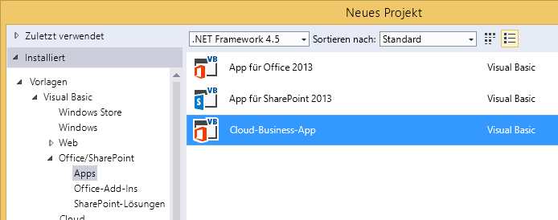
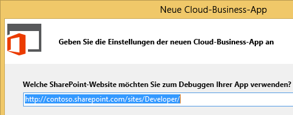
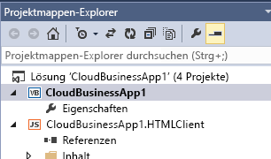
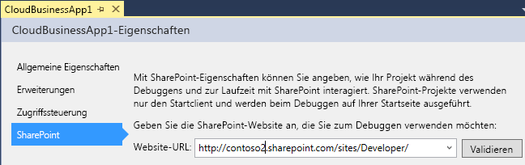

# Erstellen eines Cloud-Geschäfts-Add-Ins
Mit der Cloud-Geschäfts-Add-In-Vorlage in Visual Studio können Sie Add-Ins für SharePoint 2013 oder SharePoint in Office 365 erstellen, die für das Hinzufügen und Verwalten von Daten optimiert sind.
> [!HINWEIS]
> Sie können auch ein SharePoint-Add-In entwickeln, indem Sie die Add-In-Vorlage für SharePoint 2013 verwenden. 
  
    
    

### So erstellen Sie ein Cloud-Geschäfts-Add-In

1. Klicken Sie in der Menüleiste auf **Datei**, **Neu**, **Projekt**.
    
    Das Dialogfeld **Neues Projekt** wird geöffnet.
    
  
2. Erweitern Sie in der Vorlagenliste den Knoten **Visual Basic** oder **Visual C#**, dann den Knoten **Office/SharePoint**, klicken Sie auf den Knoten **Add-Ins** und dann auf **Cloud-Geschäfts-Add-In**, wie in Abbildung 1 dargestellt.
    
   **Abbildung 1. Cloud-Geschäfts-Add-In-Vorlage**

  

     
  

  

  
3. Geben Sie im Textfeld **Name** den Namen Ihres Projekts ein und klicken Sie dann auf die Schaltfläche **OK**.
    
    Der Assistent **Neues Cloud-Geschäfts-Add-In** wird geöffnet.
    
  
4. Geben Sie im Assistenten **Neue Cloud-Geschäfts-Add-In** die Website-URL für Ihren SharePoint-Server oder Ihre Office 365-Entwicklerwebsite ein wie in Abbildung 2 dargestellt, und klicken Sie anschließend auf die Schaltfläche **Fertig stellen**.
    
   **Abbildung 2. SharePoint-URL**

  

     
  

    Die URL sollte folgende Form annehmen https://  _MySite_.sharepoint.com/sites/Developer/.
    
    Dem Projektmappen-Explorer wurde eine neue Lösung mit vier Projekten hinzugefügt: ein Projekt auf oberster Ebene, ein **HTMLClient**-Projekt, ein **Server**-Projekt und ein **SharePoint**-Projekt.
    
  

### So ändern Sie die Website für eine Cloud-Geschäfts-Add-In

1. Öffnen Sie im **Projektmappen-Explorer** das Kontextmenü des Projektknotens auf oberster Ebene und klicken Sie dann auf **Eigenschaften**, wie in Abbildung 3 dargestellt.
    
   **Abbildung 3. Der Projektknoten auf oberster Ebene**

  

     
  

    Der Anwendungs-Designer wird geöffnet.
    
  
2. Klicken Sie im Anwendungs-Designer auf die Registerkarte **SharePoint** wie in Abbildung 4 dargestellt.
    
   **Abbildung 4. Die Registerkarte "SharePoint"**

  

     
  

  

  
3. Klicken Sie in der Liste **Website-URL** auf eine vorhandene URL oder geben Sie die Website-URL Ihres SharePoint-Servers oder Ihrer Office 365-Entwicklerwebsite ein.
    
  
4. Klicken Sie auf die Schaltfläche **Überprüfen**, um die URL zu überprüfen.
    
  

## Zusätzliche Ressourcen

-  [Entwickeln von Cloud-Geschäfts-Add-Ins](develop-cloud-business-add-ins.md)
    
  
-  [Erstellen von Cloud-Geschäfts-Add-Ins](create-cloud-business-add-ins.md)
    
  

