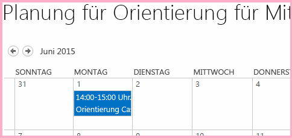
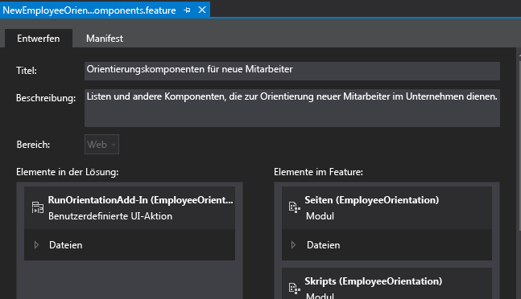
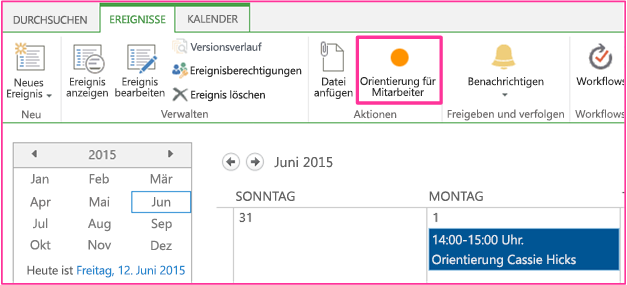

# Erstellen einer benutzerdefinierten Menübandschaltfläche im Hostweb eines SharePoint-Add-Ins
Erfahren Sie, wie Sie benutzerdefinierte Menübandschaltflächenbefehle zum Hostweb eines SharePoint-Add-Ins hinzufügen.
Dies ist der neunte in einer Reihe von Artikeln über die Grundlagen der Entwicklung von SharePoint gehosteter SharePoint-Add-Ins. Sie sollten sich zuerst mit  [SharePoint-Add-Ins](sharepoint-add-ins.md) und den vorherigen Artikeln in dieser Reihe vertraut machen:
  
    
    

-  [Erste Schritte beim Erstellen von von SharePoint gehosteten SharePoint-Add-Ins](get-started-creating-sharepoint-hosted-sharepoint-add-ins.md)
    
  
-  [Bereitstellung und Installation eines von SharePoint gehosteten Add-Ins für SharePoint](deploy-and-install-a-sharepoint-hosted-sharepoint-add-in.md)
    
  
-  [Hinzufügen von benutzerdefinierten Spalten zu einem von SharePoint gehosteten Add-In für SharePoint](add-custom-columns-to-a-sharepoint-hostedsharepoint-add-in.md)
    
  
-  [Hinzufügen eines benutzerdefinierten Inhaltstyps zu einem von SharePoint gehosteten Add-In für SharePoint](add-a-custom-content-type-to-a-sharepoint-hostedsharepoint-add-in.md)
    
  
-  [Hinzufügen eines Webparts zu einer Seite in einem von SharePoint gehosteten Add-In für SharePoint](add-a-web-part-to-a-page-in-a-sharepoint-hosted-sharepoint-add-in.md)
    
  
-  [Hinzufügen eines Workflows zu einem von SharePoint gehosteten Add-In für SharePoint](add-a-workflow-to-a-sharepoint-hosted-sharepoint-add-in.md)
    
  
-  [Hinzufügen einer benutzerdefinierten Seite und Formatvorlage zu einem von SharePoint gehosteten Add-In für SharePoint](add-a-custom-page-and-style-to-a-sharepoint-hosted-sharepoint-add-in.md)
    
  
-  [Hinzufügen des benutzerdefinierten clientseitigen Renderings für ein von SharePoint-gehostetes SharePoint Add-In](add-custom-client-side-rendering-to-a-sharepoint-hosted-sharepoint-add-in.md)
    
  

> [!HINWEIS]
> Wenn Sie diese Reihe zu von SharePoint gehosteten Add-Ins durchgearbeitet haben, haben Sie eine Visual Studio-Lösung, die Sie verwenden können, um mit diesem Thema fortzufahren. Sie können außerdem das Repository unter  [SharePoint_SP-Hosted_Add-Ins_Tutorials](https://github.com/OfficeDev/SharePoint_SP-hosted_Add-Ins_Tutorials) herunterladen und die Datei „BeforeRibbon.sln" öffnen.
  
    
    

Alle SharePoint-Add-Ins können von der Seite **Websiteinhalte** des Hostwebs ausgeführt werden, indem Sie auf die Kachel des Add-Ins klicken. Die Funktionalität eines SharePoint-Add-Ins kann auch über benutzerdefinierte Aktionen im Hostweb zur Verfügung gestellt werden, die benutzerdefinierte Menübandschaltflächen oder benutzerdefinierte Menüelemente sind. In diesem Artikel fügen Sie eine Schaltfläche zum Menüband eines Hostwebs hinzu.
## Vorbereiten des Hostwebs

Die Schaltfläche wird dem Menüband eines Kalenders im Hostweb hinzugefügt. Führen Sie die folgenden Schritte in der Benutzeroberfläche Ihrer SharePoint-Entwicklerwebsite aus.
  
    
    

1. Wählen Sie auf der Startseite der Website **Websiteinhalte** > **Add-In hinzufügen** > **Kalender** aus.
    
  
2. Geben Sie im Dialogfeld **Kalender hinzufügen**Mitarbeitereinführungsplanung unter **Name** ein, und wählen Sie dann **Erstellen** aus.
    
  
3. Wenn der Kalender geöffnet wird, setzen Sie den Cursor auf ein beliebiges Datum, bis der Link **Hinzufügen** auf dem Datum angezeigt wird, und klicken Sie dann auf **Hinzufügen**. 
    
  
4. Geben Sie im Dialogfeld **Mitarbeitereinführungsplanung - neues Element**Einführung Cassi Hicks unter **Titel** ein. Behalten Sie für die anderen Felder die Standardwerte bei, und klicken Sie auf **Speichern**.
    
    Der Kalender sollte etwa wie folgt aussehen:
    

   **Benutzerdefinierter Kalender**

  

     
  

  

  

  
    
    

> [!WICHTIG]
> Im nächsten Verfahren muss der Kalender in der Benutzeroberfläche von Visual Studio sichtbar sein, was aber nicht der Fall sein wird, wenn Visual Studio geöffnet war, als Sie den Kalender erstellt haben. Bevor Sie fortfahren, schließen Sie Visual Studio, und melden Sie sich auch aus allen Browserfenstern und PowerShell-Konsolen ab, mit denen Sie bei Ihrer Entwicklerwebsite angemeldet sind. 
  
    
    

## Hinzufügen einer benutzerdefinierten Menübandaktion

1. Klicken Sie im **Projektmappen-Explorer** mit der rechten Maustaste auf das Projekt **EmployeeOrientation**, und wählen Sie **Hinzufügen** > **Neues Element** > **Office/SharePoint** > **Benutzerdefinierte Menübandaktion** aus. Nennen Sie sieRunOrientationAdd-in, und wählen Sie **Hinzufügen** aus.
    
  
2. Der Assistent **Benutzerdefinierte Aktion für das Menüband erstellen** stellt Ihnen eine Reihe von Fragen. Stellen Sie die Antworten aus der folgenden Tabelle bereit:
    

|**Frage zur Eigenschaft**|**Antwort**|
|:-----|:-----|
|Wo soll die benutzerdefinierte Aktion bereitgestellt werden?    |Wählen Sie **Hostweb** aus.   |
|Wo ist die benutzerdefinierte Aktion zugeordnet?    |Wählen Sie **Listeninstanz** ( *nicht*  Listenvorlage) aus.   |
|Welchem bestimmten Element ist die benutzerdefinierte Aktion zugeordnet?    |Wählen Sie **Mitarbeitereinführungsplanung** aus.   |
|Wo befindet sich das Steuerelement?    |Verwenden Sie nicht die Dropdownauswahl. Geben Sie stattdessen **Ribbon.Calendar.Events.Actions.Controls._children** ein. (Der dritte Teil, **Events**, identifiziert die Registerkarte des Menübands und das vierte Teil **Actions** die Schaltflächengruppe.)   |
|Wie lautet der Text im Menüelement?    |Geben Sie **Mitarbeitereinführung** ein.   |
|Wohin navigiert die benutzerdefinierte Aktion?    |Verwenden Sie nicht die Dropdownauswahl. Geben Sie stattdessen **~appWebUrl/Lists/NewEmployeesInSeattle** ein. Dies ist die Seite mit der Listenansicht für die Liste, die sich im Add-In-Web befindet, damit die Menübandschaltfläche im Hostweb eine Seite im Add-In-Web öffnet.   |
   
3. Wählen Sie **Fertig stellen** aus.
    
  

## Prüfen der Add-In-Webfunktion

Erweitern Sie im **Projektmappen-Explorer** den Ordner **Funktionen**, und wählen Sie die Funktion **NewEmployeeOrientationComponents** aus. Der Funktions-Designer wird geöffnet.
  
    
    
Beachten Sie, dass die benutzerdefinierte Aktion, die Sie erstellt haben, **RunOrientationAdd-in** in **Elemente in der Lösung**, jedoch nicht in **Elemente in der Funktion** aufgelistet ist. Der Grund dafür ist, dass die Funktion an das Add-In-Web, Ihre benutzerdefinierte Aktion aber an das Hostweb bereitgestellt wird. Wenn Sie das Add-In in Visual Studio zur Bereitstellung für die Produktion verpacken oder F5 in Visual Studio drücken, erstellen die Office-Entwicklertools für Visual Studio eine spezielle Hostwebfunktion, fügen die benutzerdefinierte Aktion hinzu und stellen sie an das Hostweb bereit. Sie sollten die Hostwebfunktion niemals bearbeiten. Darum wird sie erst zum Zeitpunkt des Verpackens erstellt.
  
    
    

**Funktions-Designer**

  
    
    

  
    
    

  
    
    

  
    
    

  
    
    

## Ausführen und Testen des Add-Ins

  
    
    

1. Verwenden Sie die F5-TASTE, um Ihr Add-In bereitzustellen und auszuführen. Visual Studio führt eine temporäre Installation des Add-Ins auf Ihrer SharePoint-Testwebsite durch und führt das Add-In sofort aus. 
    
  
2. Die Standardseite des SharePoint-Add-Ins wird geöffnet. Navigieren Sie zur Startseite Ihrer Entwicklerwebsite (die das Hostweb ist). In der linken oberen Ecke der Seite finden Sie einen Breadcrumblink dahin.
    
  
3. Wählen Sie auf der Startseite des Hostwebs **Websiteinhalte**, und klicken Sie auf der Seite **Websiteinhalte** auf den Kalender **Mitarbeitereinführungsplanung**(nicht das Add-In **Mitarbeitereinführung**).
    
  
4. Wenn der Kalender geöffnet wird, klicken Sie auf das Ereignis **Cassie Hicks einführen**. Wenn die Registerkarte **Ereignisse** im Menüband nicht automatisch geöffnet wird, öffnen Sie sie manuell. Sie sollte etwa wie folgt aussehen:
    
   **Registerkarte „Ereignisse" mit benutzerdefinierter Schaltfläche**

  

     
  

  

  
5. Klicken Sie in der Gruppe **Aktionen** im Menüband auf **Mitarbeitereinführung**. Die Seite mit der Listenansicht für **Neue Mitarbeiter in Seattle** wird geöffnet.
    
  
6. Schließen Sie zum Beenden der Debugsitzung das Browserfenster, oder beenden Sie das Debuggen in Visual Studio. Jedes Mal, wenn Sie F5 drücken, zieht Visual Studio die vorherige Version des Add-Ins zurück und installiert die neueste.
    
  
7. Da Sie mit diesem Add-In und dieser Visual Studio-Projektmappe in anderen Artikeln arbeiten werden, hat es sich bewährt, das Add-In ein letztes Mal zurückzuziehen, wenn Sie Ihre Arbeit daran für eine Weile abgeschlossen haben. Klicken Sie mit der rechten Maustaste auf das Projekt im **Projektmappen-Explorer**, und wählen Sie **Zurückziehen** aus.
    
  

## 

Im nächsten Artikel dieser Reihe fügen Sie JavaScript zum SharePoint-Add-In hinzu und greifen auf SharePoint-Daten mit dem JavaScript-Objektmodell von SharePoint zu:  [Verwenden von SharePoint-JavaScript-APIs zum Arbeiten mit SharePoint-Daten](use-the-sharepoint-javascript-apis-to-work-with-sharepoint-data.md).
  
    
    

