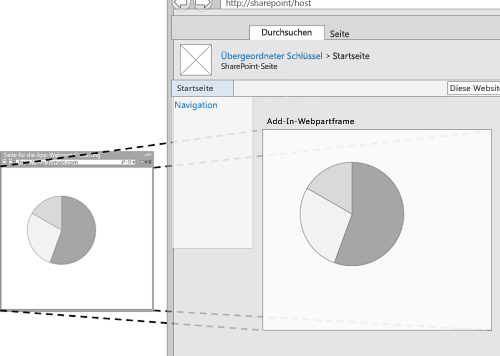
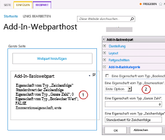
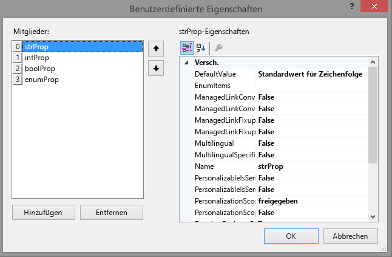
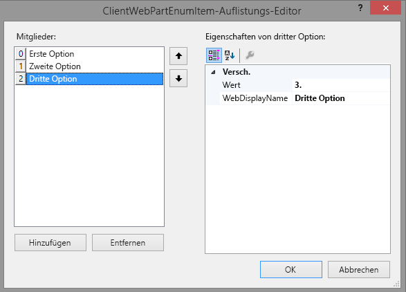
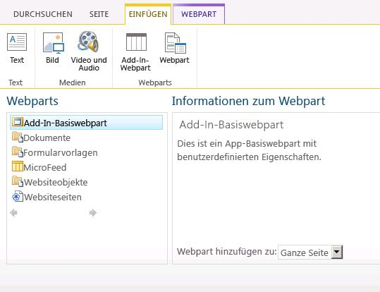
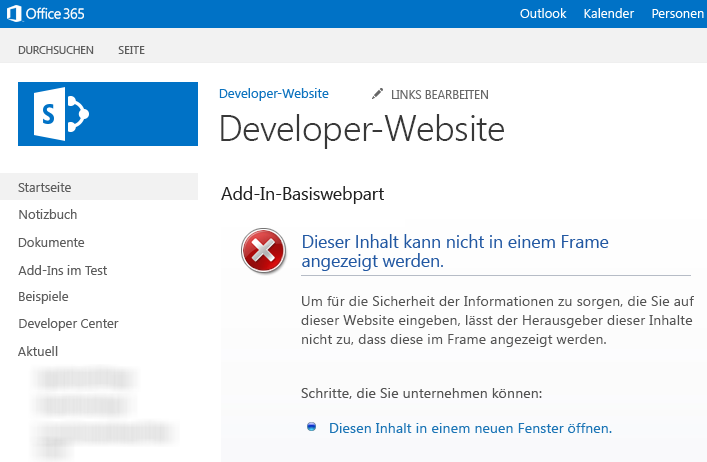

# Erstellen von Add-In-Webparts zur Installation mit Ihrem SharePoint-Add-In
In diesem Artikel erfahren Sie, wie Sie ein Add-In-Webpart in SharePoint 2013 erstellen, das im Webpartkatalog des Hostwebs verfügbar ist, wenn Sie die SharePoint-Add-In installieren.
Mit Add-In-Webparts können Sie die Benutzererfahrung Ihres Add-Ins direkt auf den SharePoint-Websiteseiten anzeigen. Ein Add-In-Webpart zeigt die von Ihnen angegebene Webseite (normalerweise ein interaktives Formular oder eine dynamische Anzeige von Daten) mithilfe eines **IFrame** (der auch als Frame bezeichnet wird) auf einer Seite im [Hostweb](http://msdn.microsoft.com/library/fp179925.aspx) an. Weitere Informationen zu Add-In-Webparts finden Sie in den folgenden Artikeln:
  
    
    


-  [Zugreifen auf das Add-In über die Benutzeroberfläche](important-aspects-of-the-sharepoint-add-in-architecture-and-development-landscap.md#AccessingApp)
    
  
-  [UX-Design für SharePoint-Add-Ins](ux-design-for-sharepoint-add-ins.md)
    
  
-  [Erweitern der SharePoint-Benutzeroberfläche in Add-Ins](sharepoint-add-ins-ux-design-guidelines.md#UXGuide_Extending)
    
  

In Abbildung 1 ist gezeigt, wie der Inhalt des Add-In-Webparts auf einer SharePoint-Seite angezeigt wird.
  
    
    


**Abbildung 1. Inhalt des Add-In-Webparts dargestellt auf einer SharePoint-Seite**

  
    
    

  
    
    

  
    
    
Ein Add-In-Webpart wird mit der Klasse **ClientWebPart** implementiert und steht wie alle Webparts im Add-In-Webpartkatalog zur Verfügung, wenn ein Benutzer die SharePoint-Add-In installiert, in der es enthalten ist. Ihre Benutzer können das Add-In-Webpart mit den von Ihnen bereitgestellten Eigenschaften weiter anpassen. (Ein Beispiel für konfigurierbare Eigenschaften in einem Add-In-Webpart finden Sie in Abbildung 2 unten.)Das Beispiel in diesem Artikel verwendet eine nicht in SharePoint, sondern auf einem Remoteserver gehostete Webseite als Inhaltsseite. Bedenken Sie, dass Sie den Inhalt des Add-In-Webparts auch auf SharePoint-Seiten hosten können, wie im Abschnitt  [Andere gängige Szenarien mit Add-In-Webparts](#SP15Createappparts_Nextsteps) weiter unten in diesem Artikel beschrieben.
## Voraussetzungen für die Verwendung des Beispiels in diesem Artikel
<a name="SP15Createappparts_Prereq"> </a>

Um die Schritte in diesem Beispiel auszuführen, benötigen Sie Folgendes:
  
    
    

- Visual Studio
    
  
- Microsoft Office-Entwicklertools für Visual Studio
    
  
- Eine SharePoint-Entwicklungsumgebung. Wenn Sie Hilfe beim Einrichten einer Entwicklungsumgebung benötigen, finden Sie weitere Informationen unter  [Erste Schritte beim Erstellen von von einem Anbieter gehosteten SharePoint-Add-Ins](get-started-creating-provider-hosted-sharepoint-add-ins.md).
    
  

  
    
    

## Erstellen eines Add-In-Webparts zur Installation auf dem Hostweb
<a name="SP15Createappparts_Codeexample"> </a>

Es gibt mehrere Aufgaben, die erforderlich sind, um Ihr Add-In-Webpart zu erstellen und auf dem Hostweb zu installieren:
  
    
    

1. Erstellen Sie die SharePoint-Add-In- und Remotewebprojekte.
    
  
2. Hinzufügen eines Formulars für den Inhalt des Add-In-Webparts
    
  
3. Fügen Sie dem SharePoint-Add-In-Projekt das Add-In-Webpart hinzu.
    
  
Wenn Sie die Aufgaben abgeschlossen haben, sollte Ihr Add-In-Webpart ähnlich aussehen wie in Abbildung 2, wenn es sich im Bearbeitungsmodus befindet. Hier zu sehen ist (1) der Add-In-Inhalt, der auf einer SharePoint-Seite dargestellt wird, und (2) die benutzerdefinierten Eigenschaften des Add-In-Webparts.
  
    
    

**Abbildung 2. SharePoint-Seite als Host für ein Add-In-Basiswebpart**

  
    
    

  
    
    

  
    
    

### Hinzufügen eines Formulars für den Inhalt des Add-In-Webparts


1. Erstellen Sie ein vom Anbieter gehostetes SharePoint-Add-In, wie unter  [Erste Schritte beim Erstellen von von einem Anbieter gehosteten SharePoint-Add-Ins](get-started-creating-provider-hosted-sharepoint-add-ins.md) beschrieben, aber geben Sie dem Projekt den NamenTestAppPart.
    
  
2. Klicken Sie nach dem Erstellen der Visual Studio-Lösung mit der rechten Maustaste auf das Webanwendungsprojekt (nicht das SharePoint-Add-In-Projekt), und fügen Sie ein neues Webformular hinzu, indem Sie **Hinzufügen** > **Neues Element** > **Web** > **Webformular** auswählen. Geben Sie dem Formular den NamenAppPartContent.aspx.
    
  
3. Ersetzen Sie das gesamte HTML-Element und seine untergeordneten Elemente in der Datei AppPartContent.aspx durch den folgenden HTML-Code. Behalten Sie das gesamte Markup oberhalb des HTML-Elements wie vorhanden bei. Der HTML-Code enthält JavaScript, das die folgenden Aufgaben ausführt:
    
  - Extrahieren der Standardeigenschaftswerte aus der Abfragezeichenfolge
    
  
  - Rendern der Eigenschaftswerte
    
  

    Beachten Sie, dass der Code einige Parameter in der Abfragezeichenfolge erwartet. Das Add-In-Webpart stellt seine benutzerdefinierten Eigenschaften durch die Abfragezeichenfolge bereit, sodass die Webseite sie nutzen kann. In der nächsten Aufgabe wird erklärt, wie Sie benutzerdefinierte Eigenschaften festlegen und diese für die Add-In-Webseite verfügbar machen.
    


 ```HTML
  
<html>
    <body>
        <div id="content">
            <!-- Placeholders for properties -->
            String property: <span id="strProp"></span><br />
            Integer property: <span id="intProp"></span><br />
            Boolean property: <span id="boolProp"></span><br />
            Enumeration property: <span id="enumProp"></span><br />
        </div>

    <!-- Main JavaScript function, controls the rendering
         logic based on the custom property values -->
    <script lang="javascript">
        "use strict";

        var params = document.URL.split("?")[1].split("&amp;");
        var strProp;
        var intProp;
        var boolProp;
        var enumProp;

        // Extracts the property values from the query string.
        for (var i = 0; i < params.length; i = i + 1) {
            var param = params[i].split("=");
            if (param[0] == "strProp")
                strProp = decodeURIComponent(param[1]);
            else if (param[0] == "intProp")
                intProp = parseInt(param[1]);
            else if (param[0] == "boolProp")
                boolProp = (param[1] == "true");
            else if (param[0] == "enumProp")
                enumProp = decodeURIComponent(param[1]);
        }

        document.getElementById("strProp").innerText = strProp;
        document.getElementById("intProp").innerText = intProp;
        document.getElementById("boolProp").innerText = boolProp;
        document.getElementById("enumProp").innerText = enumProp;
    </script>
    </body>
</html>
 ```

4. Speichern und schließen Sie die Datei.
    
  

### Hinzufügen des Add-In-Webparts zum SharePoint-Projekt


1. Klicken Sie mit der rechten Maustaste auf das SharePoint-Add-In-Projekt (nicht das Webanwendungsprojekt), und wählen Sie dann **Hinzufügen** > **Neues Element** > **Office/SharePoint** > **Clientwebpart (Host Web)** aus. („Clientwebpart" ist eine andere Bezeichnung für „Add-In-Webpart".)
    
  
2. Geben Sie dem Webpart den Namen Add-In-Basiswebpart.
    
  
3. Wählen Sie im Dialogfeld **Clientwebpart-Seite angeben** die Option **URL für eine vorhandene Webseite auswählen oder eingeben** aus. Wählen Sie in der Dropdownliste die Seite **TestAppWebPart/AppPartContent.aspx** aus. (Nachdem Sie Ihre Auswahl getroffen haben, wurde bei der Seiten-URL im Feld möglicherweise „TestAppWebPart" durch **~remoteAppUrl** ersetzt und den Abfrageparametern **{StandardTokens }** hinzugefügt.)
    
  
4. Wählen Sie **Fertig stellen** aus.
    
  
5. Klicken Sie im **Projektmappen-Explorer** mit der rechten Maustaste auf **Add-In-Basiswebpart**, und wählen Sie **Eigenschaften** aus.
    
  
6. Wählen Sie im Bereich **Eigenschaften** die Option **Benutzerdefinierte Eigenschaften** aus, und klicken Sie dann auf die Popupschaltfläche ( **...**).
    
  
7. Verwenden Sie das Dialogfeld **Benutzerdefinierte Eigenschaften**, um dem Add-In-Webpart vier benutzerdefinierte Eigenschaften hinzuzufügen. Sie müssen für jedes der vier benutzerdefinierten Eigenschaften fünf Attribute festlegen. Die Namen der Attribute und Werte sind in Tabelle 1 aufgeführt. Erstellen Sie die Eigenschaften mithilfe des folgenden Verfahrens.
    
1. Wählen Sie **Hinzufügen** aus.
    
  
2. Wählen Sie in der Attributliste das erste Attribut aus Tabelle 1 aus: **DefaultValue**.
    
  
3. Legen Sie den Wert fest, z. B. Standardwert der Zeichenfolge.
    
  
4. Wählen Sie das nächste Attribut, **Name**, aus, und legen Sie seinen Wert fest, z. B. strProp.
    
  
5. Fahren Sie mit den Attributen **Type**, **WebCategory** und **WebDisplayName** fort.
    
  
6. Wählen Sie erneut **Hinzufügen** aus, und wiederholen Sie den Vorgang für alle vier Zeilen in Tabelle 1. Schließen Sie das Dialogfeld *nicht*  .
    
   **Tabelle 1: Attribute für die benutzerdefinierten Eigenschaften des Add-In-Webparts**


|**DefaultValue**|**Name**|**Typ**|**WebCategory**|**WebDisplayName**|
|:-----|:-----|:-----|:-----|:-----|
|Standardwert für Zeichenfolge  <br/> |strProp  <br/> |string  <br/> |Kategorie Add-In-Basiswebpart  <br/> |Eine Eigenschaft vom Typ "string"  <br/> |
|0  <br/> |intProp  <br/> |int  <br/> |Kategorie Add-In-Basiswebpart  <br/> |Eine Eigenschaft vom Typ "integer"  <br/> |
|false  <br/> |boolProp  <br/> |boolean  <br/> |Kategorie Add-In-Basiswebpart  <br/> |Eine Eigenschaft vom Typ "boolean"  <br/> |
|1st  <br/> |enumProp  <br/> |enum  <br/> |Kategorie Add-In-Basiswebpart  <br/> |Eine Eigenschaft vom Typ "enumeration"  <br/> |
   

    An diesem Punkt sollte das Dialogfeld wie folgt aussehen:
    

   **Dialogfeld „Benutzerdefinierte Eigenschaften" für Clientwebpart**

  

     
  

  

  
8. Wählen Sie die Eigenschaft **EnumProp**, dann das Attribut **EnumItems** und schließlich die Popupschaltfläche ( **...**) aus.
    
  
9. Verwenden Sie den **ClientWebPartEnumItem-Auflistungs-Editor**, um drei Elemente hinzuzufügen. Sie müssen für jedes der drei Elemente zwei Attribute festlegen. Die Namen und Werte der Attribute sind in Tabelle 2 aufgeführt. Erstellen Sie die Eigenschaften mithilfe des folgenden Verfahrens.
    
1. Wählen Sie **Hinzufügen** aus.
    
  
2. Wählen Sie in der Attributliste das erste Attribut aus Tabelle 2 aus: **DefaultValue**.
    
  
3. Legen Sie den Wert des Attributs fest, z. B. 1..
    
  
4. Wählen Sie das nächste Attribut, **WebDisplay**, aus, und legen Sie seinen Wert fest, z. B. Erste Option.
    
  
5. Wählen Sie erneut **Hinzufügen** aus, und wiederholen Sie den Vorgang für alle Zeilen in Tabelle 2.
    
   **Tabelle 2. Enumerationselemente der enumProp-Eigenschaft**


|**Wert**|**WebDisplayName**|
|:-----|:-----|
|1st  <br/> |Erste Option  <br/> |
|2nd  <br/> |Zweite Option  <br/> |
|3rd  <br/> |Dritte Option  <br/> |
   

    Das Dialogfeld sollte wie folgt aussehen, wenn Sie fertig sind:
    

   **ClientWebPartEnumItem-Auflistungs-Editor**

  

     
  

  

  
6. Wählen Sie **OK** aus, um das Dialogfeld zu schließen, und wählen Sie dann erneut **OK** aus, um das Dialogfeld **Benutzerdefinierte Eigenschaften** zu schließen.
    
  
10. Visual Studio generiert den folgenden XML-Code in der Datei „elements.xml" des Add-In-Webparts (aus Gründen der Übersichtlichkeit wurden Zeilenumbrüche hinzugefügt). Beachten Sie, dass das Attribut **Title** des Elements **ClientWebPart** auf „Titel des Add-In-Basiswebparts" und die Beschreibung auf „Beschreibung für Add-In-Basiswebpart" festgelegt sind. Löschen Sie das Wort „Titel" aus Ersterem, und ersetzen Sie Zweiteres durchEin Add-In-Basiswebpart.
    
 ```XML
  
<?xml version="1.0" encoding="UTF-8"?>
<Elements xmlns="http://schemas.microsoft.com/sharepoint/">
    <ClientWebPart
        Name="Basic add-in part"
        Title="Basic add-in part Title"
        Description="Basic add-in part Description" >
        
        <!--  The properties are passed through the query string 
                using the following notation: _propertyName_
                in the Src property of the Content element.  
          -->
        <Content
            Src="~remoteAppUrl/AppPartContent.aspx?strProp=_strProp_&amp;amp;intProp=_intProp_&amp;amp;boolProp=_boolProp_&amp;amp;enumProp=_enumProp_"
            Type="html"/>
        <Properties>
            <Property
                Name="strProp"
                Type="string"
                RequiresDesignerPermission="true"
                DefaultValue="String default value"
                WebCategory="Basic add-in part category"
                WebDisplayName="A property of type string.">
            </Property>
            <Property
                Name="intProp"
                Type="int"
                RequiresDesignerPermission="true"
                DefaultValue="0"
                WebCategory="Basic add-in part category"
                WebDisplayName="A property of type integer.">
            </Property>
            <Property
                Name="boolProp"
                Type="boolean"
                RequiresDesignerPermission="true"
                DefaultValue="false"
                WebCategory="Basic add-in part category"
                WebDisplayName="A property of type boolean.">
            </Property>
            <Property
                Name="enumProp"
                Type="enum"
                RequiresDesignerPermission="true"
                DefaultValue="1st"
                WebCategory="Basic add-in part category"
                WebDisplayName="A property of type enum.">
                <EnumItems>
                    <EnumItem WebDisplayName="First option" Value="1st"/>
                    <EnumItem WebDisplayName="Second option" Value="2nd"/>
                    <EnumItem WebDisplayName="Third option" Value="3rd"/>
                </EnumItems>
            </Property>
        </Properties>
    </ClientWebPart>
</Elements>               

 ```


### Festlegen der Add-In-Startseite auf die Hostweb-Startseite


1. Im fortlaufenden Beispiel-SharePoint-Add-In wird kein Add-In-Web verwendet, und die Remotewebanwendung ist nur vorhanden, um das Formular zu hosten. In diesem Add-In ist keine ganzseitige, immersive Erfahrung vorhanden. Deshalb sollte die Startseite des Add-Ins auf die Startseite des Hostwebs festgelegt werden.
    
    Wählen Sie zunächst das SharePoint-Add-In-Projekt (nicht das Webanwendungsprojekt) im **Projektmappen-Explorer** aus, und kopieren Sie den Wert der Eigenschaft **Website-URL**, einschließlich des Protokolls (z. B. **https://contoso.sharepoint.com**), in die Zwischenablage.
    
  
2. Öffnen Sie das Add-In-Manifest, und fügen Sie die URL in das Feld **Startseite** ein.
    
  
3. Optional können Sie die Seite „Default.aspx" aus dem Webanwendungsprojekt löschen, da sie nicht in der SharePoint-Add-In verwendet wird.
    
  

### Erstellen und Testen der Lösung


1. Drücken Sie F5.
    
    > **HINWEIS**
      > Wenn Sie F5 drücken, erstellt Visual Studio die Lösung, installiert das Add-In und öffnet die Berechtigungsseite für das Add-In. 
2. Klicken Sie auf die Schaltfläche **Vertrauen**.
    
  
3. Fügen Sie das **Add-In-Basiswebpart** aus dem Add-In-Webpartkatalog hinzu. Ausführliche Anweisungen finden Sie unter [Hinzufügen eines Add-In-Webparts zu einer Seite](https://support.office.com/article/Add-an-App-Part-to-a-page-6f06c0b7-44b8-4c69-b4ad-85197eee8d78).
    
    Wenn das Add-In auf dem Hostweb installiert ist, ist das **Add-In-Basiswebpart** im Add-In-Webpartkatalog verfügbar. Es sollte weitestgehend wie in Abbildung 3 aussehen.
    

   **Abbildung 3. Add-In-Webpart im Webpartkatalog**

  

     
  

  

  
4. Nachdem Sie das Add-In-Webpart hinzugefügt haben, wählen Sie die Pfeilspitze nach unten rechts neben dem Titel **Add-In-Basiswebpart** und dann **Webpart bearbeiten** aus.
    
    Das Add-In-Webpart sollte im Bearbeitungsmodus ähnlich wie in Abbildung 1 oben angezeigt werden.
    
  
5. Öffnen Sie **Add-In-Basiswebpartkategorie**, und ändern Sie einige der Eigenschaftswerte.
    
  
6. Klicken Sie auf **OK**, um Ihre Änderungen zu speichern, und stellen Sie sicher, dass die Eigenschaften im Add-In-Webpart geändert wurden.
    
  
7. Wenn Sie die Debugsitzung beenden und für eine Weile nicht mehr F5 bei diesem Projekt verwenden, sollten Sie die SharePoint-Add-In ein letztes Mal zurückziehen, um sicherzustellen, dass das Test-Add-In-Webpart von Ihrer Startseite entfernt wird. Klicken Sie mit der rechten Maustaste auf das SharePoint-Add-In-Projekt, und wählen Sie **Zurückziehen** aus.
    
  

## Problembehandlung
<a name="SP15Createappparts_Codeexample"> </a>


**Tabelle 3. Problembehandlung für die Lösung**


|**Problem**|**Lösung**|
|:-----|:-----|
|Das Add-In-Webpart zeigt keinen Inhalt an. Das Add-In-Webpart zeigt folgenden Fehler an: **Die Navigation zu der Webseite wurde abgebrochen**. Dieser Fehler tritt auf, weil der Browser die Inhaltsseite gesperrt hat. <br/> | Aktivieren Sie gemischte Inhalte. Abhängig vom verwendeten Browser sind verschiedene Vorgehensweisen möglich: <br/>  In Internet Explorer 9 und 10 wird unten auf der Seite die folgende Meldung angezeigt: **Nur sicherer Inhalt wird angezeigt**. Wählen Sie **Gesamten Inhalt anzeigen**, um den Inhalt des Add-In-Webparts anzuzeigen.  <br/>  In Internet Explorer 8 wird ein Dialogfeld mit der folgenden Meldung angezeigt: **Möchten Sie nur die Webseiteninhalte anzeigen, die über eine sichere Verbindung übermittelt wurden?**. Wählen Sie **Nein**, um den Inhalt des Add-In-Webparts anzuzeigen.  <br/>  Alternativ können Sie gemischte Inhalte für die Internetzone aktivieren, an der Sie arbeiten. Für die meisten Entwickler ist die Internetzone **Lokales Intranet**. Ist dies bei Ihnen nicht der Fall, ersetzen Sie **Lokales Intranet** durch die Internetzone, an der Sie arbeiten. <br/>  Klicken Sie im Internet Explorer auf **Extras** > **Internetoptionen**.  <br/>  Wählen Sie im Dialogfeld **Internetoptionen** auf der Registerkarte **Sicherheit** **Lokales Intranet** aus und klicken Sie anschließend auf die Schaltfläche **Stufe anpassen**.  <br/>  Aktivieren Sie im Dialogfeld **Sicherheitseinstellungen** im Abschnitt **Verschiedenes** die Option **Gemischte Inhalte anzeigen**.  <br/> |
   

## Andere gängige Szenarien mit Add-In-Webparts
<a name="SP15Createappparts_Nextsteps"> </a>

In diesem Artikel wurde gezeigt, wie Sie ein Add-In-Basiswebpart mit benutzerdefinierten Eigenschaften mit einer Remotewebseite als Inhaltsseite erstellen. Darüber hinaus können Sie auch die folgenden Szenarien und Details zu Add-In-Webparts erkunden.
  
    
    

### Verwenden einer SharePoint-Seite als Inhaltsseite

In den meisten Fällen kann eine Webseite nicht in einem Frame angezeigt werden, wenn sie in der Antwort einen **X-Frame-Options** -HTTP-Header sendet. SharePoint-Seiten enthalten den **X-Frame-Options** -Header standardmäßig. Wenn Sie eine SharePoint-Webseite verwenden, die im Add-In-Web gehostet wird, tritt möglicherweise folgender Fehler auf (siehe Abbildung 4): **Dieser Inhalt kann nicht in einem Frame dargestellt werden**
  
    
    

**Abbildung 4. Add-In-Webpart, dessen Inhalt nicht in einem Frame angezeigt werden kann**

  
    
    

  
    
    

  
    
    
Bedenken Sie, dass bestimmte Szenarien anfällig für „ [ClickJacking](http://blogs.msdn.com/b/ieinternals/archive/2010/03/30/combating-clickjacking-with-x-frame-options.aspx)"-Angriffe sind, wenn die Webseiten in einem Frame angezeigt werden. Überprüfen Sie sorgfältig, ob Ihre Szenarien vor **ClickJacking** -Angriffen sicher sind.
  
    
    
Wenn Ihre im Add-In-Web gehostete Seite nicht für ClickJacking-Angriffe anfällig ist, können Sie das Webpart **AllowFraming** verwenden, um den Header **X-Frame-Options** aus der Antwort Ihrer Seite zu entfernen. Im folgenden Codebeispiel wird veranschaulicht, wie Sie das Webpart **AllowFraming** auf einer SharePoint-Seite verwenden. Kopieren Sie dieses Markup in die Seite, die im Add-In-Web gehostet wird. Platzieren Sie es direkt über das erste **asp:content**-Element auf der Seite. Es sollte kein untergeordnetes Element eines anderen Elements sein.
  
    
    



```XML

<WebPartPages:AllowFraming ID="AllowFraming1" runat="server" />
```

Sie können ein  [Codebeispiel für ein Add-In-Webpart](http://code.msdn.microsoft.com/SharePoint-2013-Display-be8dac16) herunterladen, das zeigt, wie Sie eine SharePoint-Seite als Inhaltsseite verwenden.
  
    
    

### Ändern der Größe des Add-In-Webparts

Wenn Sie in Ihrem Add-In-Webpart dynamische Inhalte verwenden, ändern sich möglicherweise Breite und Höhe des Inhalts. Der Inhalt passt dann aufgrund seiner dynamischen Größe nicht mehr in den Frame. Möglicherweise wird auch zu viel Platz verbraucht. Bei Verwendung dynamischer Inhalte ist es schwierig, eine feste Größe in der Deklaration des Add-In-Webparts anzugeben. Sie können allerdings die Größe des Frames an die Breite und Höhe des Inhalts anpassen.
  
    
    
Sie können POST-Meldungen von Ihrer Inhaltswebseite verwenden, um die Größe des Frames anzugeben. Das folgende JavaScript-Beispiel zeigt, wie Sie eine POST-Meldung senden, um die Größe des Frames zu ändern, in dem Ihr Add-In-Webpart gehostet wird. In der Regel verwenden Sie dafür eine JavaScript-Methode in einer JavaScript-Datei, die Sie von der Seite aufrufen. Die Seite könnte z. B. über ein Steuerelement verfügen, in dem der Benutzer die Größe des Add-In-Webpartfensters angibt. Die benutzerdefinierte Methode wird dann vom **onchange**-Handler des Steuerelements aufgerufen. Ein vollständiges Beispiel finden Sie unter  [Codebeispiel: Dynamisches Ändern der Größe von Add-In-Webparts in Add-Ins für SharePoint](http://code.msdn.microsoft.com/officeapps/SharePoint-2013-Resize-app-594acc88).
  
    
    



```
window.parent.postMessage("<message senderId={SenderId}>resize(120, 300)</message>", {hostweburl});
```

In dem Beispiel oben wird der **senderId**-Wert vom Add-In-Partcode automatisch auf die Abfragezeichenfolge gesetzt, sobald die Seite gerendert wird. Ihre Seite muss nur den **SenderId**-Wert aus der Abfragezeichenfolge auslesen und bei der Anforderung einer Größenänderung verwenden. Sie können die Hostweb-URL aus der Abfragezeichenfolge abrufen und die Token **StandardTokens** oder **HostUrl** an das **Src** -Attribut in Ihrer Add-In-Partdefinition anhängen. Wenn Sie [Beispielcode für die Größenänderung von Add-In-Parts](http://code.msdn.microsoft.com/officeapps/SharePoint-2013-Resize-app-594acc88) herunterladen, sehen Sie ein Add-In-Part, das dynamisch seine Größe ändert.
  
    
    

### Verwenden des SharePoint-Stylesheets in Ihrem Add-In-Webpart-Inhalt

Da Ihr Add-In-Webpart auf einer SharePoint-Seite gehostet wird, soll der Add-In-Webpart-Inhalt möglicherweise aussehen, als sei er Teil der Webseite. Eine Möglichkeit, ein ähnliches Erscheinungsbild zu erzielen, ist die Verwendung derselben Formatklassen wie bei der SharePoint-Seite, die das Add-In-Webpart hostet. Sie können das Stylesheet der SharePoint-Website für das Add-In-Webpart verfügbar machen. Dazu müssen Sie im Add-In-Web auf die Datei **defaultcss.ashx** verweisen.
  
    
    
Unter  [Verwenden des Stylesheets einer SharePoint-Website in Add-Ins für SharePoint](use-a-sharepoint-website-s-style-sheet-in-sharepoint-add-ins.md) finden Sie eine Erläuterung, wie Sie in Ihren SharePoint-Add-Ins auf die Datei **defaultcss.ashx** verweisen. Sie können auch das [coffeemaker-Codebeispiel](http://code.msdn.microsoft.com/office/SharePoint-2013-App-part-9d83703c) herunterladen, um ein Add-In-Webpart zu sehen, das auf das Stylesheet verweist.
  
    
    

### Erkennen, wenn sich das Add-In-Webpart im Bearbeitungsmodus befindet

Benutzer können das Add-In-Webpart bearbeiten, um seine Eigenschaften zu ändern. Ein Benutzer möchte z. B. möglicherweise die Eigenschaft **Darstellung** oder **Layout** ändern. (Siehe Abbildung 2 oben.) Wenn sich Ihr Add-In-Webpart im Bearbeitungsmodus befindet, empfiehlt es sich, die Renderinglogik zu ändern oder zu verhindern, dass unnötige Verarbeitungsschritte stattfinden. Denken Sie beispielsweise an ein Add-In-Webpart, das eine Back-End-Datenbank aufruft, wenn die Hostseite geladen wird. Das Ändern des Eigenschaftswerts eines Add-In-Webparts im Bearbeitungsmodus führt dazu, dass eine Seite neu geladen wird, aber möglicherweise möchten Sie in diesem Fall nicht, dass der Netzwerkaufruf ausgelöst wird. Sie können das Token **_editMode_** verwenden, um zu ermitteln, ob Benutzer Ihr Add-In-Webpart bearbeiten.
  
    
    
Um das **_editMode_** -Token zu verwenden, fügen Sie in der Add-In-Webpart-Deklaration eine Abfragezeichenfolge an das **Src**-Attribut des **Content**-Elements an.
  
    
    



```XML
<Content Src="content_page_url&amp;amp;editmode=_editMode_">
```

Über das **_editMode_**-Token kann die Inhaltsseite bestimmen, ob sich das Add-In-Webpart im Bearbeitungsmodus befindet. Wenn sich das Add-In-Webpart im Bearbeitungsmodus befindet, wird das **_editMode_**-Token zu 1 ausgewertet, andernfalls zu 0.
  
    
    

## Zusätzliche Ressourcen
<a name="SP15Createappparts_AddResources"> </a>


-  [Codebeispiel: Anzeigen von Remote-Add-In-Inhalten im Hostweb mit einem Add-In-Webpart](http://code.msdn.microsoft.com/SharePoint-2013-Display-03c28286)
    
  
-  [Codebeispiel: Anzeigen von Add-In-Web-Inhalten im Hostweb mithilfe eines Add-In-Webparts](http://code.msdn.microsoft.com/SharePoint-2013-Display-be8dac16)
    
  
-  [Dynamisches Anpassen der Größe von Add-In-Webparts in Add-Ins für SharePoint](http://code.msdn.microsoft.com/officeapps/SharePoint-2013-Resize-app-594acc88).
    
  
-  [Codebeispiel: Anzeigen des Inhalts einer Remotewebseite mit dem Coffeemaker-Add-In-Webpart](http://code.msdn.microsoft.com/SharePoint-2013-App-part-9d83703c)
    
  
-  [Einrichten einer lokalen Entwicklungsumgebung für SharePoint-Add-Ins](set-up-an-on-premises-development-environment-for-sharepoint-add-ins.md)
    
  
-  [UX-Design für SharePoint-Add-Ins](ux-design-for-sharepoint-add-ins.md)
    
  
-  [Designrichtlinien für die Benutzerfreundlichkeit von Add-Ins für SharePoint](sharepoint-add-ins-ux-design-guidelines.md)
    
  
-  [Erstellen von UX-Komponenten in SharePoint 2013](create-ux-components-in-sharepoint-2013.md)
    
  
-  [Drei Ansätze, um Entwurfsentscheidungen für Add-Ins für SharePoint zu treffen](three-ways-to-think-about-design-options-for-sharepoint-add-ins.md)
    
  
-  [Wichtige Aspekte der Architektur und Entwicklungslandschaft von Add-Ins für SharePoint](important-aspects-of-the-sharepoint-add-in-architecture-and-development-landscap.md)
    
  

