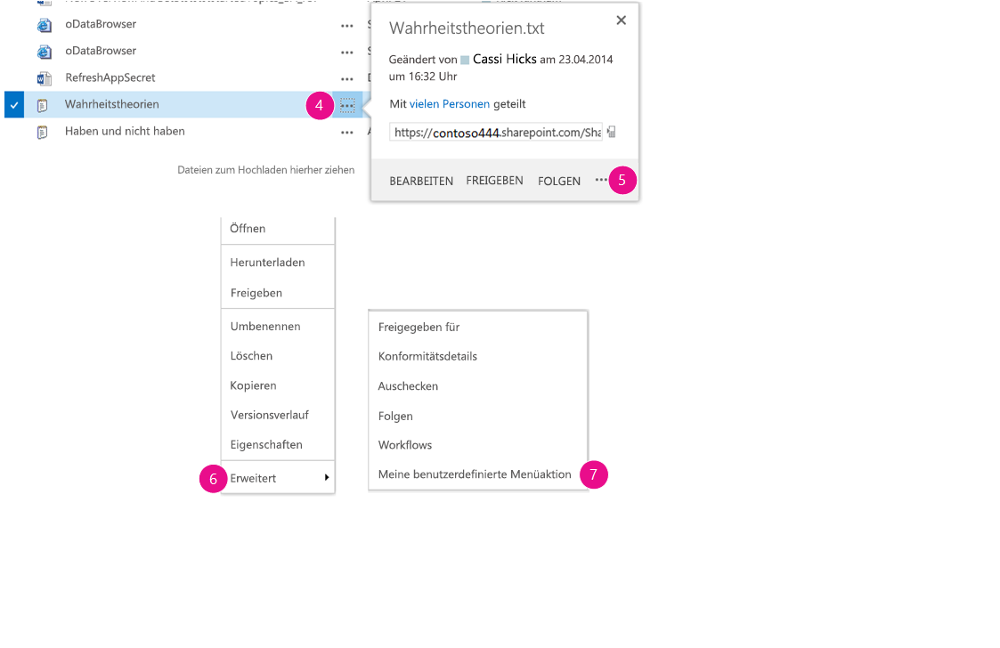
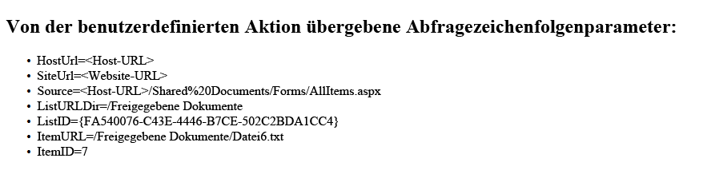
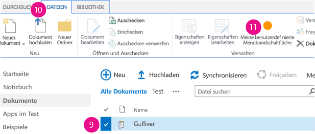

# Gewusst wie: Erstellen benutzerdefinierter Aktionen zur Bereitstellung mit Add-Ins für SharePoint
In diesem Artikel erfahren Sie, wie Sie eine benutzerdefinierte Aktion in SharePoint erstellen, die für das Hostweb bereitgestellt wird, wenn Sie ein SharePoint-Add-In bereitstellen.
Wenn Sie ein SharePoint-Add-In erstellen, ermöglichen Ihnen benutzerdefinierte Aktionen die Interaktion mit den Listen und dem Menüband im Hostweb. Eine benutzerdefinierte Aktion wird für das Hostweb bereitgestellt, wenn Endbenutzer Ihr Add-In installieren. Mithilfe benutzerdefinierter Aktionen ist es möglich, eine Remotewebseite zu öffnen und über die Abfragezeichenfolge Informationen zu übergeben. Es sind zwei Typen von benutzerdefinierten Aktionen für Add-Ins verfügbar: die benutzerdefinierten Aktionen Menüband undMenüelement.
  
    
    


## Voraussetzungen für die Verwendung der Beispiele in diesem Artikel
<a name="SP15Createcustomactionsapps_Prereq"> </a>

Sie benötigen eine Entwicklungsumgebung, wie unter  [Erste Schritte beim Erstellen von von einem Anbieter gehosteten SharePoint-Add-Ins](get-started-creating-provider-hosted-sharepoint-add-ins.md) erläutert.
  
    
    

### Kernkonzepte für ein besseres Verständnis von benutzerdefinierten Aktionen

In der folgenden Tabelle sind hilfreiche Artikel aufgeführt, die ein besseres Verständnis der Konzepte und Schritte bei einem Szenarium mit benutzerdefinierten Aktionen ermöglichen.
  
    
    

**Tabelle 1. Kernkonzepte für benutzerdefinierte Aktionen**


|**Artikel**|**Beschreibung**|
|:-----|:-----|
| [SharePoint-Add-Ins](sharepoint-add-ins.md) <br/> |Hier erhalten Sie Informationen über das neue Add-In-Modell in SharePoint, das es Ihnen ermöglicht, Add-Ins als kompakte, einfach zu verwendende Lösungen für Endbenutzer zu erstellen.  <br/> |
| [UX-Design für SharePoint-Add-Ins](ux-design-for-sharepoint-add-ins.md) <br/> |Hier erhalten Sie Informationen über die UX-Optionen (User Experience, Nutzungserfahrung), die beim Erstellen von SharePoint-Add-Ins zu Ihrer Verfügung stehen.  <br/> |
| [Hostwebsites, Add-In-Websites und SharePoint-Komponenten in SharePoint 2013](host-webs-add-in-webs-and-sharepoint-components-in-sharepoint-2013.md) <br/> |Hier erhalten Sie Informationen über den Unterschied zwischen einem Hostweb und einem Add-In-Web. Außerdem erfahren Sie, welche SharePoint-Komponenten in ein SharePoint-Add-In eingeschlossen werden können, welche Komponenten für das Hostweb bereitgestellt werden, welche Komponenten für das Add-In-Web bereitgestellt werden, und wie das Add-In-Web in einer isolierten Domäne bereitgestellt wird.  <br/> |
   

## Codebeispiel: Erstellen einer benutzerdefinierten Aktion in den Hostweb-Dokumentbibliotheken
<a name="SP15Createcustomactionsapps_Codeexample"> </a>

Führen Sie diese Schritte aus, um eine benutzerdefinierte Aktion in den Hostweb-Dokumentbibliotheken zu erstellen:
  
    
    

1. Erstellen Sie die SharePoint-Add-In- und Remotewebprojekte.
    
  
2. Fügen Sie dem SharePoint-Add-In-Projekt ein benutzerdefiniertes Feature hinzu.
    
  
3. Fügen Sie dem Webprojekt eine Add-In-Webseite hinzu.
    
  

### So erstellen Sie die SharePoint-Add-In- und Remotewebprojekte


1. Öffnen Sie Visual Studio als Administrator. (Klicken Sie dazu im **Startmenü** mit der rechten Maustaste auf das Symbol Visual Studio, und wählen Sie **Als Administrator ausführen** aus.)
    
  
2. Erstellen Sie das vom Anbieter gehostete SharePoint-Add-In, wie unter  [Erste Schritte beim Erstellen von von einem Anbieter gehosteten SharePoint-Add-Ins](get-started-creating-provider-hosted-sharepoint-add-ins.md) erläutert, und nennen Sie esCustomActionsApp. 
    
  

### So fügen Sie eine Add-In-Webseite für die benutzerdefinierten Aktionen hinzu


1. Klicken Sie nach dem Erstellen der Visual Studio-Lösung mit der rechten Maustasten auf das Webanwendungsprojekt (nicht das SharePoint-Add-In-Projekt), und fügen Sie ein neues Webformular hinzu, indem Sie **Hinzufügen** > **Neues Element** > **Web** > **Webformular** auswählen. Geben Sie dem Formular den NamenCustomActionTarget.aspx.
    
  
2. Ersetzen Sie in der Datei CustomActionTarget.aspx das gesamte **html**-Element und seine untergeordneten Elemente durch den folgenden HTML-Code. Behalten Sie das gesamte Markup oberhalb des **html**-Elements wie vorhanden bei. Der HTML-Code enthält JavaScript, das die folgenden Aufgaben durchführt:
    
  - Bereitstellung eines Platzhalters für die Parameter der Abfragezeichenfolge.
    
  
  - Extrahieren der Parameter aus der Abfragezeichenfolge.
    
  
  - Rendern der Parameter im Platzhalter.
    
  

    > **WICHTIG**
      > Die Token „ItemURL" und „ItemID" werden nur übergeben, wenn ein Element ausgewählt ist. In einer SharePoint-Add-In mit Produktionsqualität muss Ihr Code Situationen, in denen kein Element ausgewählt ist, verarbeiten können. In diesem Beispiel warnt der Code den Benutzer, dass kein Element ausgewählt wurde. 

  ```HTML
  
<html xmlns="http://www.w3.org/1999/xhtml">
<head>
    <title>Custom action target</title>
</head>
<body>
    <h2>Query string parameters passed by the custom action:</h2>

    <!-- Placeholder for query string parameters -->
    <ul id="qsparams"/>

    <!-- Main JavaScript function, renders
         the query string parameters -->
    <script lang="javascript">
        var params = document.URL.split("?")[1].split("&amp;");
        var paramsHTML = "";
      
        // Extracts the parameters from the query string.
        // Parameters are URLencoded, decode for rendering
        // in page.
        for (var i = 0; i < params.length; i = i + 1) {
            params[i] = decodeURIComponent(params[i]);
            paramsHTML += "<li>" + params[i] + "</li>";
        }

         // Alert the user when no item has been selected.
         // (The SPListItemId is the 5th parameter.)
         if (params[5] === undefined) {
            paramsHTML += "<div> <h3> No item has been selected from the list.  Please select an item. </h3> </div> ";
         }

        // Render parameters in the placeholder.
        document.getElementById("qsparams").innerHTML =
            paramsHTML;
    </script>
</body>
</html>
  ```


### So fügen Sie dem SharePoint-Add-In-Projekt eine benutzerdefinierte Menüelementaktion hinzu


1. Klicken Sie mit der rechten Maustaste auf das SharePoint-Add-In-Projekt, und wählen Sie **Hinzufügen** > **Neues Element** > **Office/SharePoint** > **Benutzerdefinierte Menüelementaktion** aus.
    
  
2. Übernehmen Sie den Standardnamen, und wählen Sie **Hinzufügen** aus.
    
  
3. Der Assistent **Benutzerdefinierte Aktion für ein Menüelement erstellen** stellt Ihnen eine Reihe von Fragen. Stellen Sie die Antworten aus der folgenden Tabelle bereit:
    
   **Tabelle 2: Eigenschaften der benutzerdefinierten Menüelementaktion**


|**Frage zur Eigenschaft**|**Antwort**|
|:-----|:-----|
|Wo soll die benutzerdefinierte Aktion bereitgestellt werden?  <br/> |Wählen Sie **Hostweb**.  <br/> |
|Wo ist die benutzerdefinierte Aktion zugeordnet?  <br/> |Wählen Sie **Listenvorlage**.  <br/> |
|Welchem bestimmten Element ist die benutzerdefinierte Aktion zugeordnet?  <br/> |Wählen Sie **Dokumentbibliothek**.  <br/> |
|Wie lautet der Text im Menüelement?  <br/> |Geben Sie **Meine benutzerdefinierte Aktion** ein. <br/> |
|Wohin navigiert die benutzerdefinierte Aktion?  <br/> |Wählen Sie die Seite **CustomActionAppWeb\\CustomActionTarget.aspx** aus. <br/> |
   
4. Wählen Sie **Fertig stellen** aus.
    
    Visual Studio generiert das folgende Markup in der Datei "elements.xml" des Features für die benutzerdefinierte Menüelementaktion:
    


  ```XML
  
<?xml version="1.0" encoding="utf-8"?>
<Elements 
    xmlns="http://schemas.microsoft.com/sharepoint/">
    <!-- RegistrationId attribute is the list type id,
        in this case, a document library (id=101). -->
  <CustomAction 
      Id="65695319-4784-478e-8dcd-4e541cb1d682.CustomAction"
      RegistrationType="List"
      RegistrationId="101"
      Location="EditControlBlock"
      Sequence="10001"
      Title="Invoke custom action">
    <!-- 
    Update the Url below to the page you want the custom action to use.
    Start the URL with the token ~remoteAppUrl if the page is in the
    associated web project, use ~appWebUrl if page is in the add-in project.
    -->
    <UrlAction Url=
"~remoteAppUrl/CustomActionTarget.aspx?{StandardTokens}&amp;amp;SPListItemId={ItemId}&amp;amp;SPListId={ListId}" />
  </CustomAction>
</Elements>

  ```

5. Fügen Sie die folgenden Abfrageparameter zum Ende des Attributs **Url** des Elements **UrlAction** hinzu:
    
     `&amp;amp;SPSource={Source}&amp;amp;SPListURLDir={ListUrlDir}&amp;amp;SPItemURL={ItemUrl}`
    
    Das Element **UrlAction** sollte wie folgt aussehen:
    
     ` <UrlAction Url= "~remoteAppUrl/CustomActionTarget.aspx?{StandardTokens}&amp;amp;SPListItemId={ItemId}&amp;amp;SPListId={ListId}&amp;amp;SPSource={Source}&amp;amp;SPListURLDir={ListUrlDir}&amp;amp;SPItemURL={ItemUrl}" />`
    
  

> **HINWEIS**
> In diesem Beispiel wird die Remotewebseite in einem vollständigen Fenster geöffnet, wenn der Benutzer die benutzerdefinierte Aktion aus dem Menü auswählt. Benutzerdefinierte Menüaktionen können eine Remotewebseite auch in einem Dialogfeld öffnen, indem Sie das Attribut **HostWebDialog** verwenden. Weitere Informationen finden Sie unter [SharePoint-Add-In-Lokalisierung](https://github.com/OfficeDev/SharePoint-Add-in-Localization). 
  
    
    


### So fügen Sie dem SharePoint-Add-In-Projekt eine benutzerdefinierte Menübandaktion hinzu


1. Klicken Sie mit der rechten Maustaste auf das SharePoint-Add-In-Projekt, und wählen Sie **Hinzufügen** > **Neues Element** > **Office/SharePoint** > **Benutzerdefinierte Menübandaktion** aus.
    
  
2. Übernehmen Sie den Standardnamen, und wählen Sie **Hinzufügen** aus.
    
  
3. Der Assistent **Benutzerdefinierte Aktion für das Menüband erstellen** stellt Ihnen eine Reihe von Fragen. Stellen Sie die Antworten aus der folgenden Tabelle bereit:
    
   **Tabelle 3: Eigenschaften der benutzerdefinierten Menübandaktion**


|**Frage zur Eigenschaft**|**Antwort**|
|:-----|:-----|
|Wo soll die benutzerdefinierte Aktion bereitgestellt werden?  <br/> |Wählen Sie **Hostweb**.  <br/> |
|Wo ist die benutzerdefinierte Aktion zugeordnet?  <br/> |Wählen Sie **Listenvorlage**.  <br/> |
|Welchem bestimmten Element ist die benutzerdefinierte Aktion zugeordnet?  <br/> |Wählen Sie **Dokumentbibliothek**.  <br/> |
|Wo befindet sich das Steuerelement?  <br/> |Wählen Sie **Ribbon.Documents.Manage**.  <br/> |
|Wie lautet der Text im Menüelement?  <br/> |Geben Sie **Meine benutzerdefinierte Menübandschaltfläche** ein. <br/> |
|Wohin navigiert die benutzerdefinierte Aktion?  <br/> |Wählen Sie die Seite **CustomActionAppWeb\\CustomActionTarget.aspx** aus. <br/> |
   
4. Visual Studio generiert das folgende Markup in der Datei "elements.xml" des Features für die benutzerdefinierte Menübandaktion:
    
  ```XML
  
<?xml version="1.0" encoding="utf-8"?>
<Elements xmlns="http://schemas.microsoft.com/sharepoint/">
  <CustomAction Id="85691508-c076-4f43-93d4-96b4d5253a09.RibbonCustomAction1"
                RegistrationType="List"
                RegistrationId="101"
                Location="CommandUI.Ribbon"
                Sequence="10001"
                Title="Invoke &amp;apos;RibbonCustomAction1&amp;apos; action">
    <CommandUIExtension>
      <!-- 
      Update the UI definitions below with the controls and the command actions
      that you want to enable for the custom action.
      -->
      <CommandUIDefinitions>
        <CommandUIDefinition Location="Ribbon.Documents.Manage.Controls._children">
          <Button Id="Ribbon.Documents.Manage.RibbonCustomAction1Button"
                  Alt="My Custom Ribbon Button"
                  Sequence="100"
                  Command="Invoke_RibbonCustomAction1ButtonRequest"
                  LabelText="My Custom Ribbon Button"
                  TemplateAlias="o1"
                  Image32by32="_layouts/15/images/placeholder32x32.png"
                  Image16by16="_layouts/15/images/placeholder16x16.png" />
        </CommandUIDefinition>
      </CommandUIDefinitions>
      <CommandUIHandlers>
        <CommandUIHandler Command="Invoke_RibbonCustomAction1ButtonRequest"
                          CommandAction="~remoteAppUrl/CustomActionTarget.aspx?{StandardTokens}&amp;amp;SPListItemId={SelectedItemId}&amp;amp;SPListId={SelectedListId}"/>
      </CommandUIHandlers>
    </CommandUIExtension >
  </CustomAction>
</Elements> 

  ```

5. Fügen Sie die folgenden Abfrageparameter zum Ende des Attributs **CommandAction** des Elements **CommandUIHandler** hinzu:
    
     `&amp;amp;SPSource={Source}&amp;amp;SPListURLDir={ListUrlDir}`
    
    Das Element **CommandUIHandler** sollte wie folgt aussehen:
    
     ` <CommandUIHandler Command="Invoke_RibbonCustomAction1ButtonRequest" CommandAction="~remoteAppUrl/CustomActionTarget.aspx?{StandardTokens}&amp;amp;SPListItemId={SelectedItemId}&amp;amp;SPListId={SelectedListId}&amp;amp;SPSource={Source}&amp;amp;SPListURLDir={ListUrlDir}" />`
    
    > **HINWEIS**
      > Benutzerdefinierte Menübandaktionen verwenden **SelectedListId** und **SelectedItemId**. **ListId** und **ItemId** werden nur mit benutzerdefinierten Menüelementaktionen verwendet.

### Festlegen der Add-In-Startseite auf die Hostweb-Startseite


1. Das fortlaufende Beispiel-SharePoint-Add-In verfügt nicht über ein Add-In-Web, und die Remotewebanwendung ist nur für das Hosten des Formulars vorhanden. Deshalb sollte die Startseite des Add-Ins auf die Startseite des Hostwebs festgelegt werden. 
    
    Wählen Sie zunächst das SharePoint-Add-In-Projekt (nicht das Webanwendungsprojekt) im **Projektmappen-Explorer** aus, und kopieren Sie den Wert der Eigenschaft **Website-URL**, einschließlich des Protokolls (z. B. **https://contoso.sharepoint.com**), in die Zwischenablage. 
    
  
2. Öffnen Sie das Add-In-Manifest, und fügen Sie die URL in das Feld **Startseite** ein.
    
  
3. Optional können Sie die Seite „Default.aspx" aus dem Webanwendungsprojekt löschen, da sie nicht in der SharePoint-Add-In verwendet wird.
    
  

### So erstellen und führen Sie die Lösung aus


1. Drücken Sie die Taste F5.
    
    > **HINWEIS**
      > Wenn Sie F5 drücken, erstellt Visual Studio die Lösung, stellt das Add-In bereit und öffnet die Berechtigungsseite für das Add-In. 
2. Klicken Sie auf die Schaltfläche **Vertrauen**. Die Standardseite Ihrer Entwicklerwebsite wird geöffnet.
    
  
3. Navigieren Sie zu einer beliebigen Dokumentbibliothek im Hostweb.
    
   **Starten einer benutzerdefinierten Menüaktion**

  

     
  

  

  
4. Klicken Sie auf die Popupschaltfläche ( **...**) für ein beliebiges Dokument. Das Popup wird geöffnet.
    
  
5. Klicken Sie auf die Popupschaltfläche ( **...**) im Popup. 
    
  
6. Wählen Sie **Erweitert** aus.
    
  
7. Wählen Sie im Kontextmenü die Option **Meine benutzerdefinierte Menüaktion** aus. Auf der sich öffnenden Remotewebseite sollte etwas wie Folgendes angezeigt werden:
    
   **Remotewebseite mit Parametern der benutzerdefinierten Aktion**

  

     
  

  

  
8. Klicken Sie auf die Schaltfläche **Zurück** in Ihrem Browser, um zur Bibliothek zurückzukehren.
    
   **Starten einer benutzerdefinierten Menübandaktion**

  

     
  

  

  
9. Wählen Sie ein beliebiges Dokument aus.
    
  
10. Öffnen Sie die Registerkarte **Datei** im Menüband.
    
  
11. Wählen Sie **Meine benutzerdefinierte Menübandschaltfläche** aus. Dieselbe Remotewebseite wird angezeigt.
    
  

**Tabelle 4: Problembehandlung für die Lösung**


|**Problem**|**Lösung**|
|:-----|:-----|
|Visual Studio öffnet den Browser nicht, nachdem Sie F5 gedrückt haben.  <br/> |Legen Sie das SharePoint-Add-In-Projekt als Startprojekt fest.  <br/> |
|Die Token in der URL werden nicht aufgelöst, nachdem Sie in Visual Studio F5 gedrückt haben.  <br/> |Wechseln Sie zur Seite **Websiteinhalt** im Hostweb, und klicken Sie auf das Symbol für Ihr Add-In. <br/> |
   

## Nächste Schritte
<a name="SP15Createcustomactionsapps_Nextsteps"> </a>

In diesem Artikel wurde die Vorgehensweise zum Erstellen einer benutzerdefinierten Aktion in einem SharePoint-Add-In beschrieben. Als nächsten Schritt können Sie sich über andere UX-Komponenten informieren, die für SharePoint-Add-Ins verfügbar sind. Weitere Informationen hierzu finden Sie unter:
  
    
    

-  [Codebeispiel: Öffnen einer Remote-Add-In-Webseite mit einer benutzerdefinierten ECB-Aktion](http://code.msdn.microsoft.com/SharePoint-2013-Open-e0ca1826)
    
  
-  [SharePoint-Add-In-Lokalisierung](https://github.com/OfficeDev/SharePoint-Add-in-Localization)
    
  
-  [Codebeispiel: Verwenden von benutzerdefinierten Aktionen und der domänenübergreifenden Bibliothek zum Bestellen von Büchern](http://code.msdn.microsoft.com/SharePoint-2013-Open-a-36d1598d)
    
  
-  [Verwenden des Stylesheets einer SharePoint-Website in Add-Ins für SharePoint](use-a-sharepoint-website-s-style-sheet-in-sharepoint-add-ins.md)
    
  
-  [Verwenden des Client-Chromsteuerelements in Add-Ins für SharePoint](use-the-client-chrome-control-in-sharepoint-add-ins.md)
    
  
-  [Erstellen von Add-In-Webparts zur Installation mit Ihrem SharePoint-Add-In](create-add-in-parts-to-install-with-your-sharepoint-add-in.md)
    
  

## Weitere Informationsquellen
<a name="SP15Createcustomactionsapps_AddResources"> </a>


-  [Einrichten einer lokalen Entwicklungsumgebung für SharePoint-Add-Ins](set-up-an-on-premises-development-environment-for-sharepoint-add-ins.md)
    
  
-  [UX-Design für SharePoint-Add-Ins](ux-design-for-sharepoint-add-ins.md)
    
  
-  [Designrichtlinien für die Benutzerfreundlichkeit von Add-Ins für SharePoint](sharepoint-add-ins-ux-design-guidelines.md)
    
  
-  [Erstellen von UX-Komponenten in SharePoint 2013](create-ux-components-in-sharepoint-2013.md)
    
  
-  [Drei Ansätze, um Entwurfsentscheidungen für Add-Ins für SharePoint zu treffen](three-ways-to-think-about-design-options-for-sharepoint-add-ins.md)
    
  
-  [Wichtige Aspekte der Architektur und Entwicklungslandschaft von Add-Ins für SharePoint](important-aspects-of-the-sharepoint-add-in-architecture-and-development-landscap.md)
    
  

