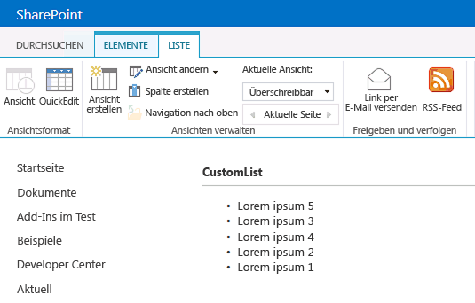

# Anpassen einer Listenansicht in Add-Ins für SharePoint durch clientseitiges Rendering
In diesem Artikel erfahren Sie, wie Sie eine Listenansicht einer in SharePoint gehosteten App mithilfe der clientseitigen Renderingtechnologie in SharePoint 2013 anpassen.
In SharePoint 2013 stellt das clientseitige Rendering eine Möglichkeit dar, wie Sie selbst Ausgaben für eine Gruppe von Steuerelementen, die in einer SharePoint-Seite gehostet werden, erzeugen können. Es ermöglicht Ihnen, weit verbreitete Technologien wie HTML und JavaScript zum Definieren der Renderinglogik von SharePoint-Listenansichten zu verwenden. Beim clientseitigen Rendering können Sie selbst JavaScript-Ressourcen definieren und sie in den für Ihre Apps verfügbaren Datenspeicheroptionen hosten, beispielsweise in einer Dokumentbibliothek. Eine von SharePoint gehostete App enthält nur SharePoint-Komponenten. Die Ressourcen einer von SharePoint gehosteten App befinden sich auf einer isolierten Unterwebsite des Hostwebs, die als App-Web bezeichnet wird.


## Voraussetzungen für die Verwendung der Beispiele in diesem Artikel
<a name="SP15CSRlistview_Prereq"> </a>

Um die Schritte in diesem Beispiel auszuführen, benötigen Sie Folgendes:


-  [Visual Studio 2015 und die neuesten Microsoft Office Developer Tools ](https://www.visualstudio.com/features/office-tools-vs)


- Eine SharePoint 2013 Entwicklungsumgebung (Add-In-Isolierung für lokale Szenarien erforderlich)


Anleitungen zum Einrichten einer Entwicklungsumgebung, die Ihren Anforderungen entspricht, finden Sie unter  [Erste Schritte beim Erstellen von Apps für Office und SharePoint](http://msdn.microsoft.com/library/187f8c8c-1b15-471c-80b5-69a40e67deea%28Office.15%29.aspx).


### Kernkonzepte zum Verständnis der Anpassung von Listenansichten mittels clientseitigem Rendering

Die folgende Tabelle enthält eine Liste hilfreicher Artikel, die es Ihnen erleichtern können, die für die Anpassung von Listenansichten relevanten Konzepte zu verstehen.


**Tabelle 1. Kernkonzepte für die Anpassung von Listenansichten in einer App**


|**Titel des Artikels**|**Beschreibung**|
|:-----|:-----|
| [SharePoint-Add-Ins](sharepoint-add-ins.md) <br/> |In diesem Artikel erfahren Sie mehr über das neue App-Modell in Microsoft SharePoint 2013, das Sie zur Erstellung von Apps verwenden können, die einfache, benutzerfreundliche Lösungen für Endbenutzer darstellen.  <br/> |
| [UX-Design für SharePoint-Add-Ins](ux-design-for-sharepoint-add-ins.md) <br/> |Hier erhalten Sie Informationen zu den UX-Optionen, die Ihnen beim Erstellen von SharePoint-Add-Ins zur Verfügung stehen.  <br/> |
| [Hostwebsites, Add-In-Websites und SharePoint-Komponenten in SharePoint 2013](host-webs-add-in-webs-and-sharepoint-components-in-sharepoint-2013.md) <br/> |In diesem Artikel erfahren Sie, welche Unterschiede zwischen Hostwebs und App-Webs bestehen. Sie erfahren zudem, welche SharePoint 2013-Komponenten in eine SharePoint-Add-In aufgenommen werden können, welche Komponenten für das Hostweb und welche für das App-Web bereitgestellt werden und wie das App-Web in einer isolierten Domäne bereitgestellt wird.  <br/> |
 

## Codebeispiel: Customize a list view by using client-side rendering
<a name="SP15CSRlistview_Codeexample"> </a>

Um eine Listenansicht anzupassen, die mittels clientseitigem Rendering im App-Web bereitgestellt wird, führen Sie folgende Schritte aus:


1. Erstellen Sie das SharePoint-Add-In-Projekt.


2. Erstellen Sie eine neue Listendefinition mit einer benutzerdefinierten Ansicht.


3. Stellen Sie die benutzerdefinierte Renderinglogik in einer JavaScript-Datei bereit.


Abbildung 1 zeigt eine clientseitig gerenderte Ansicht einer Liste mit Ankündigungen.


**Abbildung 1. Benutzerdefinierte Ansicht einer Liste mit Ankündigungen**





### So erstellen Sie das SharePoint-Add-In-Projekt


1. Öffnen Sie Visual Studio 2015 als Administrator. (Klicken Sie dazu im Menü **Start** mit der rechten Maustaste auf das Symbol für **Visual Studio**, und wählen Sie **Als Administrator ausführen** aus.)


2. Erstellen Sie ein neues Projekt unter Verwendung der Vorlage **SharePoint-Add-In**.

    Abbildung 2 zeigt den Speicherort der Vorlage **SharePoint-Add-In** in Visual Studio 2015 unter **Vorlagen**, **Visual C#**, **Office/SharePoint**, **Office-Add-Ins**.


   **Abbildung 2. App für SharePoint 2013 Visual Studio-Vorlage**


!\[Speicherort der Vorlage "App für SharePoint 2013 Visual Studio"](images/AppForSharePointVSTemplate.PNG)


3. Geben Sie die URL der SharePoint-Website an, die Sie für das Debugging verwenden möchten.


4. Wählen Sie **Von SharePoint gehostet** Hostingoption für Ihre App.


### So erstellen Sie eine neue Listendefinition


1. Klicken Sie mit der rechten Maustaste auf das SharePoint-Add-In-Projekt, und fügen Sie dann ein neues Element vom Typ **Liste** hinzu. Erstellen Sie eine anpassbare Liste, die auf "Announcements" basiert.


2. Kopieren Sie das folgende Markup, und fügen Sie es in das **Views**-Element der Datei **Schema.xml** des Listenelements ein. Das Markup führt folgende Aufgaben aus:

  - Deklarieren einer neuen Ansicht namens **Overridable** mit der BaseViewID 2.


  - Bereitstellen eines Werts für das **JSLink**-Element, das auf eine JavaScript-Datei zeigt, die zusammen mit der App bereitgestellt wird.

    > **HINWEIS**
      > The JSLink property is not supported on Survey or Events lists. A SharePoint calendar is an Events list. 

  ```XML

<View BaseViewID="2"
      Name="8d2719f3-c3c3-415b-989d-33840d8e2ddb" 
      DisplayName="Overridable" 
      Type="HTML" 
      WebPartZoneID="Main" 
      SetupPath="pages\\viewpage.aspx" 
      Url="Overridable.aspx"
      DefaultView="TRUE">
  <ViewFields>
    <FieldRef Name="Title" />
  </ViewFields>
  <Query />
  <Toolbar Type="Standard" />
  <XslLink>main.xsl</XslLink>
  <JSLink Default="TRUE">~site/Scripts/CSRListView.js</JSLink>
</View>
  ```


### So stellen Sie eine benutzerdefinierte Renderinglogik in einer JavaScript-Datei bereit


1. Klicken Sie mit der rechten Maustaste auf den Ordner **Skripts**, und fügen Sie eine neue JavaScript-Datei ein. Geben Sie der Datei den Namen CSRListView.js.


2. Kopieren Sie den folgenden Code, und fügen Sie ihn in die Datei **CSRListView.js** ein. Der Code führt folgende Aufgaben aus:

  - Bereitstellen von Ereignishandlern für die Ereignisse **PreRender** und **PostRender**


  - Bereitstellen von Vorlagen für die Vorlagensätze Header, Footer und Item.


  - Registrieren der Vorlagen


  ```

(function () {
    // Initialize the variable that stores the objects.
    var overrideCtx = {};
    overrideCtx.Templates = {};

    // Assign functions or plain html strings to the templateset objects:
    // header, footer and item.
    overrideCtx.Templates.Header = "<B><#=ctx.ListTitle#></B>" +
        "<hr><ul id='unorderedlist'>";

    // This template is assigned to the CustomItem function.
    overrideCtx.Templates.Item = customItem;
    overrideCtx.Templates.Footer = "</ul>";

    // Set the template to the:
    //  Custom list definition ID
    //  Base view ID
    overrideCtx.BaseViewID = 2;
    overrideCtx.ListTemplateType = 10057;

    // Assign a function to handle the
    // PreRender and PostRender events
    overrideCtx.OnPreRender = preRenderHandler;
    overrideCtx.OnPostRender = postRenderHandler;

    // Register the template overrides.
    SPClientTemplates.TemplateManager.RegisterTemplateOverrides(overrideCtx);
})();

// This function builds the output for the item template.
// It uses the context object to access announcement data.
function customItem(ctx) {

    // Build a listitem entry for every announcement in the list.
    var ret = "<li>" + ctx.CurrentItem.Title + "</li>";
    return ret;
}

// The preRenderHandler attends the OnPreRender event
function preRenderHandler(ctx) {

    // Override the default title with user input.
    ctx.ListTitle = prompt("Type a title", ctx.ListTitle);
}

// The postRenderHandler attends the OnPostRender event
function postRenderHandler(ctx) {

    // You can manipulate the DOM in the postRender event
    var ulObj;
    var i, j;

    ulObj = document.getElementById("unorderedlist");

    // Reverse order the list.
    for (i = 1; i < ulObj.children.length; i++) {
        var x = ulObj.children[i];
        for (j = 1; j < ulObj.children.length; j++) {
            var y = ulObj.children[j];
            if(x.innerText<y.innerText){              
                ulObj.insertBefore(y, x);
            }
        }
    }
}
  ```


### So erstellen Sie die Lösung und führen Sie sie aus


1. Drücken Sie F5.

    > **HINWEIS**
      > Wenn Sie F5 drücken, erstellt Visual Studio die Lösung, stellt die App bereit und öffnet die Berechtigungsseite für die App. 
2. Klicken Sie auf die Schaltfläche **Vertrauen**.


3. Navigieren Sie zu der benutzerdefinierten Liste, indem Sie die Adresse  _/Lists/<your_list_instance>_ relativ zum App-Verzeichnis in der App-Webdomäne (nicht der Hostwebdomäne) eingeben. Fügen Sie eine oder zwei Ankündigungen hinzu. Wählen Sie im Menüband die Ansicht **Überschreibbar** aus.


## Nächste Schritte
<a name="SP15CSRlistview_Nextsteps"> </a>

In diesem Artikel wird gezeigt, wie Sie mithilfe des clientseitigen Renderings eine Listenansicht in einer SharePoint-Add-In anpassen können. Als Nächstes können Sie sich über andere UX-Komponenten informieren, die für SharePoint-Add-Ins verfügbar sind. Nähere Einzelheiten finden Sie unter:


-  [Code sample: Customize a list view in an add-in using client-side rendering](http://code.msdn.microsoft.com/SharePoint-2013-Customize-61761017)


-  [Verwenden des Stylesheets einer SharePoint-Website in Add-Ins für SharePoint](use-a-sharepoint-website-s-style-sheet-in-sharepoint-add-ins.md)


-  [Verwenden des Client-Chromsteuerelements in Add-Ins für SharePoint](use-the-client-chrome-control-in-sharepoint-add-ins.md)


-  [Gewusst wie: Erstellen benutzerdefinierter Aktionen zur Bereitstellung mit Add-Ins für SharePoint](create-custom-actions-to-deploy-with-sharepoint-add-ins.md)


-  [Erstellen von Add-In-Webparts zur Installation mit Ihrem SharePoint-Add-In](create-add-in-parts-to-install-with-your-sharepoint-add-in.md)


## Zusätzliche Ressourcen
<a name="SP15CSRlistview_AddResources"> </a>


-  [Einrichten einer lokalen Entwicklungsumgebung für SharePoint-Add-Ins](set-up-an-on-premises-development-environment-for-sharepoint-add-ins.md)


-  [UX-Design für SharePoint-Add-Ins](ux-design-for-sharepoint-add-ins.md)


-  [Erstellen von UX-Komponenten in SharePoint 2013](create-ux-components-in-sharepoint-2013.md)


-  [Drei Ansätze, um Entwurfsentscheidungen für Add-Ins für SharePoint zu treffen](three-ways-to-think-about-design-options-for-sharepoint-add-ins.md)


-  [Wichtige Aspekte der Architektur und Entwicklungslandschaft von Add-Ins für SharePoint](important-aspects-of-the-sharepoint-add-in-architecture-and-development-landscap.md)


