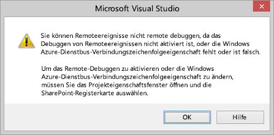
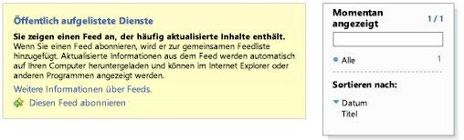

# Debugging und Problembehandlung eines Remoteereignisempfängers in einem Add-In für SharePoint
Einrichten der Entwicklungsumgebung zum Debuggen von Remoteereignissen in mithilfe von Visual Studio.
## Konfigurieren des Debuggens für eine SharePoint-Remotetestwebsite

> [!HINWEIS]
> Die Verfahren in diesem Abschnitt gelten nur, wenn sich die SharePoint-Testwebsite auf einem anderen Computer als Visual Studio befindet (oder wenn Sie eine SharePoint Online-Entwicklerwebsite als Testwebsite verwenden). Wenn sich SharePoint und Visual Studio auf demselben Computer befinden, überspringen Sie diesen Abschnitt. 
  
    
    

Wenn ein SharePoint-Add-In-Projekt in Visual Studio einen Remoteereignisempfänger (RER) oder einen Add-In-Ereignisempfänger enthält, müssen Sie einige zusätzliche schnelle Konfigurationsschritte in den Projekteigenschaften vornehmen, bevor Sie das Add-In mit (F5) debuggen können. Für diese Konfiguration ist wiederum eine Azure-Konfigurationsänderung erforderlich. Sie müssen die Azure-Konfiguration nicht für jedes Projekt mit einem RER oder einem Add-In-Ereignisempfänger wiederholen. (Wenn das Add-In einen AppInstalled-Ereignishandler enthält, wird das Add-In sogar erst mit F5 oder STRG+F5 [Ausführen ohne Debuggen] ausgeführt, nachdem Sie die in diesem Abschnitt beschriebene Konfiguration durchgeführt haben.)
  
    
    

### Konfigurieren von Azure

1. Erwerben Sie ein Microsoft Azure-Abonnement, falls noch nicht geschehen. Ein solches Abonnement ist beispielsweise als Zusatz in einem  [MSDN-Abonnement](http://azure.microsoft.com/de-de/pricing/member-offers/msdn-benefits/) enthalten.
    
  
2. Führen Sie die Anweisungen in  [How To: Create or Modify a Service Bus Service Namespace](http://msdn.microsoft.com/library/fa561f70-007c-45aa-b34d-56317dbbfc87.aspx) aus.
    
  

### So konfigurieren Sie das SharePoint-Add-In-Projekt in Visual Studio

1. Sie sollten über die neueste Version von Office Developer Tools für Visual Studio 2013 verfügen,  [führen Sie daher das WebPI-Installationsprogramm hier](http://aka.ms/OfficeDevToolsForVS2013) aus oder [Installationsprogramm für Office Developer Tools für Visual Studio 2015](http://aka.ms/OfficeDevToolsForVS2015). .
    
  
2. Klicken Sie nach dem Hinzufügen eines RER oder eines Add-In-Ereignishandlers zu einem SharePoint-Add-In-Projekt in Visual Studio mit der rechten Maustaste auf das Projekt im **Projektmappen-Explorer**, und wählen Sie **Eigenschaften** aus.
    
  
3. Öffnen Sie im Eigenschaftenbereich die Registerkarte **SharePoint**, und führen Sie einen Bildlauf nach unten aus. 
    
  
4. Wählen Sie das Kontrollkästchen **Debuggen über Microsoft Azure Service Bus aktivieren**.
    
  
5. Geben Sie die vollständige Verbindungszeichenfolge in das bereitgestellte Textfeld ein. Sie erhalten die Zeichenfolge mit den folgenden Schritten.
    
1. Melden Sie sich beim Azure-Portal an, und öffnen Sie die Registerkarte **Service Bus**.
    
  
2. Öffnen Sie den Namespace, den Sie für das RER-Debugging erstellt haben, und navigieren Sie zu der Verbindungszeichenfolge. Die Benutzeroberfläche des Azure-Portals ändert sich häufig. Wenn Sie die Verbindungszeichenfolgen nicht finden können, finden Sie weitere Informationen in der  [Hilfe zum Azure-Portal](https://msdn.microsoft.com/de-de/library/azure/dn578292.aspx).
    
  
3. Kopieren Sie die **SAS**-Verbindungszeichenfolge. Das ist die Zeichenfolge, die Sie in den Visual Studio-Projekteigenschaften eingegeben haben.
    
  
Wen Sie in Zukunft SharePoint-Add-In-Projekte in Visual Studio erstellen, sind diese Informationen bereits ausgefüllt, sodass Sie nicht jedes Mal das Azure-Portal öffnen müssen.
## Testen der Konfiguration

Verwenden Sie die Verfahren in diesem Abschnitt, um sicherzustellen, dass Sie ein RER debuggen können.
  
    
    

### So erstellen Sie ein Remoteereignisempfängerprojekt

1. Erstellen Sie in Visual Studio eine vom Anbieter gehostete SharePoint-Add-In.
    
    Weitere Informationen dazu finden Sie unter  [Erste Schritte beim Erstellen von von einem Anbieter gehosteten SharePoint-Add-Ins](get-started-creating-provider-hosted-sharepoint-add-ins.md).
    
  
2. Wählen Sie im **Projektmappen-Explorer** den Knoten des Add-In-Projekts aus.
    
  
3. Wählen Sie in der Menüleiste **Projekt**, **Neues Element hinzufügen** aus.
    
  
4. Wählen Sie im Bereich **Vorlagen** die Vorlage **"Liste"** aus, und wählen Sie dann die Schaltfläche **Hinzufügen** aus.
    
  
5. Wählen Sie die Schaltfläche **Fertig stellen** aus, um dem Add-In-Projekt eine benutzerdefinierte Standardliste hinzuzufügen.
    
  
6. Fügen Sie im Add-In-Projekt ein weiteres Element hinzu, indem Sie im Bereich **Vorlagen** die Vorlage **Remoteereignisempfänger** auswählen.
    
  
7. Lassen Sie den Standardnamen im Feld **Name** unverändert (RemoteEventReceiver1), und wählen Sie dann **Hinzufügen** aus.
    
  
8. Wählen Sie in der Liste **Welchen Typ soll der Ereignisempfänger aufweisen?** die Option **Listenelementereignisse** aus.
    
    Belassen Sie die Ereignisquelle als **List1**, die Liste, die Sie im vorhergehenden Schritt hinzugefügt haben.
    
  
9. Wählen Sie in der Liste **Die folgenden Ereignisse behandeln** die Option **Ein Element wird hinzugefügt** aus, und klicken Sie anschließend auf **Fertig stellen**.
    
    Der Webanwendung wird ein Webdienst zur Behandlung des von Ihnen angegebenen Remoteereignisses hinzugefügt. Der SharePoint-Add-In wird ein Remoteereignisempfänger hinzugefügt. Der Empfänger referenziert den Webdienst und das Listenelementereignis in der Datei "Elements.xml" des Ereignisempfängers.
    
  
10. Öffnen Sie im Add-In-Projekt die Datei "AppManifest.xml".
    
  
11. Ändern Sie die Startseite in die Seite der Liste:  _AddInProjectName_/Lists/List1.
    
    Ersetzen Sie  _AddInProjectName_ durch den Namen des Add-In-Projekts, z. B.SharePointAddIn4/Lists/List1. Bei diesem Beispiel legen wir die Seite der Liste als Startseite fest. Bei einem typischen Add-In würden Sie allerdings wahrscheinlich auf Ihre eigene UI auf der Webprojektseite verweisen.
    
  

### So führen Sie das Debuggen des Ereignishandlers aus und testen es

1. Schließen Sie, falls noch nicht geschehen, das im früheren Verlauf dieses Artikels beschriebene Verfahren **So konfigurieren Sie das SharePoint-Add-In-Projekt in Visual Studio** ab.
    
  
2. Öffnen Sie im Webprojekt den Remoteereignisempfänger-Dienst (RemoteEventReceiver1.svc), und fügen Sie dann in der  `ProcessEvent()`-Methode in eine beliebige Codezeile einen Haltepunkt ein.
    
  
3. Drücken Sie **F5**, um das Projekt auszuführen.
    
  
4. Wählen Sie die Schaltfläche **Neues Element hinzufügen** aus, um der Liste ein neues Element hinzuzufügen.
    
  
5. Geben Sie für das Element eine Bezeichnung an, und wählen Sie dann die Schaltfläche **Speichern** aus.
    
    Der Haltepunkt, den Sie zum Remoteereignisempfänger hinzugefügt haben, wird erreicht, was bestätigt, dass Sie den Remoteereignisempfänger debuggen.
    
  
6. Wählen Sie die Taste **F5** aus, um das Projekt weiter auszuführen, und halten Sie dann das Debuggen an, wenn Sie fertig sind.
    
  

## Aktivieren/Deaktivieren der Benachrichtigung durch Visual Studio, dass das Ereignisdebugging konfiguriert werden muss

Wenn Ihr Projekt ein Remoteereignis umfasst und Sie das Remotedebugging nicht konfiguriert haben, fordert Visual Studio Sie zum Konfigurieren von Remoteereignisdebugging auf (siehe Abbildung 1). Sie können dieses Verhalten ändern, indem Sie das Kontrollkästchen **Mich benachrichtigen, wenn Remoteereignisdebugging nicht konfiguriert ist** auf der Registerkarte **SharePoint** deaktivieren.
  
    
    

**Abbildung 1: Benachrichtigung zum Remoteereignisdebugging**

  
    
    

  
    
    

  
    
    

  
    
    

  
    
    

## Sicherstellen, dass der Dienst im Servicebus gehostet wird

Nachdem Sie F5 gedrückt und dem Add-In vertraut haben, wechseln Sie in Ihrem Browser zum Servicebus-Namespace. Beispiel: http://mynamespace.servicebus.windows.net und Ihr Endpunkt als Zahl. Abbildung 2 zeigt, wie die Seite aussieht, wenn ein Namespace  *nicht*  aufgeführt ist, d. h. bevor Sie F5 drücken.
  
    
    

**Abbildung 2: Navigieren zum Servicebus-Namespace**

  
    
    

  
    
    

  
    
    

  
    
    

  
    
    

## RER erreicht nicht den Haltepunkt

Je nach Ereignis kann das Remoteereignis synchron oder asynchron sein. Bei einem asynchronen Ereignis dauert es möglicherweise einige Sekunden oder mehr, bis der Haltepunkt erreicht wird.
  
    
    

## Fehler: "Es war kein abhörender Endpunkt vorhanden"

Wenn Ihr Handler in der Produktionsumgebung ausgeführt wird, erhalten Sie die folgende Fehlermeldung:
  
    
    
"Das Aufrufen des Remoteereignisempfängers ist fehlgeschlagen. Details: An https:// _{domain}_: _nnnnn_/ _{path}_/AppEventReceiver.svc war kein abhörender Endpunkt vorhanden, der die Nachricht annehmen konnte. Dies wird häufig durch eine fehlerhafte Adresse oder SOAP-Aktion verursacht."  _nnnnn_ steht dabei für einen Port.
  
    
    
SharePoint erfordert, dass kein expliziter Port in der URL des Handlers in der Produktion verwendet wird. Dies bedeutet, dass Sie entweder Port 443 für HTTPS (Empfehlung) oder Port 80 für HTTP verwenden müssen. 
  
    
    

## Fehler: "Es konnte keine Vertrauensstellung für den sicheren SSL/TLS-Channel mit Autorität eingerichtet werden."

Wenn Ihr Handler in der Produktionsumgebung ausgeführt wird, erhalten Sie die folgende Fehlermeldung:
  
    
    
"Das Aufrufen des Remoteereignisempfängers ist fehlgeschlagen. Details: Es konnte keine Vertrauensstellung für den sicheren SSL/TLS-Channel mit Autorität eingerichtet werden.
  
    
    
Wenn sich das Add-In in Microsoft SharePoint Online befindet, der Remoteereignisempfänger-Dienst jedoch lokal ist und wie empfohlen HTTPS verwendet, kann der Server, auf dem der Empfänger gehostet wird, kein selbst signiertes Zertifkat in der Produktion verwenden. Der Server benötigt ein öffentlich akzeptiertes Zertifikat von einer Zertifizierungsstelle. Wenn sich das Add-In in einer lokalen SharePoint-Farm befindet, sind selbst signierte Zertifikate akzeptabel.
  
    
    

## Zusätzliche Ressourcen

-  [Behandeln von Ereignissen in SharePoint-Add-Ins](handle-events-in-sharepoint-add-ins.md)
    
  
-  [Debuggen von SharePoint 2013-Remoteereignissen mit Visual Studio 2012](http://blogs.msdn.com/b/officeapps/archive/2013/03/21/update-to-debugging-sharepoint-2013-remote-events-using-visual-studio-2012.aspx)
    
  

